# Dokumentation

## Frontend

### GUI

Die grafische Benutzeroberfläche wurde mithilfe des Web-Frameworks ReactJS in TypeScript geschrieben und mit der Erweiterung Material-UI designt.

### Struktur

Die Oberfläche besteht aus mehreren Komponenten (Components), welche je nach Bedarf geladen und angezeigt werden. So wird beispielsweise bei einem Klick auf einen Button keine neue HTML-Datei geladen, sondern in die aktuelle der neue `Component` hinzugefügt.

<figure>
  
  <figcaption>Abbildung 1</figcaption>
</figure>  
<br>

#### index

Die `index.html` wird vom Browser geladen. Diese beinhaltet den div-Container `root`:

```HTML
<div id="root"></div>
```

In der `index.tsx` wird mithilfe der ID des Komponenten `App` in den Container geladen.

```tsx
ReactDOM.render(
  <React.StrictMode>
    <App />
  </React.StrictMode>,
  document.getElementById("root")
);
```

#### App

Der Komponent `App` besteht aus einem `Header`- und einem `Main`-Komponenten.

Der `Header` befindet sich immer am oberen Bildschirmrand, daher liegt dieser über `Main`. In `Main` wird der Inhalt der Seite geladen.

```html
<ComponentProvider>
  <header />
  <main />
</ComponentProvider>
```

#### Header

<figure>
  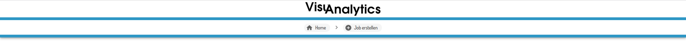
  <figcaption>Abbildung 2</figcaption>
</figure>  
<br>

Der Komponent `Header` stellt den Header der Oberfläche dar. Dieser soll durchgehend am oberen Bildschirmrand angezeigt werden. Er zeigt immer an, auf welcher Seite des Programms man sich befindet.

#### Main

```tsx
export const Main = () => {
  const component = React.useContext(ComponentContext);
  return <>{component ? <component.current.component /> : null}</>;
};
```

`Main` zeigt immer den aktuellen Komponenten an. Soll sich also die Seite beim Klicken auf einen Button verändern, so muss nur der aktuelle Komponent (`current.component`) gesetzt werden.

#### Home

```tsx
<Container maxWidth={"md"} className={classes.margin}>
    <Paper variant="outlined" className={classes.paper}>
        {..}
        <JobList/>
    </Paper>
</Container>

```

`Home` stellt die Startseite dar. Auf dieser wird eine Liste aller angelegten Jobs angezeigt. Dazu gibt es den Komponenten `JobList`.

#### JobList

```tsx
{
  jobInfo.map((j) => (
    <div key={j.id}>
      <JobItem />
    </div>
  ));
}
```

In dem Komponenten `JobList` wird für jeden angelegten Job ein Komponent von `JobItem` generiert.

#### JobItem

<figure>
  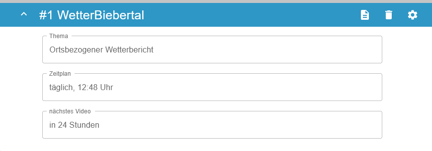
  <figcaption>Abbildung 3</figcaption>
</figure>  
<br>

Ein `JobItem` beinhaltet den Komponenten `JobInfo`, welcher die Informationen eines Jobs anzeigt, sowie den Komponenten `JobSettings`, auf welchem man Änderungen an den Einstellungen des Jobs vornehmen kann.

#### JobInfo
Der Komponent `JobInfo` beinhaltet drei Infomationen zu einem Job:

1.  Das Thema des Jobs.
2.  Der allgemeine Zeitplan, nach dem Job der Job ausgeführt wird.
3.  Die Information, wann der Job das nächste Mal ausgeführt wird.

#### JobSettings
Der Komponent `JobSettings` beinhaltet den Komponenten `SettingsPage`, welcher aus den drei Komponenten [ParamSelection](#paramselection), [ScheduleSelection](#scheduleselection) und [DeleteSelection](#deleteSelection) besteht.

#### JobCreate

Möchte man einen neuen Job erstellen, so wird beim Klicken auf den dazugehörigen Button der Komponent `JobCreate` in den `Main`-Komponenten geladen.

```ts
const components = React.useContext(ComponentContext);
onClick={() => components?.setCurrent("jobpage")}
```

Dabei handelt es sich um einen Stepper, welcher aus drei Seiten besteht.

<figure>
  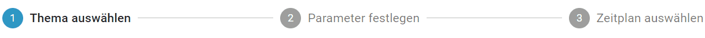
  <figcaption>Abbildung 4</figcaption>
</figure>
<br>

#### TopicSelection

Die erste Seite (`TopicSelection`) dient zur Auswahl des Themas. Zusätzlich lässt sich hier der Name für den Job festlegen.

<figure>
  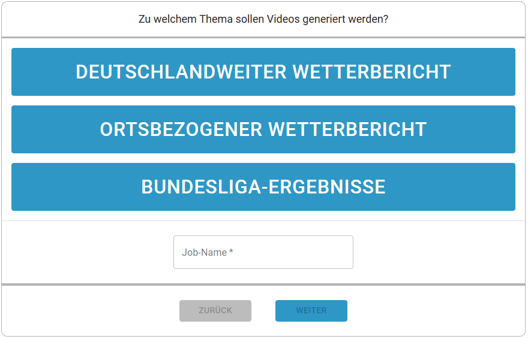
  <figcaption>Abbildung 5</figcaption>
</figure>  
<br>

#### ParamSelection

Die zweite Seite des Steppers gibt dem Nutzer die Möglichkeit, themenspezifische Parameter zu setzen. So können z.B. bei einem Wetterbericht der gewünschte Ort oder bei einer Twitter-Wordcloud die zu verwendenden Hashtags angegegeben werden.

Wie die Parameter und deren Input-Felder für jedes Thema in der Oberfläche dargestellt werden, siehe [hier](../usage/stepsConfig.html#run-config).

<figure>
  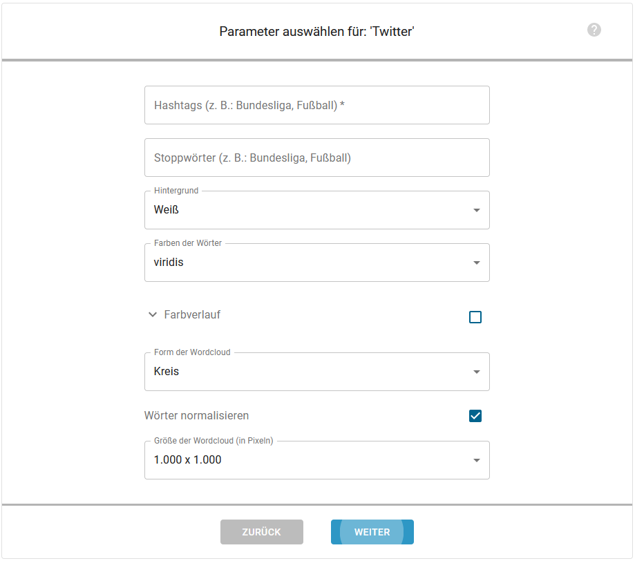
  <figcaption>Abbildung 6</figcaption>
</figure>  
<br>

#### SettingsPage
Auf der letzten Seite kann der Benutzer zwischen zwei Tabs auswählen.

- Generieren: Komponent [ScheduleSelection](#scheduleselection)
- Löschen: Komponent [DeleteSelection](#deleteselection)
  
<figure>
  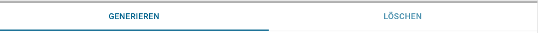
  <figcaption>Abbildung 7</figcaption>
</figure>  
<br>

#### ScheduleSelection
Auf dem ersten Tab kann der Benutzer auswählen, zu welchen Zeitpunkten das Video generiert werden soll.

Dazu gibt es folgende Optionen:

**täglich:** Das Video wird täglich zu einer ausgewählten Uhrzeit generiert.

**wöchentlich:** Das Video wird jede Woche an ausgewählten Wochentagen generiert.

**an festem Datum:** Das Video wird einmalig an einem bestimmten Datum generiert.

<figure>
  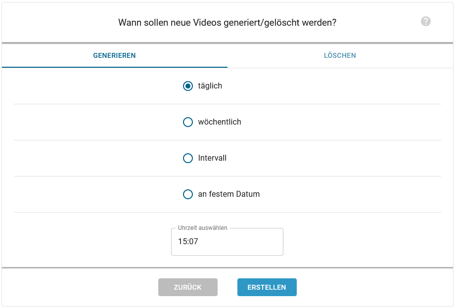
  <figcaption>Abbildung 8</figcaption>
</figure>  
<br>

#### DeleteSelection

Auf dem zweiten Tab kann der Benutzer auswählen, wann die generierten Videos wieder gelöscht werden sollen.

Dazu gibt es folgende Optionen:

**nie:** Das Video wird nie gelöscht.

**nach Zeit:** Das Video wird nach einer ausgewählten Anzahl an Tagen und Stunden gelöscht

**nach Anzahl:** Das Video wird gelöscht, sobald eine ausgewählte Anzahl an neueren Videos generiert wurden.

**feste Namen:** Wie die Option "nach Anzahl". Zusätzlich besitzt das neueste Video immer den Dateinamen: <i>Job-Name</i>. Ältere Videos besitzen
die Dateinamen <i>Job-Name</i>_1,  <i>Job-Name</i>_2, usw.

<figure>
  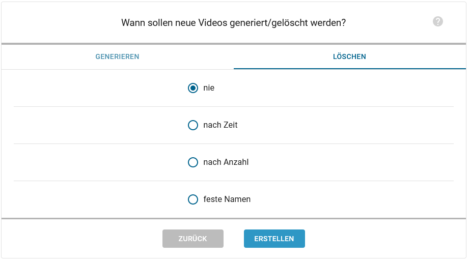
  <figcaption>Abbildung 9</figcaption>
</figure>  
<br>

## Wordpress-Plugin

[VisuAnalytics als Wordpress-Plugin verwenden](../usage/installation.html#wordpress-plugin-verwenden)

Um die in ReactJS geschriebene Benutzeroberfläche als Wordpress-Plugin zu realisieren, muss zuerst ein _Production Build_ erstellt werden. Dieses _Production Build_ komprimiert den ReactJS-Code in vier JavaScript-Dateien. 

Danach muss eine php-Datei geschrieben werden, welche aus den Dateien des Production Builds, das Wordpress-Plugin generiert.

Der Aufbau der `visuanalytics.php`-Datei wird im folgenden genauer erläutert.

### Anlegen einer Wordpress Menü-Seite
Damit das Plugin in Wordpress angezeigt wird, muss zuerst eine neue Menü-Seite erstellt werden.

<figure style="float: right;">
  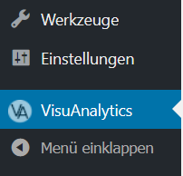
  <figcaption>Abbildung 10</figcaption>
</figure>  

`add_menu()`

Zuerst wird eine Variable für die Seite angelegt, sowie eine für das Icon, welches daneben auftauchen soll.

~~~php
global $va_settings_page;
$icon = plugins_url('images/icon.png', __FILE__);
~~~

Daraufhin wird die Seite mithilfe der von Wordpress bereitgestellten Funktion `add_menu_page` der Variablen `$va_settings_page` zugewiesen.

~~~php
add_menu_page('VisuAnalytics', 'VisuAnalytics', 'manage_options', 'visuanalytics-settings', 'visuanalytics_settings_do_page', $icon);
~~~

Da React seine Komponenten immer in den einen div-Container mit der id `root` rendert, muss der Menü-Seite noch ein solcher Container als HTML übergeben werden.
Dazu wird der Methode `add_menu_page` als fünfter Parameter eine Funktion übergeben, welche diesen div-Container übergibt.

~~~php
function visuanalytics_settings_do_page() {
  ?>
      <div id="root" />
  <?php
}
~~~

### Laden der JavaScript-Dateien in Wordpress 

`add_va_scripts`

Zuerst werden alle JavaScript-Dateien aus dem Production Build in `$files` gespeichert.
~~~php
  $files = glob(plugin_dir_path( __FILE__ ) . "/src/js/*.js");
~~~

Daraufhin wird jeder JavaScript-Datei der _basename_ und der Pfad entnommen.

~~~php
 foreach ($files as $file) {
	  $file_name = basename($file, ".js");
	  $file_url = plugins_url("src/js/" . basename($file), __FILE__);
      ...
  }
~~~

Mithilfe dieser beide Informationen werden dann die JavaScript-Dateien mithilfe der Funktion `wp_enqueue_script` in Wordpress geladen.

~~~php
  wp_enqueue_script($file_name, $file_url, array (), '', true);
~~~


`init_va_menu`

Um die Methode `add_va_scripts` auszuführen, wird in der Methode `init_va_menu` die von Wordpress bereitgestellte Methode `add_action` aufgerufen. Diese lädt entgültig die JavaScript-Dateien in das Wordpress-Plugin.

~~~php
function init_va_menu() {
  add_action( 'admin_enqueue_scripts', 'add_va_scripts' );
}
~~~

### Probleme mit dem Wordpress eigenen Style

Nach dem Laden der Dateien hatten wir das Problem, dass der Style mancher Komponenten wie z.B. der Input-Felder vom Wordpress-Style überschrieben wurden.

Um dies zu beheben, haben wir in dem Entwicklertools des Browsers rausgesucht, welche Styles geladen werden und diese nacheinander entfernt, um zu sehen, welcher unser Design überschreibt.

<figure>
  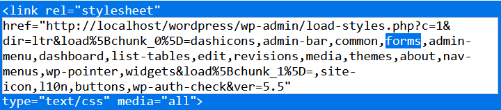
  <figcaption>Abbildung 11</figcaption>
</figure>  
<br>

Dabei ist uns aufgefallen, dass `forms` unser Design verändert. Daher haben wir mit `wp_deregister_style` diesen Style für unser Plugin deaktiviert.

~~~php
wp_deregister_style("forms");
wp_enqueue_style("forms", 'common');
~~~

Eine geneuere Dokumentation der Wordpress-Methoden finden Sie [hier](https://developer.wordpress.org/plugins/)

## Web-API

**TODO**

## Datenbank

Für die Datenbank wird eine SQLite-Datenbank verwendet.

_(Eine spätere Anbindung an einen SQL-Server ist aber einfach möglich.)_

Die Tabelle `job` beinhaltet einen Job für eine Videoreihe. Sie enthält die ID des Themas, zu dem der Job Videos generieren soll, einen Job-Namen, eine Schedule-ID, welche auf die `schedule`-Tabelle verweist sowie eine Delete-Options-ID, welche auf die `delete_options`-Tabelle verweist.

In der Tabelle `schedule` wird der Zeitplan gespeichert, nach dem der Job ausgeführt werden soll. Beispiel: Wenn der Job täglich um 12:00 Uhr ausgeführt werden soll, steht in der Datenbank:   

type = "daily",  
date = null,   
time = 12:00,  
time_interval = null,  
next_execution = null   

Falls der type "weekly" ist, werden separat in der `schedule_weekday`-Tabelle die Wochentage gespeichert, an denen der Job auszuführen ist.  

In der Tabelle `delete_options` wird gespeichert, wann generierte Videos wieder gelöscht werden sollen.

Da zu einem Job mehrere Themen gehören können, wird in der Tabelle `job_topic_position` gespeichert, welche Themen zu einem Job gehören und in welcher Reihenfolge sie in dem generierten Video aneinandergehängt werden sollen.

In der Tabelle `job_config` werden die Konfigurationswerte, die bei der Ausführung des Jobs verwendet werden, gespeichert. Diese bestehen aus Key/Value-Paaren, 
wobei zu jedem Paar der zugehörige Datentyp gespeichert wird. Da zu einem Job mehrere Themen gehören können, verweist diese Tabelle nicht direkt auf die `job`-Tabelle, sondern auf die `job_topic_position`-Tabelle - nur so kann im Nachhinein wieder ermittelt werden, zu welchen Themen welche Parameterwerte gehören.

Die `job_logs`-Tabelle enthält Log-Informationen zu mindestens ein mal ausgeführten Jobs.

Die `steps`-Tabelle enthält die zur Verfügung stehenden Themen und verweist auf die entsprechenden JSON-Konfigurations-Dateien.


<figure>
  
  <figcaption>Abbildung 12</figcaption>
</figure>  
<br>


## Scheduler

<figure>
  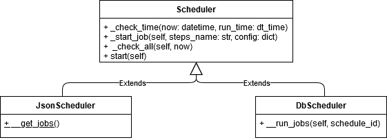
  <figcaption>Abbildung 13</figcaption>
</figure>  
<br>

Der Scheduler prüft minütlich, ob ein neuer Job ausgeführt werden soll (_Abbildung 10_).

<figure>
  
  <figcaption>Abbildung 14</figcaption>
</figure>  
<br>

Es gibt zwei Varianten des Schedulers. Der JsonScheduler prüft anhand einer Json-Datei, ob ein Job ausgeführt werden soll. Der DbScheduler hingegen entnimmt die Informationen einer Datenbank und prüft anhand dessen, ob ein Job ausgeführt werden soll.

`start()`  
Diese Methode startet den Scheduler.

`_check_all()`  
Nachdem der Scheduler gestartet wurde, wird in dieser Methode jede Minute geprüft, ob ein Job auszuführen ist. Ist dies der Fall, so wird die Methode `\_start_job()` aufgerufen.

`_start_job()`  
Diese Methode startet den Job in einem neuen Thread.

## StepData

StepData ist die Daten-Klasse, die alle Daten zur Laufzeit speichert. Außerdem stellt sie Hilfsfunktionen bereit, welche die Verwendung der Daten erleichtern. Eine Auflistung aller Funktionen befindet sich in der [Technichen Dokumentation](../modules/visuanalytics.analytics.control.procedures.html#module-visuanalytics.analytics.control.procedures.step_data).

## Themenkonfiguration

Um die Themen der Videos leicht erweiterbar zu machen, werden diese als JSON-Dateien definiert. Diese enthalten gewissermaßen eine Anleitung dafür, welche Daten von den APIs bezogen werden und wie daraus dann ein Video generiert werden soll.    
Dieser Ansatz ermöglicht es zum einen, ein neues Thema hinzuzufügen, indem einfach eine neue JSON-Datei mit der entsprechenden Konfiguration geschrieben wird, und zum anderen die Konfiguration für bestehende Themen anzupassen (z.B. wenn API-Anfragen auf Änderungen der API angepasst werden müssen).
 
Eine genaue Beschreibung der Konfigurationsdatei befindet sich [hier](../usage/stepsConfig.md).

Im Folgenden werden die verschiedenen Abschnitte der Konfigurationsdatei anhand der vordefinierten Themen beschrieben. Fals Fragen beim Lesen auftreten, sei geraten, in die oben verlinkte Anleitung zu schauen.

### API

Für die API-Anfragen gibt es folgende Möglichkeiten:

`request`  
Fragt einmal die gewünschten Daten einer API ab.

`request_multiple`  
Fragt für einen variablen Key mehrere Male gewünschte Daten einer API ab.

`request_multiple_custom`  
Fragt unterschiedliche Daten einer API ab.

Eine genaue Beschreibung der einzelnen Typen befindet sich [hier](../usage/stepsConfig.html#api).

Für die Wetterberichte werden die folgenden API-Typen verwendet:

| API-Typ              | Beschreibung                                                                                                                        |
| -------------------- | ------------------------------------------------ |
|request_multiple      |Anfrage für die Wetterdaten von mehreren Städten  |
|request               |Anfrage für die Wetterdaten von einer Stadt       |

Für den Fußballbericht werden die folgenden API-Typen verwendet:

| API-Typ               | Beschreibung                                                                                                                        |
| --------------------  | ----------------------------------------------------------------------------------------------------------------------------------- |
|request_multiple_custom|Anfrage für mehrere unterschiedliche Daten, die jeweils noch andere Parameter haben.       |
|request                |Anfrage, um z.B. die Tabelleneinträge oder die Spielergebnisse eines Spieltages abzufragen.|
|request_memory         |Zugriff auf in der internen Datenbank abgespeichertes Dictionary                           |

Für die Twitter-Wordcloud werden die folgenden API-Typen verwendet:

| API-Typ              | Beschreibung                                                                                                                        |
| -------------------- | ------------------------------------------ |
|request               |Anfrage für die Twitter-Daten zu einem Thema|

### Transform

Mit den `transform`-Typen werden Funktionen implementiert, mit denen man die aus den API-Request erhaltenen Daten transformieren kann.

Eine genaue Beschreibung aller `transform`-Typen befindet sich [hier](../usage/stepsConfig.html#transform)

**Wetterbericht**  
Für den Wetterbericht werden folgende Funktionen verwendet:

| transform-Typ        | Beschreibung                                                                                                                        |
| -------------------- | ----------------------------------------------------------------------------------------------------------------------------------- |
| transform_dict       | Führt alle angegebenen `transform`-Funktionen für alle Werte eines Dictionaries aus.                                                |
| select               | Entfernt alle Keys, die nicht in `relevant_keys` stehen aus dem Dictionary.                                                         |
| select_range         | Entfernt alle Werte aus `array_key`, die nicht in `range` sind.                                                                     |
| transform_array      | Führt alle angegebenen `transform`-Funktionen für alle Werte eines Arrays aus.                                                      |
| calculate(round)     | Rundet gegebene Werte auf eine gewünschte Nachkommastelle.                                                                          |
| append               | Speichert den Wert unter `key` in einem Array.                                                                                      |
| calculate(ms_to_kmh) | Wandelt die gegebenen Werte mit der Einheit m/s in km/h pro Stunde um -> Multiplikation mit 3.6                                                                                                                                    |
| add_symbol           | Fügt ein Zeichen, Symbol, Wort oder einen Satz zu einem Wert hinzu.                                                                 |
| replace              | Ersetzt ein Zeichen, Symbol, Wort, einen Satz oder eine ganzen Text in einem String.                                                |
| date_weekday         | Wandelt das angegebene Datum in den jeweiligen Wochentag um.                                                                        |
| timestamp            | Wandelt einen UNIX-Zeitstempel in ein anderes Format um.                                                                            |
| wind_direction       | Wandelt einen String von Windrichtungen um (geht nur für dieses Format und nur für die Weatherbit-API).                           |
| translate_key        | Setzt den Wert eines Keys zu einem neuen Key als Wert für die JSON (wählt aus dict einen Code als Key und gibt dazu den Value aus). |
| choose_random        | Wählt einen Text aus mehreren gegebenen Texten aus.                                                        |
| date_now             | Generiert das heutige Datum und gibt es im gewünschten Format aus.                                                                  |

Für den deutschlandweiten Wetterbericht werden die Wetterdaten von 19 Städten abgefragt, um eine Tendenz für die Durchschnittswerte an einem Tag zu berechnen.  
Dafür wird die `transform`-Funktion `transform_dict` verwendet. Mithilfe dieser Funktion kann in der JSON-Datenstruktur ein neuer Dictionary-Eintrag generiert werden, in dem Zusammenfassungen von Daten aus allen 19 Anfragen zu einem bestimmten Datum berechnet werden.  
Zunächst werden z.B. alle maximalen Temperaturwerte für einen Tag von allen Städten in einem Array gespeichert. Mit der `calculate_mean`-Funktion wird aus diesem Zahlen-Array der Mittelwert berechnet und anstelle des Arrays in das Dictionary geschrieben. Außerdem kann z.B. auch der Minimal- und Maximalwert eines Arrays anstelle des Arrays zu einem Key in dem Dictionary abgespeichert werden.  
Mit `calculate_mode` wird das am häufigsten in einem Array vorkommende Element anstelle des Arrays gespeichert.

**Fußball-Bundesliga**

Nachdem die Weatherbit-API erfolgreich implementiert wurde, wurde sich um die Einbindung einer neuen API gekümmert. Die neue API ist die _openligadb_-API.  
Genauer genommen wurde zunächst die Darstellung der Fußball-Bundesliga-Ergebnisse in einem Video umgesetzt. Die zuvor implementierten Funktionen konnten größtenteils übernommen werden.

Für die API-Anfrage wurde die Funktion `request_multiple_custom` (ruft die Funktion `request` mehrmals) verwendet, die zuvor noch keine Verwendung gefunden hatte. Nun sollten nämlich die Tabelle der Bundesliga und die Spiele des aktuellen Spieltages abgefragt werden, dies sind bei der API zwei verschiedene einzelne Requests. Außerdem wurde eine weitere Funktion für die API-Anfragen implementiert: `request_memory`. Diese wird dafür benötigt, zuvor abgefragte Requests zu speichern.  
Bei _openligadb_ war das Problem, dass man nur die aktuelle Tabelle abfragen konnte und keine vorherigen. Vorherige Spieltage waren allerdings kein Problem. Die vorherigen Tabellen werden dafür benötigt, um Veränderungen zwischen der vorherigen und der aktuellen Tabelle visualisieren zu können. Wenn sich zum Bespiel eine Mannschaft auf der Tabelle um einen Platz verbessert oder verschlechtert hat, kann man dies mithilfe von Pfeilen oder einem anderen dazugehörigen Text darstellen.

Die zuvor implementierten `transform`-Funktionen konnten größtenteils übernommen werden. Einige wurden verallgemeinert, ergänzt, entfernt oder zusammengefügt zu einer Funktion. Nachdem die verbesserten Funktionen getestet wurden, wurden die Änderungen auch in den JSON-Dateien der Wetterberichte eingepflegt.

Folgende `transform`-Funktionen wurden verwendet:

| transform-Typ      | Beschreibung                                                                                                  |
| ------------------ | ------------------------------------------------------------------------------------------------------------- |
| alias              | Erstzt einen Key durch einen neuen Key.                                                                       |
| transform_array    | Führt alle angegebenen `transform`-Funktionen für alle Werte eines Arrays aus.                                |
| select             | Entfernt alle Keys, die nicht in `relevant_keys` stehen, aus dem Dictionary.                                   |
| date_weekday       | Wandelt das angegebene Datum in den jeweiligen Wochentag um.                                                  |
| option             | Führt die aufgeführten `transform`-Funktionen aus, je nachdem ob ein bestimmter Wert `true` oder `false` ist. |
| compare            | Vergleicht zwei Werte miteinander.                                                                                        |
| random_string      | Wählt einen Text aus mehreren gegebenen Texten aus.                                                                                                 |
| calculate subtract | Die jeweiligen Werte, die in subtract stehen, werden von den Werten, die in key stehen, subtrahiert.          |
| copy               | Kopiert einen Wert zu einem neuen Key.                                                                        |
| delete             | Löscht die angegebenen Keys aus den Daten.                                                                     |

Folgende Änderungen wurden durchgeführt, um die Funktionen allgemeiner und modularer zu gestalten:

`ms_to_kmh` wurde zu `calculcate_multiply`.  
Mit dieser Funktion kann man beliebige Einträge von Arrays miteinander mulitplizieren oder Array-Einträge immer mit einer bestimmten Zahl oder einfach zwei Zahlen miteinander.

Außerdem wurden `calculate_divide`, `calculate_subtract` und `calculate_add` hinzugefügt, um alle vier Hauptrechenarten abzudecken.

Beispiel:

`"500": {"1": "Text1", "2": "Text2"}`

Man musste immer genau diese Anzahl an Key/Value-Paaren eintragen, um die Funktion nutzen zu können.

Dies wurde so geändert, dass dort ein Dictionary mit

`"key": ["Array"]`

anstelle von

`"key": {"key": "Dictionary"}`

steht und man aus diesem Array zufällig einen Text auswählen kann, egal wie viele Einträge das Array hat.

Beispiel:

`"500": ["Text1", "Text2"]`

Diese Funktion (`choose_random`) wurde zu `random_string` umbenannt und man kann entweder ein Dictionary oder ein Array einfügen, aus dem ein Value per Zufall ausgewählt werden soll und unter einem neuen Key in der JSON abgespeichert wird.

Bei allen Funktion, mit denen das Datumsformat geändert werden kann, wurde ergänzt, dass man z.B. aus 05. Mai -> 5. Mai machen kann, wenn `zeropaded_of` auf `True` gesetzt wird. Dieser Key ist optional.

 Die Funktionen `option` und `compare` wurden neu hinzugefügt.    
 Bei `option` wird überprüft, ob ein gewisser Wert `True` oder `False` ist und je nachdem, werden unterschiedliche Funktionen durchgeführt.  
Bei `compare` werden zwei Werte miteinander vergleichen. Je nachdem ob ein Wert gleich, größer oder kleiner als der andere Wert ist, werden unterschiedliche Funktionen durchgeführt.

Zudem wurden die Funktionen `copy` und `delete` implementiert.  
`copy` dient dazu, einen Wert von einem Key zu einem anderen Key zu kopieren.  
Die Funktion `delete` dient dazu, Werte mit dem dazugehörigen Key aus der Datenstruktur zu entfernen, falls diese nicht mehr benötigt werden.

```note::
    Mit der JSON-Konfigurationsdatei kann aktuell nur ein Video zur 1. Fußball-Bundesliga erstellt werden.
    Wenn die neue Saison anfängt, können auch Videos zur 2. Fußball-Bundesliga erstellt werden.
    
    Aktuell können die Testdaten nur zur Generierung eines Videos zur 1. Fußball-Bundesliga erstellt werden, da keine Testdaten 
    zur 2. Fußball-Bundesliga vorliegen.

    Bei der Erstellung des Videos zur 1. Fußball-Bundesliga kann aktuell nur der Spielplan für den 1. Spieltag dargestellt werden, die Tabelle ist zunächst nur alphabetisch sortiert.
    Bei der Erstellung des Videos zur 2. Fußball-Bundesliga tritt ein Fehler auf, da in openligadb noch nicht alle Mannschaften aufgeführt sind.
    Wenn der 1. Spieltag allerdings gespielt wurde, sollte auch ein Video der 2. Fußball-Bundesliga erstellt werden können.

    Da die Datei `football.json` bisher nur auf 18 Mannschaften ausgelegt ist, können keine Videos zu Ligen mit mehr oder 
    weniger Mannschaften erstellt werden. Sollen auch Videos für andere Ligen erstellt werden können, so muss dafür eine eigene JSON-Datei zusammengestellt werden.
```
**Twitter-Wordcloud**

Die Daten aus der Twitter-API werden dafür verwendet eine Wordcloud zu generieren.
Um an die Daten für die Wordclouds zu kommen, werden eine oder mehrere API-Anfragen gesendet, welche die zugrundeliegenden 
Hashtags enthalten. Als Antwort erhält man unter anderem alle Twitter-Beiträge, in denen die gesuchten Hashtags innerhalb 
der letzten sieben Tage verwendet wurden. Die API-Antwort wird so verkürzt, dass sie nur noch die Hashtags enthält, die 
neben mindestestens einem der gesuchten Hashtags in den Posts verwendet wurden. Aus diesen Hashtags werden dann 
letztendlich die Wordclouds erstellt.

Mithilfe der Python-Library [Wordcloud](https://github.com/amueller/word_cloud)) wurde der Image-Typ Wordcloud ergänzt.   
Es ist möglich, verschiedene Parameter für die Wordcloud festzulegen.
Zum Beispiel kann die Wordcloud verschiedene Formen annehmen. Dafür wurden Masken für die Formen "circle" und "square" 
implementiert (siehe [Images: Wordcloud](#wordcloud)).

Die zuvor implementierten `transform`-Typen konnten für die Erstellung eines Wordcloud-Videos größtenteils nicht weiter 
verwendet werden und es mussten neue `transform`-Typen implementiert werden.
`transform_array`, `select`, `append` und `delete` konnten wiederverwendet werden.

Folgende `transform`-Typen wurden verwendet:

| transform-Typ    | Beschreibung                                                                                                                                                                                  |
| ---------------- | --------------------------------------------------------------------------------------------------------------------------------------------------------------------------------------------- |
| split_string     | Teilt einen String an der Stelle, an der ein bestimmtes Trennzeichen (delimiter) im String vorkommt.                                                                                          |
| convert          | Konvertiert einen Datentyp in einen anderen Datentyp.                                                                                                                                         |
| transform_array  | Durchläuft ein bestimmtes Array, um bestimmte Daten transformieren zu können.                                                                                                                 |
| delete           | Entfernt Key/Value-Paare, die nicht relevant für die Erstellung der Wordcloud sind.                                                                                                           |
| remove_from_list | Entfernt Wörter aus einer Liste.                                                                                                                                                              |
| option           | transform-Typen, die durchgeführt werden, wenn ein gewisser Wert true bzw. false ist.                                                                                                         |
| most_common      | Zählt, wie oft ein Wort vorkommt, und sortiert diese Liste (mit bzw. ohne die Zahl).                                                                                                            |
| sub_lists        | Erstellt aus einer großen Liste eine oder mehrere kleinere Listen, die nur einen Teil der großen Liste repräsentieren.                                                                     |
| to_dict          | Wandelt ein Array aus Tupeln in ein Dictionary um.                                                                                                                                            |
| length           | Gibt die Länge eines Ararys bzw. einer Liste aus.                                                                                                                                             |
| join             | Erstellt aus den Elementen einer Liste einen String, indem die Elemente mit dem gewünschten Trennzeichen konkateniert werden.                                                                   |
| select           | Wählt die Key/Value-Paare aus, die relevant für die Erstellung oder die Datenverarbeitung für die Wordcloud sind.                                                                             |
| append           | Fügt den Daten weitere Key/Value-Paare hinzu.                                                                                                                                                 |
| normalize_words  | Wörter, die mehrmals in einer Liste vorkommen und sich nur in Groß-/Kleinschreibung unterscheiden, werden ersetzt durch das erste in der Liste vorkommende Wort. |

**Wordcloud-Parameter**

Es gibt verschiedene Parameter, die man beim Erstellen einer Wordcloud setzen kann. Diese betreffen u.a. die Größe der Wordcloud, den Hintergrund sowie die Schrift.   
 Möchte man anstatt eines einfarbigen Hintergrunds ein Bild verwenden, lässt sich dies in der JSON-Datei durch den Overlay-Typ "image" einstellen.
Die verschiedenen Parameter werden in der [Dokumentation zur Themenkonfiguration](../usage/stepsConfig.html#wordcloud) genauer erläutert. Zum Teil wurden die Default-Parameter als solche übernommen (Quelle: [https://www.datacamp.com/community/tutorials/wordcloud-python](https://www.datacamp.com/community/tutorials/wordcloud-python)).
Andere Default-Parameter wurden angepasst. Die Schriftart sollte die gleiche sein, wie sie in den Wetterberichten und dem Fußball-Bericht auch verwendet wurde.

### Processing

#### Audio

Im Audio-Abschnitt können beliebig viele Texte angegeben werden, welche in Audios übersetzt werden.
Eine Audio-Datei besteht in der Regel aus mehreren Parts, welche beim Programmdurchlauf dann zu einem Text zusammengesetzt werden.  
In der Regel erzeugt man für jedes erstellte Bild eine Audio-Datei, d.h., wenn es `Football_Image_1`-`Football_Image_7` gibt, so sollte es auch `Football_Audio_1` bis `Football_Image_7` geben. Dies dient dazu, dass im Sequence-Abschnitt jeder Audio-Datei eine Video-Datei zugeordnet werden kann.
Möchte man dies anders machen, muss im Sequence-Abschnitt der Typ `custom` gewählt werden.

### Images

Im Image-Part können ebenso beliebig viele Bilder generiert werden. 
Es gibt derzeit zwei verschiedene Image-Typen zur Bilderzeugung:

#### Pillow
Die meisten Videos in unseren Bildern werden mit dem Bildbearbeitungs-Tool Pillow erstellt.   
Folgende Typen stehen zur Bildbearbeitung mit Pillow bereit:  
Texte und Bilder lassen sich mithilfe der beiden `overlay`-Typen `Text` sowie `Image` in ein Bild einfügen.  
Zusätzlich gibt es noch die Typen `Image-Array` und `Text-Array`. Diese dienen lediglich dazu, mehrere Texte/Bilder, die sich ähneln, leichter in ein Bild einzufügen.   
Möchte man nur etwas auf das Bild schreiben, wenn eine Bedingung erfüllt ist, eignet hier der `option`- sowie der `compare`-Typ.

Eine genaue Beschreibung befindet sich [hier](../usage/stepsConfig.html#pillow)

#### Wordcloud
Neben Bildern, die mithilfe von Pillow erzeugt werden, können auch Wordclouds generiert und in das Video eingebunden werden.   
Der Hintergrund kann einfarbig sein, es lässt sich aber auch ein Hintergrundbild verwenden. Hierfür kann der overlay-Typ 
"image" verwendet werden.

Eine Wordcloud zum Thema Bundesliga sieht folgendermaßen aus:

<figure>
  
  <figcaption>Abbildung 15: Wordcloud zum Thema Bundesliga (mit "figure": "circle")</figcaption>
</figure>  
<br>

<figure>
  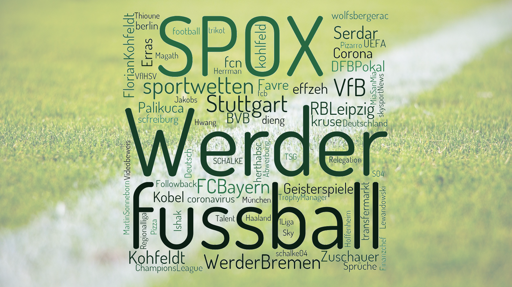
  <figcaption>Abbildung 16: Wordcloud zum Thema Bundesliga (mit "figure": "square")</figcaption>
</figure>  
<br>

Die Wörter, die zu sehen sind, sind die Hashtags, die am häufigsten neben dem gesuchten Hashtag (im obigen Fall "Bundesliga") verwendet wurden.
Das Wort, welches am häufigsten als Hashtag verwendet wurde, ist das Wort, welches am größten dargestellt ist. Das Wort, 
welches am seltensten als Hashtag verwendet wurde, ist das Wort, welches am kleinsten dargestellt ist.

Um das Auftauchen bestimmter Wörter in der Wordcloud zu verhindern, lassen sich Stopwords definieren. Dafür ist global 
eine Textdatei im resources-Ordner hinterlegt. Diese Textdatei enthält eine Liste von Stopwords, die man beim 
Erstellen der Wordcloud optional noch aus der Wordcloud ausschließen kann.   
Zusätzlich können über das Frontend Stopwords gesetzt werden, welche nur für bestimmte Videos gelten sollen.    
Des Weiteren kann eingestellt werden, dass Groß- und Kleinschreibung beim Prüfen der Stopwords keine Rolle spielen sollen.

Möchte man einen Wordcloud-Verlauf darstellen, müssen einzelne Wordclouds erstellt werden: Also das Wort, welches am 
häufigsten vorkommt, dann kommt das zweithäufigste Wort hinzu und so weiter. Bis am Ende eine Worcloud mit allen Wörtern 
dargestellt wird. Die einzelnen Wordclouds werden dann im Sequence-Schritt aneinandergehängt.

In dem Verlauf, welcher mit der [twitter.json](https://github.com/SWTP-SS20-Kammer-2/Data-Analytics/blob/master/src/visuanalytics/resources/steps/twitter.json)
erstellt wird, werden Wordclouds mit jeweils den ersten x (x = 1, 2, 3, 4, 5, 6, 7, 8, 9, 10, 15, 20, 25, alle) Wörtern, die am 
häufigsten vorkommen, erstellt und aneinandergereiht.


```note::
Eine genaue Beschreibung zur Verwendung der Wordcloud befindet sich [hier](../usage/stepsConfig.html#wordcloud)
```

```note::
Die hier beschriebenen Abschnitte bilden nicht den Gesamtumfang der Themenkonfiguration ab. Eine genaue Beschreibung aller Abschnitte befindet sich [hier](../usage/stepsConfig.md)
```