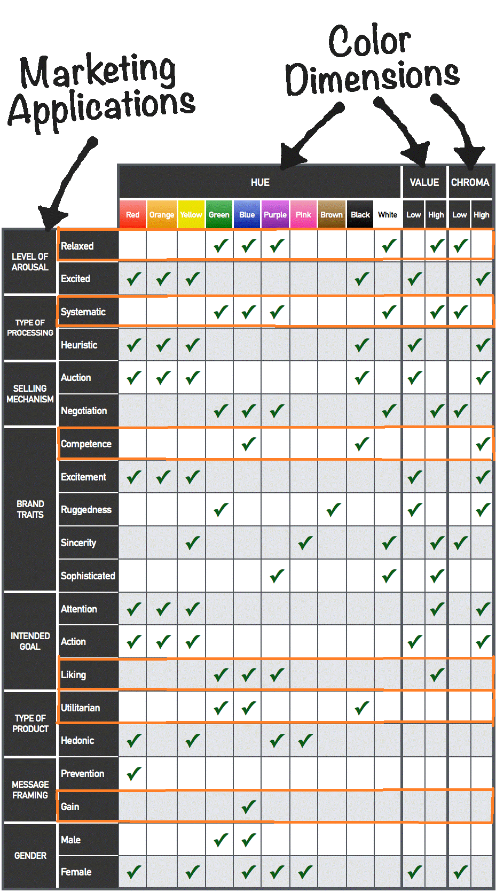
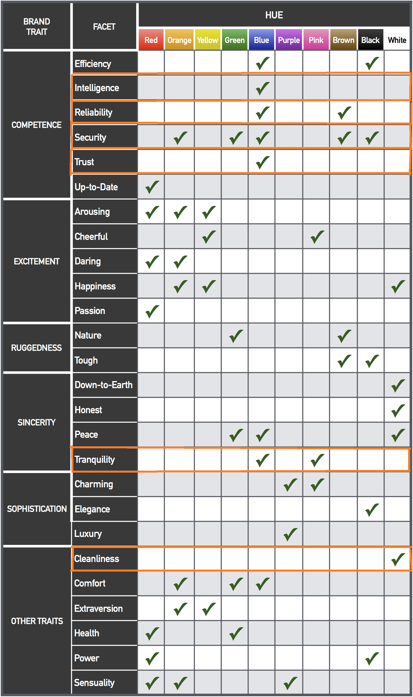

# **Erläuterungen zum Farbdesign**
* Wahl der Grundfarbe nach Nick Kolenda
* Anwenden der Farbe auf Material Design, Suche nach zweitem Farbton
* Ideen mit Orange, Entscheidung für Grün
* verschiedene Entwürfe darstellen

In der Planungsphase unseres Projektes legten wir im Frontend-Team besonderen Wert darauf, parallel zu den Mock-Ups ein Farbschema zu wählen, welches im gesamten Projekt Verwendung finden sollte.

Der erste Ansatzpunkt war dabei für uns der Artikel [*"Color Psychology: A Full Guide"*](https://www.nickkolenda.com/color-psychology/) von Nick Kolenda (Autor im Bereich Psychologie und Marketing), in welchem sehr ausführlich psychologische Prinzipien hinter der Wahrnehmung von Farben präsentiert werden. Neben den theoretischen Grundlagen stellt er dabei auch Tabellen zur Verfügung, mit denen man durch die Zuordnung von Attributen zur eigenen Applikation Einschätzungen erhält, welche Farben aus wissenschaftlicher Sicht sinnvoll wären.

Die Auswertung der Tabellen gestaltete sich dabei wie folgt:

Vor allem wegen der Attribute Intelligenz, Zuverlässigkeit und Sicherheit, die maßgeblich für den Charakter unserer Anwendung sind, aber auch wegen der sachlich-funktionalen und vom Gedanken des Anbietens neuer Möglichkeiten geprägten Zielsetzung wurde für unsere Anwendung hier blau als sinnvolle Farbwahl dargestellt, sodass wir beim Entwurf unserer Designs diese Grundfarbe gewählt haben. Während im alten Frontend des Projektes quasi nur blau genutzt wurden wollten wir dieses um eine weitere Farbe ergänzen.

Grund dafür ist der Einsatz des CSS-Frameworks MaterialUI, den wir fortsetzen wollten. MaterialUI dient zur Umsetzung des Systems [Material Design](https://material.io/design) von Google. Dieses baut grundsätzlich darauf auf, dass es neben einer Primärfarbe (bei uns ein Blauton) eine sich von dieser abhebende Sekundärfarbe gibt, mit der man einzelne UI-Elemente hervorhebt oder Überschriften gestaltet.
Typische Wahl ist eine Komplementärfarbe, diese wäre bei Blau ein Orange bis braun (je nach Helligkeit). Mit dieser Farbgestaltung waren wir als Team jedoch nicht zu frieden, da sie uns nicht harmonisch genug erschien.

Als Lösung haben wir stattdessen einem analogen Farbton gewählt, mit dem wir in unseren Entwürfen sehr zufrieden waren: Grün. Dabei entstanden die beiden folgenden Entwürfe für eine hellere und eine dunklere Farbvariante:

Zu Primär- und Sekundärfarbe gehören jeweils noch eine helle und eine dunkle Farbvariante. Zur Bestimmung dieser haben wir das [Material Color Tool](https://material.io/resources/color/#!/?view.left=0&view.right=0) genutzt, welches Google bereitstellt. Hier gibt man die eigene Primär- und Sekundärfarbe an und erhält dazu automatisch die passenden Varianten.

Ein bei der Farbwahl weiterhin extrem wichtiger Punkt ist die Barrierefreiheit, der wir uns in unseren Qualitätsanforderungen verschrieben haben. Das wichtigste ist hier im Grunde, dass die Bedeutung von Dingen nicht alleine anhand der Farbe zu erkennen sein darf und dass definierte Kontrastwerte eingehalten werden. Das Material Color Tool bietet hier eine Prüfung von weißem und schwarzen Text auf den eigenen Farben - im Zweifelsfall nutzen wir zur Prüfung aber den [WEBAIM Contrast Checker](https://webaim.org/resources/contrastchecker/), welcher für eine Farbkombination die Kompatibilität mit WCAG 2.1 prüft. Von uns wird hier das Level AA angestrebt.

