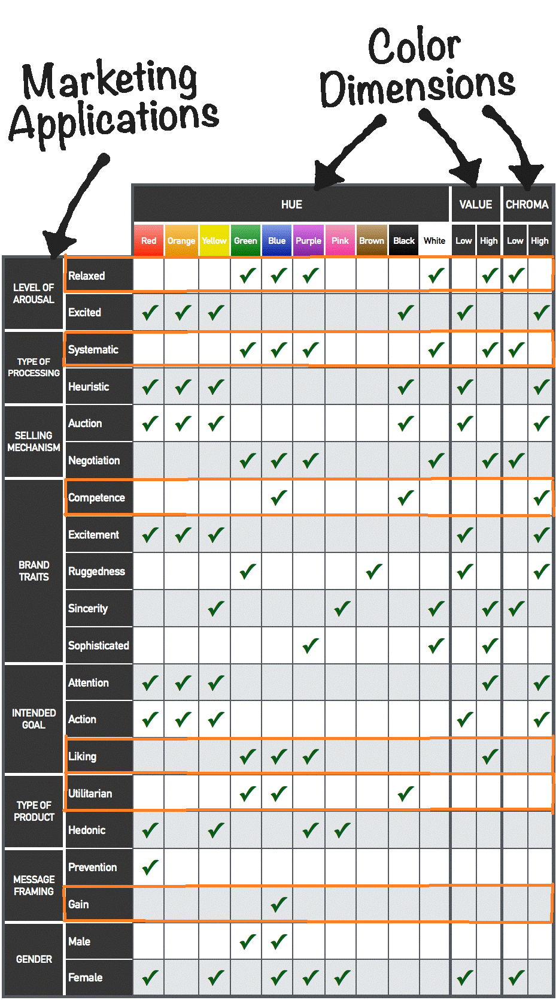
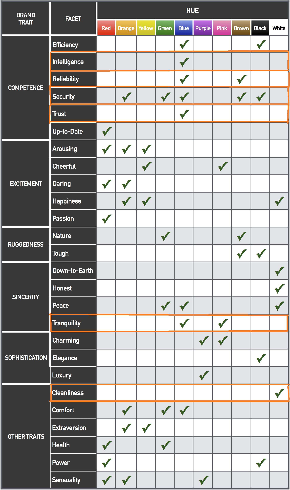

<div style="width: 75%; margin: auto; text-align: center;">
    <p style="font-size: 50px; font-weight: bold;">VisuAnalytics 2.0</p>
    <br>
    <p style="font-size: 30px; font-weight: bold;">Dokumentation des Frontends</p>
    <br><br>
    <p style="font-size: 20px;">Softwaretechnik-Projekt - Sommersemester 2021</p>
    <p style="font-size: 20px;">Prof. Dr. Frank Kammer</p>
    <p style="font-size: 20px;">Technische Hochschule Mittelhessen</p>
    <br><br>
    <p style="font-size: 18px; width: 80%; margin: auto;"><strong>Daniel Spengler, Tristan Elias Wolfram, Philipp Helfenritter, Janek Berg, Sören Clausen, Tim Wolfgang Helmut Schwabe</strong></p>
</div>

<div style="page-break-after: always;"></div>

# Inhaltsverzeichnis

### **Infoprovider-Erstellung**
* 1. [**CreateInfoProvider**](#CreateInfoProvider)
	* 1.1. [**Verwaltung des aktuellen Schritts**](#VerwaltungdesaktuellenSchritts)
	* 1.2. [**Verwaltung des States**](#VerwaltungdesStates)
	* 1.3. [**Wiederherstellung des Fortschritts beim Neuladen**](#WiederherstellungdesFortschrittsbeimNeuladen)
	* 1.4. [**Styles**](#Styles)
* 2. [**AuthDataDialog**](#AuthDataDialog)
	* 2.1. [**Verwaltung und Vorbereitung in CreateInfoProvider**](#VerwaltungundVorbereitunginCreateInfoProvider)
	* 2.2. [**Darstellung in AuthDataDialog**](#DarstellunginAuthDataDialog)
* 3. [**StepFrame**](#StepFrame)
* 4. [**TypeSelection**](#TypeSelection)
* 5. [**BasicSettings**](#BasicSettings)
	* 5.1. [**Prüfung auf Notwendigkeit erneuter API-Abfragen**](#PrfungaufNotwendigkeiterneuterAPI-Abfragen)
	* 5.2. [**Anpassungen bei nachträglichen Namensänderungen**](#AnpassungenbeinachtrglichenNamensnderungen)
* 6. [**DataSelection**](#DataSelection)
	* 6.1. [**transformJSON**](#transformJSON)
	* 6.2. [**Generieren der Darstellung**](#GenerierenderDarstellung)
	* 6.3. [**Umsetzung von Lösch-Abhängigkeiten**](#UmsetzungvonLsch-Abhngigkeiten)
* 7. [**DataCustomization**](#DataCustomization)
* 8. [**ArrayProcessing**](#ArrayProcessing)
	* 8.1. [**Generieren der Liste verfügbarer Arrays**](#GenerierenderListeverfgbarerArrays)
	* 8.2. [**Hinzufügen neuer Verarbeitungen**](#HinzufgenneuerVerarbeitungen)
* 9. [**CreateCustomData**](#CreateCustomData)
	* 9.1. [**Überprüfung der Syntax**](#berprfungderSyntax)
	* 9.2. [**Interne Darstellung**](#InterneDarstellung)
	* 9.3. [**"Zurück" und "Löschen"**](#ZurckundLschen)
	* 9.4. [**Das Löschen einer Formel**](#DasLscheneinerFormel)
	* 9.5. [**Abschließende Überprüfungen**](#Abschlieendeberprfungen)
* 10. [**StringProcessing**](#StringProcessing)
	* 10.1. [**Bestimmung geeigneter Strings**](#BestimmunggeeigneterStrings)
	* 10.2. [**Erstellen neuer Verarbeitungen**](#ErstellenneuerVerarbeitungen)
* 11. [**HistorySelection**](#HistorySelection)
	* 11.1. [**HistoryDataSelection**](#HistoryDataSelection)
	* 11.2. [**HistoryScheduleSelection**](#HistoryScheduleSelection)
		* 11.2.1. [**WeekdaySelector**](#WeekdaySelector)
* 12. [**SettingsOverview**](#SettingsOverview)
	* 12.1. [**ScheduleTypeTable**](#ScheduleTypeTable)
	* 12.2. [**Löschen von Datenquellen**](#LschenvonDatenquellen)
* 13. [**DiagramCreation**](#DiagramCreation)
	* 13.1. [**Disclaimer**](#Disclaimer)
	* 13.2. [**State-Inhalte**](#State-Inhalte)
	* 13.3. [**Datentypen zum Speichern von Konfigurationen**](#DatentypenzumSpeichernvonKonfigurationen)
	* 13.4. [**Bestimmung von mit Diagrammen kompatibler Daten**](#BestimmungvonmitDiagrammenkompatiblerDaten)
	* 13.5. [**Erstellen von Diagramm-Previews**](#ErstellenvonDiagramm-Previews)
	* 13.6. [**Anzeige der einzelnen Schritte**](#AnzeigedereinzelnenSchritte)
	* 13.7. [**weitere Hilfsmethoden**](#weitereHilfsmethoden)
* 14. [**DiagramOverview**](#DiagramOverview)
* 15. [**DiagramTypeSelect**](#DiagramTypeSelect)
* 16. [**ArrayDiagramCreator**](#ArrayDiagramCreator)
* 17. [**HistorizedDiagramCreator**](#HistorizedDiagramCreator)
* 18. [**BasicDiagramSettings**](#BasicDiagramSettings)
* 19. [**CustomLabels**](#CustomLabels)
* 20. [**Senden eines Infoproviders an das Backend**](#SendeneinesInfoprovidersandasBackend)
	* 20.1. [**Überblick über das Datenformat**](#berblickberdasDatenformat)
* 21. [**Datenquellen-Format**](#Datenquellen-Format)
	* 21.1. [**Methode zur Generierung**](#MethodezurGenerierung)
* 22. [**Diagramm-Datenformat**](#Diagramm-Datenformat)
### **Infoprovider-Bearbeitung**
* 1. [**EditInfoProvider**](#EditInfoProvider)
* 2. [**EditSettingsOverview**](#EditSettingsOverview)
	* 2.1. [**Hinzufügen von neuen Datenquellen**](#HinzufgenvonneuenDatenquellen)
		* 2.1.1. [**finishNewDataSource und cancelDataSourceCreation**](#finishNewDataSourceundcancelDataSourceCreation)
		* 2.1.2. [**Prüfen auf Namensduplikate**](#PrfenaufNamensduplikate)
* 3. [**EditBasicSettings**](#EditBasicSettings)
* 4. [**EditDataSelection**](#EditDataSelection)
* 5. [**EditDataCustomization**](#EditDataCustomization)
* 6. [**EditCustomData**](#EditCustomData)
	* 6.1. [**Liste der Formeln**](#ListederFormeln)
		* 6.1.1. [**Löschen von Formeln**](#LschenvonFormeln)
	* 6.2. [**Bearbeiten von Formeln**](#BearbeitenvonFormeln)
### **Dashboard**
* 1. [**InfoProviderOverview**](#InfoProviderOverview)
	* 1.1. [**Neuer Infoprovider**](#NeuerInfoprovider)
	* 1.2. [**Liste der erstellten Infoprovider**](#ListedererstelltenInfoprovider)
		* 1.2.1. [**Laden der Infoprovider aus dem Backend**](#LadenderInfoproviderausdemBackend)
		* 1.2.2. [**Infoprovider löschen**](#Infoproviderlschen)
		* 1.2.3. [**Infoprovider bearbeiten**](#Infoproviderbearbeiten)
* 2. [**SceneOverview**](#SceneOverview)
	* 2.1. [**Neue Szene**](#NeueSzene)
	* 2.2. [**Liste der erstellten Szenen**](#ListedererstelltenSzenen)
		* 2.2.1. [**Laden der Ressourcen**](#LadenderRessourcen)
	* 2.3. [**Löschen einer Szene**](#LscheneinerSzene)
	* 2.4. [**Bearbeiten einer Szene**](#BearbeiteneinerSzene)
* 3. [**VideoOverview**](#VideoOverview)
	* 3.1. [**Neues Video**](#NeuesVideo)
	* 3.2. [**Liste der erstellten Videos**](#ListedererstelltenVideos)
		* 3.2.1. [**Laden der Ressourcen**](#LadenderRessourcen-1)
	* 3.3. [**Löschen eines Videos**](#LscheneinesVideos)
	* 3.4. [**Bearbeiten eines Videos**](#BearbeiteneinesVideos)
* 4. [**LogDialog**](#LogDialog)
	* 4.1. [**Das Interface**](#DasInterface)
	* 4.2. [**States**](#States)
	* 4.3. [**Aufbau der Komponente**](#AufbauderKomponente)
### **Szeneneditor**
* 1. [**SceneCreation**](#SceneCreation)
	* 1.1. [**Auswahl der verschiedenen Schritte**](#AuswahlderverschiedenenSchritte)
	* 1.2. [**Bilder, Hintergrundbilder und Diagramme**](#BilderHintergrundbilderundDiagramme)
		* 1.2.1. [**Wiederherstellung der Bilder beim Neuladen**](#WiederherstellungderBilderbeimNeuladen)
* 2. [**InfoProviderSelection**](#InfoProviderSelection)
	* 2.1. [**Darstellung der verfügbaren Infoprovider**](#DarstellungderverfgbarenInfoprovider)
	* 2.2. [**Verarbeitung der Infoprovider-Daten**](#VerarbeitungderInfoprovider-Daten)
* 3. [**Szenen-Erstellung (SceneEditor)**](#Szenen-ErstellungSceneEditor)
	* 3.1. [**Canvas**](#Canvas)
		* 3.1.1. [**Datentypen**](#Datentypen)
		* 3.1.2. [**States für die Verwaltung**](#StatesfrdieVerwaltung)
		* 3.1.3. [**Transformer**](#Transformer)
		* 3.1.4. [**Transformation von Elementen**](#TransformationvonElementen)
	* 3.2. [**"Bedienfeld"**](#Bedienfeld)
	* 3.3. [**Datenauswahl**](#Datenauswahl)
		* 3.3.1. [**API-Texte**](#API-Texte)
		* 3.3.2. [**ImageLists**](#ImageLists)
		* 3.3.3. [**DiagramList**](#DiagramList)
		* 3.3.4. [**Hinzufügen von Bildern auf dem Canvas**](#HinzufgenvonBildernaufdemCanvas)
	* 3.4. [**Speichern der Szene**](#SpeichernderSzene)
* 4. [**Editierung von Szenen**](#EditierungvonSzenen)
	* 4.1. [**Besonderheit in der sessionStorage-Verwendung**](#BesonderheitindersessionStorage-Verwendung)
	* 4.2. [**Vorbereitung der Backend-Daten**](#VorbereitungderBackend-Daten)
	* 4.3. [**Identifikation der korrekten Bilder**](#IdentifikationderkorrektenBilder)
	* 4.4. [**Absenden der bearbeiteten Szene**](#AbsendenderbearbeitetenSzene)
### **Videojob**
* 1. [**VideoCreation**](#VideoCreation)
	* 1.1. [**Fetch-Methoden**](#Fetch-Methoden)
* 2. [**InfoProviderSelection**](#InfoProviderSelection)
	* 2.1. [**Laden der verfügbaren Infoprovider**](#LadenderverfgbarenInfoprovider)
	* 2.2. [**Auswahlliste der Infoprovider**](#AuswahllistederInfoprovider)
	* 2.3. [**Abfragen aller Infoprovider vom Backend**](#AbfragenallerInfoprovidervomBackend)
	* 2.4. [**Laden aller Szenen**](#LadenallerSzenen)
* 3. [**VideoEditor**](#VideoEditor)
	* 3.1. [**Grundlegende Oberfläche und States**](#GrundlegendeOberflcheundStates)
	* 3.2. [**SceneContainer**](#SceneContainer)
		* 3.2.1. [**Änderungen an einzelnen Szenen vornehmen**](#nderungenaneinzelnenSzenenvornehmen)
		* 3.2.2. [**Tausch-Effekt**](#Tausch-Effekt)
		* 3.2.3. [**Erläuterungen zum Test von Drag-And-Drop-Bibliotheken**](#ErluterungenzumTestvonDrag-And-Drop-Bibliotheken)
	* 3.3. [**SceneCard**](#SceneCard)
		* 3.3.1. [**State-Updates für Anzeigedauer**](#State-UpdatesfrAnzeigedauer)
	* 3.4. [**EditTextDialog**](#EditTextDialog)
		* 3.4.1. [**Speichern und Abbrechen der TTS-Bearbeitung**](#SpeichernundAbbrechenderTTS-Bearbeitung)
		* 3.4.2. [**Anzeigen und Hinzufügen von API-Daten**](#AnzeigenundHinzufgenvonAPI-Daten)
* 4. [**ScheduleSelection**](#ScheduleSelection)
* 5. [**Senden der Daten an das Backend**](#SendenderDatenandasBackend)
	* 5.1. [**images-Objekt**](#images-Objekt)
	* 5.2. [**audios-Objekt**](#audios-Objekt)
* 6. [**Editierung von Videos**](#EditierungvonVideos)
### **Farbdesign**
* 1. [**Erläuterungen zum Farbdesign**](#ErluterungenzumFarbdesign)
<div style="page-break-after: always;"></div>

# **Infoprovider-Erstellung**
Die Komponentenstruktur der Anwendung ist in diesem Abschnitt wie folgt aufgebaut:

<div style="page-break-after: always;"></div>

##  1. <a name='CreateInfoProvider'></a>**CreateInfoProvider**
Die Komponente `CreateInfoProvider` stellt die umschließende Wrapper-Komponente für die gesamte Info-Provider-Erstellung dar, von der aus die restlichen Komponenten für die einzelnen Schritte der Erstellung geladen werden.

###  1.1. <a name='VerwaltungdesaktuellenSchritts'></a>**Verwaltung des aktuellen Schritts**
Dazu enthält der State der Komponente die Variable `createStep`, welche als Zahlwert von 0-5 repräsentiert, in welchem der 6 Schritte sich der Nutzer gerade befindet.

Diese Variable wird in der Methode `selectContent(step: number)` in einem switch-case-Statement verarbeitet, in welchem für jeden der möglichen Schritt 0-5 ein case existiert, welcher die passende Komponente zurückgibt. Die Methode wird letztendlich innerhalb des `return`-Statements aufgerufen, welches das eigentliche Rendering bestimmt.

`createStep` wird über die beiden Methoden `handleContinue()` und `handleBack()` inkrementiert bzw. dekrementiert, diese Methoden werden alle als *props* an die dargestellten Komponenten übergeben, sodass diese sie in ihren Buttons "weiter" und "zurück" nutzen können.
* Von einem Rendern dieser Buttons aus `CreateInfoProvider` heraus wurde abgesehen, da die einzelnen Unter-Komponenten zusätzlich noch eigene Logik wie das Absenden von Daten an das Backend an den Button binden müssen.

Zur Visualisierung des Schritts wird die von MaterialUI zur Verfügung gestellte `Stepper`-Komponente genutzt, welche das Array `steps` als Datengrundlage mit Beschriftungen sowie `createStep` für den aktuellen Schritt erhält.
<br></br>

###  1.2. <a name='VerwaltungdesStates'></a>**Verwaltung des States**
Alle vom Nutzer eingegebenen Daten müssen am Ende des Vorgangs in einem JSON-Objekt zusammengefasst werden, um dieses an das Backend (Endpunkt: */infoprovider*) zu senden. Da das Senden in dieser Wrapper-Komponente erfolgen sollte haben wir uns entschieden, alle Datenwerte der Eingabe auch im State dieser Komponente zu verwalten.

In `selectContent` werden dann jeweils als *props* alle für die Komponente notwendigen Datenwerte und Setter-Methoden übergeben, diese ändert dann den State basierend auf den Nutzer-Eingaben.
<br></br>

###  1.3. <a name='WiederherstellungdesFortschrittsbeimNeuladen'></a>**Wiederherstellung des Fortschritts beim Neuladen**
Ein für uns sehr wichtiger Aspekt der UX war, dass bei einem Neuladen der Seite die bisherigen Eingaben nicht verloren gehen, da der Vorgang im Vergleich zu einem "typischen" Formular deutlich mehr Eingaben umfasst. Bei einem Verlust des Fortschritts durch Neuladen würde man auch den vom Backend gelieferten Datensatz der API-Abfrage verlieren. Daher haben wir uns für eine Implementierung entschieden, bei der die Daten im Browser gespeichert und beim Neuladen wiederhergestellt werden.
* Javascript/Typescript bietet dafür zwei Lösungen: `localStorage` und `sessionStorage`. Während der localStorage bis zum Schließen des Browsers erhalten bleibt gilt der sessionStorage nur, bis der Tab geschlossen ist.
* Damit ein Schließen des Tabs einem Neustart ermöglicht haben wir `sessionStorage` gewählt.
    * In der Komponente wird per *useEffect*-Hook bei einer Änderung einer State-Variable der neue Wert in den sessionStorage abgelegt, beim erneuten Laden der Komponente wird durch eine *useEffect*-Hook, die nur zu diesem Zeitpunkt ausgeführt wird der State aus dem sessionStorage geladen.
* Ein Problem stellt jedoch die Sicherheit dar, da der sessionStorage ein einfaches JS-Objekt mit Key-Value-Paaren ist, dass überall aus Javascript zugänglich ist. Es gilt daher als kein sicherer Speicher. Da wir insbesondere auf die Sicherheit des API-Key großen Wert legen, haben wir dieses sensible Datum aus der Speicherung ausgeschlossen. Der Nutzer muss daher die Authentifizierungsdaten der Datenquellen erneut eingeben, dennoch erachten wir dies als bessere Lösung, als einen vollständigen Datenverlust.
    * Eine Erweiterung, die den Schlüssel sicher im Backend ablegt wäre möglich.
    * Als Warnung vor dem Verlust von Daten wird in **CreateInfoProvider** beim Laden der Komponente per **useEffect** ein Event-Handler für *beforeunload* definiert - dieses Event tritt beim Verlassen oder Neuladen der Seite auf. Mit **preventDefault()** und **returnValue=""** wird das Neuladen verhindert und ein Alert angezeigt, in dem der Nutzer dieses Bestätigen muss.
        * Leider bieten moderne Browser nicht die Möglichkeit individualisierter Nachrichten, sodass wir nicht explizit angeben können, welche Daten verloren gehen.
        * Durch eine im gleichen **useEffect** definierte Cleanup-Methode wird der Handler beim Unmounten von **CreateInfoProvider** entfernt.
    * Die Methode **checkKeyExistence()** wird aufgerufen um zu entscheiden, ob die Warnung notwendig ist. Sie durchsucht die aktuelle und alle bisherigen Datenquellen nach Authentifizierungsdaten, die man verlieren würde. Nur wenn solche existieren gibt sie *true* zurück, sodass der Alert angezeigt wird.
* Damit keine Kollisionen mit Datenwerten anderer Webseiten auftreten haben wir an alle Keys eine zufällig generierte ID `uniqueID` angehängt, die im Normalfall für Kollisionsfreiheit sorgen sollte.
* Beim Beenden des Vorgangs wird über `handleSuccess`, welches bei einer erfolgreichen Info-Provider-Erstellung ausgelöst wird, der Speicher geleert.
<br>

###  1.4. <a name='Styles'></a>**Styles**
In der Datei **styles.tsx** ist auf Ebene von `CreateInfoProvider` eine Datei angelegt, die die CSS-Klassen für alle Komponenten dieses Schrittes enthält. Dies ist insbesondere sinnvoll, da sich viele Komponenten die gleichen Style-Eigenschaften teilen. Alle Komponenten greifen für ihre Styles auf diese Datei zu.

<div style="page-break-after: always;"></div>

##  2. <a name='AuthDataDialog'></a>**AuthDataDialog**
Im vorherigen Abschnitt wurde bereits darauf eingegangen, dass wir beim Neuladen der Seite die eingegebenen Daten wiederherstellen, die API-Authentifizierungsdaten jedoch nicht im sessionStorage gespeichert werden können. Daher gibt es die Komponente **AuthDataDialog**, welche ein Dialog-Element ist, in dem der Nutzer nach dem Neuladen der Seite seine Daten erneut eingeben muss.

###  2.1. <a name='VerwaltungundVorbereitunginCreateInfoProvider'></a>**Verwaltung und Vorbereitung in CreateInfoProvider**
Grundsätzlich gilt, dass die API-Authentifizierungsdaten (State-Variablen **apiKeyInput1** und **apiKeyInput2**) nicht in **dataSources** abgelegt werden, da dieses im sessionStorage gespeichert wird. Stattdessen befinden sie sich in einer Map **dataSourcesKeys**, die den Namen der Datenquelle einem Objekt vom Typ **DataSourceKey** zuordnet, welches die Authentifizierungsdaten hält.
```javascript
export type DataSourceKey = {
    apiKeyInput1: string;
    apiKeyInput2: string;
}
```

Die Verwaltung des Dialogs passiert in **CreateInfoProvider** über die State-Variable **authDataDialogOpen** - ist sie true, so wird die **AuthDataDialog**-Komponente gerendert und der Dialog geöffnet. Dazu gibt es die Methode **authDialogNeeded()**, die bei jedem Laden der Seite nach dem Entnehmen der Datenwerte aus dem sessionStorage ausgeführt wird.
* Die Methode prüft für die aktuelle Datenquelle und alle vorherigen Datenquellen in **dataSources**, ob bei der aktuellen Datenquelle **noKey** *false* und eine Methode gewählt wurde - in diesem Fall hatte der Nutzer eine Eingabe gemacht. Bei den vorherigen Datenquellen genügt es zu schauen, ob **noKey** *false* ist.
    * Ist das bei mindestens einer Datenquelle gegeben, muss der Nutzer die Daten für diese neu eingeben. Der Dialog muss also geöffnet werden.
* Die Methode arbeitet dabei mit Daten aus dem sessionStorage, statt mit Daten aus dem State, da sie beim ersten Render nach Neuladen der Seite aufgerufen wird. Da die States erst bei einem späteren Render die tatsächlichen Daten enthalten würden, ist die Verarbeitung dieser, an dieser Stelle ungeeignet.
* Gleichzeitig wird die Map **dataSourcesKeys** mit leeren Einträgen befüllt, damit später keine undefined-Zugriffe entstehen.

Beim Einbinden der Komponente **AuthDataDialog** wird per props als **selectionDataSources** eine Liste mit Repräsentationen aller Datenquellen, bei denen eine Eingabe vom Nutzer nötig ist, übergeben. Der Datentyp für die Repräsentationen ist **authDataDialogElement**:

```javascript
export
type
AuthDataDialogElement = {
    name: string;
    method: string;
}
```
* Der Typ ist hinsichtlich der Informationen auf ein notwendiges Minimum begrenzt - den Namen der Datenquelle und die Authentifizierungsmethode, da diese im Dialog ebenfalls angezeigt werden soll.

Das Erstellen dieser Liste erledigt die Methode **buildDataSourceSelection**, welche für die aktuelle Datenquelle und alle vorherigen Datenquellen in **dataSources** anhand von **noKey** (und bei der aktuellen Datenquelle **method**) prüft, ob eine Eingabe notwendig ist. Wenn das für eine Datenquelle notwendig ist wird sie der Liste hinzugefügt.
* Bemerkenswert ist, dass für die aktuelle Datenquelle nicht der Name gespeichert wird, sondern stattdessen die Kombination des Strings **"current--** und der uniqueId, die wir auch beim sessionStorage verwenden. Grund dafür ist, dass der Nutzer bei der aktuellen Datenquelle nicht zwingend einen Namen eingegeben haben muss - er könnte erst die Authentifizierungsdaten eingeben und dann neu laden.

###  2.2. <a name='DarstellunginAuthDataDialog'></a>**Darstellung in AuthDataDialog**
In der Komponente **AuthDataDialog** selbst erfolgt dann die Darstellung der berechneten Liste mit Eingabeelementen: Zunächst einmal wird mit einem **Select**-Element eine Auswahl generiert, in der alle Datenquellen aus **selectionDataSources** dargestellt werden.
* Das Select-Element speichert dabei als ausgewählten Wert nicht das **authDataDialog**-Objekt oder den Namen der Datenquelle, sondern den Index **selectedIndex** innerhalb des Arrays der Datenquellen - dies erleichtert die Arbeit insgesamt.

Unter diesem Select wird dem Nutzer angezeigt, welche Authentifizierungsmethode für die Datenquelle, die gerade ausgewählt wurde, genutzt wird. Dazu wird auf **props.selectionDataSources[selectedIndex]** zugegriffen und so per Index dynamisch die aktuell gewählte Datenquelle adressiert.
* Wir haben uns entschieden, dass der Nutzer hier keine Änderungen an der gewählten Methode vornehmen darf.
* Die Methode **resolveMethodName** dient dabei der Übersetzung des internen Methoden-Namens in eine lesbare Form.

Weiterhin umfasst das Fenster zwei Eingaben, wie wir sie später auch bei **BasicSettings** wiederfinden werden: Es wird die Komponente **APIInputField** genutzt, welche eigentlich von BasicSettings stammt, hier aber gut geeignet ist. Dabei gibt es zwei Eingabefelder, die normalerweise auch angezeigt werden. Wenn jedoch die gewählte Methode **BearerToken** ist benötigt man nur ein Token statt einer Kombination aus Parametername + Key oder Username + Passwort, sodass das zweite Textfeld nicht eingeblendet wird. Das geschieht über eine Inline-Condition:
```javascript
{props.selectionDataSources[selectedIndex].method !== "BearerToken" &&
        /* conditional content goes here */
}
```
* Darüber hinaus werden auch die Beschriftungen ("Name Key-Parameter"+"API-Key" / "Nutzername"+"Passwort" / "Token") abhängig von der gewählten Methode eingesetzt.
* Das Ändern der Authentifizierungsdaten wird durch **handleInputChange** verarbeitet - diese Methode unterscheidet nach Feld 1 und 2 und schreibt in die Map mit allen Authentifizierungsdaten (bzw. in die entsprechenden State-Variablen bei der aktuellen Datenquelle).

Bevor der Nutzer den Dialog mit einem Button "Bestätigen" die Eingabe abschließen kann muss dieser erst aktiviert werden, indem die Methode **checkFinish()** true zurückliefert. Sie geht durch alle Datenquellen durch und prüft abhängig von der gewählten Methode, ob alle Eingaben gemacht wurden.

<div style="page-break-after: always;"></div>


##  3. <a name='StepFrame'></a>**StepFrame**
Die Komponente **StepFrame** ist ohne wirkliche Funktionalität, da sie der grafischen Darstellung des Frontends dient. Alle Schritte bei der Info-Provider-Erstellung sollten sich in einer eingerahmten Oberfläche befinden, statt sich über die gesamte Bildbreite zu erstrecken. Die Komponente stellt diesen Rahmen.

Grundsätzlich handelt es sich um eine Adaption der Komponente **PageTemplate**, die im alten Frontend einen vergleichbaren Zweck erfüllte. Dazu wird eine **Paper**-Komponente von Material-UI verwendet und per Grid-Struktur eine Anordnung aus Überschrift, Hinweis-Button mit Text und restlichem Inhalt gemacht.
* **{children}** nutzt die Möglichkeit von React, alle als Children-Tags für die Komponente eingebundenen Elemente darstellen zu lassen. Auf diese Weise kann man also den gesamten Seiteninhalt, der sich in dem Frame befindet einfach einfügen und die Vorlage so generisch nutzen.
* Titel und Hinweistext werden ebenso variabel als Property übergeben.

Da **PageTemplate** jedoch für unsere Anwendung angepasst werden musste haben wir uns dazu entschieden, die Modifikation in einer Kopie der Komponente vorzunehmen.
* Auf diese Weise bleibt das originale Frontend hinsichtlich dieser Komponente funktional und könnte in Zukunft bei Bedarf wieder eingesetzt werden.

<div style="page-break-after: always;"></div>

##  4. <a name='TypeSelection'></a>**TypeSelection**
Die Komponente **TypeSelection** stellt den ersten Schritt der Erstellung eines Infoproviders bzw. einer Datenquelle für einen solchen dar. Der Nutzer soll hier zunächst auswählen, ob er eine Datenquelle importieren möchte oder eine neue Datenquelle erstellen will - hier muss er sich dann zwischen API oder einem Webseiten-Scraper entscheiden. Die Komponente gibt die Auswahl an die Wrapper-Komponente weiter, sodass diese auswählen kann, welche Schritte als nächstes folgen müssen.

Anzumerken ist, dass zunächst nur API-Datenquellen unterstützt werden sollen - sowohl das Webseiten-Scraping als auch der Import von Daten befinden sich nicht in der Kategorie **must have** des Lastenhefts. Dennoch haben wir die Struktur direkt implementiert, um die Anwendung einfach weiterentwickeln zu können. Zum derzeitigen Zeitpunkt sind die angesprochenen zusätzlichen Features ausgegraut und der State für eine neue Datenquelle wird mit `true` initialisiert. Auf diese Weise kann ohne weiteres auswählen von Optionen der "weiter"-Button betätigt werden. Wir haben uns dagegen entschieden die Komponente vollständig zu entfernen, da so auch einige Logik in den Continue- und Back-Handlern angepasst werden müsste. So müsste zum Beispiel angepasst werden, in welchem Schritt geprüft wird, ob bestimmte Methoden definiert sind, um weitere Logik ausführen zu können.

Die Komponente besteht aus einer einfachen Kombination von Checkboxen, die über den State mit den Flags **newSource**, **importSource** und **fileSelected** verwalten, welche Auswahl der Nutzer getroffen hat und entsprechend andere Eingabefelder abwählen oder deaktivieren.

Einzig hervorzuheben ist die Methode **handleFileSelect**, die beim Nutzen des Upload-Buttons als Handler aufgerufen wird. Wichtig ist, dass dieser Handler nach der Auswahl des Nutzers aufgerufen wird, sodass die gewählte Datei bekannt ist.
* Primär wird hier überprüft, ob der Datentyp im Dateipfad (im Browser nur als Pseudo-Pfad auslesbar) am Ende **json** lautet - das ist nötig, weil der Nutzer trotz der JSON-Voreinstellung jeden beliebigen Dateityp hochladen kann.
* Diese Prüfung ist jedoch nur ein erster Schritt zur Fehlererkennung, die tatsächliche Überprüfung, ob es ein korrekter Import ist, muss durch das Backend erfolgen, da durch die HTML-Upload-Mechanik nur dieses vollen Zugriff auf die Datei hat.

<div style="page-break-after: always;"></div>

##  5. <a name='BasicSettings'></a>**BasicSettings**
Die Komponente **BasicSettings** repräsentiert den Schritt der Erstellung eines Infoproviders, in welchem der Nutzer die grundlegenden Daten zu seiner geplanten API-Abfrage eingibt. Dazu sind der API-Name, die Query sowie Authentifizierungs-Informationen notwendig. Die entsprechenden Daten werden im State der Wrapper-Komponente **CreateInfoProvider** gehalten und als *props* an BasicSettings übergeben (name, query, apiKeyInput1, apiKeyInput2, method, noKey).

Bei der Namenseingabe wird durch die per props übergebene Methode **checkNameDuplicate** geprüft, ob der Name bereits existiert und ggf. ein Fehler angezeigt.

Da von Nutzern erwartet wird, dass sie ausreichendes Grundwissen zu APIs besitzen und die passende Anfrage selbst bereits erstellt haben erwartet das Eingabeformular eine direkte Eingabe der Query. Als Hilfsmittel dienen jedoch die Eingabefelder für Parameter-Namen und Wert, die von Anwendungen wie *Postman* inspiriert sind. **addParamToQuery** wird beim Hinzufügen prüfen, ob es bereits Parameter gibt. Wenn nein, so steht vor dem neuen Parameter in der Query ein Fragezeichen, sonst ein kaufmännisches Und.
* Dies soll soweit es automatisiert möglich ist eine Query nach korrektem Anfrageschema generieren. Für eine absolute Richtigkeit ist aber der User verantwortlich.

Visuanalytics unterstützt aktuell 5 Möglichkeiten der Authentifizierung bei APIs (kein Schlüssel, Key in Query, Key im Header, Bearer Token, BasicAuth), zwischen denen der Nutzer wählen kann. Je nach Methode ändert sich das **defaultLabel**-Attribut der Eingabe, um die passende Beschriftung anzupassen. Bei BearerToken wird per **disabled** zudem die zweite Eingabe deaktiviert, da nur ein Token benötigt wird. Die Methode **handleMethodChange** prüft, ob die Beschriftung sich ändert und leert in diesem Fall die Eingabefelder.

Die Methode **sendTestData** wird durch die eigene Hook **useCallFetch** erstellt und repräsentiert das Senden der eingegeben Daten an den Backend-Endpunkt */checkapi*. Hierbei haben die Daten folgendes Format:
```javascript
{
    method: "POST",
    headers: {
        "Content-Type": "application/json"
    },
    body: JSON.stringify({
        api: {
            type: "request",
            api_key_name: props.method==="BearerToken"?props.apiKeyInput1:props.apiKeyInput1 + "||" + props.apiKeyInput2,
            url_pattern: props.query
        },
        method: props.noKey?"noAuth":props.method,
        response_type: "json"
    })
}
```
**handleSuccess** und **handleError** dienen der Behandlung der Antwort. Im Erfolgsfall wird geprüft, ob das Ergebnisobjekt im Statuscode einen Fehler angibt, wenn nicht werden die Antwortdaten der API aus dem Objekt extrahiert, mit einem Aufruf der Parser-Methode **transformJSON** in das im Frontend genutzte Repräsentationsformat (siehe DataSelection) umgewandelt und an **CreateInfoProvider** durch den Callback **setListItems** weitergegeben. In beiden Fehlerfällen wird per **CenterNotification**-Komponente ein Fehler ausgegeben.

Während des Wartens auf Antwort des Backends wird eine Lade-Animation angezeigt, gesteuert durch das Setzen der boolean-Variable **displaySpinner**. **selectContent** wählt hierfür basierend auf der Variable zwischen der Animation oder der "gewöhnlichen" Eingabeoberfläche.

###  5.1. <a name='PrfungaufNotwendigkeiterneuterAPI-Abfragen'></a>**Prüfung auf Notwendigkeit erneuter API-Abfragen**
Die Bindung des Sendens der Eingaben an das Backend zum Zweck einer API-Abfrage an das Klicken des "Weiter"-Buttons bringt jedoch ein Problem mit sich: Wenn der Nutzer zu einem späteren Zeitpunkt noch einmal zu **BasicSettings** zurückkehrt (um etwas nachzuschauen oder z.B. den Namen zu ändern) und dann wieder weitergeht wird eine weitere API-Request ausgelöst.
* Das ist alleine deshalb schlecht, weil zusätzlicher Traffic verursacht wird. Schlimmer ist sogar noch, dass die API-Abfragen des Nutzers beschränkt sein könnten und so in die Höhe getrieben werden.
* Außerdem kann man nicht garantieren, dass die API beim nächsten Mal eine Antwort der gleichen Struktur sendet - alle folgenden Eingaben (ausgewählte Daten, Formeln, Historisierungen, ...) müssen invalidiert werden.

Zur Vermeidung dieses Verhaltens wird in **handleProceed** geprüft, ob der Nutzer essentielle Daten geändert hat. Dazu wird beim Laden der Komponente als **oldQuery** als der alte Wert der Query im State gespeichert. Beim Weitergehen gleicht man diesen alten Wert mit dem aktuellen Wert ab. Gab es eine Änderung, so ist die erneute API-Abfrage notwendig.
* Dann wird die API-Abfrage erneut gestellt und die States aller folgenden Schritte werden invalidiert und aus dem sessionStorage entfernt. So werden nur tatsächlich notwendige zusätzliche Abfragen gemacht.
* Jedoch findet die Entfernung der Daten erst nach einer erfolgreichen Abfrage statt. Gibt der Nutzer eine URL ein, die nicht funktioniert, so kann er die alte URl wieder eingeben und seine Daten in den folgenden Schritten bleiben erhalten!

###  5.2. <a name='AnpassungenbeinachtrglichenNamensnderungen'></a>**Anpassungen bei nachträglichen Namensänderungen**
* Es ist möglich, dass der Nutzer zu einem späteren Zeitpunkt für eine beliebige Datenquelle zur **BasicSettings**-Komponente zurückkehrt. Der Fall, das API-Daten geändert werden wird im vorher beschriebenen Abschnitt abgefangen. Jedoch bringt auch die Namensänderung Probleme mit sich:
    * Die Datenquelle selbst ist nicht wirklich betroffen, da der Name einfach nur im entsprechenden State bzw. Objekt aufgeführt wird. Problematisch wird es jedoch für Diagramme, bei welchen für alle verwendeten Arrays oder historisierten Daten der Name ihrer Datenquelle vorangestellt wird, damit die Eindeutigkeit der Namen gewahrt bleibt (ein Name ist allgemein nur innerhalb einer Datenquelle eindeutig).
* Dieser vorangestellte Name ist ein einfacher String und ändert sich somit nicht automatisch, wenn man den Namen der Datenquelle ändert. Um dieses Problem abzufangen speichert man beim Betreten der BasicSettings den bisherigen apiName als **oldApiName** ab. In der Methode **handleProceed** prüft man dann, ob der neue Wert ungleich dem alten ist (dann wurde er geändert) und der alte Wert kein leerer String ist - die zweite Prüfung fängt den Fall ab, dass der Nutzer erstmalig in BasicSettings ist und spart so Rechenleistung.
    * Wenn die Bedingung erfüllt ist werden alle Diagramme und alle Arrays bzw. historisierte Daten innerhalb der Diagramme darauf untersucht, ob ihre Datenquelle (bei Arrays am Anfang von **listItem.parentKeyName**, bei historisierten Daten am Anfang von **name**) gleich dem alten Namen ist.
    * In diesem Fall liegt ein Wert der aktuellen Datenquelle vor, sodass man den alten Namen an dieser Stelle mit dem neuen Namen ersetzt.
* Nur so bleiben die Diagramme gültig, auch wenn der Nutzer nachträglich den Namen einer Datenquelle abändert.

<div style="page-break-after: always;"></div>

##  6. <a name='DataSelection'></a>**DataSelection**
* Ausführung zu Entscheidungen bei Optionen in der Listenauswahl

Die Komponente **DataSelection** listet alle Daten auf, die durch die im vorherigen Schritt generierte API-Abfrage geliefert wurden.

###  6.1. <a name='transformJSON'></a>**transformJSON**
Kern dieser Komponenten ist die Methode **transformJSON**, welche dazu dient, das JSON-Objekt zu durchlaufen und in ein Array **listItems** mit einem eigenen Objekt-Typ **listItemRepresentation** umzuwandeln, der alle Informationen für die Oberflächengenerierung umfasst. So werden Namen, Datentypen, absolute Namenspfade (mit Parent-Information) und Schachtelungstiefe benötigt.
```javascript
interface ListItemRepresentation {
    keyName: string;
    value: any;
    parentKeyName: string;
    arrayRep: boolean;
    arrayLength: number;
}
```
* Dabei wurde die Schachtelung so umgesetzt, dass Objekte des Array als **value** weitere Arrays mit Objekten enthälten können, dann liegt ein Unterobjekt oder Array vor.

Die zunächst offensichtlichste Variante wäre das Durchlaufen aller Keys, die man per *Objekt.keys()* erhält. Das Problem ist hierbei jedoch, dass die Struktur des Objektes unbekannt ist. Typescript verlangt aber eine durch einen Datentypen definierte Struktur, um über Schlüssel auf Datenwerte eines Objektes zuzugreifen.

Nach längerer Recherche erschien uns die einzige Möglichkeit außer den von uns als unschön angesehenen Zugriffen mit **?** oder **!** per *JSON.stringify()* das Objekt in einen String umzuwandeln und mit einem eigenen Parser diesen in das Array umzuwandeln. Der Parser arbeitet dabei mit Substrings, um immer mehr Teile des Strings zu entfernen, bis er vollständig bearbeitet wurde.
* Alle Variablen eines Objektes werden in einer while-Schleife durchlaufen, die zunächst den Key-Namen isoliert.
* Wenn auf den Key eine öffnende geschweifte Klammer folgt ist klar, dass ein Sub-Objekt oder Array vorliegend ist. In diesem Fall wird der String für das Sub-Objekt so lange erweitert, bis die Anzahl der öffnenden Klammern gleich der der schließenden ist. So wird sichergestellt, dass die gesamte Tiefe des Unterobjektes/Array erfasst wurde - **subObject** hält dann den zugehörigen String.
    * Um zu erkennen, ob ein Array vorliegt wird der erste Key des Unterobjekts untersucht. Ist es **same_type**, so liegt ein Array vor. In diesem Fall wird noch unterschieden, ob der Wert *true* oder *false* ist. Außerdem wird vorher geprüft, ob das Array die Länge 0 hat - dann speichert man es direkt ab und macht keine weiteren Untersuchungen, da diese Fehler zur Folge hätten.
        * true bedeutet, dass die enthaltenen Objekte den gleichen Typ haben. Dann muss geprüft werden, ob dieser Typ primitiv ist oder nicht. Im primitiven Fall wird als **value** der Typ-String gespeichert.
            * Im nicht-primitiven Fall wird durch erneuten Lookahead zwischen Array und Objekt unterschieden. Da Arrays in Arrays wegen des fehlenden Namens nicht eindeutig benannt werden können bietet Visuanalytics hier keine Unterstützung und gibt schlicht an, dass ein Array enthalten ist.
            * Bei Objekten wird **transfromJSON** rekursiv mit dem Subobjekt aufgerufen und das gelieferte Array als **value** gesetzt.
        * Bei false haben die enthaltenen Elemente nicht den gleichen Typ. In diesem Fall setzen wir eine Liste der enthaltenen Typen bei **value**.
            * Im Fall von unterschiedlichen Objekten schreiben wir hier jedoch schlicht "different object types" - das liegt daran, dass die Darstellung verschiedener Objektstrukturen massiv lang werden kann und aufgrund der Tatsache, dass wir sie ohnehin nicht verarbeiten können, ist die Information für den Nutzer auch weitgehend nutzlos.
    * Wenn kein Array vorliegt ist es ein Objekt. Für dieses wird rekursiv **transformJSON** aufgerufen und das Ergebnis-Array als **value** gesetzt.
* Für den Fall, dass der Wert primitiv ist wird die Datentyp-Information gelesen und in **value** gespeichert.
* Die Schleife endet, wenn das gesamte Objekt eingelesen wurde. Das generierte Array wird dann zurückgegeben.

###  6.2. <a name='GenerierenderDarstellung'></a>**Generieren der Darstellung**
Zum Generieren der grafischen Repräsentation wird die Methode **renderListItem** verwendet, welche mit **listItems.map** nach und nach für alle darzustellenden Listenelemente aufgerufen wird. Anhand der Informationen des Objektes unterscheidet sie, ob es sich um ein Array, ein Objekt oder einen primitiven Wert handelt und generiert die Oberfläche entsprechend.
    * Dabei wurde eine Reihe an Detailentscheidungen getroffen, die kurz aufgelistet werden sollen:
        * Arrays, die gleichartige Objekte enthalten können so genutzt werden, dass man die Attribute des Objekts am Index 0 des Arrays wählen kann.
        * Arrays, die primitive Werte vom gleichen Typ enthalten können ebenfalls so genutzt werden, dass man den Wert am Index 0 wählen kann.
        * Arrays, die Objekte unterschiedlicher Typen, primitive Daten unterschiedlicher Typen oder andere Arrays enthalten können nicht gewählt werden, weil diese nicht sinnvoll verarbeitet werden können.
        * Bei Objekten kann man alle in ihnen enthaltenen Attribute wählen (außer ein Attribut entspricht den oben stehenden Ausschluss-Regeln für Arrays).
        * Primitive Datenwerte können immer gewählt werden.
* Die Methode nimmt neben dem Datum selbst eine Zahl **level** entgegen - diese repräsentiert die Tiefe der Schachtelung und sorgt für eine entsprechende Einrückung der Elemente.
* Jedes Element hat einen eindeutigen Key, welcher dem "absoluten" Pfad des Wertes entspricht, d.h. *parent1*|*parent2*|...|*element* - dieser dient sowohl der Identifikation in React als auch dem Speichern der ausgewählten Daten.
* Wenn eine Checkbox gesetzt wird folgt der Aufruf von **checkboxHandler**, welcher prüft, ob in selectedData bereits ein Objekt mit diesem Key enthalten ist - je nachdem ruft es die Methode **addToSelection** zum Hinzufügen oder **removeFromSelection** zum Entfernen auf. Das an diesen Handler übergebene Objekt ist vom Typ **SelectedDataItem** und hat die Attribute *key* und *type* (sowie optional *arrayValueType** für Arrays, die primitive Werte enthalten). Auf diese Weise wird an spätere Schritte die Typinformation übergeben.

###  6.3. <a name='UmsetzungvonLsch-Abhngigkeiten'></a>**Umsetzung von Lösch-Abhängigkeiten**
Der Nutzer hat die Möglichkeit, im Nachhinein jederzeit von späteren Schritten zu **DataSelection** zurückzukehren und durch Anklicken von Checkboxen weitere Daten zu wählen oder Daten abzuwählen. Das Abwählen von Daten kann hier für Probleme sorgen, wenn diese in Formeln, Historisierung oder Diagrammen verwendet werden. Konsequenterweise muss man alle Elemente in diesen drei Kategorien, die das abgewählte Datum nutzen, löschen.

Da es vermutlich zu viel Rechenaufwand beanspruchen würde die Prüfung bei jedem Anklicken einer Checkbox durchzuführen haben wir eine ähnliche Variante genutzt wie auch bei **BasicSettings**: Das Anklicken des "Weiter-Buttons" löst eine Prüfung aus, ob Daten entfernt wurden - wenn ja werden die Abhängigkeiten ermittelt.

Dazu wird die Methode **calculateItemsToRemove()** aufgerufen, welche durch den Abgleich des States **selectedData** mit einer beim Mounten der Komponente erstellen Ausgangszustand **oldSelectedData** abgleicht. Alle entfernten Elemente werden so ermittelt und als **missingSelections** gespeichert.
* Wenn dieses Array **missingSelections** nicht leer ist, wurden Elemente abgewählt. Die Methode prüft dann für jedes Element, ob eine Formel dieses nutzt. Dazu dient die Methode **getFormulasUsingData**, die alle Formeln durchgehen und prüft, ob der Name enthalten ist.
    * Die Ergebnisse werden als **formulasToRemove** gespeichert.
* Auf die gleiche Weise wird für jedes Element geprüft, ob ein Diagramm es nutzt. Die Ergebnisse werden in **diagramsToRemove** gespeichert.
* Zuletzt erfolgt der gleiche Durchlauf für historisierte Daten, die Ergebnisse liegen dann in **historizedToRemove**.
* Es wäre zu erwarten, dass man die Ergebnisse in States speichert. Das sich hierbei ergebende Problem ist jedoch, dass **handleContinue** die zu löschenden Daten noch vor dem nächsten Render benötigt, weshalb sie als Objekt verpackt zurückgegeben werden.

**handlContinue** prüft dann, ob Formeln oder Diagramme entfernt werden müssen - wenn ja, so speichert es die Listen zu entfernender Elemente in den gleichnamigen States und öffnet mit **setDeleteDialogOpen** einen Dialog zum Löschen der Daten.
* Wenn jedoch nur historisierte Daten (oder keine) entfernt werden müssen, so wird schlicht **removeFromHistorized** aufgerufen, welches die Elemente aus **historizedToRemove** aus **historizedData** entfernt.

Der angesprochene Dialog wird deshalb eingesetzt, da Formeln und Diagramme anders als historisierte Daten, welche sich mit einem Klick wiederherstellen lassen würden, nicht ohne Zustimmung des Nutzers gelöscht werden sollen. So wird verhindert, dass das Abwählen eines Datums ein Diagramm oder eine Formel löscht, ohne dass der Nutzer es merkt.
* Der Dialog enthält eine aus **diagramsToRemove** und **formulaToRemove** generierte Auflistung aller Formeln und Diagramme, die wegen dem Abwählen von Elementen gelöscht werden würden.
* Der Nutzer kann auf "abbrechen" klicken, um zurück zur Auswahl zu kommen und Checkboxen wieder setzen, um das Löschen zu verhindern..
* Mit "Löschen bestätigen" löst er hingegen das Löschen aller historisierten Daten, Diagramme und Formeln aus, die wegen abgewählten Elementen nicht mehr gültig sind. Anschließend sorgt der Aufruf von **props.continueHandler** für das Weitergehen zum nächsten Schritt.
    * Hinweis: Das Löschen von Formeln erfordert ein kaskadierendes Löschen, welches hier angewendet wird. Die genaue Beschreibung des Mechanismus ist in dem Abschnitt zum Löschen der Dokumentation der Komponente **CreateCustomData** zu finden.

Beim Klicken auf "zurück" wird zudem geprüft, ob der Nutzer Daten abgewählt hat - in diesem Fall wird ein Dialog angezeigt, der ihm mitteilt, dass seine Änderungen verworfen werden müssen, wenn er zurückgeht. Auf diese Weise könnte er Elemente abwählen, ohne dabei Diagramme oder Formeln zu invalidieren. Deshalb wird mit Bestätigen des Dialogs, der durch **backDialogOpen** gesteuert wird, die Auswahl auf den Ursprungszustand, den wir in **oldSelectedData** speichern.
* Man hätte auch hier die Löschabhängigkeiten einbauen können, wir haben uns aber aus Gründen der Komplexität entschieden, dass wir beim Zurückgehen Änderungen verwerfen und nur beim Weitergehen Änderungen und ihre Löschabhängigkeiten usmetzen.

<div style="page-break-after: always;"></div>

##  7. <a name='DataCustomization'></a>**DataCustomization**
Im nächsten Schritt der Erstellung eines Infoproviders werden Datenverarbeitungen mit den von der Datenquelle gelieferten Daten vorgenommen. Es gibt insgesamt drei Verarbeitungsmöglichkeiten:
* Array-Verarbeitung (Mittelwerte, Maxima, ...)
* Erstellen eigener Formeln
* Zeichen-Ersetzung in Strings.

Jeder der Schritte wird durch eine eigene Komponente repräsentiert. Die Komponente **DataCustomization** dient als Wrapper-Komponent für diese drei Komponenten. Per **props** bekommt sie mit **dataCustomizationStep** den aktuellen Schritt von **CreateInfoProvider** übergeben und nutzt diesen in der Methode **getContents**, um auszuwählen, welche Komponente ausgewählt werden soll.

Anzumerken ist, dass die Komponente anders als die meisten Wrapper-Komponenten weder **StepFrame** noch **CenterNotification** bereitstellt - das hat schlichtweg den Grund, dass sie nachträglich um das bereits bestehende **CreateCustomData** herumgebaut wurde und wir dieses nicht mitändern wollten. Ein Umbau wäre jedoch möglich, hätte jedoch außer minimal reduzierter Redundanz keine Effekte.

<div style="page-break-after: always;"></div>

##  8. <a name='ArrayProcessing'></a>**ArrayProcessing**
Der erste Verarbeitungsschritt ist die Verarbeitung von numerischen Arrays zu neuen Datenwerten, dargestellt durch die Komponente **ArrayProcessing**. Das Prinzip sieht dabei so aus, dass der Nutzer ein Array mit einer Operation verknüpft, diese benennt und sie damit als neuen Datenwert abspeichert. Da das Ergebnis aller Operationen eine einzelne Zahl ist können die so entstehenden Werte z.B. auch in Formeln oder als historisierte Daten in Diagrammen genutzt werden.

Dabei werden derzeit vier Operationen unterstützt (neue Operationen müssten als Erweiterung durch das Backend bereitgestellt werden) - Summe, Minimum, Maximum, Mittelwert. Das Array **operations** hält alle diese gültigen Operationen und hat als **name** einen internen Namen, während **displayName** der Anzeigename für die Oberfläche ist. In der Ansicht des Nutzers wird eine Liste aus **RadioButton**s angezeigt, durch die der Nutzer genau eine Operation wählen kann. Die Generierung der Liste übernimmt **renderOperationListItem**. Anzumerken ist, dass kein Label für den RadioButton, sondern eine **Typography** genutzt wird - das war für das Styling notwendig und hat darüber hinaus keine besondere Bedeutung.
* Mit **selectedOperationIndex** speichern wir die aktuelle Auswahl - dieser ist der Index der gewählten Operation im Array **operations** und standardmäßig -1.

###  8.1. <a name='GenerierenderListeverfgbarerArrays'></a>**Generieren der Liste verfügbarer Arrays**
Parallel zur angesprochenen Liste der Operationen wird eine Liste mit allen verfügbaren Arrays angezeigt, die mit einer Operation kombiniert werden können. Grundsätzlich sind numerische Arrays geeignet - das bedeutet im Detail:
* Arrays, die primitive Werte des Typ "Zahl" oder "Gleitkommazahl" enthalten.
* Arrays, die Objekte enthalten, die ein "Zahl"/"Gleitkommazahl"-Attribut haben. Jedes derartige Attribut wird einzeln als verfügbares Array angezeigt, bei der Operation wird dann über das Array iteriert und jedem Objekt der Wert des jeweiligen Attributs entnommen.

Die Bestimmung dieser Liste verfügbarer Arrays wird durch die Methode **getProcessableArrays** vorgenommen, welche **listItems** entgegennimmt - hier soll die Frontend-Repräsentation der API-Daten, die im vorherigen Schritt durch eine Transformation hergestellt wurde, eingegeben werden.
* Die Methode iteriert über alle **listItems** und prüft, um welche Art von Item es sich handelt. Liegt ein primitives Array vor (`listItem.arrayRep && !Array.isArray(listItem.value)`), so muss geprüft werden, ob der Typ des **value** "Zahl" oder "Gleitkommazahl" ist - wenn ja wird es der Liste **compatibleArraysList** hinzugefügt.
* Handelt es sich um ein Objekt (`!listItem.arrayRep && Array.isArray(listItem.value)`), dann müssen alle Attribute des Objekts untersucht werden. Man ruft die Methode rekursiv auf und gibt das Objekt ein. Die Rückgabe ist dann die Liste geeigneter Arrays aus dem Objekt, welche wir mit **concat** mit unserer Liste verknüpfen.
* Der letzte Fall wäre ein Array, das Objekte enthält (`listItem.arrayRep && Array.isArray(listItem.value)`) - in diesem Fall müssen ebenfalls durch einen rekursiven Aufruf alle Attribute untersucht werden. Ein wichtiger Unterschied ist hierbei jedoch, dass wir nicht mit inneren Arrays arbeiten dürfen, d.h. ein Array in einem Objekt in einem Array ist nicht möglich.
    * Zur Lösung dieses Problems wird die Variable **noArray** an die Methode übergeben - ist sie **true**, so werden enthaltene Arrays nicht weiter untersucht, sondern nur primitive Werte und Objekte.

Der Aufruf dieser Methode erfolgt beim Mounten/Anzeigen der Komponente durch eine **useEffect**-Hook. Die **listItems** werden dabei als **props** von der umschließenden Komponente übergeben.

###  8.2. <a name='HinzufgenneuerVerarbeitungen'></a>**Hinzufügen neuer Verarbeitungen**
Sobald ein Name, ein Array und eine Operation gewählt wurden kann mit dem Speichern-Button die gewählte Verarbeitung gespeichert werden. Dazu wird die Methode **addProcessing** aufgerufen, welche zunächst durch einen Aufruf von **checkNameDuplicate** prüft, ob der gewählte Name bereits vergeben ist.
* Die Prüfung entspricht dem, was in anderen Komponenten wie **CreateCustomData** dokumentiert ist und wird an dieser Stelle daher nicht ausführlicher behandelt. Elementar ist, dass die neue Verarbeitung keinen Namen haben darf, den eine andere Array-Verarbeitung, eine String-Verarbeitung ein API-Datum oder eine Formel benutzt.

War die Prüfung ohne Fehler, so wird die neue Verarbeitung gespeichert. Dazu dient das Array **arrayProcessingsList**, welches im State von **CreateInfoProvider** liegt und per **props** übergeben wird. Das Datenformat wird dabei durch den Typ **ArrayProcessingData** gestellt, welcher alle relevanten Informationen kapselt:
```javascript
export type ArrayProcessingData = {
    name: string;
    array: ProcessableArray;
    operation: Operation;
}

export type ProcessableArray = {
    valueInObject: boolean; //true if this is a numeric value in an object contained in an array
    key: string;
    innerKey: string; //only used when valueInObject is 'true' - used to display the key path inside the object in the array
}
```
* Die Unterteilung der Daten des Array durch **ProcessableArray** dient dazu, zwischen "komplexen" Arrays, die Objekte enthalten, und primitiven Arrays differenzieren zu können. Das ist notwendig für die spätere Generierung des Backend-Datenformats.
    * Bei der Generierung innerhalb des Arrays dienen zur Verwaltung der Aufteilung **keyPath**, in welches anfangs der Pfad des Arrays gesetzt wird, und **innerKeyPath**, welches den Pfad des Wertes innerhalb des Arrays umfasst. Während **keyPath** nur einmalig gesetzt wird hängt man an **inerKeyPath** jedes Mal etwas an, wenn man in die Untersuchung eines Subobjektes geht, um damit die verschachtelten inneren Pfade zu erstellen.

Auf Basis dieser Liste wird mit **renderProcessingsListItem** für alle Verarbeitungen ein Listeneintrag generiert, der in der Liste existierender Verarbeitungen auf der rechten Seite der Komponente zu sehen ist. In dieser Liste hat jeder Eintrag auch ein **DeleteIcon** zum Löschen. Bei diesem bestehen wie auch an anderen Stellen (z.B. in **DataSelection** oder **CreateCustomData**) Löschabhänigkeiten, die berücksichtigt werden müssen:
* Formeln können die Ergebnisse der Verarbeitung nutzen - alle Formeln, die dies tun müssen gelöscht werden.
* Wenn eine Verarbeitung historisiert wird kann man sie in historisierten Diagrammen verwenden - dann müsste ein solches Diagramm ebenfalls gelöscht werden.
* Wenn die Verarbeitung historisiert wurde muss man sie ebenfalls aus der Liste historisierter Daten löschen.

Das Prinzip ist hierbei gleich wie bei allen anderen Umsetzungen von Löschabhängigkeiten - wenn nur historisierte Daten gelöscht werden, geschieht dies ohne Fragen. Wenn jedoch eine Formel oder ein Diagramm gelöscht werden müsste, wird ein **Dialog** angezeigt, der die entsprechenden Formeln und Diagramme auflistet (gespeichert in **formulasToRemove** und **diagramsToRemove**) und Bestätigung verlangt.
* Die Prüfung auf Abhängigkeiten übernimmt **checkDeleteDependencies**, das Löschen wird durch die Methode **removeProcessing** umgesetzt.
* Es findet dabei eine kaskadierende Prüfung hinsichtlich der Löschung von Formeln statt, die genauer im Abschnitt zur Löschung von **CreateCustomData** beschrieben ist.

<div style="page-break-after: always;"></div>

##  9. <a name='CreateCustomData'></a>**CreateCustomData**

Die Komponente **CreateCustomData** ist für die Formelerstellung zuständig. Es soll ermöglicht werden, dass ein Nutzer seine ausgewählten Daten benutzen kann, um neue Werte für den Info-Provider zu erstellen. Dazu wird in der Komponente eine weitreichende GUI, ähnlich zu einem Taschenrechner bereitgestellt. So können Datenwerte und oder Zahlen miteinander verrechnet werden. Die so entstandenen neuen Werte lassen sich unter einem eigenen Namen in den React-State **name** abspeichern. Diese zusätzlichen Variablen können auch sofort weiterverarbeitet werden.

Die GUI besteht aus 5 wichtigen Bereichen.
* Ein *Text-Feld*, um der zu erstellenden Formel einen Namen zu geben, 
* ein *Input-Feld*, in dem die erstellte Formel erscheint,
* *Eingabe-Tasten* in einem Block für ein Ziffern-Feld, Klammern, Rechenoperationen und einer "zurück"- und "löschen"-Option,
* eine Liste aus den *ausgewählten Daten* aus der **DataSelection**, erstellten Formeln sowie Array-Verarbeitungen aus **ArrayProcessing**, die auch als Eingabe-Tasten dargestellt werden
* und eine Fußleiste, in der man wie bei den anderen Komponenten mit "zurück" und "weiter" durch die Schritte der InfoProvider-Erstellung navigieren kann und in der sich die "Speichern"-Schaltfläche befindet

Die Liste einfügbarer Daten wird dabei in der Komponente **CustomDataGUI** generiert und besteht grundsätzlich aus drei Sektionen Formeln, API-Daten und Array-Verarbeitungen. Damit die Ansicht insgesamt übersichtlicher ist wird für alle drei Sektionen ein eigenes **Collapse**-Element verwendet, um die Liste aufzuklappen und auch wieder zu schließen.
* Es gibt drei States **showCustomData**, **showSelectedData** und **showArrayProcessings**, die jeweils Boolean-Variablen sind und den Wert **true** haben, wenn das Collapse geöffnet ist. Über ein entsprechendes Icon (situativ zwischen **ExpandLess** und **ExpandMore** ausgewählt) wird dabei der jeweilige Wert invertiert.
* Durch die dynamische Generierung der Liste an Formeln, welche bei jedem Render alle Elemente aus **customData** darstellt werden neu hinzugefügte Formeln automatisch der Liste angehängt, um diese in neuen Formeln weiterverwenden zu können.
* Die Generierung funktioniert über drei Methoden **renderListItemCustomData**, **renderListItemSelectedData** und **renderArrayProcessing**, von denen sich die erstere insofern abhebt, dass sie als einzige eine Option zum Löschen einer Formel bietet.

Wie bei einem Taschenrechner mit der zusätzlichen Option, die ausgewählten Daten einzugeben, kann der Nutzer nun frei Eingaben tätigen und sich so seine Formel zusammenstellen.

###  9.1. <a name='berprfungderSyntax'></a>**Überprüfung der Syntax**
Durch die oben genannte Freiheit könnte man mit Leichtigkeit Berechnungen eingeben, die syntaktisch keinen Sinn ergeben. Also muss sichergestellt werden, dass ein Nutzer richtige Eingaben tätigt. Das geschieht in zwei Schritten.

**Eingrenzung der Eingaben:**

Wir haben uns dazu entschieden die Eingaben eines Nutzers dahingehend zu begrenzen, dass nur eine korrekte Eingabe ermöglicht wird. Es wird eine syntaktisch richtige Reihenfolge der Zeichen erzwungen. Dazu werden Tasten, die ein Zeichen repräsentieren, welches als nächstes nicht verwendet werden darf, deaktiviert.
Intern besitzt die Komponente verschiedene boolean-Werte (im Folgendem als **Flags** bezeichnet) die eine einzelne Taste oder eine Gruppe von Tasten repräsentieren, falls diese gleiches Verhalten zeigen. Wenn dieser Flag auf *true* gesetzt ist, ist die Taste deaktiviert und kann nicht betätigt werden. Es gibt folgende Flags:
* **numberFlag**: für die Ziffern-Tasten (0 - 9),
* **opFlag**: für die Tasten für Rechenoperationen (+, -, *, /, %),
* **dataFlag**: für die Tasten für die Eingabe eines Datums aus der Datenauswahl und erstellte Formeln,
* **leftParenFlag**: für"Klammer auf",
* **rightParenFlag**: für "Klammer zu",
* und das **commaFlag**: für ein Komma.

Jede dieser Kategorien besitzt eine eigene Handler-Methode, die die anderen und das eigene Flag neu setzt und somit die folgende Eingabe einschränkt. Zusammengefasst sind das die Folgenden:
* **handleNumberButtons()**: für Ziffern,
* **handleDataButtons()**: für Daten und erstellte Formeln,
* **handleOperatorButtons()**: für Rechenoperationen,
* **handleLeftParen()**: für "Klammer auf",
* **handleRightParen()**: für "Klammer zu"
* und **handleCommaButton():** für ein Komma.

So können zum Beispiel Eingaben, wie 	```7 + / 8``` oder ```10 - 6BspDatum *``` verhindert werden.
Manche Flags nehmen auch direkt Einfluss auf die "Speichern"-Schaltfläche und können diese ebenfalls deaktivieren. **handleLeftParen()** und **handleRightParen()** zählen zusätzlich mit, wie oft sie aufgerufen wurden (**leftParenCount**; **rightParenCount**). Dadurch kann eine Formel nur dann abgespeichert werden, wenn die Anzahl offener Klammen gleich der Anzahl geschlossener Klammern ist.
Nachdem eine Rechenoperation benutzt wurde, muss eine Zahl oder ein Datum folgen, damit die Formel abgespeichert werden kann.

Uns ist bewusst, dass gewisse Vereinfachungen in Rechnungen, die normalerweise syntaktisch korrekt sind, bei uns nicht unterstützt werden. Beispiele dafür sind Negierungen: ```10 * -BspDatum``` oder Klammerungen, bei denen man ein Mal-Zeichen typischerweise weglässt: ```5 + 10(BspDatum)```. Sowas kann man jedoch mit Leichtigkeit umgehen, indem die Rechnungen ausgeschrieben werden. Das ist mit der GUI ohne Probleme möglich: ```10 * (0 - 1) * BspDatum```; ```5 + 10 * BspDatum```.

**Überprüfung im Backend:**

Zusätzlich wird eine Formel mit dem Betätigen der "Speichern"-Schaltfläche an das Backend übermittelt, um dort sicherheitshalber ein zweites Mal auf syntaktische Korrektheit überprüft zu werden. Gesendet wird ein JSON mit den Formel-String als Inhalt. Im Backend wird die Biblothek **ast2json** verwendet. Diese nimmt den String entgegen und versuch daraus einen abstrakten Syntax-Baum zu erstellen. Vom Backend empfangen wir dann ebenfalls ein JSON mit dem Inhalt true oder false. True bedeutet, der Syntax-Baum konnte erstellt werden. Das ist gleichbedeutend damit, dass die Formel syntaktisch **Sinn** **ergibt**. Das schließt natürlich Eingabefehler vom Nutzer, wie das Nichtbeachten von "Punkt vor Strich"-Rechnung, nicht aus. False bedeutet, dass es einen Fehler in der Syntax gibt und der Nutzer wird gebeten seine Formel zu berichtigen. Zuständig dafür ist die **useCallFetch**-Methode **sendTestData()**.
Es sei hier noch darauf hingewiesen, dass das Backend die übermittelte Formel keinesfalls schon abspeichert. Das komplette Absenden und Abspeichern einer Formel mit Input-String und Name wird im letzten Schritt der Infoprovider-Erstellung **SettingsOverview** behandelt.

###  9.2. <a name='InterneDarstellung'></a>**Interne Darstellung**
Intern wird eine Formel als ein Objekt dargestellt, welches **FormelObj** heißt. Dieses Objekt beinhaltet lediglich zwei Strings, einen für den Namen der Formel und einen für die Formel bzw. die Rechnung selbst. Die übergeordnete Komponente **CreateInfoProvider** besitzt ein Array aus diesen **FormelObj**-Objekten: **customData**. So können die erstellten Formeln abgespeichert werden und bis zum Absenden an das Backend gespeichert werden.

Die Formel selbst besteht aus einer Aneinanderreihung von Objekten namens **StrArg**. Diese Aneinanderreihung wird als ein Array umgesetzt, welches **DataAsObj** heißt. Jedes mal, wenn ein entsprechender Handler von einer der oben beschriebenen Schaltflächen aufgerufen wird, wird ein neues **StrArg**-Objekt mit dem entsprechenden Zeichen erstellt und in **DataAsObj** eingefügt.
```javascript
dataAsObj.push(new StrArg());
```
Die **StrArg**s bestehen aus einer String-Repräsentation und verschiedenen boolean-Flags. **StrArg**s haben die Methode **makeStringRep()** welche die enthaltene String-Repräsentation ausgibt. Durch diese kann mit **DataAsObj** der Input-String generiert werden, welcher im Input-Feld erscheint und auch als Formel in **FormelObj** abgespeichert wird. Die dafür verantwortliche Formel heißt **calculationToString()**.
```javascript
setInput(calculationToString(dataAsObj));
```
Durch die Flags kann identifiziert werden, ob es sich um *Rechenoperationen, Ziffern, Klammer auf, Klammer zu* oder *Daten* handelt. Das Einsetzten von Objekten ermöglicht ebenfalls, dass Eingaben wie eine Zahl oder ein Datum, welches selbst aus einen Name bzw. String besteht, als gleich behandelt werden.
Das und die Flags sind ausschlaggebend dafür, dass die letzte Eingabe mit "zurück" zurückgenommen werden kann.

###  9.3. <a name='ZurckundLschen'></a>**"Zurück" und "Löschen"**

Für das optimierte Bedienen der GUI soll es dem Nutzer ermöglicht werden, seine Eingabe komplett zu löschen oder seine letzte Aktion zurückzurufen. Dazu gibt es zwei Schaltflächen in der Oberfläche: die "zurück"- und "löschen"-Taste.

Die Händler-Methode für das Löschen **fullDelete()** setzt im Grunde die ganze Eingabe zurück. Alle Objekte aus **DataAsObj** werden gelöscht. Da aus **DataAsObj** der Input-String generiert wird, ist das Input-Feld somit auch leer.
```javascript
setDataAsObj(new Array<StrArg>(0));
setInput('');
```
Die gesetzten Flags zum Deaktivieren der Tasten werden auf ihren Start-Zustand gesetzt. Somit kann der Nutzer ohne Probleme eine neue Formel anfangen.

**handleDelete()**, die Handler-Methode für das Zurückrufen der letzten Aktion, ist ein bisschen komplexer. Die grundlegende Funktion ist, dass das letzte **StrArg** aus **DataAsObj** gelöscht wird. Das ist kein Problem:
```javascript
dataAsObj.pop();
setInput(calculationToString(dataAsObj));
```
Der wichtige Teil ist, die Flags der Input-Tasten richtig neu zu setzten. In den **StrArg**s ist festgehalten, um welche Eingabe es sich handelt. So kann in dieser Handler-Methode explizit auf jede Eingabe individuell reagiert werden, damit sich das Deaktivieren der Tasten korrekt verhält.
```javascript
const handleDelete = () => {
/*...*/
    if (dataAsObj[dataAsObj.length - 1].isNumber) {
        // korrektes Setzten der Flags, falls das zu löschende Zeichen eine Ziffer ist.
        // -> letztes Element von dataAsObj
    }
/*...*/
}
```
Falls **DataAsObj** nur aus einem Objekt besteht, wird automatisch der Handler für "löschen" aufgerufen.
```javascript
if (dataAsObj.length <= 1) {
    fullDelete()
}
```

###  9.4. <a name='DasLscheneinerFormel'></a>**Das Löschen einer Formel**
Der Nutzer hat die Möglichkeit, eine Formel zu löschen. In der erstellten Liste der Datenwerte wird für Formeln auch eine Schaltfläche zum Löschen generiert. Betätigt man diese, wird die Formel aus **customData** entfernt und steht somit nicht mehr zur Verfügung. Die Komponente Wird neu generiert und die gelöschte Formel erscheint nicht mehr in der Auswahlliste.

Bei dieser Löschung gibt es jedoch einige komplexe Abhängigkeiten, die berücksichtigt werden müssen: Formeln können in anderen Formeln verwendet werden, in Diagrammen verwendet werden und auch historisiert werden. Löscht man eine Formel, so muss man auch alle von ihr abhängigen Elemente löschen.
* Dazu durchsucht **deleteCustomDataCheck** für die zu löschende Formel zunächst alle Diagramme und Formeln danach, ob diese die Formel nutzen und speichert sie in diesem Fall in zwei Arrays **diagramsToRemove** und **formulasToRemove**. Anschließend wird ein Dialog geöffnet, in dem der Nutzer um Bestätigung zum Löschen gebeten wird.
* In diesem Dialog werden, sofern abhängige Diagramme und Formeln gefunden wurden, diese mit dem Hinweis aufgelistet, dass sie und weitere von ihnen abhängige Formeln und Diagramme mit der Formel gelöscht werden müssen.
* Bestätigt der Nutzer das Löschen wird die Funktion **deleteCustomData** aufgerufen.

Diese entfernt zunächst einmal alle abhängigen Formeln aus **customData**, entfernt dann die entfernte Formel aus den historisierten Daten. Abschließend werden alle in **diagramsToRemove** definierten Diagramme entfernt. Da die auf diese Weise jedoch Formeln gelöscht wurden, die eventuell das Löschen weiterer Formeln und Diagramme bedingen können wird nun für jede gelöschte Formel die Funktion **deleteFormulaDependents** aufgerufen.
* In dieser Funktion wird zunächst einmal das Datum selbst aus den historisierten Daten entfernt (das stand noch aus) und dann überprüft, ob die Formel in anderen Formeln oder Diagrammen genutzt wird. Falls ja, so werden diese ebenfalls gelöscht und dann rekursiv **deleteFormulaDependents** für jede in Abhängigkeit gelöschte Formel aufgerufen.
* Auf diese Weise entsteht eine rekursive Löschkaskade, durch die zuverlässig alle notwendigen Daten entfernt werden. Nur so kann Konsistenz durch alle Verarbeitungsschritte hinweg gewährleistet werden.

**Anmerkung:** Dieser Mechanismus wird auch an allen anderen Stellen, an denen Formeln als Abhängigkeiten gelöscht werden (**DataSelection**, **ArrayProcessings**) werden eingesetzt.

###  9.5. <a name='Abschlieendeberprfungen'></a>**Abschließende Überprüfungen**

Am Ende sei noch auf einige kleine Überprüfungen eingegangen.
* Beim Erstellen einer Formel wird überprüft, ob der ausgewählte Name bereits vergeben wurde. Dazu wird **CustomData** nach den aktuellen Input-String durchsucht und der Nutzer wird benachrichtigt, wenn er einen bereits vergebenen Namen für die neue Formel wählt.
    * Darüber hinaus wird außerdem geprüft, ob es ein Datum in den API-Daten gibt, welches den gleichen Namen wie die Formel hat - dann wäre der Name ebenfalls nicht möglich. Dabei nutzt man die Methode **getListItemsnames**, in welche die per props übergebenen **listItems** eingegeben werden.
        * Die Methode liefert eine Liste aller vollständigen Namen, die es in den API-Daten gibt. Der Formelname darf nicht in dieser Liste liegen - wenn doch, so wird ein Fehler ausgegeben.
    * Diese beiden Überprüfungen werden erst beim Klicken von **Speichern** statt direkt während der Eingabe überprüft, um zu hohe Rechenlast zu vermeiden, die durch schnelles Tippen oder Löschen ausgelöst werden würde.
* Leerzeichen im Namen einer Formel werden automatisch mit "_" ersetzt. Die Bibliothek **ast2json** im Backend würde ein Leerzeichen als Trennung zwischen zwei Operatoren sehen und somit eventuell Formeln nicht richtig bearbeiten.
* Falls entweder das Text-Feld für den Namen oder das Input-Feld für die Formel leer ist, wird der Benutzer beim Versuch abzuspeichern benachrichtigt.
* Falls ein Nutzer die "zurück"- oder "löschen"-Tasten benutzt, während das Input-Feld leer ist, wird er benachrichtigt, dass es nichts zum Löschen gibt.

<div style="page-break-after: always;"></div>

##  10. <a name='StringProcessing'></a>**StringProcessing**
Der letzte Schritt der Datenverarbeitungen ist die Ersetzung von Zeichen in Strings, welche in der Komponente **StringProcessing** ermöglicht wird. Die Idee ist dabei grundlegend sehr einfach: Der Nutzer wählt einen String, eine Zeichenkette, die in diesem ersetzt werden soll, eine Zeichenkette zum Einsetzen und einen Namen - aus dieser Kombination entsteht dann ein neues Datum. Auch dieses kann historisiert werden. Da die Ergebnisse aber Strings und keine Zahlwerte sind ist es entsprechend nicht möglich, wie bei **ArrayProcessing** die Ergebnisse in Formeln oder Diagrammen zu nutzen, sodass dieser Schritt auch erst nach der Formel-Erstellung kommt.

Die Komponente hat strukturell sehr starke Ähnlichkeiten zu **ArrayProcessing**: Es gibt ein Textfeld für den Namen, den der State **name** speichert und eine Liste an allen verfügbaren Strings. Diese Liste an Strings ist erneut eine Liste von **RadioButton**s, da man immer nur einen String pro Operation wählen kann.

###  10.1. <a name='BestimmunggeeigneterStrings'></a>**Bestimmung geeigneter Strings**
Die Liste verfügbarer Strings, **availableStrings** wird beim Mounten/Anzeigen der Komponente durch eine **useEffect**-Hook initialisiert, indem die Methode **getAvailableStrings** aufgerufen wird. Diese nimmt (wie **getAvailableArrays**) listItems entgegen und liefert ein Array aller geeigneter Strings, die sich in dieser Liste befinden. Auch hier gibt es wieder verschiedene Möglichkeiten, zwischen denen
differenziert werden muss:
* Wenn es sich um ein Array handelt, welches Strings enthält, so ist der Index ein gültiger String.
* Wenn es sich um ein Array handelt, welches Objekte enthält, so muss jedes Attribut dieses Arrays untersucht werden. Dazu machen wir einen rekursiven Aufruf, der uns das Array zu diesem Objekt zurückgibt.
    * Wie auch bei **ArrayProcessing** übergeben wir hier für das Flag **noArray** den Wert **true**, was dafür sorgt, dass Arrays in Arrays nicht untersucht werden, da sie nicht unterstützt werdem-
* Wenn es sich um ein Objekt handelt, so müssen alle Attribute dieses Objektes untersucht werden. Das passiert auch hier mit einem rekursiven Aufruf, jedoch setzen wir das Flag auf **false**, da Arrays hier betrachtet werden sollen.

Basierend auf der so entstandenen Liste **availableStrings** wird mit **renderStringListItem** für jeden String ein Eintrag in einer Liste von **RadioButton**s erzeugt. Der vom Nutzer ausgewählte String wird in der State-Variable **selectedStringIndex** gespeichert - diese hält den Index der aktuellen Auswahl in **availableStrings**. Der Default-Wert ist -1, sodass standardmäßig keine Auswahl vorliegt.

###  10.2. <a name='ErstellenneuerVerarbeitungen'></a>**Erstellen neuer Verarbeitungen**
Die Eingabe der zu ersetzenden Zeichenfolge und der einzusetzenden Zeichenfolge geschieht über zwei **TextField**-Komponenten, deren Werte mit **replaceString** und **withString** im State gespeichert werden. Der Nutzer kann den Button "Speichern" nur dann nutzen, wenn ein Name, ein String und ein zu ersetzender String ausgewählt wurden. Wir haben uns entschieden, dass der String zum Einsetzen auch ein leerer String sein darf - damit wird es möglich, den **replaceString** einfach zu entfernen. Wie aus **ArrayProcessing** bekannt muss hier geprüft werden, ob der Name bereits durch eine Array-Verarbeitung, eine andere String-Ersetzung, ein API-Datum oder eine Formel genutzt wird - die Prüfung erledigt **checkNameDuplicate**.

Die erstellten Ersetzungen werden durch den Datentyp **StringReplacementData** dargestellt und in **stringReplacementList** gespeichert, welche sich im State von **CreateInfoProvider** befindet und per **props** übergeben wird.
```javascript
export type StringReplacementData = {
    name: string;
    string: string;
    replace: string;
    with: string;
}
```

Löschabhängigkeiten gibt es abgesehen von der Historisierung nicht, da Strings weder in Formeln noch in Diagrammen genutzt werden können. Folglich gibt es keinen Bestätigungs-Dialog, sonder es wird direkt durch **removeReplacementHandler** die String-Ersetzung und falls vorhanden ihr Eintrag in **historizedData** entfernt.

<div style="page-break-after: always;"></div>

##  11. <a name='HistorySelection'></a>**HistorySelection**
In dieser Komponente wird dem Nutzer die Möglichkeit zur Verfügung gestellt, Daten auszuwählen, welche er historisieren möchte.

Dabei besitzt diese Komponente auch einen eigenen Step, da sich die Komponente in zwei Bereiche / Unterkomponenten aufteilt:
1. Wahl der zu historisierenden Daten
2. Wahl der Historisierungszeitpunkte.

Die Methode `handleDataProceed` und `handleScheduleBack` werden dabei für den Wechsel der beiden Steps verwendet.

Die Methode `getContent` lädt die anzuzeigenden Komponenten, wobei bei der Datenauswahl ein `handleSkipProceed` übergeben wird. Dieser erhält als Wert die `handleContinue`-Methode der übergeordneten Komponente und wird benötigt, falls keine Daten für die Historisierung ausgewählt werden.

In jedem Fall wird der entsprechende Continue-Handler die Methode `addToDataSources` aufrufen. Diese fügt die Daten der aktuellen Quelle in ein Objekt des Typen `DataSource` ein:

```javascript
export type DataSource = {
    apiName: string;
    query: string;
    noKey: boolean;
    method: string;
    selectedData: SelectedDataItem[];
    customData: FormelObj[];
    historizedData: string[];
    schedule: Schedule;
    listItems: Array<ListItemRepresentation>;
    arrayProcessingsList: Array<ArrayProcessingData>;
    stringReplacementList: Array<StringReplacementData>;
}
```

Wie hierbei auffällt, werden die API-Keys nicht im Objekt mitabgespeichert. Dies hat den einfachen Grund, dass das Array mit allen Datenquellen im Session-Storage abgelegt wird. Würden hier die API-Keys beinhaltet sein, so könnte jeder diese auslesen.

Stattdessen werden die Keys in einer Map gespeichert, welche als Key der zugehörigen Datenquelle hält. Der Value für die Keys ist wieder ein eigener Typ:

```javascript
export type DataSourceKey = {
    apiKeyInput1: string;
    apiKeyInput2: string;
}
```

Wie die Keys bei Neuladen der Seite wiederhergestellt werden, wurde bereits in einem vorherigen Abschnitt erklärt.

Die Methode `addToDataSources` überprüft dabei auch, ob die einzufügende Datenquelle bereits in den Datenquellen vorhanden ist. Ist dies der Fall, so wird diese Datenquelle einfach mit den neuen Werten überschrieben.

> Hinweis: Zum aktuellen Zeitpunkt des Projektes ist es nicht möglich, dass eine Datenquelle beim Hinzufügen übeschrieben wird, da für jede Datenquelle ein eigenständiges Objekt existiert und bei zurückgehen aus dem `SettingsOverview` die ausgewählte Datenquelle wieder aus der Liste aller Quellen entfernt wird. Auf diese Art und Weise kann eine Datenquelle auch während der Erstellung eines Infoproviders wieder simpel bearbeitet werden.

Insgesamt wird dieser Mechanismus benötigt, damit ein Infoprovider aus mehr als einer einzelnen Datenquelle (API) bestehen kann.

###  11.1. <a name='HistoryDataSelection'></a>**HistoryDataSelection**
Mittels der `checkProceedMethod`-Methode wird geprüft, ob Daten für die Historisierung ausgewählt wurden. Wenn keine Daten ausgewählt wurden, so kann die Zeitauswahl der Historisierung übersprungen werden. Mit den Methoden `addToHistorySelection` und `removeFromHistorySelection` werden zu historisierende Daten in den entsprechenden State der Oberkomponente aufgenommen oder von diesem entfernt. Die beiden Methoden werden durch `checkboxHandler` aufgerufen. Diese Methode führt dabei die entsprechend benötigte Methode aus. Dabei wird zunächst geprüft, ob das übergebene Objekt bereits in `historizedData` enthalten ist oder nicht. Anhand dieser Auswertung kann dann die benötigte Methode bestimmt werden.

Die Methode `renderListItem` wird dabei durch das Rendern der Komponente aufgerufen. Dabei wird die `historizedData.map` verwendet, um für jedes Element aus dem Array ein passendes Listenelement zu generieren.

Das Zurückgehen mit "zurück" hat wie auch in **DataSelection** das Problem, dass man so Diagramme invalidieren könnte, die dann gelöscht werden müssen. Wie auch im vorherigen Fall haben wir uns entschieden, die Löschabhängigkeiten nur beim Weitergehen umzusetzen und beim Zurückgehen die Änderungen zu verwerfen. Wir lassen hierzu wieder einen entsprechenden Dialog anzeigen, den der Nutzer bestätigen muss.

###  11.2. <a name='HistoryScheduleSelection'></a>**HistoryScheduleSelection**
Der State `currentTimeSelection` wird benötigt, um die aktuelle Uhrzeit, welche vom Nutzer durch einen Picker eingestellt wird, zu speichern. 

Mit der Methode `setScheduleTime` kann `currentTimeSelection` dann durch einen String ersetzt werden, welcher das korrekte Format einer Uhrzeit besitzt, also "hh:mm".

Mittels der Methoden `addDay` und `removeDay` werden Wochentage zum Array der ausgewählten Wochentage hinzugefügt, bzw. davon entfernt. Die Methode `toggleSelectedDay` verwendet dabei die beiden genannten Methoden, um einen Wechsel beim Klick auf einen Wochentag zu ermöglichen.

Mit den Methoden
* `changeToWeekly`
* `changeToDaily`
* und `changeToInterval`
wird zwischen den einzelnen Typen des Schedule-Objekts gewechselt. Diese werden aufgerufen, wenn der entsprechende Radio-Button ausgewählt wurde.

Mit der Methode `setInterval` wird der Value des geklickten Radio-Buttons ausgewertet und der Variable `interval` im Schedule-Objekt zugewiesen.

Die Objekte, die ein Nutzer dabei sieht, ändern sich dabei je nach Auswahl. Dafür wird die `Collapse`-Komponente von MaterialUI verwendet:

```javascript
<Collapse in={/*Condition for collapsed or non collapsed here. True means collapsed*/}>
    /*Content for Collapse here*/
</Collapse>
```

####  11.2.1. <a name='WeekdaySelector'></a>**WeekdaySelector**
Im `WeekdaySelector` wird die Auswahl von Wochentagen für die Historisierung ermöglicht. Dabei gibt es ein Enum `Weekday`, welches die Werte für die einzelnen Wochentage enthält. Mit der Methode `getDayIndex` kann aus solch einem Wochentag der Index gewonnen werden, d.h. der Wochentag als Zahl dargestellt werden. Die 0 beschreibt dabei den Montag, die 1 den Dienstag, usw.

Das Rendering der Komponente greift auf die Methode `renderWeekday` zu. Diese erzeugt dabei für jeden Wochentag einen Button und färbt diesen ein. Die Einfärbung ist dabei abhängig davon, ob der Wochentag in die Historisierung aufgenommen wurde oder nicht.

<div style="page-break-after: always;"></div>

##  12. <a name='SettingsOverview'></a>**SettingsOverview**
Mit der Methode `renderListItem` kann ein einzelnes Listenelement gerendert werden. Dabei ist ein Listenelement ein Element aus den ausgewählten API-Daten (`selectedData`), aus den eigens angelegten Daten (`customData`) oder ein Element aus den zu historisierenden Daten. Die Komponente wird mit Hilfe dieser Methode so dargestellt, dass nebeneinander die Daten (ausgewählte API-Daten und eigene Daten) und die zu historisierenden Daten angezeigt werden. Sollte der Bildschirm allerdings zu klein sein, so werden die Listen untereinander gerendert. Unter den zu historisierenden Daten wird noch eine Tabelle gerendert, welche Informationen zu den gewählten Schedule-Zeitpunkten beinhaltet.

Weiterhin gibt es ein Dropdown, in welchem man die anzuzeigende Datenquelle wählen kann. Die oben beschriebenen Informationen werden basierend auf der gewählten Datenquelle gerendert. Bei Klick auf "zurück" werden die States von `CreateInfoprovider` dabei auf die Werte der aktuell ausgewählten Datenquelle gesetzt. Gleichzeitig wird die Datenquelle aus der Liste von Quellen entfernt und auch die Keys werden wieder entfernt, sodass keine doppelten (redundanten) Informationen entstehen können.

Hierbei kann auch eine Datenquelle gelöscht werden. Dies gilt allerdings nicht für die zuletzt hinzugefügte, 

###  12.1. <a name='ScheduleTypeTable'></a>**ScheduleTypeTable**
Diese Komponente dient der Darstellung der Informationen zu den vom Nutzer gewählten Schedule-Zeitpunkten als Tabelle. Mit der Methode `createTableRow` kann eine Tabellenzeile mit entsprechenden Werten generiert werden. Dabei wird immer ein Name (bzw. ein Attribut) und ein Value für dieses Attribut erwartet. Zurückgegeben wird dann ein Objekt aus beiden Werten. In der Methode `generateTableRows` kann diese Methode dann verwendet werden, um die einzelnen Tabellenzeilen in ein Array zu verpacken, welches alle Tabellenzeilen beinhaltet. Dabei werden die einzelnen Typen der Historisierungszeiten hier unterschieden und es werden für jeden Typ nur die notwendigen Informationen generiert.

Mit den Methoden `getIntervalString`, `getTypeString` und `getWeekdaySelectionString` können dann die einzelnen Werte für den Nutzer lesbar umgewandelt werden, da das Schedule-Objekt nur eine interne Repräsentation der Daten beinhaltet. Die Methode `getWeekdayString` ist eine Hilfsmethode, welche für eine Zahl den entsprechenden Wochentag zurückgibt. Dabei steht die 0 für Montag und die 6 für Sonntag, alle anderen Werte liegen also dazwischen.

Das Rendering der Komponente generiert dann anhand des Arrays, welches durch `generateTableRows` zurückgegeben wird, die Tabelle mit ihren entsprechenden Zeilen.

###  12.2. <a name='LschenvonDatenquellen'></a>**Löschen von Datenquellen**	
Sofern mehr als eine Datenquelle existiert ist es möglich, Datenquellen per Button zu löschen. Dabei wird die Methode **deleteDataSourceHandler** aufgerufen, welche für die aktuell ausgewählte Datenquelle (welche gelöscht werden soll) alle Diagramme durchläuft und prüft, ob eines dieser Arrays oder historisierte Daten der Datenquelle nutzt. Alle Diagramme, auf die dies zutrifft werden in **localDiagramsToRemove** mit ihrem Namen gespeichert.	
Die Ergebnisse werden mit **diagramsToRemove.current = localDiagramsToRemove** in eine **useRef**-Variable übertragen und dann ein mit **deleteDialogOpen** gesteuerter Dialog geöffnet, in dem der Nutzer das Löschen bestätigen muss. Sofern **diagramsToRemove.current** Namen enthält zeigt dieser Dialog dann alle Diagramme an, die gelöscht werden müssten. Der Nutzer muss hier die Löschung der Datenquelle bestätigen.	
* **deleteSelectedDataSource** übernimmt dann sowohl das Entfernen der Datenquelle aus **dataSources**, das Entfernen der Authentifizierungsdaten aus **dataSourcesKeys**, das Setzen der ausgewählten Datenquelle auf eine andere als auch das Löschen der Diagramme, die von der Datenquelle abhängen.

<div style="page-break-after: always;"></div>

##  13. <a name='DiagramCreation'></a>**DiagramCreation**
Die Komponente **DiagramCreation** stellt die umschließende Wrapper-Komponente für die Diagrammerstellung dar, welche der letzte Schritt in der Erstellung eines Infoprovider ist.

###  13.1. <a name='Disclaimer'></a>**Disclaimer**
Ursprünglich war vorgesehen, dass als Labels für historisierte Daten in Diagrammen das Datum der Historisierung des jeweils angezeigten Wertes genutzt werden könnte und im Frontend auch ein entsprechender Support dafür realisiert. Weiterhin sollte es möglich sein, dass man für jedes Array oder historisierte Datum in einem Diagramm eine eigene Beschriftung in Form von Labels erstellen könnte.
Hinsichtlich des ersten Features stellte sich im späteren Projektverlauf heraus, dass die Generierung eines Datums zu einer Historisierung weniger simpel zu implementieren ist als anfänglich gedacht, sodass der Backend-Support nicht mehr erstellt werden konnte. Hinsichtlich der Beschriftungen sind wir beim Testen auf die Limitation gestoßen, dass die eingesetzte Backend-Bibliothek nur ein Array mit Beschriftungen zulässt, sodass auch dieses Features gestrichen werden musste.
Die diesbezüglichen funktionierenden Frontend-Implementierungen können entsprechend in älteren Versionen des Projekts im Repository eingesehen werden.

###  13.2. <a name='State-Inhalte'></a>**State-Inhalte**
Als Wrapper-Komponente werden im State der Komponente alle Informationen gehalten, die für das Ergebnis der Diagrammerstellung relevant sind:
* **diagramStep** gibt den Schritt an, in dem sich der Nutzer gerade befindet.
* **diagramSource** unterscheidet, ob das Diagramm auf Arrays oder historisierten Daten basiert.
* **compatibleArrays** und **compatibleHistorized** halten alle mit Diagrammen kompatiblen Arrays bzw. historisierten Daten.
* **arrayObjects** und **historizedObjects** dienen als Speicher für die Konfiguration des aktuell erstellten Diagramms.
* **diagramName**, **diagramType**, **amount**, **customLabels**, **labelArray** und **selectedStringAttribute** sind Basisinformationen über das aktuell erstellte Diagrammm.
* **selectedDiagram** und **imageURL** dienen der Anzeige einer vom Backend erstellten Diagramm-Vorschau in anderen Komponenten.

Anzumerken ist, dass wie auch in **CreateInfoProvider** die Informationen, bei welchen es notwendig ist, auch im sessionStorage gespeichert werden. Sie können aus diesem beim Neuladen der Seite wieder entnommen werden.
* So können keine Daten verloren gehen, außer der Tab wird geschlossen.

###  13.3. <a name='DatentypenzumSpeichernvonKonfigurationen'></a>**Datentypen zum Speichern von Konfigurationen**
In dieser Wrapper-Komponente werden zusätzlich drei Datentypen definiert, die in der weiteren Diagrammerstellung benötigt werden. Die ersten beiden davon sind **ArrayDiagramProperties** und **HistorizedDiagramProperties**. Sie stellen die Repräsentation der Konfiguration eines einzelnen Arrays oder historisierten Datums in einem Diagramm dar. Dazu muss man verstehen, dass ein Diagramm aus beliebig vielen Arrays oder aus beliebig vielen historisierten Daten besteht - arrayObjects und historizedObjects im State sind daher Arrays dieser Typen.
```javascript
export type ArrayDiagramProperties = {
    listItem: ListItemRepresentation;
    numericAttribute: string;
    color: string;
    numericAttributes: Array<ListItemRepresentation>;
    stringAttributes: Array<ListItemRepresentation>
}
```
* Enthalten ist das **listItem**, welches in der früheren Datenauswahl generiert wurde. Weiterhin gibt es ein numerisches Attribut, für welches der Nutzer später ein Attribut aus Arrays mit Objekten wählen kann, dessen Werte auf das Diagramm abgetragen werden sollen (siehe **ArrayDiagramCreator**).
* **color** ist eine Farbe zur Darstellung im Diagramm.
* Zuletzt werden als **numericAttributes** und **stringAttributes** Listen geeigneter Attribute der im Array enthaltenen Objekte gespeichert (sofern es solche enthält).
    * Für den Fall, dass ein Array Zahlen enthält, werden einige Attribute schlicht mit default-Werten belegt.
```javascript
export type HistorizedDiagramProperties = {
    name: string;
    color: string;
    intervalSizes: Array<number>;
}
```
* Der Datentyp für historisierte Daten ist ähnlich. Statt einem Objekt wie listItem genügt hier ein einfacher Name **name**. **color** erfüllt die gleiche Funktion.
* Darüber hinaus werden in **intervalSizes** die Intervallabstände für die einzelnen Daten gespeichert (mehr dazu in der zugehörigen Komponente).


Ein Diagramm als vollständige Einheit wird in einem Objekt des Datentypen **Diagram** gespeichert, welcher in der Komponente **CreateInfoProvider** angelegt wird. Grund dafür ist, dass die Liste aller erstellten Diagramme als Array von **Diagram**-Objekten in dieser Komponente als **diagrams** im State gehalten wird, um sie dann später als Bestandteil des gesamten Infoproviders an das Backend zu senden.
```javascript
export type diagramType = "dotDiagram" | "lineChart" | "horizontalBarChart" | "verticalBarChart" | "pieChart"

export type Diagram = {
    name: string;
    variant: diagramType;
    sourceType: string;
    arrayObjects?: Array<ArrayDiagramProperties>;
    historizedObjects?: Array<HistorizedDiagramProperties>;
    amount: number;
    customLabels: boolean;
    labelArray: Array<string>;
    stringAttribute: SelectedStringAttribute;
}
```
* Jedes Diagramm besitzt einen mit **name** repräsentierten Namen sowie einen Diagrammtyp/eine Diagrammart, die durch **variant** festgehalten wird.
    * **variant** ist vom Typ **diagramType**, welcher alle fünf unterstützen Diagrammtypen beinhaltet: Punktdiagramme/Streudiagramme (*dotDiagram*), Liniendiagramme (*lineChart*), Balkendiagamme (*horizontalBarChart*), Säulendiagramme (*verticalBarChart*) sowie Tortendiagramme (*pieChart*).
* Der **sourceType** eines Diagrammes gibt an, ob es sich um ein Diagramm basierend auf Arrays oder historisierten Daten handelt. Diese Information ist für die Verarbeitung im Backend relevant und wird bei der Generierung des Datensatzes zur Backend-Kommunikation genutzt.
* **arrayObjects** und **historizedObjects** enthalten für jedes im Diagramm genutzte Array bzw. historisierte Datum ein Objekt mit allen relevanten Konfigurationsparametern - die Datentypen wurden im vorherigen Abschnitt bereits erläutert.
    * Die Parameter sind optional, da zwischen diesen beiden Arten von Datengrundlagen für ein Diagramm gewählt werden muss und man daher immer nur eines der beiden Arrays erstellt. Selbst wenn man bei einem Diagramm mit Arrays einen Wert für **historizedObjects** setzen würde (oder umgekehrt) würde dieser durch die Unterscheidung anhand von **sourceType** nicht genutzt werden.
* **amount** gibt an, wie viele Werte (d.h. Einträge eines Arrays oder historisierte Werte) in dem Diagramm dargestellt werden sollen.
* **labelArray** enthält eine Reihe an Strings, die der Nutzer selbstständig als Beschriftungen des Diagramms festlegen kann. Ob er diese Option nutzt wird durch das Flag **customLabels** markiert und ist entsprechend für die Generierung der Diagramme relevant.
* **stringAttribute** hält ein ausgewähltes String-Attribut aus einem Objekt innerhalb eines durch das Diagramm verwendete Array. Dieses kann alternativ zu den Beschriftungen des **labelArray** zur Beschriftung des Diagramm genutzt werden.
    * Das Attribut hat daher nur Relevanz, wenn **sourceType** den Wert **Array** hat, wird aber der Einfachheit halber immer auf einen default-Wert gesetzt.


###  13.4. <a name='BestimmungvonmitDiagrammenkompatiblerDaten'></a>**Bestimmung von mit Diagrammen kompatibler Daten**
Logischerweise kann man nicht alle Arten von Daten (Arrays, Strings, Zahlen, ...) eines Infoproviders sinnvoll in einem Diagramm verwenden, weshalb wir gewisse Regeln aufgestellt haben:
* Es können jegliche historisierte Daten in Diagrammen abgebildet werden, sofern diese numerisch sind. Darunter fallen auch historisierte Formeln und String-Verarbeitungen. Weiterhin kann der erste Index von Arrays genutzt werden, die nur Zahlen enthalten.
    * Das Diagramm enthält dann Werte verschiedener historischer Zeitpunkte. Man konfiguriert dabei immer mit der Anzahl an Abständen vom aktuellen Datum in Intervallen.
* Weiterhin können Arrays in Diagrammen abgebildet werden, wenn gilt:
    * Es handelt sich um ein Array, welches Zahlen enthält...
    * ... oder Objekte enthält, die mindestens ein Zahl-Attribut enthalten.
    * Nicht erlaubt sind jegliche Arrays, die sich in anderen Arrays befinden oder in Objekten, die in Arrays stehen. Dies ist ein allgemeines Problem in der API-Verarbeitung - es wäre ein konkreter Zugriffsindex für das umschließende Array nötig, um ein eindeutiges inneres Array anzusprechen.
        * Hier wäre zwar eine Erweiterung der Software vorstellbar, von uns ist jedoch aufgrund der stark steigenden Komplexität bei nur schwer abschätzbaren Nutzen keine Unterstützung vorgesehen.

Für die Diagrammerstellung müssen nun aus den Daten aller Datenquellen der Infoprovider die kompatiblen Werte gefiltert werden, wozu die Methoden **getCompatibleArrays** und **getCompatibleHistorized** genutzt werden.
* **getCompatibleArrays** nimmt ein Array von *ListItemRepresentation*-Objekten entgegen (dies ist der in der Datenauswahl genutzte Typ, der alle Informationen zu einem API-Datum hält). Die Methode erstellt dann ein eigenes Array, in welches alle kompatiblen *ListItemRepresentation*-Objekte gelegt werden.
    * Dazu werden alle Daten durchgegangen und zunächst geprüft, ob ein Array vorliegt (mit dem Attribut *arrayRep*). Dann wird geprüft, ob *value* ein Array ist - dann enthält das Array Objekte. Der Aufruf von **checkObjectForNumeric** prüft, ob die Objekte mindestens ein "Zahl"-Attribut enthalten - wenn ja, dann wird es zu den kompatiblen Arrays hinzugefügt.
    * Wenn keine Objekte enthalten sind wird geprüft, ob das Array primitive Werte des gleichen Typs enthält. In diesem Fall wird getestet, ob der Typ "Zahl" oder "Gleitkommazahl" ist. Anschließend wird das Array gespeichert.
    * Der Letzte Fall ist, dass kein Array, sondern ein Objekt vorliegt. Dann werden rekursiv alle Attribute des Objekts untersucht und das zurückgegebene Array mit unseren Array konkateniert.
* **getCompatibleHistorized** hat ein deutlich einfacheres Schema. Es wird hier ein Array mit historisierten Daten eingegeben (Array von Strings) und über dieses iteriert. Man findet dann per Namensabgleich das Objekt des zugehörigen API-Datums oder der zugehörigen Formel.
    * Es wird dann über die Typinformation, die sich dazu in **selectedData** finden lässt, geprüft, ob ein Element den Typ "Zahl" oder "Gleitkommazahl" hat, wenn ja, so wird es als kompatibel gespeichert.
    * Die gleiche Prüfung wird für **customData** und **arrayProcessingsList** durchgeführt. Hier entfällt aber die Typprüfung, da Formeln und Array-Verarbeitungen nur Zahlen enthalten.

Wie bereits bei den Erläuterungen zu States beschrieben speichern die State-Variablen **compatibleArrays** und **compatibleHistorized** die Ergebnisse dieser beiden Methoden. Dazu gibt es zwei *useEffect*-Hooks, welche immer dann aufgerufen werden, wenn sich **listItems** bzw. **historizedData** ändern - d.h. die Datengrundlage verändert wird.
* Das ist normalerweise nur dann der Fall, wenn man erstmalig die Komponente mounted/aufbaut. Sollte es aber Änderungen geben, so kann auf diese diese reagiert werden.
* Anzumerken ist weiterhin, dass **getCompatibleHistorized** und **getCompatibleArrays** den Namen der Arrays bzw. historisierten Daten immer den Namen ihrer jeweiligen Datenquelle im Format **Datenquelle|** voranstellen. Das ist sehr wichtig, da die Namen nur innerhalb der Datenquellen eindeutig sind und so innerhalb von Diagrammen immer bekannt ist, auf welche Datenquelle man zugreifen muss, um den jeweiligen Wert erhalten zu können.


###  13.5. <a name='ErstellenvonDiagramm-Previews'></a>**Erstellen von Diagramm-Previews**
In beiden Diagramm-Erstellungen gibt es die Möglichkeit, per Button ein Preview des aktuell erstellten Diagramms generieren zu lassen. Dazu wird ein JSON-Objekt mit allen Informationen aufgebaut und an das Backend gesendet - dieses generiert dann das Diagramm (mit Beispieldaten) und sendet einen Pfad zu einem Bild zurück, an dem die Datei für die Vorschau liegt.

Üblicherweise haben wir für solche Kommunikation die Custom-Hook **useCallFetch** benutzt, welche noch aus dem Vorgängerprojekt existiert und Anfragen an das Backend stellt. Allerdings konnten wir in der Nutzung zusammen mit *useEffect* (dazu mehr bei DiagramOverview) und dem Aufruf von Methoden innerhalb der Erstellung des JSON-Objekts im Body Probleme feststellen.
* Konkret war das hier vorliegende Problem, dass bei Verwendung von useCallFetch die zur Objekterstellung aufgerufene Methode **createPlots** offensichtlich nicht nur dann aufgerufen wurde, wenn man useCallFetch manuell benutzt, sondern auch zu anderen Zeitpunkten, möglicherweise jedes Re-Render (anhand der Konsole schwer festzustellen).

Diese Probleme ließen sich für uns am besten mit einer eigenen Methode zum Fetchen von Daten lösen, die wir durch die Nutzung von **useCallback** memoisieren (d.h. sie wird nur neu generiert, wenn sich eine ihrer Dependecies ändert statt bei jedem Render). Diese Methode ist hier **fetchPreviewImage**.
* In der Methode wird zunächst eine URL erstellt, die angefragt werden soll. Das Vorgängerprojekt hat hierbei auf die Existenz einer Umgebungsvariable geprüft, die ein Präfix enthält. Das haben wir ebenfalls berücksichtigt.
* Dann wird mit *fetch* eine POST-Anfrage gestellt. Im Body befindet sich dabei ein Objekt zur Repräsentatierung eines Diagramms, welches **type** (immer "custom", **name** (Name des Diagrammes) und ein Array **plots** enthält - letzteres umfasst die Informationen der Arrays/historisierten Daten und wird von **createPlots** erstellt.
    * Auf die Fetch-Methode folgt das Auslesen der Response. Diese wird dann an eine weitere Methode weitergegeben, welche den Success-Handler **handleSuccessDiagramPreview** aufruft, sofern das Auslesen erfolgreich war. Der Handler setzt die State-Variable **imageURL** auf den Pfad, den das Backend liefert.
    * Im Fehlerfall wird **handleErrorDiagramPreview** aufgerufen, welche den Fehler ausgibt.
    * Es läuft mit der fetch-Request ein Timer von 5000 ms. Wenn dieser abläuft, wird die Anfrage per **abort** unterbrochen.
* Zuletzt ist noch wichtig, dass die Antwort des Backend nur dann noch beantwortet werden darf, wenn die aufrufende Komponente (also **DiagramCreation**) noch gemounted/geladen ist. Dazu wird die State-Variable **isMounted** auf true gesetzt und geprüft, bevor das Ergebnis behandelt wird.
    * Durch eine *useEffect*-Hook, in der eine Methode zurückgegeben wird, definiert man eine Cleanup-Methode, die beim Unmounten der Komponente isMounted auf *false* setzt, sodass die Antworten der Request nicht mehr beantwortet werden.


###  13.6. <a name='AnzeigedereinzelnenSchritte'></a>**Anzeige der einzelnen Schritte**
Der Mechanismus, welcher verwendet wird, um sequenziell durch die einzelnen Schritte der Diagrammerstellung zu gehen, ist der gleiche wie auch bei **CreateInfoProvider**: Es gibt im State eine Variable **diagramStep**, die als Zahlwert den aktuellen Schritt hält, an dem sich der Nutzer befindet.

In der Methode **selectContent** wird dann ein Zahlenwert entgegengenommen und per switch-case der gerenderte Inhalt für den aktuellen Schritt zurückgegeben.
* Die dabei existierenden Schritte sind: Übersicht (0), Typ- und Datenauswahl (1), Erstellung von Diagrammen mit Arrays (2), Erstellung von Diagrammen mit historisierten Daten (3) sowie die Finalisierung mit der Eingabe eines Diagrammnamens (4).
* Alle diese Schritte werden als Komponenten geladen, mit Ausnahme von Schritt 4. Grund für diese Entscheidung war, dass er bis auf eine Texteingabe und zwei Buttons nichts weiteres umfasst und eine Auskopplung in eine eigene Komponente deshalb nicht wirklich notwendig ist.
* Bemerkenswert ist weiterhin, dass an die Komponente **DiagramTypeSelect** in Schritt 1 zwei Continue-Methoden übergeben werden. Die Komponente soll anhand der vom Nutzer getroffenen Auswahl entscheiden, ob man zur Erstellung von Diagrammen mit Arrays oder mit historisierten Daten weitergehen muss. Entsprechend wird sie **continueArray()** oder **continueHistorized()** aufrufen.

###  13.7. <a name='weitereHilfsmethoden'></a>**weitere Hilfsmethoden**
Die Komponente bietet einige weitere Hilfsmethoden, welche zum Großteil an die in **selectContent** eingebundenen Komponenten weitergegeben werden:
* **isNameDuplicate** soll prüfen, ob der derzeit gewählte Name (gespeichert in der State-Variable **diagramName**) bereits von einem anderen Diagramm verwendet wird, um Duplikate zu vermeiden. Dazu wird das per Properties übergebene Array **props.diagrams** durchlaufen und dort mit den Namen bereits existierender Diagramme verglichen.
* **changeObjectInArrayObjects** dient dazu, ein einzelnes Objekt in der State-Variable **arrayObjects** auszutauschen und wird in der Diagrammerstellung für Arrays genutzt, wenn eine Einstellung geändert wird.
    * Gleichermaßen funktioniert **changeObjectInHistorizedObjects**, nur eben für die historisierten Daten.
    * Es wäre zwar möglich gewesen, diese Methoden direkt in den Komponenten zu definieren, in denen sie verwendet werden, so schafft es aber bessere Übersicht.
* **finishCreate** wird beim Abschließen der Erstellung eines Diagrammes aufgerufen und baut aus den vom Nutzer ausgewählten Daten ein neues Objekt des Typ **Diagram**. Dieses Objekt wird dann **props.diagrams**, dem in CreateInfoProvider gehaltenen Objekt mit allen Diagrammen, hinzugefügt.
    * Im Anschluss führt finishCreate einige Aufräumarbeiten durch, um Probleme mit noch verbliebenen Datenresten zu vermeiden: Die States der Diagrammerstellung werden auf ihren default-Wert zurückgesetzt und die zugehörigen Einträge aus dem sessionStorage entfernt.
    * Abschließend sorgt die Methode dafür, dass man zurück zur Übersicht gelangt.
* **amountChangeHandler** ist eine Handler-Methode für Änderungen an der State-Variable **amount**, die speichert, wie viele Datenwerte das aktuell erstellte Diagramm umfassen soll.
    * Die Methode ist notwendig, weil ein einfaches Ändern des amount nicht genügt. Stattdessen ist es notwendig, das Array für Beschriftungen und bei historisierten Daten die Arrays für Intervallgrößen ebenfalls zu ändern. Nur so sieht der Nutzer immer genau so viele Eingabefelder, wie er auch Daten haben möchte.
    * In der Methode wird zunächst das **labelArray** des Diagramms aktualisiert, es folgt die Bearbeitung der **intervalSizes** aller historisierten Daten, sofern der Aufruf aus der Komponente zur Bearbeitung historisierter Daten stammt - das erkennt man daran, dass der **diagramStep** 3 ist.
        * Es wird ein neues Label-Array erstellt, dessen Größe dem neuen amount entspricht. Dann werden die alten Werte in das neue Array (soweit aufgrund der Größe möglich) übertragen und das Objekt überschrieben.
        * Bei historisierten Daten läuft es sehr ähnlich ab, jedoch wird hier zusätzlich auch noch das Array **intervalSizes** mit der neuen Größe erstellt und die alten Werte übertragen. Weiterhin erfolgt dieser Prozess entsprechend nicht nur einmal, sondern für jedes Element in **historizedObjects**.

<div style="page-break-after: always;"></div>


##  14. <a name='DiagramOverview'></a>**DiagramOverview**
Die erste für den Nutzer sichtbare Komponente zur Diagrammerstellung stellt **DiagramOverview** dar, in welcher eine Übersicht aller bisher erstellten Diagramme angezeigt wird. Außerdem gibt es die Möglichkeiten zur Generierung einer Vorschau und dem Löschen des Diagramms. Weiterhin gelangt man von hier mit einem Button zur Erstellung eines neuen Diagramms oder zurück zur Gesamtübersicht.

Die Darstellung alle Diagramme findet wie schon in vielen anderen Komponenten per **List**-Komponente statt, in welcher für jedes Diagramm im Array **diagrams** (enthält alle Diagramme und wird per props übergeben) die Methode **renderDiagramListItem** aufgerufen wird.
* Diese erstellt ein **ListItem**, welches den Namen des Diagramms sowie eine Information über den Typ enthält. Weiterhin wird angegeben, ob das Diagramm auf Arrays oder historisierten Daten basiert.
* Für jedes Element der Liste wird über eine **ListItemSecondaryAction**-Komponente eine Reihe von zwei Icons eingeblendet, die als Buttons fungieren: Ein Bild, mit dem eine Vorschau geöffnet werden kann und eine Mülltonne, die einen Dialog zum Löschen öffnet.

Bei der Vorschau ist ein leicht verändertes Vorgehen gegenüber den (später erläuterten) Komponenten der Erstellung eines neuen Diagramms, in denen man ebenso eine Vorschau generieren kann, notwendig. Das liegt daran, dass über das Element aus der Liste erst bestimmt wird, welches Diagramm an das Backend gesendet werden soll.
* Es wird beim Klicken des Icons **openPreviewDialog** aufgerufen, in welches man den Name des Diagramms eingibt. Diese Handler-Methode setzt den State **selectedDiagram** auf das Objekt des Diagramms mit diesem Namen und öffnet mit **setPreviewOpen** den Dialog, in dem die Vorschau angezeigt wird.
* Es ist nicht möglich, den State zu verändern und im gleichen Methodenaufruf in der Fetch-Methode zu nutzen, da der State erst nach einem erneuten Render verändert wird.
* Deshalb wurde auf eine **useEffect**-Hook zurückgegriffen, welche **previewOpen** als Dependency bekommt. Das Konzept: Immer wenn der Zustand des Dialogs (geöffnet/geschlossen) geändert wird wird die Hook aufgerufen und prüft, ob das Fenster offen ist. Wenn ja, dann ruft sie die Fetch-Methode auf.
    * Hier besteht aber ein Problem mit der Hook **useCallFetch** des Vorgänger-Projektes, die normalerweise für Backend-Kommunikation wiederverwendet wurde: Wenn man in **useEffect** eine Methode aufruft, so muss diese selbst Teil der Dependencies sein. Da Methoden einer Komponente aber bei jedem erneuten Render neu erstellt werden und useEffect ein neues Rendering bedingt und aufgerufen wird, wenn die Methode sich ändert, entsteht so eine Endlosschleife des Renderns.
        * Eine Memoisierung der Fetch-Methode mit **React.useCallback** ist nötig. Die Methode der Vorgänger ist aber außerhalb einer Komponente als Hook erstellt, **useCallback** erlaubt das Erstellen memosierter Methoden nur innerhalb von Komponentendefinitionen.
        * Auch ein Verschieben der Definition von **useCallFetch** in eine Komponente scheidet aus, da diese intern andere Hooks nutzt und derartige Schachtelungen in Komponenten nicht möglich sind.
        * Die einzige für uns brauchbare Lösung war es daher, eine eigene Fetch-Methode **fetchDiagramPreview** zu erstellen, wie es auch bei **DiagramCreation** der Fall ist. Hier benötigten wir aber eine eigene, weil statt der einzelnen States wie in **DiagramCreation** **selectedDiagram** zur Bestimmung des gewählten Diagramms genutzt werden muss. Ansonsten ist die Methode gleich.

Das Löschen wird so umgesetzt, das beim Klicken des Icons mit **setRemoveDialogOpen** der Dialog zum Löschen geöffnet und **itemToRemove** auf den Namen des Diagramms gesetzt wird, das gelöscht werden soll.
* Im Dialog soll der Nutzer das Löschen bestätigen - macht er das, so wird von **deleteDiagram** das Objekt zum Diagramm mit dem festgelegten Namen gelöscht. Dabei ist der State von **itemToRemove** bereits gesetzt, da das Öffnen des Dialogs ein Rendering bedingt und so der State erneuert wird. Dies umgeht Probleme wie die bei der Diagrammvorschau, wo useEffect genutzt werden muss.

<div style="page-break-after: always;"></div>

##  15. <a name='DiagramTypeSelect'></a>**DiagramTypeSelect**
Der erste Schritt beim Erstellen eines neuen Diagramms ist die Auswahl, ob das Diagramm auf historisierten Daten oder auf Arrays basieren soll (beides kann nicht vermischt werden). Diese Auswahl wird in der Komponente **DiagramTypeSelect** getroffen. Darüber hinaus wird in ihr aber auch gewählt, welche Arrays oder welche historisierten Daten verwendet werden sollen.

Die Auswahl zwischen Arrays und historisierten Daten findet über zwei **RadioButtons** statt, die in einer *RadioGroup*-Komponente (von Material-UI) zusammengefasst sind. Der aktuell gewählte Wert wird in **selectedType** als einfacher String im State gespeichert.

Abhängig von **selectedType** wird per *Collapse*-Element dann eine Auswahl der Arrays bzw. der historisierten Daten angezeigt. Die Generierung der Listen kompatibler Elemente aus allen Datenquellen hat bereits in der höher liegenden Komponente **DiagramCreator** durch die Methoden **getCompatibleArrays** und **getCompatibleHistorized** stattgefunden, die Ergebnisse werden per **props** weitergegeben, sodass sie in **DiagramTypSelect** genutzt werden können.

Der Mechanismus zur Generierung der Liste entspricht dem, was bereits an vielen anderen Stellen der InfoProvider-Erstellung (z.B. Datenauswahl, Formelerstellung, Gesamtübersicht, ...) angewendet wurde: Es gibt für **compatibleArrays** eine Render-Methode **renderArrayListItem** und für **compatibleHistorized** eine Render-Methode **renderHistorizedListItem**, welche jeweils ein einzelnes Element der beiden Arrays kompatibler Elemente entgegennehmen und die *ListItem*-Darstellung von diesem zurückgeben. Mit ***\<Array\>*.map** ruft man diese Methode für jedes Element auf und platziert das Ergebnis in einer *List*-Komponente.
* Jedes Listenelement hat eine Checkbox - wird diese gesetzt, so wird das Element zu **selectedArrays** bzw. **selectedHistorized** hinzugefügt (oder entfernt, wenn es bereits vorhanden ist). Da diese Arrays beim Wechsel des Diagramm-Typs nicht geleert werden bleiben bei einem Wechsel von Arrays zu historisierte Daten und umgekehrt die Auswahldaten beider Varianten erhalten.

Wenn mindestens ein Element für den aktuell-gewählten Typen (Array/historisierte Daten) gewählt wurde kann man den "weiter"-Button nutzen, welcher die Methode **continueHandler** aufruft.
* In **continueHandler** wird der Wert von **selectedType** geprüft - ist es *Array*, so wird **props.setArrayObjects(createArrayObjects())** und anschließend **continueArray** aufgerufen.
* Im Fall *Historized* ruft man **props.setHistorizedObjects(createHistorizedObjects());** und anschließend **continueHistorized** auf.

Die beiden Setter-Methoden werden dabei als props von **DiagramCreation** weitergegeben und setzen den State, der die Konfigurationsobjekte für alle Arrays bzw. historisierte Daten enthält. Auf diese Weise wird mit den Ergebnisdaten der Auswahl von Typ und Datenelementen die Datengrundlage für den nächsten Schritt (Erstellung der eigentlichen Diagramme) gelegt. Die continue-Methoden gehen je nach ausgewählten Typ zur passenden Komponente weiter, da Diagramme mit Arrays und Diagramme mit historisierten Daten in verschiedenen Komponenten erstellt werden.
* Dabei erstellt **createArrayObjects** zu jedem ausgewählten Array in **selectedArrays** ein passendes Objekt vom Typ **ArrayDiagramProperties**. Dieser Datentyp wurde bereits im Abschnitt zu *DiagramCreation* erläutert.
    * Dabei wird das **listItem**-Attribut auf das **ListItemRepresentation**-Objekt dieses Arrays gesetzt.
    * Weiterhin setzt man **numericAttributes**, wenn es sich um ein Array handelt, das Objekte enthält.
        * Diese Attribute sollen Arrays mit allen numerischen Attributen bzw. String-Attributen der Objekte enthalten und werden durch die Methoden **getNumericAttributes** und **getStringAttributes** generiert.
        * Im Allgemeinen dient **getNumericAttributes** der Durchsuchung eines Objektes innerhalb eines Arrays auf numerische Attribute, die man auf einem Diagramm abbilden könnte:
            * Eine wichtige Besonderheit ist dabei, dass für die numerischen Attribute in **getNumericAttributes** nicht der vollständige Name, sondern nur der Pfad ab dem Array, welches betrachtet wird, angezeigt werden soll. Entsprechend wird anhand des Parameters **baseArrayName** der vollständige Pfad des Arrays, in dem sich die Objekte finden gespeichert. Beim ersten Aufruf wird kein Wert übergeben und somit sein default-Wert eines leeren Strings angenommen - ist das jedoch der Fall, wird sein Wert einmalig anhand des ersten im Array enthaltenen Attributes entnommen, er entspricht dessen **parentKeyName**.
                * Sollte die Suche ein inneres Objekt finden, so ist es nötig, dass weiterhin der gleiche **baseArrayName** genutzt wird und nicht der Name des inneren Objekts in diesen mit einbezogen würde. Daher wird in den rekursiven Aufruf, der in diesem Fall gemacht wird der **baseArrayName** übergeben.
                * Wenn ein Element hinzugefügt wird, wird zunächst sein vollständiger Pfad (mit Parent-Pfad) bestimmt und anschließend genau der String von seinem Anfang entfernt, der in **baseArrayName**. Auf diese Weise speichern wir für Attribute immer nur den vollständigen Pfad *innerhalb* des Arrays.
            * Darüber hinaus wird in der Methode allgemein für das übergebene Array jede **ListItemRepresentation** durchlaufen. Handelt es sich um einen Key mit primitiven Wert, so wird geprüft, ob dieser den Typ "Zahl" oder "Gleitkommazahl" hat - wenn ja, dann fügt man es zur Liste **numericAttributes** hinzu, die als Ergebnisliste zurückgegeben wird.
                * Stellt man hingegen fest, dass ein Key einen Wert hat, der ein Objekt ist, so wird dieses untersucht und in diesem weitere numerischen Keys oder Unterobjekten gesucht.
                    * Um die Ergebnisse eines solchen Unterobjektes einzuschließen wird dessen Rückgabewert (die Liste aller numerischen Attribute) mit der Ergebnisliste des Aufrufers konkateniert.
        * Analog funktioniert **getNumericAttributes**, hat dabei aber eine geringere Komplexität, weil es hier nicht notwendig ist, die Namen/Key-Pfade zu bearbeiten.
            * So wird schlicht über alle **ListItemRepresentation**-Einträge des übergebenen Arrays iteriert und dabei alle gefundenen primitiven Werte mit dem value-Typ "Text" der Ergebnisliste **stringAttributes** hinzugefügt.
            * Die Verarbeitung gefundener Subobjekte verläuft nach dem gleichen Schema wie in **getNumericAttributes**.
        * Diese Methoden werden natürlich nur aufgerufen, wenn es sich um Arrays mit Objekten handelt - bei Arrays mit Zahlen bleiben **numericAttributes** und **stringAttributes** leere Arrays.
    * Alle restlichen Werte werden mit default-Werten bzw. leeren Auswahlen belegt, da der Nutzer diese im nächsten Schritt konfigurieren soll. Die Objekte werden in einem Array gesammelt und dieses zurückgegeben, sodass die continue-Methode den State der höheren Komponente auf dieses Array setzen kann.
* **createHistorizedObjects** funktioniert im Grunde genau gleich, jedoch sind die Objekte vom ebenfalls bereits in *DiagramCreation* erläuterten Typ **HistorizedDiagramProperties**.
    * In diesem Fall muss in den Objekten nur das Attribut **name** auf den Namen des jeweiligen Datums gesetzt werden, alle restlichen Attribute erhalten die default-Werte.
    * Die Objekte werden ebenfalls in einem Array gesammelt und zurückgegeben.

<div style="page-break-after: always;"></div>

##  16. <a name='ArrayDiagramCreator'></a>**ArrayDiagramCreator**
Die erste Variante der Diagramm-Erstellung ist die von Diagrammen mit Arrays und wird in der Komponente **ArrayDiagramCreator** umgesetzt. Diese umfasst zunächst einmal die Auswahl grundlegender Diagramm-Einstellungen (Typ und Anzahl der Werte), welche in die Komponente **BasicDiagramSettings** ausgelagert werden, da man sie auch bei historisierten Daten benötigt.
* Folglich stellt die Einbindung dieser Komponente den ersten Teil der Komponente dar.

Für jedes der im vorherigen Schritt gewählten Arrays kann der Nutzer hier einstellen, in welcher Farbe es auf dem Diagramm dargestellt wird, welche Werte genutzt werden sollen (im Falle von Arrays, die Objekte enthalten). Zudem kann er für das Diagramm als gesamtes Beschriftungen festlegen.

Um zwischen den verschiedenen Arrays wechseln zu können wird ein **Select**-Element von Material-UI verwendet, bei welchem über die Methode **renderArraySelectItem** alle Elemente in **arrayObjects** der Auswahl hinzugefügt wurden.
* Die Auswahl des Nutzers wird in **selectedArrayOrdinal** gespeichert. Hier haben wir uns entschieden, nicht das Objekt des aktuellen Arrays direkt zu speichern, sondern den Index des Objektes in **arrayObjects**. Die Nutzung von Zahlwerten als Wert eines Select bereitet hier und an anderen Stellen deutlich weniger Probleme.
    * Überall im Code, wo nun das aktuell gewählte Array benötigt wird genügt ein Zugriff `props.arrayObjects[selectedArrayOrdinal]` um das Objekt zu erhalten.
    * Da sowohl die Farbauswahl als auch die Auswahl der zu nutzenden Daten immer auf dem Objekt an der Stelle **selectedArrayOrdinal** basieren sorgt ein Wechsel der Auswahl des aktuellen Arrays dafür, dass sich die angezeigten Optionen dynamisch anpassen und die gewählten Werte des jeweiligen Arrays angeben.

Die Farbauswahl wird über einen einfachen HTML-Tag **\<input\>** mit dem Attribut **type="color"** gelöst. Leider bietet Material-UI hier keine eigene Lösung zur Farbauswahl, weswegen wir das "Bordmittel" der Browser nutzen.
* Das funktioniert grundsätzlich auch gut, sieht in Firefox jedoch leider eher altmodisch aus. Statt einer Framework-Nutzung verbleiben wir trotzdem mit dieser vereinfachten Variante.
* Ein Problem ist, dass der Nutzer in der Farbauswahl einen Selektor dynamisch über einen Farbverlauf ziehen kann. Dabei muss jedes Mal der Wert der State-Variable **props.arrayObjects[selectedArrayOrdinal].color** (Farbe des aktuellen Arrays) geändert werden, das wiederum bedingt derartig häufiges Rendern, dass der Browser überlastet wird und die Eingabe nicht gut funktioniert.
    * Als Workaround nutzen wir die Methode **delayedColorChange**, welche über einen mit **setTimeout** und **clearTimeOut** verwalteten Timer den Wert des State erst dann ändert, wenn der Nutzer für 200ms keine Eingabe mehr macht.
        * Damit ändert sich die Farbvorschau des Input selbst erst dann, das Pop-Up im Vordergrund ist aber unabhängig vom State und passt die Farbe weiterhin dynamisch an, sodass wir dies als angebrachte Lösung betrachten.

Die Auswahl eines Zahlen-Attributes ist bei allen Arrays nötig, welche Objekte enthalten und wird in diesem Fall (erkannt durch `Array.isArray(props.arrayObjects[selectedArrayOrdinal].listItem.value`) von der Methode **renderNumericAttributeItem** generiert. Es handelt sich hier um eine Liste von **Radio**-Komponenten (Radio Buttons), die in einer **RadioGroup** zusammengefasst werden
* Diese hat als Wert mit **props.arrayObjects[selectedArrayOrdinal].numericAttribute**, den Attributwert des momentan ausgewählten Arrays.
* Wenn der Nutzer einen Radio-Button auswählt, wird die Änderung durch die Methode **numericAttributeChangeHandler** umgesetzt, welche das Attribut im entsprechenden Objekt aktualisiert (bzw. das Objekt ersetzt).
* Für den Fall, dass keine numerischen Attribute enthalten sind, da es ein Array von primitiven Werten ist wird in der Methode **renderSelections** eine entsprechende Nachricht generiert. In **renderNumericAttributeItem** muss nichts gemacht werden, da das Array der numerischen Attribute hier schlicht Länge 0 hat und nichts gerendert wird.

Vergleichbar funktioniert die Auswahl eines String-Attributs zur Beschriftung, mit dem Unterschied, dass diese nicht für jedes Array einzeln, sondern gemeinsam für alle gemacht wird. Dabei dient die Methode **getLabelSelection** dazu, diese Auswahl darzustellen, sofern der Wert von **customLabels** für das aktuelle Diagramm **false** ist, d.h. es werden keine eigenen Beschriftungen, sondern String-Attribute verwendet.
* Im entsprechenden Teil der Methode erfolgt dazu ein Rendering der Liste aller verfügbaren String-Attribute, **availableStringAttributes** per **.map()**-Methode, über die dann **renderStringAttributeItem** aufgerufen wird. Es handelt sich um eine einfache Methode, welche einen Radio-Button generiert, wie er bereits bei den numerischen Attributen genutzt wurde.
    * Die Radio-Buttons sind dabei in einer **RadioGroup** zusammengefasst, deren Wert ebenfalls über einen Index verwaltet wird, der im State **stringAttributeIndex** steht. Für Änderungen ist die Methode **stringAttributeChangeHandler** verwendet.
        * Diese Methode überschreibt sowohl den gewählten Index als auch den State von **selectedStringAttribute**, welcher ein Objekt zum aktuellen gewählten Attribut speichert. Dieses Attribut enthält getrennt den Namen des Arrays und den Namen des Key-Pfades innerhalb des Arrays - es handelt sich um ein für die Generierung relevantes Detail, welches im entsprechenden Abschnitt bei **createPlots()** erläutert wird.
* Die Generierung der Liste **availableStringAttributes**, die alle möglichen String-Beschriftungen macht wird anhand einer **useEffect**-Hook gemacht, die beim ersten Render der Komponente aufgerufen wird. Sie durchläuft alle **arrayObjects**, da in diesen als Attribut **stringAttributes** die jeweils verfügbaren String-Attribute der Arrays mit Objekten aufgezählt werden.
    * An dieser Stelle findet dann eine Umwandlung von einem einfachen String in ein Objekt des Typ **SelectedStringAttribute** statt, welcher mit **array** und **key** die Namen des Arrays und den Pfad des Attributs innerhalb des Arrays getrennt speichert. Wie bereits erwähnt ist das ein für die Generierung der Backend-Formate relevantes Detail.


Die Alternative zur Beschriftung mit String-Attributen sind eigene Beschriftungen. Der Nutzer kann zwischen diesen und den String-Attributen mit einem entsprechenden Button wechseln, der den Wert von **customLabels** des entsprechenden Objekts des aktuellen Arrays ändert.
* In der Methode **getLabelSelection** wird dazu anhand von **customLabels** unterschieden, ob der Nutzer eigene Labels verwenden möchte oder nicht. Bei eigenen Labels wird dann die Komponente **CustomLabels** geladen, welche die Eingabefelder generiert (wird auch bei Diagrammen mit historisierten Daten genutzt, daher ausgelagert).

Hinsichtlich des Wechselns zum nächsten Schritt wird in **checkProceed** geprüft, ob alle nötigen Konfigurationen getroffen wurden:
* Wenn eigene Beschriftungen mit **customLabels** aktiviert wurden darf kein Eintrag in **labelArray** ein leerer String sein.
* Wenn ein String-Attribut zur Beschriftung gewählt wurde dürfen weder **key** noch **array** von **selectedStringAttribute** den default-Wert eines leeren Strings haben, d.h. es muss eine Auswahl getroffen worden sein.
* Bei Arrays mit Objekten muss ein Zahl-Attribut gewählt werden.


Zuletzt zu erwähnen ist der Button zum Generieren einer Vorschau. Er nutzt die bereits in **DiagramCreation** erläuterte und als props übergebene Methode **fetchPreviewImage**, um vom Backend eine Vorschau des aktuellen Diagramms generieren zu lassen. Das **Dialog**-Element zeigt dann das zurückgesendete Bild an, damit der Nutzer eine Vorschau erhält.

<div style="page-break-after: always;"></div>

##  17. <a name='HistorizedDiagramCreator'></a>**HistorizedDiagramCreator**
Die Komponente **HistorizedDiagramCreator** dient der Erstellung von Diagrammen, die auf historisierten Daten basieren. Sie ist grundsätzlich sehr ähnlich zu der Erstellung von Diagrammen mit Arrays, weshalb hier nur wichtige Unterschiede erklärt werden sollen. Der Hauptgrund dafür, dass zwei statt einer Komponente genutzt wurden ist, dass statt auf **arrayObjects** auf **historizedObjects** zugegriffen wird und an einigen Stellen die Auswahl etwas unterschiedlich ist - daher wurde wegen Übersichtlichkeit und Wartbarkeit eine Trennung in zwei Komponenten vorgenommen.

Exakt gleich zu **ArrayDiagramCreator** sind die über **BasicDiagramSettings** geladenen Grundeinstellungen, die Farbauswahl für jedes historisierten Datum und die Möglichkeit eines Vorschau-Buttons. Ebenso ist die Proceed-Logik gleich, wurde hier aber natürlich auf die Anforderungen hinsichtlich historisierter Daten angepasst.

Sehr ähnlich ist die Auswahl des aktuell bearbeiteten historisierten Datums, sie läuft ebenfalls per **Select**-Komponente ab. Der ausgewählte Wert ist erneut der Index des Objekts zum historisierten Datum in **historizedObjects**, auf das aktuelle Objekt wird dann immer mit `props.historizedObjects[selectedHistorizedOrdinal]` zugegriffen.

Die Hauptunterschiede liegen in der Auswahl der Daten und Beschriftungen. Bei historisierten Daten sollen Daten aus der Vergangenheit auf dem Diagramm abgetragen werden, weshalb der Nutzer wählen kann, wie viele Intervalle der Historisierung das anzuzeigende Datum in der Vergangenheit liegen soll.
* Zunächst einmal wird deshalb immer für das aktuelle Datum angezeigt, wie groß der bei der Infoprovider-Erstellung gewählte Historisierungsintervall ist. Dazu wertet die Methode **getIntervalDisplay** die Schedule des Datums aus und generiert einen lesbaren String aus ihr.
    * Wenn einzelne Wochentage gewählt wurden gibt es natürlich kein regelmäßiges Intervall - es werden dann einfach die gewählten Wochentage angezeigt. Wenn der Nutzer nun wählt, dass der Wert **n** Intervalle in der Vergangenheit liegen soll, wird hier dennoch einfach **n** Werte in den Historisierungen zurückgegangen, auch wenn der Abstand nicht immer gleich ist.
        * Hier liegt die Verantwortung beim Nutzer.
* Für jeden der Werte auf dem Diagramm, deren Anzahl durch **amount** bestimmt wurde generiert **renderIntervallChoiceItem** eine passende Auswahl mit einer Zahleneingabe, wie sie bereits bei **amount** genutzt wurde - bestehend aus einem **TextField** mit **type="number"**.
    * Dieses Mal gibt es über **inputProps** nur die Beschränkung, dass der Wert nicht kleiner als 0 sein darf.

Bei der Auswahl der Beschriftungen wird standardmäßig in der Methode **renderSelections** die Komponente **CustomLabels** geladen, welche die Eingaben für eigene Labels entsprechend dem ausgewählten **amount** generiert. Da historisierte Daten nur primitiv sind und keine Objekte umfassen gibt es hier entsprechend auch keine String-Attribute zur Auswahl

<div style="page-break-after: always;"></div>


##  18. <a name='BasicDiagramSettings'></a>**BasicDiagramSettings**
Da sowohl die Komponenten **ArrayDiagramCreator** als auch **HistorizedDiagramCreator** einen gleichen Kopf bestehend aus Diagrammtyp-Auswahl und Auswahl der Anzahl der Werte benötigen, wurde dieser in eine eigene Komponente **BasicDiagramSettings** ausgelagert, die dann in den beiden anderen Komponenten eingebunden wird.
* Auf diese Weise ist der Code weniger redundant und auch besser wartbar.

Die Auswahl des Diagrammtyps wird über eine **Select**-Komponente von MaterialUI realisiert, in welcher die fünf unterstützten Diagrammoptionen gehalten werden. Die aktuelle Auswahl des Nutzers wird in **diagramType** gespeichert, welches per **props** an die Komponente übergeben wird.
* Zu jeder der Optionen soll rechts eine symbolhafte Vorschau zur Visualisierung angezeigt werden. Generiert wird diese mit der Methode **diagramIconSelector**: Mit einem Switch-Case-Block wählt sie je nach aktueller Wahl des Nutzers ein Bild aus und zeigt es rechts neben der Selektion an.
* **Anmerkung:** Da dies in der Generierung der Ergebnisse schlicht keine sinnvollen Ergebnisse produziert ist die Verwendung von Tortendiagrammen bei mehr als einem Array oder historisierten Datum nicht erlaubt.

Zweiter Bestandteil der Komponente ist die Auswahl der Anzahl von Elementen, die das Diagramm enthalten soll. Diese gibt an, wie viele Elemente aus einem Array bzw. wie viele Daten zu einem historisierten Datum im Diagramm dargestellt werden sollen. Die Speicherung erfolgt in **amount**, welches als props übergeben wird.
* Die Auswahl erfolgt hier mit einem Input mit dem Attribut **type="number"**. Zwar wird dafür eine **TextField**-Komponente verwendet, in Material-UI ist dies aber so vorgesehen. Über das Attribut **inputProps** wird eine Limitation für die Eingabe festgelegt: Sie darf minimal 1 betragen und maximal 50.
    * Die Limitation von 1 erklärt sich dadurch, dass mindestens ein Wert im Diagramm enthalten sein muss. Diese Limitation bringt jedoch das Problem mit sich, dass bei einer einstelligen Zahl mit der "Zurück"-Taste diese nicht entfernt werden kann, da sonst der Wert 0 vorhanden wäre. Für diese Komponente vorgesehen ist jedoch die Benutzung der Pfeiltasten oder der angezeigten Pfeil-Buttons, welche beide reibungslos funktionieren.
    * Die Limitation von 50 begründet sich dadurch, dass für jedes Array bzw. historisierte Datum 2 bzw. 1 ein Array der hier festgelegten Größe existiert und bei jeder Änderung von amount in ein Array der neuen Größe kopiert werden muss (siehe **DiagramCreation**). Bei sehr hohen Größen und schnellen Änderungen werden Browser dabei sehr schnell überlastet, sodass wir uns für eine Limitation auf 50 entschieden haben.
* Bei einer Änderung wird die Methode **setAmount** aufgerufen, die per props von **DiagramCreation** übergeben wurde. Sie ruft den weiter oben beschrieben **amountChangeHandler** auf, der die Array-Größen für die Eingabedaten anpasst.

Weiterhin gibt es eine Warnung, die neben der Eingabe angezeigt werden kann: Der Nutzer kann bis zu 50 Elemente darstellen lassen, gerade bei Arrays ist aber nicht sichergestellt, ob es überhaupt so viele Elemente gibt. Daher gibt es die Methode **evaluateAmount**, welche dann eingesetzt wird, wenn BasicDiagramSettings aus der Erstellung eines Diagramms mit Arrays heraus genutzt wird.
* Das lässt sich daran erkennen, dass in den props **arrayObjects** nicht *undefined* ist - die Property ist optional und wird nur von **ArrayDiagramCreator** gesetzt.
* **evaluateAmount** durchläuft alle Arrays in **arrayObjects** und gleicht ab, ob die eingegebene Größe die übersteigt, die das Array bei den Testdaten hatte. Ist dies für mindestens ein Array der Fall, so wird die Warnung angezeigt.
* Die Verantwortung liegt letztendlich aber beim Nutzer - er muss selbst wissen, ob die Arrays in der Praxis groß genug sein werden. Mehr als eine Warnung ist von Seiten des Programmes nicht möglich, da man sonst dadurch blockiert werden könnte, dass die Testdaten weniger umfangreich sind als die realen Daten.
    * Bei historisierten Daten trifft das genauso zu - hier muss man aber **allgemein** darauf achten, genug Werte in der Datenbank zu haben, sodass eine Warnung hier dauerhaft angezeigt würde - darauf wollten wir verzichten.

<div style="page-break-after: always;"></div>

##  19. <a name='CustomLabels'></a>**CustomLabels**
Wie auch der Kopf mit den grundsätzlichen Diagramm-Einstellungen werden die Textfelder für eigene Labels sowohl in **ArrayDiagramCreator** als auch **HistorizedDiagramCreator** benötigt und deshalb entsprechend in eine eigene Komponente **CustomLabels** ausgelagert.

Deren Kern stellt die Methode **renderLabelInput** dar, welche eine Eingabe für eine einzelne Beschriftung rendert.
* Aufgerufen wird sie durch `Array.from(Array(props.amount).keys()).map((ordinal) => renderLabelInput(ordinal))`, wobei ein Array mit den Zahlen von 1 bis *amount* generiert wird und für jeden der Einträge eine Texteingabe durch den Aufruf von **renderLabelInput** erstellt wird.
    * Auf diese Weise entspricht die Anzahl der Eingaben immer genau der ausgewählten Anzahl an darzustellenden Daten.

In der Methode wird eine Reihe an **ListItem**s generiert, welche jeweils ein **TextField** für die Eingabe eines Labels enthalten. Diese beziehen sich jeweils auf das per **props** übergebene **labelArray**, das die Beschriftungen für das Diagramm enthält.
* Anhand des Index **ordinal** eines Eintrags wird dann auf das jeweilige Datum im Array zugegriffen.
* Bei Änderungen wird durch **labelChangeHandler** dafür gesorgt, dass das neue Label in den entsprechenden Eintrag von **labelArray** geschrieben wird.

<div style="page-break-after: always;"></div>

##  20. <a name='SendeneinesInfoprovidersandasBackend'></a>**Senden eines Infoproviders an das Backend**
Den Abschluss der gesamten Infoprovider-Erstellung stellt das Senden des fertig erstellten Infoproviders an das Backend dar. Dazu müssen die im Prozess gesammelten Informationen derartig transformiert werden, dass sie das von uns gewünschte Datenformat haben, das in diesem Abschnitt erläutert werden soll.

Das allgemeine Ziel beim Entwurf des Datenformats war, dass bereits möglichst große Anteile der im Backend benötigten Struktur im Frontend passend generiert werden, gleichzeitig aber auch alle Informationen so gespeichert sind, dass sie zum Bearbeiten des Infoproviders leicht zugänglich sind. Wenn ein konkreter Infoprovider per ID angefragt wird (das ist bei der Bearbeitung der Fall) liefert das Backend genau das JSON-Objekt zurück, welches beim Erstellen durch das Frontend geliefert wurde - daher muss diese Datenstruktur so ausgelegt sein, dass die Informationen zur Bearbeitung zugänglich sind.
* Ein Nachteil ist, dass manche Information redundant dargestellt wird - hinsichtlich des restlichen Codes zahlt sich diese "Investition" jedoch aus.

Abgesendet wird das fertige Datenformat durch den Button "Abschließen" in **SettingsOverview** - dann wird die in **CreateInfoProvider** liegende Methode **postInfoProvider** aufgerufen.

###  20.1. <a name='berblickberdasDatenformat'></a>**Überblick über das Datenformat**
Das folgende Datenformat ist unsere allgemeine Definition des Datenformats für einen Infoprovider, über das wir mit dem Backend kommunizieren - im folgenden soll dann auf die einzelnen Abschnitte im Detail eingegangen werden.
```javascript
{
    infoprovider_name: <infoproviderName>,
    datasources: [
        {
            datasource_name: <datasourceName>,
            top_level_array: <boolean>
            api: {
                api_info: {
                    type: "request",
                    api_key_name: "key||########",
                    url_pattern: <url>
                },
                method: <method>,
                response_type: <responseType>
            },
            transform: [],
            storing: [],
            formulas: [
                {
                    formelName: <formelName>,
                    formelString: <formelString>
                    usedFormulaAndApiData: <Array<string>>
                },
                ...
            ],
            calculates: [
                {
                    type: "calculate",
                    action: <action>,
                    keys: ["_req|" + <arrayName>],
                    innerKey: [<innerKey>],
                    new_keys: [<processingName>],
                    decimal: 2
                },
                ...
            ],
            replacements: [
                {
                   type: "replace",
                   keys: [
                       <stringName>
                   ],
                   new_keys: [
                       <replacementName>
                   ],
                    old_value: <ersetzungsString>,
                    new_value: <einfügeString>,
                    count: -1
                },
                ...
            ]
            schedule: {
                type: <type>,
                time: <time>,
                date: <date>,
                timeInterval: <timeInterval>,
                weekdays: [Array<int>]
            }
            selected_data: [selectedData]
            historized_data: [String]
            arrayProcessingsList: [ArrayProcessingData]
            stringReplacementList: [StringReplacementData]
            listItems: [Array<ListItemRepresentation>]
        },
        ...
    ],
    diagrams: {
        <diagramName>: {
            type: "diagram_custom",
            diagram_config: {
                type: "custom",
                name: <diagramName>,
                infoprovider: <infoproviderName>,
                sourceType: <sourceType>,
                plots: [
                    {
                        customLabels: <boolean>,
                        primitive: <boolean>,
                        plot: {
                            type: <type>,
                            x: [<indices>],
                            y: "{<keyName>}",
                            numeric_attribute: <numericAttributeKey>,
                            string_attribute: <stringAttributeKey>,
                            color: <#hexcode>,
                            x_ticks: {
                                ticks: <Array<string>>
                            } 
                        }
                    },
                    ...
                ]
            }
        },
        ...
    }
    diagrams_original: <Array<Diagram>>
    arrays_used_in_diagrams: <Array<string>>
}

```
Wie man sehen kann, umfasst das Format auf höchster Ebene fünf Informationen:
* **infoprovider_name**, der Name des Infoproviders.
* **datasources**, ein Array mit den Objekten zu allen Datenquellen des Infoproviders.
* **diagrams**, ein Array mit Objekten für alle erstellten Diagramme.
* **diagrams_original**, das Diagramm-Objekt aus dem Frontend.
    * Dieses wird gespeichert, weil die Darstellung in **diagrams** deutlich komplexer und ungeeignet ist, um bei der Bearbeitung verwendet zu werden. Daher speichert man das originale Objekt, welches man bei der Bearbeitung wiederverwenden kann.
* **arrays_used_in_diagrams**, eine Auflistung aller in Diagrammen genutzten Arrays - des Backend benötigt diese.

##  21. <a name='Datenquellen-Format'></a>**Datenquellen-Format**
Jede Datenquelle besitzt einen Namen, der in **datasource_name** gespeichert wird. Weiterhin hat die Datenquelle ein Objekt **api**, welches die grundlegenden Informationen zur angefragten Datenquelle umfasst:
* Das Unterobjekt **api_info** listet die Informationen zur Anfrage: **type** ist immer gleich gesetzt und wird für das Backend benötigt, **api_key_name** enthält die Authentifizierungsdaten. Dabei unterscheidet sich das Format je nach der Methode:
    * Bei **BearerToken** ist nur ein String dargestellt, der das Token ist. Bei **BasicAuth** sind Nutzername und Passwort getrennt durch zwei Pipe-Symbole dargestellt. Bei **KeyInHeader** und **KeyInQuery** sind Attributsname und Wert des Keys durch die Pipe-Symbole getrennt dargestellt.
    * **url_pattern** ist die angefragte URL, ggf. mit Query-Parametern.
* **method** gibt die Authentifizierungsmethode an.
* Unter **response_type** listen wir den erwarteten Rückgabetyp - das ist entweder **json** oder **xml**, wir haben derzeit nur **json** genutzt.

Als nächstes folgen Arrays mit den Daten zu der jeweiligen Datenquelle. Hier ist zunächst auffällig, dass **transform** und **storing** beide leere Arrays sind. Das liegt daran, dass das Backend das gesendete Objekt weiterverwendet und diese beiden Keys braucht - sie werden aber nicht durch das Frontend, sondern das Backend selbst befüllt.

**formulas** umfasst alle vom Nutzer erstellten Formeln. Es handelt sich um ein Array von Objekten, die im Grunde den vom Frontend genutzten Typ **FormelObj** haben. Hier kann also direkt **customData** der Datenquelle übergeben werden.

**calculates** ist bereits etwas komplizierter - unter diesem Namen werden alle Array-Verarbeitungen gespeichert. Dabei handelt es sich um ein Array, welches allgemein Objekte der dargestellten Struktur enthält. Dabei ist für jede Array-Verarbeitung ein eigenes Objekt enthalten.
*  In **keys** findet sich jeweils der Name des Arrays, das verarbeitet werden sollen. Ihm wird `_req|` vorangestellt, da dies im Backend als spezifisches Datenformat benötigt wird.
    * Analog ist **new_keys** ein Array mit dem Namen, das der als Ergebnis der Operation entstandene Key haben soll. Dabei ist es von Seiten des Backends optional, ein solches Array anzugeben - ist es leer, so wird der Name in **keys** der API durch die verarbeitete Variante ersetzt.
        * Wir haben uns aber entschieden, aus Gründen der Einfachheit Ergebnisse von Array-Operationen immer als neue Datenwerte zu speichern.
    * **innerKey** wird nur benötigt, wenn es sich um ein Array handelt, welches Objekte enthält. In diesem Fall ist hier der Key-Pfad des Attributs innerhalb des Arrays aufgelistet. Bei primitiven Arrays wird der Wert nicht gesetzt.
* Zuletzt gibt **decimals** an, wie viele Dezimalstellen bei der Berechnung genutzt werden sollen - wir haben hier pauschal 2 festgelegt. Eine allgemeine Möglichkeit zur Einstellung könnte aber im Frontend implementiert werden.

**replacements** ist dann das Array von allen String-Verarbeitungen und hat ein ähnliches Format. Das Array **key** speichert den Namen des zu verarbeitenden Strings, **new_keys** den Namen des durch die Verarbeitung entstehenden Namens. Auch hier ist **new_keys** optional, sodass man die Werte der API ersetzen lassen könnte. Wir legen jedoch immer neue Daten an.
* Obwohl beide Keys nur einen Namen umfassen müssen für das Backend-Datenformat Arrays genutzt werden.
* **old_value** ist dann der zu ersetzende String, während **new_value** der einzufügende String ist.
* Abschließend gibt **count** an, wie oft eine solche Ersetzung stattfinden soll. Da das Frontend (derzeit) keine Option hat, dies einzustellen verwenden wir **-1**, welches beliebig oft Ersetzungen ermöglicht.

Es folgt mit **schedule** das Objekt, welches die Informationen der Historisierungs-Schedule umfasst. Im Grunde ist das Format genau gleich wie der Frontent-Datentyp **Schedule**, hat aber andere Namen sowie einen zusätzlichen Key **date**. Dieser ist nur wegen des Backend-Datenformats nötig und bleibt bei uns leer.

**historized_data** benötigt das Backend um zu wissen, welche Daten historisiert wurden.

Es folgen vier Arrays, die für die Verarbeitung im Backend nicht benötigt werden - **selected_data**, , **arrayProcessingsList**, **stringReplacementList** und **listItems**. Die ausgewählten Daten dienen nur der Eingrenzung der Anzeigemenge im Frontend und die Array-Operationen bzw. String-Ersetzungen werden als eigene Datenstrukturen für das Backend aufbereitet. Wir geben diese dennoch in das Datenformat ein, da wir die Informationen aller vier beim Bearbeiten wiederherstellen müssen - die Wiederherstellung aus **calculates** würde beispielsweise einen eigenen Methodendurchlauf erfordern usw., weshalb wir die komfortable Möglichkeit nutzen, die Daten direkt in der vom Frontend benötigten Form im Backend zu lagern.
* Wir hätten hierbei die Speicherung von **listItems** gerne vermieden, da es sich um das geparste API-Objekt der Datenquelle handelt. Wenn man es jedoch nicht speichert müssen in der Bearbeitung die Datenquellen neu angefragt werden - wir machen das zwar bereits einmalig zur Überprüfung, ob alle Werte noch da sind, aber auch nur dann, wenn eine einzelne Datenquelle bearbeitet wird. Für Diagramme hingegen müsste man sofort alle Datenquellen anfragen.
* Um die Anzahl der API-Requests, die wir senden in einem möglichst kleinen Rahmen zu halten speichern wir deshalb das Objekt im Backend zwischen und stellen es wieder her. Gerade bei APIs mit kostenpflichtigen bzw. begrenzten Abfragen dürfte dies für den Nutzer sehr wichtig sein.

###  21.1. <a name='MethodezurGenerierung'></a>**Methode zur Generierung**
**postInfoProvider** übernimmt die Generierung dieses Datenformats nicht selbst, sondern ruft die Methode **createDataSources** auf. Diese durchläuft das Array **dataSources** mit allen Datenquellen und generiert für jede Datenquelle ein Objekt des Typ **BackendDataSource**, der dem vorgestellten Format entspricht.

Dabei werden größtenteils die Werte aus den **DataSource**-Objekten in die entsprechenden Keys kopiert. Hervorzuheben ist die Generierung der Authentifizierungsdaten, bei welchen anhand von **method** unterschieden wird, ob nur ein String (BearerToken) oder zwei per Pipe-Symbol konkatenierte Strings geschrieben werden müssen (alle anderen Methoden).
```javascript
api_key_name: dataSource.method === "BearerToken" ? dataSourcesKeys.get(dataSource.apiName)!.apiKeyInput1 : dataSourcesKeys.get(dataSource.apiName)!.apiKeyInput1 + "||" + dataSourcesKeys.get(dataSource.apiName)!.apiKeyInput2,
```
Gegenüber den Methoden des Frontends kommt noch die neue Methode **noAuth** hinzu, die wir setzen, wenn **noKey true** ist, d.h. keine Authentifizierung genutzt wird.

Zuletzt werden **createCalculates** und **createReplacements** aufgerufen, um die entsprechenden Arrays zu generieren:
* **createCalculates** geht dabei durch alle Array-Verarbeitungen durch und erstellt wie oben beschrieben für jede dieser ein eigenes Objekt.
* **createReplacements** geht alle String-Ersetzungen durch und generiert jeweils ein passendes Objekt.

##  22. <a name='Diagramm-Datenformat'></a>**Diagramm-Datenformat**
Das Datenformat, in dem die Informationen über ein Diagramm an das Backend gesendet werden orientiert sich an dem Format, welches auch die Diagramm-Generierung des bisherigen Projektes im Backend erwartet. Basierend darauf wurde folgendes Format entworfen, in dem der Typ **Plots** zur Kapselung der Informationen über ein einzelnes Array/historisiertes Datum verwendet wird:
```javascript
{
    type: string //"diagram_custom";
    diagram_config: {
        type: string; //"custom"
        name: string; //diagramName
        sourceType: string; //"Array" oder "Historized"
        plots: Plots;
    }    
}

export type Plots = {
    customLabels?: boolean;
    primitive?: boolean;
    plots: {
        type: string;
        x: Array<number>;
        y: string;
        color: string;
        numericAttribute?: string;
        stringAttribute?: string;
        x_ticks: {
            ticks: Array<string>;
        };
    };
}
```
* Im Grunde entspricht das Format einem im Backend genutzten Objekt für mehrere Diagramme, die gemeinsam gedruckt werden sollen. Die Objekte beginnen mit einem **type: "diagram_custom"**, der angibt, dass es ein Diagramm ist. Es folgt dann ein Unterobjekt **diagram_config**, in dem **type "custom"** und ein Name **name** gefolgt von einem Array **plots** zu finden sind. Zudem gibt es noch den Key **sourceType**, welcher angibt, ob es ein Diagramm aus Arrays oder historisierten Daten ist. Anhand dieses Keys weiß das Backend, welche Keys es in **plots** zu erwarten hat.
* Als erstes ist statt dem richtigen Plot-Array in Plots eine Reihe an Meta-Informationen enthalten: **customLabels** wird nur bei Arrays genutzt und auf true gesetzt, wenn eigene Beschriftungen genutzt wurden. **primitive** wird genauso nur bei Arrays genutzt und gibt an, ob das Array primitive Daten (true) oder Objekte (false) enthält.
* In jedem Plots-Array ist dann ein Diagrammtyp **type** angegeben (das Backend ermöglicht das Vermischen verschiedener Typen, hier ist er bei jedem gleich).
* Das Array **x** ist ein Array von Zahlen und enthält bei Diagrammen mit Arrays die Indizes, die aus dem Array angezeigt werden sollen. Dies sind immmer die Indizes 0 bis *amount*-1. Bei historisierten Daten hingegen steht in diesem Array die Anzahl der Intervalle, die das angezeigte Datum in der Vergangenheit liegen soll.
* Der String **y** enthält dann den Namen des Arrays bzw. historisierten Datums, von dem Daten angezeigt werden sollen.
    * Es muss hier eine Transformation an dem eigentlichen Namen vorgenommen werden, indem **_req** vorangestellt und geschweifte Klammern um den Namen gesetzt werden. Es handelt sich um Datenformat-Anpassungen für das Backend.
* **color** ist die vom Nutzer gewählte Farbe.
* Die folgenden Attribute sind optional: **numericAttribute** und **stringAttribute** werden bei Arrays genutzt und enthalten die Namen der gewählten Attribute.
    * Hinsichtlich der String-Attribute tritt hier eine Besonderheit auf: Es kann immer nur ein Attribut gewählt werden, welches dann für das gesamte Diagramm als Beschriftung genutzt wird. Die Methode **createPlots** entnimmt dazu den Namen des entsprechenden Arrays, von dem dieses Datum stammt aus **diagram.stringAttribute**, welches den **SelectedStringAttribute**-Wert enthält, der in **ArrayDiagramCreator** festgelegt wurde. Da ein Attribut nur in dem Plot angesprochen werden darf, in dem es auch im dargestellten Array enthalten ist wird beim Durchlaufen der Arrays anhand dieses Namens der passende Plot gefunden und nur hier **stringAttribute** gesetzt.
        * Weiterhin wird der getroffene Plot als letzter Plot generiert. Dies liegt daran, dass im Backend die Beschriftungen der Plots nacheinander überlagert werden - wir wollen daher, dass der oberste Layer die gewünschte Beschriftung ist und setzen das entsprechende Array daher als letzten Plot in der Liste.
* Zuletzt enthält das Objekt **x_ticks** ein Array mit Strings **ticks**. Diese sind die vom Benutzer manuell gewählten Beschriftungen, sofern er solche nutzt.
    * Auch hier trifft das Prinzip zu, dass das Backend die Beschriftungen aller Plots überlagern wird. Wir setzen das Array mit den Beschriftungen daher nur beim letzten Plot des Arrays.
    * Man könnte in **x_ticks** auch Style-Informationen ergänzen, diese nutzen wir vorher nicht.
Die Unterscheidung zwischen Array und historisierten Daten kann anhand dessen gemacht werden, welche Keys enthalten sind und welche nicht.

Die Methode **createPlots** nimmt ein Diagramm entgegen und erstellt ein Plots-Objekt nach genau diesem Vorgaben, um es in das an das Backend gesendete JSON zu integrieren. Die Methode unterscheidet, ob es ein Diagramm mit Arrays oder mit historisierten Daten ist und baut das Objekt passend auf.
* **postInfoProvider** ruft entsprechend diese Methode auf.

<div style="page-break-after: always;"></div>

# **Infoprovider-Bearbeitung (EditInfoprovider)**
Die Komponentenstruktur dieses Abschnitts ist wie folgt aufgebaut:

<div style="page-break-after: always;"></div>

##  1. <a name='EditInfoProvider'></a>**EditInfoProvider**
Die Komponente **EditInfoProvider** dient dem Bearbeiten eines Infoproviders. Ein User kann hier die Konfiguration eines erstellten Infoproviders ansehen und verändern.

Um das zu ermöglichen, wird der gewünschte Infoprovider vom Backend angefragt. Dieser Vorgang findet in **InfoProviderOverview** statt und ist auch dort in der Dokumentation erklärt. Dort wird beschrieben, dass der Komponente **EditInfoProvider** die wichtigen Informationen in den Properties übergeben wird. Die Informationen sind die Infoprovider-Id (**infoProvId**) und der Infoprovider als ein vom Frontend lesbares Objekt (**infoProvider**). Die Infoprovider-Id ist eine Nummer und kann zu genau einem Infoprovider zugeordnet werden. Sie wird erst wieder benötigt, wenn der bearbeitete Infoprovider zurück an das Backend geschickt wird. Das Backend wird dann den Infoprovider mit der übergebenen Id löschen und durch den neu geschickten ersetzen, was einer Bearbeitung gleich kommt.
Das InfoProvider-Objekt enthält alle Informationen des Infoproviders. Diese Informationen soll der User nun einsehen und bearbeiten können. Das Infoprovider-Objekt hat folgende Struktur:
```javascript
export type FrontendInfoProvider = {
    infoproviderName: string;
    dataSources: Array<DataSource>;
    dataSourcesKeys: Map<string, DataSourceKey>;
    diagrams: Array<Diagram>;
}
```
**DataSource** ist dabei wie folgt aufgebaut:
```javascript
export type DataSource = {
    apiName: string;
    query: string;
    noKey: boolean;
    method: string;
    selectedData: SelectedDataItem[];
    customData: FormelObj[];
    historizedData: string[];
    schedule: Schedule;
    listItems: Array<ListItemRepresentation>;
    arrayProcessingsList: Array<ArrayProcessingData>;
    stringReplacementList: Array<StringReplacementData>;
}

```
**FrontendInfoProvider** ist dabei schon aus **InfoProviderOverview** und **Datasource** aus **CreateInfoProvider** bekannt. Wir haben so den kompletten lesbaren und schreibbaren Zugriff auf die Daten von einem Infoprovider. Sie können direkt verändert und genutzt werden. 
Um dies zu ermöglichen, wird ein State in **EditInfoProvider/index** mit den übergebenen Informationen initialisiert.
```javascript
const [infoProvName, setInfoProvName] = React.useState(props.infoProvider !== undefined ? props.infoProvider.infoproviderName : "");
    const [infoProvDataSources, setInfoProvDataSources] = React.useState<Array<DataSource>>(sessionStorage.getItem("infoProvDataSources-" + uniqueId) === null ? props.infoProvider!.dataSources : JSON.parse(sessionStorage.getItem("infoProvDataSources-" + uniqueId)!));


    const [infoProvDiagrams, setInfoProvDiagrams] = React.useState(props.infoProvider !== undefined ? props.infoProvider.diagrams : new Array<Diagram>());
```
Damit hat die Komponente alle Daten zur Verfügung und die grundlegende Anforderung ist erfüllt.
* Wichtig ist hierbei jedoch, dass der sessionStorage in diesem Fall die aus **props** entnommenen Initialwerte direkt wieder überschreiben würde. Deshalb wenden wir eine Technik an, bei der vor dem Laden von Werten aus dem sessionStorage geprüft, ob dieser einen Eintrag für **firstEntering** enthält - ist das nicht der Fall, liegt das erste Rendering vor und es wird nichts geladen. Stattdessen setzt man einen Wert für den Eintrag und hinterlässt so einen Marker im sessionStorage an dem man feststellen kann, dass es nicht mehr das erste Laden ist.
    * Somit wird das Überschreiben der Werte durch den sessionStorage verhindert und gleichzeitig dafür gesorgt, dass bei jedem späteren Ladevorgang die Daten wieder aus dem sessionStorage geholt werden.

Die Bearbeitung eines Infoproviders kann als Kopie von der Erstellung des Infoprovider gesehen werden. Der einzige Unterschied ist, dass die Daten, in den Feldern der GUI schon ausgefüllt sind. Kleine Abänderungen kommen trotzdem hinzu. Die Bearbeitung wird wieder als eine Aneinanderreihung von Unter-Komponenten realisiert (genau so, wie in **CreateInfoProvider**). Es gibt wieder die Variable **step**, die den aktuellen Schritt repräsentiert und eine **handleContinue()**- und **handleBack()**-Methode, die für das Wechseln der Schritte zuständig sind. Der Unterschied hier liegt darin, dass **handleContinue()** und **handleBack()** nicht den aktuellen Schritt automatisch dekrementieren oder inkrementieren, sondern sie einen Zahlenwert übergeben bekommen. **step** wird dann um genau diesen Zahlenwert erhöht oder reduziert. Dadurch hat man die Möglichkeit durch das Übergeben von zum Beispiel einer 2, einen Schritt zu überspringen. Das wird in **EditCustomData** wichtig.

Generell sei hier gesagt, dass nicht nochmal auf gewisse Umsetzungen und Implementierungen eingegangen wird, wenn diese übernommen und bereits in einem anderen Abschnitt der Dokumentation beschrieben wurden. Lediglich auftretende Unterschiede werden benannt und erklärt. Diese Komponente ist sehr ähnlich zu **CreateInfoProvider**. Falls die Umsetzung an einer Stelle unklar ist, empfiehlt es sich in **CreateInfoProvider** in der dazugehörigen Komponente nachzusehen.

Erwähnenswert ist noch der State **selectedDataSource**. Dieser enthält einen Zahlenwert, welcher als Index für die aktuell ausgewählte Datenquelle benutzt wird. Ein Infoprovider kann über mehrere Datenquellen durch mehrere API-Abfragen verfügen. Durch ```infoProvDataSource[selectedDataSource]``` kann auf die Daten der aktuell ausgewählten Datenquelle zugegriffen werden. **infoProvDataSource** und **selectedDataSource** wird deshalb immer den Unter-Komponenten per Properties weitergegeben.

Die Schritte, die den User durch die Bearbeitung des Infoprovider führen sind:
* Überblick,
* API-Daten,
* Formeln,
* Einzelne Formeln bearbeiten,
* Historisierung,
* und Diagramme.

Zusätzlich zu den übernommenen Komponenten werden unter den angezeigten Daten drei Schaltflächen generiert:
* eine zum Abbrechen der Bearbeitung (Abbrechen),
* eine zum Speichern des bearbeitenden Infoproviders (Speichern) und
* eine zum Wechseln zum nächsten Schritt (weiter).

Beim Betätigen von "Abbrechen" wird ein Dialog geöffnet, in dem der User die Aktion bestätigen muss und darauf hingewiesen wird, dass alle Änderungen verloren gehen. Der Dialog verhält sich genauso, wie an den anderen Stellen, wo dieses Konstrukt schon verwendet wurde.

##  2. <a name='EditSettingsOverview'></a>**EditSettingsOverview**
Diese Unter-Komponente enthält den Überblick über die vom Infoprovider beinhalteten Daten. Da der Infoprovider bereits erstellt und mit Daten gefüllt ist, ist es nicht sinnvoll dieselbe Reihenfolge der Schritte, wie bei **CreateInfoProvider** zu wählen. Praktischer ist es, dem User zuerst einen Überblick über den Infoprovider zu geben. Deswegen ist dies der erste Schritt der Infoprovider-Bearbeitung. Diese Komponente basiert auf **SettingsOverview** in **CreateInfoProvider**. Genauso, wie in der Komponente innerhalb von **CreateInfoprovider**, werden hier alle Daten zusammengefasst angezeigt.

###  2.1. <a name='HinzufgenvonneuenDatenquellen'></a>**Hinzufügen von neuen Datenquellen**
Um neue Datenquellen zu einem bereits bestehenden Infoprovider hinzufügen zu können, haben wir die `CreateInfoprovider`-Komponente wiederverwendet. Dazu hat diese ein Interface für die Properties bekommen:

```javascript
interface CreateInfoproviderProps {
    finishDataSourceInEdit?: (dataSource: DataSource, apiKeyInput1: string, apiKeyInput2: string) => void;
    cancelNewDataSourceInEdit?: () => void;
    /*...*/
}
```

Die beiden Methoden sind als Optional gekennzeichnet und werden nur in der Bearbeitung übergeben. Dadurch ändert sich nichts an den bisherigen Aufrufen dieser Komponente. Die beiden im Interface definierten Methoden werden dabei in `handleContinue` bzw. `handleBack` aufgerufen. Im Handler für den nächsten Schritt wird dabei geprüft, ob der aktuelle Schritt = 4 (Historisierung) ist und ob die Funktion `finishDataSourceInEdit` definiert ist. Falls dies zutrifft, so wird die eben angesprochene Funktion aufgerufen. Bei `handleBack` wird ein ähnliches Vorgehen benutzt. Hier wird allerdings geprüft, ob der aktuelle Step = 0 ist und die Methode `cancelNewDataSourceInEdit` definiert ist. Ist dies der Fall, so wird der Session-Storage von `CreateInfoprovider` geleert und die Funktion `cancelNewDataSourceInEdit` wird ausgeführt.

####  2.1.1. <a name='finishNewDataSourceundcancelDataSourceCreation'></a>**finishNewDataSource und cancelDataSourceCreation**
`finishNewDataSource` bekommt eine `DataSource` und die beiden Keys für die API übergeben. Die neue `DataSource` wird hierbei einfach zu den bestehenden hinzugefügt. Die Keys werden ebenfalls lediglich in die Map der bisherigen Schlüssel eingetragen. In beiden Fällen wird der zugehörige State mit den neuen Objekten überschrieben.

`cancelDataSourceCreation` erhält keine Parameter und setzt den State `newDataSourceMode` mittels der entsprechenden setter-Methode wieder auf false. Der Boolean-Flag `newDataSourceMode` wird dabei benötigt, um in `selectContent` von `EditInfoprovider` die Komponente an der richtigen Stelle zu rendern. Diese wird dabei im `EditSettingsOverview` bei betätigen des entsprechenden Buttons auf true gesetzt. Dafür wird der State mittels props an die Komponente übergeben.

Die beiden Methoden werden dabei, falls diese definiert sind im continue- bzw. back-handler von `CreateInfoprovider` aufgerufen. `finishDataSourceInEdit` wird dabei genau dann aufgerufen, wenn sie nicht `undefined` ist und wenn die Historisierung abgeschlossen ist (`step == 4`). `cancelNewDataSourceInEdit` wird aufgerufen, wenn im diese Methode definiert ist und der Nutzer sich im step 0 der Infoprovider-Erstellung befindet.

####  2.1.2. <a name='PrfenaufNamensduplikate'></a>**Prüfen auf Namensduplikate**
Ein Problem, welches sich hier ergibt, ist die Prüfung auf Duplikate in API-Namen, da `CreateInfoprovider` nicht in der Lage ist zu wissen, welche Datenquellen-Namen es bereits in der Editierung gibt. Die Lösung war es hier dem Interface von `CreateInfoprovider` einen weiteren optionalen Parameter zu übergeben: `checkDuplicateNameInEdit`. Die Funktionsweise ist identisch zur beschriebenen Methode in der Dokumentation zur Infoprovider-Erstellung. Weiterhin fällt bei Betrachten des Codes auf, dass es eine zweite Methode gibt, welche eine sehr ähnliche Funktionalität in `EditInfoprovider` erfüllt. Zu welchem Zwecke diese benötigt wird, wird im nächsten Kapitel erklärt.
<div style="page-break-after: always;"></div>

##  3. <a name='EditBasicSettings'></a>**EditBasicSettings**
Um die Komponente `BasicSettings` aus der Erstellung von Infoprovidern übernehmen zu können, musste an dieser eine kleine Modifikation durchgeführt werden. So enthält diese Komponente nun eine Property `isInEditMode`, welche bei Erstellung eines Infoproviders auf `false` gesetzt wird und bei Bearbeitung auf `true`. Mittels der Variable kann in `handleProceed`überprüft werden, ob die Komponente aus der Bearbeitung geladen wurde oder nicht. Wird die Komponente im Kontext der Bearbeitung verwendet, so wird nur der übergebene Continue-Handler aufgerufen. Andernfalls wird der bisherige Code ausgeführt.

Die Komponente `EditBasicSettings` kann die Komponente `BasicSettings` mit dieser einfachen Modifikation verwenden. Weiterhin speichert die Komponente allerdings auch alle relevanten Werte, wie die Query, den API-Namen, etc. ab, um bei betätigen von "zurück" prüfen zu können, ob es eine Änderung gab. Hierfür gibt es entsprechend eine Methode, welche Veränderungen per Boolean-Wert anzeigen kann. Wird nach einer Veränderung die Schaltfläche "zurück" in `BasicSettings` aufgerufen, so wird ein Dialog angezeigt, welcher dem Nutzer aufzeigt, dass seine Änderungen verloren gehen. Wurden keine Änderungen gemacht, so wird auch entsprechender Dialog nicht angezeigt. Die beiden Handler für für continue und back in dieser Komponente, wechseln dabei einfach zum vorherigen bzw. nachfolgenden Step der Infoprovider-Bearbeitung. Dabei war es nicht einfach möglich die Handler aus `EditInfoprovider` zu übernehmen, da diese einen Step erwarten, zu welchem gesprungen werden soll.

In der Oberkomponente `EditInfoprovider` wurden dabei einige Methoden angelegt, welche das Setzen eines einzelnen States simulieren, wenn in `EditBasicSettings` Änderungen vorgenommen wurden. Diese Methoden sind notwendig, da `BasicSettings` die Änderungen auf diese Weise gleich in die richtigen States schreibt. Auch gibt es hier wieder eine Methode für den Check auf Duplikate bei API-Namen. Diese returned aber nicht `true` falls die API-Namen gleich sind, aber die aktuell durchsuchte Datenquelle der ausgewählten Datenquelle entspricht, denn der Name ist an sich zwar vergeben, aber eben genau an die ausgewählte Quelle und soll daher verwendet werden können. Die zugehörige Methode heißt `checkDuplicateNameForEditDataSource`.
<div style="page-break-after: always;"></div>

##  4. <a name='EditDataSelection'></a>**EditDataSelection**
Die Komponente **EditDataSelection** ist das Gegenstück zu **DataSelection** aus der Erstellung von Infoprovidern und ermöglicht es entsprechend, die Auswahl der Daten der API zu ändern, die man verwenden möchte (d.h. die für Szenen, Diagramme, Formeln, Historisierung usw. zur Verfügung stehen).

Da die Oberfläche sich nicht weiter von der von **DataSelection** unterscheidet macht es wenig Sinn, die Komponente erneut zu schreiben - stattdessen ist es hier deutlich sinnvoller, einfach von dieser Komponente aus **DataSelection** im Rendering einzubinden. Damit spart man nicht nur Code, sondern muss auch alle Abhängigkeits-Funktionalitäten nicht neu implementieren:
* So untersucht bspw. die Komponente **DataSelection** beim Klicken des "weiter"-Buttons, ob Elemente abgewählt wurden und dadurch historisierte Daten, Formeln oder Diagramme gelöscht werden müssen - der Nutzer wird dann per Dialog gewarnt.
    * Diese und andere Abhängigkeiten sind in der Bearbeitung genauso existent, müssen aber nicht neu in Methoden umgesetzt werden, da die eingebundene Komponente dies bereits mitliefert.

Wenn es nun keine Unterschiede geben würde, so würde die Komponente **EditDataSelection** vermutlich keinen Sinn ergeben und man könnte direkt **DataSelection** einbinden. Das stimmt jedoch nicht ganz, da ein wichtiger Sonderfall betrachtet werden muss: Das **listItems**-Array mit allen Daten, die die API liefert wird beim Erstellen eines Infoproviders zwar im Backend gespeichert, jedoch ist es gut möglich, dass eine API in der Zwischenzeit ihr Datenformat angepasst/gekürzt/erweitert hat.
* Fehlen Daten, so hätten wir das Problem, dass vom Nutzer getroffene Auswahlen nicht mehr gültig sind (das würde er spätestens durch Fehler bei Videojobs merken).
* Kommen neue Daten hinzu, so ist es wünschenswert, dass diese dem Nutzer bei der Bearbeitung auch angezeigt werden - es wäre denkbar, dass man mit einer eigenen API arbeitet, dieser erweitert hat und nun seine Datenquelle entsprechend bearbeiten möchte.

Um diese Probleme zu lösen enthält die Komponente eine Methode **fetchTestData**, welche die in der Erstellung von Infoprovidern in **BasicSettings** stattfindende Abfrage der API über den Endpunkt **/checkapi** macht und sich so vom Backend das Datenobjekt der API senden lässt. Der Aufruf findet per **useEffect**-Hook automatisch beim Mounten der Komponente statt.
* **handleTestDataSuccess** behandelt erfolgreiche Anfragen, indem es die in der Dokumentation zur Infoprovider-Erstellung bereits behandelte Methode **transformJSON** aufruft und das Objekt der API so in die Frontend-Repräsentation umwandelt. Das Ergebnis wird in **newListItems** gespeichert.
    * Auf Basis von **newListItems** wird die Auswahl in der aufgerufenen **DataSelection** dargestellt, sodass die Anforderung, neue Daten sehen zu wollen hiermit bereits erfüllt ist.
* Anschließend kommt die Methode **dataContained** zum Einsatz. Diese geht durch die neue Liste aller vom Nutzer ausgewählten Daten **selectedData** sowie alle erstellte Diagramme und prüft, ob alle Daten aus selectedData weiterhin in der neuen Antwort vorhanden sind. Darüber hinaus prüft sie, ob alle in Diagrammen verwendete Arrays in der Liste enthalten sind.
    * Nur wenn dies alles erfüllt ist sind alle von uns benutzten Daten noch in der Antwort der API enthalten - wir können die neuen Daten dann bedenkenlos nutzen.

Im Falle eines Fehlers bei **dataContained** (d.h. ein Element ist nicht enthalten) wird ein Dialog statt **DataSelection** angezeigt, der den Nutzer auf dieses Problem hinweist. Dem Nutzer werden im Dialog zwei Optionen gestellt, mit denen er fortfahren kann:
* "Neue Antwort verwerfen" ignoriert, dass die API-Antwort anders war und behält die alten Einstellungen. Der Nutzer kann dann keine weitere Bearbeitung der Datenquelle vornehmen.
    * Er agiert hier auf eigenes Risiko hin, z.B. wenn er weiß, dass es sich nur um ein temporäres Problem handelt.
* "Einstellungen/Diagramme löschen" entfernt sämtliche Einstellungen für die Datenquelle und beginnt damit quasi mit ihrer Erstellung von vorne, dieses Mal aber mit den aktuellen Daten. Diagramme, die Daten der Datenquelle nutzen müssen dabei gelöscht werden.

Solange der Dialog oder DataSelection noch nicht angezeigt werden zeigt die Komponente einen **Spinner** als Ladeanimation.

Um das Problem zu umgehen, dass durch **fetchTestData** bei jedem Vor- und Zurückgehen eine API-Request ausgelöst wird und somit möglicherweise begrenzte Abfrage-Anzahlen unnötig belastet werden verwaltet **EditInfoProvider** in seinem State ein Array **refetchDoneList**. Dieses enthält für jeden Infoprovider einen Boolean-Wert, der dann **true** ist, wenn die Überprüfung erfolgreich stattgefunden. Ist der Wert für die aktuelle Datenquelle **true**, so erfolgt keine erneute Abfrage.
* In der Verwaltung der Liste werden auch das Löschen von Datenquellen oder das Hinzufügen neuer Datenquellen berücksichtigt (diese sind automatisch auf **true** gesetzt).

<div style="page-break-after: always;"></div>

##  5. <a name='EditDataCustomization'></a>**EditDataCustomization**
Wie auch in der Erstellung eines Infoproviders kann man bei der Editierung auf drei verschiedene Abschnitte zugreifen - Array-Operationen, Formel-Erstellung und String-Ersetzungen. Da alle drei wieder in einem Schritt zusammengefasst werden sollen gibt es die Komponente **EditDataCustomization**, welche per **props** den aktuellen Schritt **dataCustomizationStep** übergeben bekommt. Anhand dieses Schritts wählt sie in **getContents** aus, welche Komponente für einen der drei Schritte angezeigt werden soll.

Dabei ist es so, dass **ArrayProcessing** und **StringProcessing** ohne Anpassung verwendet werden können - man ruft die Komponenten schlicht auf und übergibt per **props** die Variablen der aktuell bearbeiteten Datenquelle. Daher verzichten wir auf weitere Erläuterungen und verweisen auf die Dokumentation zu **CreateInfoProvider**, in der beide Komponenten detailliert vorgestellt werden.

##  6. <a name='EditCustomData'></a>**EditCustomData**

Hier kann der User seine erstellten Formeln einsehen und bearbeiten. Hierbei müssen die Formeln des Infoproviders wieder in einer Liste angezeigt werden, wobei jedes Listenelement den Namen der Formel und den zugehörigen Formel-String enthält. Zusätzlich soll man die Möglichkeit haben eine ausgewählte Formel zu löschen oder zu Bearbeiten. 

###  6.1. <a name='ListederFormeln'></a>**Liste der Formeln**

Die Liste der Formeln wird in einer Hilfskomponente **FormelList** erstellt, die in **EditCustomData** eingebunden wird. Mit ```props.infoProvDataSources[props.selectedDataSource].customData``` können wir dieser Komponente, die nötigen Informationen übergeben. In **FormelList** werden quasi zwei Listen nebeneinander dargestellt. Die eine beinhaltet die Namen der Formeln, die andere die Formel als String mit zwei Schaltflächen für das Löschen und Bearbeiten. Da beide Listen nebeneinander und in einem Schritt erstellt sind, gehören die nebeneinander liegenden Items jeweils zueinander. Es wird also der Name immer neben der dazugehörigen Formel gerendert, auch wenn die Listen im Grunde unabhängig voneinander erstellt werden. Die Methode **renderListName()** übernimmt dabei die Namen und die Methode **FormelListItem** den Formel-String. In **FormelList** kann durch die *map*-Funktion auf dem übergebenen **customData**-Array auf jedes darin enthaltene **formelObj** zugegriffen werden. Diese werden den renderList-Methoden übergeben. Somit können die Daten dem User korrekt angezeigt werden.
Zusätzlich werden für jede Formel die Löschen- und Bearbeiten-Schaltfläche generiert. Die hier verwendeten Handler-Methoden wurden auch per Properties übergeben und sind in **EditCustomData** implementiert.

####  6.1.1. <a name='LschenvonFormeln'></a>**Löschen von Formeln**

Da wir lesenden und schreibenden Zugriff auf das aktuelle Objekt haben, stellt sich diese Aufgabe als weniger anspruchsvoll heraus. Die jeweilige Formel kann durch ihren Namen eindeutig identifiziert werden. Sie muss nun nur aus **customData** und **historizedData** entfernt werden und die Formel ist aus dem Objekt endgültig gelöscht. Es wird ebenfalls wieder ein Dialog verwendet, der über **removeDialogOpen** geöffnet oder geschlossen werden kann. Mittels **handleDelete** wird der Wert von **removeDialogOpen** auf true gesetzt. Dadurch wird der Dialog gerendert. Aufgerufen wird handleDelete durch die entsprechende Löschen-Schaltfläche. Bei der Bestätigung des Users wird **confirmDelete()** aufgerufen und der Löschvorgang wird ausgeführt. Hier wird zusätzlich die Methode **checkForHistorizedData** aus **EditCustomData/index** aufgerufen. Da Formeln Teil von den historisierten Daten sein können, müssen sie auch bei einem Löschvorgang aus diesen entfernt werden. Dadurch kann es passieren, das es keine weiteren historisierten Daten gibt. In diesem Fall mus das dazugehörige **Schedule**-Objekt auch gelöscht werden.
* Hinweis: Das Löschen von Formeln erfordert eine Löschkaskade, die weitere abhängige Formeln und Diagramme löscht. Eine genaue Beschreibung des Mechanismus findet sich im Dokumentationsabschnitt zur Komponente **CreateCustomData** im Segment zum Löschen von Formeln.

###  6.2. <a name='BearbeitenvonFormeln'></a>**Bearbeiten von Formeln**

Durch den lesenden und schreibenden Zugriff ist das Bearbeiten bzw. Ersetzen kein Problem. Es ergibt sich jedoch eine Herausforderung. Im Backend ist die Formel als String dargestellt. Unter der in **CreateCustomData** verwendeten **CustomDataGUI** ist die Formel jedoch als Array von **StrArg**-Objekten implementiert. Aufgabe hier ist es also, einen String in die Objekt-Struktur zu übersetzen, um die **CustomDataGUI** korrekt weiterzuverwenden.

Für das Bearbeiten einer einzelnen Formel wurden die Komponenten **EditSingleFormel** und **EditSingleFormelGUI** implementiert. Diese basieren auf den Komponenten **CreateCustomData** und **CreateCustomDataGUI** und sind fast vollständig übernommen. Der erste Unterschied ist, dass **EditCustomDataGUI** schon mit übergebenen Daten initialisiert wird. Es müssen die richtigen Werte übergeben werden, damit die Formel korrekt editiert werden kann. Das bedeutet, dass ein vollständiges **StrArg**-Array übergeben wird. Die Flags müssen passend weitergegeben werden, damit die richtigen Schaltflächen deaktiviert sind und damit die Syntax-Prüfung gewährleistet ist. Zusätzlich muss die Anzahlt der Klammern übergeben werden, um richtig auf zum Beispiel ein Entfernen einer Klammer zu reagieren. Dazu wurde ein passender Typ erstellt, der alle wichtigen Informationen enthält:
```javascript
export type formelContext = {
    formelName: string
    parenCount: number;
    formelAsObjects: Array<StrArg>;
    dataFlag: boolean;
    numberFlag: boolean;
    opFlag: boolean;
    leftParenFlag: boolean;
    rightParenFlag: boolean;
    commaFlag: boolean;
    usedComma: boolean;
    usedFormulaAndApiData: Array<string>;
}
```
Ein gefülltes Objekt dieses Typen kann **EditSingleFormel** übergeben werden. Dort können sie durch den **initialState** zugewiesen werden. In **EditCustomData** ist die ausschlaggebende Methode **makeFormelContext** implementiert. Sie übernimmt einen Formel-Namen und ein Formel-String (der Inhalt von einem **formelObj**) und gibt ein passendes **formelContext**-Objekt zurück.
Zuerst wird in **makeFormelContext** ein leeres **formelContext**-Objekt erzeugt, welches im Verlauf der Methode vollständig gefüllt werden soll. Da der Name mit übergeben wird, kann er dem **formelContext**-Objekt gleich zugewiesen werden.
Als Nächstes wird **formelAsObj** ein leeres **StrArg**-Array erstellt. Jetzt kommt der Teil, wo der Formel-String in die korrekten **StrArg**s übersetzt wird. Der erste Schritt hierbei ist die Verwendung von *split*. Diese Funktion trennt ein String an einem übergebenen Trennzeichen und erstellt daraus ein Array. Das übergebene Zeichen ist bei uns das Leerzeichen. So wird aus dem Beispiel "```formel1_2 / (3 * (Array2|Data0 - 5))```" das folgende Array:
```[ "formel1_2" | "/" | "(3" | "*" | "(Array2|Data0" | "-" | "5))" ]```.
Das Array wird in **formelWithoutBlank** zwischengespeichert. Die Strings, die **formelWithoutBlank** beinhaltet, werden im Folgenden als **Formel-Abschnitt** bezeichnet.
Durch Klammer entstehen allerdings noch Strings, die nicht korrekt als **StrArg** verwendet werden können. Zusätzlich muss zwischen Nummern und Daten-Objekten unterschieden werden. Diese ganzen Verarbeitungen werden in einer *forEach*-Schleife durchgeführt. Es wird also für jeden String in **formelWithoutBlank** das Folgende ausgeführt:
* Zuerst wird ein boolean-Flag namens **notPushed** mit false erstellt. Dieser zeigt an, ob bereits ein **StrArg** in **formelAsObj** hinzugefügt wurde. Das wird in späteren Überprüfungen gebraucht.
> Für die nächsten Verarbeitungen ist wichtig zu wissen, dass wir davon ausgehen können, das der Formel-String eine korrekte Formel beinhaltet. Die Formel kommt direkt aus dem Backend. Dort kann sie nur gespeichert werden, falls die Syntax richtig ist.

* Es wird zuerst nach öffnenden Klammern gesucht, da diese zuerst in **Formel-Abschnitten** vorkommen müssen. Ein Beispiel hier ist ```"(3"```. In einer *While*-Schleife wird festgelegt, dass so lange der **Formel-Abschnitt** "(" enthält immer ein **StrArg** mit "(" in **formelAsObj** hinzugefügt wird, die öffnende Klammer durch *replace* entfernt wird und **parenCount** wird direkt in dem **formelContext**-Objekt um 1 erhöht. Wenn alle **Formel-Abschnitte** bearbeitet wurden, ist so gleich der korrekte **parenCount** festgelegt.
* Als Nächstes wird auf die gleiche Weise jede schließende Klammer entfernt. Hier kann man nicht gleich ein **StrArg** hinzufügen, da die schließenden Klammern nur am Ende des **Formel-Abschnitt** vorkommen können. Ein Beispiel ist ```"5))"```. Aus diesem Grund wird die Variable **countClosingParens** erstellt, die mitzählt, wie oft eine schließende Klammer in dem aktuellen **Formel-Abschnitt** entfernt wurde. Am Ende kann die entsprechende Anzahl an **StrArg**s hinzugefügt werden.
* Jetzt sind alle Klammern, die ein **Formel-Abschnitt** enthalten kann behandelt und es bleibt nur der Teil, der ein Objekt darstellt: 
    * ```(Array2|Data0``` -> ```Array2|Data0```;
    * ```5))``` -> ```5```
    
* Zuerst wird auf ein Operator geprüft. Dafür ist eine Hilfsmethode implementiert worden. **checkOperator()** bekommt einen String übergeben und gibt true zurück, falls das erste Element des Strings +, -, *, / oder % ist. Dabei muss nur das erste Element geprüft werden, da ein Operator nur ein Zeichen hat. Es wird trotzdem geprüft, ob der **Formel-Abschnitt** nur ein Zeichen lang ist. Andernfalls würde das erste Zeichen zu einem Daten-Wert-Namen gehören. Wenn beide Überprüfungen true ergeben, wird ein **StrArg** mit dem **Formel-Abschnitt**, der ein Operator ist, in **formelAsObj** hinzugefügt.
* Als Nächstes wird darauf geprüft, ob der **Formel-Abschnitt** eine Nummer ist (0-9 oder . ). Dazu gibt es eine weitere Hilfsmethode namens **checkNumbers**. Diese bekommt einen String übergeben und gibt true zurück, falls dieser aus nur Nummern mit oder ohne einen Komma(.) besteht. Ist das der Fall, wird für jeden für jeden Character in dem aktuellen String ein entsprechendes **StrArg** in **formelAsObj** hinzugefügt. Das bedeutet, dass jede Nummer und falls ein Komma enthalten ist auch das Komma als eigenes **StrArg** angehängt wird.
* Jetzt sind alle Möglichkeiten ausgeschlossen, außer ein Daten-Wert (wie ```Array2|Data0```). Wenn also bisher noch nichts in **formelAsObj** hinzugefügt wurde (ausgeschlossen von Klammern) kann mit Sicherheit davon ausgegangen werden, dass der **Formel-Abschnitt** ein Daten-Wert ist. Dafür wird **notPushed** überprüft. Wenn dieser noch true ist, wird ein **StrArg** mit dem **Formel-Abschnitt** in **formelAsObj** hinzugefügt.
* Als Letztes muss **countClosingParens** mal oft ein **StrArg** mit ")" in **formelAsObj** hinzugefügt werden.

Wenn jeder **Formel-Abschnitt** bearbeitet wurde, ist **formelAsObj** jetzt vollständig und korrekt. Das Array kann nun also in die vorher erstellte Variable **formelKontext** mitaufgenommen werden.
Die nächste Aufgabe ist es, die Flags für die Schaltflächen in dem **formelContext**-Objekt richtig zu initialisieren. Dazu gibt es eine Hilfsmethode (**setRightFlags**). Diese bekommt ein **formelContext**-Objekt mit einem schon gefüllten **StrArg**-Array übergeben. Hier wird dann das letzte Objekt dieses Arrays überprüft. Da wir von einer korrekten Formel ausgehen können, müssen wir nur auf eine Nummer prüfen. Falls das **StrArg**-Objekt eine Nummer ist, werden dementsprechend die Flags gesetzt. Andernfalls kann das letzte Objekt nur eine schließende Klammer sein, oder ein Daten-Wert. Beide verhalten sich hinsichtlich der Flags gleich und diese können entsprechen gesetzt werden.
Nach diesem Schritt ist das **formelContext**-Objekt vollständig und wird zurückgegeben. Falls der User in einem Dialog bestätigt, dass er die Formel bearbeiten will, wird der State **formelInformation** mit **makeFormelKontext** gesetzt und dieser wird der **EditSingleFormelGUI** übergeben. 
Ein zusätzlicher kleiner Unterschied zu dem Original ist hier, dass keine Löschen-Schaltflächen neben den Formel-Werten in der Liste generiert werden. Die Option eine Formel zu löschen erhält man in **EditCustomData** in der Formel-Übersicht.
Falls ein User eine neue Formel erstellen will, wird **EditSingleFormelGUI** ein leeres **formelContext**-Objekt mit den Initial-Flags übergeben. So verhält sich die **EditSingleFormelGUI** auch bei keinem Input richtig.

## **Diagramme editieren**
Die Editierung der Diagramme stellt die einfachste aller Implementierungen dar - gegenüber der Komponente **DiagramCreation** aus der Erstellung der Infoprovider sind keinerlei Anpassungen oder Ergänzungen nötig, sodass man einfach die Datenwerte des bearbeiteten Infoproviders per **props** übergibt und die Komponente direkt aus **EditInfoProvider** heraus aufruft.

<div style="page-break-after: always;"></div>

# **Dashboard**

Das Dashboard ist die Startkomponente der Anwendung Visuanalytics. In dieser kann man per Tabs zwischen den drei Kernkomponenten und somit zu den wichtigsten Funktionalitäten wechseln:
* den Infoprovidern und ihre Erstellung und Bearbeitung (**InfoProviderOverview**),
* den Szeneneditor (**SceneOverview**),
* und den Videojobs (**VideoOverview**).

Die Dashboard-Komponente besteht intern aus einer **index**-Datei und verschiedenen Inhalten der Tabs in dem Ordner  **TabsContent**. In der **index**-Datei wird das Grundkonstrukt für die Tabs gerendert. Dabei werden drei Unter-Komponenten implementiert, die sich gegenseitig einbinden und so zusammen die gesamte Komponente ergeben. **Dashboard** rendert die komplette Komponente und bindet **DashboardTabs** ein. Über die Konstante **DashboardTabs** wird erreicht, dass die Funktionalität der Tabs gewährleistet wird. Es wird eine Kopfzeile erstellt, in welcher die verschiedenen Tabs mit Icon und Namen angezeigt werden. Danach werden per **TabContent** die darunter liegenden Kernkomponenten eingebunden. **TabContent** wird eine Kind-Komponente übergeben, die in unseren Fall der **InfoProviderOverview**, **SceneOverview** oder **VideoOverview** ist. Jeder **TabContent** bekommt einen eindeutigen Index zugewiesen und **DashboardTabs** hat eine Variable namens **value**. Wenn der User auf einen Tab klickt, wird in **DashboardTabs** eine handleChange-Methode aufgerufen, die den **value**-Wert auf den neuen Index setzt, der dem Tab entspricht, der ausgewählt wurde. So kann korrekt zwischen den unterschiedlichen Tabs gewechselt werden.

##  1. <a name='InfoProviderOverview'></a>**InfoProviderOverview**

Die erste der drei Kernkomponenten ist die Übersicht der Infoprovider. Wenn die Anwendung neu gestartet wird, ist dieser Tab auch der, der standardmäßig angezeigt wird. Ein User kann hier:
* einen neuen Infoprovider erstellen,
* seine bereits erstellten Infoprovider in einer Liste ansehen und hier zusätzlich:
  * Infoprovider bearbeiten
  * Infoprovider löschen,
* und auf die Historisierungs-Datenbank zugreifen.

###  1.1. <a name='NeuerInfoprovider'></a>**Neuer Infoprovider**

Für diese Funktionalität wurde eine Schaltfläche implementiert. Diese befindet sich über der Liste der Infoprovider und ist somit immer schnell aufzufinden. Das Einzige, was hier erledigt werden muss, ist, beim Betätigen der Schaltfläche die Komponente zu wechseln. Dazu gibt es die Funktion **setCurrent**. Der Schaltfläche wird diese Funktion mit der Ziel-Komponente **createInfoProvider** übergeben:
```javascript
onClick={() => components?.setCurrent("createInfoProvider")}
```

###  1.2. <a name='ListedererstelltenInfoprovider'></a>**Liste der erstellten Infoprovider**

Hier soll der User seine erstellten Infoprovider einsehen und mit ihnen interagieren können. Dazu müssen intern einige Vorkehrungen getroffen werden. Die Infoprovider des Users liegen im Backend und müssen angefordert werden. Diese erhaltenen Informationen sollen nun im Frontend hinterlegt sein, damit Funktionalitäten wie Bearbeiten und Löschen korrekt ausgeführt werden können. Die Liste der Infoprovider wird auch mit diesen Informationen erstellt. 

####  1.2.1. <a name='LadenderInfoproviderausdemBackend'></a>**Laden der Infoprovider aus dem Backend**

Die Route zum Backend heißt ```/infoprovider/all```. Über die Methode **fetchAllInfoprovider** wird die Anfrage an das Backend geschickt. Dabei gibt es eine Methode **handleSuccessFetchAll** für den Erfolgs-Fall und eine Methode **handleErrorFetchAll**, falls ein Fehler in der Anfrage auftritt. Im Fehler-Fall wird dem User die Nachricht mit dem entsprechenden Fehler angezeigt. Im Erfolgs-Fall sollen die zurückgegebenen Informationen verarbeitet werden. Dazu wird die Deklaration von einem Typ benötigt, welcher sich mit dem Rückgabewert gleicht. Dieser Typ ist hier **jsonRef**:
```javascript
export type jsonRef = {
    infoprovider_id: number;
    infoprovider_name: string;
}
```
Dieser Typ beschreibt allerdings nur ein Infoprovider. Da wir alle Infoprovider anfordern, bekommen wir mehrere Objekte dieses Typen zurück. Darum gibt es noch einen zweiten Typ als Erweiterung:
```javascript
type requestBackendAnswer = Array<jsonRef>
```
Es sein hier noch erwähnt, das sich die Informationen zu einem Infoprovider auf den Namen und seine Id beschränken. Um den Inhalt eines Infoproviders zu erfragen, muss man eine andere Route benutzten (siehe *Infoprovider bearbeiten*), die sich dann aber auch nur auf einen einzelnen Infoprovider bezieht.

**handleSuccessFetchAll** bekommt ein Objekt namens jsonData mit dem Typ ```any``` übergeben. 
Mit ```const data = jsonData as requestBackendAnswer``` wird die Antwort in das Format gebracht, mit dem wir weiter arbeiten wollen. Die Komponente **InfoProviderOverview** besitzt den State **infoprovider**. In diesem werden dann mit ```setInfoProvider(data)``` die angefragten Infoprovider abgespeichert und können verwendet werden.
Die Funktionalität, die jetzt noch fehlt, ist, dass man die Methode **fetchAllInfoprovider** nicht manuell ausführen muss, sondern sie automatisch beim Rendern der Komponente aufgerufen wird. Das lösen wir durch einen React-useEffect:
```javascript
React.useEffect(() => {
        fetchAllInfoprovider();
    }, [fetchAllInfoprovider]
);
```
Hiermit wird **fetchAllInfoprovider** automatisch aufgerufen, wenn man zu den **InfoProviderOverview** wechselt, sodass die Liste der Infoprovider immer aktuell aus dem Backend geladen wird.
Die Infoprovider liegen bisher nur als Information vor und sind noch nicht für den User erkennbar. Die Liste mit den Infoprovidern, die der User sieht, wird durch **InfoProviderList** beschrieben. **InfoProviderList** bekommt in den Properties den State **infoprovider** übergeben und kann somit die Informationen verarbeiten. Für jedes Objekt in **infoprovider** wird hier **renderListItem()** ausgeführt. **renderListItem()** macht nichts anderes, als ein **jsonRef** zu erhalten und mit dessen Name einen Eintrag in der Liste mit einer Löschen- und Bearbeiten-Schaltfläche zu generieren. So wird für jeden Infoprovider die Liste erweitert.

####  1.2.2. <a name='Infoproviderlschen'></a>**Infoprovider löschen**

Um ein Infoprovider endgültig zu löschen, muss er aus der Datenbank im Backend entfernt werden. Wenn dieses Entfernen bestätigt ist, werden auch die im Frontend liegenden Informationen aktualisiert, damit in der GUI auch die aktuelle Änderungen übernommen werden. 
Wenn der User die Löschen-Schaltfläche betätigt, wird ein Dialog geöffnet. Hier muss der User nochmal bestätigen, ob der Infoprovider wirklich gelöscht werden soll. Das Verwenden eines Dialogs dient der Benutzerfreundlichkeit, falls ein User sich verklickt. Intern gibt es im State von **InfoProviderOverview** ein Boolean-Wert namens **removeDialogOpen**. Wenn dieser *true* ist, wird der Dialog angezeigt. **handleDeleteButton** ist die Handler-Methode für die Löschen-Schaltfläche. Sie wird aufgerufen, wenn die Schaltfläche betätigt wird. In ihr werden die zwei Variablen **currentDeleteName** und **currentDeleteId**, die im State initialisiert sind zugewiesen. Das dient dem Abspeichern, der Information für den zu löschenden Infoprovider. Danach wird **removeDialogOpen** auf true gesetzt und der Dialog erscheint.
Der User kann in dem Dialog "Abbrechen" und "Löschen bestätigen" auswählen. Mit "Abbrechen" wird der Vorgang abgebrochen und die für das Löschen verwendeten Informationen(**currentDeleteName**, **currentDeleteId**) zurückgesetzt und **removeDialogOpen** auf false gesetzt, damit sich der Dialog schließt. Mit "Löschen bestätigen" wird **confirmDelete()** aufgerufen, die ebenfalls den Dialog schließt und **deleteInfoProvider()** aufruft und somit der Löschvorgang startet. 
Wie immer, bei der Kommunikation mit dem Backend wird eine bestimmte Route verwendet, die die erforderlichen Aktionen beschreibt. Hier wird ```visuanalytics/infoprovider/``` + *infoProviderId* benutzt. Im Backend wird dann der Infoprovider, der zu der übergebenen Id passt gelöscht. **deleteInfoProvider** ist ein React-Hook und führt genau diese Route aus. Es gibt wieder eine **handleSuccessDelete**-Methode für den Erfolgsfall und eine **handleErrorDelete**-Methode im Fehlerfall. **handleErrorDelete()** gibt dabei den übergebenen Fehler vom Backend dem User aus. Wenn **handleSuccessDelete** aufgerufen wird, wurde der Infoprovider im Backend erfolgreich entfernt. Mit **currentDeleteId** kann jetzt auch der gewünschte Infoprovider aus **infoprovider** entfernt werden. Damit wird die angezeigte Liste aktualisiert und der User sieht den Eintrag für den zu löschenden Infoprovider verschwinden. 

####  1.2.3. <a name='Infoproviderbearbeiten'></a>**Infoprovider bearbeiten**

Das Bearbeiten eines Infoproviders ist intern genau so geregelt, wie das Löschen. Es gibt im State die Variablen **currentEditName**, **currentEditId** und **editDialogOpen**. Die Handler-Methode für die Bearbeiten-Schaltfläche heißt **handleEditButton()**. In ihr werden wieder die Informationen gesetzt und der Dialog geöffnet. Wenn im Dialog bestätigt wird, wird **confirmEdit()** aufgerufen. Hier wird der React-Hook **editInfoProvider** und damit die Route ```/visuanalytics/infoprovider/``` + *infoProviderId* mit der durch **currentEditId** festgelegten Id für den zu bearbeitenden Infoprovider ausgeführt. **editInfoProvider** besitzt wieder eine **handleSuccessEdit**-Methode für den Erfolgsfall und eine **handleErrorEdit**-Methode für den Fehlerfall. Im Fehlerfall wird dem User, wie bei den anderen Anfragen an das Backend die Fehlermeldung ausgegeben.
Im Erfolgsfall unterscheidet sich jedoch die Verarbeitung vom Löschen. Die ausgeführte Anfrage an das Backend liefert jetzt die Informationen für den angeforderten Infoprovider. Die Information müssen jetzt abgespeichert werden und sie müssen bearbeitet werden können. Das Bearbeiten an sich findet in einer extra Komponente statt und wird hier nicht weiter beschrieben. Das Wechseln der Komponente und das Weitergeben des zu bearbeitenden Infoprovider findet jedoch noch in **InfoProviderOverview** statt. 
Wie bei den Anfragen aller Infoprovider muss ein Typ deklariert sein, der sich mit den erhaltenen JSON vom Backend deckt:
```javascript
export type InfoProviderObj = {
    name: string;
    dataSources: Array<DataSource>;
    diagrams: Array<string>;
}
```
Ein Objekt dieses Typs enthält alle erforderlichen Informationen für einen Infoprovider. In **InfoProviderOverview** wird jetzt lediglich die Komponente zu **EditInfoProvider** gewechselt. Die ausschlaggebenden Informationen werden über Properties übergeben:
```javascript
const handleSuccessEdit = (jsonData: any) => {
        const data = jsonData as InfoProviderObj;
        components?.setCurrent("editInfoProvider", {infoProvId: currentEditId, infoProvider: data})
}
```

##  2. <a name='SceneOverview'></a>**SceneOverview**

Der SceneOverview gibt dem Nutzer einen Überblick über alle erstellten Szenen. Dabei wird nicht nur der Name der Szene gezeigt, sondern auch ein im Backend generiertes Vorschaubild. Ebenfalls hat hier der Nutzer die Möglichkeit:
* Eine neue Szene zu erstellen,
* Szenen zu bearbeiten,
* und Szenen zu löschen.

###  2.1. <a name='NeueSzene'></a>**Neue Szene**

Genau so wie bei einem neuen Infoprovider gibt es den **SceneEditor**, der für die Erstellung von Szenen zuständig ist. Dieser ist eine eigene Komponente zu der gewechselt werden muss. Dazu wird eine Schaltfläche generiert und erneut **setCurrent** verwendet:
```javascript
onClick={() => components?.setCurrent("sceneEditor")}
```

###  2.2. <a name='ListedererstelltenSzenen'></a>**Liste der erstellten Szenen**

Die Liste der erstellten Szenen unterscheidet sich im Design von den gezeigten Infoprovidern. Wir verwenden hier das React-Element **Card**. Eine Card eignet sich gut, um das Vorschaubild mit dem Szenen-Namen zu zeigen. Wenn der Nutzer eine solche Card auswählt, wird ein Dialog geöffnet, in dem er mit der Szene interagieren kann. Die Funktionalität eines solchen Dialogs wird nicht weiter erläutert, da das in den Beschreibungen für das Löschen und Editieren eines Infoproviders ausreichend getan wurde.
Bei der Darstellung ist die Herausforderung, dass mehrmals das Backend angefragt werden muss. Zum einen werden alle Szenen geladen und zum anderen muss für jede Szene das Vorschaubild angefragt werden.

####  2.2.1. <a name='LadenderRessourcen'></a>**Laden der Ressourcen**

Die Route für das Laden aller Szenen unterscheidet sich nicht groß, mit der für die Infoprovider, nur das alle Szenen empfangen werden. Dabei ist das Format wieder ein Paar aus **scene_name** und **scene_id**. Die benötigten Typen im Frontend sind:
```javascript
export type BackendScene = {
    scene_id: number;
    scene_name: string;
}

export type FetchAllScenesAnswer = Array<BackendScene>
```
Das Laden der Ressourcen findet in der **index.tsx** statt. Wenn ein Nutzer über die Tabs auf den SceneOverview wechselt, wird **fetchAllScenes** aufgerufen. Hier wird die Route ```/visuanalytics/scene/all``` genutzt. Es wird ein Objekt des Typen **FetchAllScenesAnswer** erstellt und der Zugriff auf alle Szenen über **allScenes** ist gegeben.
Genau im Anschluss muss für jede Szenen aber auch ein Vorschaubild vorhanden sein, damit es in der Darstellung nicht zu Problemen kommt. Deswegen wird in dem SuccessHandler von **FetchAllScenesAnswer** direkt **fetchPreviewImages** aufgerufen. Hier wird ein Kreislauf in Gang gesetzt, der für jede Szene das richtige Vorschaubild lädt. Um diesen zu initialisieren wird die Variable **scenesToFetch** erstellt. Sie enthält alle Szenen, von den noch ein Vorschaubild geladen werden muss. **FetchPreviewImages** hat eine Abbruchbedingung in Form von einer If-Abfrage. Wenn **scenesToFetch** leer ist, sind alle Vorschaubilder geladen und es wird über **setValue** zu den Tab **SceneOverview** gewechselt. Ansonsten wird die nächste Szene über **nextId** bestimmt. Diese wird dann aus **scenesToFetch** entfernt. Als Nächstes wird als State **currentFetchId** auch auf die gegebene Szenen-Id gesetzt. Das ist notwendig um später außerhalb der Methode auf die richtige Id zugreifen zu können.
Nun kann **fetchPreviewImgById** ausgeführt werden. Diese Methode benutzt die Route ```/visuanalytics/scene/" + (id) + "/preview```, um mit der gegebenen Id ein Vorschaubild aus dem Backend zu laden. Im SuccessHandler kann dann in das Array **previewImgList** das erhaltene Bild eingefügt werden. Dabei wird die URL (erhaltene Antwort aus dem Backend) für das Bild und die dazugehörige Id (**currentFetchId**) als Paar abgespeichert. Zuletzt wird erneut **fetchPreviewImages** aufgerufen, um den Kreislauf zu schließen.
Damit haben wird **allScenes** und **previewImgList**, die alle geforderten Informationen enthalten. Diese werden **SceneOverview** übergeben.
Für alle Anfragen an das Backend gilt, dass es ebenfalls ein ErrorHandler gibt, der im Fehlerfall den Fehler ausgeben würde. Die Anfragen wären dann ungültig.

###  2.3. <a name='LscheneinerSzene'></a>**Löschen einer Szene**

Für das Löschen einer Szene ist ein Dialog implementiert, in dem der Nutzer die Aktion bestätigen muss. Wenn das geschehen ist, wird **deleteSceneInBackend** aufgerufen, die über die Route ``visuanalytics/scene/" + currentScene.scene_id`` und der Methode **DELETE** die Szene im Backend löscht. Mögliche Lösch-Abhängigkeiten sind im Backend implementiert.

###  2.4. <a name='BearbeiteneinerSzene'></a>**Bearbeiten einer Szene**

Für das Bearbeiten einer Szene ist ebenfalls ein Dialog implementiert. Nach Bestätigen wird über **fetchSceneById** und die Route ``visuanalytics/scene/" + currentScene.scene_id`` mit der Methode **GET** die geforderte Szene angefragt. Der Rückgabetyp ist dabei:
```javascript
export type FullScene = {
    name: string;
    used_images: Array<number>;
    used_infoproviders: Array<number>;
    images: ImagesBackend;
    backgroundImage: number;
    backgroundType: string;
    backgroundColor: string;
    backgroundColorEnabled: boolean;
    itemCounter: number;
    scene_items: Array<CustomCircle | CustomRectangle | CustomLine | CustomStar | CustomText | CustomImage>;
    infoProvider?: FrontendInfoProvider;
}
```

Danach müssen die von der Szene benutzen Infoprovider ebenfalls geladen werden. Dazu wird im SuccessHandler **fetchInfoProvider** aufgerufen. Hier wird der gebrauchte Infoprovider angefragt. Nachdem die Information verfügbar ist, kann über **setCurrent** die Komponente gewechselt werden. Die Informationen können dem SceneEditor über Properties übergeben werden.

##  3. <a name='VideoOverview'></a>**VideoOverview**

Im VideoOverview kann der Nutzer alle erstellten Videos einsehen. Wie auch bei den anderen Overviews hat man hier die Möglichkeit:
* Ein neues Video zu erstellen,
* ein bestehendes Video zu löschen
* und ein bestehendes Video zu bearbeiten.

###  3.1. <a name='NeuesVideo'></a>**Neues Video**

Wir haben eine entsprechende Schaltfläche implementiert, die über **setCurrent** die Komponente auf die Video-Erstellung wechselt.
```javascript
onClick={() => components?.setCurrent("videoCreator")}
```

###  3.2. <a name='ListedererstelltenVideos'></a>**Liste der erstellten Videos**

Die Liste der Videos wird genau so dargestellt, wie die Liste der Infoprovider. Das Backend liefert die geforderten Informationen in Form von Paaren aus **videojob_name** und **videojob_id**. Die erstellten Typen im Frontend sind dabei:
```javascript
export type BackendVideo = {
    videojob_id: number;
    videojob_name: string;
}

export type BackendVideoList = Array<BackendVideo>;
```

####  3.2.1. <a name='LadenderRessourcen-1'></a>**Laden der Ressourcen**

Die Anfrage an das Backend findet in der **index.tsx** statt. Hier wird bei einem Tab-Wechsel auf den VideoOverview **fetchAllVideos** aufgerufen. Diese Methode erhält über die Route ```/visuanalytics/videojob/all``` alle Videos aus dem Backend. Im SuccessHandler wird die Variable **allVideos** gesetzt und der Zugriff auf die erforderlichen Informationen ist gegeben. Mit **setValue** wird der TabContent final auf den VideoOverview gesetzt. Die Video-Liste kann nun ohne Probleme erstellt werden.

###  3.3. <a name='LscheneinesVideos'></a>**Löschen eines Videos**

Für das Löschen eines Videos ist ein Dialog implementiert, in dem der Nutzer die Aktion bestätigen muss. Wenn das geschehen ist, wird **deleteVideoInBackend** aufgerufen, die über die Route ```visuanalytics/videojob/" + currentVideo.videojob_id``` und der Methode **DELETE** das Video im Backend löscht. Mögliche Lösch-Abhängigkeiten sind im Backend implementiert.

###  3.4. <a name='BearbeiteneinesVideos'></a>**Bearbeiten eines Videos**

Der Nutzer muss das Bearbeiten eines Videos auch in einem Dialog bestätigen. Damit wird **editVideo** aufgerufen, welche das zu bearbeitende Video aus dem Backend anfragt. Die Route dabei ist ```visuanalytics/videojob/" + currentVideo.videojob_id``` mit der Methode **GET**.
Im SuccessHandler wird ein Objekt eines Typen erstellt, der sich mit dem Format der Backend-Antwort gleicht:
```javascript
export type FullVideo = {
    audio: any;
    images: any;
    name: string;
    sceneList: Array<SceneCardData>;
    schedule: {
        type: string;
        time: string;
        date: string;
        time_interval: string;
        weekdays: Array<number>
    };
    selectedInfoprovider: Array<InfoProviderData>;
    sequence: any;
    tts_ids: Array<number>;
    video_name: string;
}
```
Über ```setCurrent``` wird zu der Komponente Video-Erstellung gewechselt. Der Unterschied zur Erstellung eines Videos ist, dass das angefragte Video über Properties übergeben wird und die gegebenen Daten editiert werden können.

##  4. <a name='LogDialog'></a>**LogDialog**
Ein zentrales Element der Anwendung ist es Logs zu Infoprovidern und Videojobs einsehen zu können. Diese Ansicht wird durch die Komponente `LogDialog` zur Verfügung gestellt. Diese ist dabei so entwickelt worden, dass diese für Videojobs und Infoprovider gleichermaßen verwendet werden kann.

###  4.1. <a name='DasInterface'></a>**Das Interface**
```javascript
interface LogDialogProps {
    objectId: number;
    objectName: string;
    objectType: "infoprovider" | "videojob"
    showLogDialog: boolean;
    setShowLogDialog: (showLogDialog: boolean) => void;
    reportError: (message: string) => void;
}
```

Das Interface zeigt, dass die Komponente grundsätzlich die ID des Elements übergeben bekommt, für welches die Logs angezeigt werden. Weiterhin wird über `objectType` geregelt, ob es sich um einen Infoprovider oder um einen Videojob handelt. 

###  4.2. <a name='States'></a>**States**
Die Komponente hält die folgenden States:
* **logMessages / setLogMessages:** In diesem State werden alle Nachrichten gespeichert, welche im Backend für das ausgewählte Objekt vorhanden sind. Dabei sind die einzelnen Elemente vom Typ `LogEntry`. Dieser entspricht dem gesendeten Objekt vom Backend. Die genaue Spezifikation des Typen ist in `types.tsx` des Dashboards zu finden.
* **selectedTraceback / setSelectedTraceBack:** In diesem State wird der Traceback des ausgewählten Log-Eintrags gespeichert, wenn die entsprechende Schaltfläche betätigt wurde.
* **showTracebackDialog / setShowTracebackDialog:** In diesem State wird eine boolean-Variable gespeichert, welche bestimmt, ob der Dialog angezeigt wird, in welchem der Traceback für das ausgewählte Element angezeigt wird. Der State wird dabei immer auf `true` gesetzt, wenn der Nutzer den Traceback eines Dialogs einsehen möchte. Der Wert `false` wird hingegen bei schließen des Traceback-Dialogs gesetzt und ist gleichzeitig der initiale Wert.

###  4.3. <a name='AufbauderKomponente'></a>**Aufbau der Komponente**
Die gesamte Komponente ist als **Dialog** umgesetzt worden. Dabei enthält der Dialog eine Tabelle, welche die einzelnen Log-Einträge enthält. Der Tabellenkopf wird dabei im `return` der Komponente definiert, während die einzelnen Tabellenzeilen durch `renderTableRow` gerendert werden. Diese Methode wird dabei innerhalb der **Map-Funktion** aufgerufen, welche auf `logMessages` angewandt wird. Jede Zeile enthält dabei einen Button, welcher den Dialog mit Informationen zum Traceback enthält. Dieser Button wird allerdings nur angezeigt, wenn es auch wirklich einen Fehler gab. Andernfalls ist der Traceback leer und muss somit dem Nutzer auch nicht zur Verfügung gestellt werden.

Die Daten für die Logs werden dabei mittels **useEffect** vom Backend abgefragt, sobald die Komponente geladen wurde. Die Methode `fetchLogs` nimmt dabei sowohl die ID des abzufragenden Objekts entgegen, als auch den Typ (Infoprovider / Videojob). Anhand dieser Informationen wird die korrekte Route aufgerufen, um entsprechende Logs zu erhalten. Es wird in der Methode ein Timer definiert, welcher nach fünf Sekunden einen Timeout auslöst. Sollte die Abfrage an das Backend keinen Fehler liefern, so werden die Daten an die Methode `handleFetchLogsSuccess` übergeben. Andernfalls wird die Methode `handleFetchLogsError` aufgerufen, welche den Fehlercode übergeben bekommt und die Meldung dem Nutzer zur Verfügung stellt. In beiden Fällen passiert der entsprechende Funktionsaufruf nur, wenn die Log-Komponente noch geladen ist (`isMounted` ist auf `true`). Zum Schluss der Abfrage an das Backend wird, falls eine Antwort erhalten wurde, der Timer deaktiviert.

Die Methode `handleFetchLogsSuccess` wandelt die übergebenen Daten in ein Array mit Werten des Typs `LogEntry` um und speichert diese Werte im State `logMessages`. Wenn im Backend nun Log-Einträge für das ausgewählte Objekt vorhanden waren, so werden diese nun im Frontend angezeigt.

<div style="page-break-after: always;"></div>

# **Szeneneditor**
Die Komponenten dieses Abschnitts sind wie folgt strukturiert:

<div style="page-break-after: always;"></div>

##  1. <a name='SceneCreation'></a>**SceneCreation**
Die Wrapper-Komponente des Szeneneditors ist **SceneCreation** und beinhaltet zum einen die States, die für die allgemeinen Einstellungen zu einer Szene notwendig sind, zum anderen aber auch die notwendige Logik zum Abrufen aller Bilder, Hintergrundbilder und Diagramme. Auch ist die Logik zum Initialisieren der Editierung bestehender Szenen enthalten, diese wird aber später in einem eigenen Abschnitt beschrieben.

Der State der Komponente speichert zum einen **sceneEditorStep**, welcher wie aus anderen Wrapper-Komponenten bekannt den derzeitigen Fortschritt in der Szenenerstellung wiedergibt und zur Auswahl der Komponenten dient. Darüber hinaus enthält der State größtenteils Informationen zum Infoprovider, der für die Szeneneditierung ausgewählt wurde und geladen wurde:
* **selectedDataList**, **customDataList**, **historizedDataLis**, **arrayProcessingList** und **stringReplacementList** umfassen jeweils eine Liste, die alle Daten der zugehörigen Kategorie von allen Datenquellen des gewählten Infoproviders auflistet. Dabei handelt es sich mit Ausnahme der historisierten Daten, die noch ein Schedule-Objekt halten (wird in der Anzeige für die Auswahl historisierter Daten benötigt) um einfache Strings.
    * Das liegt daran, dass die komplexeren Datenstrukturen wie z.B. **ArrayProcessingData** hier nicht benötigt werden, sondern lediglich der Name, da der Nutzer schlicht eine Liste an Daten zur Auswahl hat und die Daten als speziell formatierte Texte in die Szene eingefügt werden. Alle Details zur Umwandlung in "echte" Datenwerte werden dann in der Szenengenerierung des Backend geregelt.
* **diagramList** enthält eine Liste der Diagramme des Infoproviders, die als spezieller Datentyp **DiagramInfo** aufbereitet sind:
```javascript
export type DiagramInfo = {
    name: string;
    type: string;
    url: string;
}
```
* **name** und **type** sind dabei aus der Diagrammerstellung bekannt, **url** ist hingegen neu: Zur besseren grafischen Ansicht sollen dem Nutzer im Szeneneditor vom Backend generierte Previews zu jedem Diagramm angezeigt werden. Dazu werden diese Previews vom Backend geladen und unter einer Frontend-URL verfügbar gemacht, die hier gespeichert wird - Details folgen im entsprechenden Abschnitt.
* **imageList** und **backgroundImageList** sind eine Liste aller vom Backend verfügbaren Bilder, die als Hintergründe oder gewöhnliche Bilder in Szenen genutzt werden können.
* Die restlichen States dienen als einfache Flags oder für die Editierung (auf welche im entsprechenden Abschnitt eingegangen wird).

###  1.1. <a name='AuswahlderverschiedenenSchritte'></a>**Auswahl der verschiedenen Schritte**
Wie bereits erwähnt dient die State-Variable **sceneEditorStep** der Auswahl des aktuellen Schritts im Szenen-Editor - ein wenige zusätzliche Komplexität kommt jedoch für das Nachladen von Bildern hinzu. Im allgemeinen wird durch die Methode **selectContent** zwischen den beiden Schritten **InfoProviderSelection** zur Auswahl des zu nutzenden Infoproviders (Schritt 0) und **SceneEditor** differenziert, welcher zur eigentlichen Szenenerstellung gehört (Schritt 1).

Jedoch ist es bei einem Neuladen der Seite aus später erläuterten technischen Gründen nötig, alle Bilder vom Backend erneut zu laden. Da diese per **props** an **SceneEditor** übergeben werden müssen gibt es eine dritte Ansicht, die gezeigt wird, wenn **displaySpinner** den Wert **true** hat - es ist ein eigenes **StepFrame**, welches ausschließlich einen Ladekreis für das Anzeigen der Bilder darstellt. Abgesehen davon wird immer dann, wenn **fetchImageDialogOpen** den Wert **true** hat ein entsprechender Dialog angezeigt, in dem der Nutzer das erneute Laden der Bilder bestätigen muss - auch das hat technische Gründe.

###  1.2. <a name='BilderHintergrundbilderundDiagramme'></a>**Bilder, Hintergrundbilder und Diagramme**
Grundsätzlich gibt es drei verschiedene Arten von Bilder, die vom Backend geholt werden müssen: Bilder, Hintergrundbilder und Diagramm-Previews. Ziel ist dabei im allgemeinen, die Bilder vom Backend abzurufen, als Blob zu verwenden und unter einer URL des Frontends verfügbar zu machen, sodass man mit etwaigen **src**-Attributen in HTML-Elementen auf sie zugreifen kann.

Das Abrufen der Bilder wird zunächst durch das Bestätigen der Auswahl eines Infoproviders in **InfoProviderSelection** ausgelöst, zu welchem Zweck dieser eine Funktion **fetchImages** per **props** übergeben wird. Tatsächlich übergeben wird aber die Funktion **fetchImageList**, welche den Anfang der Fetch-Kette für alle Bilder darstellt. Diese hat ein einfaches Prinzip:
1. Rufe die Liste aller Bilder ab, dann jedes einzelne dieser Bilder.
2. Rufe die Liste aller Hintergrundbilder ab, dann jedes einzelne dieser Bilder.
3. Rufe anhand der Daten des Infoproviders alle Diagramm-Previews ab.

**fetchImageList** ist eine Fetch-Methode, welche über die Route `/visuanalytics/image/all/pictures` vom Backend alle Bilder erhält. Das Format ist dabei ein Array von folgenden Objekten:
```javascript
export type ImageBackendData = {
    image_id: number,
    path: string
}
```
Die **image_id** ist die ID des Bildes im Backend, **path** der Dateipfad auf dem Server. Dieser Dateipfad muss bei der Generierung der Szene in das entsprechende Bild-Objekte eingetragen werden und wird daher hier übergeben. Die Methode **handleImageListSuccess** verarbeitet die Antwort, indem sie das Ergebnis in den **current**-Wert der **useRef**-Variable **allImageList** setzt.
* Die Verwendung von **useRef** ist in diesem Mechanismus allgemein von wichtiger Bedeutung: Zwischen den Fetches der Bilder geschieht ohne weitere Auswirkung von außen keinen Render, sodass auch keine Updates der States stattfinden! Folglich wählen wir mutable Variablen, die ohne Re-Render ihren Wert ändern und übertragen am Ende des Prozesses ihren Wert in den State.

Nach dem Setzen der Variable wird **fetchNextImage** aufgerufen. Diese Methode stellt ein allgemeines Pattern dar, welches bei allen drei Bild-Arten genutzt wird: Die Methode prüft, ob **allImageList** leer ist - dann gibt es keine Bilder mehr, die gefetched werden sollen. Ist sie jedoch nicht leer, so wird der erste Index entnommen und mit dessen **nextId** und **nextURL** (steht hier für den Backend-Pfad) **fetchImageById** aufgerufen. Der Eintrag wird aus der **allImageList** entfernt, sodass mit jedem abgefragten Bild eines weniger verbleibt.

**fetchImageById** fragt dabei die Backend-Route `/visuanalytics/image/<id>` an und erhält als Antwort ein **BLOB**, welches wir mit **res.blob()** entsprechend verarbeiten. Es ist ein **Binary Large Object** und entsprechend ein binäres Datenobjekt, welches das gesendete Bild repräsentiert. Ungewöhnlich ist in dieser Fetch-Methode, dass dem Handler **handleImageByIdSuccess** nicht nur die Antwort, sondern auch die übergebenen Parameter der ID des Bildes und des Backend-Pfades als **id** und **url** übergeben werden. Dies hat den Hintergrund, dass die Informationen in die Liste der gefetchten Bilder eingetragen werden muss.
* Diese Ergebnisliste ist **imageFetchResults**, die wie bereits angesprochen eine **useRef**-Variable ist und ihren Wert somit ohne Render ändert.
* Es wird ein neues Objekt erstellt, welches neben der ID und dem Backend-Pfad als **image_blob_url** die Rückgabe von **URL.createObjectURL(jsonData)** enthält - durch den Aufruf dieser Methode wird eine neue **Objekt-URL** erzeugt, mit der das BLOB-Objekt im Frontend abgerufen werden kann. Der Rückgabewert ist die URL dieses Objektes (es befindet sich entsprechend im Client-Speicher).
* Schlussendlich wird **fetchNextImage** erneut aufgerufen, um auf weitere abzufragende Bilder zu prüfen.

Sobald nun alle Bilder auf diese Weise abgefragt wurden, endet **fetchNextImage** und nutzt **setImageList(imageFetchResults.current)**, um die Ergebnisse aus der **useRef**-Variable in den State zu übertragen, sodass sie von der genutzt werden. Es folgt der Aufruf von **fetchBackgroundImageList**.
* An diesem Punkt soll auf eine detailliertere Beschreibung verzichtet werden, weil der Mechanismus genau der gleiche ist: Alle Bilder abfragen, solange einzelne Bilder abfragen, bis keine mehr übrig bleiben.

Im Anschluss wird **fetchNextDiagram** aufgerufen, welches im Grunde gleich verfährt, nur für die Diagramm-Previews. Ein feiner Unterschied ist jedoch, dass man hier nicht mit dem Abrufen aller Diagramme beginnen muss - dies wurde bereits durch **InfoProviderSelection** bei der Aufbereitung der Antwort zur Abfrage des gewählten Infoproviders bereit, sodass die **useRef**-Variable **diagramsToFetch** bereits alle Diagramme umfasst. Die Antwort-Verarbeitung in **diagramPreviewSuccessHandler** unterscheidet sich hinsichtlich des erstellten Objektes - dieses ist vom Typ **DiagramInfo**, der bereits vorgestellt wurde. Name und Typ sind bereits durch die Liste aller Diagramme gegeben, sodass hier lediglich die BLOB-URL gespeichert wird.
* Ist hier das letzte Diagramm abgefragt wird danach unterschieden, ob die Bilder initial oder erneut geladen wurden - beim erneuten Laden muss der Spinner/Ladekreis mit **setDisplaySpinner(false)** ausgeschaltet werden, beim initialen Laden muss **handleContinue** zum Weitergehen zum nächsten Schritt aufgerufen werden.

####  1.2.1. <a name='WiederherstellungderBilderbeimNeuladen'></a>**Wiederherstellung der Bilder beim Neuladen**
Wie in allen Abschnitten der Anwendung sollte es im Szenen-Editor möglich sein, beim Neuladen der Seite den Zustand der Ansicht wiederherzustellen, damit keine wichtigen Einstellungen verloren gehen. Dies war hinsichtlich der Bilder eine besondere Herausforderung, da sie durch die BLOB-URL-Erstellung in einem Speicher liegen, den wir direkt verwalten können. Allgemein ist dokumentiert, dass die Gültigkeitsdauer an **document** gebunden sein - die Praxis zeigt, dass die Bilder mit einem Neuladen der Seite nicht mehr verfügbar sind. Es ist daher notwendig, dass beim Neuladen auch alle Bilder erneut vom Backend geladen werden.
* Hinsichtlich des benötigten Traffics ist dies suboptimal und nicht wirklich zufriedenstellen, eine bessere Lösung konnten wir aber nicht finden. Immerhin wirkt die Nutzung des Browser-Cache hier normalerweise entgegen.

Das optimale Vorgehen zum Neuladen der Bilder würde so aussehen, bei einem Neuladen mit **useEffect** die Abfrage aller Bilder auszulösen und am Ende wieder den Szeneneditor zu öffnen. Wie in anderen Dokumentationsanteilen jedoch bereits erläutert wurde müssen Fetch-Methoden in **useEffect** memoisiert sein. Dies war bei unserem Pattern dadurch erschwert, dass dann, wenn eine Methode oder Variable in der Dependency eines **useCallback** verwendet werden soll die Definition nach dem Prinzip **declare before use** erfolgen muss.
* Mit z.B. **fetchNextImage**, welches **fetchImageById** aufruft, dessen Success-Handler wiederum **fetchNextImage** haben wir hier aber eine zyklische Struktur, bei der ein solches **declare before use** nicht möglich ist. Wir konnten durch Recherche keine passende Lösung finden.
* Daher blieb uns nur die "Notlösung", über einen Button-Click die Abfrage zu starten - dann ist keine Memoisierung notwendig.

Dieser Button befindet sich in einem Dialog, der bereits bei der Erläuterung der verfügbaren Schritte benannt wurde. Gesteuert wird dessen Anzeige über **fetchImageDialogOpen**. Der Mechanismus funktioniert hier so, dass in dem **useEffect**, welcher zum Neuladen der States aus dem sessionStorage dient folgende Abfrage gemacht wird:
```javascript
 if (Number(sessionStorage.getItem("sceneEditorStep-" + uniqueId) || 0) === 1) {
            diagramsToFetch.current = sessionStorage.getItem("diagramList-" + uniqueId) === null ? new Array<DiagramInfo>() : JSON.parse(sessionStorage.getItem("diagramList-" + uniqueId)!);
            refetchingImages.current = true;
            setDisplaySpinner(true);
            setFetchImageDialogOpen(true);
        }
```
* Es wird geprüft, ob der derzeitige Schritt 1 ist - wenn ja, dann befinden wir uns im Szeneneditor. Dieser Fall kann nur durch ein Neuladen im Szeneneditor erreicht werden, da nur bei einem Neuladen die **useEffect**-Hook ausgelöst wird und der Step 1 nur im Szeneneditor gesetzt sein kann.
* Ist dieser Fall eingetroffen, so wird anhand des sessionStorage die Liste der abzufragenden Diagramme initialisiert. Mit **refetchingImages** wird ein Flag gesetzt, anhand dessen an anderen Stelle geprüft wird, ob gerade Bilder neu geladen werden.
* Abschließend wird sowohl der Spinner angezeigt als auch der Dialog geöffnet.
* In diesem Dialog wählt der Nutzer nun per Button das Neuladen und löst so **fetchImageList** aus - der bekannte Mechanismus aus dem vorherigen Abschnitt startet und endet dank der Erkennung des erneuten Ladens anhand von **true** in **refetchingImages.current**, dass nun nur noch der Spinner deaktiviert werden muss.
* Sollte irgendeine der Abfragen fehlschlagen, so wird durch die Error-Handler sichergestellt, dass der Dialog im Fall der erneuten Abfrage nochmals geöffnet wird.

<br>

> <strong>Entwickler-Anmerkung:</strong><br>Bei der Arbeit mit den Bildern sollte unbedingt darauf geachtet werden, keine Verwirrungen mit dem Browser-Cache zu erhalten. Sollte die Datenbank und die Backend-Ordner zurückgesetzt werden, so hat sich der Browser evtl. für die einzelnen Bilder-IDs noch die alten Images in seinem Cache gemerkt und wird daher beim Laden von Bildern, die man nach dem Zurücksetzen des Backends hinzugefügt hat, eigentlich längst entfernte Bilder anzeigen.<br> Ein manueller Reset des Browser-Cache für die Seite ist an dieser Stelle notwendig.

<div style="page-break-after: always;"></div>


##  2. <a name='InfoProviderSelection'></a>**InfoProviderSelection**
Den ersten Schritt der Erstellung einer neuen Szene repräsentiert **InfoProviderSelection**, in welchem der Nutzer aus der Liste aller verfügbaren Infoprovider einen Infoprovider auswählt, dessen Daten und Diagramme in der neuen Szene zur Verfügung stehen sollen.
* Dabei haben wir die vorläufige Design-Entscheidung getroffen, nur einen Infoprovider gleichzeitig und auch keine Szenen ohne solchen zu erlauben. Im Grunde gibt es hinsichtlich der Backend-Generierung keine Hürden zur Implementierung dieser Funktionalität - wir haben diese Entscheidung getroffen, um die Komplexität in einem absehbaren Rahmen zu halten, da weitere Probleme im Szeneneditor den Erfolg des Projekts durch zeitliche Verzögerung kritisch hätten gefährden können.

###  2.1. <a name='DarstellungderverfgbarenInfoprovider'></a>**Darstellung der verfügbaren Infoprovider**
Die Liste aller verfügbaren Infoprovider wird der Komponente per **props** als **infoProviderList** übergeben, ihr Fetching erfolgt in der Komponente **sceneCreation** durch die Methode **fetchAllInfoProvider**, welche über einen **useEffect** aufgerufen wird, wenn der Schritt 0 neu geladen wird.

Die Darstellung dieser Liste entspricht dem, was aus zahlreichen anderen Komponenten der Anwendung bekannt ist: Mit **props.infoProviderList.map** wird für jeden Infoprovider einmal **renderListItem** aufgerufen, welches einen entsprechenden Eintrag in der **RadioGroup** erstellt. Ihr Wert wird über **props.selectedId** verwaltet, welches die Backend-ID des gewählten Infoproviders darstellt.

Mit einem Klick auf "weiter" werden **fetchInfoProviderById** zum Abfragen des gewählten Infoproviders und **props.fetchImages()** für den oben beschriebenen Mechanismus zur Abfrage aller Bilder abgerufen. Zweitere Methode setzt einen State **props.displayLoadMessage** auf **true**, durch den in dieser Komponente ein Info-Feld angezeigt wird, dass dem Nutzer signalisiert, dass gerade Daten geladen werden - bei großen Bildmengen im Backend kann dies tatsächlich länger dauern und könnte ohne Hinweis für den Eindruck sorgen, etwas funktioniere etwas nicht.

###  2.2. <a name='VerarbeitungderInfoprovider-Daten'></a>**Verarbeitung der Infoprovider-Daten**
Hervorzuheben ist noch die Bearbeitung der Antwort der Fetch-Methode **fetchInfoProviderById**, die über die Backend-Route `visuanalytics/infoprovider/<id>` die Daten eines Infoproviders abruft. Das erhaltene Objekt ist im Backend-Format und wird wie an anderen Stellen auch mit **transformBackendInfoProvider** in die Frontend-Datenstruktur umgewandelt, anschließend jedoch wird eine Methode **processBackendAnswer** aufgerufen:
* Diese Methode dient dazu, die Daten für die Nutzung im Szeneneditor aufzubereiten, da hier die verschiedenen Daten der unterschiedlichen Datenquellen in jeweils eine Datenstruktur gebündelt werde müssen.
* Dazu werden die Arrays **selectedDataList**, **customDataList**, **historizedDataList**, **arrayProcessingList** und **stringReplacementList** erstellt und anschließend durch alle Datenquellen gelaufen. Bei jeder Datenquelle werden alle entsprechenden Werte genommen, ihr für den Szeneneditor nötiger Name konstruiert und das Ergebnis dem Array hinzugefügt.
* Anschließend werden noch alle Diagramme durchlaufen und jeweils Name und Typ extrahiert. Dabei wird die per **props** übergebene **useRef**-Variable **diagramsToFetch**, die die Datengrundlage für die anschließend stattfindende Abfrage liefert.
<div style="page-break-after: always;"></div>

##  3. <a name='Szenen-ErstellungSceneEditor'></a>**Szenen-Erstellung (SceneEditor)**
###  3.1. <a name='Canvas'></a>**Canvas**

Als Canvasframework haben wir uns für KonvaJS entschieden. KonvaJS ist eine 2D-Canvas Bibliothek, ursprünglich in und für JavaScript verfasst, mit einem Port für React und Vue.
In unserem Szeneneditor haben wir die folgenden Features implementiert:

* Hinzufügen von Elementen (Kreise, Rechtecke, Sterne und Dreiecke)
* Hinzufügen und Bearbeiten von Texten
* Hochladen und Verwenden von eigenen Bildern
* Anpassung der Farbe von Elementen
* Anpassung von Schriftart, Schriftfarbe und Schriftgröße
* Drag and Drop von Elementen
* Duplizieren, Löschen und Rückgängig machen

KonvaJS basiert auf **HTML5 Canvas**. Dabei gibt es verschiedene Ebenen. 

Die generelle Struktur vom Editor ist wie folgt aufgebaut:
* Ebene 1: "Stage"
* Ebene 2: "Layer" mit Elementen

Die Stage bildet dabei die unterste Ebene. Sie dient als DOM-Wrapper für alle Layer und höheren Ebenen. Auf der Stage liegt ein Layer, welcher die eigentlichen Elemente enthält. Ein Beispiel dafür wäre ein Kreis, welchen man hinzufügt. Auf dem Layer kann außerdem ein Hintergrundbild oder eine Hintergrundfarbe gewählt werden. Dazu wird je nach Wahl ein Element erstellt, welches ein Bild oder ein vollflächiges Rechteck beinhaltet. Diese beiden Elemente haben jeweils **keine** "draggable" Eigenschaft, d.h. man kann sie nicht anwählen oder verschieben.

Darauf folgt eine sogenannte "Group". In dieser Gruppe sind alle Elemente enthalten, welche der Benutzer selbst auf dem Canvas hinzufügt. Sie werden über ein Array aus eigenen Datentypen über die forEach-Methode hinzugefügt.

####  3.1.1. <a name='Datentypen'></a>**Datentypen**

Alle Datentypen für Elemente enthalten die folgenden Eigenschaften:
```javascript
x: number;
y: number;
id: string;
width: number;
height: number;
rotation: number;
color: string;
scaleX: number;
scaleY: number;
```

* Über die Variablen **x** und **y** werden die Koordinaten des Elements gespeichert.
* Die **id** enthält immer die eindeutige ID des Elements.
* **width** gibt die Breite des Elements an.
* **height** gibt die Höhe des Elements an.
* **rotation** gibt an, um wieviel Grad ein Element gedreht ist.
* **color** wird für die Schriftfarbe verwendet.
* **scaleX** und **scaleY** werden für die Transformation verwendet. Der Wert ist standardmäßig als eins festgelegt.
  Wenn das Element verkleinert wird, so wird der Wert kleiner als eins, ansonsten größer als eins.

##### **Texte**

```javascript
textContent: string;
fontFamily: string;
fontSize: number;
```

Für alle Elemente, welche man auf dem Layer hinzufügen kann, haben wir einen eigenen Datentyp hinzugefügt. Hier oben sieht man den Datentyp für Texte jeglicher Art (API-Texte und eigene Texte):

* In **textContent** wird der eigentliche Text gespeichert, welcher auf dem Canvas dargestellt wird.
* **fontFamily** und **fontSize** geben jeweils die Schriftart und Schriftgröße des Elements an.


##### **Bilder**

```javascript
image: HTMLImageElement;
imageId: number;
imagePath: string;
diagram: boolean;
diagramName: string;
index: number;
```

Die in dem gezeigten Datentyp vorhandenen Variablen sind zusätzlich zu den Variablen vorhanden, welche ohnehin für jedes Element vorhanden sind.

* Dabei stellt **image** ein HTMLImageElement dar, welches ein neues window.Image()-Element mit der src von dem angefragten bzw. hochgeladenen Bild enthält. Konva erstellt über dieses Element das tatsächliche Bild auf dem Canvas.
* Die **imageId** ist die ID des Bildes im Backend und wird vom Backend gefetched, sie wird für die finale Erstellung des JSON-Objekts benötigt.
* **imagePath** enthält den Pfad des Bildes im Backend, dieser wird ebenfalls gefetched.
* **diagram** ist ein boolean, welches Beschreibt, ob ein Bild ein Diagramm ist oder nicht, da bei der Verarbeitung am Ende klar sein muss, wie das Bild im Backend gehandhabt werden muss.
* **index** gibt den Index des Bildes im Frontend an.

##### **Shapes**

Die folgenden Formen können auf dem Canvas hinzugefügt werden:
* Kreise
* Rechtecke
* Sterne
* Dreiecke

Am Beispiel des Sterns kann man gut sehen, was passiert, wenn man ein Sternelement ausgewählt hat und dies auf dem Canvas hinzufügt.

```javascript
case "Star": {
    const arCopy = items.slice();
    arCopy.push({
        x: parseInt(localX.toFixed(0)),
        y: parseInt(localY.toFixed(0)),
        id: 'star-' + itemCounter.toString(),
        color: "#000000",
        rotation: 0,
        width: 200,
        height: 100,
        scaleX: 1,
        scaleY: 1,
    } as CustomStar);
    setItems(arCopy);
    setCurrentItemColor(nextColor);
    incrementCounterResetType();
    return;
}
```

Zunächst wird eine Kopie des Arrays mit allen Elementen erstellt. Hierbei geht es darum, Updateprobleme auf dem Canvas zu vermeiden. Anschließend wird in dieser Kopie ein neues Element hinzugefügt, welches die Koordinaten vom Klick auf den Canvas enthält. Die ID wird dabei eindeutig auf "star-" und der aktuellen Menge an Elementen gesetzt. Als Standardfarbe haben wir uns für Schwarz entschieden. Höhe und Breite werden dabei passend zur Form gesetzt.

##### **Backend-Typen**
DataText und DataImage enthalten das Datenformat, mit welchem das Backend später Texte oder Bild auf der fertigen Szene hinzufügt.
Die benötigten Typen wurden vom Backend vorgegeben. Die folgenden Typen sind teilweise nur, wie oben zu sehen, in DataText enthalten, teilweise aber auch in beiden Typen.

```javascript
export type DataText = {
    description: string,
    type: string,
    anchor_point: string,
    pos_x: number,
    pos_y: number,
    color: string,
    font_size: number,
    font: string,
    pattern: string,
    width: number
}

```

* **description** ist ein optionaler Parameter. Er beschreibt den Text.
* **type** beschreibt die Art des Elementes. **type** ist entweder "text" oder "image".
* **anchor_point** gibt an, an welcher Stelle der Text verankert wird. Dies kann man mit dem klassischen linksbündig, rechtsbündig oder zentriert setzen.
* **pos_x** gibt die Position des Elements in Pixel auf der X-Achse an.
* **pos_y** gibt dementsprechend die Position des Elements auf der Y-Achse an.
* **color** gibt die Schriftfarbe an.
* **font_size** gibt die Schriftgröße des Textes an.
* **font** gibt die Schriftart an.
* **pattern** enthält den eigentlichen Text.
* **width** enthält die Breite des Textes.

```
export type DataImage = {
    description: string,
    type: string,
    pos_x: number,
    pos_y: number,
    size_x: number,
    size_y: number,
    color: string,
    path: string
}
```
Bei DataImage gibt es noch folgende Parameter:

* **size_x** gibt dabei die Breite des Bildes und **size_y** die Höhe des Bildes an. Die beiden Variablen werden dabei gerundet, da das Backend keine Floats unterstützt. Sie werden durch die Variablen **width** und **scaleX** bzw. **height** und **scaleY** des Elementes errechnet.
* **color** gibt die Farbart des Bildes an. Dies kann "RGBA" oder "L" sein.
* **path** gibt den Dateipfad zu dem Element auf dem Laufwerk an.

```javascript
export type BaseImg = {
    type: string;
    path: string;
    overlay: Array<DataImage | DataText>;
}
```

Das BaseImg stellt die Basis für die fertige Szene dar. Die Variable **type** muss dabei immer "pillow" sein. **path** enthält den Pfad zum aktuellen Hintergrundbild.
**overlay** enthält ein Array aus den vorher beschriebenen DataText und DataImages.

```javascript
export type JsonExport = {
    scene_name: string;
    used_images: number[];
    used_infoproviders: number[];
    images: BaseImg;
    backgroundImage: number; //ID of the background image
    backgroundType: string;
    backgroundColor: string;
    backgroundColorEnabled: boolean;
    itemCounter: number;
    scene_items: Array<CustomCircle | CustomRectangle | CustomLine | CustomStar | CustomText | CustomImage>;
}
```

Der Typ **JsonExport** enthält die finalen Werte, welche das Backend direkt verarbeiten kann. 
Die Variablen kann man dabei grob in Backenddaten und Frontenddaten unterscheiden.
Backenddaten:

* **scene_name** ist ein String und beschreibt den Szenennamen.
* **used_images** ist ein Array aus IDs der im Backend verwendeten Bilder.
* **used_infoproviders** ist ein Array aus Zahlen, welches die benutzten Infoprovider enthält. Allerdings wird im Frontend nur ein Infoprovider pro Szene unterstützt.
* **images** enthält das BaseImg, welches vorher beschrieben wurde.

Frontenddaten:

**backgroundImage** enthält die ID des verwendeten Hintergrundbildes.
**backgroundType** enthält entweder "IMAGE" oder "COLOR".
**backgroundColor** enthält die verwendete Farbe, falls eine Farbe gewählt ist. Die Farbe ist bei keiner Veränderung weiß ("FFFFFF").
**backgroundColorEnabled** ist *true*, wenn eine Hintergrundfarbe verwendet wird, ansonsten *false*.
**itemCounter** enthält die Menge an Elementen, welche im *items*-Array vorhanden sind.
**scene_items** enthält das *items*-Array.

##### **Items Array**

Das *items*-Array enthält alle Elemente, welche auf dem Canvas hinzugefügt werden, mit Ausnahme von Hintergrundfarbe und Hintergrundbild.
Das Array wird mit Hilfe der folgenden Funktion im Hauptarray dargestellt:
```javascript
{items.map((item: any) => (
    (item.id.startsWith('circle') &&
        <Circle
            key={item.id}
            name={item.id}
            draggable
            x={item.x}
            y={item.y}
            scaleX={item.scaleX}
            scaleY={item.scaleY}
            fill={item.color}
            radius={item.radius}
            onDragStart={handleDragStart}
            onDragEnd={handleDragEnd}
            onTransformStart={handleTransformStart}
            onTransformEnd={handleTransformEnd}
            rotation={item.rotation}
            onMouseOver={mouseOver}
            onMouseLeave={mouseLeave}
            dragBoundFunc={function (pos: Konva.Vector2d) {
                if (pos.x > 960 - item.radius) {
                    pos.x = 960 - item.radius
                }
                if (pos.x < 0 + item.radius) {
                    pos.x = 0 + item.radius
                }
                if (pos.y > 540 - item.radius) {
                    pos.y = 540 - item.radius
                }
                if (pos.y < item.radius) {
                    pos.y = item.radius
                }
                return pos;
            }}
        />)
    }
```

##### **Hintergrund**
Im obigen Beispiel sieht man die generelle Darstellung eines Kreises auf dem Canvas. Es werden die Elemente mit Hilfe der *map*-Methode des Arrays auf dem Canvas hinzugefügt. Je nachdem, mit welchem Wort die ID des Elements beginnt, wird ein neues Konva-Element des zugehörigen Typs erstellt. Diesem Element werden bestimmte Eigenschaften zugewiesen, welche das Verhalten auf dem Canvas bestimmen. Jedes Element benötigt eine *key*-Eigenschaft und einen Namen, worüber es eindeutig identifiziert werden kann. Dies liegt an der internen Struktur von Konva. Wichtige Eigenschaften sind außerdem **draggable** und **fill**. Wenn **draggable** definiert ist, so wird das native Drag & Drop von KonvaJS aktiviert. **fill** entspricht der *color*-Variable der Elemente, hier wird die Farbe festgelegt. Des Weiteren werden einige Methoden übergeben. Hierbei ist die **dragBoundFunc** interessant. Darin wird definiert, was passieren soll, wenn der Benutzer das Element über eine bestimmte Koordinate zieht.

Der Hintergrund wird über eine Abfrage verwaltet, bei der konditionelles Rendering eingesetzt wird. Mit Hilfe des **&&** wird nur ein Element gerendert, wenn das erste Statement *true* ist.
Da der backGroundType ein String ist, kann auf keinen Fall beides gerendert werden.

```javascript
    {backGroundType === "COLOR" &&
        <Rect
            name="background"
            fill={currentBGColor}
            width={960}
            height={540}
            onClick={handleCanvasClick}
            onMouseDown={handleStageMouseDown}
        />
    }
    {backGroundType === "IMAGE" &&
        <Image
            name="background"
            width={960}
            height={540}
            onClick={handleCanvasClick}
            image={backgroundImage}
            onMouseDown={handleStageMouseDown}
        />
    }
```

Je nach dem, ob der Hintergrundtyp "COLOR" oder "IMAGE" ist, wird der entsprechende Hintergrund festgelegt.

* Bei "COLOR" wird ein vollflächiges Rechteck erstellt, welches keine **draggable** Eigenschaft besitzt und bei dem auch der Transformer deaktiviert ist.
* Bei "IMAGE" wird ein Bild erstellt, welches den Hintergrund komplett ausfüllt.

Bei beiden werden die onClick und onMouseDown-Methoden der Stage übergeben.

####  3.1.2. <a name='StatesfrdieVerwaltung'></a>**States für die Verwaltung**

Für den Szeneneditor benötigen wir eine Reihe von State-Variablen, die wir im Folgenden erklären.

```javascript
const [backGroundType, setBackGroundType] = React.useState(props.sceneFromBackend !== undefined ? props.sceneFromBackend.backgroundType : "COLOR");
const [backGroundColor, setBackGroundColor] = React.useState(props.sceneFromBackend !== undefined ? props.sceneFromBackend.backgroundColor :"#FFFFFF");
const [backGroundColorEnabled, setBackGroundColorEnabled] = React.useState(props.sceneFromBackend !== undefined ? props.sceneFromBackend.backgroundColorEnabled : false);
```

Die ersten States, die wir anschauen möchten sind die States, welche zur Identifizierung und Verwendung des Hintergrundes verwendet werden.

* **backGroundType** enthält den Typ des Hintergrundes ("COLOR" / "IMAGE").
* **backgroundColor** enthält den hexadezimalen Farbwert des Hintergrunds (Standardmäßig "#FFFFFF").
* **backGroundColorEnabled** enthält einen Boolean, der *true* ist, wenn eine Hintergrundfarbe verwendet wird und ansonsten *false*

Alle diese States werden auch bei der Bearbeitung aus dem Backend geladen.

```javascript
const [currentlyEditing, setCurrentlyEditing] = React.useState(false)
const [currentFontFamily, setCurrentFontFamily] = React.useState("Arial");
const [currentFontSize, setCurrentFontSize] = React.useState(20);
const [currentItemWidth, setCurrentItemWidth] = React.useState(100);
const [currentItemHeight, setCurrentItemHeight] = React.useState(100);
const [currentTextWidth, setCurrentTextWidth] = React.useState(200);
const [currentTextContent, setCurrentTextContent] = React.useState("");
const [currentItemColor, setCurrentItemColor] = React.useState("#000000")
const [currentBGColor, setCurrentBGColor] = React.useState("#FFFFFF");
const [currentFontColor, setCurrentFontColor] = React.useState("#000000");
const [currentXCoordinate, setCurrentXCoordinate] = React.useState(0);
const [currentYCoordinate, setCurrentYCoordinate] = React.useState(0);
const [deleteText, setDeleteText] = React.useState("Letztes Elem. entf.");
const [stepSize, setStepSize] = React.useState(5);
```

Diese States werden verwendet, um Elemente, welche im Editor gerendert werden, zu verändern.

```javascript
const [items, setItems] = React.useState<Array<CustomCircle | CustomRectangle | CustomLine | CustomStar | CustomText | CustomImage>>(props.sceneFromBackend !== undefined ? props.sceneFromBackend.scene_items : []);
const [itemSelected, setItemSelected] = React.useState(false);
const [itemCounter, setItemCounter] = React.useState(props.sceneFromBackend !== undefined ? props.sceneFromBackend.itemCounter : 0);
const [recentlyRemovedItems, setRecentlyRemovedItems] = React.useState<Array<CustomCircle | CustomRectangle | CustomLine | CustomStar | CustomText | CustomImage>>([]);
const [sceneName, setSceneName] = React.useState(props.sceneFromBackend !== undefined ? props.sceneFromBackend.name : "");
const [selectedItemName, setSelectedItemName] = React.useState("");
const [selectedType, setSelectedType] = React.useState("");
const [selectedObject, setSelectedObject] = React.useState<CustomCircle | CustomRectangle | CustomLine | CustomStar | CustomText | CustomImage>({} as CustomCircle);
```

Diese States werden benutzt, um Elemente, welche direkt mit dem Canvas zusammenhängen, zu setzen. Am wichtigsten sind dabei die States **items**, **recentlyRemovedItems** und **selectedObject**. **items** enthält das Array mit allen Elementen. 

* **recentlyRemovedItems** enthält alle Elemente, welche kürzlich vom Canvas entfernt wurden. Dieses Array wird zur Wiederherstellung von Elementen benutzt. 
* **selectedObject** ist immer das aktuell ausgewählte Element.
* **itemSelected** ist ein Boolean, mit dem festgehalten wird, ob aktuell ein Element ausgewählt ist. 
* **itemCounter** ist die aktuelle Anzahl an Elementen auf dem Canvas. 
* **sceneName** ist der Name der Szene. 
* **selectedItemName** enthält den Namen des aktuell ausgewählten Elements. 
* **selectedType** wird verwendet, um zu bestimmen, welches Element als nächstes auf dem Canvas hinzugefügt wird.

```javascript
const [textEditContent, setTextEditContent] = React.useState("");
const [textEditVisibility, setTextEditVisibility] = React.useState(false);
const [textEditX, setTextEditX] = React.useState(0);
const [textEditY, setTextEditY] = React.useState(0);
const [textEditWidth, setTextEditWidth] = React.useState(0);
const [textEditFontSize, setTextEditFontSize] = React.useState(20);
const [textEditFontFamily, setTextEditFontFamily] = React.useState("");
const [textEditFontColor, setTextEditFontColor] = React.useState("#000000");
```

In diesen States werden alle Eigenschaften der Textbearbeitung gespeichert. **textEditContent** enthält den neu bearbeiteten Text und **textEditVisibility** bestimmt, ob das Edit-Feld sichtbar ist oder nicht. Die anderen States werden aus den Eigenschaften des zu bearbeitenden Elements geladen.

```javascript
const [selectedHistorizedElement, setSelectedHistorizedElement] = React.useState("");
const [selectedInterval, setSelectedInterval] = React.useState("");
const [intervalToUse, setIntervalToUse] = React.useState<number | undefined>(0);
const [showHistorizedDialog, setShowHistorizedDialog] = React.useState(false);
const [backDialogOpen, setBackDialogOpen] = React.useState(false);
const [clickedSaveButton, setClickedSaveButton] = React.useState(false);
```

Die letzten States werden für Daten aus dem backend und einen Dialog verwendet. Weiterhin werden die States verwendet, um die Eingabe von historisierten Daten zu ermöglichen:
* **selectedHistorizedElement:** Der Name des angeklickten historisierten Elements
* **selectedInterval:** Gibt das Intervall an, welches dem ausgewählten Element für die Historisierung zu Grunde liegt.
* **intervalToUse:** Für jedes historisierte Element liegen im Normalfall mehrere Einträge vor. Dabei beschreibt 0 den aktuellsten Wert, 1 den vorletzten, usw. Welchen Wert der Nutzer für ein ausgewähltes Element verwenden möchte, wird in diesem State gespeichert.
* **showHistorizedLogDialog:** In diesem State wird gespeichert, ob der Dialog für das Einfügen von historisierten Daten geöffnet sein soll oder nicht. Der Dialog ist dabei genau dann geöffnet, wenn ein historisiertes Element angeklickt wurde. Bestätigt man das Einfügen des Elements im Dialog, so werden die obigen States verwendet, um das Element einzufügen.
* **backDialogOpen** ist ein Flag, über den ein Dialog geöffnet wird, durch den der Nutzer bestätigen muss, dass er zum vorherigen Schritt zurückkehren will (dabei müssen aus Gründen der Konsistenz alle Einstellungen zur Szene verworfen werden).
* **clickedSaveButton** blockiert den "Speichern"-Button, solange gerade ein Export der Szene an das Backend läuft, damit keine mehrfachen Exports gestartet werden können und Folgeprobleme vermieden werden.


####  3.1.3. <a name='Transformer'></a>**Transformer**

Der Transformer ist eine eigene Komponente, welche das Transformieren von Elementen ermöglicht.

```javascript
const [transformer, setTransformer] = React.useState(new Konva.Transformer())
const [stage, setStage] = React.useState(transformer.getStage())
const [currentNode, setCurrentNode] = React.useState<Konva.Node>()
```

In den States des Transformers wird zunächst ein neuer Transformer von Konva angelegt. 
Anschließend wird die Stage gesetzt, indem die Methode *getStage()* beim Transformer aufgerufen wird, und die gewählte Node auf *undefined* gesetzt.

```javascript
const checkNode = () => {
    if (transformer !== null) {
        setStage(transformer.getStage());
        if (stage !== undefined && stage !== null) {
            setCurrentNode(stage.findOne("." + selectedShapeName));
            if (currentNode !== undefined && currentNode) {
                if (currentNode === transformer.nodes([currentNode])) {
                    return;
                }
                setTransformer(transformer.nodes([currentNode]));
                if (currentNode.getClassName() === "Text") {
                    transformer.resizeEnabled(false);
                } else {
                    transformer.resizeEnabled(true);
                }
            } else {
                transformer.detach();
            }
            if (transformer.getLayer() !== null) {
                transformer.getLayer()!.batchDraw();
            }
        }
        if (selectedShapeName === "") {
            transformer.detach();
        }
    }
}
```

Die Methode *checkNode()* wird verwendet, um den Transformer an ein Element anzuhängen bzw. ihn zu entfernen. Zunächst werden Stage und currentNode neu gesetzt, anschließend wird überprüft, ob der Transformer bereits **currentNode** angehängt ist oder nicht. Falls er bereits angehängt ist, so wird die Methode abgebrochen. Ansonsten wird er an die neue Node angehängt. Falls die neue Node vom Typ Text ist, so wird das "Größe ändern" des Transformers deaktiviert. Falls die **currentNode** undefined oder null ist, so wird der Transformer generell entfernt. Auch falls kein Element ausgewählt ist, wird der Transformer entfernt.

```javascript
return (
    <Transformer
        ref={node => {
            if (node !== null && node !== undefined){
                setTransformer(node!);
            }
        }}
    />
);
```

In der *return*-Methode wird ein Transformer zurückgegeben, welcher eine Reference auf eine Node enthält.

####  3.1.4. <a name='TransformationvonElementen'></a>**Transformation von Elementen**

Die Transformation von Elementen geschieht mit Hilfe des Transformers. Dabei wird, wie bereits beschrieben, der Transformer zunächst an ein Element angehängt. Anschließend kann der Benutzer die Größe des Elementes verändern.
```javascript
let scaleX = absTrans.x;
let scaleY = absTrans.y;
if (absTrans.x > 960 / selectedObject.width) {
    scaleX = (960 - selectedObject.x) / selectedObject.width;
}
if (absTrans.y > 540 / selectedObject.height) {
    scaleY = (540 - selectedObject.y) / selectedObject.height
}

localItems[index] = {
    ...selectedObject,
    x: parseInt((absPos.x).toFixed(0)),
    y: parseInt((absPos.y).toFixed(0)),
    scaleX: scaleX,
    scaleY: scaleY,
    rotation: absRot,
};
```

Im ausgewählten Element wird scaleX und scaleY neu gesetzt. Dabei wird zunächst eine Konva-Methode aufgerufen, mit der man die absolute Transformation von Elementen abfragen kann. Anschließend wird, falls der Benutzer ein Element zu groß gezogen hat, die Größe korrigiert. Danach werden scaleX und scaleY auf den neuen Wert gesetzt, so wie die Rotation eines Elements.

###  3.2. <a name='Bedienfeld'></a>**"Bedienfeld"**


Im Bedienfeld des Editors sind mehrere Funktionen zum Anpassen von Elementen aufgeführt. Der erste Button "Zurücksetzen" setzt die folgenden Elemente auf ihre Standardwerte zurück:
* Die Zeichenfläche
* Alle in dem obigen Feld sichtbaren Elemente
  * Farbe
  * Schriftfarbe
  * Koordinaten
  * Sprunggröße
  * Schriftart
  * Schriftgröße
  * Textbreite
  * Breite und Höhe
* Die als nächstes hinzuzufügende Form
* Den Text, der als nächstes hinzugefügt werden soll

Dabei werden intern auch die entsprechenden Variablen zurückgesetzt. Der zweite Knopf ermöglicht es dem Benutzer entweder das zuletzt hinzugefügte Element zu entfernen bzw. im Fall, dass der Benutzer aktuell ein Element ausgewählt hat, dieses gewählte Element zu entfernen. Dabei wird das Element in das *recentlyRemovedItems*-Array geschrieben, damit der Nutzer mit Hilfe des "Rückgängig"-Buttons das Element wieder herstellen kann. Mit Hilfe des "Klonen"-Buttons kann man ein ausgewähltes Element klonen. 

Die nächsten beiden Elemente sind Farbauswahl und Schriftfarbauswahl. Mit diesen kann man jeweils die Farbe von Formen und die Schriftfarbe ändern. Weiter kann man über "X Koordinate" und "Y Koordinate" die Koordinaten eines Elementes anpassen. Die Sprunggröße dient dazu, dass der Benutzer einstellen kann, wie viele Pixel er bei einer Änderung der X oder Y Koordinate springen möchte. 

Für die Textanpassung stehen die nächsten drei Felder zur Verfügung. Im ersten Feld kann man eine der folgenden Schriftarten auswählen:

* Arial
* Verdana
* Tahoma
* Georgia
* Times New Roman

(Tipp: Benutzen Sie den folgenden Satz, um die Schriftart zu testen: "Franz jagt im komplett verwahrlosten Taxi quer durch Bayern!?"). Mit dem zweiten Feld kann man die Schriftgröße anpassen und mit dem dritten Feld die Breite des Textfeldes.

Die letzten beiden Felder werden dazu verwendet, die Höhe und Breite von Elementen anzupassen.


###  3.3. <a name='Datenauswahl'></a>**Datenauswahl**
Ein weiteres relevantes Feature des Szeneneditors ist das Hinzufügen von Daten des gewählten Infoproviders auf die Szene, sodass diese bei der Videogenerierung dynamisch mit den API-Daten ersetzt werden. Dazu wird auf der rechten Seite der Oberfläche eine Reihe an Listen generiert, in denen die Daten geordnet aufbereitet sind.

####  3.3.1. <a name='API-Texte'></a>**API-Texte**
Als "Texte" einer API gibt es fünf verschiedene Optionen: API-Daten aus **selectedData**, Array-Verarbeitungen aus **arrayProcessings**, Formeln aus **customData**, String-Ersetzungen aus **stringReplacements** sowie den historisierten Daten aus **historizedData**.
* In den Abschnitten zu **SceneCreation** und **InfoProviderSelection** wurde bereits beschrieben, wie die Listen dieser Daten als States generiert werden, sie werden entsprechend per **props** an den **SceneEditor** weitergegeben: **selectedDataList**, **arrayProcessingList**, **customDataList**, **stringReplacementList** und **historizedDataList**.

Die Darstellung findet jeweils durch den Aufruf von **renderListItem** durch **.map** für jedes Element der Listen statt, die einzige Ausnahme bilden die historisierten Daten. Die Methode **renderListem** generiert ein **ListItem**, welches einen Button hält, durch den **handleItemSelect** aufgerufen wird - diese Methode stellt die "Schnittstelle" zum Canvas dar, über die die Daten hinzugefügt werden und ist im folgenden Abschnitt dargestellt.
* Somit entsteht eine Reihe an Buttons in per **Collapse** ausklappbaren Listen, deren Anklicken das Datum in einem an das Backend angepasste Format als Text auf die Szene bringt.
* Wir haben uns aus Gründen der Übersichtlichkeit entschieden, Kategorien, für die es keine Daten gibt nicht anzuzeigen.

Bezüglich der historisierten Daten ist **renderHistorizedData** zuständig, da dieses eine andere Handler-Methode, **handleClickOnHistorized** benötigt. Diese markiert das Datum als ausgewählt und öffnet einen Dialog zur Auswahl des Intervalls für das historisierte Datum. Auf eine detaillierte Beschriftung verzichten wir an dieser Stelle, weil der Dialog quasi gleich zu dem der Video-Erstellung ist, welcher in der Dokumentation zu **EditTextDialog** beschrieben ist.


##### **Hinzufügen von API-Texten auf dem Canvas**

```javascript
const handleItemSelect = (item: string, handlingHistorizedItem: boolean) => {
        // if no item is selected, creates a new text element and adds it to the canvas
        if (!itemSelected){
            const arCopy = items.slice();
            arCopy.push({
                x: 20,
                y: 20,
                id: 'text-' + itemCounter.toString(),
                textContent: (handlingHistorizedItem && intervalToUse !== undefined) ? '{_req|' + item.replace("|", "_") + '_HISTORY|' + intervalToUse.toString() + '}' : '{' + item + '}',
                width: 200,
                scaleX: 1,
                scaleY: 1,
                rotation: 0,
                fontFamily: currentFontFamily,
                fontSize: currentFontSize,
                color: currentFontColor,
                height: 20,
            } as CustomText);
            setItems(arCopy);
            setCurrentTextWidth(200);
            setTextEditContent(item);
            setItemCounter(itemCounter + 1);
```

* **item** ist der Inhalt des gewählten Elements.
* **handlingHistorizedItem** ist ein Boolean, der *true* ist, wenn es sich um ein historisiertes Element handelt.

Falls der Benutzer aktuell kein Element ausgewählt hat, so wird ein neues Textelement erstellt. Dieses bekommt dann den korrekten Text zugewiesen, abhängig davon, ob der Benutzer historisierte Daten oder "normale" API-Daten ausgewählt hat.

```javascript
// otherwise add the content to a selected text field
        } else {
            if (selectedItemName.startsWith('text') && !currentlyEditing){
                const localItems = items.slice();
                const index = items.indexOf(selectedObject);
                const objectCopy = {
                    ...selectedObject,
                    textContent: (selectedObject as CustomText).textContent + ((handlingHistorizedItem && intervalToUse !== undefined) ? '{_req|' + item.replace("|", "_") + '_HISTORY|' + intervalToUse.toString() + '}' : '{' + item + '}')
                };
                localItems[index] = objectCopy;
                setItems(localItems);
                setSelectedObject(objectCopy);
            }
            if (currentlyEditing){
                setTextEditContent(textEditContent + ' {' + item + '}');
            }
        }
    }
```

Falls der Benutzer ein Element ausgewählt hat und es ein Textelement ist, so wird, wieder abhängig davon, ob historisierte oder "normale" API-Daten ausgewählt wurden, der Inhalt des API-Datums an den vorhandenen Text angehängt. Sollte der Benutzer den Text aktuell bearbeiten, so wird auch dort das API-Datum angehängt.

####  3.3.2. <a name='ImageLists'></a>**ImageLists**
Die Liste verfügbarer Hintergrundbilder und Bilder wurde in eine eigene Komponente ausgelagert, um in der sehr komplexen **SceneEditor**-Komponente zumindest ein wenig Modularität herzustellen. In der Komponente werden grundsätzlich die per **props** übergebenen Bilderlisten **imageList** und **backgroundImageList** in zwei getrennten Listen dargestellt. Beide Listen haben dabei jeweils einen eigenen State **showBackgroundImages** bzw. **showImages**, über den ein **Collapse** gesteuert wird - damit ist es nicht nötig, beide Listen dauerhaft anzuzeigen.
* Das ist wichtig, da je nach Anzahl der Bilder im Backend hier eine längere Liste entstehen kann.

Die Generierung findet dabei durch ein **.map()** statt, welches für jeden Wert in einer Liste die Methode **renderImageEntry** aufruft, durch die ein einzelnes Bild angezeigt wird. Dabei wird anhand des letzten Eingabeparameters **type** differenziert, ob die Methode für ein "gewöhnliches" Bild oder ein Hintergrundbild verwendet wird, weil jeweils andere Handler-Methoden verwendet werden müssen, die für den Klick auf das Bild dienen.
* Die Methode generiert **Grid**-Elemente, die jeweils ein **img** erhalten - bei diesem setzen wir die als **image** übergebene URL des BLOB, welches für das jeweilige Bild geladen wurde und der **imageList** bzw. **backgroundImageList** entnommen werden kann. Die Erläuterung der hier genutzten Handler-Methoden erfolgt im folgenden Abschnitt, einfach gesagt sorgen sie dafür, dass ein neues **CustomImage** zu dem Bild auf den Canvas hinzugefügt wird und die Backend-ID des Bildes in der Liste der genutzten Bilder-IDs gespeichert wird.

##### **Posten von Bildern**
Neben dem Auswählen bereits vorhandener Bilder gibt es die Möglichkeit, auch weitere Hintergrundbilder oder Bilder an den Server hochzuladen. Dazu wird jeweils ein **input** generiert:
```javascript
<input ref={props.backgroundUploadReference} id={"backgroundUpload"} type={"file"}
    accept={".png, .jpg, .jpeg"} hidden
    onChange={(e) => props.handleBackgroundUploadChange(e)}/>
```
* Dieses Input ermöglicht über den **type** das Öffnen des Explorers durch den Browser, in dem standardmäßig die Dateieindungen **png**, **jpg** und **jpeg** akzeptiert werden. Der entsprechende Input hat dann in seiner **FormData** das hochgeladene Bild.
* Bei einer Änderung der Eingabe wird **handleBackgroundUploadChange** (bzw. **handleFileUploadChange** für normale Bilder) ausgelöst.
    * Diese Handler-Methoden entnehmen dem übergebenen Event mit **event.target.files** die hochgeladene Datei und verpacken diese in eine **FormData**. Ein Aufruf der Methode **postImage**/**postBackgroundImage** sendet dann die FormData an die jeweilige Backend-Route `visuanalytics/image/pictures` bzw. `visuanalytics/image/backgrounds`.
    * Das Backend antwortet auf dieses Posten mit der ID des Bildes im Backend- die Sucess-Handler fragen dann das Bild dieser ID an, generieren eine URL für das erhaltene Blob und hängen das neue Bild an **imageList** bzw. **backgroundImageList** an. Auf diese Weise können die hochgeladenen Bilder direkt verwendet werden.

####  3.3.3. <a name='DiagramList'></a>**DiagramList**
Analog zu **ImageLists** stellt **DiagramLists** die Diagramme dar, die zur Verfügung stehen. Die Liste wird per **props.diagramList** übergeben und durch **renderDiagramEntry** dargestellt. Jeder Eintrag umfasst ein Bild, einen Namen und einen Typ.

Die Generierung des Bildes ist im Grunde gleich wie bei **ImageLists**, auch die Handler-Methode **handleDiagramClick** ist gleich, da für sie einfach **handleImageClick** übergeben wird. Daher soll auf genauere Ausführungen mit dem Verweis auf den vorangehenden Abschnitt verzichtet werden.


####  3.3.4. <a name='HinzufgenvonBildernaufdemCanvas'></a>**Hinzufügen von Bildern auf dem Canvas**
In den Abschnitten zu Bildern und Diagrammen wurde bereits beschrieben, dass per Aufruf von **handleImageClick** das Hinzufügen eines Bilds auf den Canvas umgesetzt wird - die Methode soll im folgenden kurz vorgestellt werden:

```javascript
const handleImageClick = (src: string, id: number, path: string, index: number, diagram: boolean, diagramName: string) => {
        //create the image object for the image to be displayed
        let image = new window.Image();
        image.src = src;
        //push the id to the array of used images if it is not already used - also not pushing for diagrams
        if (!imageIDArray.current.includes(id) && !diagram) imageIDArray.current.push(id);
        addImageElement(image, id, path, index, diagram, diagramName);
    }

    const handleBackgroundImageClick = (src: string, index: number) => {
        let img = new window.Image();
        img.src = props.backgroundImageList[index].image_blob_url;
        setBackgroundImage(img);
        setBackgroundImageIndex(index);
        setBackGroundType("IMAGE");
        setBackGroundColorEnabled(false);
    }
    
    {backGroundType === "IMAGE" &&
        <Image
             name="background"
             width={960}
             height={540}
             onClick={handleCanvasClick}
             image={backgroundImage}
             onMouseDown={handleStageMouseDown}
         />
    
```

Beim Hinzufügen von Bildern auf dem Canvas (Diagramme und Bilder) wird zunächst unterschieden, ob es ein normales Bild oder ein Hintergrundbild ist. Für normale Bilder (und Diagramme) wird die Methode *handleImageClick* aufgerufen. Zunächst wird hier ein neues Image-Element erstellt. Darin wird die Quelle geändert. Anschließend wird überprüft, ob es sich um ein Diagramm handelt oder nicht. Wenn es kein Diagramm ist, wird die ID in das Array gepusht, welches zum späteren erstellen des Szenen-JSONs benutzt wird. Anschließend wird die unten beschriebene Methode *addImageElement* in jedem Fall aufgerufen.

Bei Hintergrundbildern wird die Methode *handleBackgroundImageClick* aufgerufen. Auch hier wird ein neues Image-Element erstellt und die Quelle gesetzt. Anschließend werden States für den Export gesetzt und das Hintergrundbild wird in einen State gesetzt, welcher auf der Zeichenfläche direkt einem Image-Element übergeben wird.

```javascript

   const addImageElement = (image: HTMLImageElement, id: number, path: string, index: number, diagram: boolean, diagramName: string) => {
        let obj: CustomImage = {
            id: 'image-' + itemCounter.toString(),
            x: 0,
            y: 0,
            rotation: 0,
            image: image,
            imageId: id,
            imagePath: path,
            diagram: diagram,
            diagramName: diagramName,
            index: index,
            width: image.width,
            height: image.height,
            scaleX: 1,
            scaleY: 1,
            color: "#000000"
        }
        // if its bigger than the width / height of the canvas, adjust the size of the image
        while (obj.width * obj.scaleX > 960) {
            obj.scaleX *= 0.5;
        }
        while (obj.height * obj.scaleY > 540) {
            obj.scaleY *= 0.5;
        }
        const arCopy = items.slice();
        arCopy.push(obj)
        setItems(arCopy);
        incrementCounterResetType();
   }
```

Die Methode *addImageElement* erstellt ein neues Image-Element, welchem die vorher übergebenen Parameter übergeben werden. Anschließend wird geprüft, ob das Bild größer als die Zeichenfläche ist. Ist dies der Fall, wird das Bild solange verkleinert, bis es in die Zeichenfläche passt.

###  3.4. <a name='SpeichernderSzene'></a>**Speichern der Szene**


```javascript
const saveHandler = (currentStage : Konva.Stage) => {
	// create the picture of the stage
	let stageImage = "Empty Stage"
	if (currentStage !== null && currentStage !== undefined){
		stageImage = currentStage?.toDataURL();
	}
	return stageImage;
}
```

Wenn man die Szene speichert, so wird zunächst ein Hintergrundbild erstellt, welches als Basis für die Szene dient. Dafür wird die oben gezeigte Methode *saveHandler* verwendet. Ihr wird eine modifizierte KonvaJS Stage übergeben, welche ausschließlich Formen und den Hintergrund (Farbe oder Bild) enthält und außerhalb des Bildschirms gerendert wird. Diese Stage wird mit der KonvaJS-Methode *toDataURL()* in einen String des Formats **data:image/png;base64** umgewandelt. Anschließend wird dieser String mit Hilfe der *fetch()*-Methode in einen Blob umgewandelt. Dieser wird dann mit dem *File*-Konstruktor in eine Datei umgewandelt, welche anschließend in einer *FormData* an das Backend gesendet wird.

Wenn das Absenden des Hintergrundbildes erfolgreich war, so wird ein Vorschaubild erstellt, auf der alle sichtbaren Elemente angezeigt werden. Dafür wird die "normale" Stage verwendet. Der Ablauf ist dabei der gleiche wie beim Hintergrundbild.

Wenn diese beiden Bilder erstellt und erfolgreich hochgeladen wurden, so wird eine Variable vom Typ  JsonExport, beschrieben in [Backenddatentypen](#backend-typen), erstellt. Ein erfolgreicher Upload schließt dann den Szeneneditor. Der Nutzer sieht also wieder das Dashboard.
<div style="page-break-after: always;"></div>

##  4. <a name='EditierungvonSzenen'></a>**Editierung von Szenen**
Für die Editierung von Szenen wird keine eigenständige Komponente genutzt, sondern stattdessen die der Erstellung wiederverwendet, dabei aber über **props** vorgefertigte Werte geladen. Dabei wird wie in der Dokumentation zum Dashboard beschrieben die Szene vom Backend geladen und auch der von ihre genutzte Infoprovider - zusammengefasst werden sie in einem Objekt des Typ **FullScene**:
```javascript
export type FullScene = {
    name: string;
    used_images: Array<number>;
    used_infoproviders: Array<number>;
    images: ImagesBackend;
    backgroundImage: number;
    backgroundType: string;
    backgroundColor: string;
    backgroundColorEnabled: boolean;
    itemCounter: number;
    scene_items: Array<CustomCircle | CustomRectangle | CustomLine | CustomStar | CustomText | CustomImage>;
    infoProvider?: FrontendInfoProvider;
}
```
* Dieser Typ enthält alle Informationen, die notwendig sind, um den Szeneneditor wiederherzustellen und entspricht dem, was wir bei einem Export als zusätzliche Information an das Backend mitsenden, um es in dieser Editierung nutzen zu können. Einzig **infoProvider** ist eine nachträgliche Ergänzung, die im Dashboard gemacht wird, indem man anhand von **used_infoproviders[0]** die ID des verwendeten Infoproviders erhält und seine Daten abfragt.

Übergeben wird ein Wert dieses Typs **optional** als **props.sceneFromBackend**, gemeinsam mit einer **editId** - dies ist die ID der Szene, an der bearbeitet wird. Wir benötigen sie für, um am Ende des Vorgangs per PUT-Request die Szene im Backend mit dieser ID zu überschreiben. Anhand dieser beiden Werte nutzen wir nun allgemein `props.sceneFromBackend !== undefined ? /*Editierung*/ : /*Erstellung*/` an allen Stellen, bei denen für die Editierung etwas anderes gesetzt werden muss als für die Erstellung von Szenen.
* Wir setzen damit bspw. den **sceneEditorStep** auf 2, um die Auswahl des Infoproviders zu überspringen.
* Wir speichern die Werte von **sceneFromBackend** und **editId** ebenfalls in einem State - damit können wir sie über den sessionStorage speichern und wiederherstellen und können sie gleichzeitig in Dependencies nutzen, ohne sie vorher aus **props** extrahieren zu müssen.

Von besonderer Bedeutung ist, dass wir den Initialwert von **fetchImageDialogOpen** auf **true** setzen, wenn wir in der Editierung sind - statt also unmittelbar den Szenen-Editor zu laden zeigen wir dem Nutzer erst die Anzeige, über die das Laden der Bilder gestartet werden muss. Aus oben beschriebenen Gründen ist dafür das Klicken eines Button notwendig, weshalb auch hier diese Variante gewählt wird.

###  4.1. <a name='BesonderheitindersessionStorage-Verwendung'></a>**Besonderheit in der sessionStorage-Verwendung**
Wir speichern **fetchImageDialogOpen**, **editId** und **sceneFromBackend** jeweils im sessionStorage und stellen diese beim Neuladen wieder her. Das Problem ist hier: Der von uns gesetzte Initialwert wird direkt überschrieben, da der sessionStorage beim ersten Render noch kein Item hält. Daher wird dessen default-Wert genutzt. Zur Lösung prüfen wir in der sessionStorage-Wiederherstellung, ob ein Eintrag **firstSceneCreationEntering** vorhanden ist - dies ist beim ersten Laden nicht der Fall, sodas wir **null** erhalten. Wir erkennen diesen Fall und setzen beim ersten Laden einen Wert für diesen Namen, es ist im Grunde ein Marker, dass wir nicht mehr das erste Mal laden.
```javascript
if (sessionStorage.getItem("firstSceneCreationEntering-" + uniqueId) !== null) {
    //fetchImageDialogOpen
    setFetchImageDialogOpen(sessionStorage.getItem("fetchImageDialogOpen-" + uniqueId) === "true");
    //editId
    setEditId(Number(sessionStorage.getItem("editId-" + uniqueId)));
    //sceneFromBackend
    setSceneFromBackend(sessionStorage.getItem("sceneFromBackend-" + uniqueId) === null ? undefined : JSON.parse(sessionStorage.getItem("sceneFromBackend-" + uniqueId)!))
    sceneFromBackendMutable.current = sessionStorage.getItem("sceneFromBackend-" + uniqueId) === null ? undefined : JSON.parse(sessionStorage.getItem("sceneFromBackend-" + uniqueId)!)
} else {
    //leave a marker in the sessionStorage to identify if this is the first entering
    sessionStorage.setItem("firstSceneCreationEntering-" + uniqueId, "false");
}
```
* Wie hier zu sehen ist Binden wir das Setzen der relevanten Werte, die nicht beim ersten Render überschrieben werden dürfen an die Bedingung, dass wir nicht das erste Mal laden. Beim ersten Laden werden damit unsere Initialwerte gesetzt und anschließend im sessionStorage abgelegt - bei jedem weiteren Laden werden sie aus diesem wiederhergestellt.
* Alternativ hätte man den default-Wert in der sessionStorage-Wiederherstellung anhand der **props**-Werte setzen können, wir fanden diese Lösung jedoch unübersichtlicher.

###  4.2. <a name='VorbereitungderBackend-Daten'></a>**Vorbereitung der Backend-Daten**
Bevor man die in der Editierung genutzten Daten verwenden kann ist es noch notwendig, die Daten des Infoproviders auszuwerten und damit die relevanten Arrays im State zu befüllen, welche zur Generierung der Listen verfügbarer Daten im Szenen-Editor genutzt werden. Dazu gibt es in **SceneCreation** eine **useEffect**-Hook, welche beim ersten Laden ausgeführt wird und prüft, ob `sceneFromBackendMutable.current !== undefined` erfüllt ist. Wenn ja, dann handelt es sich um das erste Laden einer Editierung. Es werden dann zunächst die im Grunde gleichen Schritte wie **processBackendAnswer** aus **InfoProviderSelection** durchgeführt - man entnimmt den Infoprovider aus den Daten des Backend, durchläuft alle seine Datenquellen und sammelt bei jeder dieser Datenquellen die verschiedenen Typen an Daten zusammen in jeweils einer Liste.

Weiterhin werden durch den Aufruf von **getDiagramFetchList** die exakt gleichen Daten über die verfügbaren Diagramme wie in **processBackendAnswer** gesammelt und in **diagramsToFetch.current** gespeichert, sodass sie beim anschließenden Laden der Previews bereitstehen.

Ansonsten ist noch interessant, dass einmal alle Items der Szene in **sceneItemsCopy** durchlaufen werden müssen - das liegt daran, dass alle Bilder hier jeweils noch ein HTML-Image enthalten, welches sich auf eine BLOB-URL aus der Erstellung oder letzten Editierung bezieht. Wir finden alle diese Elemente und überschreiben mit einen neuen **window.Image()**, dessen **src** wir auf einen leeren String setzen - die Wiederherstellung der Informationen passiert dann erst beim ersten Laden von **sceneEditor**.

Die Übergabe der Daten findet statt, indem die entsprechend gesetzten States in **sceneEditor** übergeben werden, hier gibt es bis auf **sceneFromBackend** und **editId** keine Unterschiede.
* In der **SceneEditor**-Komponente wird dann anhand vom **props.sceneFromBackend !== undefined** geprüft, ob es der Editierungs-Modus ist und wenn ja der Initialwert aus **props** geladen. Um hier die Überschreibung durch den sessionStorage zu vermeiden nutzen wir hier das exakt gleiche Konzept wie oben, bei dem wir das erste Laden anhand eines Markers im sessionStorage identifizieren.

###  4.3. <a name='IdentifikationderkorrektenBilder'></a>**Identifikation der korrekten Bilder**
Wie bereits im vorherigen Abschnitt erwähnt wird es nötig, zu jedem auf dem Canvas verwendeten Bild das korrekte Bild wiederzufinden und dessen BLOB-URL als **src** zu setzen. Dazu gibt es in **SceneEditor** eine **useEffect**-Hook, die beim ersten Laden ausgeführt wird und prüft, ob sich der Editierung im Editierungsmodus befindet und es das erstmalige Laden des Szeneneditors ist (hier verwenden wir die gleiche Technik eines Markers im sessionStorage):
```javascript
 React.useEffect(() => {
        if (propsSceneFromBackend !== undefined && sessionStorage.getItem("firstSceneEditorEntering-" + uniqueId) === null) {
            findRightBackgroundImage();
            findRightImages();
        }
    }, [findRightBackgroundImage, findRightImages, propsSceneFromBackend])
```

Damit werden die Methoden **findRightBackgroundImage** und **findRightImages** zum Finden der korrekten Bilder aufgerufen.
* **findRightBackgroundImage** durchläuft dabei die **backgroundImageList** und überprüft, ob die **image_id** einer der Einträge mit der ID übereinstimmt, die mit der vom Backend mit der Szene übergebenen ID des Hintergrundbildes übereinstimmt. Sobald man dieses Bild findet erstellt man ein neues **window.Image()** und nutzt die **image_blob_url** des gefundenen korrekten Eintrags. Das Hintergrundbild ist damit wiederhergestellt.
* **findRightImages** macht im Grunde das gleiche, jedoch für alle Bilder in **scene_items**. Es sucht dort nach allen Items, die die Property *image* haben und behandelt diese entsprechend. Wenn **diagram** des Items auf **true** gesetzt ist liegt ein Diagramm vor, sonst ein gewöhliches Bild.
    * Für die Diagramme durchsuchen wir **diagramList** nach einem Eintrag, dessen **diagramName** gleich wie der des Entry ist. Das liegt daran, dass Diagramme anhand eindeutiger Namen statt IDs identifziert werden. Finden wir den Eintrag, so erstellen wir auch hier ein neues **window.Image()** mit der **url** des Diagramm-Objektes als **src**.
    * Das quasi gleiche Verfahren wird für gewöhnliche Bilder angewandt, hierbei durchlaufen wir jedoch **imageList** und vergleichen wieder anhand der ID des Bildes. Finden wir das Bild, so können wir auch hier die **image_blob_url** entnehmen.

Nach diesem Vorgang ist der Szenen-Editor vollständig zur Editierung vorbereitet und kann ab diesem Punkt wie in der Erstellung genutzt werden.

###  4.4. <a name='AbsendenderbearbeitetenSzene'></a>**Absenden der bearbeiteten Szene**
Zuletzt anzumerken ist noch das unterschiedliche Absenden der Ergebnisse: Das Hintergrund-Bild und das Preview-Bild werden auf gleiche Weise abgesendet, das Backend sorgt hier für ein Löschen der alten Bilder. Der einzige Unterschied ist **postSceneExport**, welches für die beiden Fälle der Erstellung und Editierung unterschiedliche URLs generiert:
```javascript
 //check if the edit mode is active by looking for the props object - post to different route if editing!
let url = (propsSceneFromBackend !== undefined && editId !== undefined) ? "visuanalytics/scene/" + editId : "visuanalytics/scene";
/* ... */
 fetch(url, {
    //check if the edit mode is active by looking for the props object - use PUT if edit mode is active!
    method: propsSceneFromBackend !== undefined ? "PUT" : "POST",
```
* Auf diese Weise wird entsprechend eine PUT-Request mit der angehängten ID der zu überschreibenden Szene statt einer POST-Request an **visuanalytics/scene/** gesendet.
* Die Arbeit des Frontends ist damit getan, die Route des Backends übernimmt die notwendige Ersetzung der Szene.

<div style="page-break-after: always;"></div>

# **Videojob**
Die Komponentenstruktur der Anwendung ist in diesem Abschnitt wie folgt aufgebaut:

<div style="page-break-after: always;"></div>

##  1. <a name='VideoCreation'></a>**VideoCreation**
Die Hauptkomponente des Videojob-Editors, die vom Dashboard aus aufgerufen wird ist **VideoCreation**. Sie verwaltet alle für die Erstellung von Videojobs notwendigen States und ruft die anderen Komponenten in ihrem Rendering auf. Dazu verwaltet sie als **videoCreationStep** den aktuellen Schritt, der den Wert 0-2 annehmen kann, da der Prozess aus drei Schritten besteht:
1. Auswahl der Infoprovider für Text-To-Speech
2. Erstellung des eigentlichen Videos
3. Auswahl der Generierungszeitpunkte

* Über den Step hinaus enthält der State u.a. den Namen des Videojobs **videoJobName**, die Erstellungszeitpunkte als **schedule** sowie **sceneList**, welcher die Liste aller vom Nutzer ausgewählten Szenen ist.

###  1.1. <a name='Fetch-Methoden'></a>**Fetch-Methoden**
Weiterhin enthält die Komponente drei Fetch-Methoden, durch die eine Datenkommunikation mit dem Backend stattfindet:
* **fetchAllInfoProvider**, welche vom Backend den Namen und die IDs aller verfügbaren Infoprovider holt.
* **fetchAllScenes**, welche vom Backend Namen und IDS aller verfügbaren Szenen holt.
* **sendVideoToBackend**, welche per POST-Request die fertige Konfiguration des Videojobs an das Backend sendet.

Die Erläuterung soll trotz der Tatsache, dass die Methoden in **VideoCreation** stehen in den jeweiligen Abschnitten der Komponenten erfolgen, zu denen sie gehören.

<div style="page-break-after: always;"></div>

##  2. <a name='InfoProviderSelection'></a>**InfoProviderSelection**
Im ersten Schritt der Erstellung eines Videojobs muss der Nutzer festlegen, welche Infoprovider ihm zur Verfügung stehen sollen, um ihre Daten in der Text-To-Speech-Sprachausgabe der Videos einzuschließen (sowohl aktuelle Daten als auch historisierte Daten). Dies geschieht in der Komponente **InfoProviderSelection**.

Wir haben uns hier explizit dagegen entschieden, alle Infoprovider zur Verfügung zu stellen, zumindest wenn der Nutzer dies nicht explizit möchte.
* Primär liegt diese Entscheidung daran, dass im Produktiveinsatz die Anzahl der erstellten Infoprovider durchaus groß werden kann. Würden wir alle Daten laden, so müssten wir mindestens die Liste an verfügbaren Daten sowie historisierten Daten im Speicher des Clients halten, damit diese im Frontend genutzt werden können - das könnte schnell zum Problem werden. Darüber hinaus wird die Auswahl der Daten im Editor für Text-To-Speech-Vorlagen sehr schnell unübersichtlich.
* Daher muss der Nutzer per Checkboxen wählen, welche Infoprovider er alle haben möchte. Um auf das Problem des Speicherbedarfs hinzuweisen zeigen wir ab einer bestimmten Anzahl eine entsprechende allgemeine Warnung, die den Nutzer aber nicht daran hindert, viele Infoprovider zu laden (wir setzen hier auf Eigenverantwortung).

Wenn der Nutzer zu einem späteren Zeitpunkt die Auswahl der Infoprovider ändert wird mittels der Methode **checkProceedDialog** geprüft, ob alle ursprünglich ausgewählten Infoprovider (gespeichert in **originalSelectedInfoProvider**) noch vorhanden sind. Ist das nicht der Fall, so fehlen ggf. Infoprovider, die im TTS verwendet werden, weswegen wir uns pauschal dazu entschieden haben, den Videojob dann zurücksetzen zu lassen.
* Wenn also ein solcher fehlender Infoprovider gefunden wird gibt man **true** zurück. Der Aufrufer, welcher der Handler des "weiter"-Buttons ist, öffnet dann einen über **proceedDialogOpen** gesteuerten Dialog, in dem der Nutzer dieses Zurücksetzen bestätigen muss.

###  2.1. <a name='LadenderverfgbarenInfoprovider'></a>**Laden der verfügbaren Infoprovider**
Die Liste der insgesamt verfügbaren Infoprovider wird wie bereits oben erwähnt von der Methode **fetchAllInfoprovider** am Endpunkt **/visuanalytics/infoprovider/all** des Backends angefragt. Die Methode befindet sich dabei nicht in dieser Komponente, sondern in **VideoCreation** und wird dort per **useEffect**-Hook nur beim erstmaligen Laden der Komponente ausgeführt, sodass man das Backend nur einmalig anfragt.

Für die Methode konnten wir dabei nicht **useCallFetch** nutzen, sondern mussten wieder eine eigene Fetch-Methode schreiben - das hat den Hintergrund, dass eine Benutzung in **useEffect** erfordert, dass die Methode in den Dependencies dieser Hook steht. Damit sie nicht bei jedem Neuladen geändert wird und somit die Hook auslöst (welche neu rendert und so eine Endlosschleife erzeugt) müssen wir mit **useCallback** memoisieren, sodass wir nur eine eigene Methode nutzen können.

Das Backend liefert als Antwort ein Array mit allen Infoprovidern, deren Format wir als **InfoProviderData** bezeichnen - es handelt sich um ID und Name des Infoproviders.
```javascript
export type InfoProviderData = {
    infoprovider_id: number;
    infoprovider_name: string;
}
```
* Wir benötigen beide Daten - den Namen zur Anzeige in der Liste, die ID, um den Infoprovider und seine vollständigen Daten beim Backend anzufragen, wenn der Nutzer diesen auswählt.
* Das Ergebnis der Anfrage wird im State **infoProviderList** gespeichert, welcher auch per **props** an **InfoProviderSelection** weitergegeben wird.

###  2.2. <a name='AuswahllistederInfoprovider'></a>**Auswahlliste der Infoprovider**
Die Darstellung der Liste aller Infoprovider erfolgt so, wie es aus zahlreichen anderen Komponenten bereits bekannt ist - durch eine **.map()**-Funktion ruft man für alle Elemente aus **infoProviderList** eine Methode **renderListItem** auf, die ein Listenelement für einen Eintrag generiert.
* Dabei hat jeder Eintrag eine Checkbox zum Auswählen sowie den Namen, der angezeigt wird.
* Das Anklicken der Checkbox ruft **checkBoxHandler** auf, welche mit der Methode **checkIdIncluded** prüft, ob sich der angeklickte Infoprovider bereits in der Liste **selectedInfoProvider** befindet. Bei **selectedInfoprovider** handelt es sich dabei um die gespeicherte Information, welche Infoprovider zur Verwendung gewählt wurden.
    * Falls ja, so wird er aus dieser Liste entfernt, falls nein wird er hinzugefügt.
    * **checkIDIncluded** geht schlicht **selectedInfoProvider** durch und prüft, ob die ID des angeklickten Infoproviders gefunden werden kann - wenn ja, so ist der gewählte Infoprovider bereits enthalten.

Um den Nutzer auf das mögliche Problem einer hohen Speicherauslastung bei vielen, sehr großen Infoprovidern gleichzeitig aufmerksam zu machen haben wir uns entschlossen, eine Warnung anzuzeigen. Diese ist standardmäßig verborgen und wird dargestellt, sobald der mehr als 5 Infoprovider ausgewählt wurden. Für eine Justierung dieses Schwellenwerts wären Praxis-Daten zur durchschnittlichen Auslastung je Infoprovider notwendig.

###  2.3. <a name='AbfragenallerInfoprovidervomBackend'></a>**Abfragen aller Infoprovider vom Backend**
Wenn der Nutzer auf "weiter" klickt, so ist seine Auswahl abgeschlossen und er möchte zur Video-Editierung wechseln. In dieser benötigt man für die Erstellung der Text-To-Speech-Inhalte Zugriff auf die (historisierten) Daten der ausgewählten Infoprovider.
* Hierbei hätte man eine Backend-Methode implementieren können, die eine bestimmte Menge an IDs entgegennimmt und die zugehörigen Infoprovider liefert. Dies ist auf beiden Seiten aber eher umständlich, sodass wir stattdessen für jede ID einzeln eine Abfrage machen.

Dazu nutzen wir das Array **infoProviderToFetch**, welches eine Liste aller Infoprovider sein soll, die noch vom Backend abgeholt werden müssen. Beim Klick auf "weiter" wird der Wert dieser Liste auf **selectedInfoProvider** gesetzt.
* Es handelt sich hierbei um keine State-Variable, sondern um eine solche, die mit **useRef** angelegt wurde. Eine Änderung von ihr sorgt für kein Re-Render, es muss jedoch auch kein Render geschehen, damit sich ihr Wert ändert!
    * Dies ist wichtig, da sich zwischen den Abfragen ggf. kein erneuter Render ergibt, wir die Liste aber aktualisieren müssen - es ist daher essentiell, dass die Liste auf diese Weise direkt verändert werden kann.

Anschließend wird die Methode **fetchNextInfoProvider()** aufgerufen, welche die Abfrage aller Infoprovider steuert. Sie prüft zunächst die Länge von **infoProviderToFetch** - ist diese 0, so wurden alle ausgewählten Infoprovider vom Backend geholt und es kann fortgefahren werden. Dazu überträgt man die Liste der Abfrage-Ergebnisse in **props.minimalInfoProvObjects** und ruft anschließend die Methode zur Abfrage aller Szenen auf.
* Wenn jedoch noch Einträge in **infoProviderToFetch** vorhanden sind, so greift man auf den ersten Eintrag zu, entnimmt dessen ID und ruft **fetchInfoProviderById** mit dieser auf. Diese Methode ist eine fetch-Methode, die über den Endpunkt **/visuanalytics/infoprovider/<id>** für die jeweilige ID das Objekt des Infoproviders anfragt.
    * Wir können hier erneut nicht **useCallFetch** nutzen, da wir einen Parameter (die ID) übergeben wollen. Daher haben wir auch hier eine eigene Methode geschrieben.

In der Handler-Methode **handleSuccessFetchById** wird dann der Erfolgsfall dieser Abfrage behandelt. Man nimmt dazu das Objekt, welches das Backend zurückliefert und extrahiert nur die Informationen, die man für die Video-Editierung benötigt. So werden bspw. die Diagramme, die Liste aller überhaupt von der API gelieferten Daten oder Authentifizierungs- und Query-Daten gar nicht benötigt.
* Um also das oben beschriebene Problem von potentiell hohem Datenaufkommen bei vielen Infoprovidern abzufangen haben wir den Datentyp **MinimalInfoProvider** angelegt, der nur genau diese Informationen enthält:
```javascript
export type MinimalInfoProvider = {
    infoproviderName: string;
    dataSources: Array<MinimalDataSource>;
}
```

Der Typ `MinimalDataSource` sieht dabei wie folgt aus:

```javascript
export type MinimalDataSource = {
    apiName: string;
        selectedData: SelectedDataItem[];
        customData: FormelObj[];
        historizedData: string[];
        schedule: Schedule;
}
```
Mit der Methode **createMinimalInfoProvider** wird das vom Backend gelieferte Objekt in diese Struktur umgewandelt und anschließend dem Ergebnis-Array **minimalInfoProvObjects** hinzugefügt.
* Auch dieses ist nicht im State, sondern mit **useRef** angelegt - dies hat den Hintergrund, das nach dem letzten Fetch der Wert in den State der Parent-Komponente übertragen werden soll. Zwischen den Abfragen findet aber kein Re-Render statt, sodass eine Variable im State sich gar nicht ändern würde.
Diese Variante sorgt hingegen für eine sichere Speicherung der Ergebnisse.
* Abschließend entfernt **handleSuccessFetchById** den soeben abgefragten Infoprovider aus **infoProviderToFetch**, sodass markiert ist, dass dieser nicht mehr gefetched werden muss.
* Es wird zuletzt wieder **fetchNextInfoProvider()** aufgerufen. Es entsteht so eine rekursive Aufrufskette, die so lange läuft, bis die ganze Liste abgearbeitet wurde.

Problematisch wäre es, wenn der Nutzer während der Abfrage eine zweite startet - um das soweit möglich zu verhindern setzen wir beim Klick auf "weiter" den State **continueDisabled** auf **true**, welcher damit den "weiter"-Button blockiert - im Fehlerfall einer Abfrage wird er wieder freigegeben, damit der Nutzer ggf. noch eine Abfrage machen kann.

###  2.4. <a name='LadenallerSzenen'></a>**Laden aller Szenen**
Es wurde bereits erwähnt, dass nach erfolgreichem Laden aller ausgewählten Infoprovider das Laden aller Szenen ausgelöst wird. Dies ist eine weitere nötige Vorbereitung für den folgenden Schritt und geschieht durch den Aufruf der Methode **fetchAllScenes**.
* Diese fragt den Endpunkt **/visuanalytics/scene/all** an und kann mit **useCallFetch** umgesetzt werden, da hier keine besonderen Anforderungen vorliegen.
```javascript
export type SceneData = {
    scene_id: number;
    scene_name: string;
}
```
* Der Erfolgsfall wird durch **fetchAllScenesSuccess** behandelt, welches ein Array vom oben gezeigten Typ **SceneData** liefert. Da die IDs nicht weiter benötigt werden extrahiert man aus diesem Array nur die Namen und speichert die Liste aller Namen im State **availableScenes**.
* Abschließend wird **continueHandler** aufgerufen, um zum zweiten Schritt weiterzugehen.

<div style="page-break-after: always;"></div>

##  3. <a name='VideoEditor'></a>**VideoEditor**
Den zweiten Schritt stellt dann die Komponente **VideoEditor** dar, in welcher das eigentliche Video zusammengestellt wird.

###  3.1. <a name='GrundlegendeOberflcheundStates'></a>**Grundlegende Oberfläche und States**
Die Oberfläche des Videoeditors setzt sich aus folgenden Elementen zusammen:
* Am oberen Rand befindet sich ein großes **TextField**, welches zur Eingabe des Namens für den Videojob verwendet wird.
* Rechts davon befindet sich ein Button **zurück**, mit dem man zurück zum Dashboard gelangt sowie ein Button ***Speichern**, durch welchen man den erstellten Videojob speichert und zur Festlegung der Generierungszeitpunkte übergeht, bevor man die Daten an das Backend absendet. Dieser Button ist dabei ausgegraut, wenn keine Szenen für das Video hinzugefügt wurden, wenn kein Name vergeben wurde oder wenn eine der Szenen keinen gesprochenen Text beinhaltet. Letztere Einschränkung ist notwendig, um kompatibilität mit **FFmpeg** zu gewährleisten. Dieses Tool generiert im Backend die schlussendlichen Videos. Würde man diese Einschränkung aufheben wollen, so müsste man die gesamte Videogenerierung im Backend anpassen. Da solch ein Use-Case im ursprünglichen Projekt anscheinend auch nicht vorgesehen war, haben wir von der Implementierung abgesehen.
* Unter diesen Elementen befindet sich dann die eigentliche Erstellung des Videos: Es gibt eine horizontale Liste aller ausgewählten Szenen mit Möglichkeiten, Details für diese einzustellen. Diese Liste wird durch **SceneContainer** dargestellt. Rechts davon befindet sich eine vertikal scrollende Liste aller verfügbaren Szenen (die Daten hierzu stammen aus dem State **availableScenes**, der im vorherigen Schritt mit Backend-Daten gefüllt wurde).
    * Man generiert diese Liste, indem man jeder Szene ein **AddCircleOutlineIcon** hinzufügt, durch dessen Anklicken die Szene der Auswahl im Video hinzugefügt wird. Die Generierung dieser Liste geschieht wie in allen anderen Komponenten auch, indem man für **availableScenes** **.map()** aufruft und so für jedes Element **renderAvailableScene** aufruft, welche den entsprechenden Eintrag erstellt.
    * Das Hinzufügen geschieht über die Methode **addScene**, welche die Szene mit Default-Einstellungen für Anzeigedauer und Text der Liste hinzufügt.
* Die State-Variable **sceneList** verwaltet die Liste aller vom Nutzer ausgewählten Szenen, die im Video vorkommen sollen.
    * Die Szenen werden durch Objekte des Typ **SceneCardData** repräsentiert, ihre Reihenfolge im Array entspricht der Reihenfolge, in der sie im Video dargestellt werden. Genauere Erläuterungen folgen im Abschnitt zu **SceneContainer**.

###  3.2. <a name='SceneContainer'></a>**SceneContainer**
Die Komponente **SceneContainer** ist das Kernelement der Nutzerinteraktion in der Erstellung eines Videojobs, da sie die horizontal scrollbare Auflistung aller ausgewählten Szenen inklusive der Einstellungen umfasst.

Dabei bekommt die Komponente per **props** **sceneList** und die zugehörige Setter-Methode übergeben. Diese Liste ist die aktuelle Szenenauswahl für das Video und eine Reihe von **SceneCardData**-Objekten. In der Darstellung der Komponente wird per **.map()** auf jedes dieser Objekte die Methode **renderSceneEntry** angewendet, welche neben der Darstellung eines visuellen Effekts (Erläuterung im folgenden Abschnitt) eine **SceneCard**-Komponente mit den Daten des aktuellen Eintrags der Liste lädt.
* Die **SceneCards** sind dabei in eine Liste eingefasst, bei der per **style** mit **display: flex, flexDirection: row** dafür gesorgt wird, dass es sich um eine Liste handelt, in der die Elemente horizontal statt wie üblich vertikal angeordnet werden.

####  3.2.1. <a name='nderungenaneinzelnenSzenenvornehmen'></a>**Änderungen an einzelnen Szenen vornehmen**
Jede Szene, die durch ein **SceneCardData**-Objekt repräsentiert wird besitzt verschiedene Eigenschaften:
```javascript
export type SceneCardData = {
    entryId: string;
    sceneName: string;
    exceedDisplayDuration: number;
    spokenText: Array<AudioElement>;
    visible: boolean;
}
```
* Die **entryId** wird für die Darstellung der Szene in der Liste benötigt (jeder Eintrag benötigt einen eindeutigen Key), **sceneName** ist der Name der Szene, der auch in der Liste der **availableScenes** steht.
* Jede Szene besitzt eine bestimmte Anzeigedauer. Dabei gilt allgemein, dass sie so lange angezeigt wird, wie der gesprochene Text läuft (inklusive der Pause) - darüber hinaus kann der Nutzer aber als **exceedDisplayDuration** angeben, wie viele Sekunden über den gesprochenen Text hinaus die Szene noch weiter angezeigt werden soll.
* **spokenText** ist der vom Nutzer festgelegte Text, der per Text-To-Speech im Video vorgelesen werden soll. Der Text kann auch API-Daten enthalten.
    * Es handelt sich um ein Array, da es sich um eine Folge mehrerer Texte und Pausen handeln kann - so wird es möglich, dass man der Text-To-Speech-Ausgabe Sprechpausen vorschreiben kann.
* **visible** dient zur Steuerung eines optischen Effekts, der im folgenden Abschnitt erläutert wird und hat keine Relevanz für die eigentliche Szene.

Mit der Methode **setDisplayDuration** kann man die Anzeigedauer über die TTS-Ausgabe hinaus ändern, indem man einen neuen Wert für  **exceedDisplayDuration** eingibt.

**setSpokenText** dient dem Verändern des gesprochenen Textes einer Szene und nimmt neben dem Index dieser Szene auch **newSpokenText** als den neuen Text, den der Nutzer eingegeben hat entgegen.

Weiterhin ist es möglich, die Reihenfolge, in der die Szenen angezeigt werden zu verändern. Wie bereits erläutert gilt dabei, dass die Reihenfolge im Array **sceneList** der Reihenfolge der Anzeige entspricht, sodass das Tauschen zweier Szenen das Tauschen der Indizes bedeutet.
* Die Methode **moveScene** ist dafür zuständig, indem sie die beiden Objekte in **sceneList** vertauscht. Sie verhindert dabei zudem, dass ein Tausch vorgenommen wird, der über die Grenzen des Arrays hinausgeht.
* Die Eingabeparameter der Methode sind **sourceIndex**, welcher der Index der Szene ist, die in der Liste bewegt wird, sowie **direction**, welche den Wert **left** oder **right** haben kann (die Umsetzung findet über ein Enum statt). Das Bewegen ist also nur nach links oder rechts möglich, man kann eine Szene also nur mit ihrem direkten Nachbarn tauschen und nicht mit jeder beliebigen Szene.

Beim Aufruf der **SceneCard**-Komponenten wird jeweils eine Arrow-Funktion übergeben, die den Setter aufruft und für **index** den Index der aktuellen Karte eingibt. Auf diese Weise können die **SceneCard**s die Methoden aufrufen, ohne Kenntnis über ihren Index haben zu müssen.

####  3.2.2. <a name='Tausch-Effekt'></a>**Tausch-Effekt**
Das Tauschen der Szenen in der von uns genutzten Form hat in der Praxis einen dahingehend unschöne Darstellung, dass alle **SceneCard**s grundsätzlich die gleiche Struktur haben und das Tauschen zweier benachbarter Karten einfach einen Austausch der Beschriftungen vornimmt. Dies ist nicht besonders schön anzusehen und für den Nutzer eventuell auch verwirrend, da es schwer zu erkennen sein kann, dass Szenen getauscht werden.

Aus diesem Grund wollten wir eine Art Tausch-Animation, die genutzt wird, wenn man zwei Szenen vertauscht. Leider bietet **MaterialUI** nativ keine wirklichen Animations-Effekte, sodass wir einen eigenen mit den verfügbaren Mitteln gebaut haben. Die Idee: Die beiden getauschten Szenen sollen kurz verschwinden und dann an der neuen Position mit einer Animation auftauchen.
* Basis dafür ist die **visible**-Variable in **SceneCardData**. Sie ist standardmäßig **true** und wird **false** gesetzt, wenn eine Szene getauscht wird (beim Ersetzen der Objekte in **moveScene** wird diese Variable überschrieben).
* In **renderSceneEntry** wird dann jede **SceneCard** in ein **Collapse**-Element von Material-UI gesetzt, dessen Sichtbarkeit durch **in={sceneEntry.visible}** definiert wird.
    * Weiterhin wird mit **timeout={{ appear: 500, enter: 800, exit: 0 }}** festgelegt, dass das Ausblenden 0 Sekunden dauern soll, währen das Einblenden 500ms beim ersten Mal und 800ms bei jedem weiteren Mal dauern soll.
* Wird also durch **moveScene** der Wert von **visible** auf false gesetzt, so wird das **Collapse** eingeklappt und die Szene nicht mehr angezeigt.
* Nun kommt **renderSceneEntry** ins Spiel: In der Methode wird zunächst geprüft, ob die Szene nicht sichtbar ist. Falls dies der Fall ist, so wird geprüft, ob die Variable **timeoutSet** bereits gesetzt wurde. Dies ist eine mit **useRef** für die Komponente angelegte Variable, die genutzt wird um zu speichern, ob bereits ein Timer zum erneuten Einblenden der Elemente gestartet wurde.
    * Ist **timeoutSet** **false**, so wurde noch kein Timer gesetzt und anschließend mit **setTimeout** ein Timer für die verzögerte Ausführung von Code gestartet. Mit **timeoutSet.current = true** markiert man dann, dass ein Timer gesetzt wurde.
        * Dieser verzögert ausgeführte Code durchläuft die Szenenliste und setzt **visible** überall dort auf **true**, wo es den Wert false hat.
        * Anschließend setzt man **timeoutSet** wieder auf **false**, damit dies für die nächste Animation zurückgesetzt ist.
* Die Dauer des **setTimeout** ist 300ms. Die beiden Szenen werden also für 300ms ausgeblendet, bevor sie über 800ms an ihrer neuen Position mit einer Animation wieder eingeblendet werden.
    * Leider ist eine Animation beim Ausblenden nicht möglich, da sich die Datenwerte der Szenen bereits zum Zeitpunkt des Ausblendens ändern und man so bereits beim Ausblenden die neuen Beschriftungen sehen würde.

####  3.2.3. <a name='ErluterungenzumTestvonDrag-And-Drop-Bibliotheken'></a>**Erläuterungen zum Test von Drag-And-Drop-Bibliotheken**
Für die Einstellung der Reihenfolge der einzelnen Szenen war unsere ursprüngliche Vorstellung, dass man diese in einer horizontalen Anordnung sieht und per Drag-and-Drop die Reihenfolge ändert.

Grundsätzlich gibt es auch Möglichkeiten für Drag-And-Drop, da HTML eine API dafür bietet, auf der einige Frameworks aufbauen. Für React wird hauptsächlich **"React DnD"** empfohlen, mit welchem wir uns deshalb auseinandergesetzt haben. Dazu haben wir uns erst einmal in die grundsätzliche Funktionalität, das System und den Syntax eingelesen und uns anschließend mit Tutorials auseinandergesetzt.
* Die grundsätzliche Idee des Frameworks ist, dass man einzelne Elemente "Draggable" machen kann, d.h. der Nutzer kann sie greifen und nehmen. Als Gegenstücke dienen sogenannte "DropTargets", über die man bewegte Elemente hovern und diese dort ablegen kann.
* Das ist also z.B. sehr gut geeignet, um Antwortkarten in einen Lückentext zu ziehen o.ä.

Unsere Anforderung war jedoch eine sortierbare Liste, sodass jedes Element sowohl Draggable als auch DropTarget gleichzeitig sein muss. Das Framework referenziert in seinen Tutorials dabei eine [Beispiel-Sandbox](https://codesandbox.io/s/github/react-dnd/react-dnd/tree/gh-pages/examples_hooks_ts/04-sortable/simple?from-embed=&file=/src/Card.tsx), mit deren Code und Funktionalität wir uns intensiv beschäftigt haben.
* Dabei handelt es sich um eine vertikale Liste, wir benötigten aber eine horizontale Liste. Die Erkennung basiert auf Pixel-Berechnungen (sobald ein Element die Hälfte der Pixel eines anderen überschneidet werden sie getauscht), welche wir also für die horizontale Darstellung umschreiben mussten. Interessanterweise sind dabei Fehler aufgetreten, für die wir in unseren Recherchen keine Erklärung finden konnten.
* Selbst im vertikalen Beispiel gibt es Fehler, in denen eine "Kollision" mit bestimmten Funktionalitäten des React-Frameworks entsteht und die Seite abstürzt.

Weiterhin ist das Beispiel nur darauf ausgelegt, eine Liste fester Größe zu haben - wir wollten aber eine flexible, beliebig lange Liste. Entsprechend wird dafür auch eine Scrollbar notwendig. Mit dieser gehen neue Probleme einher, da die pixelbasierte Berechnung der Verschiebungen spätestens dann nicht mehr funktioniert, wenn einmal gescrollt wurde (sodass man das Element weiterbewegt, aber nicht mehr getauscht wird und es nicht dort landet, wo man es ablegt).
* Es gibt für das Scrolling zwei Frameworks: **react-dnd-scrollzone** und **react-dnd-srolling**. Dabei scheint zweiteres schlicht eine Adaption des ersten zu sein. Tests zum Integrieren von **react-dnd-scrollzone** schlugen fehl, die Recherche hat ergeben, dass das nicht mehr gepflegte Modul (letzter Publish vor 2 Jahren) nicht mit den aktuellen React-Versionen kompatibel ist.
    * **react-dnd-scrolling** scheint eine neuere Adaption (letzter Publish vor einem Monat) dieses Moduls zu sein, dass es mit den aktuellen React-Versionen kompatibel macht. Damit wäre eine Nutzung also möglich gewesen, jedoch trat nun das Problem auf, dass TypeScript beim Einbinden von NPM-Modulen stets ein zugehöriges **@types**-Modul erfordert. Ein solches existiert für das erste, veraltete Modul, für das neuere aber nicht, sodass es scheinbar nur mit Javascript nutzbar ist.

Neben diesen Scroll-Problemen gab es wie bereits erwähnt auch Probleme mit dem grundlegenden Modul **react-dnd**, bei welchem selbst in den Demos des Anbieters bei bestimmten Aktionen Abstürze auftreten. Im zugehörigen GitHub existieren Issues wie beispielhaft [dieses](https://github.com/react-dnd/react-dnd/issues/763), die seit langer Zeit existierende, auch bei uns auftretende Probleme behandeln. Quasi bis heute wird von Usern über mögliche Workarounds diskutiert, eine offizielle Pflege des Moduls mit Fehlerbehebungen scheint es aber nicht zu geben.
* Aus diesen Gründen sehen wir die Integration dieser Module als kritisch an, da ihre Funktionalität nicht garantiert werden kann und ihre fehlende Pflege dafür sorgen könnte, dass unser von ihnen abhängiges Produkt eines Tages plötzlich nicht mehr funktioniert - das sollte um jeden Preis vermieden werden.
* Daher haben wir uns nach einigen Stunden Auseinandersetzung mit der Materie vorläufig gegen eine Drag-And-Drop-Lösung und für eine einfachere, Button-basierte Variante entschieden, um überhaupt einen fertigen und funktionalen Videoeditor abzuliefern.

###  3.3. <a name='SceneCard'></a>**SceneCard**
Wie bereits im Abschnitt **SceneContainer** angesprochen wird eine einzelne vom Nutzer ausgewählte Szene als **SceneCard**-Komponente dargestellt. Diese erhält per **props** die Werte und Setter-Methoden aller relevanten Eigenschaften für die jeweilige Szene.

Dargestellt wird die Szene durch eine **Card**-Komponente von Material-UI, die den Namen der Szene sowie Einstellungen für Anzeigedauer und Text enthält.
* Für die Eingabe der Dauer über die TTS-Dauer hinaus wird ein **Slider** verwendet, der durch einen **Input** ergänzt wird. Auf diese Weise kann der Slider genutzt werden, gleichzeitig aber auch händisch eine Eingabe erfolgen. Diese Option ist auch für die Barrierefreiheit bedeutsam.
* Die zweite Einstellung ist der gesprochene Text

####  3.3.1. <a name='State-UpdatesfrAnzeigedauer'></a>**State-Updates für Anzeigedauer**
Die Nutzung von Slidern verstärken ein allgemeines Problem, welches mit Eingabeelementen auftritt, deren Wert ein State einer höheren Komponente ist: Werden schnell viele Eingaben hintereinander gemacht wird das Frontend sehr ruckelig, da extrem viele Rerenders der höher liegenden Komponente und damit der ganzen Ansicht notwendig werden.
* Bei den Slidern finden besonders schnelle und viele Änderungen statt, da bei einer Bewegung alle 1er-Schritte als State-Änderung registriert werden. Zwar fasst React diese Änderungen teilweise zusammen, dennoch ist es nicht wirklich responsiv.
* Als Lösung verwenden wir **localExceedDisplayDuration** als State direkt innerhalb von **SceneCard**, welches den Wert des Slider und Inputs hält.
    * Anhand des Timers **timeoutExceedDisplayDuration** wird mit der Methode **changePropsExceedDisplayDuration** gewartet, bis 200ms lang keine Änderung stattfindet. Erst dann wird der State von **VideoEditor** überschrieben, indem man die Dauer der Szene dort neu setzt und **sceneList** überschreibt.
* Auf diese Weise wird nicht **VideoEditor**, sondern nur **SceneCard** neu gerendert, wenn man den Slider bedient - dadurch lassen sich die Performance-Probleme größtenteils lösen und die User Experience wird verbessert.

###  3.4. <a name='EditTextDialog'></a>**EditTextDialog**
In **EditTextDialog** wird ein Dialog gerendert, welcher die Bearbeitung für TTS-Texte ermöglicht. Dabei wurde dieser Dialog nicht in **SceneCard** direkt integriert, da dieser viel eigene Logik enthält und die Komponente aufgebläht hätte. In der Komponente **SceneCard** gibt es lediglich einen State, welcher dafür zuständig ist, den Dialog bei Bedarf anzuzeigen. Der State dafür heißt **showEditTextDialog** und wird bei Klick auf entsprechenden Button auf true gesetzt. Gleichzeitig wird der State und dessen Setter dem Dialog mittels props übergeben, damit dieser sich selbst schließen kann.

Der Dialog selbst enthält States, um das hinzufügen von TTS-Parts und Pausen zu verwalten.

**audioElements** ist dabei das Array, welches nach und nach vom Nutzer durch die verschiedenen Aktionen gefüllt werden kann. Dabei wird das Array (bestehend aus Objekten vom Typ **AudioElement**) entweder mit dem übergebenen **spokenText** initialisiert oder mit einem leeren Text-Eintrag, falls **spokenText** leer ist. Dies ist notwendig damit im Dialog standardmäßig ein Textfeld angezeigt wird, in welches der Nutzer Text eingeben kann.

Ein Objekt vom Typ **AudioElement** hat dabei die folgende Struktur:

```javascript
export type AudioElement = {
    type: AudioType;
    text?: string;
    duration?: number;
}
```

`text` und `duration` sind dabei beide optional und es wird pro Element nur einer der beiden Werte gesetzt. Auf welchen von beiden man dabei beim aktuell betrachteten Element zugriefen kann, wird im Grunde durch den Typen angegeben:
* Typ "text" = Zugriff auf Attribut `text`.
* Typ "pause" = Zugriff auf Attribut `duration`

Bevor auf diese Attribute zugegriffen werden kann, muss allerdings trotzdem eine Prüfung auf "ungleich undefined" erfolgen oder der Wert muss explizit mittels "!" angegeben werden. Letzteres sollte in der Softwareentwicklung allerdings eher vermieden werden. 

Das Rendering von Textfeldern für Pausen und TTS-Parts kann durch eine einzige Methode (**renderEditElement**) erledigt werden. Diese Methode rendert dabei konditionell verschiedene Textfelder mit unterschiedlichen Labels. Das Rendering hängt dabei vom Typen des aktuellen Elements ab, welches der Funktion übergeben wird. Die Funktion wird dabei wieder in einer **.map**-Funktion aufgerufen, welche auf **audioElements** angewendet wird. Die übergebene ID an **renderEditElement** wird als ID der Textfelder gesetzt. Dies wird wichtig, sobald Texte editiert werden und an entsprechender Stelle im Array **audioElements** ersetzt / erweitert werden müssen. Auch für die Löschung von Abschnitten ist dies wichtig.

Mittels **changeElement** werden die Änderungen, welche in oben beschriebenen Textfeldern gemacht werden, verarbeitet. Dabei wird zuerst die ID des übergebenen Events mittels `event.target.id` aus dem Event geholt. Nun wird im Array **audioElements** nachgeschaut, ob dieses Element ein Text oder eine Pause ist.
* Im Falle eines Textes kann der Value des Events einfach an `audioElements[index].text` geschrieben werden, wobei `index` hier als Platzhalter für den tatsächlichen Index im Array dient.
Im Falle einer Pause, wird die `duration` des entsprechenden Elementes gesetzt (und nicht der Text). Dazu kann der Value des Events gefahrlos zu `number` konvertiert werden, da die zugehörigen Textfelder nur Zahlen erlauben.

Das Löschen von Elementen wird mittels **deleteText** erledigt. Diese Methode bekommt den Index des Textfelds übergeben, welches gelöscht werden soll. Dabei enthält jedes Rendering eines Textfelds einen Button, welcher als onClick-Event die Löschmethode besitzt und den Index des Textfelds weitergibt. Die Methode löscht dabei aber nicht nur das Textfeld, da ansonsten mehrere Pausen aneinander gehängt werden könnten. Dies ist von uns allerdings nicht beabsichtigt. Um dieses Problem zu lösen, wird die nachfolgende Pause ebenfalls mitgelöscht. Sollte das Textfeld allerdings das letzte Element sein, so wird die vorhergehende Pause gelöscht. Somit wird sichergestellt, dass die Abfolge von "Text", "Pause" niemals gebrochen wird.

Das Hinzufügen eines neuen Text-Abschnitts erfolgt durch einen Button, welcher nach allen Audioelementen gerendert wird. Dieser ist allerdings nur anklickbar, wenn:
1. Im aktuell letzten Textfeld ein Text eingetragen ist.
2. Der State **newPause** einen Wert besitzt (nicht undefined) und dieser >= 0 ist.

Sind diese Voraussetzungen erfüllt, so kann der Button angeklickt werden und ruft die Methode **addNewText** auf. Diese Methode fügt zunächst die Pause hinzu, deren Länge aktuell durch newPause definiert wird. Anschließend wird ein weiteres Audioelement gepusht, welches den Typen "text" besitzt und einen leeren Text als Wert hält. Danach wird **newPause** wieder auf 0 gesetzt, um am Ende des nächsten Abschnittes wieder eine gleichbleibende Darstellung zu ermöglichen. Würden wir dies nicht tun, so wäre die Standardzeit für jede neue Pause die vorher festgelegte (jeweils des vorher hinzugefügten Abschnitts).

####  3.4.1. <a name='SpeichernundAbbrechenderTTS-Bearbeitung'></a>**Speichern und Abbrechen der TTS-Bearbeitung**
Mittels **saveNewAudio** wird mit dem Setter von **spokenText** (übergeben mittels props) **spokenText** in der höherliegenden Komponente mit dem Array **audioElements** überschrieben. Dabei wird **spokenText** nicht für die oben erklärten Operationen verwendet, da somit das Zurücksetzen bei Abbruch der Bearbeitung schwieriger wäre. Nachdem der State überschrieben wurde, wird der Dialog mittels des übergebenen Setters geschlossen und alle Szenen werden wieder angezeigt.

Für das Schließen des Dialogs wurde keine eigene Methode implementiert, da dies einfach im Button "abbrechen" über die Setter-Methode, welche das rendering des Dialogs regelt, im onClick-Event direkt getan werden kann. Die entsprechende Setter-Methode, wurde dem Dialog mittels props übergeben.

####  3.4.2. <a name='AnzeigenundHinzufgenvonAPI-Daten'></a>**Anzeigen und Hinzufügen von API-Daten**
Das Design des Dialogs ist in zwei Spalten aufgeteilt. Der Aufbau und die Funktionen der linken Spalte haben wir bereits besprochen. In der rechten Spalte befinden sich alle Aktionen für für API-Daten der Infoprovider. Hierbei wird in Funktionen mehrfach eine **.map**-Funktion angewendet, um alle Elemente in der richtigen Reihenfolge zu rendern. Dabei sieht der Ablauf wie folgt aus:
1. Das Rendering der Komponente selbst, ruft **.map** auf alle Infoprovider auf. Innerhalb von **.map** wird **renderInfoproviderData** aufgerufen. Diese Methode bekommt den Index des Infoproviders, sowie dessen Namen und Datenquellen. Der Index wird benötigt, um im State **showInfoproviderData** nachzuschauen, ob die Daten (Selected, Custom und Historized Data) eingeklappt oder ausgeklappt sein sollen. Gleichzeitig kann mit Hilfe dieses State ein **collapse**-Element verwendet werden. Dieses rendert, falls `showInfoproviderData[index]` true ist, die zugehörigen Daten. Die zugehörigen Buttons zum aus- bzw. einklappen, rufen mittels onClick-Event die Funktion **toggleInfoproviderData** auf und übergeben den Index des Infoproviders, welcher zu ihnen gehört. Der Wert von **showInfoproviderData** wird mittels dieser Funktion an entsprechendem Index invertiert.
2. Wenn die Daten des Infoproviders angezeigt werden sollen, so wird auf dessen Datenquellen die map-Funktion aufgerufen, welche für jedes Element **renderDataSource** aufruft und den zugehörigen Infoprovidernamen ebenfalls übergibt.
3. **renderDataSource** rendert sowohl die ausgewählten, eigenen und historisierten Daten in drei Listen. Dazu wird für alle drei Felder der **dataSource** eine map-Funktion darauf aufgerufen.
    1. Die map-Funktion für **selectedData** wird auf das Array aufgerufen, welches entsteht, wenn man sich aus **selectedData** nur die Keys holt. Dabei wird hier die Funktion **renderSelectedDataAndCustomData* aufgerufen, welche den vollständigen Key des Wertes als Attribut bekommt. Vollständig bedeutet dabei "Infoprovidername|Datenquellenname|Attributsname".
    2. Für **customData** wird das gleiche Verfahren angewandt, allerdings muss hier nicht erst eine Methode aufgerufen werden, die die Keys aus diesem Array zurückliefert. Innerhalb von **map** wird dabei die gleiche Funktion wie für **selectedData** aufgerufen, da es beim Rendering hier keine Unterschiede gibt.
    3. Für **historizedData** gibt es eine eigene Funktion, **renderHistorizedData**. Diese wird benötigt, da das Rendering dieser Daten andere Aktionen bei einem onClick-Event auslösen wird.

**renderSelectedDataAndCustomData** rendert für jedes übergebene **item** ein einzelnes Listenelement mit einem Button, der den Namen des Items anzeigt und als onClick-Event die Funktion **insertSelectedOrCustomData** mit dem aktuellen Item aufruft. Diese Funktion widerum nutzt den State **lastEditedTTSText**, um das Item in das zuletzt angeklickte TTS-Textfeld einzufügen. Dieser Index ändert sich, wann immer ein Nutzer mit der Maus ein anderes TTS-Textfeld auswählt.

Bei den historisierten Daten wird jedoch nicht sofort mit Anklicken des Buttons das Element gesetzt, obwohl das Rendering der Buttons genau wie oben funktioniert. Da bei den historisierten Daten vor dem Einfügen allerdings noch ein Intervall gewählt werden muss, sind andere und weitere Schritte nötig:

Der onClick-Handler für die Elemente innerhalb von **renderHistorizedData** ruft **handleClickOnHistorizedData** auf und übergibt ihr das **Schedule**-Objekt und den Namen des Elements. Beide Werte werden dann im State (**selectedHistorizedElement** bzw. **selectedSchedule**) gespeichert. Anschließend wird von der Methode noch der State **showAddHistorizedDialog** auf true gesetzt, wodurch sich der Dialog für die Intervallauswahl öffnet.

Der Dialog selbst zeigt mittels der Komponente **ScheduleTypeTable** (bereits beschrieben bei der Erstellung des Infoproviders) die Informationen zu den Historisierungszeitpunkten an. Hier kann der Nutzer nun ein Intervall festlegen. Dabei gilt jedoch, dass dieses minimal 0 sein muss, andernfalls wird der "Speichern"-Button ausgegraut. Intervall 0 beschreibt dabei den letzten Historisierungszeipunkt, 1 den vorletzten, usw. Ändert der Nutzer das Intervall, so wird dies im State **selectedInterval** gespeichert. Mit Klick auf "Speichern" werden die Werte aus den States **selectedHistorizedElement** und **selectedElement** von der Methode **insertHistorizedData** verwendet. Diese funktioniert ähnlich wie auch schon **insertSelectedOrCustomData**.

##### **Formatierung von eingefügten Elementen**
Eingefügte Daten von **selectedData** und oder **customData** beginnen mit "{" und enden mit "}". Bei historisierten Daten ist dies ähnlich, allerdings kommt vor dem schließenden Teil noch ein Paar von geschweiften Klammern "{}", in welchen der Wert des ausgewählten Intervalls eingetragen ist. Also beispielsweise "{1}".
* Details der Formatierung sind jedoch abhängig von der Backend-Generierung und haben daher noch weitere Details, auf die wir hier aber nicht weiter eingehen wollen.
<div style="page-break-after: always;"></div>

##  4. <a name='ScheduleSelection'></a>**ScheduleSelection**
Nachdem der Nutzer das Video selbst fertig konfiguriert hat kommt die Auswahl der Generierungszeitpunkte hinzu, durch die ein Videojob vollständig wird. Diese Auswahl findet in der Komponente **ScheduleSelection** statt, deren Grundaufbau eine leicht veränderte Kopie der Komponente **HistoryScheduleSelection** aus der Erstellung der Infoprovider ist.
* Das liegt daran, dass das Backend für alle Aktionen, die an bestimmten Zeitpunkten stattfinden sollen das gleiche Datenformat nutzt - damit ist das Scheduling einer Historisierung beinahe gleich zum Scheduling eines Videojobs.

Entsprechend hat die Komponente wieder den gleichen Grundaufbau mit **RadioButtons**, mit denen man zwischen den drei Scheduling-Typen Wochentag, Täglich oder Intervall wechselt. 
* Eine detaillierte Erklärung der Oberfläche und der mit ihr verbundenen Logik-Methoden zur Verwaltung des States soll hier aber nicht stattfinden, da dies bereits im entsprechenden Dokumentationsabschnitt **Infoprovider-Erstellung -> HistorySelection -> HistoryScheduleSelection** geschehen ist und dort nachgelesen werden kann.

Gegenüber der Vorlagen-Komponente wurde modifiziert, dass Logik-Methoden, die mit der Unterscheidung zwischen Bearbeitung und Erstellung von Infoprovidern sowie dem Speichern von Datenquellen zusammenhängen, entfernt wurden. Geändert wurde außerdem der "weiter"-Button zu einem "Abschließen"-Button, der den erstellten Videojob an das Backend sendet (Erläuterung im folgenden Abschnitt).

##  5. <a name='SendenderDatenandasBackend'></a>**Senden der Daten an das Backend**
Nach Abschluss der Erstellung des Videojobs muss dieser an das Backend übermittelt werden, um von diesem in der Video-Generierung genutzt werden zu können. Dabei wird wie auch bei den Infoprovidern ein großer Teil der Erstellung des Datenformats bereits auf Ebene des Frontends vorgenommen. Das Grundgerüst der Umsetzung bilden zwei Objekte: **images**, welches alle Szenen in der Reihenfolge enthält, in der sie angezeigt werden sollen und **audio**, in welchem alle durch Text-To-Speech vorzulesenden Texte enthalten sind.

Das Datenformat sieht dabei allgemein so aus (images und audio sind beispielhaft):
```javascript
{
    videojob_name: videoJobName,
    images: {

    },
    audio: {
        audios: {
            audio1: {
                parts: [
                    {
                        type: "text",
                        pattern: //text
                    },
                    {
                        type: "silent",
                        duration: //dauer
                    }
                ]
            },
            audio2: {
                parts: [
                    {
                        type: "text",
                        pattern: //text
                    }
                ]
            }
        }
    }
    sequence: {
        type: "successively",
        transitions: 0.1
    },
    schedule: {
        type: schedule.type,
        time: schedule.time,
        date: "",
        time_interval: schedule.interval,
        weekdays: schedule.weekdays
    }
}
```

Die allgemeine Generierung findet in der Methode **sendVideoToBackend** statt, welche die Fetch-Methode ist, durch die das fertige Objekt an das Backend gesendet wird.
* Diese Methode trägt selbst den Namen **videojob_name** ein, indem sie auf die State-Variable **videoJobName** zugreift.
    * Gleiches gilt für **schedule**, welches dem gleichnamigen State entnommen werden kann. Hier sind lediglich Änderungen der Key-Namen notwendig, wie es bereits vom Datenformat der Infoprovider bekannt ist.
* **sequence** wird nicht durch den Nutzer beeinflusst und hat immer den gleichen Wert, entsprechend wird es auch konstant in **sendVideoToBackend** definiert.

###  5.1. <a name='images-Objekt'></a>**images-Objekt**
Für das images-Objekt gibt es die Methode **createImagesObject()**, welche zur Erstellung des Objektes dient. Allgemein gilt für das Datenformat, dass ein Objekt geliefert werden soll, welches jede Szene als Key enthält, die im Video auftritt.
* Die Reihenfolge, in der die Schlüssel dabei angelegt sind ist gleichzeitig die Abspielreihenfolge.

Die Methode erstellt ein leeres Objekt **imagesObject** vom Typ any - dies ist keine schöne Lösung, aber der einzige Ansatz, mit dem man beliebig viele Keys mit unbekannten Namen hinzufügen kann.
* Die Methode geht dann durch die **sceneList** durch und fügt nach und nach die Szenen in der Reihenfolge hinzu, in der sie der Nutzer sortiert hat.
* Dabei gibt es zwei Probleme:
    * Zum einen kann eine Szene doppelt verwendet werden, das Backend hat jedoch die Namen der Szenen als Keys vorgesehen, die entsprechend einzigartig sein müssten.
    * Weiterhin wird beim Datenverkehr das Objekt automatisch alphanumerisch sortiert, sodass die Key-Reihenfolge nicht gewährleistet werden kann.
* Hier hilft die Nutzung eines **index**, der mit jedem Mal hochgezählt wird. Statt dem Szenennamen verwenden wir als Key ***index*_*szenenname***. Im zugehörigen Objekt legen wir dann unter **key** den tatsächlichen Namen der Szene ab.
* Durch den eindeutigen Index bleibt so jeder Key eindeutig, gleichzeitig sorgt der aufsteigende Index am Anfang des Keys dafür, dass die alphanumerische Sortierung unsere Reihenfolge nicht zerstört.


###  5.2. <a name='audios-Objekt'></a>**audios-Objekt**
Analog zum images-Objekt muss auch ein Objekt **audios** angelegt werden. Dieses soll die Definitionen der Tonspuren zu allen Szenen enthalten. Es handelt sich wieder um ein Objekt, in dem jeder Key für eine Tonspur einer Szene steht.
* Zur Zuordnung gilt: Die erste Audio wird der ersten Szene zugeordnet, die zweite Audio der zweiten Szene usw.
* Die **audio**-Objekte im Inneren werden ebenfalls mit einem **index** durchnummeriert - das sichert die Einzigartigkeit der Keys und sorgt dafür, dass die Sortierung genau der unserer Szenenliste entspricht.

Für die Generierung geht man per Schleife durch alle Einträge der **sceneList** durch. Innerhalb dieser durchläuft man das **spokenText**-Array, welches die Abfolge von Texten und Pausen enthält.
* Für jeden Eintrag **audioElement** prüft man anhand von **type**, ob es sich um einen Text oder eine Pause handelt.
    * Für Texte wird dem vorher angelegten **parts**-Array ein Objekt mit dem **type: "text"** hinzugefügt, dass als Wert von **pattern** den entsprechenden Text hat.
    * Für Pausen fügen wir dem **parts**-Array ein Objekt mit dem **type: "silent** hinzu. Hier muss als zweiter Parameter die Dauer eingegeben werden, diese findet man ebenfalls im **audioElement** als **duration**.
* Man geht auf diese Weise für eine einzelne Szene die Folge der Texte und Pausen durch und generiert so ein **parts**-Array für das Audio-Objekt dieser Szene. Zuletzt muss diesem aber noch ein Eintrag hinzugefügt werden, wenn der Nutzer gewählt hat, dass die Anzeigedauer über die TTS-Dauer hinaus gehen soll (dann ist **exceedDisplayDuration** größer als 0). Für diesen Fall fügen wir dem Array ein weiteres Silent-Objekt entsprechender Dauer hinzu.
* Zum Abschluss fügt man das so entstandene Audio-Objekt mit dem Key **audio*index***, welches das erstellte **parts**-Array als Key hat in das gesamte Objekt hinzu.

Als Gesamtergebnis erhält man ein Objekt, welches zu jeder Szene die zugehörige Audio-Konfiguration umfasst.
<div style="page-break-after: always;"></div>

##  6. <a name='EditierungvonVideos'></a>**Editierung von Videos**
Die Editierung der Videos läuft sehr ähnlich ab wie die Editierung der Szenen, sodass wir an dieser Stelle für eine genauere Beschreibung auf den zugehörigen Abschnitt der Dokumentation zu **SceneCreation** verweisen möchten.

Im allgemeinen wird per **props** einmal **video**, welches die Daten vom editierten Video enthält und **videoId**, welches die ID des zu editierenden Videos ist. Der Typ von **video** ist **FillVideo** und wie folgt aufgebaut:
```javascript
export type FullVideo = {
    audio: any;
    images: any;
    name: string;
    sceneList: Array<SceneCardData>;
    schedule: {
        type: string;
        time: string;
        date: string;
        time_interval: string;
        weekdays: Array<number>
    };
    selectedInfoprovider: Array<InfoProviderData>;
    sequence: any;
    tts_ids: Array<number>;
    video_name: string;
}
```
* Der Datentyp enthält alles, was das Backend zum Video zurücksendet. **audio** und **images** dienen nur dem Backend und haben für uns keine weitere Relevanz.
* Über **selectedInfoprovider** erhalten wir Namen und ID der Infoprovider, die vom Nutzer ausgewählt wurden.
** **name**, **sceneList** und **schedule** sind dann die eigentlich relevanten Informationen des Videos. Um diese in der Videoeditierung zu verwenden prüfen wir beim setzen des Initialwerts des jeweiligen States, ob die Editierung aktiv ist (**props.video** ist nicht undefined) und setzen in diesem Fall den Wert aus **props** als Initialwert.
    * Hier können wieder Probleme dem Überschreiben des Initialwerts durch den sessionStorage entstehen, sodass wir die gleiche Technik eines "Markers" wie bei **SceneCreation** anwenden, durch welche wir prüfen, ob die Komponente gerade das erste Mal geladen wird (dann stellen wir nicht aus dem sessionStorage wieder her).


Ansonsten läuft ab diesem Zeitpunkt fast alles wie gewohnt - der Nuter klickt "weiter", die Infoprovider, die ausgewählt wurden werden sowie die Szenen vom Backend geladen. Durch das Übergeben der States, deren Initialwerte die Daten aus **props** erhalten haben ist der Zustand des erstellten Videos und auch der Schedule exakt wiederhergestellt.
* In **sendVideoToBackend** wird beim Erstellen der URL ebenfalls geprüft, ob die Editierung aktiv ist. Wenn ja, so wird eine PUT-Request mit der ID des editierten Videos statt einem einfachen POST gesendet, um das Video im Backend zu überschreiben.
* Wir haben uns entschieden, Änderungen an der Auswahl der verwendeten Infoprovider nicht zuzulassen. Dies wäre durchaus möglich, aus Zeitgründen musste dieses Feature zwecks Reduktion der Komplexität aber gestrichen werden, um sicherzustellen, dass keine kritischen Probleme auftreten, die das Erreichen der Objektziele gefährdet hätten. Eine zukünftige Implementierung sollte aber gut möglich sein.

<div style="page-break-after: always;"></div>

# <a name='ErluterungenzumFarbdesign'></a>**Erläuterungen zum Farbdesign**
* Wahl der Grundfarbe nach Nick Kolenda
* Anwenden der Farbe auf Material Design, Suche nach zweitem Farbton
* Ideen mit Orange, Entscheidung für Grün
* verschiedene Entwürfe darstellen

In der Planungsphase unseres Projektes legten wir im Frontend-Team besonderen Wert darauf, parallel zu den Mock-Ups ein Farbschema zu wählen, welches im gesamten Projekt Verwendung finden sollte.

Der erste Ansatzpunkt war dabei für uns der Artikel [*"Color Psychology: A Full Guide"*](https://www.nickkolenda.com/color-psychology/) von Nick Kolenda (Autor im Bereich Psychologie und Marketing), in welchem sehr ausführlich psychologische Prinzipien hinter der Wahrnehmung von Farben präsentiert werden. Neben den theoretischen Grundlagen stellt er dabei auch Tabellen zur Verfügung, mit denen man durch die Zuordnung von Attributen zur eigenen Applikation Einschätzungen erhält, welche Farben aus wissenschaftlicher Sicht sinnvoll wären.

Die Auswertung der Tabellen gestaltete sich dabei wie folgt:



Vor allem wegen der Attribute Intelligenz, Zuverlässigkeit und Sicherheit, die maßgeblich für den Charakter unserer Anwendung sind, aber auch wegen der sachlich-funktionalen und vom Gedanken des Anbietens neuer Möglichkeiten geprägten Zielsetzung wurde für unsere Anwendung hier blau als sinnvolle Farbwahl dargestellt, sodass wir beim Entwurf unserer Designs diese Grundfarbe gewählt haben. Während im alten Frontend des Projektes quasi nur blau genutzt wurden wollten wir dieses um eine weitere Farbe ergänzen.

Grund dafür ist der Einsatz des CSS-Frameworks MaterialUI, den wir fortsetzen wollten. MaterialUI dient zur Umsetzung des Systems [Material Design](https://material.io/design) von Google. Dieses baut grundsätzlich darauf auf, dass es neben einer Primärfarbe (bei uns ein Blauton) eine sich von dieser abhebende Sekundärfarbe gibt, mit der man einzelne UI-Elemente hervorhebt oder Überschriften gestaltet.
Typische Wahl ist eine Komplementärfarbe, diese wäre bei Blau ein Orange bis braun (je nach Helligkeit). Mit dieser Farbgestaltung waren wir als Team jedoch nicht zu frieden, da sie uns nicht harmonisch genug erschien.

Als Lösung haben wir stattdessen einem analogen Farbton gewählt, mit dem wir in unseren Entwürfen sehr zufrieden waren: Grün. Dabei entstanden die beiden folgenden Entwürfe für eine hellere und eine dunklere Farbvariante:


Zu Primär- und Sekundärfarbe gehören jeweils noch eine helle und eine dunkle Farbvariante. Zur Bestimmung dieser haben wir das [Material Color Tool](https://material.io/resources/color/#!/?view.left=0&view.right=0) genutzt, welches Google bereitstellt. Hier gibt man die eigene Primär- und Sekundärfarbe an und erhält dazu automatisch die passenden Varianten.

Ein bei der Farbwahl weiterhin extrem wichtiger Punkt ist die Barrierefreiheit, der wir uns in unseren Qualitätsanforderungen verschrieben haben. Das wichtigste ist hier im Grunde, dass die Bedeutung von Dingen nicht alleine anhand der Farbe zu erkennen sein darf und dass definierte Kontrastwerte eingehalten werden. Das Material Color Tool bietet hier eine Prüfung von weißem und schwarzen Text auf den eigenen Farben - im Zweifelsfall nutzen wir zur Prüfung aber den [WEBAIM Contrast Checker](https://webaim.org/resources/contrastchecker/), welcher für eine Farbkombination die Kompatibilität mit WCAG 2.1 prüft. Von uns wird hier das Level AA angestrebt.

