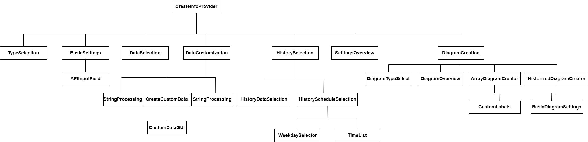

# **Infoprovider-Erstellung**
Die Komponentenstruktur der Anwendung ist in diesem Abschnitt wie folgt aufgebaut:

<div style="page-break-after: always;"></div>

## **CreateInfoProvider**
Die Komponente `CreateInfoProvider` stellt die umschließende Wrapper-Komponente für die gesamte Info-Provider-Erstellung dar, von der aus die restlichen Komponenten für die einzelnen Schritte der Erstellung geladen werden.

### **Verwaltung des aktuellen Schritts**
Dazu enthält der State der Komponente die Variable `step`, welche als Zahlwert von 0-5 repräsentiert, in welchem der 6 Schritte sich der Nutzer gerade befindet.

Diese Variable wird in der Methode `selectContent(step: number)` in einem switch-case-Statement verarbeitet, in welchem für jeden der möglichen Schritt 0-5 ein case existiert, welcher die passende Komponente zurückgibt. Die Methode wird letztendlich innerhalb des `return`-Statements aufgerufen, welches das eigentliche Rendering bestimmt.

`step` wird über die beiden Methoden `handleContinue()` und `handleBack()` inkrementiert bzw. dekrementiert, diese Methoden werden alle als *props* an die dargestellten Komponenten übergeben, sodass diese sie in ihren Buttons "weiter" und "zurück" nutzen können.
* Von einem Rendern dieser Buttons aus `CreateInfoProvider` heraus wurde abgesehen, da die einzelnen Unter-Komponenten zusätzlich noch eigene Logik wie das Absenden von Daten an das Backend an den Button binden müssen.

Zur Visualisierung des Schritts wird die von MaterialUI zur Verfügung gestellte `Stepper`-Komponente genutzt, welche das Array `steps` als Datengrundlage mit Beschriftungen sowie `step` für den aktuellen Schritt erhält.
<br></br>

### **Verwaltung des States**
Alle vom Nutzer eingegebenen Daten müssen am Ende des Vorgangs in einem JSON-Objekt zusammengefasst werden, um dieses an das Backend (Endpunkt: */infoprovider*) zu senden. Da das Senden in dieser Wrapper-Komponente erfolgen sollte haben wir uns entschieden, alle Datenwerte der Eingabe auch im State dieser Komponente zu verwalten.

In `selectContent` werden dann jeweils als *props* alle für die Komponente notwendigen Datenwerte und Setter-Methoden übergeben, diese ändert dann den State basierend auf den Nutzer-Eingaben.
<br></br>

### **Wiederherstellung des Fortschritts beim Neuladen**
Ein für uns sehr wichtiger Aspekt der UX war, dass bei einem Neuladen der Seite die bisherigen Eingaben nicht verloren gehen, da der Vorgang im Vergleich zu einem "typischen" Formular deutlich mehr Eingaben umfasst. Bei einem Verlust des Fortschritts durch Neuladen würde man auch den vom Backend gelieferten Datensatz der API-Abfrage verlieren. Daher haben wir uns für eine Implementierung entschieden, bei der die Daten im Browser gespeichert und beim Neuladen wiederhergestellt werden.
* Javascript/Typescript bietet dafür zwei Lösungen: `localStorage` und `sessionStorage`. Während der localStorage bis zum Schließen des Browsers erhalten bleibt gilt der sessionStorage nur, bis der Tab geschlossen ist.
* Damit ein Schließen des Tabs einem Neustart ermöglicht haben wir `sessionStorage` gewählt.
    * In der Komponente wird per *useEffect*-Hook bei einer Änderung einer State-Variable der neue Wert in den sessionStorage abgelegt, beim erneuten Laden der Komponente wird durch eine *useEffect*-Hook, die nur zu diesem Zeitpunkt ausgeführt wird der State aus dem sessionStorage geladen.
* Ein Problem stellt jedoch die Sicherheit dar, da der sessionStorage ein einfaches JS-Objekt mit Key-Value-Paaren ist, dass überall aus Javascript zugänglich ist. Es gilt daher als kein sicherer Speicher. Da wir insbesondere auf die Sicherheit des API-Key großen Wert legen, haben wir dieses sensible Datum aus der Speicherung ausgeschlossen. Der Nutzer muss daher die Authentifizierungsdaten der Datenquellen erneut eingeben, dennoch erachten wir dies als bessere Lösung, als einen vollständigen Datenverlust.
    * Eine Erweiterung, die den Schlüssel sicher im Backend ablegt wäre möglich.
    * Als Warnung vor dem Verlust von Daten wird in **CreateInfoProvider** beim Laden der Komponente per **useEffect** ein Event-Handler für *beforeunload* definiert - dieses Event tritt beim Verlassen oder Neuladen der Seite auf. Mit **preventDefault()** und **returnValue=""** wird das Neuladen verhindert und ein Alert angezeigt, in dem der Nutzer dieses Bestätigen muss.
        * Leider bieten moderne Browser nicht die Möglichkeit individualisierter Nachrichten, sodass wir nicht explizit angeben können, welche Daten verloren gehen.
        * Durch eine im gleichen **useEffect** definierte Cleanup-Methode wird der Handler beim Unmounten von **CreateInfoProvider** entfernt.
    * Die Methode **checkKeyExistence()** wird aufgerufen um zu entscheiden, ob die Warnung notwendig ist. Sie durchsucht die aktuelle und alle bisherigen Datenquellen nach Authentifizierungsdaten, die man verlieren würde. Nur wenn solche existieren gibt sie *true* zurück, sodass der Alert angezeigt wird.
* Damit keine Kollisionen mit Datenwerten anderer Webseiten auftreten haben wir an alle Keys eine zufällig generierte ID `uniqueID` angehängt, die im Normalfall für Kollisionsfreiheit sorgen sollte.
* Beim Beenden des Vorgangs wird über `handleSuccess`, welches bei einer erfolgreichen Info-Provider-Erstellung ausgelöst wird, der Speicher geleert.
<br>

### **Styles**
In der Datei **styles.tsx** ist auf Ebene von `CreateInfoProvider` eine Datei angelegt, die die CSS-Klassen für alle Komponenten dieses Schrittes enthält. Dies ist insbesondere sinnvoll, da sich viele Komponenten die gleichen Style-Eigenschaften teilen. Alle Komponentne greifen für ihre Styles auf diese Datei zu.

<div style="page-break-after: always;"></div>

## **AuthDataDialog**
Im vorherigen Abschnitt wurde bereits darauf eingegangen, dass wir beim Neuladen der Seite die eingegebenen Daten wiederherstellen, die API-Authentifizierungsdaten jedoch nicht im sessionStorage gespeichert werden können. Daher gibt es die Komponente **AuthDataDialog**, welche ein Dialog-Element ist, in dem der Nutzer nach dem Neuladen der Seite seine Daten erneut eingeben muss.

### **Verwaltung und Vorbereitung in CreateInfoProvider**
Grundsätzlich gilt, dass die API-Authentifizierungsdaten (State-Variablen **apiKeyInput1** und **apiKeyInput2**) nicht in **dataSources** abgelegt werden, da dieses im sessionStorage gespeichert wird. Stattdessen befinden sie sich in einer Map **dataSourcesKeys**, die den Namen der Datenquelle einem Objekt vom Typ **DataSourceKey** zuordnet, welches die Authentifizierungsdaten hält.
```javascript
export type DataSourceKey = {
    apiKeyInput1: string;
    apiKeyInput2: string;
}
```

Die Verwaltung des Dialogs passiert in **CreateInfoProvider** über die State-Variable **authDataDialogOpen** - ist sie true, so wird die **AuthDataDialog**-Komponente gerendert und der Dialog geöffnet. Dazu gibt es die Methode **authDialogNeeded()**, die bei jedem Laden der Seite nach dem Entnehmen der Datenwerte aus dem sessionStorage ausgeführt wird.
* Die Methode prüft für die aktuelle Datenquelle und alle vorherigen Datenquellen in **dataSources**, ob bei der aktuellen Datenquelle **noKey** *false* und eine Methode gewählt wurde - in diesem Fall hatte der Nutzer eine Eingabe gemacht. Bei den vorherigen Datenquellen genügt es zu schauen, ob **noKey** *false* ist.
    * Ist das bei mindestens einer Datenquelle gegeben, muss der Nutzer die Daten für diese neu eingeben. Der Dialog muss also geöffnet werden.
* Die Methode arbeitet dabei mit Daten aus dem sessionStorage, statt mit Daten aus dem State, da sie beim ersten Render nach Neuladen der Seite aufgerufen wird. Da die States erst bei einem späteren Render die tatsächlichen Daten enthalten würden, ist die Verarbeitung dieser, an dieser Stelle ungeeignet.
* Gleichzeitig wird die Map **dataSourcesKeys** mit leeren Einträgen befüllt, damit später keine undefined-Zugriffe entstehen.

Beim Einbinden der Komponente **AuthDataDialog** wird per props als **selectionDataSources** eine Liste mit Repräsentationen aller Datenquellen, bei denen eine Eingabe vom Nutzer nötig ist, übergeben. Der Datentyp für die Repräsentationen ist **authDataDialogElement**:
```javascript
export type authDataDialogElement = {
    name: string;
    method: string;
}
```
* Der Typ ist hinsichtlich der Informationen auf ein notwendiges Minimum begrenzt - den Namen der Datenquelle und die Authentifizierungsmethode, da diese im Dialog ebenfalls angezeigt werden soll.

Das Erstellen dieser Liste erledigt die Methode **buildDataSourceSelection**, welche für die aktuelle Datenquelle und alle vorherigen Datenquellen in **dataSources** anhand von **noKey** (und bei der aktuellen Datenquelle **method**) prüft, ob eine Eingabe notwendig ist. Wenn das für eine Datenquelle nowendig ist wird sie der Liste hinzugefügt.
* Bemerkenswert ist, dass für die aktuelle Datenquelle nicht der Name gespeichert wird, sondern stattdessen die Kombination des Strings **"current--** und der uniqueId, die wir auch beim sessionStorage verwenden. Grund dafür ist, dass der Nutzer bei der aktuellen Datenquelle nicht zwingend einen Namen eingegeben haben muss - er könnte erst die Authentifizierungsdaten eingeben und dann neu laden.

### **Darstellung in AuthDataDialog**
In der Komponente **AuthDataDialog** selbst erfolgt dann die Darstellung der berechneten Liste mit Eingabeelementen: Zunächst einmal wird mit einem **Select**-Element eine Auswahl generiert, in der alle Datenquellen aus **selectionDataSources** dargestellt werden.
* Das Select-Element speichert dabei als ausgewählten Wert nicht das **authDataDialog**-Objekt oder den Namen der Datenquelle, sondern den Index **selectedIndex** innerhalb des Arrays der Datenquellen - dies erleichtert die Arbeit insgesamt.

Unter diesem Select wird dem Nutzer angezeigt, welche Authentifizierungsmethode für die Datenquelle, die gerade ausgewählt wurde, genutzt wird. Dazu wird auf **props.selectionDataSources[selectedIndex]** zugegriffen und so per Index dynamisch die aktuell gewählte Datenquelle adressiert.
* Wir haben uns entschieden, dass der Nutzer hier keine Änderungen an der gewählten Methode vornehmen darf.
* Die Methode **resolveMethodName** dient dabei der Übersetzung des internen Methoden-Namens in eine lesbare Form.

Weiterhin umfasst das Fenster zwei Eingaben, wie wir sie später auch bei **BasicSettings** wiederfinden werden: Es wird die Komponente **APIInputField** genutzt, welche eigentlich von BasicSettings stammt, hier aber gut geeignet ist. Dabei gibt es zwei Eingabefelder, die normalerweise auch angezeigt werden. Wenn jedoch die gewählte Methode **BearerToken** ist benötigt man nur ein Token statt einer Kombination aus Parametername + Key oder Username + Passwort, sodass das zweite Textfeld nicht eingeblendet wird. Das geschieht über eine Inline-Condition:
```javascript
{props.selectionDataSources[selectedIndex].method !== "BearerToken" &&
        /* conditional content goes here */
}
```
* Darüber hinaus werden auch die Beschriftungen ("Name Key-Parameter"+"API-Key" / "Nutzername"+"Passwort" / "Token") abhängig von der gewählten Methode eingesetzt.
* Das Ändern der Authentifizierungsdaten wird durch **handleInputChange** verarbeitet - diese Methode unterscheidet nach Feld 1 und 2 und schreibt in die Map mit allen Authentifizierungsdaten (bzw. in die entsprechenden State-Variablen bei der aktuellen Datenquelle).

Bevor der Nutzer den Dialog mit einem Button "Bestätigen" die Eingabe abschließen kann muss dieser erst aktiviert werden, indem die Methode **checkFinish()** true zurückliefert. Sie geht durch alle Datenquellen durch und prüft abhängig von der gewählten Methode, ob alle Eingaben gemacht wurden.

<div style="page-break-after: always;"></div>


## **StepFrame**
Die Komponente **StepFrame** ist ohne wirkliche Funktionalität, da sie der grafischen Darstellung des Frontends dient. Alle Schritte bei der Info-Provider-Erstellung sollten sich in einer eingerahmten Oberfläche befinden, statt sich über die gesamte Bildbreite zu erstrecken. Die Komponente stellt diesen Rahmen.

Grundsätzlich handelt es sich um eine Adaption der Komponente **PageTemplate**, die im alten Frontend einen vergleichbaren Zweck erfüllte. Dazu wird eine **Paper**-Komponente von Material-UI verwendet und per Grid-Struktur eine Anordnung aus Überschrift, Hinweis-Button mit Text und restlichem Inhalt gemacht.
* **{children}** nutzt die Möglichkeit von React, alle als Children-Tags für die Komponente eingebundenen Elemente darstellen zu lassen. Auf diese Weise kann man also den gesamten Seiteninhalt, der sich in dem Frame befindet einfach einfügen und die Vorlage so generisch nutzen.
* Titel und Hinweistext werden ebenso variabel als Property übergeben.

Da **PageTemplate** jedoch für unsere Anpassung angepasst werden musste haben wir uns dazu entschieden, die Modifikation in einer Kopie der Komponente vorzunehmen.
* Auf diese Weise bleibt das originale Frontend hinsichtlich dieser Komponente funktional und könnte in Zukunft bei Bedarf wieder eingesetzt werden.

<div style="page-break-after: always;"></div>

## **TypeSelection**
Die Komponente **TypeSelection** stellt den ersten Schritt der Erstellung eines Infoproviders bzw. einer Datenquelle für einen solchen dar. Der Nutzer soll hier zunächst auswählen, ob er eine Datenquelle importieren möchte oder eine neue Datenquelle erstellen will - hier muss er sich dann zwischen API oder einem Webseiten-Scraper entscheiden. Die Komponente gibt die Auswahl an die Wrapper-Komponente weiter, sodass diese auswählen kann, welche Schritte als nächstes folgen müssen.

Anzumerken ist, dass zunächst nur API-Datenquellen unterstützt werden sollen - sowohl das Webseiten-Scraping als auch der Import von Daten befinden sich nicht in der Kategorie **must have** des Lastenhefts. Dennoch haben wir die Struktur direkt implementiert, um die Anwendung einfach weiterentwickeln zu können. Zum derzeitigen Zeitpunkt sind die angesprochenen zusätzlichen Features ausgegraut und der State für eine neue Datenquelle wird mit `true` initialisiert. Auf diese Weise kann ohne weiteres auswählen von Optionen der "weiter"-Button betätigt werden. Wir haben uns dagegen entschieden die Komponente vollständig zu entfernen, da so auch einige Logik in den Continue- und Back-Handlern angepasst werden müsste. So müsste zum Beispiel angepasst werden, in welchem Schritt geprüft wird, ob bestimmte Methoden definiert sind, um weitere Logik ausführen zu können.

Die Komponente besteht aus einer einfachen Kombination von Checkboxen, die über den State mit den Flags **newSource**, **importSource** und **fileSelected** verwalten, welche Auswahl der Nutzer getroffen hat und entsprechend andere Eingabefelder abwählen oder deaktivieren.

Einzig hervorzuheben ist die Methode **handleFileSelect**, die beim Nutzen des Upload-Buttons als Handler aufgerufen wird. Wichtig ist, dass dieser Handler nach der Auswahl des Nutzers aufgerufen wird, sodass die gewählte Datei bekannt ist.
* Primär wird hier überprüft, ob der Datentyp im Dateipfad (im Browser nur als Pseudo-Pfad auslesbar) am Ende **json** lautet - das ist nötig, weil der Nutzer trotz der JSON-Voreinstellung jeden beliebigen Dateityp hochladen kann.
* Diese Prüfung ist jedoch nur ein erster Schritt zur Fehlererkennung, die tatsächliche Überprüfung, ob es ein korrekter Import ist, muss durch das Backend erfolgen, da durch die HTML-Upload-Mechanik nur dieses vollen Zugriff auf die Datei hat.

<div style="page-break-after: always;"></div>

## **BasicSettings**
Die Komponente **BasicSettings** repräsentiert den Schritt der Erstellung eines Infoproviders, in welchem der Nutzer die grundlegenden Daten zu seiner geplanten API-Abfrage eingibt. Dazu sind der API-Name, die Query sowie Authentifizierungs-Informationen notwendig. Die entsprechenden Daten werden im State der Wrapper-Komponente **CreateInfoProvider** gehalten und als *props* an BasicSettings übergeben (name, query, apiKeyInput1, apiKeyInput2, method, noKey).

Bei der Namenseingabe wird durch die per props übergebene Methode **checkNameDuplicate** geprüft, ob der Name bereits existiert und ggf. ein Fehler angezeigt.

Da von Nutzern erwartet wird, dass sie ausreichendes Grundwissen zu APIs besitzen und die passende Anfrage selbst bereits erstellt haben erwartet das Eingabeformular eine direkte Eingabe der Query. Als Hilfsmittel dienen jedoch die Eingabefelder für Parameter-Namen und Wert, die von Anwendungen wie *Postman* inspiriert sind. **addParamToQuery** wird beim Hinzufügen prüfen, ob es bereits Parameter gibt. Wenn nein, so steht vor dem neuen Parameter in der Query ein Fragezeichen, sonst ein kaufmännisches Und.
* Dies soll soweit es automatisiert möglich ist eine Query nach korrektem Anfrageschema generieren. Für eine absolute Richtigkeit ist aber der User verantwortlich.

Visuanalytics unterstützt aktuell 5 Möglichkeiten der Authentifizierung bei APIs (kein Schlüssel, Key in Query, Key im Header, Bearer Token, BasicAuth), zwischen denen der Nutzer wählen kann. Je nach Methode ändert sich das **defaultLabel**-Attribut der Eingabe, um die passende Beschriftung anzupassen. Bei BearerToken wird per **disabled** zudem die zweite Eingabe deaktiviert, da nur ein Token benötigt wird. Die Methode **handleMethodChange** prüft, ob die Beschriftung sich ändert und leert in diesem Fall die Eingabefelder.

Die Methode **sendTestData** wird durch die eigene Hook **useCallFetch** erstellt und repräsentiert das Senden der eingegeben Daten an den Backend-Endpunkt */checkapi*. Hierbei haben die Daten folgendes Format:
```javascript
{
    method: "POST",
    headers: {
        "Content-Type": "application/json"
    },
    body: JSON.stringify({
        api: {
            type: "request",
            api_key_name: props.method==="BearerToken"?props.apiKeyInput1:props.apiKeyInput1 + "||" + props.apiKeyInput2,
            url_pattern: props.query
        },
        method: props.noKey?"noAuth":props.method,
        response_type: "json"
    })
}
```
**handleSuccess** und **handleError** dienen der Behandlung der Antwort. Im Erfolgsfall wird geprüft, ob das Ergebnisobjekt im Statuscode einen Fehler angibt, wenn nicht werden die Antwortdaten der API aus dem Objekt extrahiert, mit einem Aufruf der Parser-Methode **transformJSON** in das im Frontend genutzte Repräsentationsformat (siehe DataSelection) umgewandelt und an **CreateInfoProvider** durch den Callback **setListItems** weitergegeben. In beiden Fehlerfällen wird per **CenterNotification**-Komponente ein Fehler ausgegeben.

Während des Wartens auf Antwort des Backends wird eine Lade-Animation angezeigt, gesteuert durch das Setzen der boolean-Variable **displaySpinner**. **selectContent** wählt hierfür basierend auf der Variable zwischen der Animation oder der "gewöhnlichen" Eingabeoberfläche.

### **Prüfung auf Notwendigkeit erneuter API-Abfragen**
Die Bindung des Sendens der Eingaben an das Backend zum Zweck einer API-Abfrage an das Klicken des "Weiter"-Buttons bringt jedoch ein Problem mit sich: Wenn der Nutzer zu einem späteren Zeitpunkt noch einmal zu **BasicSettings** zurückkehrt (um etwas nachzuschauen oder z.B. den Namen zu ändern) und dann wieder weitergeht wird eine weitere API-Request ausgelöst.
* Das ist alleine deshalb schlecht, weil zusätzlicher Traffic verursacht wird. Schlimmer ist sogar noch, dass die API-Abfragen des Nutzers beschränkt sein könnten und so in die Höhe getrieben werden.
* Außerdem kann man nicht garantieren, dass die API beim nächsten Mal eine Antwort der gleichen Struktur sendet - alle folgenden Eingaben (ausgewählte Daten, Formeln, Historisierungen, ...) müssen invalidiert werden.

Zur Vermeidung dieses Verhaltens wird in **handleProceed** geprüft, ob der Nutzer essentielle Daten geändert hat. Dazu wird beim Laden der Komponente als **oldQuery** als der alte Wert der Query im State gespeichert. Beim Weitergehen gleicht man diesen alten Wert mit dem aktuellen Wert ab. Gab es eine Änderung, so ist die erneute API-Abfrage notwendig.
* Dann wird die API-Abfrage erneut gestellt und die States aller folgenden Schritte werden invalidiert und aus dem sessionStorage entfernt. So werden nur tatsächlich notwendige zusätzliche Abfragen gemacht.
* Jedoch findet die Entfernung der Daten erst nach einer erfolgreichen Abfrage statt. Gibt der Nutzer eine URL ein, die nicht funktioniert, so kann er die alte URl wieder eingeben und seine Daten in den folgenden Schritten bleiben erhalten!

### **Anpassungen bei nachträglichen Namensänderungen**
* Es ist möglich, dass der Nutzer zu einem späteren Zeitpunkt für eine beliebige Datenquelle zur **BasicSettings**-Komponente zurückkehrt. Der Fall, das API-Daten geändert werden wird im vorher beschriebenen Abschnitt abgefangen. Jedoch bringt auch die Namensänderung Probleme mit sich:
    * Die Datenquelle selbst ist nicht wirklich betroffen, da der Name einfach nur im enstprechenden State bzw. Objekt aufgeführt wird. Problematisch wird es jedoch für Diagramme, bei welchen für alle verwendeten Arrays oder historisierten Daten der Name ihrer Datenquelle vorangestellt wird, damit die Eindeutigkeit der Namen gewahrt bleibt (ein Name ist allgemein nur innerhalb einer Datenquelle eindeutig).
* Dieser vorangestellte Name ist ein einfacher String und ändert sich somit nicht automatisch, wenn man den Namen der Datenquelle ändert. Um dieses Problem abzufangen speichert man beim Betreten der BasicSettings den bisherigen apiName als **oldApiName** ab. In der Methode **handleProceed** prüft man dann, ob der neue Wert ungleich dem alten ist (dann wurde er geändert) und der alte Wert kein leerer String ist - die zweite Prüfung fängt den Fall ab, dass der Nutzer erstmalig in BasicSettings ist und spart so Rechenleistung.
    * Wenn die Bedingung erfüllt ist werden alle Diagramme und alle Arrays bzw. historisierte Daten innerhalb der Diagramme darauf untersucht, ob ihre Datenquelle (bei Arrays am Anfang von **listItem.parentKeyName**, bei historisierten Daten am Anfang von **name**) gleich dem alten Namen ist.
    * In diesem Fall liegt ein Wert der aktuellen Datenquelle vor, sodass man den alten Namen an dieser Stelle mit dem neuen Namen ersetzt.
* Nur so bleiben die Diagramme gültig, auch wenn der Nutzer nachträglich den Namen einer Datenquelle abändert.

<div style="page-break-after: always;"></div>

## **DataSelection**
* Ausführung zu Entscheidungen bei Optionen in der Listenauswahl

Die Komponente **DataSelection** listet alle Daten auf, die durch die im vorherigen Schritt generierte API-Abfrage geliefert wurden.

### **transformJSON**
Kern dieser Komponenten ist die Methode **transformJSON**, welche dazu dient, das JSON-Objekt zu durchlaufen und in ein Array **listItems** mit einem eigenen Objekt-Typ **listItemRepresentation** umzuwandeln, der alle Informationen für die Oberflächengenerierung umfasst. So werden Namen, Datentypen, absolute Namenspfade (mit Parent-Information) und Schachtelungstiefe benötigt.
```javascript
interface ListItemRepresentation {
    keyName: string;
    value: any;
    parentKeyName: string;
    arrayRep: boolean;
    arrayLength: number;
}
```
* Dabei wurde die Schachtelung so umgesetzt, dass Objekte des Array als **value** weitere Arrays mit Objekten enthälten können, dann liegt ein Unterobjekt oder Array vor.

Die zunächst offensichtlichste Variante wäre das Durchlaufen aller Keys, die man per *Objekt.keys()* erhält. Das Problem ist hierbei jedoch, dass die Struktur des Objektes unbekannt ist. Typescript verlangt aber eine durch einen Datentypen definierte Struktur, um über Schlüssel auf Datenwerte eines Objektes zuzugreifen.

Nach längerer Recherche erschien uns die einzige Möglichkeit per *JSON.stringify()* das Objekt in einen String umzuwandeln und mit einem eigenen Parser diesen in das Array umzuwandeln. Der Parser arbeitet dabei mit Substrings, um immer mehr Teile des Strings zu entfernen, bis er vollständig bearbeitet wurde.
* Alle Variablen eines Objektes werden in einer while-Schleife durchlaufen, die zunächst den Key-Namen isoliert.
* Wenn auf den Key eine öffnende geschweifte Klammer folgt ist klar, dass ein Sub-Objekt oder Array vorliegend ist. In diesem Fall wird der String für das Sub-Objekt so lange erweitert, bis die Anzahl der öffnenden Klammern gleich der der schließenden ist. So wird sichergestellt, dass die gesamte Tiefe des Unterobjektes/Array erfasst wurde - **subObject** hält dann den zugehörigen String.
    * Um zu erkennen, ob ein Array vorliegt wird der erste Key des Unterobjekts untersucht. Ist es **same_type**, so liegt ein Array vor. In diesem Fall wird noch unterschieden, ob der Wert *true* oder *false* ist.
        * true bedeutet, dass die enthaltenen Objekte den gleichen Typ haben. Dann muss geprüft werden, ob dieser Typ primitiv ist oder nicht. Im primitiven Fall wird als **value** der Typ-String gespeichert.
            * Im nicht-primitiven Fall wird durch erneuten Lookahead zwischen Array und Objekt unterschieden. Da Arrays in Arrays wegen des fehlenden Namens nicht eindeutig benannt werden können bietet Visuanalytics hier keine Unterstützung und gibt schlicht an, dass ein Array enthalten ist.
            * Bei Objekten wird **transfromJSON** rekursiv mit dem Subobjekt aufgerufen und das gelieferte Array als **value** gesetzt.
        * Bei false haben die enthaltenen Elemente nicht den gleichen Typ. In diesem Fall setzen wir eine Liste der enthaltenen Typen bei **value**.
    * Wenn kein Array vorliegt ist es ein Objekt. Für dieses wird rekursiv **transformJSON** aufgerufen und das Ergebnis-Array als **value** gesetzt.
* Für den Fall, dass der Wert primitiv ist wird die Datentyp-Information gelesen und in **value** gespeichert.
* Die Schleife endet, wenn das gesamte Objekt eingelesen wurde. Das generierte Array wird dann zurückgegeben.

### **Generieren der Darstellung**
Zum Generieren der grafischen Repräsentation wird die Methode **renderListItem** verwendet, welche mit **listItems.map** nach und nach für alle darzustellenden Listenelemente aufgerufen wird. Anhand der Informationen des Objektes unterscheidet sie, ob es sich um ein Array, ein Objekt oder einen primitiven Wert handelt und generiert die Oberfläche entsprechend.
    * Dabei wurde eine Reihe an Detailentscheidungen getroffen, die kurz aufgelistet werden sollen:
        * Arrays, die gleichartige Objekte enthalten können so genutzt werden, dass man die Attribute des Objekts am Index 0 des Arrays wählen kann.
        * Arrays, die primitive Werte vom gleichen Typ enthalten können ebenfalls so genutzt werden, dass man den Wert am Index 0 wählen kann.
        * Arrays, die Objekte unterschiedlicher Typen, primitive Daten unterschiedlicher Typen oder andere Arrays enthalten können nicht gewählt werden, weil diese nicht sinnvoll verarbeitet werden können.
        * Bei Objekten kann man alle in ihnen enthaltenen Attribute wählen (außer ein Attribut entspricht den oben stehenden Ausschluss-Regeln für Arrays).
        * Primitive Datenwerte können immer gewählt werden.
* Die Methode nimmt neben dem Datum selbst eine Zahl **level** entgegen - diese repräsentiert die Tiefe der Schachtelung und sorgt für eine entsprechende Einrückung der Elemente.
* Jedes Element hat einen eindeutigen Key, welcher dem "absoluten" Pfad des Wertes entspricht, d.h. *parent1*|*parent2*|...|*element* - dieser dient sowohl der Identifikation in React als auch dem Speichern der ausgewählten Daten.
* Wenn eine Checkbox gesetzt wird folgt der Aufruf von **checkboxHandler**, welcher prüft, ob in selectedData bereits ein Objekt mit diesem Key enthalten ist - je nachdem ruft es die Methode **addToSelection** zum Hinzufügen oder **removeFromSelection** zum Entfernen auf. Das an diesen Handler übergebene Objekt ist vom Typ **SelectedDataItem** und hat die Attribute *key* und *type* (sowie optional *arrayValueType** für Arrays, die primitive Werte enthalten). Auf diese Weise wird an spätere Schritte die Typinformation übergeben.

### **Umsetzung von Lösch-Abhängigkeiten**
Der Nutzer hat die Möglichkeit, im Nachhinein jederzeit von späteren Schritten zu **DataSelection** zurückzukehren und durch Anklicken von Checkboxen weitere Daten zu wählen oder Daten abzuwählen. Das Abwählen von Daten kann hier für Probleme sorgen, wenn diese in Formeln, Historisierung oder Diagrammen verwendet werden. Konsequenterweise muss man alle Elemente in diesen drei Kategorien, die das abgewählte Datum nutzen, löschen.

Da es vermutlich zu viel Rechenaufwand beanspruchen würde die Prüfung bei jedem Anklicken einer Checkbox durchzuführen haben wir eine ähnliche Variante genutzt wie auch bei **BasicSettings**: Das Anklicken des "Weiter-Buttons" löst eine Prüfung aus, ob Daten entfernt wurden - wenn ja werden die Abhängigkeiten ermittelt.

Dazu wird die Methode **calculateItemsToRemove()** aufgerufen, welche durch den Abgleich des States **selectedData** mit einer beim Mounten der Komponente erstellen Ausgangszustand **oldSelectedData** abgleicht. Alle entfernten Elemente werden so ermittelt und als **missingSelections** gespeichert.
* Wenn dieses Array **missingSelections** nicht leer ist, wurden Elemente abgewählt. Die Methode prüft dann für jedes Element, ob eine Formel dieses nutzt. Dazu dient die Methode **getFormulasUsingData**, die alle Formeln durchgehen und prüft, ob der Name enthalten ist.
    * Die Ergebnisse werden als **formulasToRemove** gespeichert.
* Auf die gleiche Weise wird für jedes Element geprüft, ob ein Diagramm es nutzt. Die Ergebnisse werden in **diagramsToRemove** gespeichert.
* Zuletzt erfolgt der gleiche Durchlauf für historisierte Daten, die Ergebnisse liegen dann in **historizedToRemove**.
* Es wäre zu erwarten, dass man die Ergebnisse in States speichert. Das sich hierbei ergebende Problem ist jedoch, dass **handleContinue** die zu löschenden Daten noch vor dem nächsten Render benötigt, weshalb sie als Objekt verpackt zurückgegeben werden.

**handlContinue** prüft dann, ob Formeln oder Diagramme entfernt werden müssen - wenn ja, so speichert es die Listen zu entfernender Elemente in den gleichnamigen States und öffnet mit **setDeleteDialogOpen** einen Dialog zum Löschen der Daten.
* Wenn jedoch nur historisierte Daten (oder keine) entfernt werden müssen, so wird schlicht **removeFromHistorized** aufgerufen, welches die Elemente aus **historizedToRemove** aus **historizedData** entfernt.

Der angesprochene Dialog wird deshalb eingesetzt, da Formeln und Diagramme anders als historisierte Daten, welche sich mit einem Klick wiederherstellen lassen würden, nicht ohne Zustimmung des Nutzers gelöscht werden sollen. So wird verhindert, dass das Abwählen eines Datums ein Diagramm oder eine Formel löscht, ohne dass der Nutzer es merkt.
* Der Dialog enthält eine aus **diagramsToRemove** und **formulaToRemove** generierte Auflistung aller Formeln und Diagramme, die wegen dem Abwählen von Elementen gelöscht werden würden.
* Der Nutzer kann auf "abbrechen" klicken, um zurück zur Auswahl zu kommen und Checkboxen wieder setzen, um das Löschen zu verhindern..
* Mit "Löschen bestätigen" löst er hingegen das Löschen aller historisierten Daten, Diagramme und Formeln aus, die wegen abgewählten Elementen nicht mehr gültig sind. Anschließend sorgt der Aufruf von **props.continueHandler** für das Weitergehen zum nächsten Schritt.

<div style="page-break-after: always;"></div>

## **DataCustomization**
Im nächsten Schritt der Erstellung eines Infoproviders werden Datenverarbeitungen mit den von der Datenquelle gelieferten Daten vorgenommen. Es gibt insgesamt drei Verarbeitungsmöglichkeiten:
* Array-Verarbeitung (Mittelwerte, Maxima, ...)
* Erstellen eigener Formeln
* Zeichen-Ersetzung in Strings.

Jeder der Schritte wird durch eine eigene Komponente repräsentiert. Die Komponente **DataCustomization** dient als Wrapper-Komponent für diese drei Komponenten. Per **props** bekommt sie mit **dataCustomizationStep** den aktuellen Schritt von **CreateInfoProvider** übergeben und nutzt diesen in der Methode **getContents**, um auszuwählen, welche Komponente ausgewählt werden soll.

Anzumerken ist, dass die Komponente anders als die meisten Wrapper-Komponenten weder **StepFrame** noch **CenterNotification** bereitstellt - das hat schlichtweg den Grund, dass sie nachträglich um das bereits bestehende **CreateCustomData** herumgebaut wurde und wir dieses nicht mitändern wollten. Ein Umbau wäre jedoch möglich, hätte jedoch außer minimal reduzierter Redundanz keine Effekte.

<div style="page-break-after: always;"></div>

## **ArrayProcessing**
Der erste Verarbeitungsschritt ist die Verarbeitung von numerischen Arrays zu neuen Datenwerten, dargestellt durch die Komponente **ArrayProcessing**. Das Prinzip sieht dabei so aus, dass der Nutzer ein Array mit einer Operation verknüpft, diese benennt und sie damit als neuen Datenwert abspeichert. Da das Ergebnis aller Operationen eine einzelne Zahl ist können die so entstehenden Werte z.B. auch in Formeln oder als historisierte Daten in Diagrammen genutzt werden.

Dabei werden derzeit vier Operationen unterstützt (neue Operationen müssten als Erweiterung durch das Backend bereitgestellt werden) - Summe, Minimum, Maximum, Mittelwert. Das Array **operations** hält alle diese gültigen Operationen und hat als **name** einen internen Namen, während **displayName** der Anzeigename für die Oberfläche ist. In der Ansicht des Nutzers wird eine Liste aus **RadioButton**s angezeigt, durch die der Nutzer genau eine Operation wählen kann. Die Generierung der Liste übernimmt **renderOperationListItem**. Anzumerken ist, dass kein Label für den RadioButton, sondern eine **Typography** genutzt wird - das war für das Styling notwendig und hat darüber hinaus keine besondere Bedeutung.
* Mit **selectedOperationIndex** speichern wir die aktuelle Auswahl - dieser ist der Index der gewählten Operation im Array **operations** und standardmäßig -1.

### **Generieren der Liste verfügbarer Arrays**
Parallel zur angesprochenen Liste der Operationen wird eine Liste mit allen verfügbaren Arrays angezeigt, die mit einer Operation kombiniert werden können. Grundsätzlich sind numerische Arrays geeignet - das bedeutet im Detail:
* Arrays, die primitive Werte des Typ "Zahl" oder "Gleitkommazahl" enthalten.
* Arrays, die Objekte enthalten, die ein "Zahl"/"Gleitkommazahl"-Attribut haben. Jedes derartige Attribut wird einzeln als verfügbares Array angezeigt, bei der Operation wird dann über das Array iteriert und jedem Objekt der Wert des jeweiligen Attributs entnommen.

Die Bestimmung dieser Liste verfügbarer Arrays wird durch die Methode **getProcessableArrays** vorgenommen, welche **listItems** entgegennimmt - hier soll die Frontend-Repräsentation der API-Daten, die im vorherigen Schritt durch eine Transformation hergestellt wurde, eingegeben werden.
* Die Methode iteriert über alle **listItems** und prüft, um welche Art von Item es sich handelt. Liegt ein primitives Array vor (`listItem.arrayRep && !Array.isArray(listItem.value)`), so muss geprüft werden, ob der Typ des **value** "Zahl" oder "Gleitkommazahl" ist - wenn ja wird es der Liste **compatibleArraysList** hinzugefügt.
* Handelt es sich um ein Objekt (`!listItem.arrayRep && Array.isArray(listItem.value)`), dann müssen alle Attribute des Objekts untersucht werden. Man ruft die Methode rekursiv auf und gibt das Objekt ein. Die Rückgabe ist dann die Liste geeigneter Arrays aus dem Objekt, welche wir mit **concat** mit unserer Liste verknüpfen.
* Der letzte Fall wäre ein Array, das Objekte enthält (`listItem.arrayRep && Array.isArray(listItem.value)`) - in diesem Fall müssen ebenfalls durch einen rekursiven Aufruf alle Attribute untersucht werden. Ein wichtiger Unterschied ist hierbei jedoch, dass wir nicht mit inneren Arrays arbeiten dürfen, d.h. ein Array in einem Objekt in einem Array ist nicht möglich.
    * Zur Lösung dieses Problems wird die Variable **noArray** an die Methode übergeben - ist sie **true**, so werden enthaltene Arrays nicht weiter untersucht, sondern nur primitive Werte und Objekte.

Der Aufruf dieser Methode erfolgt beim Mounten/Anzeigen der Komponente durch eine **useEffect**-Hook. Die **listItems** werden dabei als **props** von der umschließenden Komponente übergeben.

### **Hinzufügen neuer Verarbeitungen**
Sobald ein Name, ein Array und eine Operation gewählt wurden kann mit dem Speichern-Button die gewählte Verarbeitung gespeichert werden. Dazu wird die Methode **addProcessing** aufgerufen, welche zunächst durch einen Aufruf von **checkNameDuplicate** prüft, ob der gewählte Name bereits vergeben ist.
* Die Prüfung entspricht dem, was in anderen Komponenten wie **CreateCustomData** dokumentiert ist und wird an dieser Stelle daher nicht ausführlicher behandelt. Elementar ist, dass die neue Verarbeitung keinen Namen haben darf, den eine andere Array-Verarbeitung, eine String-Verarbeitung ein API-Datum oder eine Formel benutzt.

War die Prüfung ohne Fehler, so wird die neue Verarbeitung gespeichert. Dazu dient das Array **arrayProcessingsList**, welches im State von **CreateInfoProvider** liegt und per **props** übergeben wird. Das Datenformat wird dabei durch den Typ **ArrayProcessingData** gestellt, welcher alle relevanten Informationen kapselt:
```javascript
export type ArrayProcessingData = {
    name: string;
    array: string;
    operation: Operation;
}
```
Auf Basis dieser Liste wird mit **renderProcessingsListItem** für alle Verarbeitungen ein Listeneintrag generiert, der in der Liste existierender Verarbeitungen auf der rechten Seite der Komponente zu sehen ist. In dieser Liste hat jeder Eintrag auch ein **DeleteIcon** zum Löschen. Bei diesem bestehen wie auch an anderen Stellen (z.B. in **DataSelection** oder **CreateCustomData**) Löschabhänigkeiten, die berücksichtigt werden müssen:
* Formeln können die Ergebnisse der Verarbeitung nutzen - alle Formeln, die dies tun müssen gelöscht werden.
* Wenn eine Verarbeitung historisiert wird kann man sie in historisierten Diagrammen verwenden - dann müsste ein solches Diagramm ebenfalls gelöscht werden.
* Wenn die Verarbeitung historisiert wurde muss man sie ebenfalls aus der Liste historisierter Daten löschen.

Das Prinzip ist hierbei gleich wie bei allen anderen Umsetzungen von Löschabhängigkeiten - wenn nur historisierte Daten gelöscht werden, geschieht dies ohne Fragen. Wenn jedoch eine Formel oder ein Diagramm gelöscht werden müsste, wird ein **Dialog** angezeigt, der die entsprechenden Formeln und Diagramme auflistet (gespeichert in **formulasToRemove** und **diagramsToRemove**) und Bestätigung verlangt.
* Die Prüfung auf Abhängigkeiten übernimmt **checkDeleteDependencies**, das Löschen wird durch die Methode **removeProcessing** umgesetzt.

<div style="page-break-after: always;"></div>

## **CreateCustomData**

Die Komponente **CreateCustomData** ist für die Formelerstellung zuständig. Es soll ermöglicht werden, dass ein Nutzer seine ausgewählten Daten benutzen kann, um neue Werte für den Info-Provider zu erstellen. Dazu wird in der Komponente eine weitreichende GUI, ähnlich zu einem Taschenrechner bereitgestellt. So können Datenwerte und oder Zahlen miteinander verrechnet werden. Die so entstandenen neuen Werte lassen sich unter einem eigenen Namen in den React-State **name** abspeichern. Diese zusätzlichen Variablen können auch sofort weiterverarbeitet werden.

Die GUI besteht aus 5 wichtigen Bereichen.
* Ein *Text-Feld*, um der zu erstellenden Formel einen Namen zu geben, 
* ein *Input-Feld*, in dem die erstellte Formel erscheint,
* *Eingabe-Tasten* in einem Block für ein Ziffern-Feld, Klammern, Rechenoperationen und einer "zurück"- und "löschen"-Option,
* eine Liste aus den *ausgewählten Daten* aus der **DataSelection**, die auch als Eingabe-Tasten dargestellt werden
* und eine Fußleiste, in der man wie bei den anderen Komponenten mit "zurück" und "weiter" durch die Schritte der InfoProvider-Erstellung navigieren kann und in der sich die "Speichern"-Schaltfläche befindet

Zu der Liste der ausgewählten Daten werden automatisch auch die Namen neu erstellter Formeln hinzugefügt, um diese in neuen Formeln mit zu benutzen. Ausschlaggebend dafür sind **selectedData** und **customData** aus der umschließenden Komponente. Dabei gibt es bei diesen zusätzlich die Möglichkeit die Formel über eine eigene Taste zu löschen. Wie bei einem Taschenrechner mit der zusätzlichen Option die ausgewählten Daten einzugeben, kann der Nutzer nun frei Eingaben tätigen und sich so seine Formel zusammenstellen.

### **Überprüfung der Syntax**
Durch die oben genannte Freiheit könnte man mit Leichtigkeit Berechnungen eingeben, die syntaktisch keinen Sinn ergeben. Also muss sichergestellt werden, dass ein Nutzer richtige Eingaben tätigt. Das geschieht in zwei Schritten.

**Eingrenzung der Eingaben:**

Wir haben uns dazu entschieden die Eingaben eines Nutzers dahingehend zu begrenzen, dass nur eine korrekte Eingabe ermöglicht wird. Es wird eine syntaktisch richtige Reihenfolge der Zeichen erzwungen. Dazu werden Tasten, die ein Zeichen repräsentieren, welches als nächstes nicht verwendet werden darf, deaktiviert.
Intern besitzt die Komponente verschiedene boolean-Werte (im Folgendem als **Flags** bezeichnet) die eine einzelne Taste oder eine Gruppe von Tasten repräsentieren, falls diese gleiches Verhalten zeigen. Wenn dieser Flag auf *true* gesetzt ist, ist die Taste deaktiviert und kann nicht betätigt werden. Es gibt folgende Flags:
* **numberFlag**: für die Ziffern-Tasten (0 - 9),
* **opFlag**: für die Tasten für Rechenoperationen (+, -, *, /, %),
* **dataFlag**: für die Tasten für die Eingabe eines Datums aus der Datenauswahl und erstellte Formeln,
* **leftParenFlag**: für"Klammer auf",
* und **rightParenFlag**: für "Klammer zu".

Jede dieser Kategorien besitzt eine eigene Handler-Methode, die die anderen und das eigene Flag neu setzt und somit die folgende Eingabe einschränkt. Zusammengefasst sind das die Folgenden:
* **handleNumberButtons()**: für Ziffern,
* **handleDataButtons()**: für Daten und erstellte Formeln,
* **handleOperatorButtons()**: für Rechenoperationen,
* **handleLeftParen()**: für "Klammer auf",
* und **handleRightParen()**: für "Klammer zu"

So können zum Beispiel Eingaben, wie 	```7 + / 8``` oder ```10 - 6BspDatum *``` verhindert werden.
Manche Flags nehmen auch direkt Einfluss auf die "Speichern"-Schaltfläche und können diese ebenfalls deaktivieren. **handleLeftParen()** und **handleRightParen()** zählen zusätzlich mit, wie oft sie aufgerufen wurden (**leftParenCount**; **rightParenCount**). Dadurch kann eine Formel nur dann abgespeichert werden, wenn die Anzahl offener Klammen gleich der Anzahl geschlossener Klammern ist.
Nachdem eine Rechenoperation benutzt wurde, muss eine Zahl oder ein Datum folgen, damit die Formel abgespeichert werden kann.

Uns ist bewusst, dass gewisse Vereinfachungen in Rechnungen, die normalerweise syntaktisch korrekt sind, bei uns nicht unterstützt werden. Beispiele dafür sind Negierungen: ```10 * -BspDatum``` oder Klammerungen, bei denen man ein Mal-Zeichen typischerweise weglässt: ```5 + 10(BspDatum)```. Sowas kann man jedoch mit Leichtigkeit umgehen, indem die Rechnungen ausgeschrieben werden. Das ist mit der GUI ohne Probleme möglich: ```10 * (0 - 1) * BspDatum```; ```5 + 10 * BspDatum```.

**Überprüfung im Backend:**

Zusätzlich wird eine Formel mit dem Betätigen der "Speichern"-Schaltfläche an das Backend übermittelt, um dort sicherheitshalber ein zweites Mal auf syntaktische Korrektheit überprüft zu werden. Gesendet wird ein JSON mit den Formel-String als Inhalt. Im Backend wird die Biblothek **ast2json** verwendet. Diese nimmt den String entgegen und versuch daraus einen abstrakten Syntax-Baum zu erstellen. Vom Backend empfangen wir dann ebenfalls ein JSON mit dem Inhalt true oder false. True bedeutet, der Syntax-Baum konnte erstellt werden. Das ist gleichbedeutend damit, dass die Formel syntaktisch **Sinn** **ergibt**. Das schließt natürlich Eingabefehler vom Nutzer, wie das Nichtbeachten von "Punkt vor Strich"-Rechnung, nicht aus. False bedeutet, dass es einen Fehler in der Syntax gibt und der Nutzer wird gebeten seine Formel zu berichtigen. Zuständig dafür ist die **useCallFetch**-Methode **sendTestData()**.
Es sei hier noch darauf hingewiesen, dass das Backend die übermittelte Formel keinesfalls schon abspeichert. Das komplette Absenden und Abspeichern einer Formel mit Input-String und Name wird im letzten Schritt der Infoprovider-Erstellung **SettingsOverview** behandelt.

### **Interne Darstellung**
Intern wird eine Formel als ein Objekt dargestellt, welches **FormelObj** heißt. Dieses Objekt beinhaltet lediglich zwei Strings, einen für den Namen der Formel und einen für die Formel bzw. die Rechnung selbst. Die übergeordnete Komponente **CreateInfoProvider** besitzt ein Array aus diesen **FormelObj**-Objekten: **customData**. So können die erstellten Formeln abgespeichert werden und bis zum Absenden an das Backend gespeichert werden.

Die Formel selbst besteht aus einer Aneinanderreihung von Objekten namens **StrArg**. Diese Aneinanderreihung wird als ein Array umgesetzt, welches **DataAsObj** heißt. Jedes mal, wenn ein entsprechender Handler von einer der oben beschriebenen Schaltflächen aufgerufen wird, wird ein neues **StrArg**-Objekt mit dem entsprechenden Zeichen erstellt und in **DataAsObj** eingefügt.
```javascript
dataAsObj.push(new StrArg());
```
Die **StrArg**s bestehen aus einer String-Repräsentation und verschiedenen boolean-Flags. **StrArg**s haben die Methode **makeStringRep()** welche die enthaltene String-Repräsentation ausgibt. Durch diese kann mit **DataAsObj** der Input-String generiert werden, welcher im Input-Feld erscheint und auch als Formel in **FormelObj** abgespeichert wird. Die dafür verantwortliche Formel heißt **calculationToString()**.
```javascript
setInput(calculationToString(dataAsObj));
```
Durch die Flags kann identifiziert werden, ob es sich um *Rechenoperationen, Ziffern, Klammer auf, Klammer zu* oder *Daten* handelt. Das Einsetzten von Objekten ermöglicht ebenfalls, dass Eingaben wie eine Zahl oder ein Datum, welches selbst aus einen Name bzw. String besteht, als gleich behandelt werden.
Das und die Flags sind ausschlaggebend dafür, dass die letzte Eingabe mit "zurück" zurückgenommen werden kann.

### **"Zurück" und "Löschen"**

Für das optimierte Bedienen der GUI soll es dem Nutzer ermöglicht werden, seine Eingabe komplett zu löschen oder seine letzte Aktion zurückzurufen. Dazu gibt es zwei Schaltflächen in der Oberfläche: die "zurück"- und "löschen"-Taste.

Die Händler-Methode für das Löschen **fullDelete()** setzt im Grunde die ganze Eingabe zurück. Alle Objekte aus **DataAsObj** werden gelöscht. Da aus **DataAsObj** der Input-String generiert wird, ist das Input-Feld somit auch leer.
```javascript
setDataAsObj(new Array<StrArg>(0));
setInput('');
```
Die gesetzten Flags zum Deaktivieren der Tasten werden auf ihren Start-Zustand gesetzt. Somit kann der Nutzer ohne Probleme eine neue Formel anfangen.

**handleDelete()**, die Handler-Methode für das Zurückrufen der letzten Aktion, ist ein bisschen komplexer. Die grundlegende Funktion ist, dass das letzte **StrArg** aus **DataAsObj** gelöscht wird. Das ist kein Problem:
```javascript
dataAsObj.pop();
setInput(calculationToString(dataAsObj));
```
Der wichtige Teil ist, die Flags der Input-Tasten richtig neu zu setzten. In den **StrArg**s ist festgehalten, um welche Eingabe es sich handelt. So kann in dieser Handler-Methode explizit auf jede Eingabe individuell reagiert werden, damit sich das Deaktivieren der Tasten korrekt verhält.
```javascript
const handleDelete = () => {
...
    if (dataAsObj[dataAsObj.length - 1].isNumber) {
        // korrektes Setzten der Flags, falls das zu löschende Zeichen eine Ziffer ist.
        // -> letztes Element von dataAsObj
    }
...
}
```
Falls **DataAsObj** nur aus einem Objekt besteht, wird automatisch der Handler für "löschen" aufgerufen.
```javascript
if (dataAsObj.length <= 1) {
    fullDelete()
}
```

### **Das Löschen einer Formel**
Der Nutzer hat die Möglichkeit, eine Formel zu löschen. In der erstellten Liste der Datenwerte wird für Formeln auch eine Schaltfläche zum Löschen generiert. Betätigt man diese, wird die Formel mit **deleteCustomData()** aus **customData** entfernt und steht somit nicht mehr zur Verfügung. Die Komponente Wird neu generiert und die gelöschte Formel erscheint nicht mehr in der Auswahlliste.

### **Abschließende Überprüfungen**

Am Ende sei noch auf einige kleine Überprüfungen eingegangen.
* Beim Erstellen einer Formel wird überprüft, ob der ausgewählte Name bereits vergeben wurde. Dazu wird **CustomData** nach den aktuellen Input-String durchsucht und der Nutzer wird benachrichtigt, wenn er einen bereits vergebenen Namen für die neue Formel wählt.
    * Darüber hinaus wird außerdem geprüft, ob es ein Datum in den API-Daten gibt, welches den gleichen Namen wie die Formel hat - dann wäre der Name ebenfalls nicht möglich. Dabei nutzt man die Methode **getListItemsnames**, in welche die per props übergebenen **listItems** eingegeben werden.
        * Die Methode liefert eine Liste aller vollständigen Namen, die es in den API-Daten gibt. Der Formelname darf nicht in dieser Liste liegen - wenn doch, so wird ein Fehler ausgegeben.
    * Diese beiden Überprüfungen werden erst beim Klicken von **Speichern** statt direkt während der Eingabe überprüft, um zu hohe Rechenlast zu vermeiden, die durch schnelles Tippen oder Löschen ausgelöst werden würde.
* Leerzeichen im Namen einer Formel werden automatisch mit "_" ersetzt. Die Bibliothek **ast2json** im Backend würde ein Leerzeichen als Trennung zwischen zwei Operatoren sehen und somit eventuell Formeln nicht richtig bearbeiten.
* Falls entweder das Text-Feld für den Namen oder das Input-Feld für die Formel leer ist, wird der Benutzer beim Versuch abzuspeichern benachrichtigt.
* Falls ein Nutzer die "zurück"- oder "löschen"-Tasten benutzt, während das Input-Feld leer ist, wird er benachrichtigt, dass es nichts zum Löschen gibt.

<div style="page-break-after: always;"></div>

## **StringProcessing**
Der letzte Schritt der Datenverarbeitungen ist die Ersetzung von Zeichen in Strings, welche in der Komponente **StringProcessing** ermöglicht wird. Die Idee ist dabei grundlegend sehr einfach: Der Nutzer wählt einen String, eine Zeichenkette, die in diesem ersetzt werden soll, eine Zeichenkette zum Einsetzen und einen Namen - aus dieser Kombination entsteht dann ein neues Datum. Auch dieses kann historisiert werden. Da die Ergebnisse aber Strings und keine Zahlwerte sind ist es entsprechend nicht möglich, wie bei **ArrayProcessing** die Ergebnisse in Formeln oder Diagrammen zu nutzen, sodass dieser Schritt auch erst nach der Formel-Erstellung kommt.

Die Komponente hat strukturell sehr starke Ähnlichkeiten zu **ArrayProcessing**: Es gibt ein Textfeld für den Namen, den der State **name** speichert und eine Liste an allen verfügbaren Strings. Diese Liste an Strings ist erneut eine Liste von **RadioButton**s, da man immer nur einen String pro Operation wählen kann.

### **Bestimmung geeigneter Strings**
Die Liste verfügbarer Strings, **availableStrings** wird beim Mounten/Anzeigen der Komponente durch eine **useEffect**-Hook initialisiert, indem die Methode **getAvailableStrings** aufgerufen wird. Diese nimmt (wie **getAvailableArrays**) listItems entgegen und liefert ein Array aller geeigneter Strings, die sich in dieser Liste befinden. Auch hier gibt es wieder verschiedene Möglichkeiten, zwischen denen
differenziert werden muss:
* Wenn es sich um ein Array handelt, welches Strings enthält, so ist der Index ein gültiger String.
* Wenn es sich um ein Array handelt, welches Objekte enthält, so muss jedes Attribut dieses Arrays untersucht werden. Dazu machen wir einen rekursiven Aufruf, der uns das Array zu diesem Objekt zurückgibt.
    * Wie auch bei **ArrayProcessing** übergeben wir hier für das Flag **noArray** den Wert **true**, was dafür sorgt, dass Arrays in Arrays nicht untersucht werden, da sie nicht unterstützt werdem-
* Wenn es sich um ein Objekt handelt, so müssen alle Attribute dieses Objektes untersucht werden. Das passiert auch hier mit einem rekursiven Aufruf, jedoch setzen wir das Flag auf **false**, da Arrays hier betrachtet werden sollen.

Basierend auf der so entstandenen Liste **availableStrings** wird mit **renderStringListItem** für jeden String ein Eintrag in einer Liste von **RadioButton**s erzeugt. Der vom Nutzer ausgewählte String wird in der State-Variable **selectedStringIndex** gespeichert - diese hält den Index der aktuellen Auswahl in **availableStrings**. Der Default-Wert ist -1, sodass standardmäßig keine Auswahl vorliegt.

### **Erstellen neuer Verarbeitungen**
Die Eingabe der zu ersetzenden Zeichenfolge und der einzusetzenden Zeichenfolge geschieht über zwei **TextField**-Komponenten, deren Werte mit **replaceString** und **withString** im State gespeichert werden. Der Nutzer kann den Button "Speichern" nur dann nutzen, wenn ein Name, ein String und ein zu ersetzender String ausgewählt wurden. Wir haben uns entschieden, dass der String zum Einsetzen auch ein leerer String sein darf - damit wird es möglich, den **replaceString** einfach zu entfernen. Wie aus **ArrayProcessing** bekannt muss hier geprüft werden, ob der Name bereits durch eine Array-Verarbeitung, eine andere String-Ersetzung, ein API-Datum oder eine Formel genutzt wird - die Prüfung erledigt **checkNameDuplicate**.

Die erstellten Ersetzungen werden durch den Datentyp **StringReplacementData** dargestellt und in **stringReplacementList** gespeichert, welche sich im State von **CreateInfoProvider** befindet und per **props** übergeben wird.
```javascript
export type StringReplacementData = {
    name: string;
    string: string;
    replace: string;
    with: string;
}
```

Löschabhängigkeiten gibt es abgesehen von der Historisierung nicht, da Strings weder in Formeln noch in Diagrammen genutzt werden können. Folglich gibt es keinen Bestätigungs-Dialog, sonder es wird direkt durch **removeReplacementHandler** die String-Ersetzung und falls vorhanden ihr Eintrag in **historizedData** entfernt.

<div style="page-break-after: always;"></div>

## **HistorySelection**
In dieser Komponente wird dem Nutzer die Möglichkeit zur Verfügung gestellt, Daten auszuwählen, welche er historisieren möchte.

Dabei besitzt diese Komponente auch einen eigenen Step, da sich die Komponente in zwei Bereiche / Unterkomponenten aufteilt:
1. Wahl der zu historisierenden Daten
2. Wahl der Historisierungszeitpunkte.

Die Methode `handleDataProceed` und `handleScheduleBack` werden dabei für den Wechsel der beiden Steps verwendet.

Die Methode `getContent` lädt die anzuzeigenden Komponenten, wobei bei der Datenauswahl ein `handleSkipProceed` übergeben wird. Dieser erhält als Wert die `handleContinue`-Methode der übergeordneten Komponente und wird benötigt, falls keine Daten für die Historisierung ausgewählt werden.

In jedem Fall wird der entsprechende Continue-Handler die Methode `addToDataSources` aufrufen. Diese fügt die Daten der aktuellen Quelle in ein Objekt des Typen `DataSource` ein:

```javascript
export type DataSource = {
    apiName: string;
    query: string;
    noKey: boolean;
    method: string;
    selectedData: SelectedDataItem[];
    customData: FormelObj[];
    historizedData: string[];
    schedule: Schedule;
    listItems: Array<ListItemRepresentation>
}
```

Wie hierbei auffällt, werden die API-Keys nicht im Objekt mitabgespeichert. Dies hat den einfachen Grund, dass das Array mit allen Datenquellen im Session-Storage abgelegt wird. Würden hier die API-Keys beinhaltet sein, so könnte jeder diese auslesen.

Stattdessen werden die Keys in einer Map gespeichert, welche als Key der zugehörigen Datenquelle hält. Der Value für die Keys ist wieder ein eigener Typ:

```javascript
export type DataSourceKey = {
    apiKeyInput1: string;
    apiKeyInput2: string;
}
```

Wie die Keys bei Neuladen der Seite wiederhergestellt werden, wurde bereits in einem vorherigen Abschnitt erklärt.

Die Methode `addToDataSources` überprüft dabei auch, ob die einzufügende Datenquelle bereits in den Datenquellen vorhanden ist. Ist dies der Fall, so wird diese Datenquelle einfach mit den neuen Werten überschrieben.

> Hinweis: Zum aktuellen Zeitpunkt des Projektes ist es nicht möglich, dass eine Datenquelle bei hinzufügen übeschrieben wird, da für jede Datenquelle ein eigenständiges Objekt existiert und bei zurückgehen aus dem `SettingsOverview` die ausgewählte Datenquelle wieder aus der Liste aller Quellen entfernt wird. Auf diese Art und Weise kann eine Datenquelle auch während der Erstellung eines Infoproviders wieder simpel bearbeitet werden.

Insgesamt wird dieser Mechanismus benötigt, damit ein Infoprovider aus mehr als einer einzelnen Datenquelle (API) bestehen kann.

### **HistoryDataSelection**
Mittels der `checkProceedMethod`-Methode wird geprüft, ob Daten für die Historisierung ausgewählt wurden. Wenn keine Daten ausgewählt wurden, so kann die Zeitauswahl der Historisierung übersprungen werden. Mit den Methoden `addToHistorySelection` und `removeFromHistorySelection` werden zu historisierende Daten in den entsprechenden State der Oberkomponente aufgenommen oder von diesem entfernt. Die beiden Methoden werden durch `checkboxHandler` aufgerufen. Diese Methode führt dabei die entsprechend benötigte Methode aus. Dabei wird zunächst geprüft, ob das übergebene Objekt bereits in `historizedData` enthalten ist oder nicht. Anhand dieser Auswertung kann dann die benötigte Methode bestimmt werden.

Die Methode `renderListItem` wird dabei durch das Rendern der Komponente aufgerufen. Dabei wird die `historizedData.map` verwendet, um für jedes Element aus dem Array ein passendes Listenelement zu generieren.


### **HistoryScheduleSelection**
Der State `currentTimeSelection` wird benötigt, um die aktuelle Uhrzeit, welche vom Nutzer durch einen Picker eingestellt wird, zu speichern. 

Mit der Methode `setScheduleTime` kann `currentTimeSelection` dann durch einen String ersetzt werden, welcher das korrekte Format einer Uhrzeit besitzt, also "hh:mm".

Mittels der Methoden `addDay` und `removeDay` werden Wochentage zum Array der ausgewählten Wochentage hinzugefügt, bzw. davon entfernt. Die Methode `toggleSelectedDay` verwendet dabei die beiden genannten Methoden, um einen Wechsel beim Klick auf einen Wochentag zu ermöglichen.

Mit den Methoden
* `changeToWeekly`
* `changeToDaily`
* und `changeToInterval`
wird zwischen den einzelnen Typen des Schedule-Objekts gewechselt. Diese werden aufgerufen, wenn der entsprechende Radio-Button ausgewählt wurde.

Mit der Methode `setInterval` wird der Value des geklickten Radio-Buttons ausgewertet und der Variable `interval` im Schedule-Objekt zugewiesen.

Die Objekte, die ein Nutzer dabei sieht, ändern sich dabei je nach Auswahl. Dafür wird die `Collapse`-Komponente von MaterialUI verwendet:

```javascript
<Collapse in={/*Condition for collapsed or non collapsed here. True means collapsed*/}>
    /*Content for Collapse here*/
</Collapse>
```

#### **WeekdaySelector**
Im `WeekdaySelector` wird die Auswahl von Wochentagen für die Historisierung ermöglicht. Dabei gibt es ein Enum `Weekday`, welches die Werte für die einzelnen Wochentage enthält. Mit der Methode `getDayIndex` kann aus solch einem Wochentag der Index gewonnen werden, d.h. der Wochentag als Zahl dargestellt werden. Die 0 beschreibt dabei den Montag, die 1 den Dienstag, usw.

Das Rendering der Komponente greift auf die Methode `renderWeekday` zu. Diese erzeugt dabei für jeden Wochentag einen Button und färbt diesen ein. Die Einfärbung ist dabei abhängig davon, ob der Wochentag in die Historisierung aufgenommen wurde oder nicht.

<div style="page-break-after: always;"></div>

## **SettingsOverview**
Mit der Methode `renderListItem` kann ein einzelnes Listenelement gerendert werden. Dabei ist ein Listenelement ein Element aus den ausgewählten API-Daten (`selectedData`), aus den eigens angelegten Daten (`customData`) oder ein Element aus den zu historisierenden Daten. Die Komponente wird mit Hilfe dieser Methode so dargestellt, dass nebeneinander die Daten (ausgewählte API-Daten und eigene Daten) und die zu historisierenden Daten angezeigt werden. Sollte der Bildschirm allerdings zu klein sein, so werden die Listen untereinander gerendert. Unter den zu historisierenden Daten wird noch eine Tabelle gerendert, welche Informationen zu den gewählten Schedule-Zeitpunkten beinhaltet.

Weiterhin gibt es ein Dropdown, in welchem man die anzuzeigende Datenquelle wählen kann. Die oben beschriebenen Informationen werden basierend auf der gewählten Datenquelle gerendert. Bei Klick auf "zurück" werden die States von `CreateInfoprovider` dabei auf die Werte der aktuell ausgewählten Datenquelle gesetzt. Gleichzeitig wird die Datenquelle aus der Liste von Quellen entfernt und auch die Keys werden wieder entfernt, sodass keine doppelten (redundanten) Informationen entstehen können.

Hierbei kann auch eine Datenquelle gelöscht werden. Dies gilt allerdings nicht für die zuletzt hinzugefügte, 

### **ScheduleTypeTable**
Diese Komponente dient der Darstellung der Informationen zu den vom Nutzer gewählten Schedule-Zeitpunkten als Tabelle. Mit der Methode `createTableRow` kann eine Tabellenzeile mit entsprechenden Werten generiert werden. Dabei wird immer ein Name (bzw. ein Attribut) und ein Value für dieses Attribut erwartet. Zurückgegeben wird dann ein Objekt aus beiden Werten. In der Methode `generateTableRows` kann diese Methode dann verwendet werden, um die einzelnen Tabellenzeilen in ein Array zu verpacken, welches alle Tabellenzeilen beinhaltet. Dabei werden die einzelnen Typen der Historisierungszeiten hier unterschieden und es werden für jeden Typ nur die notwendigen Informationen generiert.

Mit den Methoden `getIntervalString`, `getTypeString` und `getWeekdaySelectionString` können dann die einzelnen Werte für den Nutzer lesbar umgewandelt werden, da das Schedule-Objekt nur eine interne Repräsentation der Daten beinhaltet. Die Methode `getWeekdayString` ist eine Hilfsmethode, welche für eine Zahl den entsprechenden Wochentag zurückgibt. Dabei steht die 0 für Montag und die 6 für Sonntag, alle anderen Werte liegen also dazwischen.

Das Rendering der Komponente generiert dann anhand des Arrays, welches durch `generateTableRows` zurückgegeben wird, die Tabelle mit ihren entsprechenden Zeilen.
<div style="page-break-after: always;"></div>

## **DiagramCreation**
Die Komponente **DiagramCreation** stellt die umschließende Wrapper-Komponente für die Diagrammerstellung dar, welche der letzte Schritt in der Erstellung eines Infoprovider ist.

### **State-Inhalte**
Als Wrapper-Komponente werden im State der Komponente alle Informationen gehalten, die für das Ergebnis der Diagrammerstellung relevant sind:
* **diagramStep** gibt den Schritt an, in dem sich der Nutzer gerade befindet.
* **diagramSource** unterscheidet, ob das Diagramm auf Arrays oder historisierten Daten basiert.
* **compatibleArrays** und **compatibleHistorized** halten alle mit Diagrammen kompatiblen Arrays bzw. historisierten Daten.
* **arrayObjects** und **historizedObjects** dienen als Speicher für die Konfiguration des aktuell erstellten Diagramms.
* **diagramName**, **diagramType** und **amount** sind Basisinformationen über das aktuell erstellte Diagrammm.
* **selectedDiagram** und **imageURL** dienen der Anzeige einer vom Backend erstellten Diagramm-Vorschau in anderen Komponenten.

Anzumerken ist, dass wie auch in **CreateInfoProvider** die Informationen, bei welchen es notwendig ist, auch im sessionStorage gespeichert werden. Sie können aus diesem beim Neuladen der Seite wieder entnommen werden.
* So können keine Daten verloren gehen, außer der Tab wird geschlossen.

### **Datentypen zum Speichern von Konfigurationen**
In dieser Wrapper-Komponente werden zusätzlich drei Datentypen definiert, die in der weiteren Diagrammerstellung benötigt werden. Die ersten beiden davon sind **ArrayDiagramProperties** und **HistorizedDiagramProperties**. Sie stellen die Repräsentation der Konfiguration eines einzelnen Arrays oder historisierten Datums in einem Diagramm dar. Dazu muss man verstehen, dass ein Diagramm aus beliebig vielen Arrays oder aus beliebig vielen historisierten Daten besteht - arrayObjects und historizedObjects im State sind daher Arrays dieser Typen.
```javascript
export type ArrayDiagramProperties = {
    listItem: ListItemRepresentation;
    numericAttribute: string;
    stringAttribute: string;
    labelArray: Array<string>;
    color: string;
    numericAttributes: Array<ListItemRepresentation>;
    stringAttributes: Array<ListItemRepresentation>
    customLabels: boolean;
}
```
* Enthalten ist das **listItem**, welches in der früheren Datenauswahl generiert wurde. Weiterhin gibt es ein numerisches Attribut und ein String-Attribut, die vom Nutzer in der späteren Diagrammerstellung als auf dem Diagramm anzuzeigende Daten ausgewählt werden (siehe **ArrayDiagramCreator**).
* **labelArray** enthält eigene Beschriftungen, sofern diese genutzt werden (markiert durch **customLabels**).
* **color** ist eine Farbe zur Darstellung im Diagramm.
* Zuletzt werden als **numericAttributes** und **stringAttributes** Listen geeigneter Attribute der im Array enthaltenen Objekte gespeichert (sofern es solche enthält).
    * Für den Fall, dass ein Array Zahlen enthält, werden einige Attribute schlicht mit default-Werten belegt.
```javascript
export type HistorizedDiagramProperties = {
    name: string;
    labelArray: Array<string>;
    color: string;
    intervalSizes: Array<number>;
    dateLabels: boolean;
    dateFormat: string;
}
```
* Der Datentyp für historisierte Daten ist ähnlich. Statt einem Objekt wie listItem genügt hier ein einfacher Name **name**. **labelArray** und **color** erfüllen die gleiche Funktion.
* Darüber hinaus werden in **intervalSizes** die Intervallabstände für die einzelnen Daten gespeichert (mehr dazu in der zugehörigen Komponente).
* **dateFormat** ist eine Formatangabe für Datums-Beschriftungen, die durch **dateLabels** aktiviert werden.


Ein Diagramm als gesamtes wird in einem Objekt des Datentypen **Diagram** gespeichert, welcher in der Komponente **CreateInfoProvider** angelegt wird. Grund dafür ist, dass die Liste aller erstellten Diagramme als Array von **Diagram**-Objekten in dieser Komponente als **diagrams** im State gehalten wird, um sie dann später als Bestandteil des gesamten Infoproviders an das Backend zu senden.
```javascript
export type diagramType = "dotDiagram" | "lineChart" | "horizontalBarChart" | "verticalBarChart" | "pieChart"

export type Diagram = {
    name: string;
    variant: diagramType;
    sourceType: string;
    arrayObjects?: Array<ArrayDiagramProperties>;
    historizedObjects?: Array<HistorizedDiagramProperties>;
}
```
* Jedes Diagramm besitzt einen mit **name** repräsentierten Namen sowie einen Diagrammtyp/eine Diagrammart, die durch **variant** festgehalten wird.
    * **variant** ist vom Typ **diagramType**, welcher alle fünf unterstützen Diagrammtypen beinhaltet: Punktdiagramme/Streudiagramme (*dotDiagram*), Liniendiagramme (*lineChart*), Balkendiagamme (*horizontalBarChart*), Säulendiagramme (*verticalBarChart*) sowie Tortendiagramme (*pieChart*).
* Der **sourceType** eines Diagrammes gibt an, ob es sich um ein Diagramm basierend auf Arrays oder historisierten Daten handelt. Diese Information ist für die Verarbeitung im Backend relevant und wird bei der Generierung des Datensatzes zur Backend-Kommunikation genutzt.
* **arrayObjects** und **historizedObjects** enthalten für jedes im Diagramm genutzte Array bzw. historisierte Datum ein Objekt mit allen relevanten Konfigurationsparametern - die Datentypen wurden im vorherigen Abschnitt bereits erläutert.
    * Die Parameter sind optional, da zwischen diesen beiden Arten von Datengrundlagen für ein Diagramm gewählt werden muss und man daher immer nur eines der beiden Arrays erstellt. Selbst wenn man bei einem Diagramm mit Arrays einen Wert für **historizedObjects** setzen würde (oder umgekehrt) würde dieser durch die Unterscheidung anhand von **sourceType** nicht genutzt werden.


### **Bestimmung von mit Diagrammen kompatibler Daten**
Logischerweise kann man nicht alle Arten von Daten (Arrays, Strings, Zahlen, ...) eines Infoproviders sinnvoll in einem Diagramm verwenden, weshalb wir gewisse Regeln aufgestellt haben:
* Es können jegliche historisierte Daten in Diagrammen abgebildet werden, sofern diese numerisch sind. Darunter fallen auch historisierte Formeln. Weiterhin kann der erste Index von Arrays genutzt werden, die nur Zahlen enthalten.
    * Das Diagramm enthält dann Werte verschiedener historischer Zeitpunkte. Man konfiguriert dabei immer mit der Anzahl an Abständen vom aktuellen Datum in Intervallen.
* Weiterhin können Arrays in Diagrammen abgebildet werden, wenn gilt:
    * Es handelt sich um ein Array, welches Zahlen enthält...
    * ... oder Objekte enthält, die mindestens ein Zahl-Attribut enthalten.
    * Nicht erlaubt sind jegliche Arrays, die sich in anderen Arrays befinden oder in Objekten, die in Arrays stehen. Dies ist ein allgemeines Problem in der API-Verarbeitung - es wäre ein konkreter Zugriffsindex für das umschließende Array nötig, um ein eindeutiges inneres Array anzusprechen.
        * Hier wäre zwar eine Erweiterung der Software vorstellbar, von uns ist jedoch aufgrund der stark steigenden Komplexität bei nur schwer abschätzbaren Nutzen keine Unterstützung vorgesehen.

Für die Diagrammerstellung müssen nun aus den Daten aller Datenquellen der Infoprovider die kompatiblen Werte gefiltert werden, wozu die Methoden **getCompatibleArrays** und **getCompatibleHistorized** genutzt werden.
* **getCompatibleArrays** nimmt ein Array von *ListItemRepresentation*-Objekten entgegen (dies ist der in der Datenauswahl genutzte Typ, der alle Informationen zu einem API-Datum hält). Die Methode erstellt dann ein eigenes Array, in welches alle kompatiblen *ListItemRepresentation*-Objekte gelegt werden.
    * Dazu werden alle Daten durchgegangen und zunächst geprüft, ob ein Array vorliegt (mit dem Attribut *arrayRep*). Dann wird geprüft, ob *value* ein Array ist - dann enthält das Array Objekte. Der Aufruf von **checkObjectForNumeric** prüft, ob die Objekte mindestens ein "Zahl"-Attribut enthalten - wenn ja, dann wird es zu den kompatiblen Arrays hinzugefügt.
    * Wenn keine Objekte enthalten sind wird geprüft, ob das Array primitive Werte des gleichen Typs enthält. In diesem Fall wird getestet, ob der Typ "Zahl" ist. Anschließend wird das Array gespeichert.
    * Der Letzte Fall ist, dass kein Array, sondern ein Objekt vorliegt. Dann werden rekursiv alle Attribute des Objekts untersucht und das zurückgegebene Array mit unseren Array konkateniert.
* **getCompatibleHistorized** hat ein deutlich einfacheres Schema. Es wird hier ein Array mit historisierten Daten eingegeben (Array von Strings) und über dieses iteriert. Man findet dann per Namensabgleich das Objekt des zugehörigen API-Datums oder der zugehörigen Formel.
    * Es wird dann über die Typinformation, die sich dazu in **selectedData** finden lässt, geprüft, ob ein Element den Typ "Zahl" hat, wenn ja wird es als kompatibel gespeichert.
    * Die gleiche Prüfung wird für **customData** durchgeführt. Hier entfällt aber die Typprüfung, da Formeln nur Zahlen enthalten.

Wie bereits bei den Erläuterungen zu States beschrieben speichern die State-Variablen **compatibleArrays** und **compatibleHistorized** die Ergebnisse dieser beiden Methoden. Dazu gibt es zwei *useEffect*-Hooks, welche immer dann aufgerufen werden, wenn sich **listItems** bzw. **historizedData** ändern - d.h. die Datengrundlage verändert wird.
* Das ist normalerweise nur dann der Fall, wenn man erstmalig die Komponente mounted/aufbaut. Sollte es aber Änderungen geben, so kann auf diese diese reagiert werden.
* Anzumerken ist weiterhin, dass **getCompatibleHistorized** und **getCompatibleArrays** den Namen der Arrays bzw. historisierten Daten immer den Namen ihrer jeweiligen Datenquelle im Format **Datenquelle|** voranstellen. Das ist sehr wichtig, da die Namen nur innerhalb der Datenquellen eindeutig sind und so innerhalb von Diagrammen immer bekannt ist, auf welche Datenquelle man zugreifen muss, um den jeweiligen Wert erhalten zu können.


### **Erstellen von Diagramm-Previews**
In beiden Diagramm-Erstellungen gibt es die Möglichkeit, per Button ein Preview des aktuell erstellten Diagramms generieren zu lassen. Dazu wird ein JSON-Objekt mit allen Informationen aufgebaut und an das Backend gesendet - dieses generiert dann das Diagramm (mit Beispieldaten) und sendet einen Pfad zu einem Bild zurück, an dem die Datei für die Vorschau liegt.

Üblicherweise haben wir für solche Kommunikation die Custom-Hook **useCallFetch** benutzt, welche noch aus dem Vorgängerprojekt existiert und Anfragen an das Backend stellt. Allerdings konnten wir in der Nutzung zusammen mit *useEffect* (dazu mehr bei DiagramOverview) und dem Aufruf von Methoden innerhalb der Erstellung des JSON-Objekts im Body Probleme feststellen.
* Konkret war das hier vorliegende Problem, dass bei Verwendung von useCallFetch die zur Objekterstellung aufgerufene Methode **createPlots** offensichtlich nicht nur dann aufgerufen wurde, wenn man useCallFetch manuell benutzt, sondern auch zu anderen Zeitpunkten, möglicherweise jedes Re-Render (anhand der Konsole schwer festzustellen).

Diese Probleme ließen sich für uns am besten mit einer eigenen Methode zum Fetchen von Daten lösen, die wir durch die Nutzung von **useCallback** memoisieren (d.h. sie wird nur neu generiert, wenn sich eine ihrer Dependecies ändert statt bei jedem Render). Diese Methode ist hier **fetchPreviewImage**.
* In der Methode wird zunächst eine URL erstellt, die angefragt werden soll. Das Vorgängerprojekt hat hierbei auf die Existenz einer Umgebungsvariable geprüft, die ein Präfix enthält. Das haben wir ebenfalls berücksichtigt.
* Dann wird mit *fetch* eine POST-Anfrage gestellt. Im Body befindet sich dabei ein Objekt zur Repräsentatierung eines Diagramms, welches **type** (immer "custom", **name** (Name des Diagrammes) und ein Array **plots** enthält - letzteres umfasst die Informationen der Arrays/historisierten Daten und wird von **createPlots** erstellt.
    * Auf die Fetch-Methode folgt das Auslesen der Response. Diese wird dann an eine weitere Methode weitergegeben, welche den Success-Handler **handleSuccessDiagramPreview** aufruft, sofern das Auslesen erfolgreich war. Der Handler setzt die State-Variable **imageURL** auf den Pfad, den das Backend liefert.
    * Im Fehlerfall wird **handleErrorDiagramPreview** aufgerufen, welche den Fehler ausgibt.
    * Es läuft mit der fetch-Request ein Timer von 5000 ms. Wenn dieser abläuft, wird die Anfrage per **abort** unterbrochen.
* Zuletzt ist noch wichtig, dass die Antwort des Backend nur dann noch beantwortet werden darf, wenn die aufrufende Komponente (also **DiagramCreation**) noch gemounted/geladen ist. Dazu wird die State-Variable **isMounted** auf true gesetzt und geprüft, bevor das Ergebnis behandelt wird.
    * Durch eine *useEffect*-Hook, in der eine Methode zurückgegeben wird, definiert man eine Cleanup-Methode, die beim Unmounten der Komponente isMounted auf *false* setzt, sodass die Antworten der Request nicht mehr beantwortet werden.


### **Anzeige der einzelnen Schritte**
Der Mechanismus, welcher verwendet wird, um sequenziell durch die einzelnen Schritte der Diagrammerstellung zu gehen, ist der gleiche wie auch bei **CreateInfoProvider**: Es gibt im State eine Variable **diagramStep**, die als Zahlwert den aktuellen Schritt hält, an dem sich der Nutzer befindet.

In der Methode **selectContent** wird dann ein Zahlenwert entgegengenommen und per switch-case der gerenderte Inhalt für den aktuellen Schritt zurückgegeben.
* Die dabei existierenden Schritte sind: Übersicht (0), Typ- und Datenauswahl (1), Erstellung von Diagrammen mit Arrays (2), Erstellung von Diagrammen mit historisierten Daten (3) sowie die Finalisierung mit der Eingabe eines Diagrammnamens (4).
* Alle diese Schritte werden als Komponenten geladen, mit Ausnahme von Schritt 4. Grund für diese Entscheidung war, dass er bis auf eine Texteingabe und zwei Buttons nichts weiteres umfasst und eine Auskopplung in eine eigene Komponente deshalb nicht wirklich notwendig ist.
* Bemerkenswert ist weiterhin, dass an die Komponente **DiagramTypeSelect** in Schritt 1 zwei Continue-Methoden übergeben werden. Die Komponente soll anhand der vom Nutzer getroffenen Auswahl entscheiden, ob man zur Erstellung von Diagrammen mit Arrays oder mit historisierten Daten weitergehen muss. Entsprechend wird sie **continueArray()** oder **continueHistorized()** aufrufen.

### **weitere Hilfsmethoden**
Die Komponente bietet einige weitere Hilfsmethoden, welche zum Großteil an die in **selectContent** eingebundenen Komponenten weitergegeben werden:
* **isNameDuplicate** soll prüfen, ob der derzeit gewählte Name (gespeichert in der State-Variable **diagramName**) bereits von einem anderen Diagramm verwendet wird, um Duplikate zu vermeiden. Dazu wird das per Properties übergebene Array **props.diagrams** durchlaufen und dort mit den Namen bereits existierender Diagramme verglichen.
* **changeObjectInArrayObjects** dient dazu, ein einzelnes Objekt in der State-Variable **arrayObjects** auszutauschen und wird in der Diagrammerstellung für Arrays genutzt, wenn eine Einstellung geändert wird.
    * Gleichermaßen funktioniert **changeObjectInHistorizedObjects**, nur eben für die historisierten Daten.
    * Es wäre zwar möglich gewesen, diese Methoden direkt in den Komponenten zu definieren, in denen sie verwendet werden, so schafft es aber bessere Übersicht.
* **finishCreate** wird beim Abschließen der Erstellung eines Diagrammes aufgerufen und baut aus den vom Nutzer ausgewählten Daten ein neues Objekt des Typ **Diagram**. Dieses Objekt wird dann **props.diagrams**, dem in CreateInfoProvider gehaltenen Objekt mit allen Diagrammen, hinzugefügt.
    * Im Anschluss führt finishCreate einige Aufräumarbeiten durch, um Probleme mit noch verbliebenen Datenresten zu vermeiden: Die States der Diagrammerstellung werden auf ihren default-Wert zurückgesetzt und die zugehörigen Einträge aus dem sessionStorage entfernt.
    * Abschließend sorgt die Methode dafür, dass man zurück zur Übersicht gelangt.
* **amountChangeHandler** ist eine Handler-Methode für Änderungen an der State-Variable **amount**, die speichert, wie viele Datenwerte das aktuell erstellte Diagramm umfassen soll.
    * Die Methode ist notwendig, weil ein einfaches Ändern des amount nicht genügt. Stattdessen ist es notwendig, die Arrays für Beschriftungen und (bei historisierten Daten) für Intervallgrößen ebenfalls zu ändern. Nur so sieht der Nutzer immer genau so viele Eingabefelder, wie er auch Daten haben möchte.
    * In der Methode wird dazu anhand des aktuellen **diagramStep** unterschieden, ob der Aufruf aus der Erstellung mit Arrays oder der Erstellung mit historisierten Daten kommt.
        * Bei Arrays wird jedes Objekt in **arrayObjects** durchgegangen und ein neues Label-Array erstellt, dessen Größe dem neuen amount entspricht. Dann werden die alten Werte in das neue Array (soweit aufgrund der Größe möglich) übertragen und das Objekt überschrieben.
        * Bei historisierten Daten läuft es sehr ähnlich ab, jedoch wird hier zusätzlich auch noch das Array **intervalSizes** mit der neuen Größe erstellt und die alten Werte übertragen.

<div style="page-break-after: always;"></div>

## **DiagramOverview**
Die erste für den Nutzer sichtbare Komponente zur Diagrammerstellung stellt **DiagramOverview** dar, in welcher eine Übersicht aller bisher erstellten Diagramme angezeigt wird. Außerdem gibt es die Möglichkeiten zur Generierung einer Vorschau, einer Bearbeitung und dem Löschen des Diagramms. Weiterhin gelangt man von hier mit einem Button zur Erstellung eines neuen Diagramms oder zurück zur Gesamtübersicht.

Die Darstellung alle Diagramme findet wie schon in vielen anderen Komponenten per **List**-Komponente statt, in welcher für jedes Diagramm im Array **diagrams** (enthält alle Diagramme und wird per props übergeben) die Methode **renderDiagramListItem** aufgerufen wird.
* Diese erstellt ein **ListItem**, welches den Namen des Diagramms sowie eine Information über den Typ enthält. Weiterhin wird angegeben, ob das Diagramm auf Arrays oder historisierten Daten basiert.
* Für jedes Element der Liste wird über eine **ListItemSecondaryAction**-Komponente eine Reihe von drei Icons eingeblendet, die als Buttons fungieren: Ein Bild, mit dem eine Vorschau geöffnet werden kann, ein Stift, der die Bearbeitung öffnet und eine Mülltonne, die einen Dialog zum Löschen öffnet.

Bei der Vorschau ist ein leicht verändertes Vorgehen gegenüber den (später erläuterten) Komponenten der Erstellung eines neuen Diagramms, in denen man ebenso eine Vorschau generieren kann, notwendig. Das liegt daran, dass über das Element aus der Liste erst bestimmt wird, welches Diagramm an das Backend gesendet werden soll.
* Es wird beim Klicken des Icons **openPreviewDialog** aufgerufen, in welches man den Name des Diagramms eingibt. Diese Handler-Methode setzt den State **selectedDiagram** auf das Objekt des Diagramms mit diesem Namen und öffnet mit **setPreviewOpen** den Dialog, in dem die Vorschau angezeigt wird.
* Es ist nicht möglich, den State zu verändern und im gleichen Methodenaufruf in der Fetch-Methode zu nutzen, da der State erst nach einem erneuten Render verändert wird.
* Deshalb wurde auf eine **useEffect**-Hook zurückgegriffen, welche **previewOpen** als Dependency bekommt. Das Konzept: Immer wenn der Zustand des Dialogs (geöffnet/geschlossen) geändert wird wird die Hook aufgerufen und prüft, ob das Fenster offen ist. Wenn ja, dann ruft sie die Fetch-Methode auf.
    * Hier besteht aber ein Problem mit der Hook **useCallFetch** des Vorgänger-Projektes, die normalerweise für Backend-Kommunikation wiederverwendet wurde: Wenn man in **useEffect** eine Methode aufruft, so muss diese selbst Teil der Dependencies sein. Da Methoden einer Komponente aber bei jedem erneuten Render neu erstellt werden und useEffect ein neues Rendering bedingt und aufgerufen wird, wenn die Methode sich ändert, entsteht so eine Endlosschleife des Renderns.
        * Eine Memoisierung der Fetch-Methode mit **React.useCallback** ist nötig. Die Methode der Vorgänger ist aber außerhalb einer Komponente als Hook erstellt, **useCallback** erlaubt das Erstellen memosierter Methoden nur innerhalb von Komponentendefinitionen.
        * Auch ein Verschieben der Definition von **useCallFetch** in eine Komponente scheidet aus, da diese intern andere Hooks nutzt und derartige Schachtelungen in Komponenten nicht möglich sind.
        * Die einzige für uns brauchbare Lösung war es daher, eine eigene Fetch-Methode **fetchDiagramPreview** zu erstellen, wie es auch bei **DiagramCreation** der Fall ist. Hier benötigten wir aber eine eigene, weil statt der einzelnen States wie in **DiagramCreation** **selectedDiagram** zur Bestimmung des gewählten Diagramms genutzt werden muss. Ansonsten ist die Methode gleich.

Das Löschen wird so umgesetzt, das beim Klicken des Icons mit **setRemoveDialogOpen** der Dialog zum Löschen geöffnet und **itemToRemove** auf den Namen des Diagramms gesetzt wird, das gelöscht werden soll.
* Im Dialog soll der Nutzer das Löschen bestätigen - macht er das, so wird von **deleteDiagram** das Objekt zum Diagramm mit dem festgelegten Namen gelöscht. Dabei ist der State von **itemToRemove** bereits gesetzt, da das Öffnen des Dialogs ein Rendering bedingt und so der State erneuert wird. Dies umgeht Probleme wie die bei der Diagrammvorschau, wo useEffect genutzt werden muss.


!!!!!!!!!!!!!!!!!!!!!!!!!!!!!

!!!!!!!!!!!!!!!!!!!!!!!!!!!!!

Öffnen von Diagramm-Editierung

!!!!!!!!!!!!!!!!!!!!!!!!!!!!!

!!!!!!!!!!!!!!!!!!!!!!!!!!!!!

<div style="page-break-after: always;"></div>

## **DiagramTypeSelect**
Der erste Schritt beim Erstellen eines neuen Diagramms ist die Auswahl, ob das Diagramm auf historisierten Daten oder auf Arrays basieren soll (beides kann nicht vermischt werden). Diese Auswahl wird in der Komponente **DiagramTypeSelect** getroffen. Darüber hinaus wird in ihr aber auch gewählt, welche Arrays oder welche historisierten Daten verwendet werden sollen.

Die Auswahl zwischen Arrays und historisierten Daten findet über zwei **RadioButtons** statt, die in einer *RadioGroup*-Komponente (von Material-UI) zusammengefasst sind. Der aktuell gewählte Wert wird in **selectedType** als einfacher String im State gespeichert.

Abhängig von **selectedType** wird per *Collapse*-Element dann eine Auswahl der Arrays bzw. der historisierten Daten angezeigt. Die Generierung der Listen kompatibler Elemente aus allen Datenquellen hat bereits in der höher liegenden Komponente **DiagramCreator** durch die Methoden **getCompatibleArrays** und **getCompatibleHistorized** stattgefunden, die Ergebnisse werden per **props** weitergegeben, sodass sie in **DiagramTypSelect** genutzt werden können.

Der Mechanismus zur Generierung der Liste entspricht dem, was bereits an vielen anderen Stellen der InfoProvider-Erstellung (z.B. Datenauswahl, Formelerstellung, Gesamtübersicht, ...) angewendet wurde: Es gibt für **compatibleArrays** eine Render-Methode **renderArrayListItem** und für **compatibleHistorized** eine Render-Methode **renderHistorizedListItem**, welche jeweils ein einzelnes Element der beiden Arrays kompatibler Elemente entgegennehmen und die *ListItem*-Darstellung von diesem zurückgeben. Mit ***\<Array\>*.map** ruft man diese Methode für jedes Element auf und platziert das Ergebnis in einer *List*-Komponente.
* Jedes Listenelement hat eine Checkbox - wird diese gesetzt, so wird das Element zu **selectedArrays** bzw. **selectedHistorized** hinzugefügt (oder entfernt, wenn es bereits vorhanden ist). Da diese Arrays beim Wechsel des Diagramm-Typs nicht geleert werden bleiben bei einem Wechsel von Arrays zu historisierte Daten und umgekehrt die Auswahldaten beider Varianten erhalten.

Wenn mindestens ein Element für den aktuell-gewählten Typen (Array/historisierte Daten) gewählt wurde kann man den "weiter"-Button nutzen, welcher die Methode **continueHandler** aufruft.
* In **continueHandler** wird der Wert von **selectedType** geprüft - ist es *Array*, so wird **props.setArrayObjects(createArrayObjects())** und anschließend **continueArray** aufgerufen.
* Im Fall *Historized* ruft man **props.setHistorizedObjects(createHistorizedObjects());** und anschließend **continueHistorized** auf.

Die beiden Setter-Methoden werden dabei als props von **DiagramCreation** weitergegeben und setzen den State, der die Konfigurationsobjekte für alle Arrays bzw. historisierte Daten enthält. Auf diese Weise wird mit den Ergebnisdaten der Auswahl von Typ und Datenelementen die Datengrundlage für den nächsten Schritt (Erstellung der eigentlichen Diagramme) gelegt. Die continue-Methoden gehen je nach ausgewählten Typ zur passenden Komponente weiter, da Diagramme mit Arrays und Diagramme mit historisierten Daten in verschiedenen Komponenten erstellt werden.
* Dabei erstellt **createArrayObjects** zu jedem ausgewählten Array in **selectedArrays** ein passendes Objekt vom Typ **ArrayDiagramProperties**. Dieser Datentyp wurde bereits im Abschnitt zu *DiagramCreation* erläutert.
    * Dabei wird das **listItem**-Attribut auf das **ListItemRepresentation**-Objekt dieses Arrays gesetzt.
    * Weiterhin setzt man die Attribute **numericAttributes** und **stringAttributes**, wenn es sich um ein Array handelt, das Objekte enthält.
        * Diese Attribute sollen Arrays mit allen numerischen Attributen bzw. String-Attributen der Objekte enthalten und werden durch die Methoden **getNumericAttributes** und **getStringAttributes** generiert. Beide Methoden iterieren dazu schlicht durch alle Attribute der enthaltenen Objekte und prüfen die Typinformation auf *Zahl* bzw. *Text*.
        * Diese Methoden werden natürlich nur aufgerufen, wenn es sich um Arrays mit Objekten handelt - bei Arrays mit Zahlen bleiben **numericAttributes** und **stringAttributes** leere Arrays.
    * Alle restlichen Werte werden mit default-Werten bzw. leeren Auswahlen belegt, da der Nutzer diese im nächsten Schritt konfigurieren soll. Die Objekte werden in einem Array gesammelt und dieses zurückgegeben, sodass die continue-Methode den State der höheren Komponente auf dieses Array setzen kann.
* **createHistorizedObjects** funktioniert im Grunde genau gleich, jedoch sind die Objekte vom ebenfalls bereits in *DiagramCreation* erläuterten Typ **HistorizedDiagramProperties**.
    * In diesem Fall muss in den Objekten nur das Attribut **name** auf den Namen des jeweiligen Datums gesetzt werden, alle restlichen Attribute erhalten die default-Werte.
    * Die Objekte werden ebenfalls in einem Array gesammelt und zurückgegeben.

<div style="page-break-after: always;"></div>

## **ArrayDiagramCreator**
Die erste Variante der Diagramm-Erstellung ist die von Diagrammen mit Arrays und wird in der Komponente **ArrayDiagramCreator** umgesetzt. Diese umfasst zunächst einmal die Auswahl grundlegender Diagramm-Einstellungen (Typ und Anzahl der Werte), welche in die Komponente **BasicDiagramSettings** ausgelagert werden, da man sie auch bei historisierten Daten benötigt.
* Folglich stellt die Einbindung dieser Komponente den ersten Teil der Komponente dar.

Für jedes der im vorherigen Schritt gewählten Arrays kann der Nutzer hier einstellen, in welcher Farbe es auf dem Diagramm dargestellt wird, welche Werte genutzt werden sollen (im Falle von Arrays, die Objekte enthalten) und wie die Beschriftungen auf dem Diagramm aussehen sollen.

Um zwischen den verschiedenen Arrays wechseln zu können wird ein **Select**-Element von Material-UI verwendet, bei welchem über die Methode **renderArraySelectItem** alle Elemente in **arrayObjects** der Auswahl hinzugefügt wurden.
* Die Auswahl des Nutzers wird in **selectedArrayOrdinal** gespeichert. Hier haben wir uns entschieden, nicht das Objekt des aktuellen Arrays direkt zu speichern, sondern den Index des Objektes in **arrayObjects**. Die Nutzung von Zahlwerten als Wert eines Select bereitet hier und an anderen Stellen deutlich weniger Probleme.
    * Überall im Code, wo nun das aktuell gewählte Array benötigt wird genügt ein Zugriff `props.arrayObjects[selectedArrayOrdinal]` um das Objekt zu erhalten.
    * Da sowohl die Farbauswahl, die Auswahl der zu nutzenden Daten als auch die Beschriftungsauswahl immer auf dem Objekt an der Stelle **selectedArrayOrdinal** basieren sorgt ein Wechsel der Auswahl des aktuellen Arrays dafür, dass sich die restlichen Optionen dynamisch anpassen und die gewählten Werte des jeweiligen Arrays angeben.

Die Farbauswahl wird über einen einfachen HTML-Tag **\<input\>** mit dem Attribut **type="color"** gelöst. Leider bietet Material-UI hier keine eigene Lösung zur Farbauswahl, weswegen wir das "Bordmittel" der Browser nutzen.
* Das funktioniert grundsätzlich auch gut, sieht in Firefox jedoch leider eher altmodisch aus. Statt einer Framework-Nutzung verbleiben wir trotzdem mit dieser vereinfachten Variante.
* Ein Problem ist, dass der Nutzer in der Farbauswahl einen Selektor dynamisch über einen Farbverlauf ziehen kann. Dabei muss jedes Mal der Wert der State-Variable **props.arrayObjects[selectedArrayOrdinal].color** (Farbe des aktuellen Arrays) geändert werden, das wiederum bedingt derartig häufiges Rendern, dass der Browser überlastet wird und die Eingabe nicht gut funktioniert.
    * Als Workaround nutzen wir die Methode **delayedColorChange**, welche über einen mit **setTimeout** und **clearTimeOut** verwalteten Timer den Wert des State erst dann ändert, wenn der Nutzer für 200ms keine Eingabe mehr macht.
        * Damit ändert sich die Farbvorschau des Input selbst erst dann, das Pop-Up im Vordergrund ist aber unabhängig vom State und passt die Farbe weiterhin dynamisch an, sodass wir dies als angebrachte Lösung betrachten.

Die Auswahl eines Zahlen-Attributes ist bei allen Arrays nötig, welche Objekte enthalten und wird in diesem Fall (erkannt durch `Array.isArray(props.arrayObjects[selectedArrayOrdinal].listItem.value`) von der Methode **renderAttributeListItem** generiert. Es handelt sich hier um eine Liste von **Radio**-Komponenten (Radio Buttons), die in einer **RadioGroup** zusammengefasst werden
* Diese hat als Wert mit **props.arrayObjects[selectedArrayOrdinal].numericAttribute** den Attributwert des momentan ausgewählten Arrays.
* Wenn der Nutzer einen Radio-Button auswählt, wird die Änderung durch die Methode **numericAttributeChangeHandler** umgesetzt, welche das Attribut im entsprechenden Objekt aktualisiert (bzw. das Objekt ersetzt).

Auf gleiche Weise funktioniert die Auswahl eines String-Attributs zur Beschriftung. Hierbei wird jedem Zahl-Attribut aus dem Objekt als Beschriftung der Wert eines String-Attributes aus dem gleichen Objekt hinzugefügt. Die Generierung funktioniert auf gleiche Weise mit **renderAttributeListItem**, einziger Unterschied ist, dass nicht **numericAttribute**, sondern **stringAttribute** des aktuellen Arrays der Wert der **RadioGroup** ist und von der Methode **stringAttributeChangeHandler** geändert wird.

Die Alternative zur Beschriftung mit String-Attributen sind eigene Beschriftungen. Der Nutzer kann zwischen diesen und den String-Attributen mit einem entsprechenden Button wechseln, der den Wert von **customLabels** des entsprechenden Objekts des aktuellen Arrays ändert.
* Für den Fall, dass ein Array in seinen Objekten keine String-Attribute enthält wird bei der Generierung in der vorherigen Komponente **customLabels** auf true gesetzt und der Button zum Wechsel nicht angeboten.
* In der Methode **getLabelSelection** wird unterschieden, ob der Nutzer eigene Labels verwenden möchte oder nicht. Bei eigenen Labels wird dann die Komponente **CustomLabels** geladen, welche die Eingabefelder generiert (wird auch bei Diagrammen mit historisierten Daten genutzt, daher ausgelagert).
* Da **customLabels** für jedes Array individuell gespeichert wird kann für jedes Array auch individuell zwischen eigenen Beschriftungen oder String-Attributen unterschieden werden.
* Zuletzt ist noch die Unterscheidung zu erwähnen, dass es Arrays gibt, die nur primitive Werte (Zahlen enthalten). Dann braucht man nur eigene Beschriftungen und keine Auswahl von Zahlattributen, sodass die Textfelder auf voller Breite dargestellt werden. Die Unterscheidung findet in **renderSelections** statt.

Hinsichtlich des Wechselns zum nächsten Schritt wird in **checkProceed** geprüft, ob für jedes Array die nötigen Konfigurationen getroffen wurden:
* Bei Arrays mit Objekten wurde ein Zahl-Attribut gewählt. Weiterhin wurde entweder ein String-Attribut gewählt oder alle Beschriftungen ausgefüllt.
* Bei einem Array mit primitiven Werten wurden alle Beschriftungen ausgefüllt.

Zuletzt zu erwähnen ist der Button zum Generieren einer Vorschau. Er nutzt die bereits in **DiagramCreation** erläuterte und als props übergebene Methode **fetchPreviewImage**, um vom Backend eine Vorschau des aktuellen Diagramms generieren zu lassen. Das **Dialog**-Element zeigt dann das zurückgesendete Bild an, damit der Nutzer eine Vorschau erhält.

<div style="page-break-after: always;"></div>

## **HistorizedDiagramCreator**
Die Komponente **HistorizedDiagramCreator** dient der Erstellung von Diagrammen, die auf historisierten Daten basieren. Sie ist grundsätzlich sehr ähnlich zu der Erstellung von Diagrammen mit Arrays, weshalb hier nur wichtige Unterschiede erklärt werden sollen. Der Hauptgrund dafür, dass zwei statt einer Komponente genutzt wurden ist, dass statt auf **arrayObjects** auf **historizedObjects** zugegriffen wird und an einigen Stellen die Auswahl etwas unterschiedlich ist - daher wurde wegen Übersichtlichkeit und Wartbarkeit eine Trennung in zwei Komponenten vorgenommen.

Exakt gleich zu **ArrayDiagramCreator** sind die über **BasicDiagramSettings** geladenen Grundeinstellungen, die Farbauswahl für jedes historisierten Datum und die Möglichkeit eines Vorschau-Buttons. Ebenso ist die Proceed-Logik gleich, wurde hier aber natürlich auf die Anforderungen hinsichtlich historisierter Daten angepasst.

Sehr ähnlich ist die Auswahl des aktuell bearbeiteten historisierten Datums, sie läuft ebenfalls per **Select**-Komponente ab. Der ausgewählte Wert ist erneut der Index des Objekts zum historisierten Datum in **historizedObjects**, auf das aktuelle Objekt wird dann immer mit `props.historizedObjects[selectedHistorizedOrdinal]` zugegriffen.

Die Hauptunterschiede liegen in der Auswahl der Daten und Beschriftungen. Bei historisierten Daten sollen Daten aus der Vergangenheit auf dem Diagramm abgetragen werden, weshalb der Nutzer wählen kann, wie viele Intervalle der Historisierung das anzuzeigende Datum in der Vergangenheit liegen soll.
* Zunächst einmal wird deshalb immer für das aktuelle Datum angezeigt, wie groß der bei der Infoprovider-Erstellung gewählte Historisierungsintervall ist. Dazu wertet die Methode **getIntervalDisplay** die Schedule des Datums aus und generiert einen lesbaren String aus ihr.
    * Wenn einzelne Wochentage gewählt wurden gibt es natürlich kein regelmäßiges Intervall - es werden dann einfach die gewählten Wochentage angezeigt. Wenn der Nutzer nun wählt, dass der Wert **n** Intervalle in der Vergangenheit liegen soll, wird hier dennoch einfach **n** Werte in den Historisierungen zurückgegangen, auch wenn der Abstand nicht immer gleich ist.
        * Hier liegt die Verantwortung beim Nutzer.
* Für jeden der Werte auf dem Diagramm, deren Anzahl durch **amount** bestimmt wurde generiert **renderIntervallChoiceItem** eine passende Auswahl mit einer Zahleneingabe, wie sie bereits bei **amount** genutzt wurde - bestehend aus einem **TextField** mit **type="number"**.
    * Dieses Mal gibt es über **inputProps** nur die Beschränkung, dass der Wert nicht kleiner als 0 sein darf.

Bei der Auswahl der Beschriftungen wird standardmäßig in der Methode **renderSelections** die Komponente **CustomLabels** geladen, welche die Eingaben für eigene Labels entsprechend dem ausgewählten **amount** generiert.
* Es gibt jedoch auch einen Button, über den man zur Beschriftung mit einem Datum wechseln kann. Dieser Button wechselt den Wert von **dateLabels** beim Objekt des aktuellen historisierten Datums.
    * Im Falle der Beschriftung mit einem Datum wird hier der in der Datenbank hinterlegte Zeitpunkt der Historisierung als formatiertes Datum geschrieben. Per **Select**-Komponente kann der Nutzer hier zwischen verschiedenen Anzeigeformaten wechseln. Gespeichert wird die Auswahl in **dateFormat**.
* Da **dateLabels** für jedes Objekt in **historizedObjects** individuell gespeichert wird lässt sich für jedes historisierte Datum im Diagramm einzeln zwischen eigener Beschriftung und einem Datum wählen.

<div style="page-break-after: always;"></div>


## **BasicDiagramSettings**
Da sowohl die Komponenten **ArrayDiagramCreator** als auch **HistorizedDiagramCreator** einen gleichen Kopf bestehend aus Diagrammtyp-Auswahl und Auswahl der Anzahl der Werte benötigen, wurde dieser in eine eigene Komponente **BasicDiagramSettings** ausgelagert, die dann in den beiden anderen Komponenten eingebunden wird.
* Auf diese Weise ist der Code weniger redundant und auch besser wartbar.

Die Auswahl des Diagrammtyps wird über eine **Select**-Komponente von MaterialUI realisiert, in welcher die fünf unterstützten Diagrammoptionen gehalten werden. Die aktuelle Auswahl des Nutzers wird in **diagramType** gespeichert, welches per **props** an die Komponente übergeben wird.
* Zu jeder der Optionen soll rechts eine symbolhafte Vorschau zur Visualisierung angezeigt werden. Generiert wird diese mit der Methode **diagramIconSelector**: Mit einem Switch-Case-Block wählt sie je nach aktueller Wahl des Nutzers ein Bild aus und zeigt es rechts neben der Selektion an.

Zweiter Bestandteil der Komponente ist die Auswahl der Anzahl von Elementen, die das Diagramm enthalten soll. Diese gibt an, wie viele Elemente aus einem Array bzw. wie viele Daten zu einem historisierten Datum im Diagramm dargestellt werden sollen. Die Speicherung erfolgt in **amount**, welches als props übergeben wird.
* Die Auswahl erfolgt hier mit einem Input mit dem Attribut **type="number"**. Zwar wird dafür eine **TextField**-Komponente verwendet, in Material-UI ist dies aber so vorgesehen. Über das Attribut **inputProps** wird eine Limitation für die Eingabe festgelegt: Sie darf minimal 1 betragen und maximal 50.
    * Die Limitation von 1 erklärt sich dadurch, dass mindestens ein Wert im Diagramm enthalten sein muss. Diese Limitation bringt jedoch das Problem mit sich, dass bei einer einstelligen Zahl mit der "Zurück"-Taste diese nicht entfernt werden kann, da sonst der Wert 0 vorhanden wäre. Für diese Komponente vorgesehen ist jedoch die Benutzung der Pfeiltasten oder der angezeigten Pfeil-Buttons, welche beide reibungslos funktionieren.
    * Die Limitation von 50 begründet sich dadurch, dass für jedes Array bzw. historisierte Datum 2 bzw. 1 ein Array der hier festgelegten Größe existiert und bei jeder Änderung von amount in ein Array der neuen Größe kopiert werden muss (siehe **DiagramCreation**). Bei sehr hohen Größen und schnellen Änderungen werden Browser dabei sehr schnell überlastet, sodass wir uns für eine Limitation auf 50 entschieden haben.
* Bei einer Änderung wird die Methode **setAmount** aufgerufen, die per props von **DiagramCreation** übergeben wurde. Sie ruft den weiter oben beschrieben **amountChangeHandler** auf, der die Array-Größen für die Eingabedaten anpasst.

Weiterhin gibt es eine Warnung, die neben der Eingabe angezeigt werden kann: Der Nutzer kann bis zu 50 Elemente darstellen lassen, gerade bei Arrays ist aber nicht sichergestellt, ob es überhaupt so viele Elemente gibt. Daher gibt es die Methode **evaluateAmount**, welche dann eingesetzt wird, wenn BasicDiagramSettings aus der Erstellung eines Diagramms mit Arrays heraus genutzt wird.
* Das lässt sich daran erkennen, dass in den props **arrayObjects** nicht *undefined* ist - die Property ist optional und wird nur von **ArrayDiagramCreator** gesetzt.
* **evaluateAmount** durchläuft alle Arrays in **arrayObjects** und gleicht ab, ob die eingegebene Größe die übersteigt, die das Array bei den Testdaten hatte. Ist dies für mindestens ein Array der Fall, so wird die Warnung angezeigt.
* Die Verantwortung liegt letztendlich aber beim Nutzer - er muss selbst wissen, ob die Arrays in der Praxis groß genug sein werden. Mehr als eine Warnung ist von Seiten des Programmes nicht möglich, da man sonst dadurch blockiert werden könnte, dass die Testdaten weniger umfangreich sind als die realen Daten.
    * Bei historisierten Daten trifft das genauso zu - hier muss man aber **allgemein** darauf achten, genug Werte in der Datenbank zu haben, sodass eine Warnung hier dauerhaft angezeigt würde - darauf wollten wir verzichten.

<div style="page-break-after: always;"></div>

## **CustomLabels**
Wie auch der Kopf mit den grundsätzlichen Diagramm-Einstellungen werden die Textfelder für eigene Labels sowohl in **ArrayDiagramCreator** als auch **HistorizedDiagramCreator** benötigt und deshalb entsprechend in eine eigene Komponente **CustomLabels** ausgelagert.

Deren Kern stellt die Methode **renderLabelInput** dar, welche eine Eingabe für eine einzelne Beschriftung rendert.
* Aufgerufen wird sie durch `Array.from(Array(props.amount).keys()).map((ordinal) => renderLabelInput(ordinal))`, wobei ein Array mit den Zahlen von 1 bis *amount* generiert wird und für jeden der Einträge eine Texteingabe durch den Aufruf von **renderLabelInput** erstellt wird.
    * Auf diese Weise entspricht die Anzahl der Eingaben immer genau der ausgewählten Anzahl an darzustellenden Daten.

In der Methode selbst wird zunächst unterschieden, ob die Komponente über **ArrayDiagramCreator** oder **HistorizedDiagramCreator** genutzt wird - dies funktioniert auf die gleiche Art und Weise wie auch bei **BasicDiagramSettings**: **props.arrayObjects**/**props.selectedArrayOrdinal** und **historizedObjects**/**selectedHistorizedOrdinal** sind alle optional und werden nur mit Werten belegt, wenn die zugehörige Komponente **CustomLabels** nutzt.
* Wenn also kein *undefined* für die Array-Properties vorliegt wird es für Diagramme mit Arrays genutzt - umgekehrt für historisierte Daten.
* Die Unterscheidung in der Generierung liegt darin, dass sich für das **TextField** das Attribut **value** auf die jeweiligen gesetzten Properties bezieht. Man hätte dies zwar per ternären Operator Inline lösen können, im Sinne besserer Lesbarkeit wird aber if-else genutzt.
* Besonders hervorzuheben ist, dass es bei den Textfeldern für Arrays noch eine Unterscheidung bei **className** gibt. Per ternären Operator wird `Array.isArray(props.arrayObjects[props.selectedArrayOrdinal].listItem.value)` geprüft, welches sicherstellt, dass das zugrunde liegende Array Objekte enthält.
    * In diesem Fall wird eine Style-Klasse für die übliche halbe Bildbreite verwendet. Wenn das Array jedoch primitive Daten enthält wird die Texteingabe auf voller Breite dargestellt, sodass entsprechende Style-Anpassungen vorgenommen werden.


Bei Änderungen an den Eingabefeldern wird **labelChangeHandler** genutzt, welcher nach gleichem Schema wie im vorherigen Abschnitt zwischen Array und historisierten Daten differenziert. Es wird dann jeweils der String mit der Eingabe überschrieben und das Objekt im Array neu gesetzt.

<div style="page-break-after: always;"></div>

## **Senden eines Infoproviders an das Backend**
Den Abschluss der gesamten Infoprovider-Erstellung stellt das Senden des fertig erstellten Infoproviders an das Backend dar. Dazu müssen die im Prozess gesammelten Informationen derartig transformiert werden, dass sie das von uns gewünschte Datenformat haben, das in diesem Abschnitt erläutert werden soll.

Das allgemeine Ziel beim Entwurf des Datenformats war, dass bereits möglichst große Anteile der im Backend benötigten Struktur im Frontend passend generiert werden, gleichzeitig aber auch alle Informationen so gespeichert sind, dass sie zum Bearbeiten des Infoproviders leicht zugänglich sind. Wenn ein konkreter Infoprovider per ID angefragt wird (das ist bei der Bearbeitung der Fall) liefert das Backend genau das JSON-Objekt zurück, welches beim Erstellen durch das Frontend geliefert wurde - daher muss diese Datenstruktur so ausgelegt sein, dass die Informationen zur Bearbeitung zugänglich sind.
* Ein Nachteil ist, dass manche Information redundant dargestellt wird - hinsichtlich des restlichen Codes zahlt sich diese "Investition" jedoch aus.

Abgesendet wird das fertige Datenformat durch den Button "Abschließen" in **SettingsOverview** - dann wird die in **CreateInfoProvider** liegende Methode **postInfoProvider aufgerufen**.

### **Überblick über das Datenformat**
Das folgende Datenformat ist unsere allgemeine Definition des Datenformats für einen Infoprovider, über das wir mit dem Backend kommunizieren - im folgenden soll dann auf die einzelnen Abschnitte im Detail eingegangen werden.
```javascript
{
    infoprovider_name: <infoproviderName>,
    datasources: [
        {
            datasource_name: <datasourceName>,
            top_level_array: <boolean>
            api: {
                api_info: {
                    type: "request",
                    api_key_name: "key||########",
                    url_pattern: <url>
                },
                method: <method>,
                response_type: <responseType>
            },
            transform: [],
            storing: [],
            formulas: [
                {
                    formelName: <formelName>,
                    formelString: <formelString>
                },
                ...
            ],
            calculates: [
                {
                    type: "calculate",
                    action: <action>,
                    keys: [
                        "_loop|" + <arrayName>,
                        ...
                    ],
                    new_keys: [
                        "_loop|" + <processingName>,
                    ],
                    decimal: 2
                },
                ...
            ],
            replacements: [
                {
                   type: "replace",
                   keys: [
                       <stringName>
                   ],
                   new_keys: [
                       <replacementName>
                   ],
                    old_value: <ersetzungsString>,
                    new_value: <einfügeString>,
                    count: -1
                },
                ...
            ]
            schedule: {
                type: <type>,
                time: <time>,
                date: <date>,
                time_interval: <timeInterval>,
                weekdays: [<int>]
            }
            selected_data: [selectedData]
            historized_data: [String]
            arrayProcessingsList: [ArrayProcessingData]
            stringReplacementList: [StringReplacementData]
        },
        ...
    ],
    diagrams: {
        <diagramName>: {
            type: "diagram_custom",
            diagram_config: {
                type: "custom",
                name: <diagramName>,
                infoprovider: <infoproviderName>,
                sourceType: <sourceType>,
                plots: [
                    {
                        customLabels: <boolean>,
                        primitive: <boolean>,
                        dateLabels: <boolean>,
                        plot: {
                            type: <type>,
                            x: [<indices>],
                            y: "{<keyName>}",
                            numeric_attribute: <numericAttributeKey>,
                            string_attribute: <stringAttributeKey>,
                            color: <#hexcode>,
                            x_ticks: {
                                ticks: <Array<string>>
                            } 
                        }
                    },
                    ...
                ]
            }
        },
        ...
    }
    diagrams_original: <Array<Diagram>>
    arrays_used_in_diagrams: <Array<string>>
}

```
Wie man sehen kann, umfasst das Format auf höchster Ebene fünf Informationen:
* **infoprovider_name**, der Name des Infoproviders.
* **datasources**, ein Array mit den Objekten zu allen Datenquellen des Infoproviders.
* **diagrams**, ein Array mit Objekten für alle erstellten Diagramme.
* **diagrams_original**, das Diagramm-Objekt aus dem Frontend.
    * Dieses wird gespeichert, weil die Darstellung in **diagrams** deutlich komplexer und ungeeignet ist, um bei der Bearbeitung verwendet zu werden. Daher speichert man das originale Objekt, welches man bei der Bearbeitung wiederverwenden kann.
* **arrays_used_in_diagrams**, eine Auflistung aller in Diagrammen genutzten Arrays - des Backend benötigt diese.

## **Datenquellen-Format**
Jede Datenquelle besitzt einen Namen, der in **datasource_name** gespeichert wird. Weiterhin hat die Datenquelle ein Objekt **api**, welches die grundlegenden Informationen zur angefragten Datenquelle umfasst:
* Das Unterobjekt **api_info** listet die Informationen zur Anfrage: **type** ist immer gleich gesetzt und wird für das Backend benötigt, **api_key_name** enthält die Authentifizierungsdaten. Dabei unterscheidet sich das Format je nach der Methode:
    * Bei **BearerToken** ist nur ein String dargestellt, der das Token ist. Bei **BasicAuth** und **DigestAuth** sind Nutzername und Passwort getrennt durch zwei Pipe-Symbole dargestellt. Bei **KeyInHeader** und **KeyInQuery** sind Attributsname und Wert des Keys durch die Pipe-Symbole getrennt dargestellt.
    * **url_pattern** ist die angefragte URL, ggf. mit Query-Parametern.
* **method** gibt die Authentifizierungsmethode an.
* Unter **response_type** listen wir den erwarteten Rückgabetyp - das ist entweder **json** oder **xml**, wir haben derzeit nur **json** genutzt.

Als nächstes folgen Arrays mit den Daten zu der jeweiligen Datenquelle. Hier ist zunächst auffällig, dass **transform** und **storing** beide leere Arrays sind. Das liegt daran, dass das Backend das gesendete Objekt weiterverwendet und diese beiden Keys braucht - sie werden aber nicht durch das Frontend, sondern das Backend selbst befüllt.

**formulas** umfasst alle vom Nutzer erstellten Formeln. Es handelt sich um ein Array von Objekten, die im Grunde den vom Frontend genutzten Typ **FormelObj** haben. Hier kann also direkt **customData** der Datenquelle übergeben werden.

**calculates** ist bereits etwas komplizierter - unter diesem Namen werden alle Array-Verarbeitungen gespeichert. Dabei handelt es sich um ein Array, welches allgemein Objekte der dargestellten Struktur enthält. Wichtig ist dabei aber zu wissen, das **nicht** für jede Verarbeitung ein eigenes Objekt vorliegt, sondern insgesamt genau 4.
* Das liegt daran, dass ein Objekt immer für einen Operations-Typ steht - bei uns **sum**, **mean**, **min** und **max**. Im Key **action** wird gespeichert, für welche Operation dieses Array gilt.
* Entsprechend werden bei der Erstellung alle Verarbeitungen eines Typs gesammelt und in ein Objekt geschrieben. In **keys** findet sich eine Auflistung der Arrays, die verarbeitet werden sollen. Ihnen wird `_loop|` vorangestellt, da dies im Backend dafür sorgt, dass einmal alle Elemente des Arrays durchlaufen werden.
    * Analog ist **new_keys** ein Array mit allen Namen, die die als Ergebnis der Operation entstandenen Keys haben sollen. Dabei ist es von Seiten des Backends optional, ein solches Array anzugeben - ist es leer, so werden die **keys** der API durch die verarbeitete Variante ersetzt.
        * Wir haben uns aber entschieden, aus Gründen der Einfachheit Ergebnisse von Array-Operationen immer als neue Datenwerte zu speichern.
* Zuletzt gibt **decimals** an, wie viele Dezimalstellen bei der Berechnung genutzt werden sollen - wir haben hier pauschal 2 festgelegt. Eine allgemeine Möglichkeit zur Einstellung könnte aber im Frontend implementiert werden.

**replacements** ist dann das Array von allen String-Verarbeitungen und hat ein ähnliches Format. Hier ist es jedoch so, dass für jede String-Verarbeitung ein eigenes Objekt existiert. Das Array **key** speichert den Namen des zu verarbeitenden Strings, **new_keys** den Namen des durch die Verarbeitung entstehenden Namens. Auch hier ist **new_keys** optional, sodass man die Werte der API ersetzen lassen könnte. Wir legen jedoch immer neue Daten an.
* Obwohl beide Keys nur einen Namen umfassen müssen für das Backend-Datenformat Arrays genutzt werden.
* **old_value** ist dann der zu ersetzende String, während **new_value** der einzufügende String ist.
* Abschließend gibt **count** an, wie oft eine solche Ersetzung stattfinden soll. Da das Frontend (derzeit) keine Option hat, dies einzustellen verwenden wir **-1**, welches beliebig oft Ersetzungen ermöglicht.

Es folgt mit **schedule** das Objekt, welches die Informationen der Historisierungs-Schedule umfasst. Im Grunde ist das Format genau gleich wie der Frontent-Datentyp **Schedule**, hat aber andere Namen sowie einen zusätzlichen Key **date**. Dieser ist nur wegen des Backend-Datenformats nötig und bleibt bei uns leer.

**historized_data** benötigt das Backend um zu wissen, welche Daten historisiert wurden.

Es folgen drei Arrays, die für die Verarbeitung im Backend nicht benötigt werden - **selected_data**, , **arrayProcessingsList** und **stringReplacementList**. Die ausgewählten Daten dienen nur der Eingrenzung der Anzeigemenge im Frontend und die Array-Operationen bzw. String-Ersetzungen werden als eigene Datenstrukturen für das Backend aufbereitet. Wir geben diese dennoch in das Datenformat ein, da wir die Informationen aller drei beim Bearbeiten wiederherstellen müssen - die Wiederherstellung aus **calculates** würde beispielsweise einen eigenen Methodendurchlauf erfordern usw., weshalb wir die komfortable Möglichkeit nutzen, die Daten direkt in der vom Frontend benötigten Form im Backend zu lagern.

### **Methode zur Generierung**
**postInfoProvider** übernimmt die Generierung dieses Datenformats nicht selbst, sondern ruft die Methode **createDataSources** auf. Diese durchläuft das Array **dataSources** mit allen Datenquellen und generiert für jede Datenquelle ein Objekt des Typ **BackendDataSource**, der dem vorgestellten Format entspricht.

Dabei werden größtenteils die Werte aus den **DataSource**-Objekten in die entsprechenden Keys kopiert. Hervorzuheben ist die Generierung der Authentifizierungsdaten, bei welchen anhand von **method** unterschieden wird, ob nur ein String (BearerToken) oder zwei per Pipe-Symbol konkatenierte Strings geschrieben werden müssen (alle anderen Methoden).
```javascript
api_key_name: dataSource.method === "BearerToken" ? dataSourcesKeys.get(dataSource.apiName)!.apiKeyInput1 : dataSourcesKeys.get(dataSource.apiName)!.apiKeyInput1 + "||" + dataSourcesKeys.get(dataSource.apiName)!.apiKeyInput2,
```
Gegenüber den Methoden des Frontends kommt noch die neue Methode **noAuth** hinzu, die wir setzen, wenn **noKey true** ist, d.h. keine Authentifizierung genutzt wird.

Zuletzt werden **CreateCalculates** und **createReplacements** aufgerufen, um die entsprechenden Arrays zu generieren:
* **createCalculates** geht dabei durch alle Array-Verarbeitungen durch und gruppiert diese in vier Arrays, eines für jeden Operationstyp. Basierend auf dieser Gruppierung generiert es dann die vier Objekte.
* **createReplacements** funktioniert einfacher, da man hier einfach nur alle String-Ersetzungen durchgehen muss und jeweils ein passendes Objekt generiert.

## **Diagramm-Datenformat**
Das Datenformat, in dem die Informationen über ein Diagramm an das Backend gesendet werden orientiert sich an dem Format, welches auch die Diagramm-Generierung des bisherigen Projektes im Backend erwartet. Basierend darauf wurde folgendes Format entworfen, in dem der Typ **Plots** zur Kapselung der Informationen über ein einzelnes Array/historisiertes Datum verwendet wird:
```javascript
{
    type: string //"diagram_custom";
    diagram_config: {
        type: string; //"custom"
        name: string; //diagramName
        sourceType: string; //"Array" oder "Historized"
        plots: Plots;
    }    
}

export type Plots = {
    customLabels?: boolean;
    primitive?: boolean;
    dateLabels?: boolean;
    plots: {
        type: string;
        x: Array<number>;
        y: string;
        style: string;
        color: string;
        numericAttribute?: string;
        stringAttribute?: string;
        dateFormat?: string;
        x_ticks: {
            ticks: Array<string>;
        };
    };
}
```
* Im Grunde entspricht das Format einem im Backend genutzten Objekt für mehrere Diagramme, die gemeinsam gedruckt werden sollen. Die Objekte beginnen mit einem **type: "diagram_custom"**, der angibt, dass es ein Diagramm ist. Es folgt dann ein Unterobjekt **diagram_config**, in dem **infoProviderName**, **type "custom"** und ein Name **name** gefolgt von einem Array **plots** zu finden sind. Zudem gibt es noch **sourceType**, welcher angibt, ob es ein Diagramm aus Arrays oder historisierten Daten ist. Anhand dieses Keys weiß das Backend, welche Keys es in **plots** zu erwarten hat.
* Als erstes ist statt dem richtigen Plot-Array in Plots eine Reihe an Meta-Informationen enthalten: **customLabels** wird nur bei Arrays genutzt und auf true gesetzt, wenn eigene Beschriftungen genutzt wurden. **primitive** wird genauso nur bei Arrays genutzt und gibt an, ob das Array primitive Daten (true) oder Objekte (false) enthält.
    * **dateLabels** wird nur bei historisierten Daten verwendet und gibt an, dass als Beschriftung das jeweilige Datum genutzt werden soll.
* In jedem Plots-Array ist dann ein Diagrammtyp **type** angegeben (das Backend ermöglicht das Vermischen verschiedener Typen, hier ist er bei jedem gleich).
* Das Array **x** ist ein Array von Zahlen und enthält bei Diagrammen mit Arrays die Indizes, die aus dem Array angezeigt werden sollen. Dies sind immmer die Indizes 0 bis *amount*-1. Bei historisierten Daten hingegen steht in diesem Array die Anzahl der Intervalle, die das angezeigte Datum in der Vergangenheit liegen soll.
* Der String **y** enthält dann den Namen des Arrays bzw. historisierten Datums, von dem Daten angezeigt werden sollen.
* **color** ist die vom Nutzer gewählte Farbe.
* Die folgenden Attribute sind optional: **numericAttribute** und **stringAttribute** werden bei Arrays genutzt und enthalten die Namen der gewählten Attribute (bei String nur, wenn keine eigenen Beschriftungen gewählt werden).
    * **dateFormat** wird nur bei historisierten Daten genutzt und gibt das Datumsformat an, das gebraucht wird, wenn die Beschriftungen Daten sein sollen.
* Zuletzt enthält das Objekt **x_ticks** ein Array mit Strings **ticks**. Diese sind die vom Benutzer manuell gewählten Beschriftungen, sofern er solche nutzt.
    * Man könnte in **x_ticks** auch Style-Informationen ergänzen, diese nutzen wir vorher nicht.
Die Unterscheidung zwischen Array und historisierten Daten kann anhand dessen gemacht werden, welche Keys enthalten sind und welche nicht.

Die Methode **createPlots** nimmt ein Diagramm entgegen und erstellt ein Plots-Objekt nach genau diesem Vorgaben, um es in das an das Backend gesendete JSON zu integrieren. Die Methode unterscheidet, ob es ein Diagramm mit Arrays oder mit historisierten Daten ist und baut das Objekt passend auf.
* **postInfoProvider** ruft entsprechend diese Methode auf.