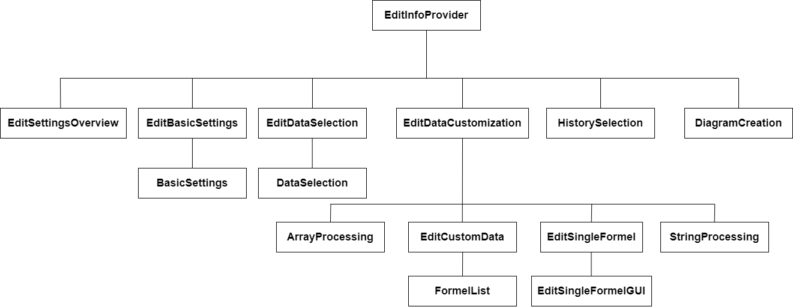

# **Infoprovider-Bearbeitung (EditInfoprovider)**
Die Komponentenstruktur dieses Abschnitts ist wie folgt aufgebaut:

<div style="page-break-after: always;"></div>

## **EditInfoProvider**
Die Komponente **EditInfoProvider** dient dem Bearbeiten eines Infoproviders. Ein User kann hier die Konfiguration eines erstellten Infoproviders ansehen und verändern.

Um das zu ermöglichen, wird der gewünschte Infoprovider vom Backend angefragt. Dieser Vorgang findet in **InfoProviderOverview** statt und ist auch dort in der Dokumentation erklärt. Dort wird beschrieben, dass der Komponente **EditInfoProvider** die wichtigen Informationen in den Properties übergeben wird. Die Informationen sind die Infoprovider-Id (**infoProvId**) und der Infoprovider als ein vom Frontend lesbares Objekt (**infoProvider**). Die Infoprovider-Id ist eine Nummer und kann zu genau einem Infoprovider zugeordnet werden. Sie wird erst wieder benötigt, wenn der bearbeitete Infoprovider zurück an das Backend geschickt wird. Das Backend wird dann den Infoprovider mit der übergebenen Id löschen und durch den neu geschickten ersetzen, was einer Bearbeitung gleich kommt.
Das InfoProvider-Objekt enthält alle Informationen des Infoproviders. Diese Informationen soll der User nun einsehen und bearbeiten können. Das Infoprovider-Objekt hat folgende Struktur:
```javascript
export type FrontendInfoProvider = {
    infoproviderName: string;
    dataSources: Array<DataSource>;
    dataSourcesKeys: Map<string, DataSourceKey>;
    diagrams: Array<Diagram>;
}
```
**DataSource** ist dabei wie folgt aufgebaut:
```javascript
export type DataSource = {
    apiName: string;
    query: string;
    noKey: boolean;
    method: string;
    selectedData: SelectedDataItem[];
    customData: FormelObj[];
    historizedData: string[];
    schedule: Schedule;
    listItems: Array<ListItemRepresentation>;
    arrayProcessingsList: Array<ArrayProcessingData>;
    stringReplacementList: Array<StringReplacementData>;
}

```
**FrontendInfoProvider** ist dabei schon aus **InfoProviderOverview** und **Datasource** aus **CreateInfoProvider** bekannt. Wir haben so den kompletten lesbaren und schreibbaren Zugriff auf die Daten von einem Infoprovider. Sie können direkt verändert und genutzt werden. 
Um dies zu ermöglichen, wird ein State in **EditInfoProvider/index** mit den übergebenen Informationen initialisiert.
```javascript
const [infoProvName, setInfoProvName] = React.useState(props.infoProvider !== undefined ? props.infoProvider.infoproviderName : "");
    const [infoProvDataSources, setInfoProvDataSources] = React.useState<Array<DataSource>>(sessionStorage.getItem("infoProvDataSources-" + uniqueId) === null ? props.infoProvider!.dataSources : JSON.parse(sessionStorage.getItem("infoProvDataSources-" + uniqueId)!));


    const [infoProvDiagrams, setInfoProvDiagrams] = React.useState(props.infoProvider !== undefined ? props.infoProvider.diagrams : new Array<Diagram>());
```
Damit hat die Komponente alle Daten zur Verfügung und die grundlegende Anforderung ist erfüllt.

Die Bearbeitung eines Infoproviders kann als Kopie von der Erstellung des Infoprovider gesehen werden. Der einzige Unterschied ist, dass die Daten, in den Feldern der GUI schon ausgefüllt sind. Kleine Abänderungen kommen trotzdem hinzu. Die Bearbeitung wird wieder als eine Aneinanderreihung von Unter-Komponenten realisiert (genau so, wie in **CreateInfoProvider**). Es gibt wieder die Variable **step**, die den aktuellen Schritt repräsentiert und eine **handleContinue()**- und **handleBack()**-Methode, die für das Wechseln der Schritte zuständig sind. Der Unterschied hier liegt darin, dass **handleContinue()** und **handleBack()** nicht den aktuellen Schritt automatisch dekrementieren oder inkrementieren, sondern sie einen Zahlenwert übergeben bekommen. **step** wird dann um genau diesen Zahlenwert erhöht oder reduziert. Dadurch hat man die Möglichkeit durch das Übergeben von zum Beispiel einer 2, einen Schritt zu überspringen. Das wird in **EditCustomData** wichtig.

Generell sei hier gesagt, dass nicht nochmal auf gewisse Umsetzungen und Implementierungen eingegangen wird, wenn diese übernommen und bereits in einem anderen Abschnitt der Dokumentation beschrieben wurden. Lediglich auftretende Unterschiede werden benannt und erklärt. Diese Komponente ist sehr ähnlich zu **CreateInfoProvider**. Falls die Umsetzung an einer Stelle unklar ist, empfiehlt es sich in **CreateInfoProvider** in der dazugehörigen Komponente nachzusehen.

Erwähnenswert ist noch der State **selectedDataSource**. Dieser enthält einen Zahlenwert, welcher als Index für die aktuell ausgewählte Datenquelle benutzt wird. Ein Infoprovider kann über mehrere Datenquellen durch mehrere API-Abfragen verfügen. Durch ```infoProvDataSource[selectedDataSource]``` kann auf die Daten der aktuell ausgewählten Datenquelle zugegriffen werden. **infoProvDataSource** und **selectedDataSource** wird deshalb immer den Unter-Komponenten per Properties weitergegeben.

Die Schritte, die den User durch die Bearbeitung des Infoprovider führen sind:
* Überblick,
* API-Daten,
* Formeln,
* Einzelne Formeln bearbeiten,
* Historisierung,
* und Diagramme.

Zusätzlich zu den übernommenen Komponenten werden unter den angezeigten Daten drei Schaltflächen generiert:
* eine zum Abbrechen der Bearbeitung (Abbrechen),
* eine zum Speichern des bearbeitenden Infoproviders (Speichern) und
* eine zum Wechseln zum nächsten Schritt (weiter).

Beim Betätigen von "Abbrechen" wird ein Dialog geöffnet, in dem der User die Aktion bestätigen muss und darauf hingewiesen wird, dass alle Änderungen verloren gehen. Der Dialog verhält sich genauso, wie an den anderen Stellen, wo dieses Konstrukt schon verwendet wurde.

## **EditSettingsOverview**
Diese Unter-Komponente enthält den Überblick über die vom Infoprovider beinhalteten Daten. Da der Infoprovider bereits erstellt und mit Daten gefüllt ist, ist es nicht sinnvoll dieselbe Reihenfolge der Schritte, wie bei **CreateInfoProvider** zu wählen. Praktischer ist es, dem User zuerst einen Überblick über den Infoprovider zu geben. Deswegen ist dies der erste Schritt der Infoprovider-Bearbeitung. Diese Komponente basiert auf **SettingsOverview** in **CreateInfoProvider**. Genauso, wie in der Komponente innerhalb von **CreateInfoprovider**, werden hier alle Daten zusammengefasst angezeigt.

### **Hinzufügen von neuen Datenquellen**
Um neue Datenquellen zu einem bereits bestehenden Infoprovider hinzufügen zu können, haben wir die `CreateInfoprovider`-Komponente wiederverwendet. Dazu hat diese ein Interface für die Properties bekommen:

```javascript
interface CreateInfoproviderProps {
    finishDataSourceInEdit?: (dataSource: DataSource, apiKeyInput1: string, apiKeyInput2: string) => void;
    cancelNewDataSourceInEdit?: () => void;
    /*...*/
}
```

Die beiden Methoden sind als Optional gekennzeichnet und werden nur in der Bearbeitung übergeben. Dadurch ändert sich nichts an den bisherigen Aufrufen dieser Komponente. Die beiden im Interface definierten Methoden werden dabei in `handleContinue` bzw. `handleBack` aufgerufen. Im Handler für den nächsten Schritt wird dabei geprüft, ob der aktuelle Schritt = 4 (Historisierung) ist und ob die Funktion `finishDataSourceInEdit` definiert ist. Falls dies zutrifft, so wird die eben angesprochene Funktion aufgerufen. Bei `handleBack` wird ein ähnliches Vorgehen benutzt. Hier wird allerdings geprüft, ob der aktuelle Step = 0 ist und die Methode `cancelNewDataSourceInEdit` definiert ist. Ist dies der Fall, so wird der Session-Storage von `CreateInfoprovider` geleert und die Funktion `cancelNewDataSourceInEdit` wird ausgeführt.

#### **finishNewDataSource und cancelDataSourceCreation**
`finishNewDataSource` bekommt eine `DataSource` und die beiden Keys für die API übergeben. Die neue `DataSource` wird hierbei einfach zu den bestehenden hinzugefügt. Die Keys werden ebenfalls lediglich in die Map der bisherigen Schlüssel eingetragen. In beiden Fällen wird der zugehörige State mit den neuen Objekten überschrieben.

`cancelDataSourceCreation` erhält keine Parameter und setzt den State `newDataSourceMode` mittels der entsprechenden setter-Methode wieder auf false. Der Boolean-Flag `newDataSourceMode` wird dabei benötigt, um in `selectContent` von `EditInfoprovider` die Komponente an der richtigen Stelle zu rendern. Diese wird dabei im `EditSettingsOverview` bei betätigen des entsprechenden Buttons auf true gesetzt. Dafür wird der State mittels props an die Komponente übergeben.

Die beiden Methoden werden dabei, falls diese definiert sind im continue- bzw. back-handler von `CreateInfoprovider` aufgerufen. `finishDataSourceInEdit` wird dabei genau dann aufgerufen, wenn sie nicht `undefined` ist und wenn die Historisierung abgeschlossen ist (`step == 4`). `cancelNewDataSourceInEdit` wird aufgerufen, wenn im diese Methode definiert ist und der Nutzer sich im step 0 der Infoprovider-Erstellung befindet.

#### **Prüfen auf Namensduplikate**
Ein Problem, welches sich hier ergibt, ist die Prüfung auf Duplikate in API-Namen, da `CreateInfoprovider` nicht in der Lage ist zu wissen, welche Datenquellen-Namen es bereits in der Editierung gibt. Die Lösung war es hier dem Interface von `CreateInfoprovider` einen weiteren optionalen Parameter zu übergeben: `checkDuplicateNameInEdit`. Die Funktionsweise ist identisch zur beschriebenen Methode in der Dokumentation zur Infoprovider-Erstellung. Weiterhin fällt bei Betrachten des Codes auf, dass es eine zweite Methode gibt, welche eine sehr ähnliche Funktionalität in `EditInfoprovider` erfüllt. Zu welchem Zwecke diese benötigt wird, wird im nächsten Kapitel erklärt.
<div style="page-break-after: always;"></div>

## **EditBasicSettings**
Um die Komponente `BasicSettings` aus der Erstellung von Infoprovidern übernehmen zu können, musste an dieser eine kleine Modifikation durchgeführt werden. So enthält diese Komponente nun eine Property `isInEditMode`, welche bei Erstellung eines Infoproviders auf `false` gesetzt wird und bei Bearbeitung auf `true`. Mittels der Variable kann in `handleProceed`überprüft werden, ob die Komponente aus der Bearbeitung geladne wurde oder nicht. Wird die Komponente im Kontext der Bearbeitung verwendet, so wird nur der übergebene Continue-Handler aufgerufen. Andernfalls wird der bisherige Code ausgeführt.

Die Komponente `EditBasicSettings` kann die Komponente `BasicSettings` mit dieser einfachen Modifikation verwenden. Weiterhin speichert die Komponente allerdings auch alle relevanten Werte, wie die Query, den API-Namen, etc. ab, um bei betätigen von "zurück" prüfen zu können, ob es eine Änderung gab. Hierfür gibt es entsprechend eine Methode, welche Veränderungen per Boolean-Wert anzeigen kann. Wird nach einer Veränderung die Schaltfläche "zurück" in `BasicSettings` aufgerufen, so wird ein Dialog angezeigt, welcher dem Nutzer aufzeigt, dass seine Änderungen verloren gehen. Wurden keine Änderungen gemacht, so wird auch entsprechender Dialog nicht angezeigt. Die beiden Handler für für continue und back in dieser Komponente, wechseln dabei einfach zum vorherigen bzw. nachfolgenden Step der Infoprovider-Bearbeitung. Dabei war es nicht einfach möglich die Handler aus `EditInfoprovider` zu übernehmen, da diese einen Step erwarten, zu welchem gesprungen werden soll.

In der Oberkomponente `EditInfoprovider` wurden dabei einige Methoden angelegt, welche das Setzen eines einzelnen States simulieren, wenn in `EditBasicSettings` Änderungen vorgenommen wurden. Diese Methoden sind notwendig, da `BasicSettings` die Änderungen auf diese Weise gleich in die richtigen States schreibt. Auch gibt es hier wieder eine Methode für den Check auf Duplikate bei API-Namen. Diese returned aber nicht `true` falls die API-Namen gleich sind, aber die aktuell durchsuchte Datenquelle der ausgewählten Datenquelle entspricht, denn der Name ist an sich zwar vereben, aber eben genau an die ausgewählte Quelle und soll daher verwendet werden können. Die zugehörige Methode heißt `checkDuplicateNameForEditDataSource`.
<div style="page-break-after: always;"></div>

## **EditDataSelection**
Die Komponente **EditDataSelection** ist das Gegenstück zu **DataSelection** aus der Erstellung von Infoprovidern und ermöglicht es entsprechend, die Auswahl der Daten der API zu ändern, die man verwenden möchte (d.h. die für Szenen, Diagramme, Formeln, Historisierung usw. zur Verfügung stehen).

Da die Oberfläche sich nicht weiter von der von **DataSelection** unterscheidet macht es wenig Sinn, die Komponente erneut zu schreiben - stattdessen ist es hier deutlich sinnvoller, einfach von dieser Komponente aus **DataSelection** im Rendering einzubinden. Damit spart man nicht nur Code, sondern muss auch alle Abhängigkeits-Funktionalitäten nicht neu implementieren:
* So untersucht bspw. die Komponente **DataSelection** beim Klicken des "weiter"-Buttons, ob Elemente abgewählt wurden und dadurch historisierte Daten, Formeln oder Diagramme gelöscht werden müssen - der Nutzer wird dann per Dialog gewarnt.
    * Diese und andere Abhängigkeiten sind in der Bearbeitung genauso existent, müssen aber nicht neu in Methoden umgesetzt werden, da die eingebundene Komponente dies bereits mitliefert.

Wenn es nun keine Unterschiede geben würde, so würde die Komponente **EditDataSelection** vermutlich keinen Sinn ergeben und man könnte direkt **DataSelection** einbinden. Das stimmt jedoch nicht ganz, da ein wichtiger Sonderfall betrachtet werden muss: Das **listItems**-Array mit allen Daten, die die API liefert wird beim Erstellen eines Infoproviders zwar im Backend gespeichert, jedoch ist es gut möglich, dass eine API in der Zwischenzeit ihr Datenformat angepasst/gekürzt/erweitert hat.
* Fehlen Daten, so hätten wir das Problem, dass vom Nutzer getroffene Auswahlen nicht mehr gültig sind (das würde er spätestens durch Fehler bei Videojobs merken).
* Kommen neue Daten hinzu, so ist es wünschenswert, dass diese dem Nutzer bei der Bearbeitung auch angezeigt werden - es wäre denkbar, dass man mit einer eigenen API arbeitet, dieser erweitert hat und nun seine Datenquelle entsprechend bearbeiten möchte.

Um diese Probleme zu lösen enthält die Komponente eine Methode **fetchTestData**, welche die in der Erstellung von Infoprovidern in **BasicSettings** stattfindende Abfrage der API über den Endpunkt **/checkapi** macht und sich so vom Backend das Datenobjekt der API senden lässt. Der Aufruf findet per **useEffect**-Hook automatisch beim Mounten der Komponente statt.
* **handleTestDataSuccess** behandelt erfolgreiche Anfragen, indem es die in der Dokumentation zur Infoprovider-Erstellung bereits behandelte Methode **transformJSON** aufruft und das Objekt der API so in die Frontend-Repräsentation umwandelt. Das Ergebnis wird in **newListItems** gespeichert.
    * Auf Basis von **newListItems** wird die Auswahl in der aufgerufenen **DataSelection** dargestellt, sodass die Anforderung, neue Daten sehen zu wollen hiermit bereits erfüllt ist.
* Anschließend kommt die Methode **dataContained** zum Einsatz. Diese geht durch die neue Liste aller vom Nutzer ausgewählten Daten **selectedData** sowie alle erstellte Diagramme und prüft, ob alle Daten aus selectedData weiterhin in der neuen Antwort vorhanden sind. Darüber hinaus prüft sie, ob alle in Diagrammen verwendete Arrays in der Liste enthalten sind.
    * Nur wenn dies alles erfüllt ist sind alle von uns benutzten Daten noch in der Antwort der API enthalten - wir können die neuen Daten dann bedenkenlos nutzen.

Im Falle eines Fehlers bei **dataContained** (d.h. ein Element ist nicht enthalten) wird ein Dialog statt **DataSelection** angezeigt, der den Nutzer auf dieses Problem hinweist. Dem Nutzer werden im Dialog zwei Optionen gestellt, mit denen er fortfahren kann:
* "Neue Antwort verwerfen" ignoriert, dass die API-Antwort anders war und behält die alten Einstellungen. Der Nutzer kann dann keine weitere Bearbeitung der Datenquelle vornehmen.
    * Er agiert hier auf eigenes Risiko hin, z.B. wenn er weiß, dass es sich nur um ein temporäres Problem handelt.
* "Einstellungen/Diagramme löschen" entfernt sämtliche Einstellungen für die Datenquelle und beginnt damit quasi mit ihrer Erstellung von vorne, dieses Mal aber mit den aktuellen Daten. Diagramme, die Daten der Datenquelle nutzen müssen dabei gelöscht werden.

Solange der Dialog oder DataSelection noch nicht angezeigt werden zeigt die Komponente einen **Spinner** als Ladeanimation.
<div style="page-break-after: always;"></div>

## **EditDataCustomization**
Wie auch in der Erstellung eines Infoproviders kann man bei der Editierung auf drei verschiedene Abschnitte zugreifen - Array-Operationen, Formel-Erstellung und String-Ersetzungen. Da alle drei wieder in einem Schritt zusammengefasst werden sollen gibt es die Komponente **EditDataCustomization**, welche per **props** den aktuellen Schritt **dataCustomizationStep** übergeben bekommt. Anhand dieses Schritts wählt sie in **getContents** aus, welche Komponente für einen der drei Schritte angezeigt werden soll.

Dabei ist es so, dass **ArrayProcessing** und **StringProcessing** ohne Anpassung verwendet werden können - man ruft die Komponenten schlicht auf und übergibt per **props** die Variablen der aktuell bearbeiteten Datenquelle. Daher verzichten wir auf weitere Erläuterungen und verweisen auf die Dokumentation zu **CreateInfoProvider**, in der beide Komponenten detailliert vorgestellt werden.

## **EditCustomData**

Hier kann der User seine erstellten Formeln einsehen und bearbeiten. Hierbei müssen die Formeln des Infoproviders wieder in einer Liste angezeigt werden, wobei jedes Listenelement den Namen der Formel und den zugehörigen Formel-String enthält. Zusätzlich soll man die Möglichkeit haben eine ausgewählte Formel zu löschen oder zu Bearbeiten. 

### **Liste der Formeln**

Die Liste der Formeln wird in einer Hilfskomponente **FormelList** erstellt, die in **EditCustomData** eingebunden wird. Mit ```props.infoProvDataSources[props.selectedDataSource].customData``` können wir dieser Komponente, die nötigen Informationen übergeben. In **FormelList** werden quasi zwei Listen nebeneinander dargestellt. Die eine beinhaltet die Namen der Formeln, die andere die Formel als String mit zwei Schaltflächen für das Löschen und Bearbeiten. Da beide Listen nebeneinander und in einem Schritt erstellt sind, gehören die nebeneinander liegenden Items jeweils zueinander. Es wird also der Name immer neben der dazugehörigen Formel gerendert, auch wenn die Listen im Grunde unabhängig voneinander erstellt werden. Die Methode **renderListName()** übernimmt dabei die Namen und die Methode **FormelListItem** den Formel-String. In **FormelList** kann durch die *map*-Funktion auf dem übergebenen **customData**-Array auf jedes darin enthaltene **formelObj** zugegriffen werden. Diese werden den renderList-Methoden übergeben. Somit können die Daten dem User korrekt angezeigt werden.
Zusätzlich werden für jede Formel die Löschen- und Bearbeiten-Schaltfläche generiert. Die hier verwendeten Handler-Methoden wurden auch per Properties übergeben und sind in **EditCustomData** implementiert.

#### **Löschen von Formeln**

Da wir lesenden und schreibenden Zugriff auf das aktuelle Objekt haben, stellt sich diese Aufgabe als weniger anspruchsvoll heraus. Die jeweilige Formel kann durch ihren Namen eindeutig identifiziert werden. Sie muss nun nur aus **customData** und **historizedData** entfernt werden und die Formel ist aus dem Objekt endgültig gelöscht. Es wird ebenfalls wieder ein Dialog verwendet, der über **removeDialogOpen** geöffnet oder geschlossen werden kann. Mittels **handleDelete** wird der Wert von **removeDialogOpen** auf true gesetzt. Dadurch wird der Dialog gerendert. Aufgerufen wird handleDelete durch die entsprechende Löschen-Schaltfläche. Bei der Bestätigung des Users wird **confirmDelete()** aufgerufen und der Löschvorgang wird ausgeführt. Hier wird zusätzlich die Methode **checkForHistorizedData** aus **EditCustomData/index** aufgerufen. Da Formeln Teil von den historisierten Daten sein können, müssen sie auch bei einem Löschvorgang aus diesen entfernt werden. Dadurch kann es passieren, das es keine weiteren historisierten Daten gibt. In diesem fall mus das dazugehörige **Schedule**-Objekt auch gelöscht werden.

### **Bearbeiten von Formeln**

Durch den lesenden und schreibenden Zugriff ist das Bearbeiten bzw. Ersetzen kein Problem. Es ergibt sich jedoch eine Herausforderung. Im Backend ist die Formel als String dargestellt. Unter der in **CreateCustomData** verwendeten **CustomDataGUI** ist die Formel jedoch als Array von **StrArg**-Objekten implementiert. Aufgabe hier ist es also, einen String in die Objekt-Struktur zu übersetzen, um die **CustomDataGUI** korrekt weiterzuverwenden.

Für das Bearbeiten einer einzelnen Formel wurden die Komponenten **EditSingleFormel** und **EditSingleFormelGUI** implementiert. Diese basieren auf den Komponenten **CreateCustomData** und **CreateCustomDataGUI** und sind fast vollständig übernommen. Der erste Unterschied ist, dass **EditCustomDataGUI** schon mit übergebenen Daten initialisiert wird. Es müssen die richtigen Werte übergeben werden, damit die Formel korrekt editiert werden kann. Das bedeutet, dass ein vollständiges **StrArg**-Array übergeben wird. Die Flags müssen passend weitergegeben werden, damit die richtigen Schaltflächen deaktiviert sind und damit die Syntax-Prüfung gewährleistet ist. Zusätzlich muss die Anzahlt der Klammern übergeben werden, um richtig auf zum Beispiel ein Entfernen einer Klammer zu reagieren. Dazu wurde ein passender Typ erstellt, der alle wichtigen Informationen enthält:
```javascript
export type formelContext = {
    formelName: string
    parenCount: number;
    formelAsObjects: Array<StrArg>;
    dataFlag: boolean;
    numberFlag: boolean;
    opFlag: boolean;
    leftParenFlag: boolean;
    rightParenFlag: boolean;
}
```
Ein gefülltes Objekt dieses Typen kann **EditSingleFormel** übergeben werden. Dort können sie durch den **initialState** zugewiesen werden. In **EditCustomData** ist die ausschlaggebende Methode **makeFormelContext** implementiert. Sie übernimmt einen Formel-Namen und ein Formel-String (der Inhalt von einem **formelObj**) und gibt ein passendes **formelContext**-Objekt zurück.
Zuerst wird in **makeFormelContext** ein leeres **formelContext**-Objekt erzeugt, welches im Verlauf der Methode vollständig gefüllt werden soll. Da der Name mit übergeben wird, kann er dem **formelContext**-Objekt gleich zugewiesen werden.
Als Nächstes wird **formelAsObj** ein leeres **StrArg**-Array erstellt. Jetzt kommt der Teil, wo der Formel-String in die korrekten **StrArg**s übersetzt wird. Der erste Schritt hierbei ist die Verwendung von *split*. Diese Funktion trennt ein String an einem übergebenen Trennzeichen und erstellt daraus ein Array. Das übergebene Zeichen ist bei uns das Leerzeichen. So wird aus dem Beispiel "```formel1_2 / (3 * (Array2|Data0 - 5))```" das folgende Array:
```[ "formel1_2" | "/" | "(3" | "*" | "(Array2|Data0" | "-" | "5))" ]```.
Das Array wird in **formelWithoutBlank** zwischengespeichert. Die Strings, die **formelWithoutBlank** beinhaltet, werden im Folgenden als **Formel-Abschnitt** bezeichnet.
Durch Klammer entstehen allerdings noch Strings, die nicht korrekt als **StrArg** verwendet werden können. Zusätzlich muss zwischen Nummern und Daten-Objekten unterschieden werden. Diese ganzen Verarbeitungen werden in einer *forEach*-Schleife durchgeführt. Es wird also für jeden String in **formelWithoutBlank** das Folgende ausgeführt:
* Zuerst wird ein boolean-Flag namens **notPushed** mit false erstellt. Dieser zeigt an, ob bereits ein **StrArg** in **formelAsObj** hinzugefügt wurde. Das wird in späteren Überprüfungen gebraucht.
> Für die nächsten Verarbeitungen ist wichtig zu wissen, dass wir davon ausgehen können, das der Formel-String eine korrekte Formel beinhaltet. Die Formel kommt direkt aus dem Backend. Dort kann sie nur gespeichert werden, falls die Syntax richtig ist.

* Es wird zuerst nach öffnenden Klammern gesucht, da diese zuerst in **Formel-Abschnitten** vorkommen müssen. Ein Beispiel hier ist ```"(3"```. In einer *While*-Schleife wird festgelegt, dass so lange der **Formel-Abschnitt** "(" enthält immer ein **StrArg** mit "(" in **formelAsObj** hinzugefügt wird, die öffnende Klammer durch *replace* entfernt wird und **parenCount** wird direkt in dem **formelContext**-Objekt um 1 erhöht. Wenn alle **Formel-Abschnitte** bearbeitet wurden, ist so gleich der korrekte **parenCount** festgelegt.
* Als Nächstes wird auf die gleiche Weise jede schließende Klammer entfernt. Hier kann man nicht gleich ein **StrArg** hinzufügen, da die schließenden Klammern nur am Ende des **Formel-Abschnitt** vorkommen können. Ein Beispiel ist ```"5))"```. Aus diesem Grund wird die Variable **countClosingParens** erstellt, die mitzählt, wie oft eine schließende Klammer in dem aktuellen **Formel-Abschnitt** entfernt wurde. Am Ende kann die entsprechende Anzahl an **StrArg**s hinzugefügt werden.
* Jetzt sind alle Klammern, die ein **Formel-Abschnitt** enthalten kann behandelt und es bleibt nur der Teil, der ein Objekt darstellt: 
    * ```(Array2|Data0``` -> ```Array2|Data0```;
    * ```5))``` -> ```5```
    
* Zuerst wird auf ein Operator geprüft. Dafür ist eine Hilfsmethode implementiert worden. **checkOperator()** bekommt einen String übergeben und gibt true zurück, falls das erste Element des Strings +, -, *, / oder % ist. Dabei muss nur das erste Element geprüft werden, da ein Operator nur ein Zeichen hat. Es wird trotzdem geprüft, ob der **Formel-Abschnitt** nur ein Zeichen lang ist. Andernfalls würde das erste Zeichen zu einem Daten-Wert-Namen gehören. Wenn beide Überprüfungen true ergeben, wird ein **StrArg** mit dem **Formel-Abschnitt**, der ein Operator ist, in **formelAsObj** hinzugefügt.
* Als Nächstes wird darauf geprüft, ob der **Formel-Abschnitt** nur Nummern (0-9) enthält. Dazu gibt es eine weitere Hilfsmethode namens **checkFindOnlyNumbers**. Diese bekommt einen String übergeben und gibt true zurück, falls dieser aus nur Nummern besteht. Ist das der Fall, wird ein **StrArg** mit dem **Formel-Abschnitt**, der eine Nummer ist, in **formelObj** hinzugefügt.
* Jetzt sind alle Möglichkeiten ausgeschlossen, außer ein Daten-Wert (wie ```Array2|Data0```). Wenn also bisher noch nichts in **formelAsObj** hinzugefügt wurde (ausgeschlossen von Klammern) kann mit Sicherheit davon ausgegangen werden, dass der **Formel-Abschnitt** ein Daten-Wert ist. Dafür wird **notPushed** überprüft. Wenn dieser noch true ist, wird ein **StrArg** mit dem **Formel-Abschnitt** in **formelAsObj** hinzugefügt.
* Als Letztes muss **countClosingParens** mal oft ein **StrArg** mit ")" in **formelAsObj** hinzugefügt werden.

Wenn jeder **Formel-Abschnitt** bearbeitet wurde, ist **formelAsObj** jetzt vollständig und korrekt. Das Array kann nun also in die vorher erstellte Variable **formelKontext** mitaufgenommen werden.
Die nächste Aufgabe ist es, die Flags für die Schaltflächen in dem **formelContext**-Objekt richtig zu initialisieren. Dazu gibt es eine Hilfsmethode (**setRightFlags**). Diese bekommt ein **formelContext**-Objekt mit einem schon gefüllten **StrArg**-Array übergeben. Hier wird dann das letzte Objekt dieses Arrays überprüft. Da wir von einer korrekten Formel ausgehen können, müssen wir nur auf eine Nummer prüfen. Falls das **StrArg**-Objekt eine Nummer ist, werden dementsprechend die Flags gesetzt. Andernfalls kann das letzte Objekt nur eine schließende Klammer sein, oder ein Daten-Wert. Beide verhalten sich hinsichtlich der Flags gleich und diese können entsprechen gesetzt werden.
Nach diesem Schritt ist das **formelContext**-Objekt vollständig und wird zurückgegeben. Falls der User in einem Dialog bestätigt, dass er die Formel bearbeiten will, wird der State **formelInformation** mit **makeFormelKontext** gesetzt und dieser wird der **EditSingleFormelGUI** übergeben. 
Ein zusätzlicher kleiner Unterschied zu dem Original ist hier, dass keine Löschen-Schaltflächen neben den Formel-Werten in der Liste generiert werden. Die Option eine Formel zu löschen erhält man in **EditCustomData** in der Formel-Übersicht.
Falls ein User eine neue Formel erstellen will, wird **EditSingleFormelGUI** ein leeres **formelContext**-Objekt mit den Initial-Flags übergeben. So verhält sich die **EditSingleFormelGUI** auch bei keinem Input richtig.

## **Diagramme editieren**
Die Editierung der Diagramme stellt die einfachste aller Implementierungen dar - gegenüber der Komponente **DiagramCreation** aus der Erstellung der Infoprovider sind keinerlei Anpassungen oder Ergänzungen nötig, sodass man einfach die Datenwerte des bearbeiteten Infoproviders per **props** übergibt und die Komponente direkt aus **EditInfoProvider** heraus aufruft.