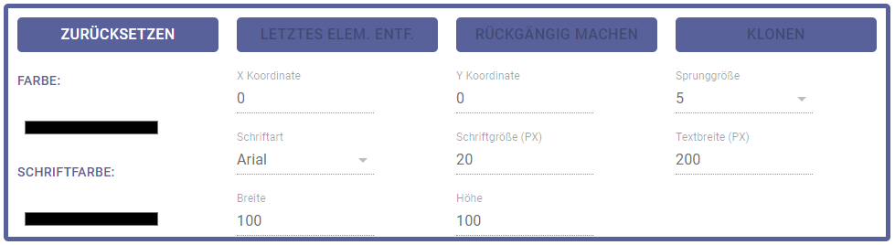

<!-- vscode-markdown-toc -->
* 1. [**SceneCreation**](#SceneCreation)
	* 1.1. [**Auswahl der verschiedenen Schritte**](#AuswahlderverschiedenenSchritte)
	* 1.2. [**Bilder, Hintergrundbilder und Diagramme**](#BilderHintergrundbilderundDiagramme)
		* 1.2.1. [**Wiederherstellung der Bilder beim Neuladen**](#WiederherstellungderBilderbeimNeuladen)
* 2. [**InfoProviderSelection**](#InfoProviderSelection)
	* 2.1. [**Darstellung der verfügbaren Infoprovider**](#DarstellungderverfgbarenInfoprovider)
	* 2.2. [**Verarbeitung der Infoprovider-Daten**](#VerarbeitungderInfoprovider-Daten)
* 3. [**Szenen-Erstellung (SceneEditor)**](#Szenen-ErstellungSceneEditor)
	* 3.1. [**Canvas**](#Canvas)
		* 3.1.1. [**Datentypen**](#Datentypen)
		* 3.1.2. [**States für die Verwaltung**](#StatesfrdieVerwaltung)
		* 3.1.3. [**Transformer**](#Transformer)
		* 3.1.4. [**Transformation von Elementen**](#TransformationvonElementen)
	* 3.2. [**"Bedienfeld"**](#Bedienfeld)
	* 3.3. [**Datenauswahl**](#Datenauswahl)
		* 3.3.1. [**API-Texte**](#API-Texte)
		* 3.3.2. [**ImageLists**](#ImageLists)
		* 3.3.3. [**DiagramsList**](#DiagramsList)
		* 3.3.4. [**Hinzufügen von Bildern auf dem Canvas**](#HinzufgenvonBildernaufdemCanvas)
	* 3.4. [**Speichern der Szene**](#SpeichernderSzene)
* 4. [**Editierung von Szenen**](#EditierungvonSzenen)
	* 4.1. [**Besonderheit in der sessionStorage-Verwendung**](#BesonderheitindersessionStorage-Verwendung)
	* 4.2. [**Vorbereitung der Backend-Daten**](#VorbereitungderBackend-Daten)
	* 4.3. [**Identifikation der korrekten Bilder**](#IdentifikationderkorrektenBilder)
	* 4.4. [**Absenden des bearbeiteten Infoproviders**](#AbsendendesbearbeitetenInfoproviders)

<!-- vscode-markdown-toc-config
	numbering=true
	autoSave=true
	/vscode-markdown-toc-config -->
<!-- /vscode-markdown-toc -->

# **Szeneneditor**
Die Komponenten dieses Abschnitts sind wie folgt strukturiert:

<div style="page-break-after: always;"></div>

##  1. <a name='SceneCreation'></a>**SceneCreation**
Die Wrapper-Komponente des Szeneneditors ist **SceneCreation** und beinhaltet zum einen die States, die für die allgemeinen Einstellungen zu einer Szene notwendig sind, zum anderen aber auch die notwendige Logik zum Abrufen aller Bilder, Hintergrundbilder und Diagramme. Auch ist die Logik zum Initialisieren der Editierung bestehender Szenen enthalten, diese wird aber später in einem eigenen Abschnitt beschrieben.

Der State der Komponente speichert zum einen **sceneEditorStep**, welcher wie aus anderen Wrapper-Komponenten bekannt den derzeitigen Fortschritt in der Szenenerstellung wiedergibt und zur Auswahl der Komponenten dient. Darüber hinaus enthält der State größtenteils Informationen zum Infoprovider, der für die Szeneneditierung ausgewählt wurde und geladen wurde:
* **selectedDataList**, **customDataList**, **historizedDataLis**, **arrayProcessingList** und **stringReplacementList** umfassen jeweils eine Liste, die alle Daten der zugehörigen Kategorie von allen Datenquellen des gewählten Infoproviders auflistet. Dabei handelt es sich mit Ausnahme der historisierten Daten, die noch ein Schedule-Objekt halten (wird in der Anzeige für die Auswahl historisierter Daten benötigt) um einfache Strings.
    * Das liegt daran, dass die komplexeren Datenstrukturen wie z.B. **ArrayProcessingData** hier nicht benötigt werden, sondern lediglich der Name, da der Nutzer schlicht eine Liste an Daten zur Auswahl hat und die Daten als speziell formatierte Texte in die Szene eingefügt werden. Alle Details zur Umwandlung in "echte" Datenwerte werden dann in der Szenengenerierung des Backend geregelt.
* **diagramList** enthält eine Liste der Diagramme des Infoproviders, die als spezieller Datentyp **DiagramInfo** aufbereitet sind:
```javascript
export type DiagramInfo = {
    name: string;
    type: string;
    url: string;
}
```
* **name** und **type** sind dabei aus der Diagrammerstellung bekannt, **url** ist hingegen neu: Zur besseren grafischen Ansicht sollen dem Nutzer im Szeneneditor vom Backend generierte Previews zu jedem Diagramm angezeigt werden. Dazu werden diese Previews vom Backend geladen und unter einer Frontend-URL verfügbar gemacht, die hier gespeichert wird - Details folgen im entsprechenden Abschnitt.
* **imageList** und **backgroundImageList** sind eine Liste aller vom Backend verfügbaren Bilder, die als Hintergründe oder gewöhnliche Bilder in Szenen genutzt werden können.
* Die restlichen States dienen als einfache Flags oder für die Editierung (auf welche im entsprechenden Abschnitt eingegangen wird).

###  1.1. <a name='AuswahlderverschiedenenSchritte'></a>**Auswahl der verschiedenen Schritte**
Wie bereits erwähnt dient die State-Variable **sceneEditorStep** der Auswahl des aktuellen Schritts im Szenen-Editor - ein wenige zusätzliche Komplexität kommt jedoch für das Nachladen von Bildern hinzu. Im allgemeinen wird durch die Methode **selectContent** zwischen den beiden Schritten **InfoProviderSelection** zur Auswahl des zu nutzenden Infoproviders (Schritt 0) und **SceneEditor** differenziert, welcher zur eigentlichen Szenenerstellung gehört (Schritt 1).

Jedoch ist es bei einem Neuladen der Seite aus später erläuterten technischen Gründen nötig, alle Bilder vom Backend erneut zu laden. Da diese per **props** an **SceneEditor** übergeben werden müssen gibt es eine dritte Ansicht, die gezeigt wird, wenn **displaySpinner** den Wert **true** hat - es ist ein eigenes **StepFrame**, welches ausschließlich einen Ladekreis für das Anzeigen der Bilder darstellt. Abgesehen davon wird immer dann, wenn **fetchImageDialogOpen** den Wert **true** hat ein entsprechender Dialog angezeigt, in dem der Nutzer das erneute Laden der Bilder bestätigen muss - auch das hat technische Gründe.

###  1.2. <a name='BilderHintergrundbilderundDiagramme'></a>**Bilder, Hintergrundbilder und Diagramme**
Grundsätzlich gibt es drei verschiedene Arten von Bilder, die vom Backend geholt werden müssen: Bilder, Hintergrundbilder und Diagramm-Previews. Ziel ist dabei im allgemeinen, die Bilder vom Backend abzurufen, als Blob zu verwenden und unter einer URL des Frontends verfügbar zu machen, sodass man mit etwaigen **src**-Attributen in HTML-Elementen auf sie zugreifen kann.

Das Abrufen der Bilder wird zunächst durch das Bestätigen der Auswahl eines Infoproviders in **InfoProviderSelection** ausgelöst, zu welchem Zweck dieser eine Funktion **fetchImages** per **props** übergeben wird. Tatsächlich übergeben wird aber die Funktion **fetchImageList**, welche den Anfang der Fetch-Kette für alle Bilder darstellt. Diese hat ein einfaches Prinzip:
1. Rufe die Liste aller Bilder ab, dann jedes einzelne dieser Bilder.
2. Rufe die Liste aller Hintergrundbilder ab, dann jedes einzelne dieser Bilder.
3. Rufe anhand der Daten des Infoproviders alle Diagramm-Previews ab.

**fetchImageList** ist eine Fetch-Methode, welche über die Route `/visuanalytics/image/all/pictures` vom Backend alle Bilder erhält. Das Format ist dabei ein Array von folgenden Objekten:
```javascript
export type ImageBackendData = {
    image_id: number,
    path: string
}
```
Die **image_id** ist die ID des Bildes im Backend, **path** der Dateipfad auf dem Server. Dieser Dateipfad muss bei der Generierung der Szene in das entsprechende Bild-Objekte eingetragen werden und wird daher hier übergeben. Die Methode **handleImageListSuccess** verarbeitet die Antwort, indem sie das Ergebnis in den **current**-Wert der **useRef**-Variable **allImageList** setzt.
* Die Verwendung von **useRef** ist in diesem Mechanismus allgemein von wichtiger Bedeutung: Zwischen den Fetches der Bilder geschieht ohne weitere Auswirkung von außen keinen Render, sodass auch keine Updates der States stattfinden! Folglich wählen wir mutable Variablen, die ohne Re-Render ihren Wert ändern und übertragen am Ende des Prozesses ihren Wert in den State.

Nach dem Setzen der Variable wird **fetchNextImage** aufgerufen. Diese Methode stellt ein allgemeines Pattern dar, welches bei allen drei Bild-Arten genutzt wird: Die Methode prüft, ob **allImageList** leer ist - dann gibt es keine Bilder mehr, die gefetched werden sollen. Ist sie jedoch nicht leer, so wird der erste Index entnommen und mit dessen **nextId** und **nextURL** (steht hier für den Backend-Pfad) **fetchImageById** aufgerufen. Der Eintrag wird aus der **allImageList** entfernt, sodass mit jedem abgefragten Bild eines weniger verbleibt.

**fetchImageById** fragt dabei die Backend-Route `/visuanalytics/image/<id>` an und erhält als Antwort ein **BLOB**, welches wir mit **res.blob()** entsprechend verarbeiten. Es ist ein **Binary Large Object** und entsprechend ein binäres Datenobjekt, welches das gesendete Bild repräsentiert. Ungewöhnlich ist in dieser Fetch-Methode, dass dem Handler **handleImageByIdSuccess** nicht nur die Antwort, sondern auch die übergebenen Parameter der ID des Bildes und des Backend-Pfades als **id** und **url** übergeben werden. Dies hat den Hintergrund, dass die Informationen in die Liste der gefetchten Bilder eingetragen werden muss.
* Diese Ergebnisliste ist **imageFetchResults**, die wie bereits angesprochen eine **useRef**-Variable ist und ihren Wert somit ohne Render ändert.
* Es wird ein neues Objekt erstellt, welches neben der ID und dem Backend-Pfad als **image_blob_url** die Rückgabe von **URL.createObjectURL(jsonData)** enthält - durch den Aufruf dieser Methode wird eine neue **Objekt-URL** erzeugt, mit der das BLOB-Objekt im Frontend abgerufen werden kann. Der Rückgabewert ist die URL dieses Objektes (es befindet sich entsprechend im Client-Speicher).
* Schlussendlich wird **fetchNextImage** erneut aufgerufen, um auf weitere abzufragende Bilder zu prüfen.

Sobald nun alle Bilder auf diese Weise abgefragt wurden, endet **fetchNextImage** und nutzt **setImageList(imageFetchResults.current)**, um die Ergebnisse aus der **useRef**-Variable in den State zu übertragen, sodass sie von der genutzt werden. Es folgt der Aufruf von **fetchBackgroundImageList**.
* An diesem Punkt soll auf eine detailliertere Beschreibung verzichtet werden, weil der Mechanismus genau der gleiche ist: Alle Bilder abfragen, solange einzelne Bilder abfragen, bis keine mehr übrig bleiben.

Im Anschluss wird **fetchNextDiagram** aufgerufen, welches im Grunde gleich verfährt, nur für die Diagramm-Previews. Ein feiner Unterschied ist jedoch, dass man hier nicht mit dem Abrufen aller Diagramme beginnen muss - dies wurde bereits durch **InfoProviderSelection** bei der Aufbereitung der Antwort zur Abfrage des gewählten Infoproviders bereit, sodass die **useRef**-Variable **diagramsToFetch** bereits alle Diagramme umfasst. Die Antwort-Verarbeitung in **diagramPreviewSuccessHandler** unterscheidet sich hinsichtlich des erstellten Objektes - dieses ist vom Typ **DiagramInfo**, der bereits vorgestellt wurde. Name und Typ sind bereits durch die Liste aller Diagramme gegeben, sodass hier lediglich die BLOB-URL gespeichert wird.
* Ist hier das letzte Diagramm abgefragt wird danach unterschieden, ob die Bilder initial oder erneut geladen wurden - beim erneuten Laden muss der Spinner/Ladekreis mit **setDisplaySpinner(false)** ausgeschaltet werden, beim initialen Laden muss **handleContinue** zum Weitergehen zum nächsten Schritt aufgerufen werden.

####  1.2.1. <a name='WiederherstellungderBilderbeimNeuladen'></a>**Wiederherstellung der Bilder beim Neuladen**
Wie in allen Abschnitten der Anwendung sollte es im Szenen-Editor möglich sein, beim Neuladen der Seite den Zustand der Ansicht wiederherzustellen, damit keine wichtigen Einstellungen verloren gehen. Dies war hinsichtlich der Bilder eine besondere Herausforderung, da sie durch die BLOB-URL-Erstellung in einem Speicher liegen, den wir direkt verwalten können. Allgemein ist dokumentiert, dass die Gültigkeitsdauer an **document** gebunden sein - die Praxis zeigt, dass die Bilder mit einem Neuladen der Seite nicht mehr verfügbar sind. Es ist daher notwendig, dass beim Neuladen auch alle Bilder erneut vom Backend geladen werden.
* Hinsichtlich des benötigten Traffics ist dies suboptimal und nicht wirklich zufriedenstellen, eine bessere Lösung konnten wir aber nicht finden. Immerhin wirkt die Nutzung des Browser-Cache hier normalerweise entgegen.

Das optimale Vorgehen zum Neuladen der Bilder würde so aussehen, bei einem Neuladen mit **useEffect** die Abfrage aller Bilder auszulösen und am Ende wieder den Szeneneditor zu öffnen. Wie in anderen Dokumentationsanteilen jedoch bereits erläutert wurde müssen Fetch-Methoden in **useEffect** memoisiert sein. Dies war bei unserem Pattern dadurch erschwert, dass dann, wenn eine Methode oder Variable in der Dependency eines **useCallback** verwendet werden soll die Definition nach dem Prinzip **declare before use** erfolgen muss.
* Mit z.B. **fetchNextImage**, welches **fetchImageById** aufruft, dessen Success-Handler wiederum **fetchNextImage** haben wir hier aber eine zyklische Struktur, bei der ein solches **declare before use** nicht möglich ist. Wir konnten durch Recherche keine passende Lösung finden.
* Daher blieb uns nur die "Notlösung", über einen Button-Click die Abfrage zu starten - dann ist keine Memoisierung notwendig.

Dieser Button befindet sich in einem Dialog, der bereits bei der Erläuterung der verfügbaren Schritte benannt wurde. Gesteuert wird dessen Anzeige über **fetchImageDialogOpen**. Der Mechanismus funktioniert hier so, dass in dem **useEffect**, welcher zum Neuladen der States aus dem sessionStorage dient folgende Abfrage gemacht wird:
```javascript
 if (Number(sessionStorage.getItem("sceneEditorStep-" + uniqueId) || 0) === 1) {
            diagramsToFetch.current = sessionStorage.getItem("diagramList-" + uniqueId) === null ? new Array<DiagramInfo>() : JSON.parse(sessionStorage.getItem("diagramList-" + uniqueId)!);
            refetchingImages.current = true;
            setDisplaySpinner(true);
            setFetchImageDialogOpen(true);
        }
```
* Es wird geprüft, ob der derzeitige Schritt 1 ist - wenn ja, dann befinden wir uns im Szeneneditor. Dieser Fall kann nur durch ein Neuladen im Szeneneditor erreicht werden, da nur bei einem Neuladen die **useEffect**-Hook ausgelöst wird und der Step 1 nur im Szeneneditor gesetzt sein kann.
* Ist dieser Fall eingetroffen, so wird anhand des sessionStorage die Liste der abzufragenden Diagramme initialisiert. Mit **refetchingImages** wird ein Flag gesetzt, anhand dessen an anderen Stelle geprüft wird, ob gerade Bilder neu geladen werden.
* Abschließend wird sowohl der Spinner angezeigt als auch der Dialog geöffnet.
* In diesem Dialog wählt der Nutzer nun per Button das Neuladen und löst so **fetchImageList** aus - der bekannte Mechanismus aus dem vorherigen Abschnitt startet und endet dank der Erkennung des erneuten Ladens anhand von **true** in **refetchingImages.current**, dass nun nur noch der Spinner deaktiviert werden muss.
* Sollte irgendeine der Abfragen fehlschlagen, so wird durch die Error-Handler sichergestellt, dass der Dialog im Fall der erneuten Abfrage nochmals geöffnet wird.

<br>

> <strong>Entwickler-Anmerkung:</strong><br>Bei der Arbeit mit den Bildern sollte unbedingt darauf geachtet werden, keine Verwirrungen mit dem Browser-Cache zu erhalten. Sollte die Datenbank und die Backend-Ordner zurückgesetzt werden, so hat sich der Browser evtl. für die einzelnen Bilder-IDs noch die alten Images in seinem Cache gemerkt und wird daher beim Laden von Bildern, die man nach dem Zurücksetzen des Backends hinzugefügt hat, eigentlich längst entfernte Bilder anzeigen.<br> Ein manueller Reset des Browser-Cache für die Seite ist an dieser Stelle notwendig.

<div style="page-break-after: always;"></div>


##  2. <a name='InfoProviderSelection'></a>**InfoProviderSelection**
Den ersten Schritt der Erstellung einer neuen Szene repräsentiert **InfoProviderSelection**, in welchem der Nutzer aus der Liste aller verfügbaren Infoprovider einen Infoprovider auswählt, dessen Daten und Diagramme in der neuen Szene zur Verfügung stehen sollen.
* Dabei haben wir die vorläufige Design-Entscheidung getroffen, nur einen Infoprovider gleichzeitig und auch keine Szenen ohne solchen zu erlauben. Im Grunde gibt es hinsichtlich der Backend-Generierung keine Hürden zur Implementierung dieser Funktionalität - wir haben diese Entscheidung getroffen, um die Komplexität in einem absehbaren Rahmen zu halten, da weitere Probleme im Szeneneditor den Erfolg des Projekts durch zeitliche Verzögerung kritisch hätten gefährden können.

###  2.1. <a name='DarstellungderverfgbarenInfoprovider'></a>**Darstellung der verfügbaren Infoprovider**
Die Liste aller verfügbaren Infoprovider wird der Komponente per **props** als **infoProviderList** übergeben, ihr Fetching erfolgt in der Komponente **sceneCreation** durch die Methode **fetchAllInfoProvider**, welche über einen **useEffect** aufgerufen wird, wenn der Schritt 0 neu geladen wird.

Die Darstellung dieser Liste entspricht dem, was aus zahlreichen anderen Komponenten der Anwendung bekannt ist: Mit **props.infoProviderList.map** wird für jeden Infoprovider einmal **renderListItem** aufgerufen, welches einen entsprechenden Eintrag in der **RadioGroup** erstellt. Ihr Wert wird über **props.selectedId** verwaltet, welches die Backend-ID des gewählten Infoproviders darstellt.

Mit einem Klick auf "weiter" werden **fetchInfoProviderById** zum Abfragen des gewählten Infoproviders und **props.fetchImages()** für den oben beschriebenen Mechanismus zur Abfrage aller Bilder abgerufen. Zweitere Methode setzt einen State **props.displayLoadMessage** auf **true**, durch den in dieser Komponente ein Info-Feld angezeigt wird, dass dem Nutzer signalisiert, dass gerade Daten geladen werden - bei großen Bildmengen im Backend kann dies tatsächlich länger dauern und könnte ohne Hinweis für den Eindruck sorgen, etwas funktioniere etwas nicht.

###  2.2. <a name='VerarbeitungderInfoprovider-Daten'></a>**Verarbeitung der Infoprovider-Daten**
Hervorzuheben ist noch die Bearbeitung der Antwort der Fetch-Methode **fetchInfoProviderById**, die über die Backend-Route `visuanalytics/infoprovider/<id>` die Daten eines Infoproviders abruft. Das erhaltene Objekt ist im Backend-Format und wird wie an anderen Stellen auch mit **transformBackendInfoProvider** in die Frontend-Datenstruktur umgewandelt, anschließend jedoch wird eine Methode **processBackendAnswer** aufgerufen:
* Diese Methode dient dazu, die Daten für die Nutzung im Szeneneditor aufzubereiten, da hier die verschiedenen Daten der unterschiedlichen Datenquellen in jeweils eine Datenstruktur gebündelt werde müssen.
* Dazu werden die Arrays **selectedDataList**, **customDataList**, **historizedDataList**, **arrayProcessingList** und **stringReplacementList** erstellt und anschließend durch alle Datenquellen gelaufen. Bei jeder Datenquelle werden alle entsprechenden Werte genommen, ihr für den Szeneneditor nötiger Name konstruiert und das Ergebnis dem Array hinzugefügt.
* Anschließend werden noch alle Diagramme durchlaufen und jeweils Name und Typ extrahiert. Dabei wird die per **props** übergebene **useRef**-Variable **diagramsToFetch**, die die Datengrundlage für die anschließend stattfindende Abfrage liefert.
<div style="page-break-after: always;"></div>

##  3. <a name='Szenen-ErstellungSceneEditor'></a>**Szenen-Erstellung (SceneEditor)**
###  3.1. <a name='Canvas'></a>**Canvas**

Als Canvasframework haben wir uns für KonvaJS entschieden. KonvaJS ist eine 2D-Canvas Bibliothek, ursprünglich in und für JavaScript verfasst, mit einem Port für React und Vue.
In unserem Szeneneditor haben wir die folgenden Features implementiert:

* Hinzufügen von Elementen (Kreise, Rechtecke, Sterne und Dreiecke)
* Hinzufügen und Bearbeiten von Texten
* Hochladen und Verwenden von eigenen Bildern
* Anpassung der Farbe von Elementen
* Anpassung von Schriftart, Schriftfarbe und Schriftgröße
* Drag and Drop von Elementen
* Duplizieren, Löschen und Rückgängig machen

KonvaJS basiert auf **HTML5 Canvas**. Dabei gibt es verschiedene Ebenen. 

Die generelle Struktur vom Editor ist wie folgt aufgebaut:
* Ebene 1: "Stage"
* Ebene 2: "Layer" mit Elementen

Die Stage bildet dabei die unterste Ebene. Sie dient als DOM-Wrapper für alle Layer und höheren Ebenen. Auf der Stage liegt ein Layer, welcher die eigentlichen Elemente enthält. Ein Beispiel dafür wäre ein Kreis, welchen man hinzufügt. Auf dem Layer kann außerdem ein Hintergrundbild oder eine Hintergrundfarbe gewählt werden. Dazu wird je nach Wahl ein Element erstellt, welches ein Bild oder ein vollflächiges Rechteck beinhaltet. Diese beiden Elemente haben jeweils **keine** "draggable" Eigenschaft, d.h. man kann sie nicht anwählen oder verschieben.

Darauf folgt eine sogenannte "Group". In dieser Gruppe sind alle Elemente enthalten, welche der Benutzer selbst auf dem Canvas hinzufügt. Sie werden über ein Array aus eigenen Datentypen über die forEach-Methode hinzugefügt.

####  3.1.1. <a name='Datentypen'></a>**Datentypen**

Alle Datentypen für Elemente enthalten die folgenden Eigenschaften:
```javascript
x: number;
y: number;
id: string;
width: number;
height: number;
rotation: number;
color: string;
scaleX: number;
scaleY: number;
```

* Über die Variablen **x** und **y** werden die Koordinaten des Elements gespeichert.
* Die **id** enthält immer die eindeutige ID des Elements.
* **width** gibt die Breite des Elements an.
* **height** gibt die Höhe des Elements an.
* **rotation** gibt an, um wieviel Grad ein Element gedreht ist.
* **color** wird für die Schriftfarbe verwendet.
* **scaleX** und **scaleY** werden für die Transformation verwendet. Der Wert ist standardmäßig als eins festgelegt.
  Wenn das Element verkleinert wird, so wird der Wert kleiner als eins, ansonsten größer als eins.

##### **Texte**

```javascript
textContent: string;
fontFamily: string;
fontSize: number;
```

Für alle Elemente, welche man auf dem Layer hinzufügen kann, haben wir einen eigenen Datentyp hinzugefügt. Hier oben sieht man den Datentyp für Texte jeglicher Art (API-Texte und eigene Texte):

* In **textContent** wird der eigentliche Text gespeichert, welcher auf dem Canvas dargestellt wird.
* **fontFamily** und **fontSize** geben jeweils die Schriftart und Schriftgröße des Elements an.


##### **Bilder**

```javascript
image: HTMLImageElement;
imageId: number;
imagePath: string;
diagram: boolean;
diagramName: string;
index: number;
```

Die in dem gezeigten Datentyp vorhandenen Variablen sind zusätzlich zu den Variablen vorhanden, welche ohnehin für jedes Element vorhanden sind.

* Dabei stellt **image** ein HTMLImageElement dar, welches ein neues window.Image()-Element mit der src von dem angefragten bzw. hochgeladenen Bild enthält. Konva erstellt über dieses Element das tatsächliche Bild auf dem Canvas.
* Die **imageId** ist die ID des Bildes im Backend und wird vom Backend gefetched, sie wird für die finale Erstellung des JSON-Objekts benötigt.
* **imagePath** enthält den Pfad des Bildes im Backend, dieser wird ebenfalls gefetched.
* **diagram** ist ein boolean, welches Beschreibt, ob ein Bild ein Diagramm ist oder nicht, da bei der Verarbeitung am Ende klar sein muss, wie das Bild im Backend gehandhabt werden muss.
* **index** gibt den Index des Bildes im Frontend an.

##### **Shapes**

Die folgenden Formen können auf dem Canvas hinzugefügt werden:
* Kreise
* Rechtecke
* Sterne
* Dreiecke

Am Beispiel des Sterns kann man gut sehen, was passiert, wenn man ein Sternelement ausgewählt hat und dies auf dem Canvas hinzufügt.

```javascript
case "Star": {
    const arCopy = items.slice();
    arCopy.push({
        x: parseInt(localX.toFixed(0)),
        y: parseInt(localY.toFixed(0)),
        id: 'star-' + itemCounter.toString(),
        color: "#000000",
        rotation: 0,
        width: 200,
        height: 100,
        scaleX: 1,
        scaleY: 1,
    } as CustomStar);
    setItems(arCopy);
    setCurrentItemColor(nextColor);
    incrementCounterResetType();
    return;
}
```

Zunächst wird eine Kopie des Arrays mit allen Elementen erstellt. Hierbei geht es darum, Updateprobleme auf dem Canvas zu vermeiden. Anschließend wird in dieser Kopie ein neues Element hinzugefügt, welches die Koordinaten vom Klick auf den Canvas enthält. Die ID wird dabei eindeutig auf "star-" und der aktuellen Menge an Elementen gesetzt. Als Standardfarbe haben wir uns für Schwarz entschieden. Höhe und Breite werden dabei passend zur Form gesetzt.

##### **Backend-Typen**
DataText und DataImage enthalten das Datenformat, mit welchem das Backend später Texte oder Bild auf der fertigen Szene hinzufügt.
Die benötigten Typen wurden vom Backend vorgegeben. Die folgenden Typen sind teilweise nur, wie oben zu sehen, in DataText enthalten, teilweise aber auch in beiden Typen.

```javascript
export type DataText = {
    description: string,
    type: string,
    anchor_point: string,
    pos_x: number,
    pos_y: number,
    color: string,
    font_size: number,
    font: string,
    pattern: string,
    width: number
}

```

* **description** ist ein optionaler Parameter. Er beschreibt den Text.
* **type** beschreibt die Art des Elementes. **type** ist entweder "text" oder "image".
* **anchor_point** gibt an, an welcher Stelle der Text verankert wird. Dies kann man mit dem klassischen linksbündig, rechtsbündig oder zentriert setzen.
* **pos_x** gibt die Position des Elements in Pixel auf der X-Achse an.
* **pos_y** gibt dementsprechend die Position des Elements auf der Y-Achse an.
* **color** gibt die Schriftfarbe an.
* **font_size** gibt die Schriftgröße des Textes an.
* **font** gibt die Schriftart an.
* **pattern** enthält den eigentlichen Text.
* **width** enthält die Breite des Textes.

```
export type DataImage = {
    description: string,
    type: string,
    pos_x: number,
    pos_y: number,
    size_x: number,
    size_y: number,
    color: string,
    path: string
}
```
Bei DataImage gibt es noch folgende Parameter:

* **size_x** gibt dabei die Breite des Bildes und **size_y** die Höhe des Bildes an. Die beiden Variablen werden dabei gerundet, da das Backend keine Floats unterstützt. Sie werden durch die Variablen **width** und **scaleX** bzw. **height** und **scaleY** des Elementes errechnet.
* **color** gibt die Farbart des Bildes an. Dies kann "RGBA" oder "L" sein.
* **path** gibt den Dateipfad zu dem Element auf dem Laufwerk an.

```javascript
export type BaseImg = {
    type: string;
    path: string;
    overlay: Array<DataImage | DataText>;
}
```

Das BaseImg stellt die Basis für die fertige Szene dar. Die Variable **type** muss dabei immer "pillow" sein. **path** enthält den Pfad zum aktuellen Hintergrundbild.
**overlay** enthält ein Array aus den vorher beschriebenen DataText und DataImages.

```javascript
export type JsonExport = {
    scene_name: string;
    used_images: number[];
    used_infoproviders: number[];
    images: BaseImg;
    backgroundImage: number; //ID of the background image
    backgroundType: string;
    backgroundColor: string;
    backgroundColorEnabled: boolean;
    itemCounter: number;
    scene_items: Array<CustomCircle | CustomRectangle | CustomLine | CustomStar | CustomText | CustomImage>;
}
```

Der Typ **JsonExport** enthält die finalen Werte, welche das Backend direkt verarbeiten kann. 
Die Variablen kann man dabei grob in Backenddaten und Frontenddaten unterscheiden.
Backenddaten:

* **scene_name** ist ein String und beschreibt den Szenennamen.
* **used_images** ist ein Array aus IDs der im Backend verwendeten Bilder.
* **used_infoproviders** ist ein Array aus Zahlen, welches die benutzten Infoprovider enthält. Allerdings wird im Frontend nur ein Infoprovider pro Szene unterstützt.
* **images** enthält das BaseImg, welches vorher beschrieben wurde.

Frontenddaten:

**backgroundImage** enthält die ID des verwendeten Hintergrundbildes.
**backgroundType** enthält entweder "IMAGE" oder "COLOR".
**backgroundColor** enthält die verwendete Farbe, falls eine Farbe gewählt ist. Die Farbe ist bei keiner Veränderung weiß ("FFFFFF").
**backgroundColorEnabled** ist *true*, wenn eine Hintergrundfarbe verwendet wird, ansonsten *false*.
**itemCounter** enthält die Menge an Elementen, welche im *items*-Array vorhanden sind.
**scene_items** enthält das *items*-Array.

##### **Items Array**

Das *items*-Array enthält alle Elemente, welche auf dem Canvas hinzugefügt werden, mit Ausnahme von Hintergrundfarbe und Hintergrundbild.
Das Array wird mit Hilfe der folgenden Funktion im Hauptarray dargestellt:
```javascript
{items.map((item: any) => (
    (item.id.startsWith('circle') &&
        <Circle
            key={item.id}
            name={item.id}
            draggable
            x={item.x}
            y={item.y}
            scaleX={item.scaleX}
            scaleY={item.scaleY}
            fill={item.color}
            radius={item.radius}
            onDragStart={handleDragStart}
            onDragEnd={handleDragEnd}
            onTransformStart={handleTransformStart}
            onTransformEnd={handleTransformEnd}
            rotation={item.rotation}
            onMouseOver={mouseOver}
            onMouseLeave={mouseLeave}
            dragBoundFunc={function (pos: Konva.Vector2d) {
                if (pos.x > 960 - item.radius) {
                    pos.x = 960 - item.radius
                }
                if (pos.x < 0 + item.radius) {
                    pos.x = 0 + item.radius
                }
                if (pos.y > 540 - item.radius) {
                    pos.y = 540 - item.radius
                }
                if (pos.y < item.radius) {
                    pos.y = item.radius
                }
                return pos;
            }}
        />)
    }
```

##### **Hintergrund**
Im obigen Beispiel sieht man die generelle Darstellung eines Kreises auf dem Canvas. Es werden die Elemente mit Hilfe der *map*-Methode des Arrays auf dem Canvas hinzugefügt. Je nachdem, mit welchem Wort die ID des Elements beginnt, wird ein neues Konva-Element des zugehörigen Typs erstellt. Diesem Element werden bestimmte Eigenschaften zugewiesen, welche das Verhalten auf dem Canvas bestimmen. Jedes Element benötigt eine *key*-Eigenschaft und einen Namen, worüber es eindeutig identifiziert werden kann. Dies liegt an der internen Struktur von Konva. Wichtige Eigenschaften sind außerdem **draggable** und **fill**. Wenn **draggable** definiert ist, so wird das native Drag & Drop von KonvaJS aktiviert. **fill** entspricht der *color*-Variable der Elemente, hier wird die Farbe festgelegt. Des Weiteren werden einige Methoden übergeben. Hierbei ist die **dragBoundFunc** interessant. Darin wird definiert, was passieren soll, wenn der Benutzer das Element über eine bestimmte Koordinate zieht.

Der Hintergrund wird über eine Abfrage verwaltet, bei der konditionelles Rendering eingesetzt wird. Mit Hilfe des **&&** wird nur ein Element gerendert, wenn das erste Statement *true* ist.
Da der backGroundType ein String ist, kann auf keinen Fall beides gerendert werden.

```javascript
    {backGroundType === "COLOR" &&
        <Rect
            name="background"
            fill={currentBGColor}
            width={960}
            height={540}
            onClick={handleCanvasClick}
            onMouseDown={handleStageMouseDown}
        />
    }
    {backGroundType === "IMAGE" &&
        <Image
            name="background"
            width={960}
            height={540}
            onClick={handleCanvasClick}
            image={backgroundImage}
            onMouseDown={handleStageMouseDown}
        />
    }
```

Je nach dem, ob der Hintergrundtyp "COLOR" oder "IMAGE" ist, wird der entsprechende Hintergrund festgelegt.

* Bei "COLOR" wird ein vollflächiges Rechteck erstellt, welches keine **draggable** Eigenschaft besitzt und bei dem auch der Transformer deaktiviert ist.
* Bei "IMAGE" wird ein Bild erstellt, welches den Hintergrund komplett ausfüllt.

Bei beiden werden die onClick und onMouseDown-Methoden der Stage übergeben.

####  3.1.2. <a name='StatesfrdieVerwaltung'></a>**States für die Verwaltung**

Für den Szeneneditor benötigen wir eine Reihe von State-Variablen, die wir im Folgenden erklären.

```javascript
const [backGroundType, setBackGroundType] = React.useState(props.sceneFromBackend !== undefined ? props.sceneFromBackend.backgroundType : "COLOR");
const [backGroundColor, setBackGroundColor] = React.useState(props.sceneFromBackend !== undefined ? props.sceneFromBackend.backgroundColor :"#FFFFFF");
const [backGroundColorEnabled, setBackGroundColorEnabled] = React.useState(props.sceneFromBackend !== undefined ? props.sceneFromBackend.backgroundColorEnabled : false);
```

Die ersten States, die wir anschauen möchten sind die States, welche zur Identifizierung und Verwendung des Hintergrundes verwendet werden.

* **backGroundType** enthält den Typ des Hintergrundes ("COLOR" / "IMAGE").
* **backgroundColor** enthält den hexadezimalen Farbwert des Hintergrunds (Standardmäßig "#FFFFFF").
* **backGroundColorEnabled** enthält einen Boolean, der *true* ist, wenn eine Hintergrundfarbe verwendet wird und ansonsten *false*

Alle diese States werden auch bei der Bearbeitung aus dem Backend geladen.

```javascript
const [currentlyEditing, setCurrentlyEditing] = React.useState(false)
const [currentFontFamily, setCurrentFontFamily] = React.useState("Arial");
const [currentFontSize, setCurrentFontSize] = React.useState(20);
const [currentItemWidth, setCurrentItemWidth] = React.useState(100);
const [currentItemHeight, setCurrentItemHeight] = React.useState(100);
const [currentTextWidth, setCurrentTextWidth] = React.useState(200);
const [currentTextContent, setCurrentTextContent] = React.useState("");
const [currentItemColor, setCurrentItemColor] = React.useState("#000000")
const [currentBGColor, setCurrentBGColor] = React.useState("#FFFFFF");
const [currentFontColor, setCurrentFontColor] = React.useState("#000000");
const [currentXCoordinate, setCurrentXCoordinate] = React.useState(0);
const [currentYCoordinate, setCurrentYCoordinate] = React.useState(0);
const [deleteText, setDeleteText] = React.useState("Letztes Elem. entf.");
const [stepSize, setStepSize] = React.useState(5);
```

Diese States werden verwendet, um Elemente, welche im Editor gerendert werden, zu verändern.

```javascript
const [items, setItems] = React.useState<Array<CustomCircle | CustomRectangle | CustomLine | CustomStar | CustomText | CustomImage>>(props.sceneFromBackend !== undefined ? props.sceneFromBackend.scene_items : []);
const [itemSelected, setItemSelected] = React.useState(false);
const [itemCounter, setItemCounter] = React.useState(props.sceneFromBackend !== undefined ? props.sceneFromBackend.itemCounter : 0);
const [recentlyRemovedItems, setRecentlyRemovedItems] = React.useState<Array<CustomCircle | CustomRectangle | CustomLine | CustomStar | CustomText | CustomImage>>([]);
const [sceneName, setSceneName] = React.useState(props.sceneFromBackend !== undefined ? props.sceneFromBackend.name : "");
const [selectedItemName, setSelectedItemName] = React.useState("");
const [selectedType, setSelectedType] = React.useState("");
const [selectedObject, setSelectedObject] = React.useState<CustomCircle | CustomRectangle | CustomLine | CustomStar | CustomText | CustomImage>({} as CustomCircle);
```

Diese States werden benutzt, um Elemente, welche direkt mit dem Canvas zusammenhängen, zu setzen. Am wichtigsten sind dabei die States **items**, **recentlyRemovedItems** und **selectedObject**. **items** enthält das Array mit allen Elementen. 

* **recentlyRemovedItems** enthält alle Elemente, welche kürzlich vom Canvas entfernt wurden. Dieses Array wird zur Wiederherstellung von Elementen benutzt. 
* **selectedObject** ist immer das aktuell ausgewählte Element.
* **itemSelected** ist ein Boolean, mit dem festgehalten wird, ob aktuell ein Element ausgewählt ist. 
* **itemCounter** ist die aktuelle Anzahl an Elementen auf dem Canvas. 
* **sceneName** ist der Name der Szene. 
* **selectedItemName** enthält den Namen des aktuell ausgewählten Elements. 
* **selectedType** wird verwendet, um zu bestimmen, welches Element als nächstes auf dem Canvas hinzugefügt wird.

```javascript
const [textEditContent, setTextEditContent] = React.useState("");
const [textEditVisibility, setTextEditVisibility] = React.useState(false);
const [textEditX, setTextEditX] = React.useState(0);
const [textEditY, setTextEditY] = React.useState(0);
const [textEditWidth, setTextEditWidth] = React.useState(0);
const [textEditFontSize, setTextEditFontSize] = React.useState(20);
const [textEditFontFamily, setTextEditFontFamily] = React.useState("");
const [textEditFontColor, setTextEditFontColor] = React.useState("#000000");
```

In diesen States werden alle Eigenschaften der Textbearbeitung gespeichert. **textEditContent** enthält den neu bearbeiteten Text und **textEditVisibility** bestimmt, ob das Edit-Feld sichtbar ist oder nicht. Die anderen States werden aus den Eigenschaften des zu bearbeitenden Elements geladen.

```javascript
const [selectedHistorizedElement, setSelectedHistorizedElement] = React.useState("");
const [selectedInterval, setSelectedInterval] = React.useState("");
const [intervalToUse, setIntervalToUse] = React.useState<number | undefined>(0);
const [showHistorizedDialog, setShowHistorizedDialog] = React.useState(false);
const [backDialogOpen, setBackDialogOpen] = React.useState(false);
const [clickedSaveButton, setClickedSaveButton] = React.useState(false);
```

Die letzten States werden für Daten aus dem backend und einen Dialog verwendet. Weiterhin werden die States verwendet, um die Eingabe von historisierten Daten zu ermöglichen:
* **selectedHistorizedElement:** Der Name des angeklickten historisierten Elements
* **selectedInterval:** Gibt das Intervall an, welches dem ausgewählten Element für die Historisierung zu Grunde liegt.
* **intervalToUse:** Für jedes historisierte Element liegen im Normalfall mehrere Einträge vor. Dabei beschreibt 0 den aktuellsten Wert, 1 den vorletzten, usw. Welchen Wert der Nutzer für ein ausgewähltes Element verwenden möchte, wird in diesem State gespeichert.
* **showHistorizedLogDialog:** In diesem State wird gespeichert, ob der Dialog für das Einfügen von historisierten Daten geöffnet sein soll oder nicht. Der Dialog ist dabei genau dann geöffnet, wenn ein historisiertes Element angeklickt wurde. Bestätigt man das Einfügen des Elements im Dialog, so werden die obigen States verwendet, um das Element einzufügen.
* **backDialogOpen** ist ein Flag, über den ein Dialog geöffnet wird, durch den der Nutzer bestätigen muss, dass er zum vorherigen Schritt zurückkehren will (dabei müssen aus Gründen der Konsistenz alle Einstellungen zur Szene verworfen werden).
* **clickedSaveButton** blockiert den "Speichern"-Button, solange gerade ein Export der Szene an das Backend läuft, damit keine mehrfachen Exports gestartet werden können und Folgeprobleme vermieden werden.


####  3.1.3. <a name='Transformer'></a>**Transformer**

Der Transformer ist eine eigene Komponente, welche das Transformieren von Elementen ermöglicht.

```javascript
const [transformer, setTransformer] = React.useState(new Konva.Transformer())
const [stage, setStage] = React.useState(transformer.getStage())
const [currentNode, setCurrentNode] = React.useState<Konva.Node>()
```

In den States des Transformers wird zunächst ein neuer Transformer von Konva angelegt. 
Anschließend wird die Stage gesetzt, indem die Methode *getStage()* beim Transformer aufgerufen wird, und die gewählte Node auf *undefined* gesetzt.

```javascript
const checkNode = () => {
    if (transformer !== null) {
        setStage(transformer.getStage());
        if (stage !== undefined && stage !== null) {
            setCurrentNode(stage.findOne("." + selectedShapeName));
            if (currentNode !== undefined && currentNode) {
                if (currentNode === transformer.nodes([currentNode])) {
                    return;
                }
                setTransformer(transformer.nodes([currentNode]));
                if (currentNode.getClassName() === "Text") {
                    transformer.resizeEnabled(false);
                } else {
                    transformer.resizeEnabled(true);
                }
            } else {
                transformer.detach();
            }
            if (transformer.getLayer() !== null) {
                transformer.getLayer()!.batchDraw();
            }
        }
        if (selectedShapeName === "") {
            transformer.detach();
        }
    }
}
```

Die Methode *checkNode()* wird verwendet, um den Transformer an ein Element anzuhängen bzw. ihn zu entfernen. Zunächst werden Stage und currentNode neu gesetzt, anschließend wird überprüft, ob der Transformer bereits **currentNode** angehängt ist oder nicht. Falls er bereits angehängt ist, so wird die Methode abgebrochen. Ansonsten wird er an die neue Node angehängt. Falls die neue Node vom Typ Text ist, so wird das "Größe ändern" des Transformers deaktiviert. Falls die **currentNode** undefined oder null ist, so wird der Transformer generell entfernt. Auch falls kein Element ausgewählt ist, wird der Transformer entfernt.

```javascript
return (
    <Transformer
        ref={node => {
            if (node !== null && node !== undefined){
                setTransformer(node!);
            }
        }}
    />
);
```

In der *return*-Methode wird ein Transformer zurückgegeben, welcher eine Reference auf eine Node enthält.

####  3.1.4. <a name='TransformationvonElementen'></a>**Transformation von Elementen**

Die Transformation von Elementen geschieht mit Hilfe des Transformers. Dabei wird, wie bereits beschrieben, der Transformer zunächst an ein Element angehängt. Anschließend kann der Benutzer die Größe des Elementes verändern.
```javascript
let scaleX = absTrans.x;
let scaleY = absTrans.y;
if (absTrans.x > 960 / selectedObject.width) {
    scaleX = (960 - selectedObject.x) / selectedObject.width;
}
if (absTrans.y > 540 / selectedObject.height) {
    scaleY = (540 - selectedObject.y) / selectedObject.height
}

localItems[index] = {
    ...selectedObject,
    x: parseInt((absPos.x).toFixed(0)),
    y: parseInt((absPos.y).toFixed(0)),
    scaleX: scaleX,
    scaleY: scaleY,
    rotation: absRot,
};
```

Im ausgewählten Element wird scaleX und scaleY neu gesetzt. Dabei wird zunächst eine Konva-Methode aufgerufen, mit der man die absolute Transformation von Elementen abfragen kann. Anschließend wird, falls der Benutzer ein Element zu groß gezogen hat, die Größe korrigiert. Danach werden scaleX und scaleY auf den neuen Wert gesetzt, so wie die Rotation eines Elements.

###  3.2. <a name='Bedienfeld'></a>**"Bedienfeld"**



Im Bedienfeld des Editors sind mehrere Funktionen zum Anpassen von Elementen aufgeführt. Der erste Button "Zurücksetzen" setzt die folgenden Elemente auf ihre Standardwerte zurück:
* Die Zeichenfläche
* Alle in dem obigen Feld sichtbaren Elemente
  * Farbe
  * Schriftfarbe
  * Koordinaten
  * Sprunggröße
  * Schriftart
  * Schriftgröße
  * Textbreite
  * Breite und Höhe
* Die als nächstes hinzuzufügende Form
* Den Text, der als nächstes hinzugefügt werden soll

Dabei werden intern auch die entsprechenden Variablen zurückgesetzt. Der zweite Knopf ermöglicht es dem Benutzer entweder das zuletzt hinzugefügte Element zu entfernen bzw. im Fall, dass der Benutzer aktuell ein Element ausgewählt hat, dieses gewählte Element zu entfernen. Dabei wird das Element in das *recentlyRemovedItems*-Array geschrieben, damit der Nutzer mit Hilfe des "Rückgängig"-Buttons das Element wieder herstellen kann. Mit Hilfe des "Klonen"-Buttons kann man ein ausgewähltes Element klonen. 

Die nächsten beiden Elemente sind Farbauswahl und Schriftfarbauswahl. Mit diesen kann man jeweils die Farbe von Formen und die Schriftfarbe ändern. Weiter kann man über "X Koordinate" und "Y Koordinate" die Koordinaten eines Elementes anpassen. Die Sprunggröße dient dazu, dass der Benutzer einstellen kann, wie viele Pixel er bei einer Änderung der X oder Y Koordinate springen möchte. 

Für die Textanpassung stehen die nächsten drei Felder zur Verfügung. Im ersten Feld kann man eine der folgenden Schriftarten auswählen:

* Arial
* Verdana
* Tahoma
* Georgia
* Times New Roman

(Tipp: Benutzen Sie den folgenden Satz, um die Schriftart zu testen: "Franz jagt im komplett verwahrlosten Taxi quer durch Bayern!?"). Mit dem zweiten Feld kann man die Schriftgröße anpassen und mit dem dritten Feld die Breite des Textfeldes.

Die letzten beiden Felder werden dazu verwendet, die Höhe und Breite von Elementen anzupassen.


###  3.3. <a name='Datenauswahl'></a>**Datenauswahl**
Ein weiteres relevantes Feature des Szeneneditors ist das Hinzufügen von Daten des gewählten Infoproviders auf die Szene, sodass diese bei der Videogenerierung dynamisch mit den API-Daten ersetzt werden. Dazu wird auf der rechten Seite der Oberfläche eine Reihe an Listen generiert, in denen die Daten geordnet aufbereitet sind.

####  3.3.1. <a name='API-Texte'></a>**API-Texte**
Als "Texte" einer API gibt es fünf verschiedene Optionen: API-Daten aus **selectedData**, Array-Verarbeitungen aus **arrayProcessings**, Formeln aus **customData**, String-Ersetzungen aus **stringReplacements** sowie den historisierten Daten aus **historizedData**.
* In den Abschnitten zu **SceneCreation** und **InfoProviderSelection** wurde bereits beschrieben, wie die Listen dieser Daten als States generiert werden, sie werden entsprechend per **props** an den **SceneEditor** weitergegeben: **selectedDataList**, **arrayProcessingList**, **customDataList**, **stringReplacementList** und **historizedDataList**.

Die Darstellung findet jeweils durch den Aufruf von **renderListItem** durch **.map** für jedes Element der Listen statt, die einzige Ausnahme bilden die historisierten Daten. Die Methode **renderListem** generiert ein **ListItem**, welches einen Button hält, durch den **handleItemSelect** aufgerufen wird - diese Methode stellt die "Schnittstelle" zum Canvas dar, über die die Daten hinzugefügt werden und ist im folgenden Abschnitt dargestellt.
* Somit entsteht eine Reihe an Buttons in per **Collapse** ausklappbaren Listen, deren Anklicken das Datum in einem an das Backend angepasste Format als Text auf die Szene bringt.
* Wir haben uns aus Gründen der Übersichtlichkeit entschieden, Kategorien, für die es keine Daten gibt nicht anzuzeigen.

Bezüglich der historisierten Daten ist **renderHistorizedData** zuständig, da dieses eine andere Handler-Methode, **handleClickOnHistorized** benötigt. Diese markiert das Datum als ausgewählt und öffnet einen Dialog zur Auswahl des Intervalls für das historisierte Datum. Auf eine detaillierte Beschriftung verzichten wir an dieser Stelle, weil der Dialog quasi gleich zu dem der Video-Erstellung ist, welcher in der Dokumentation zu **EditTextDialog** beschrieben ist.


##### **Hinzufügen von API-Texten auf dem Canvas**

```javascript
const handleItemSelect = (item: string, handlingHistorizedItem: boolean) => {
        // if no item is selected, creates a new text element and adds it to the canvas
        if (!itemSelected){
            const arCopy = items.slice();
            arCopy.push({
                x: 20,
                y: 20,
                id: 'text-' + itemCounter.toString(),
                textContent: (handlingHistorizedItem && intervalToUse !== undefined) ? '{_req|' + item.replace("|", "_") + '_HISTORY|' + intervalToUse.toString() + '}' : '{' + item + '}',
                width: 200,
                scaleX: 1,
                scaleY: 1,
                rotation: 0,
                fontFamily: currentFontFamily,
                fontSize: currentFontSize,
                color: currentFontColor,
                height: 20,
            } as CustomText);
            setItems(arCopy);
            setCurrentTextWidth(200);
            setTextEditContent(item);
            setItemCounter(itemCounter + 1);
```

* **item** ist der Inhalt des gewählten Elements.
* **handlingHistorizedItem** ist ein Boolean, der *true* ist, wenn es sich um ein historisiertes Element handelt.

Falls der Benutzer aktuell kein Element ausgewählt hat, so wird ein neues Textelement erstellt. Dieses bekommt dann den korrekten Text zugewiesen, abhängig davon, ob der Benutzer historisierte Daten oder "normale" API-Daten ausgewählt hat.

```javascript
// otherwise add the content to a selected text field
        } else {
            if (selectedItemName.startsWith('text') && !currentlyEditing){
                const localItems = items.slice();
                const index = items.indexOf(selectedObject);
                const objectCopy = {
                    ...selectedObject,
                    textContent: (selectedObject as CustomText).textContent + ((handlingHistorizedItem && intervalToUse !== undefined) ? '{_req|' + item.replace("|", "_") + '_HISTORY|' + intervalToUse.toString() + '}' : '{' + item + '}')
                };
                localItems[index] = objectCopy;
                setItems(localItems);
                setSelectedObject(objectCopy);
            }
            if (currentlyEditing){
                setTextEditContent(textEditContent + ' {' + item + '}');
            }
        }
    }
```

Falls der Benutzer ein Element ausgewählt hat und es ein Textelement ist, so wird, wieder abhängig davon, ob historisierte oder "normale" API-Daten ausgewählt wurden, der Inhalt des API-Datums an den vorhandenen Text angehängt. Sollte der Benutzer den Text aktuell bearbeiten, so wird auch dort das API-Datum angehängt.

####  3.3.2. <a name='ImageLists'></a>**ImageLists**
Die Liste verfügbarer Hintergrundbilder und Bilder wurde in eine eigene Komponente ausgelagert, um in der sehr komplexen **SceneEditor**-Komponente zumindest ein wenig Modularität herzustellen. In der Komponente werden grundsätzlich die per **props** übergebenen Bilderlisten **imageList** und **backgroundImageList** in zwei getrennten Listen dargestellt. Beide Listen haben dabei jeweils einen eigenen State **showBackgroundImages** bzw. **showImages**, über den ein **Collapse** gesteuert wird - damit ist es nicht nötig, beide Listen dauerhaft anzuzeigen.
* Das ist wichtig, da je nach Anzahl der Bilder im Backend hier eine längere Liste entstehen kann.

Die Generierung findet dabei durch ein **.map()** statt, welches für jeden Wert in einer Liste die Methode **renderImageEntry** aufruft, durch die ein einzelnes Bild angezeigt wird. Dabei wird anhand des letzten Eingabeparameters **type** differenziert, ob die Methode für ein "gewöhnliches" Bild oder ein Hintergrundbild verwendet wird, weil jeweils andere Handler-Methoden verwendet werden müssen, die für den Klick auf das Bild dienen.
* Die Methode generiert **Grid**-Elemente, die jeweils ein **img** erhalten - bei diesem setzen wir die als **image** übergebene URL des BLOB, welches für das jeweilige Bild geladen wurde und der **imageList** bzw. **backgroundImageList** entnommen werden kann. Die Erläuterung der hier genutzten Handler-Methoden erfolgt im folgenden Abschnitt, einfach gesagt sorgen sie dafür, dass ein neues **CustomImage** zu dem Bild auf den Canvas hinzugefügt wird und die Backend-ID des Bildes in der Liste der genutzten Bilder-IDs gespeichert wird.

##### **Posten von Bildern**
Neben dem Auswählen bereits vorhandener Bilder gibt es die Möglichkeit, auch weitere Hintergrundbilder oder Bilder an den Server hochzuladen. Dazu wird jeweils ein **input** generiert:
```javascript
<input ref={props.backgroundUploadReference} id={"backgroundUpload"} type={"file"}
    accept={".png, .jpg, .jpeg"} hidden
    onChange={(e) => props.handleBackgroundUploadChange(e)}/>
```
* Dieses Input ermöglicht über den **type** das Öffnen des Explorers durch den Browser, in dem standardmäßig die Dateieindungen **png**, **jpg** und **jpeg** akzeptiert werden. Der entsprechende Input hat dann in seiner **FormData** das hochgeladene Bild.
* Bei einer Änderung der Eingabe wird **handleBackgroundUploadChange** (bzw. **handleFileUploadChange** für normale Bilder) ausgelöst.
    * Diese Handler-Methoden entnehmen dem übergebenen Event mit **event.target.files** die hochgeladene Datei und verpacken diese in eine **FormData**. Ein Aufruf der Methode **postImage**/**postBackgroundImage** sendet dann die FormData an die jeweilige Backend-Route `visuanalytics/image/pictures` bzw. `visuanalytics/image/backgrounds`.
    * Das Backend antwortet auf dieses Posten mit der ID des Bildes im Backend- die Sucess-Handler fragen dann das Bild dieser ID an, generieren eine URL für das erhaltene Blob und hängen das neue Bild an **imageList** bzw. **backgroundImageList** an. Auf diese Weise können die hochgeladenen Bilder direkt verwendet werden.

####  3.3.3. <a name='DiagramsList'></a>**DiagramsList**
Analog zu **ImageLists** stellt **DiagramLists** die Diagramme dar, die zur Verfügung stehen. Die Liste wird per **props.diagramList** übergeben und durch **renderDiagramEntry** dargestellt. Jeder Eintrag umfasst ein Bild, einen Namen und einen Typ.

Die Generierung des Bildes ist im Grunde gleich wie bei **ImageLists**, auch die Handler-Methode **handleDiagramClick** ist gleich, da für sie einfach **handleImageClick** übergeben wird. Daher soll auf genauere Ausführungen mit dem Verweis auf den vorangehenden Abschnitt verzichtet werden.


####  3.3.4. <a name='HinzufgenvonBildernaufdemCanvas'></a>**Hinzufügen von Bildern auf dem Canvas**
In den Abschnitten zu Bildern und Diagrammen wurde bereits beschrieben, dass per Aufruf von **handleImageClick** das Hinzufügen eines Bilds auf den Canvas umgesetzt wird - die Methode soll im folgenden kurz vorgestellt werden:

```javascript
const handleImageClick = (src: string, id: number, path: string, index: number, diagram: boolean, diagramName: string) => {
        //create the image object for the image to be displayed
        let image = new window.Image();
        image.src = src;
        //push the id to the array of used images if it is not already used - also not pushing for diagrams
        if (!imageIDArray.current.includes(id) && !diagram) imageIDArray.current.push(id);
        addImageElement(image, id, path, index, diagram, diagramName);
    }

    const handleBackgroundImageClick = (src: string, index: number) => {
        let img = new window.Image();
        img.src = props.backgroundImageList[index].image_blob_url;
        setBackgroundImage(img);
        setBackgroundImageIndex(index);
        setBackGroundType("IMAGE");
        setBackGroundColorEnabled(false);
    }
    
    {backGroundType === "IMAGE" &&
        <Image
             name="background"
             width={960}
             height={540}
             onClick={handleCanvasClick}
             image={backgroundImage}
             onMouseDown={handleStageMouseDown}
         />
    
```

Beim Hinzufügen von Bildern auf dem Canvas (Diagramme und Bilder) wird zunächst unterschieden, ob es ein normales Bild oder ein Hintergrundbild ist. Für normale Bilder (und Diagramme) wird die Methode *handleImageClick* aufgerufen. Zunächst wird hier ein neues Image-Element erstellt. Darin wird die Quelle geändert. Anschließend wird überprüft, ob es sich um ein Diagramm handelt oder nicht. Wenn es kein Diagramm ist, wird die ID in das Array gepusht, welches zum späteren erstellen des Szenen-JSONs benutzt wird. Anschließend wird die unten beschriebene Methode *addImageElement* in jedem Fall aufgerufen.

Bei Hintergrundbildern wird die Methode *handleBackgroundImageClick* aufgerufen. Auch hier wird ein neues Image-Element erstellt und die Quelle gesetzt. Anschließend werden States für den Export gesetzt und das Hintergrundbild wird in einen State gesetzt, welcher auf der Zeichenfläche direkt einem Image-Element übergeben wird.

```javascript

   const addImageElement = (image: HTMLImageElement, id: number, path: string, index: number, diagram: boolean, diagramName: string) => {
        let obj: CustomImage = {
            id: 'image-' + itemCounter.toString(),
            x: 0,
            y: 0,
            rotation: 0,
            image: image,
            imageId: id,
            imagePath: path,
            diagram: diagram,
            diagramName: diagramName,
            index: index,
            width: image.width,
            height: image.height,
            scaleX: 1,
            scaleY: 1,
            color: "#000000"
        }
        // if its bigger than the width / height of the canvas, adjust the size of the image
        while (obj.width * obj.scaleX > 960) {
            obj.scaleX *= 0.5;
        }
        while (obj.height * obj.scaleY > 540) {
            obj.scaleY *= 0.5;
        }
        const arCopy = items.slice();
        arCopy.push(obj)
        setItems(arCopy);
        incrementCounterResetType();
   }
```

Die Methode *addImageElement* erstellt ein neues Image-Element, welchem die vorher übergebenen Parameter übergeben werden. Anschließend wird geprüft, ob das Bild größer als die Zeichenfläche ist. Ist dies der Fall, wird das Bild solange verkleinert, bis es in die Zeichenfläche passt.

###  3.4. <a name='SpeichernderSzene'></a>**Speichern der Szene**


```javascript
const saveHandler = (currentStage : Konva.Stage) => {
	// create the picture of the stage
	let stageImage = "Empty Stage"
	if (currentStage !== null && currentStage !== undefined){
		stageImage = currentStage?.toDataURL();
	}
	return stageImage;
}
```

Wenn man die Szene speichert, so wird zunächst ein Hintergrundbild erstellt, welches als Basis für die Szene dient. Dafür wird die oben gezeigte Methode *saveHandler* verwendet. Ihr wird eine modifizierte KonvaJS Stage übergeben, welche ausschließlich Formen und den Hintergrund (Farbe oder Bild) enthält und außerhalb des Bildschirms gerendert wird. Diese Stage wird mit der KonvaJS-Methode *toDataURL()* in einen String des Formats **data:image/png;base64** umgewandelt. Anschließend wird dieser String mit Hilfe der *fetch()*-Methode in einen Blob umgewandelt. Dieser wird dann mit dem *File*-Konstruktor in eine Datei umgewandelt, welche anschließend in einer *FormData* an das Backend gesendet wird.

Wenn das Absenden des Hintergrundbildes erfolgreich war, so wird ein Vorschaubild erstellt, auf der alle sichtbaren Elemente angezeigt werden. Dafür wird die "normale" Stage verwendet. Der Ablauf ist dabei der gleiche wie beim Hintergrundbild.

Wenn diese beiden Bilder erstellt und erfolgreich hochgeladen wurden, so wird eine Variable vom Typ  JsonExport, beschrieben in [Backenddatentypen](#backend-typen), erstellt. Ein erfolgreicher Upload schließt dann den Szeneneditor. Der Nutzer sieht also wieder das Dashboard.
<div style="page-break-after: always;"></div>

##  4. <a name='EditierungvonSzenen'></a>**Editierung von Szenen**
Für die Editierung von Szenen wird keine eigenständige Komponente genutzt, sondern stattdessen die der Erstellung wiederverwendet, dabei aber über **props** vorgefertigte Werte geladen. Dabei wird wie in der Dokumentation zum Dashboard beschrieben die Szene vom Backend geladen und auch der von ihre genutzte Infoprovider - zusammengefasst werden sie in einem Objekt des Typ **FullScene**:
```javascript
export type FullScene = {
    name: string;
    used_images: Array<number>;
    used_infoproviders: Array<number>;
    images: ImagesBackend;
    backgroundImage: number;
    backgroundType: string;
    backgroundColor: string;
    backgroundColorEnabled: boolean;
    itemCounter: number;
    scene_items: Array<CustomCircle | CustomRectangle | CustomLine | CustomStar | CustomText | CustomImage>;
    infoProvider?: FrontendInfoProvider;
}
```
* Dieser Typ enthält alle Informationen, die notwendig sind, um den Szeneneditor wiederherzustellen und entspricht dem, was wir bei einem Export als zusätzliche Information an das Backend mitsenden, um es in dieser Editierung nutzen zu können. Einzig **infoProvider** ist eine nachträgliche Ergänzung, die im Dashboard gemacht wird, indem man anhand von **used_infoproviders[0]** die ID des verwendeten Infoproviders erhält und seine Daten abfragt.

Übergeben wird ein Wert dieses Typs **optional** als **props.sceneFromBackend**, gemeinsam mit einer **editId** - dies ist die ID der Szene, an der bearbeitet wird. Wir benötigen sie für, um am Ende des Vorgangs per PUT-Request die Szene im Backend mit dieser ID zu überschreiben. Anhand dieser beiden Werte nutzen wir nun allgemein `props.sceneFromBackend !== undefined ? /*Editierung*/ : /*Erstellung*/` an allen Stellen, bei denen für die Editierung etwas anderes gesetzt werden muss als für die Erstellung von Szenen.
* Wir setzen damit bspw. den **sceneEditorStep** auf 2, um die Auswahl des Infoproviders zu überspringen.
* Wir speichern die Werte von **sceneFromBackend** und **editId** ebenfalls in einem State - damit können wir sie über den sessionStorage speichern und wiederherstellen und können sie gleichzeitig in Dependencies nutzen, ohne sie vorher aus **props** extrahieren zu müssen.

Von besonderer Bedeutung ist, dass wir den Initialwert von **fetchImageDialogOpen** auf **true** setzen, wenn wir in der Editierung sind - statt also unmittelbar den Szenen-Editor zu laden zeigen wir dem Nutzer erst die Anzeige, über die das Laden der Bilder gestartet werden muss. Aus oben beschriebenen Gründen ist dafür das Klicken eines Button notwendig, weshalb auch hier diese Variante gewählt wird.

###  4.1. <a name='BesonderheitindersessionStorage-Verwendung'></a>**Besonderheit in der sessionStorage-Verwendung**
Wir speichern **fetchImageDialogOpen**, **editId** und **sceneFromBackend** jeweils im sessionStorage und stellen diese beim Neuladen wieder her. Das Problem ist hier: Der von uns gesetzte Initialwert wird direkt überschrieben, da der sessionStorage beim ersten Render noch kein Item hält. Daher wird dessen default-Wert genutzt. Zur Lösung prüfen wir in der sessionStorage-Wiederherstellung, ob ein Eintrag **firstSceneCreationEntering** vorhanden ist - dies ist beim ersten Laden nicht der Fall, sodas wir **null** erhalten. Wir erkennen diesen Fall und setzen beim ersten Laden einen Wert für diesen Namen, es ist im Grunde ein Marker, dass wir nicht mehr das erste Mal laden.
```javascript
if (sessionStorage.getItem("firstSceneCreationEntering-" + uniqueId) !== null) {
    //fetchImageDialogOpen
    setFetchImageDialogOpen(sessionStorage.getItem("fetchImageDialogOpen-" + uniqueId) === "true");
    //editId
    setEditId(Number(sessionStorage.getItem("editId-" + uniqueId)));
    //sceneFromBackend
    setSceneFromBackend(sessionStorage.getItem("sceneFromBackend-" + uniqueId) === null ? undefined : JSON.parse(sessionStorage.getItem("sceneFromBackend-" + uniqueId)!))
    sceneFromBackendMutable.current = sessionStorage.getItem("sceneFromBackend-" + uniqueId) === null ? undefined : JSON.parse(sessionStorage.getItem("sceneFromBackend-" + uniqueId)!)
} else {
    //leave a marker in the sessionStorage to identify if this is the first entering
    sessionStorage.setItem("firstSceneCreationEntering-" + uniqueId, "false");
}
```
* Wie hier zu sehen ist Binden wir das Setzen der relevanten Werte, die nicht beim ersten Render überschrieben werden dürfen an die Bedingung, dass wir nicht das erste Mal laden. Beim ersten Laden werden damit unsere Initialwerte gesetzt und anschließend im sessionStorage abgelegt - bei jedem weiteren Laden werden sie aus diesem wiederhergestellt.
* Alternativ hätte man den default-Wert in der sessionStorage-Wiederherstellung anhand der **props**-Werte setzen können, wir fanden diese Lösung jedoch unübersichtlicher.

###  4.2. <a name='VorbereitungderBackend-Daten'></a>**Vorbereitung der Backend-Daten**
Bevor man die in der Editierung genutzten Daten verwenden kann ist es noch notwendig, die Daten des Infoproviders auszuwerten und damit die relevanten Arrays im State zu befüllen, welche zur Generierung der Listen verfügbarer Daten im Szenen-Editor genutzt werden. Dazu gibt es in **SceneCreation** eine **useEffect**-Hook, welche beim ersten Laden ausgeführt wird und prüft, ob `sceneFromBackendMutable.current !== undefined` erfüllt ist. Wenn ja, dann handelt es sich um das erste Laden einer Editierung. Es werden dann zunächst die im Grunde gleichen Schritte wie **processBackendAnswer** aus **InfoProviderSelection** durchgeführt - man entnimmt den Infoprovider aus den Daten des Backend, durchläuft alle seine Datenquellen und sammelt bei jeder dieser Datenquellen die verschiedenen Typen an Daten zusammen in jeweils einer Liste.

Weiterhin werden durch den Aufruf von **getDiagramFetchList** die exakt gleichen Daten über die verfügbaren Diagramme wie in **processBackendAnswer** gesammelt und in **diagramsToFetch.current** gespeichert, sodass sie beim anschließenden Laden der Previews bereitstehen.

Ansonsten ist noch interessant, dass einmal alle Items der Szene in **sceneItemsCopy** durchlaufen werden müssen - das liegt daran, dass alle Bilder hier jeweils noch ein HTML-Image enthalten, welches sich auf eine BLOB-URL aus der Erstellung oder letzten Editierung bezieht. Wir finden alle diese Elemente und überschreiben mit einen neuen **window.Image()**, dessen **src** wir auf einen leeren String setzen - die Wiederherstellung der Informationen passiert dann erst beim ersten Laden von **sceneEditor**.

Die Übergabe der Daten findet statt, indem die entsprechend gesetzten States in **sceneEditor** übergeben werden, hier gibt es bis auf **sceneFromBackend** und **editId** keine Unterschiede.
* In der **SceneEditor**-Komponente wird dann anhand vom **props.sceneFromBackend !== undefined** geprüft, ob es der Editierungs-Modus ist und wenn ja der Initialwert aus **props** geladen. Um hier die Überschreibung durch den sessionStorage zu vermeiden nutzen wir hier das exakt gleiche Konzept wie oben, bei dem wir das erste Laden anhand eines Markers im sessionStorage identifizieren.

###  4.3. <a name='IdentifikationderkorrektenBilder'></a>**Identifikation der korrekten Bilder**
Wie bereits im vorherigen Abschnitt erwähnt wird es nötig, zu jedem auf dem Canvas verwendeten Bild das korrekte Bild wiederzufinden und dessen BLOB-URL als **src** zu setzen. Dazu gibt es in **SceneEditor** eine **useEffect**-Hook, die beim ersten Laden ausgeführt wird und prüft, ob sich der Editierung im Editierungsmodus befindet und es das erstmalige Laden des Szeneneditors ist (hier verwenden wir die gleiche Technik eines Markers im sessionStorage):
```javascript
 React.useEffect(() => {
        if (propsSceneFromBackend !== undefined && sessionStorage.getItem("firstSceneEditorEntering-" + uniqueId) === null) {
            findRightBackgroundImage();
            findRightImages();
        }
    }, [findRightBackgroundImage, findRightImages, propsSceneFromBackend])
```

Damit werden die Methoden **findRightBackgroundImage** und **findRightImages** zum Finden der korrekten Bilder aufgerufen.
* **findRightBackgroundImage** durchläuft dabei die **backgroundImageList** und überprüft, ob die **image_id** einer der Einträge mit der ID übereinstimmt, die mit der vom Backend mit der Szene übergebenen ID des Hintergrundbildes übereinstimmt. Sobald man dieses Bild findet erstellt man ein neues **window.Image()** und nutzt die **image_blob_url** des gefundenen korrekten Eintrags. Das Hintergrundbild ist damit wiederhergestellt.
* **findRightImages** macht im Grunde das gleiche, jedoch für alle Bilder in **scene_items**. Es sucht dort nach allen Items, die die Property *image* haben und behandelt diese entsprechend. Wenn **diagram** des Items auf **true** gesetzt ist liegt ein Diagramm vor, sonst ein gewöhliches Bild.
    * Für die Diagramme durchsuchen wir **diagramList** nach einem Eintrag, dessen **diagramName** gleich wie der des Entry ist. Das liegt daran, dass Diagramme anhand eindeutiger Namen statt IDs identifziert werden. Finden wir den Eintrag, so erstellen wir auch hier ein neues **window.Image()** mit der **url** des Diagramm-Objektes als **src**.
    * Das quasi gleiche Verfahren wird für gewöhnliche Bilder angewandt, hierbei durchlaufen wir jedoch **imageList** und vergleichen wieder anhand der ID des Bildes. Finden wir das Bild, so können wir auch hier die **image_blob_url** entnehmen.

Nach diesem Vorgang ist der Szenen-Editor vollständig zur Editierung vorbereitet und kann ab diesem Punkt wie in der Erstellung genutzt werden.

###  4.4. <a name='AbsendendesbearbeitetenInfoproviders'></a>**Absenden des bearbeiteten Infoproviders**
Zuletzt anzumerken ist noch das unterschiedliche Absenden der Ergebnisse: Das Hintergrund-Bild und das Preview-Bild werden auf gleiche Weise abgesendet, das Backend sorgt hier für ein Löschen der alten Bilder. Der einzige Unterschied ist **postSceneExport**, welches für die beiden Fälle der Erstellung und Editierung unterschiedliche URLs generiert:
```javascript
 //check if the edit mode is active by looking for the props object - post to different route if editing!
let url = (propsSceneFromBackend !== undefined && editId !== undefined) ? "visuanalytics/scene/" + editId : "visuanalytics/scene";
/* ... */
 fetch(url, {
    //check if the edit mode is active by looking for the props object - use PUT if edit mode is active!
    method: propsSceneFromBackend !== undefined ? "PUT" : "POST",
```
* Auf diese Weise wird entsprechend eine PUT-Request mit der angehängten ID der zu überschreibenden Szene statt einer POST-Request an **visuanalytics/scene/** gesendet.
* Die Arbeit des Frontends ist damit getan, die Route des Backends übernimmt die notwendige Ersetzung der Szene.
