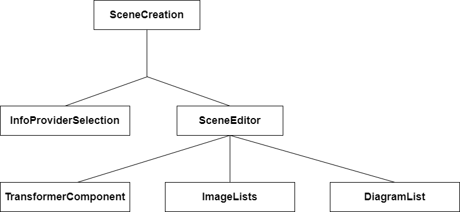

# Szeneneditor

# Infoprovider-Auswahl
* Janek
# Szenen-Erstellung

---
## Canvas

Als Canvasframework haben wir uns für KonvaJS entschieden. Konva ist eine 2D-Canvas Bibliothek, ursprünglich in und für JavaScript verfasst, mit einem Port für React und Vue.
In unserer Implementierung haben wir die folgenden Funktionen implementiert:
* Hinzufügen von Elementen (Kreise, Rechtecke, Sterne und Dreiecke)
* Hinzufügen und Beabeiten von Texten
* Hochladen und Verwenden von eigenen Bildern
* Anpassung der Farbe von Elementen
* Anpassung von Schriftart, Schriftfarbe und Schriftgröße
* Drag and Drop von Elementen
* Duplizieren, Löschen und Rückgängig machen

KonvaJS basiert auf HTML5 Canvas. Dabei gibt es verschiedene Ebenen. 
Die generelle Struktur vom Editor ist wie folgt aufgebaut:
* Ebene 1: "Stage"
* Ebene 2: "Layer" mit Elementen

Die Stage bildet dabei die unterste Ebene. 
Sie dient als DOM-Wrapper für alle Layer und höheren Ebenen. 
Auf der Stage liegt ein Layer, welcher die eigentlichen Elemente enthält.
Ein Beispiel dafür wäre ein Kreis, welchen man hinzufügt. 
Auf dem Layer kann außerdem ein Hintergrundbild oder eine Hintergrundfarbe gewählt werden. 
Dazu wird je nach Wahl ein Element erstellt, welches ein Bild oder ein vollflächiges Rechteck ist.
Diese beiden Elemente haben jeweils **keine** "draggable" Eigenschaft, d.h. man kann sie nicht anwählen oder verschieben.
Darauf folgt eine sogenannte "Group".
In dieser Gruppe sind alle Elemente, welche der Benutzer selbst auf dem Canvas hinzufügt.
Sie werden über ein Array aus eigenen Datentypen über die forEach-Methode hinzugefügt.

---

* generelle Implementierung
* Framework
* Funktionsweise
### Datentypen
Alle Datentypen für Elemente enthalten die folgenden Eigenschaften:
````typescript
x: number;
y: number;
id: string;
width: number;
height: number;
rotation: number;
color: string;
scaleX: number;
scaleY: number;
````

Über die Variablen **x** und **y** werden die Koordinaten des Elements gespeichert.
Die **id** enthält immer die eindeutige ID des Elements.
**width** gibt die Breite des Elements an.
**height** gibt die Höhe des Elements an.
**rotation** gibt an, um wieviel Grad ein Element gedreht ist.
**color** wird für die Schriftfarbe verwendet.
**scaleX** und **scaleY** werden für die Transformation verwendet. 
Der Wert ist standardmäßig als eins festgelegt.
Wenn das Element verkleinert wird, so wird der Wert kleiner als eins, ansonsten größer als eins.

#### Texte
````typescript
textContent: string;
fontFamily: string;
fontSize: number;
````

Für alle Elemente, welche man auf dem Layer hinzufügen kann, haben wir einen eigenen Datentyp hinzugefügt. 
Hier oben sieht man den Datentyp für Texte jeglicher Art (API-Texte und eigene Texte).
In **textContent** wird der eigentliche Text gespeichert, welcher auf dem Canvas dargestellt wird.
**fontFamily** und **fontSize** geben jeweils die Schriftart und Schriftgröße des Elements an.

#### Bilder
````typescript
image: HTMLImageElement;
imageId: number;
imagePath: string;
diagram: boolean;
index: number;
````

Bei Bildern gibt es zu den Variablen, welche in jedem Typ vorhanden sind, die obigen Variablen.
Dabei stellt **image** ein HTMLImageElement dar, welches ein neues window.Image()-Element mit der src von dem angefragten bzw. hochgeladenen Bild enthält.
Konva erstellt über dieses Element das tatsächliche Bild auf dem Canvas.
Die **imageId** ist die ID des Bildes im Backend und wird vom Backend gefetched, sie wird für die finale Erstellung des JSON-Objekted benötigt.
**imagePath** enthält den Pfad des Bildes im Backend, dieser wird ebenfalls gefetched.
**diagram** ist ein boolean, welches Beschreibt, ob ein Bild ein Diagramm ist oder nicht, da bei der Verarbeitung am Ende klar sein muss, wie das Bild im Backend gehandhabt werden muss.
**index** gibt den Index des Bildes im Frontend an.

#### Shapes

Die folgenden Formen können auf dem Canvas hinzugefügt werden:
* Kreise
* Rechtecke
* Sterne
* Dreiecke

Am Beispiel des Sterns kann man gut sehen, was passiert, wenn man ein Sternelement ausgewählt hat und dies auf dem Canvas hinzufügt.

````
case "Star": {
    const arCopy = items.slice();
    arCopy.push({
        x: parseInt(localX.toFixed(0)),
        y: parseInt(localY.toFixed(0)),
        id: 'star-' + itemCounter.toString(),
        color: "#000000",
        rotation: 0,
        width: 200,
        height: 100,
        scaleX: 1,
        scaleY: 1,
    } as CustomStar);
    setItems(arCopy);
    setCurrentItemColor(nextColor);
    incrementCounterResetType();
    return;
}
````

Zunächst wird eine Kopie des Arrays mit allen Elementen erstellt. 
Hierbei geht es darum, Updateprobleme auf dem Canvas zu vermeiden.
Anschließend wird in dieser Kopie ein neues Element hinzugefügt, welches die Koordinaten vom Klick auf den Canvas enthält.
Die ID wird dabei eindeutig auf "star-" und der aktuellen Menge an Elementen gesetzt.
Als Standardfarbe haben wir uns für Schwarz entschieden.
Höhe und Breite werden dabei passend zur Form gesetzt.

#### Backend-Typen
````typescript
export type DataText = {
    description: string,
    type: string,
    anchor_point: string,
    pos_x: number,
    pos_y: number,
    color: string,
    font_size: number,
    font: string,
    pattern: string,
    width: number
}

export type DataImage = {
    description: string,
    type: string,
    pos_x: number,
    pos_y: number,
    size_x: number,
    size_y: number,
    color: string,
    path: string
}
````
DataText und DataImage enthalten das Datenformat, mit welchem das Backend später Texte oder Bild auf der fertigen Szene hinzufügt.
Die benötigten Typen wurden vom Backend vorgegeben.

**description** ist ein optionaler Parameter. Er beschreibt den Text.
**type** beschreibt die Art des Elementes. **type** ist entweder "text" oder "image".
**anchor_point** gibt an, an welcher Stelle der Text verankert wird. Dies kann man mit dem klassischen linksbündig, rechtsbündig oder zentriert setzen.
**pos_x** gibt die Position des Elements in Pixel auf der X-Achse an.
**pos_y** gibt dementsprechend die Position des Elements auf der Y-Achse an.
**color** gibt die Schriftfarbe an.
**font_size** gibt die Schriftgröße des Textes an.
**font** gibt die Schriftart an.
**pattern** enthält den eigentlichen Text.
**width** enthält die Breite des Textes.

Bei den Bildern gibt es noch folgende Parameter:

**size_x** gibt dabei die Breite des Bildes und **size_y** die Höhe des Bildes an.
Die beiden Variablen werden dabei gerundet, da das Backend keine Floats unterstützt. Sie werden durch die Variablen **width** und **scaleX** bzw. **height** und **scaleY** des Elementes errechnet.
**color** gibt die Farbart des Bildes an. Dies kann "RGBA" oder "L" sein.
**path** gibt den Dateipfad zu dem Element auf dem Laufwerk an.

````typescript
export type BaseImg = {
    type: string;
    path: string;
    overlay: Array<DataImage | DataText>;
}
````

Das BaseImg stellt die Basis für die fertige Szene dar. Die Variable **type** muss dabei immer "pillow" sein. **path** enthält den Pfad zum aktuellen Hintergrundbild.
**overlay** enthält ein Array aus den vorher beschriebenen DataText und DataImages.

````typescript
export type JsonExport = {
    scene_name: string;
    used_images: number[];
    used_infoproviders: number[];
    images: BaseImg;
    backgroundImage: number; //ID of the background image
    backgroundType: string;
    backgroundColor: string;
    backgroundColorEnabled: boolean;
    itemCounter: number;
    scene_items: Array<CustomCircle | CustomRectangle | CustomLine | CustomStar | CustomText | CustomImage>;
}
````

Der Typ **JsonExport** enthält die finalen Werte, welche das Backend direkt verarbeiten kann. 
Die Variablen kann man dabei grob in Backenddaten und Frontenddaten unterscheiden.
Backenddaten:

**scene_name** ist ein String und beschreibt den Szenennamen.
**used_images** ist ein Array aus ID's der im Backend verwendeten Bilder.
**used_infoproviders** ist ein Array aus Zahlen, welches die benutzten Infoprovider enthält. Allerdings wird im Frontend nur ein Infoprovider pro Szene unterstützt.
**images** enthält das BaseImg, welches vorher beschrieben wurde.

Frontenddaten:

**backgroundImage** enthält die ID des verwendeten Hintergrundbildes.
**backgroundType** enthält entweder "IMAGE" oder "COLOR".
**backgroundColor** enthält die verwendete Farbe, falls eine Farbe gewählt ist. Die Farbe ist bei keiner Veränderung weiß ("FFFFFF").
**backgroundColorEnabled** ist *true*, wenn eine Hintergrundfarbe verwendet wird, ansonsten *false*.
**itemCounter** enthält die Menge an Elementen, welche im *items*-Array vorhanden sind.
**scene_items** enthält das *items*-Array.

#### Items Array

Das *items*-Array enthält alle Elemente, welche auf dem Canvas hinzugefügt werden, mit Ausnahme von Hintergrundfarbe und Hintergrundbild.
Das Array wird mit Hilfe der folgenden Funktion im Hauptarray dargestellt:
````
{items.map((item: any) => (
    (item.id.startsWith('circle') &&
        <Circle
            key={item.id}
            name={item.id}
            draggable
            x={item.x}
            y={item.y}
            scaleX={item.scaleX}
            scaleY={item.scaleY}
            fill={item.color}
            radius={item.radius}
            onDragStart={handleDragStart}
            onDragEnd={handleDragEnd}
            onTransformStart={handleTransformStart}
            onTransformEnd={handleTransformEnd}
            rotation={item.rotation}
            onMouseOver={mouseOver}
            onMouseLeave={mouseLeave}
            dragBoundFunc={function (pos: Konva.Vector2d) {
                if (pos.x > 960 - item.radius) {
                    pos.x = 960 - item.radius
                }
                if (pos.x < 0 + item.radius) {
                    pos.x = 0 + item.radius
                }
                if (pos.y > 540 - item.radius) {
                    pos.y = 540 - item.radius
                }
                if (pos.y < item.radius) {
                    pos.y = item.radius
                }
                return pos;
            }}
        />)
    }
````
Im obigen Beispiel sieht man die generelle Darstellung eines Kreises auf dem Canvas. Es werden die Elemente mit Hilfe der *map*-Methode des Arrays auf dem Canvas hinzugefügt.
Je nachdem, mit welchem Wort die ID des Elements beginnt, wird ein neues Konva-Element des zugehörigen Typs erstellt. Diesem Element werden bestimmte Eigenschaften zugewiesen, welche das Verhalten auf dem Canvas bestimmen.
Jedes Element benötigt eine *key*-Eigenschaft und einen Namen, worüber es eindeutig identifiziert werden kann. Dies liegt an der internen Struktur von Konva.
Wichtige Eigenschaften sind außerdem **draggable** und **fill**. Wenn **draggable** definiert ist, so wird das native Drag & Drop von KonvaJS aktiviert.
**fill** entspricht der *color*-Variable der Elemente, hier wird die Farbe festgelegt. Des Weiteren werden einige Methoden übergeben. Hierbei ist die dragBoundFunc interessant.
Darin wird definiert, was passieren soll, wenn der Benutzer das Element über eine bestimmte Koordinate zieht.

#### Hintergrund

Der Hintergrund wird über eine Abfrage verwaltet, bei der konditionelles Rendering eingesetzt wird. Mit Hilfe des **&&** wird nur ein Element gerendert, wenn das erste Statement *true* ist.
Da der backGroundType ein String ist, kann auf keinen Fall beides gerendert werden.

````
    {backGroundType === "COLOR" &&
        <Rect
            name="background"
            fill={currentBGColor}
            width={960}
            height={540}
            onClick={handleCanvasClick}
            onMouseDown={handleStageMouseDown}
        />
    }
    {backGroundType === "IMAGE" &&
        <Image
            name="background"
            width={960}
            height={540}
            onClick={handleCanvasClick}
            image={backgroundImage}
            onMouseDown={handleStageMouseDown}
        />
    }
````

Je nach dem, ob der Hintergrundtyp "COLOR" oder "IMAGE" ist, wird der Hintergrund festgelegt.
Bei "COLOR" wird ein vollflächiges Rechteck erstellt, welches keine **draggable** Eigenschaft besitzt und bei dem auch der Transformer deaktiviert ist.
Bei "IMAGE" wird ein Bild erstellt, welches den Hintergrund komplett ausfüllt.
Bei beiden werden die onClick und onMouseDown-Methoden der Stage übergeben.

### States für die Verwaltung

Für den Szeneneditor benötigen wir eine Reihe von State-Variablen, die wir im Folgenden erklären.

````typescript
const [backGroundType, setBackGroundType] = React.useState(props.sceneFromBackend !== undefined ? props.sceneFromBackend.backgroundType : "COLOR");
const [backGroundColor, setBackGroundColor] = React.useState(props.sceneFromBackend !== undefined ? props.sceneFromBackend.backgroundColor :"#FFFFFF");
const [backGroundColorEnabled, setBackGroundColorEnabled] = React.useState(props.sceneFromBackend !== undefined ? props.sceneFromBackend.backgroundColorEnabled : false);
````

Die ersten States, die wir anschauen möchten sind die States, welche zur Identifizierung und Verwendung des Hintergrundes verwendet werden.
**backGroundType** enthält den Typ des Hintergrundes ("COLOR" / "IMAGE").
**backgroundColor** enthält den hexadezimalen Farbwert des Hintergrunds (Standardmäßig "#FFFFFF").
**backGroundColorEnabled** enthält einen Boolean, der *true* ist, wenn eine Hintergrundfarbe verwendet wird und ansonsten *false*.
Alle diese States werden auch bei der Bearbeitung aus dem Backend geladen.

````typescript
const [currentlyEditing, setCurrentlyEditing] = React.useState(false)
const [currentFontFamily, setCurrentFontFamily] = React.useState("Arial");
const [currentFontSize, setCurrentFontSize] = React.useState(20);
const [currentItemWidth, setCurrentItemWidth] = React.useState(100);
const [currentItemHeight, setCurrentItemHeight] = React.useState(100);
const [currentTextWidth, setCurrentTextWidth] = React.useState(200);
const [currentTextContent, setCurrentTextContent] = React.useState("");
const [currentItemColor, setCurrentItemColor] = React.useState("#000000")
const [currentBGColor, setCurrentBGColor] = React.useState("#FFFFFF");
const [currentFontColor, setCurrentFontColor] = React.useState("#000000");
const [currentXCoordinate, setCurrentXCoordinate] = React.useState(0);
const [currentYCoordinate, setCurrentYCoordinate] = React.useState(0);
const [deleteText, setDeleteText] = React.useState("Letztes Elem. entf.");
const [stepSize, setStepSize] = React.useState(5);
````

Diese States werden verwendet, um Elemente, welche auf der Webseite gerendert werden, zu verändern.

````typescript
const [items, setItems] = React.useState<Array<CustomCircle | CustomRectangle | CustomLine | CustomStar | CustomText | CustomImage>>(props.sceneFromBackend !== undefined ? props.sceneFromBackend.scene_items : []);
const [itemSelected, setItemSelected] = React.useState(false);
const [itemCounter, setItemCounter] = React.useState(props.sceneFromBackend !== undefined ? props.sceneFromBackend.itemCounter : 0);
const [recentlyRemovedItems, setRecentlyRemovedItems] = React.useState<Array<CustomCircle | CustomRectangle | CustomLine | CustomStar | CustomText | CustomImage>>([]);
const [sceneName, setSceneName] = React.useState(props.sceneFromBackend !== undefined ? props.sceneFromBackend.name : "");
const [selectedItemName, setSelectedItemName] = React.useState("");
const [selectedType, setSelectedType] = React.useState("");
const [selectedObject, setSelectedObject] = React.useState<CustomCircle | CustomRectangle | CustomLine | CustomStar | CustomText | CustomImage>({} as CustomCircle);
````

Diese States werden benutzt, um Elemente, welche direkt mit dem Canvas zusammenhängen, zu setzen.
Am wichtigsten sind dabei die States **items**, **recentlyRemovedItems** und **selectedObject**.
**items** enthält das Array mit allen Elementen. **recentlyRemovedItems** enthält alle Elemente, welche kürzlich vom Canvas entfernt wurden.
Dieses Array wird zur Wiederherstellung von Elementen benutzt. **selectedObject** ist immer das aktuell ausgewählte Element.
**itemSelected** ist ein Boolean, mit dem festgehalten wird, ob aktuell ein Element ausgewählt ist.
**itemCounter** ist die aktuelle Anzahl an Elementen auf dem Canvas.
**sceneName** ist der Name der Szene. **selectedItemName** enthält den Namen des aktuell ausgewählten Elements.
**selectedType** wird verwendet, um zu bestimmen, welches Element als nächstes auf dem Canvas hinzugefügt wird.

````typescript
const [textEditContent, setTextEditContent] = React.useState("");
const [textEditVisibility, setTextEditVisibility] = React.useState(false);
const [textEditX, setTextEditX] = React.useState(0);
const [textEditY, setTextEditY] = React.useState(0);
const [textEditWidth, setTextEditWidth] = React.useState(0);
const [textEditFontSize, setTextEditFontSize] = React.useState(20);
const [textEditFontFamily, setTextEditFontFamily] = React.useState("");
const [textEditFontColor, setTextEditFontColor] = React.useState("#000000");
````

In diesen States werden alle Eigenschaften der Textbearbeitung gespeichert.
**textEditContent** enthält den neu bearbeiteten Text und **textEditVisibility** bestimmt, ob das Edit-Feld sichtbar ist oder nicht. 
Die anderen States werden aus den Eigenschaften des zu bearbeitenden Elements geladen.

````typescript
const [selectedHistorizedElement, setSelectedHistorizedElement] = React.useState("");
const [selectedInterval, setSelectedInterval] = React.useState("");
const [intervalToUse, setIntervalToUse] = React.useState<number | undefined>(0);
const [showHistorizedDialog, setShowHistorizedDialog] = React.useState(false);
const [backDialogOpen, setBackDialogOpen] = React.useState(false);
````

Die letzten States werden für Daten aus dem backend und einen Dialog verwendet.

TODO JANEK

### Transformer

Der Transformer ist eine eigene Komponente, welche das Transformieren von Elementen ermöglicht.

````typescript
const [transformer, setTransformer] = React.useState(new Konva.Transformer())
const [stage, setStage] = React.useState(transformer.getStage())
const [currentNode, setCurrentNode] = React.useState<Konva.Node>()
````

In den States des Transformers wird zunächst ein neuer Transformer von Konva angelegt. 
Anschließend wird die Stage gesetzt, indem die Methode *getStage()* beim Transformer aufgerufen wird, und die gewählte Node auf *undefined* gesetzt.

````typescript
const checkNode = () => {
    if (transformer !== null) {
        setStage(transformer.getStage());
        if (stage !== undefined && stage !== null) {
            setCurrentNode(stage.findOne("." + selectedShapeName));
            if (currentNode !== undefined && currentNode) {
                if (currentNode === transformer.nodes([currentNode])) {
                    return;
                }
                setTransformer(transformer.nodes([currentNode]));
                if (currentNode.getClassName() === "Text") {
                    transformer.resizeEnabled(false);
                } else {
                    transformer.resizeEnabled(true);
                }
            } else {
                transformer.detach();
            }
            if (transformer.getLayer() !== null) {
                transformer.getLayer()!.batchDraw();
            }
        }
        if (selectedShapeName === "") {
            transformer.detach();
        }
    }
}
````

Die Methode *checkNode()* wird verwendet, um den Transformer an ein Element anzuhängen bzw. ihn zu entfernen.
Zunächst werden Stage und currentNode neu gesetzt, anschließend wird überprüft, ob der Transformer bereits **currentNode** angehängt ist oder nicht.
Falls er bereits angehängt ist, so wird die Methode abgebrochen. Ansonsten wird er an die neue Node angehängt.
Falls die neue Node vom Typ Text ist, so wird das "Größe ändern" des Transformers deaktiviert. Falls die **currentNode** undefined oder null ist, so wird der Transformer generell entfernt.
Auch falls kein Element ausgewählt ist, wird der Transformer entfernt.

````
return (
    <Transformer
        ref={node => {
            if (node !== null && node !== undefined){
                setTransformer(node!);
            }
        }}
    />
);
````

In der *return*-Methode wird ein Transformer zurückgegeben, welcher eine Reference auf eine Node enthält.
### Transformation von Elementen

Die Transformation von Elementen geschieht mit Hilfe des Transformers.
Dabei wird, wie bereits beschrieben, der Transformer zunächst an ein Element angehängt.
Anschließend kann der Benutzer die Größe des Elementes verändern.
````typescript
let scaleX = absTrans.x;
let scaleY = absTrans.y;
if (absTrans.x > 960 / selectedObject.width) {
    scaleX = (960 - selectedObject.x) / selectedObject.width;
}
if (absTrans.y > 540 / selectedObject.height) {
    scaleY = (540 - selectedObject.y) / selectedObject.height
}

localItems[index] = {
    ...selectedObject,
    x: parseInt((absPos.x).toFixed(0)),
    y: parseInt((absPos.y).toFixed(0)),
    scaleX: scaleX,
    scaleY: scaleY,
    rotation: absRot,
};
````

Im ausgewählten Element wird scaleX und scaleY neu gesetzt.
Dabei wird zunächst eine Konva-Methode aufgerufen, mit der man die absolute Transformation von Elementen abfragen kann. Anschließend wird, falls der Benutzer ein Element zu groß gezogen hat, die Größe korrigiert.
Danach werden scaleX und scaleY auf den neuen Wert gesetzt, so wie die Rotation eines Elements.

## "Bedienfeld"
* Remove, Duplicate, ...
## Datenauswahl
=> Janek
### ImageLists
#### Abfrage von Bildern
#### Wiederherstellung
#### Posten von Bildern
### DiagramsList
## Speichern der Szene
* Stages (Background, Preview)