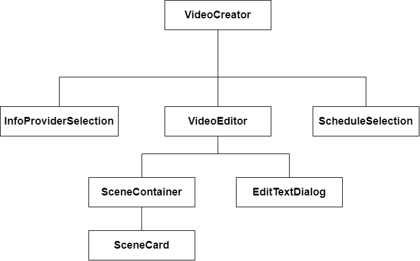

# Videojob
Die Komponentenstruktur der Anwendung ist in diesem Abschnitt wie folgt aufgebaut:

<div style="page-break-after: always;"></div>

# VideCreation
Die Hauptkomponente des Videojob-Editors, die vom Dashboard aus aufgerufen wird ist **VideoCreation**. Sie verwaltet alle für die Erstellung von Videojobs notwendigen States und ruft die anderen Komponenten in ihrem Rendering auf. Dazu verwaltet sie als **videoCreationStep** den aktuellen Schritt, der den Wert 0-2 annehmen kann, da der Prozess aus drei Schritten besteht: Auswahl der Infoprovider für Text-To-Speech, Erstellung des eigentlichen Videos sowie die Auswahl der Erstellungszeitpunkte.
* Über den Step hinaus enthält der State u.a. den Namen des Videojobs **videoJobName**, die Erstellungszeitpunkte als **schedule** sowie **sceneList**, welches die Liste aller vom Nutzer ausgewählten Szenen ist.

## Fetch-Methoden
Weiterhin enthält die Komponente drei Fetch-Methoden, durch die eine Datenkommunikation mit dem Backend stattfindet:
* **fetchAllInfoProvider**, welche vom Backend Name und ID aller verfügbaren Infoprovider holt.
* **fetchAllScenes**, welche vom Backend Name und ID aller verfügbaren Szenen holt.
* **sendVideoToBackend**, welche per POST-Request die fertige Konfiguration des Videojobs an das Backend sendet.

Die Erläuterung soll trotz der Tatsache, dass die Methoden in **VideoCreation** stehen in den jeweiligen Abschnitten der Komponenten erfolgen, zu denen sie gehören.

# InfoProviderSelection
Im ersten Schritt der Erstellung eines Videojobs muss der Nutzer festlegen, welche Infoprovider ihm alle zur Verfügung stehen sollen, um ihre Daten in der Text-To-Speech-Sprachausgabe der Videos einzuschließen (sowohl aktuelle Daten als auch historisierte Daten). Dies geschieht in der Komponente **InfoProviderSelection**.

Wir haben uns hier explizit dagegen entschieden, alle Infoprovider zur Verfügung zu stellen.
* Primär liegt diese Entscheidung daran, dass im Produktiveinsatz die Anzahl der erstellten Infoprovider durchaus groß werden kann. Würden wir alle laden, so müssten wir mindestens ihre Liste an verfügbaren Daten sowie historisierten Daten im Speicher des Clients halten, damit sie im Frontend genutzt werden können - das könnte schnell zum Problem werden. Darüber hinaus wird die Auswahl der Daten im Editor für Text-To-Speech-Vorlagen sehr schnell unübersichtlich.
* Daher muss der Nutzer per Checkboxen wählen, welche Infoprovider er alle haben möchte. Um auf das Problem des Speicherbedarfs hinzuweisen zeigen wir ab einer bestimmten Anzahl eine entsprechende allgemeine Warnung, die den Nutzer aber nicht daran hindert, viele Infoprovider zu laden (wir setzen hier auf Eigenverantwortung).

## Laden der verfügbaren Infoprovider
Die Liste der insgesamt verfügbaren Infoprovider wird wie bereits oben erwähnt von der Methode **fetchAllInfoprovider** am Endpunkt **/visuanalytics/infoprovider/all** des Backends angefragt. Die Methode befindet sich dabei nicht in dieser Komponente, sondern in **VideoCreation** und wird dort per **useEffect**-Hook nur beim erstmaligen Laden der Komponente ausgeführt, sodass man das Backend nur einmalig anfragt.

Für die Methode konnten wir dabei nicht **useCallFetch** nutzen, sondern mussten wieder eine eigene Fetch-Methode schreiben - das hat den Hintergrund, dass eine Benutzung in **useEffect** erfordert, dass die Methode in den Dependencies dieser Hook steht. Damit sie nicht bei jedem Neuladen geändert wird und somit die Hook auslöst (welche neu rendert und so eine Endlosschleife erzeugt) müssen wir mit **useCallback** memoisieren, sodass wir nur eine eigene Methode nutzen können.

Das Backend liefert als Antwort ein Array mit allen Infoprovidern, deren Format wir als **InfoProviderData** bezeichnen - es handelt sich um ID und Namen des Infoproviders.
```javascript
export type InfoProviderData = {
    infoprovider_id: number;
    infoprovider_name: string;
}
```
* Wir benötigen beide Daten - den Namen zur Anzeige in der Liste, die ID, um den Infoprovider und seine vollständigen Daten beim Backend anzufragen, wenn der Nutzer diesen auswählt.
* Das Ergebnis der Anfrage wird im State **infoProviderList** gespeichert, welcher auch per **props** an **InfoProviderSelection** weitergegeben.

## Auswahlliste der Infoprovider
Die Darstellung der Liste aller Infoprovider erfolgt so, wie es aus zahlreichen anderen Komponenten bereits bekannt ist - durch eine **.map()**-Funktion ruft man für alle Elemente aus **infoProviderList** eine Methode **renderListItem** auf, die ein Listenelement für einen Eintrag generiert.
* Dabei hat jeder Eintrag eine Checkbox zum Auswählen sowie den Namen, der angezeigt wird.
* Das Anklicken der Checkbox ruft **checkBoxHandler** auf, welche mit der Methode **checkIdIncluded** prüft, ob sich der angeklickte Infoprovider bereits in der Liste **selectedInfoProvider** befindet, die die Auswahl speichert.
    * Falls ja, so wird er aus dieser Liste entfernt, falls nein wird er hinzugefügt.
    * **checkIDIncluded** geht schlicht **selectedInfoProvider** durch und gleicht ab, ob er die ID des angeklickten Infoproviders finden kann - wenn ja, so ist er bereits enthalten.

!!!!!!!!!!!!!!!!!!!
WARNUNGSDARSTELLUNG
!!!!!!!!!!!!!!!!!!!!


## Abfragen aller Infoprovider vom Backend
Wenn der Nutzer auf "weiter" klickt, so ist seine Auswahl abgeschlossen und er möchte zur Video-Editierung weitergehen. In dieser benötigt man für die Erstellung der Text-To-Speech-Inhalte Zugriff auf die Daten und historisierten Daten der ausgewählten Infoprovider.
* Hierbei hätte man entweder eine Backend-Methode implementieren können, die eine bestimmte Menge an IDs entgegennimmt und die zugehörigen Infoprovider liefert. Dies ist auf beiden Seiten aber eher umständlich, sodass wir stattdessen für jede ID einzeln eine Abfrage machen.

Dazu nutzen wir das Array **infoProviderToFetch**, welches eine Liste aller Infoprovider sein soll, die noch vom Backend abgeholt werden müssen. Beim Klick auf "weiter" wird der Wert dieser Liste auf **selectedInfoProvider** gesetzt.
* Es handelt sich hierbei um keine State-Variable, sondern eine solche, die mit **useRef** angelegt wurde. Eine Änderung von ihr sorgt für kein Re-Render, es muss jedoch auch kein Render geschehen, damit sich ihr Wert ändert!
    * Das ist essentiell, da sich zwischen den Abfragen ggf. kein erneuter Render ergibt, wir die Liste aber aktualisieren müssen - es ist daher essentiell, dass die Liste auf diese Weise direkt verändert werden kann.

Anschließend wird die Methode **fetchNextInfoProvider()** aufgerufen, welche die Abfrage aller Infoprovider steuert. Sie prüft zunächst die Länge von **infoProviderToFetch** - ist diese 0, so wurden alle ausgewählten Infoprovider vom Backend geholt und es kann fortgefahren werden. Dazu überträgt man die Liste der Abfrage-Ergebnisse in **props.minimalInfoProvObjects** und ruft anschließend die Methode zur Abfrage aller Szenen auf.
* Wenn jedoch noch Einträge in **infoProviderToFetch** vorhanden sind, so greift man auf den ersten Eintrag zu, entnimmt dessen ID und ruft **fetchInfoProviderById** mit dieser auf. Diese Methode ist eine fetch-Methode, die über den Endpunkt **/visuanalytics/infoprovider/<id>** für die jeweilige ID das Objekt des Infoproviders anfragt.
    * Wir können hier erneut nicht **useCallFetch** nutzen, da wir einen Parameter (die ID) übergeben wollen. Daher haben wir auch hier eine eigene Methode geschrieben.

In der Handler-Methode **handleSuccessFetchById** wird dann der Erfolgsfall dieser Abfrage behandelt. Man nimmt dazu das Objekt, welches das Backend zurückliefert und extrahiert nur die Informationen, die man für die Video-Editierung benötigt. So werden bspw. die Diagramme, die Liste aller überhaupt von der API gelieferten Daten oder Authentifizierungs- und Query-Daten gar nicht benötigt.
* Um also das oben beschriebene Problem von potentiell hohem Datenaufkommen bei vielen Infoprovidern abzufangen haben wir den Datentyp **MinimalInfoProvider** angelegt, der nur genau diese Informationen enthält:
```javascript
export type MinimalInfoProvider = {
    infoproviderName: string;
    dataSources: Array<{
        apiName: string;
        selectedData: SelectedDataItem[];
        customData: FormelObj[];
        historizedData: string[];
        schedule: Schedule;
    }>;
}
```
Mit der Methode **createMinimalInfoProvider** wird das vom Backend gelieferte Objekt in diese Struktur umgewandelt und anschließend dem Ergebnis-Array **minimalInfoProvObjects** hinzugefügt.
* Auch dieses ist nicht im State, sondern mit **useRef** angelegt - dies hat den Hintergrund, das nach dem letzten Fetch sein Wert in den State der Parent-Komponente übertragen werden soll. Zwischen den Abfragen findet aber kein Re-Render statt, sodass eine Variable im State sich gar nicht ändern würde.
Diese Variante sorgt hingegen für eine sichere Speicherung unsere Ergebnisse.
* Abschließend entfernt **handleSuccessFetchById** den soeben abgefragten Infoprovider aus **infoProviderToFetch**, sodass markiert ist, dass dieser nicht mehr gefetched werden muss.
* Es wird zuletzt wieder **fetchNextInfoProvider()** aufgerufen. Es entsteht so eine rekursive Aufrufskette, die so lange läuft, bis die ganze Liste abgearbeitet wurde.

Problematisch wäre, dass der Nutzer während der Abfrage eine zweite startet - um das soweit möglich zu verhindern setzen wir beim Klick auf "weiter" den State **continueDisabled** auf **true**, welcher damit den "weiter"-Button blockiert - im Fehlerfall einer Abfrage wird er wieder freigegeben, damit der Nutzer ggf. noch eine Abfrage machen kann.

## Laden aller Szenen
Es wurde bereits erwähnt, dass nach erfolgreichem Laden aller ausgewählten Infoprovider das Laden aller Szenen ausgelöst wird. Dies ist eine weitere nötige Vorbereitung für den folgenden Schritt und geschieht durch den Aufruf der Methode **fetchAllScenes** durchgeführt.
* Diese fragt den Endpunkt **/visuanalytics/scene/all** an und kann mit **useCallFetch** umgesetzt werden, da hier keine besonderen Anforderungen vorliegen.
```javascript
export type SceneData = {
    scene_id: number;
    scene_name: string;
}
```
* Der Erfolgsfall wird durch **fetchAllScenesSuccess** behandelt, welches ein Array vom oben gezeigten Typ **SceneData** liefert. Da die IDs nicht weiter benötigt werden extrahiert man aus diesem Array nur die Namen und speichert die Liste aller Namen im State **availableScenes**.
* Abschließend wird **continueHandler** aufgerufen, um zum zweiten Schritt weiterzugehen.

# VideoEditor
Den zweiten Schritt stellt dann die Komponente **VideoEditor** dar, in welcher das eigentliche Video zusammengestellt wird.

## Grundlegende Oberläche und State
Die Oberfläche des Videoeditors setzt sich aus folgenden Elementen zusammen:
* Am oberen Rand befindet sich ein großes **TextField**, welches zur Eingabe des Namens für den Videojob verwendet wird.
* Rechts davon befindet sich ein Button **zurück**, mit dem man zurück zum Dashboard gelangt sowie ein Button ***Speichern**, durch den man den erstellten Videojob speichert und zur Festlegung der Generierungszeitpunkte übergeht, bevor man die Daten an das Backend absendet.
* Unter diesen Eingaben befindet sich dann die eigentliche Erstellung des Videos: Es gibt eine horizontale Liste aller ausgewählten Szenen mit Möglichkeiten, Details für diese einzustellen, die durch die Komponente **SceneContainer** dargestellt wird. Rechts davon befindet sich eine vertikal scrollende Liste aller verfügbaren Szenen (die Daten hierzu stammen aus dem State **availableScenes**, der im vorherigen Schritt mit Backend-Daten gefüllt wurde).
    * Man generiert diese Liste, indem man jeder Szene ein **AddCircleOutlineIcon** hinzufügt, durch dessen Anklicken die Szene der Auswahl im Video hinzugefügt wird. Die Generierung dieser Liste geschieht wie in allen anderen Komponenten auch, indem man für **availableScenes** **.map()** aufruft und so für jedes Element **renderAvailableScene** aufruft, welches den entsprechenden Eintrag erstellt.
    * Das Hinzufügen geschieht über die Methode **addScene**, welche die Szene mit Default-Einstellungen für Anzeigedauer und Text der Liste hinzufügt.
* Die State-Variable **sceneList** verwaltet diese Liste aller vom Nutzer ausgewählten Szenen, die im Video auftauchen sollen.
    * Die Szenen werden durch Objekte des Typ **SceneCardData** repräsentiert, ihre Reihenfolge im Array entspricht der Reihenfolge, in der sie im Video dargestellt werden. Genauere Erläuterungen folgen im Abschnitt zu **SceneContainer**.


# SceneContainer
Die Komponente **SceneContainer** ist das Kernelement der Nutzerinteraktion in der Erstellung eines Videojobs, da sie die horizontal scrollbare Auflistung aller ausgewählten Szenen mit deren Einstellungen umfasst.

Dabei bekommt die Komponente per **props** **sceneList** als auch die zugehörige Setter-Methode übergeben. Diese Liste ist die aktuelle Szenenauswahl für das Video und eine Reihe von **SceneCardData**-Objekten. In der Darstellung der Komponente wird per **.map()** auf jedes dieser Objekte die Methode **renderSceneEntry** angewendet, welche neben der Darstellung eines visuellen Effekts (Erläuterung im folgenden Abschnitt) eine **SceneCard**-Komponente mit den Daten des aktuellen Eintrags der Liste lädt.
* Die **SceneCard**s sind dabei in eine Liste eingefasst, bei der per **style** mit **display: flex, flexDirection: row** dafür gesorgt wird, dass es sich um eine Liste handelt, in der die Elemente horizontal statt wie üblich vertikal angeordnet werden.

## Änderungen an einzelnen Szenen vornehmen
Jede Szene, die durch ein **SceneCardData**-Objekt repräsentiert wird besitzt verschiedene Eigenschaften:
```javascript
export type SceneCardData = {
    entryId: string;
    sceneName: string;
    exceedDisplayDuration: number;
    spokenText: Array<AudioElement>;
    visible: boolean;
}
```
* Die **entryId** wird für die Darstellung der Szene in der Liste benötigt (jeder Eintrag benötigt einen eindeutigen Key), **sceneName** ist der Name der Szene, der auch in der Liste der **availableScenes** steht.
* Jede Szene besitzt eine bestimmte Anzeigedauer. Dabei gilt allgemein, dass sie so lange angezeigt wird, wie der gesprochene Text läuft (inklusive der Pause) - darüber hinaus kann der Nutzer aber als **exceedDisplayDuration** angeben, wie viele Sekunden über den gesprochenen Text hinaus die Szene noch weiter angezeigt werden soll.
* **spokenText** ist der vom Nutzer festgelegte Text, der per Text-To-Speech im Video vorgelesen werden soll. Der Text kann auch API-Daten enthalten.
    * Es handelt sich um ein Array, da es sich um eine Folge mehrerer Texte und Pausen handeln kann - so wird es möglich, dass man der Text-To-Speech-Ausgabe Sprechpausen vorschreiben kann.
* **visible** dient zur Steuerung eines optischen Effekts, der im folgenden Abschnitt erläutert wird und hat keine Relevanz für die eigentliche Szene.

Mit der Methode **setDisplayDuration** kann man die Anzeigedauer über die TTS-Ausgabe hinaus ändern, indem man einen neuen Wert für  **exceedDisplayDuration** eingibt.

**setSpokenText** dient dem Verändern des gesprochenen Textes einer Szene und nimmt neben dem Index dieser Szene auch **newSpokenText** als den neuen Text, den der Nutzer eingegeben hat entgegen.

Weiterhin ist es möglich, die Reihenfolge, in der die Szenen angezeigt werden zu verändern. Wie bereits erläutert gilt dabei, dass die Reihenfolge im Array **sceneList** der Reihenfolge der Anzeige entspricht, sodass das Tauschen zweier Szenen das Tauschen der Indizes bedeutet.
* Die Methode **moveScene** ist dafür zuständig, indem sie die beiden Objekte in **sceneList** vertauscht. Sie verhindert dabei zudem, dass ein Tausch vorgenommen wird, der über die Grenzen des Arrays hinausgeht.
* Die Eingabeparameter der Methode sind **sourceIndex**, welcher der Index der Szene ist, die in der Liste bewegt wird, sowie **direction**, welches den Wert **left** oder **right** haben kann (die Umsetzung findet über ein Enum statt). Das Bewegen ist also nur nach links oder rechts möglich, man kann eine Szene also nur mit ihrem direkten Nachbarn tauschen und nicht mit jeder beliebigen Szene.

Beim Aufruf der **SceneCard**-Komponenten wird jeweils eine Arrow-Funktion übergeben, die den Setter aufruft und für **index** den Index der aktuellen Karte eingibt. Auf diese Weise können die **SceneCard**s die Methoden aufrufen, ohne Kenntnis über ihren Index haben zu müssen.

## Tausch-Effekt
Das Tauschen der Szenen in der von uns genutzten Form hat in der Praxis einen dahingend unschöne Darstellung, dass alle **SceneCard**s grundsätzlich die gleiche Struktur haben und das Tauschen zweier benachbarter Karten einfach einen Austausch der Beschriftungen vornimmt. Dies ist nicht besonders schön anzusehen und für den Nutzer eventuell auch verwirrend, da es schwer zu erkennen sein kann, dass Szenen getauscht werden.

Aus diesem Grund wollten wir eine Art Tausch-Animation, die genutzt wird, wenn man zwei Szenen vertauscht. Leider bietet **MaterialUI** nativ keine wirklichen Animations-Effekte, sodass wir einen eigenen mit den verfügbaren Mitteln gebaut haben. Die Idee: Die beiden getauschten Szenen sollenn kurz verschwinden und dann an der neuen Position mit einer Animation auftauchen.
* Basis dafür ist die **visible**-Variable in **SceneCardData**. Sie ist standardmäßig **true** und wird **false** gesetzt, wenn eine Szene getauscht wird (beim Ersetzen der Objekte in **moveScene** wird diese Variable überschrieben).
* In **renderSceneEntry** wird dann jede **SceneCard** in ein **Collapse**-Element von Material-UI gesetzt, dessen Sichtbarkeit durch **in={sceneEntry.visible}** definiert wird.
    * Weiterhin wird mit **timeout={{ appear: 500, enter: 800, exit: 0 }}** festgelegt, dass das Ausblenden 0 Sekunden dauern soll, währen das Einblenden 500ms beim ersten Mal und 800ms bei jedem weiteren Mal dauern soll.
* Wird also durch **moveScene** der Wert von **visible** auf false gesetzt, so wird das **Collapse** eingeklappt und die Szene nicht mehr angezeigt.
* Nun kommt **renderSceneEntry** ins Spiel: In der Methode wird zunächst geprüft, ob die Szene nicht sichtbar ist. Falls dies der Fall ist, so wird geprüft, ob die Variable **timeoutSet** bereits gesetzt wurde. Dies ist eine mit **useRef** für die Komponente angelegte Variable, die genutzt wird um zu speichern, ob bereits ein Timer zum erneuten Einblenden der Elemente gestartet wurde.
    * Ist **timeoutSet** **false**, so wurde noch kein Timer gesetzt und anschließend mit **setTimeout** ein Timer für die verzögerte Ausführung von Code gestartet. Mit **timeoutSet.current = true** markiert man dann, dass ein Timer gesetzt wurde.
        * Dieser verzögert ausgeführte Code durchläuft die Szenenliste und setzt **visible** überall dort auf **true**, wo es den Wert false hat.
        * Anschließend setzt man **timeoutSet** wieder auf **false**, damit es für die nächste Animation zurückgesetzt wird.
* Die Dauer des **setTimeout** ist 300ms. Die beiden Szenen werden also für 300ms ausgeblendet, bevor sie über 800ms an ihrer neuen Position mit einer Animation wieder eingeblendet werden.
    * Leider ist eine Animation beim Ausblenen nicht möglich, da sich die Datenwerte der Szenen bereits zum Zeitpunkt des Ausblendens ändern und man so bereits beim Ausblenden die neuen Beschriftungen sehen würde.

## Erläuterungen zum Test von Drag-And-Drop-Bibliotheken
Für die Einstellung der Reihenfolge der einzelnen Szenen war unsere ursprüngliche Vorstellung, dass man diese in einer horizontalen Anordnung sieht und per Drag-and-Drop die Reihenfolge ändert.

Grundsätzlich gibt es auch Möglichkeiten für Drag-And-Drop, da HTML eine API dafür bietet, auf der einige Frameworks aufbauen. Für React wird hauptsächlich **"React DnD** empfohlen, mit welchem wir uns deshalb auseinandergestezt haben. Dazu haben wir uns erst einmal in die grundsätzliche Funktionalität, das System und den Syntax eingelesen und uns anschließend mit Tutorials auseinandergesetzt.
* Die grundsätzliche Idee des Frameworks ist, dass man einzelne Elemente "Draggable" machen kann, d.h. der Nutzer kann sie greifen und nehmen. Als Gegenstücke dienen sogenannte "DropTargets", über die man bewegte Elemente hovern und diese dort ablegen kann.
* Das ist also z.B. sehr gut geeignet, um Antwortkarten in einen Lückentext zu ziehen o.ä.

Unsere Anforderung war jedoch eine sortierbare Liste, sodass jedes Element sowohl Draggable als auch DropTarget gleichzeitig sein muss. Das Framework referenziert in seinen Tutorials dabei eine [Beispiel-Sandbox](https://codesandbox.io/s/github/react-dnd/react-dnd/tree/gh-pages/examples_hooks_ts/04-sortable/simple?from-embed=&file=/src/Card.tsx), mit deren Code und Funktionalität wir uns intensiv beschäftigt haben.
* Dabei handelt es sich um eine vertikale Liste, wir benötigten aber eine horizontale Liste. Die Erkennung basiert auf Pixel-Berechnungen (sobald ein Element die Hälfte der Pixel eines anderen überschneidet werden sie getauscht), welche wir also für die horizontale Darstellung umschreiben mussten. Interessanterweise sind dabei Fehler aufgetreten, für die wir in unseren Recherchen keine Erklärung finden konnten.
* Selbst im vertikalen Beispiel gibt es Fehler, in denen eine "Kollision" mit bestimmten Funktionalitäten des React-Frameworks entsteht und die Seite abstürzt.

Weiterhin ist das Beispiel nur darauf ausgelegt, eine Liste fester Größe zu haben - wir wollten aber eine flexible, beliebig lange Liste. Entsprechend wird dafür auch eine Scrollbar notwendig. Mit dieser gehen neue Probleme einher, da die pixelbasierte Berechnung der Verschiebungen spätestens dann nicht mehr funktioniert, wenn einmal gescrollt wurde (sodass man das Element weiterbewegt, aber nicht mehr getauscht wird und es nicht dort landet, wo man es ablegt).
* Es gibt für das Scrolling zwei Framworks: **react-dnd-scrollzone** und **react-dnd-srolling**. Dabei scheint zweiteres schlicht eine Adaption des ersten zu sein. Tests zum Integrieren von **react-dnd-scrollzone** schlugen fehl, die Recherche hat ergeben, dass das nicht mehr gepflegte Modul (letzter Publish vor 2 Jahren) nicht mit den aktuellen React-Versionen kompatibel ist.
    * **react-dnd-scrolling** scheint eine neuere Adaption (letzter Publish vor einem Monat) dieses Moduls zu sein, dass es mit den aktuellen React-Versionen kompatibel macht. Damit wäre eine Nutzung also möglich gewesen, jedoch trat nun das Problem auf, dass TypeScript beim Einbinden von NPM-Modulen stets ein zugehöriges **@types**-Modul erfordert. Ein solches existiert für das erste, veraltete Modul, für das neuere aber nicht, sodass es scheinbar nur mit Javascript nutzbar ist.

Neben diesen Scroll-Problemen gab es wie bereits erwähnt auch Probleme mit dem grundlegenden Modul **react-dnd**, bei welchem selbst in den Demos des Anbieters bei bestimmten Aktionen Abstürze auftreten. Im zugehörigen GitHub existieren Issues wie beispielhaft [dieses](https://github.com/react-dnd/react-dnd/issues/763), die seit langer Zeit existierende, auch bei uns auftretende Probleme behandeln. Quasi bis heute wird von Usern über mögliche Workarounds diskutiert, eine offizielle Pflege des Moduls mit Fehlerbehebungen scheint es aber nicht zu geben.
* Aus diesen Gründen sehen wir die Integration dieser Module als kritisch an, da ihre Funktionalität nicht garantiert werden kann und ihre fehlende Pflege dafür sorgen könnte, dass unser von ihnen abhängiges Produkt eines Tages plötzlich nicht mehr funktioniert - das sollte um jeden Preis vermieden werden.
* Daher haben wir uns nach einigen Stunden Auseinandersetzung mit der Materie vorläufig gegen eine Drag-And-Drop-Lösung und für eine einfachere, Button-basierte Variante entschieden, um überhaupt einen fertigen und funktionale Szeneneditor abzuliefern.

# SceneCard
Wie bereits unter **SceneContainer** angesprochen wird eine einzelne vom Nutzer ausgewählte Szene als **SceneCard**-Komponente dargestellt. Diese erhält per **props** die Werte und Setter-Methoden aller relevanten Eigenschaften für die jeweilige Szene.

Dargestellt wird die Szene durch eine **Card**-Komponente von Material-UI, die den Namen der Szene sowie Einstellungen für Anzeigedauer und Text enthält.
* Für die Eingabe der Dauer über die TTS-Dauer hinaus wird ein **Slider** verwendet, der durch einen **Input** ergänzt wird. Auf diese Weise kann der Slider genutzt werden, gleichzeitig aber auch händisch eine Eingabe erfolgen. Diese Option ist auch für die Barrierefreiheit bedeutsam.
* Die zweite Einstellung ist der gesprochene Text

!!! HIER FOLGEN DIE ERLÄUTERUNGEN!!!


## State-Updates für Anzeigedauer
Die Nutzung von Slidern verstärken ein allgemeines Problem, welches mit Eingabelementen auftritt, deren Wert ein State einer höheren Komponente ist: Werden schnell viele Eingaben hintereinander gemacht wird das Frontend sehr ruckelig, da extrem viele Rerenders der höher liegenden Komponente und damit der ganzen Ansicht notwendig werden.
* Bei den Slidern finden besonders schnelle und viele Änderungen statt, da bei einer Bewegung alle 1er-Schritte als State-Änderung registriert werden. Zwar fasst React teilweise diese Änderungen zusammen, dennoch ist es nicht wirklich responsiv.
* Als Lösung verwenden wir **localExceedDisplayDuration** als State direkt innerhalb von **SceneCard**, welches den Wert des Slider und Inputs hält.
    * Anhand zdes Timers **timeoutExceedDisplayDuration** wird mit der Methode **changePropsExceedDisplayDuration** gewartet, bis 200ms lang keine Änderung stattfindet. Erst dann wird der State von **VideEditor** überschrieben, indem man die Dauer der Szene dort neu setzt und **sceneList** überschreibt.
* Auf diese Weise wird nicht **VideoEditor**, sondern nur **SceneCard** neu gerendert, wenn man den Slider bedient - dadurch lassen sich die Performance-Probleme größtenteils lösen und die User Experience wird verbessert.


# ScheduleSelection
Nachdem der Nutzer das Video selbst fertig konfiguriert hat kommt die Auswahl der Generierungszeitpunkte hinzu, durch die ein Videojob vollständig wird. Diese Auswahl findet in der Komponente **ScheduleSelection** statt, deren Grundaufbau eine leicht veränderte Kopie der Komponente **HistoryScheduleSelection** aus der Erstellung der Infoprovider ist.
* Das liegt daran, dass das Backend für alle Aktionen, die an bestimmten Zeitpunkten stattfinden sollen das gleiche Datenformat nutzt - damit ist das Scheduling einer Historisierung beinahe gleich zum Scheduling eines Videojobs.

Entsprechend hat die Komponente wieder den gleichen Grundaufbau mit **RadioButtons**, mit denen man zwischen den drei Scheduling-Typen Wochentag, Täglich oder Intervall wechselt. Für Videojobs kommt noch die Option **einmalig** hinzu - diese generiert sofort das Video und danach nie wieder, sodass ein Nutzer bei Bedarf einmalig ein Video generieren kann (z.B. zu Testzwecken),
* Eine detaillierte Erklärung der Oberfläche und der mit ihr verbundenen Logik-Methoden zur Verwaltung des States soll hier aber nicht stattfinden, da dies bereits im entsprechenden Dokumentationsabschnitt **Infoprovider-Erstellung -> HistorySelection -> HistoryScheduleSelection** geschehen ist und dort nachgelesen werden kann.

Modifiziert wurden gegenüber der Vorlagen-Komponente, dass Logik-Methoden, die mit der Unterscheidung zwischen Bearbeitung und Erstellung von Infoprovidern sowie dem Speichern von Datenquellen zusammenhängen, entfernt wurden. Geändert wurde außerdem der "weiter"-Button zu einem "Abschließen"-Button, der den erstellten Videojob an das Backend sendet (Erläuterung im folgenden Abschnitt).


# Senden der Daten an das Backend
Nach Abschluss der Erstellung des Videojobs muss dieser an das Backend übermittelt werden, um von diesem in der Video-Generierung genutzt werden zu können. Dabei wird wie auch bei den Infoprovidern ein großer Teil der Erstellung des Datenformats bereits auf Ebene des Frontends vorgenommen. Das Grundgerüst der Umsetzung bilden zwei Objekte: **images**, welches alle Szenen in der Reihenfolge enthält, in der sie angezeigt werden sollen und **audio**, in welchen alle durch Text-To-Speech vorzulesenden Texte enthalten sind.

Das Datenformat sieht dabei allgemein so aus (images und audio sind beispielhaft):
```javascript
{
    videojob_name: videoJobName,
    images: {

    },
    audio: {
        audios: {
            audio1: {
                parts: [
                    {
                        type: "text",
                        pattern: //text
                    },
                    {
                        type: "silent",
                        duration: //dauer
                    }
                ]
            },
            audio2: {
                parts: [
                    {
                        type: "text",
                        pattern: //text
                    }
                ]
            }
        }
    }
    sequence: {
        type: "successively",
        transitions: 0.1
    },
    schedule: {
        type: schedule.type,
        time: schedule.time,
        date: "",
        time_interval: schedule.interval,
        weekdays: schedule.weekdays
    }
}
```

Die allgemeine Generierung findet in der Methode **sendVideoToBackend** statt, welche die Fetch-Methode ist, durch die das fertige Objekt an das Backend gesendet wird.
* Diese Methode trägt selbst den Namen **videojob_name** ein, indem sie auf die State-Variable **videoJobName** zugreift.
    * Gleiches gilt für **schedule**, welches dem gleichnamigen State entnommen werden kann. Hier sind lediglich Änderungen der Key-Namen notwendig, wie es bereits vom Datenformat der Infoprovider bekannt ist.
* **sequence** wird nicht durch den Nutzer beeinflusst und hat immer den gleichen Wert, entsprechend wird es auch konstant in **sendVideoToBackend** definiert.

## images-Objekt
Für das images-Objekt gibt es die Methode **createImagesObject()**, welche zur Erstellung des Objektes dient. Allgemein gilt für das Datenformat, dass ein Objekt geliefert werden soll, welches jede Szene als Key enthält, die im Video auftritt.
* Die Reihenfolge, in der die Schlüssel dabei angelegt sind ist gleichzeitig die Abspielreihenfolge.

Die erstellt ein leeres Objekt **imagesObject** vom Typ any - das ist keine schöne Lösung, aber der einzige Ansatz, mit dem man beliebig viele Keys mit unbekannten Namen hinzufügen kann.
* Die Methode geht dann durch die **sceneList** durch und fügt nach und nach die Szenen in der Reihenfolge hinzu, in der sie der Nutzer sortiert hat.
* Dabei gibt es zwei Probleme:
    * Zum einen kann eine Szene doppelt verwendet werden, das Backend hat jedoch die Namen der Szenen als Keys vorgesehen, die enstprechend einzigartig sein müssten.
    * Weiterhin wird beim Datenverkehr das Objekt automatisch alphanumerisch sortiert, sodass die Key-Reihenfolge nicht gewährleistet werden kann.
* Hier hilft die Nutzung eines **index**, der mit jedem Mal hochgezählt wird. Statt dem Szenennamen verwenden wir als Key ***index*_*szenenname***. Im zugehörigen Objekt legen wir dann unter **key** den tatsächlichen Namen der Szene ab.
* Durch den eindeutigen Index bleibt so jeder Key eindeutig, gleichzeitig sorgt der aufsteigende Index am Anfang des Keys dafür, dass die alphanumerische Sortierung unsere Reihenfolge nicht zerstört.


## audios-Objekt
Analog zum images-Objekt muss auch ein Objekt **audios** angelegt werden. Dieses soll die Definitionen der Tonspuren zu allen Szenen enthalten. Es handelt sich wieder um ein Objekt, in dem jeder Key für eine Tonspur einer Szene steht.
* Zur Zuordnung gilt: Die erste Audio wird der ersten Szene zugeordnet, die zweite Audio der zweiten Szene usw.
* Die **audio**-Objekte im Inneren werden ebenfalls mit einem **index** durchnummeriert - das sichert die Einzigartigkeit der Keys und sorgt dafür, dass die Sortierung genau der unserer Szenenliste entspricht.

Für die Generierung geht man per Schleife durch alle Einträge der **sceneList** durch. Innerhalb dieser durchläuft man das **spokenText**-Array, welches die Abfolge von Texten und Pausen enthält.
* Für jeden Eintrag **audioElement** prüft man anhand von **type**, ob es sich um einen Text oder eine Pause handelt.
    * Für Texte wird dem vorher angelegten **parts**-Array ein Objekt mit dem **type: "text"** hinzugefügt, dass als Wert von **pattern** den entsprechenden Text hat.
    * Für Pausen fügen wir dem **parts**-Array ein Objekt mit dem **type: "silent** hinzu. Hier muss als zweiter Parameter die Dauer eingegeben werden, diese findet man ebenfalls im **audioElement** als **duration**.
* Man geht auf diese Weise für eine einzelne Szene die Folge der Texte und Pausen durch und generiert so ein **parts**-Array für das Audio-Objekt dieser Szene. Zuletzt muss diesem aber noch ein Eintrag hinzugefügt werden, wenn der Nutzer gewählt hat, dass die Anzeigedauer über die TTS-Dauer hinaus gehen soll (dann ist **exceedDisplayDuration** größer als 0). Für diesen Fall fügen wir dem Array ein weiteres Silent-Objekt entsprechender Dauer hinzu.
* Zum Abschluss fügt man das so entstandene Audio-Objekt mit dem Key **audio*index***, welches das erstellte **parts**-Array als Key hat in das gesamte Objekt hinzu.

Als Gesamtergebnis erhält man ein Objekt, welches zu jeder Szene die zugehörige Audio-Konfiguration umfasst.