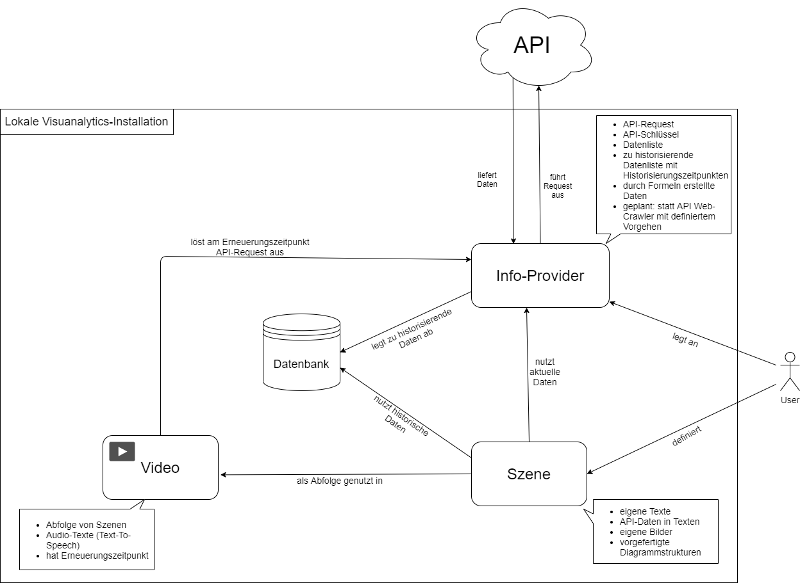
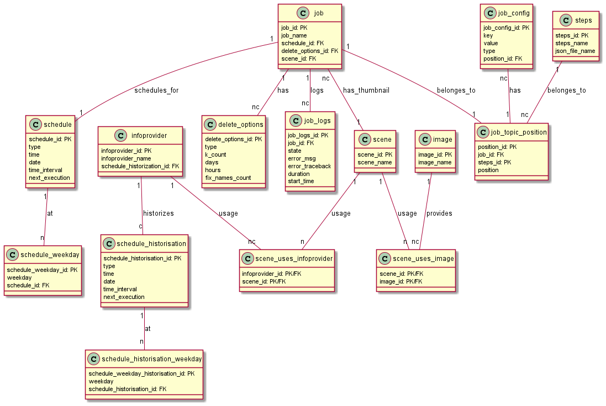

    
VisuAnalytics 2.0

     
    
Projektbericht

      
    
Softwaretechnik-Projekt - Sommersemester 2021

    
Prof. Dr. Frank Kammer

    
Technische Hochschule Mittelhessen

      
    
<strong>Daniel Spengler, Tristan Elias Wolfram, Philipp Helfenritter, Janek Berg, Sören Clausen, Tim Wolfgang Helmut Schwabe</strong>

<<<<<<< HEAD
# **Projektbericht**

## **Das Team**
Wir haben das Entwickler-Team, bestehend aus sechs Mitgliedern, in zwei Teams aufgeteilt:

### **Backend**
=======
#  Inhaltsverzeichnis
* 1. [Das Team](#DasTeam)
	* 1.1. [Backend](#Backend)
	* 1.2. [Frontend](#Frontend)
* 2. [Zeit- und Aufgabenmanagement](#Zeit-undAufgabenmanagement)
	* 2.1. [Rahmenbedingungen](#Rahmenbedingungen)
	* 2.2. [Meetings](#Meetings)
	* 2.3. [Aufteilung der Aufgaben](#AufteilungderAufgaben)
	* 2.4. [Aufteilung der Arbeitszeiten](#AufteilungderArbeitszeiten)
	* 2.5. [Zeitmanagement mittels Jira](#ZeitmanagementmittelsJira)
	* 2.6. [Kommunikation im Team](#KommunikationimTeam)
* 3. [Versionsverwaltung / Entwicklung neuer Features](#VersionsverwaltungEntwicklungneuerFeatures)
	* 3.1. [Entwicklung neuer Features](#EntwicklungneuerFeatures)
	* 3.2. [Automatisiertes Testen](#AutomatisiertesTesten)
	* 3.3. [Ablauf der Code-Reviews](#AblaufderCode-Reviews)
	* 3.4. [Verwendung der angesprochenen Automatisierungen](#VerwendungderangesprochenenAutomatisierungen)
	* 3.5. [Dokumentation](#Dokumentation)
		* 3.5.1. [Bereitstellung der Dokumentation](#BereitstellungderDokumentation)
* 4. [Entwicklungsumgebung, Programmiersprachen](#EntwicklungsumgebungProgrammiersprachen)
	* 4.1. [Entwicklungsumgebungen](#Entwicklungsumgebungen)
	* 4.2. [Verwendete Programmiersprachen](#VerwendeteProgrammiersprachen)
	* 4.3. [Hinweis: Version von Material-UI](#Hinweis:VersionvonMaterial-UI)
* 5. [Projektfazit / Abschluss](#ProjektfazitAbschluss)
	* 5.1. [Zielsetzung](#Zielsetzung)
	* 5.2. [Abgeschlossene Aufgaben](#AbgeschlosseneAufgaben)
		* 5.2.1. [Abgeschlossene Must-Haves](#AbgeschlosseneMust-Haves)
		* 5.2.2. [Abgeschlossene Nice-To-Haves](#AbgeschlosseneNice-To-Haves)
		* 5.2.3. [Abgeschlossene If-Time-Allows](#AbgeschlosseneIf-Time-Allows)
	* 5.3. [Bewährte Kommunikationsmittel](#BewhrteKommunikationsmittel)
	* 5.4. [Erweiterbarkeit](#Erweiterbarkeit)
	* 5.5. [Abwärtskompatibilität](#Abwrtskompatibilitt)
	* 5.6. [Test der Software](#TestderSoftware)
	* 5.7. [WordPress](#WordPress)
	* 5.8. [Bekannte Fehler / Bugs](#BekannteFehlerBugs)
	* 5.9. [Mögliche Fehler / Bugs](#MglicheFehlerBugs)
	* 5.10. [Abschließende Reflektion](#AbschlieendeReflektion)
* 6. [Anhang](#Anhang)
* 7. [**Anhang A: Lastenheft**](#AnhangA:Lastenheft)
	* 7.1. [**Momentaner Stand der Anwendung VisuAnalytics**](#MomentanerStandderAnwendungVisuAnalytics)
	* 7.2. [**Zielbestimmung**](#Zielbestimmung)
		* 7.2.1. [**Aufteilung in Kategorien**](#AufteilunginKategorien)
	* 7.3. [**Einsatz der Software**](#EinsatzderSoftware)
	* 7.4. [**Übersicht über die Benutzeroberfläche**](#bersichtberdieBenutzeroberflche)
		* 7.4.1. [**Übersichtsseite**](#bersichtsseite)
	* 7.5. [**Anlegen eines Infoproviders**](#AnlegeneinesInfoproviders)
		* 7.5.1. [**Erstellen eines Videojobs**](#ErstelleneinesVideojobs)
	* 7.6. [**Qualitätsanforderungen**](#Qualittsanforderungen)
	* 7.7. [**Anmerkungen**](#Anmerkungen)
	* 7.8. [**Quellen**](#Quellen)
	* 7.9. [**Anhang**](#Anhang-1)
		* 7.9.1. [**Übersicht über das Programm**](#bersichtberdasProgramm)
* 8. [**Anhang B: Pflichtenheft**](#AnhangB:Pflichtenheft)
	* 8.1. [**Einleitung**](#Einleitung)
		* 8.1.1. [**Auftraggeber**](#Auftraggeber)
		* 8.1.2. [**Das Entwicklerteam**](#DasEntwicklerteam)
		* 8.1.3. [**Kurzbeschreibung des Projekts**](#KurzbeschreibungdesProjekts)
	* 8.2. [**Informationen zum Auftrag**](#InformationenzumAuftrag)
		* 8.2.1. [**Rahmenbedingungen**](#Rahmenbedingungen-1)
		* 8.2.2. [**Besonderheiten**](#Besonderheiten)
		* 8.2.3. [**Etappenziele**](#Etappenziele)
	* 8.3. [**Bereits bestehende Systeme**](#BereitsbestehendeSysteme)
	* 8.4. [**Teams und Schnittstellen**](#TeamsundSchnittstellen)
		* 8.4.1. [**Teams**](#Teams)
		* 8.4.2. [**Jira für die Projektverwaltung**](#JirafrdieProjektverwaltung)
		* 8.4.3. [**GitHub zur Verwaltung des Quellcodes**](#GitHubzurVerwaltungdesQuellcodes)
		* 8.4.4. [**Meetings**](#Meetings-1)
		* 8.4.5. [**Kommunikationswege**](#Kommunikationswege)
	* 8.5. [**Technische Anforderungen**](#TechnischeAnforderungen)
	* 8.6. [**Frontend**](#Frontend-1)
		* 8.6.1. [**Backend**](#Backend-1)
	* 8.7. [**Problemanalyse**](#Problemanalyse)
		* 8.7.1. [**Mehraufwand des Frontends**](#MehraufwanddesFrontends)
		* 8.7.2. [**Erstellung des Szeneneditors**](#ErstellungdesSzeneneditors)
		* 8.7.3. [**Zeitmangel**](#Zeitmangel)
	* 8.8. [**Qualität**](#Qualitt)
		* 8.8.1. [**Qualitätskontrolle**](#Qualittskontrolle)
		* 8.8.2. [**Abnahmekriterien**](#Abnahmekriterien)
	* 8.9. [**Projektentwicklung und Zeitplan**](#ProjektentwicklungundZeitplan)
	* 8.10. [**Anhang**](#Anhang-1)
* 9. [Anhang C: Protokolle / Statusberichte](#AnhangC:ProtokolleStatusberichte)
	* 9.1. [Startbesprechung (08.04.2021)](#Startbesprechung08.04.2021)
		* 9.1.1. [Aufgaben](#Aufgaben)
		* 9.1.2. [Nächstes Treffen](#NchstesTreffen)
	* 9.2. [Sprintplanung (12.04.2021)](#Sprintplanung12.04.2021)
		* 9.2.1. [Inhalt des Lastenhefts](#InhaltdesLastenhefts)
		* 9.2.2. [Konfigurationsdatei](#Konfigurationsdatei)
		* 9.2.3. [Entwicklerteam](#Entwicklerteam)
		* 9.2.4. [Aufgaben](#Aufgaben-1)
		* 9.2.5. [Aufgaben des Frontends](#AufgabendesFrontends)
		* 9.2.6. [Backend-Aufgaben](#Backend-Aufgaben)
		* 9.2.7. [Generell](#Generell)
		* 9.2.8. [Aufteilung der einzelnen Aufgaben](#AufteilungdereinzelnenAufgaben)
		* 9.2.9. [Nächste Termine](#NchsteTermine)
	* 9.3. [Statusbericht (16.04.2021)](#Statusbericht16.04.2021)
		* 9.3.1. [Zusammenfassung](#Zusammenfassung)
		* 9.3.2. [Aufgaben bis zum nächsten Meeting](#AufgabenbiszumnchstenMeeting)
		* 9.3.3. [Nächstes Meeting](#NchstesMeeting)
	* 9.4. [Sprintplanung (19.04.2021)](#Sprintplanung19.04.2021)
		* 9.4.1. [Zusammenfassung](#Zusammenfassung-1)
		* 9.4.2. [Aufgaben für den Sprint](#AufgabenfrdenSprint)
		* 9.4.3. [Nächstes Meeting](#NchstesMeeting-1)
	* 9.5. [Fortschrittsbesprechung (23.04.2021)](#Fortschrittsbesprechung23.04.2021)
		* 9.5.1. [Zusammenfassung](#Zusammenfassung-1)
		* 9.5.2. [Diskutierte Probleme](#DiskutierteProbleme)
		* 9.5.3. [Weitere Aufgaben](#WeitereAufgaben)
	* 9.6. [Sprintplanung (26.04.2021)](#Sprintplanung26.04.2021)
		* 9.6.1. [Zusammenfassung](#Zusammenfassung-1)
		* 9.6.2. [Aufgaben der aktuellen Woche](#AufgabenderaktuellenWoche)
		* 9.6.3. [Nächste Treffen](#NchsteTreffen)
	* 9.7. [Fortschrittsbesprechung (30.04.2021)](#Fortschrittsbesprechung30.04.2021)
		* 9.7.1. [Zusammenfassung](#Zusammenfassung-1)
		* 9.7.2. [Arrays als Daten](#ArraysalsDaten)
		* 9.7.3. [Umfrage zur Zufriedenheit](#UmfragezurZufriedenheit)
		* 9.7.4. [Ziele](#Ziele)
	* 9.8. [Sprintplanung (03.05.2021)](#Sprintplanung03.05.2021)
		* 9.8.1. [Zusammenfassung](#Zusammenfassung-1)
		* 9.8.2. [Aufgaben für die kommende Woche](#AufgabenfrdiekommendeWoche)
	* 9.9. [Fortschrittsbesprechung (09.05.2021)](#Fortschrittsbesprechung09.05.2021)
		* 9.9.1. [Zusammenfassung](#Zusammenfassung-1)
		* 9.9.2. [Aufgaben für das Wochenende](#AufgabenfrdasWochenende)
	* 9.10. [Sprintplanung (10.05.2021)](#Sprintplanung10.05.2021)
		* 9.10.1. [Zusammenfassung](#Zusammenfassung-1)
		* 9.10.2. [Aufgaben für die Woche vom 10.05.2021 - 16.05.2021](#AufgabenfrdieWochevom10.05.2021-16.05.2021)
	* 9.11. [Fortschrittsbesprechung (14.05.2021)](#Fortschrittsbesprechung14.05.2021)
		* 9.11.1. [Zusammenfassung](#Zusammenfassung-1)
	* 9.12. [**Sprintplanung (17.05.2021)**](#Sprintplanung17.05.2021)
		* 9.12.1. [**Zusammenfassung**](#Zusammenfassung-1)
		* 9.12.2. [**Aufgaben**](#Aufgaben-1)
	* 9.13. [Fortschrittsbesprechung (21.05.2021)](#Fortschrittsbesprechung21.05.2021)
		* 9.13.1. [Zusammenfassung](#Zusammenfassung-1)
		* 9.13.2. [Aufgaben für das Wochenende](#AufgabenfrdasWochenende-1)
	* 9.14. [Planungsmeeting (24.05.2021)](#Planungsmeeting24.05.2021)
		* 9.14.1. [Zusammenfassung](#Zusammenfassung-1)
		* 9.14.2. [Aufgaben](#Aufgaben-1)
	* 9.15. [Fortschrittsbesprechung (28.05.2021)](#Fortschrittsbesprechung28.05.2021)
		* 9.15.1. [Zusammenfassung](#Zusammenfassung-1)
		* 9.15.2. [Stand der Zwischenpräsentation](#StandderZwischenprsentation)
		* 9.15.3. [Aufgaben für das Wochenende](#AufgabenfrdasWochenende-1)
	* 9.16. [Sprintplanung (31.05.2021)](#Sprintplanung31.05.2021)
		* 9.16.1. [Zusammenfassung](#Zusammenfassung-1)
		* 9.16.2. [Aufgaben](#Aufgaben-1)
	* 9.17. [Wochenfortschritt (04.06.2021)](#Wochenfortschritt04.06.2021)
		* 9.17.1. [Zusammenfassung](#Zusammenfassung-1)
		* 9.17.2. [Aufgaben für das Wochenende](#AufgabenfrdasWochenende-1)
	* 9.18. [Sprintplanung (07.06.2021)](#Sprintplanung07.06.2021)
		* 9.18.1. [Zusammenfassung](#Zusammenfassung-1)
		* 9.18.2. [Aufgaben für die aktuelle Woche](#AufgabenfrdieaktuelleWoche)
	* 9.19. [Fortschrittsbesprechung (11.06.2021)](#Fortschrittsbesprechung11.06.2021)
		* 9.19.1. [Zusammenfassung](#Zusammenfassung-1)
		* 9.19.2. [Aufgaben für das Wochenende](#AufgabenfrdasWochenende-1)
	* 9.20. [Planungsmeeting (14.06.2021)](#Planungsmeeting14.06.2021)
		* 9.20.1. [Zusammenfassung](#Zusammenfassung-1)
		* 9.20.2. [Aufgaben für die aktuelle Woche](#AufgabenfrdieaktuelleWoche-1)
	* 9.21. [Fortschrittsbesprechung (18.06.2021)](#Fortschrittsbesprechung18.06.2021)
		* 9.21.1. [Zusammenfassung](#Zusammenfassung-1)
		* 9.21.2. [Aufgaben für das Wochenende](#AufgabenfrdasWochenende-1)
		* 9.21.3. [Ergebnis der Zwischenpräsentation](#ErgebnisderZwischenprsentation)
	* 9.22. [Planungsmeeting (21.06.2021)](#Planungsmeeting21.06.2021)
		* 9.22.1. [Zusammenfassung](#Zusammenfassung-1)
		* 9.22.2. [Aufgaben](#Aufgaben-1)
	* 9.23. [Fortschrittsbesprechung (25.06.2021)](#Fortschrittsbesprechung25.06.2021)
		* 9.23.1. [Zusammenfassung](#Zusammenfassung-1)
	* 9.24. [Planungsmeeting (28.06.2021)](#Planungsmeeting28.06.2021)
		* 9.24.1. [Zusammenfassung](#Zusammenfassung-1)
		* 9.24.2. [Aufgaben für die Woche](#AufgabenfrdieWoche)
	* 9.25. [Fortschrittsbesprechung (02.07.2021)](#Fortschrittsbesprechung02.07.2021)
		* 9.25.1. [Zusammenfassung](#Zusammenfassung-1)
		* 9.25.2. [Aufgaben für das Wochenende](#AufgabenfrdasWochenende-1)
	* 9.26. [Planungsmeeting (05.07.2021)](#Planungsmeeting05.07.2021)
		* 9.26.1. [Zusammenfassung](#Zusammenfassung-1)
		* 9.26.2. [Aufgaben für die aktuelle Woche](#AufgabenfrdieaktuelleWoche-1)
	* 9.27. [Fortschrittsbesprechung (09.07.2021)](#Fortschrittsbesprechung09.07.2021)
		* 9.27.1. [Zusammenfassung](#Zusammenfassung-1)
		* 9.27.2. [Aufgaben für das Wochenende](#AufgabenfrdasWochenende-1)
	* 9.28. [Planungsmeeting (12.07.2021)](#Planungsmeeting12.07.2021)
		* 9.28.1. [Zusammenfassung](#Zusammenfassung-1)
		* 9.28.2. [Aufgaben für diese Woche](#AufgabenfrdieseWoche)
		* 9.28.3. [Kommende Meetings](#KommendeMeetings)
	* 9.29. [Präsentationsübung (16.07.2021)](#Prsentationsbung16.07.2021)
		* 9.29.1. [Zusammenfassung](#Zusammenfassung-1)
		* 9.29.2. [Aufgaben für das Wochenende](#AufgabenfrdasWochenende-1)
		* 9.29.3. [Letztes Planungsmeeting](#LetztesPlanungsmeeting)
	* 9.30. [Planungsmeeting (20.07.2021)](#Planungsmeeting20.07.2021)
	* 9.31. [Zusammenfassung](#Zusammenfassung-1)
	* 9.32. [Fortschrittsbesprechung (23.07.2021)](#Fortschrittsbesprechung23.07.2021)
		* 9.32.1. [Zusammenfassung](#Zusammenfassung-1)
		* 9.32.2. [Reflektion des Teams](#ReflektiondesTeams)

# Projektbericht

##  1. Das Team
Wir haben das Entwickler-Team, bestehend aus sechs Mitgliedern, in zwei Teams aufgeteilt:

###  1.1. Backend
>>>>>>> origin/master
* Sören Clausen
* Tim Schwabe

Dieses Team hatte primär die Aufgabe, das bisherige Backend in seiner Logik zu verstehen und passend zu erweitern. Zu diesen Erweiterungen gehörte unter anderem die Erweiterung der Datenbank oder das Implementieren neuer Features auf Basis der bereits bestehenden Funktionen. Dabei war es eine Priorität eine Abwärtskompatibilität zum bisherigen Backend zu gewährleisten, damit alte Videos nach wie vor generiert werden können.

<<<<<<< HEAD
### **Frontend**
=======
###  1.2. Frontend
>>>>>>> origin/master
* Tristan Wolfram
* Philipp Helfenritter
* Janek Berg
* Daniel Spengler (Projektleiter)

Das Frontend hatte primär die Aufgabe das User-Interface stark zu erweitern, sodass die Dateien zur Generierung von Videos nicht mehr per Hand geschrieben werden müssen. Viel mehr sollten die Dateien automatisch generiert werden. Dem Nutzer sollte dafür eine einfache GUI zur Verfügung gestellt werden. Das Team des Frontends wurde dabei mit mehr Mitgliedern als das Backend besetzt, da hier mehr Aufgaben angefallen sind.

<<<<<<< HEAD
## **Zeit- und Aufgabenmanagement**

### **Rahmenbedingungen**
=======
##  2. Zeit- und Aufgabenmanagement

###  2.1. Rahmenbedingungen
>>>>>>> origin/master
Die Software **VisuAnalytics** ist im Rahmen des **Softwaretechnik-Projekts** im Sommersemester 2021 an der **Technischen Hochschule Mittelhessen** unter der Leitung von Prof. Dr. Frank Kammer entstanden. Dabei startete das Projekt am **08.04.2021** und endet am **26.07.2021**.

In diesem Zeitraum sollte jedes Teammitglied **mindestens 220 Arbeitsstunden** für das Projekt aufbringen.

<<<<<<< HEAD
### **Meetings**
=======
###  2.2. Meetings
>>>>>>> origin/master
Das Team hatte insgesamt drei feste Meetings pro Woche:
* **Montags:** Während dieses Meetings wurden die Aufgaben für die aktuelle Woche verteilt. Dabei wurden die Aufgaben zunächst gröber und somit größer gehalten, um das Meeting möglichst kurz zu halten.
* **Donnerstags:** In diesem Meeting hat sich das Team mit dem Auftraggeber getroffen, um mögliche Probleme zu besprechen. Hier konnte allerdings auch der aktuelle Fortschritt gezeigt werden, und der Auftraggeber hatte die  Möglichkeit Feedback zu geben.
* **Freitags:** Während dieses Meetings hat sich das Team getroffen, um untereinander den aktuellen Fortschritt zu zeigen. Dabei war diese Vorführung meist etwas detaillierter als die Vorführung beim Auftraggeber, da hier mehr Zeit für die Vorstellungen war. Außerdem wurden bei diesem Meeting aufgetretene Probleme besprochen.

<<<<<<< HEAD
### **Aufteilung der Aufgaben**
=======
###  2.3. Aufteilung der Aufgaben
>>>>>>> origin/master
Die Aufteilung der Aufgaben erfolgte in zwei Phasen:
* **Phase 1:** Im Planungsmeeting der Woche (jeden Montag) wurden im gesamten Team die groben Aufgaben für die aktuelle Woche besprochen und in einem Protokoll festgehalten. Dabei wurden die Aufgaben entsprechend der beiden Teams (Front- und Backend) aufgeteilt. Je nach Situation gab es teilweise auch weitere Aufgabenkategorien, wie z.B. die Erstellung des Lasten- oder Pflichtenheftes, welche zur Kategorie **Organisation** gezählt werden können.
* **Phase 2:** Nach dem gemeinsamen Planungsmeeting wurden die Aufgaben vom jeweils zuständigen Team konkretisiert und an die einzelnen Entwickler verteilt. Somit war jedem Teammitglied zu Beginn der Woche bekannt, welche Aufgaben es zu erledigen hatte. Sollten die Aufgaben schnell erledigt worden sein, so konnten einzelne Teammitglieder weitere Aufgaben übernehmen, welche erst zu einem späteren Zeitpunkt geplant gewesen wären.

<<<<<<< HEAD
### **Aufteilung der Arbeitszeiten**
Grundsätzlich war es jedem Teammitglied freigestellt, wann dieses arbeitet und wie viele Stunden dieses pro Woche in das Projekt investiert hat. Diese Aussage galt während des Projekts grundsätzlich, es sei denn es gab schwerwiegende Fehler, welche dringend behoben werden mussten. Natürlich löst diese freie Aufteilung der Zeiten die 220 Stunden, welche geleistet werden sollten, nicht ab. Für die Einhaltung dieser "Regel" war jedes Teammitglied für sich verantwortlich. Sollten einem Mitglied einmal die Aufgaben ausgegangen sein, so hat das restliche Team versucht, weitere Aufgaben zu finden, um das Mitglied bei der Erreichung der erforderlichen Stunden zu unterstützen.

### **Zeitmanagement mittels Jira**
=======
###  2.4. Aufteilung der Arbeitszeiten
Grundsätzlich war es jedem Teammitglied freigestellt, wann dieses arbeitet und wie viele Stunden dieses pro Woche in das Projekt investiert hat. Diese Aussage galt während des Projekts grundsätzlich, es sei denn es gab schwerwiegende Fehler, welche dringend behoben werden mussten. Natürlich löst diese freie Aufteilung der Zeiten die 220 Stunden, welche geleistet werden sollten, nicht ab. Für die Einhaltung dieser "Regel" war jedes Teammitglied für sich verantwortlich. Sollten einem Mitglied einmal die Aufgaben ausgegangen sein, so hat das restliche Team versucht, weitere Aufgaben zu finden, um das Mitglied bei der Erreichung der erforderlichen Stunden zu unterstützen.

###  2.5. Zeitmanagement mittels Jira
>>>>>>> origin/master
Um Arbeitszeiten verwalten zu können, haben wir auf die Plattform **Jira** gesetzt, welche von der THM zur Verfügung gestellt wird. Hierbei haben wir das Projekt zu Beginn in **User Stories** eingeteilt, welche in Jira eingetragen wurden. Für jede dieser **User Stories** haben sich die Teammitglieder, entsprechend ihrer Aufgaben, Unteraufgaben erstellt, für welche dann auch Zeiten eingetragen wurden. Dabei ermöglicht Jira es, die Aufgaben auf einem **Board** anzuordnen, um zu visualisieren, wie der Status einer bestimmten Aufgabe zum aktuellen Zeitpunkt ist.

Um die Zeiten zu exportieren, haben wir das Tool ["Wochenberichtstool"](https://github.com/kowalski2019/Weekly_report_tool/wiki) verwendet. In diesem kann man einzelne Arbeitswochen hinzufügen und dabei direkt Daten von Jira importieren. Hierfür erstellt man mit Jira einen Bericht für die geleistete Arbeitszeit und beschränkt die Zeitspanne für diesen Bericht auf eine Woche (in unserem Fall von Montag bis einschließlich Samstag). Anschließend kann man die heruntergeladene CSV-Datei einfach im genanntem Tool importieren. Dabei erstellt das Werkzeug die benötigten Tabellen. Dazu gehört eine Übersicht über alle Aufgaben, sortiert nach der Woche. Weiterhin gibt es Tabellen für jeden Mitarbeiter, in welchen nur die Aufgaben des jeweiligen Mitglieds gelistet werden.

Auf diese Art, war es für uns einfach und schnell möglich die Zeiten aller Mitglieder zu erfassen und als Datei an unseren Auftraggeber zu senden.

<<<<<<< HEAD
### **Kommunikation im Team**
=======
###  2.6. Kommunikation im Team
>>>>>>> origin/master
Die Kommunikation innerhalb des Teams erfolgte primär durch die oben genannten Meetings und über die Plattform [Slack](https://slack.com/intl/de-de/).

Bei Slack handelt es sich um eine Plattform, auf welcher primär Textnachrichten und Dokumente ausgetauscht werden können. Die Kommunikation erfolgt dabei in verschiedenen **Channels**. Für unseren Anwendungszweck haben wir uns unter anderem die folgenden Channels erstellt:
* **Frontend:** Ein Channel für alle Frontend-Mitglieder, in welchem Informationen über die Entwicklung des Frontends ausgetauscht werden konnten. Auch konnten hier Probleme diskutiert, besprochen und gelöst werden.
* **Backend:** Die Funktionsweise dieses Channels war im Grunde sehr ähnlich, wie die des Frontend-Channels, diente allerdings als Kommunikationskanal für das Backend.
* **General:** In diesem Channel waren alle Teammitglieder angemeldet. Hier wurden generelle Informationen mitgeteilt, zu welchen jedes Teammitglied Zugang haben sollte. Dies waren beispielsweise Informationen des Auftraggebers oder zu größeren Neuigkeiten in der Entwicklung.
* **Protokolle:** Hier wurden alle Protokolle gesammelt, welche während der Planungs- und Fortschrittsmeetings geschrieben wurden.

Weiterhin existierte eine Gruppe auf der Plattform [WhatsApp](https://www.whatsapp.com/). Hier wurden Nachrichten ausgetauscht, wenn es etwas sehr kurzfristiges zu besprechen gab oder wenn es sich um eine äußerst dringliche Angelegenheit gehandelt hat.

<<<<<<< HEAD
## **Versionsverwaltung / Entwicklung neuer Features**
Um unser Projekt zu verwalten haben wir [ein bereits bestehendes Repository](https://github.com/Biebertal-mach-mit-TV/Data-Analytics) auf der Plattform Github verwendet. Dieses Repository wurde dabei vom Vorgänger-Projekt erstellt und von uns für die Weiterentwicklung verwendet. Dabei stellt das Repository einige Features bereit, welche uns aktiv bei der Entwicklung unterstützt haben. Auf diese Features soll in den folgenden Abschnitten eingegangen werden.

### **Entwicklung neuer Features**
=======
##  3. Versionsverwaltung / Entwicklung neuer Features
Um unser Projekt zu verwalten haben wir [ein bereits bestehendes Repository](https://github.com/Biebertal-mach-mit-TV/Data-Analytics) auf der Plattform Github verwendet. Dieses Repository wurde dabei vom Vorgänger-Projekt erstellt und von uns für die Weiterentwicklung verwendet. Dabei stellt das Repository einige Features bereit, welche uns aktiv bei der Entwicklung unterstützt haben. Auf diese Features soll in den folgenden Abschnitten eingegangen werden.

###  3.1. Entwicklung neuer Features
>>>>>>> origin/master
Wenn ein neues Feature entwickelt werden sollte oder auch ein Fehler korrigiert wurde, so wurde dies immer in einem eigens dafür erstellten Branch gemacht. Die Besonderheit ist nun, dass dieser Branch nicht manuell erstellt werden musste, sondern automatisiert von Github erstellt wurde. Damit dies möglich war, ist es nötig wie folgt bei der Erstellung eines Issues vorzugehen.
1. Den Tab **Issues** im Repository wählen.
2. Auf der angezeigten Seite die Erstellung eines neuen Issues wählen.
3. Ein Template für das Issue wählen, z.B. **Implementierung**.
4. Informationen zum Issue eingeben. Dazu gehört z.B. eine Beschreibung für das Issue oder die zuständige Person. In diesem Schritt ist es wichtig, mit Klick auf **Projects** das zugehörige Projekt auszuwählen. Das Projekt hat den Namen **Multimediales Data Analytics**.
5. Nach der erfolgreichen Erstellung des Issues wählt man **Projects** im Repository und wählt das Projekt **Multimediales Data Analytics**. Hier sieht man nun eine Übersicht des Projekts mit dem eben erstellten Issue unter der Spalte **To do**.
6. Verschiebt man ein Issue auf die Spalte **In progress** so wird nach kurzer Zeit ein Branch dafür erstellt.

Hat ein Entwickler die Arbeit an einem Feature / Bugfix abgeschlossen, so konnte das entsprechende Feature auf die Spalte **Review** verschoben werden. Hierbei wurde das Repository so eingerichtet, dass automatisch ein **Pull request** für den **Master branch** gestellt wurde. Gleichzeitig erfolgten nach diesem Schritt die automatisierten Tests und unser Review-Prozess.

<<<<<<< HEAD
### **Automatisiertes Testen**
=======
###  3.2. Automatisiertes Testen
>>>>>>> origin/master
Wie im vorherigen Abschnitt angesprochen, wurden bei Erstellung eines **Pull requests** automatisiert Tests angestoßen. Die Tests haben sich dabei in **Frontend Tests** und **Backend Tests** aufgeteilt.

Für das Frontend wurde dabei unter anderem ein Linter verwendet, welcher die Qualität des Codes sicherstellen sollte und z.B. auf ungenutzte Variablen oder Imports aufmerksam gemacht hat. Gleichzeitig haben die Tests aber auch versucht das Frontend zu starten und konnten so auch benachrichtigen, wenn ein Syntax-Fehler oder ähnliches vorlag.

Im Backend werden bislang während der automatisierten Tests nur die entwickelten **Unit Tests** geprüft. Können diese erfolgreich abgeschlossen werden, so wird auch der automatisierte Test erfolgreich abgeschlossen.

<<<<<<< HEAD
### **Ablauf der Code-Reviews**
=======
###  3.3. Ablauf der Code-Reviews
>>>>>>> origin/master
Sobald ein Issue auf die Spalte **Review** im Projekt verschoben wurde, begann auch der Review-Prozess. Hierzu wurde vom jeweiligen Entwickler des Features zunächst das restliche Entwicklungsteam (Front- oder Backend) benachrichtigt. Anschließend hat ein anderes Mitglied dieses Teams sich gemeldet, um das Code-Review durchzuführen. Dazu wurden während des Code-Reviews standardmäßig die beiden folgenden Schritte ausgeführt:
* Anwendung starten und neue Funktionalität rudimentär testen.
* Den neu geschriebenen Code möglichst detailliert nachvollziehen und kritisch hinterfragen.

Während dieser Arbeit war der Reviewer dazu angehalten sich Notizen zu Auffälligkeiten zu machen und diese dem ursprünglichen Entwickler des Branches zur Verfügung zu stellen. Nach Überarbeitung des Branches mit diesen Anmerkungen durfte dieser in den Master gemerged werden. Wenn es keine Anmerkungen gab, so konnte der Branch natürlich sofort gemerged werden, es sei denn es gab explizit andere Anweisungen.

Der Review-Prozess fand nur in den Fällen nicht statt, in welchen mindestens zwei Mitglieder am gleichen Feature entwickelt haben (Pair-Programming). In diesem Fall sehen wir die Kontrolle der Qualität durch die jeweils zuschauende Person als gegeben an.

<<<<<<< HEAD
### **Verwendung der angesprochenen Automatisierungen**
Die angesprochenen Automatisierungen in den ersten beiden Abschnitten dieses Kapitels wurden nicht eigenständig von uns entwickelt, sondern wurden bereits vom Vorgängerteam implementiert. Für eine genauere Dokumentation zu diesen Features empfehlen wir die Abschnitte der [zugehörigen Dokumentation](https://visuanalytics.readthedocs.io/de/latest/mainreport/Projektbericht.html) zu lesen. In diesen gibt es weitere Informationen zu diesen Features.

### **Dokumentation**
=======
###  3.4. Verwendung der angesprochenen Automatisierungen
Die angesprochenen Automatisierungen in den ersten beiden Abschnitten dieses Kapitels wurden nicht eigenständig von uns entwickelt, sondern wurden bereits vom Vorgängerteam implementiert. Für eine genauere Dokumentation zu diesen Features empfehlen wir die Abschnitte der [zugehörigen Dokumentation](https://visuanalytics.readthedocs.io/de/latest/mainreport/Projektbericht.html) zu lesen. In diesen gibt es weitere Informationen zu diesen Features.

###  3.5. Dokumentation
>>>>>>> origin/master
Für das Backend haben wir die Dokumentation mit dem Tool **Sphinx** aus Doc-Strings generiert. Dabei wurde möglichst jede Methode in ihrer Funktionsweise beschrieben. Weiterhin haben wir innerhalb der Funktionen Kommentare hinzugefügt, um komplexere Abschnitte in Funktionen möglichst verständlich zu halten.

Das Frontend hingegen hat die zugehörige Dokumentation nicht aus Doc-Strings generiert, sondern händisch erstellt. Hierbei haben wir nicht Methode für Methode dokumentiert, da dies einem Leser der Dokumentation gerade im Frontend nicht unbedingt weiterhilft. Dies liegt primär daran, dass die einzelnen Funktionen meist relativ simpel sind und es auf das Zusammenspiel zwischen den Funktionen ankommt. Dieses Zusammenspiel lässt sich in einer ausformulierten Dokumentation besser beschreiben als in Doc-Strings, welche einer einzelnen Funktion zugeordnet werden. Neben dieser händisch erstellten Dokumentation hat das Frontend-Team allerdings auch Doc-Strings hinzugefügt, damit für Leser des Codes schnell klar wird, was eine einzelne Funktion für eine Aufgabe hat. Auch haben wir hier probiert innerhalb weniger Wörter darauf einzugehen, wofür diese Funktion später gebraucht wird. Die händisch erstellte Dokumentation wurde dabei mittels [Code Spell Checker](https://marketplace.visualstudio.com/items?itemName=streetsidesoftware.code-spell-checker) mit der zugehörigen [Erweiterung für die deutsche Sprache](https://marketplace.visualstudio.com/items?itemName=streetsidesoftware.code-spell-checker-german) auf Rechtschreibfehler hin untersucht.

<<<<<<< HEAD
#### **Bereitstellung der Dokumentation**
=======
####  3.5.1. Bereitstellung der Dokumentation
>>>>>>> origin/master
Die Dokumentation wurde dem Auftraggeber als Ordner mit den folgenden Dateien übergeben:
* Projektbericht (Dieses Dokument)
* Frontend-Dokumentation
* Backend-Dokumentation
* Benutzeranleitung

Die Dateien liegen dabei alle als PDF-Datei vor.

Zusätzlich zu dieser Abgabe existiert im Repository des Projekts ebenfalls die Dokumentation. Möchte man sich diese anschauen, so kann man dies beispielsweise tun, indem man mittels Sphinx eine HTML-Repräsentation generiert:
1. Sphinx installieren, indem die Projekt-Abhängigkeiten installiert werden.
2. Im Repository in den Ordner `docs` wechseln.
3. Den Befehl `make html` aufrufen.
4. Im Ordner `build` liegt nun die generierte Dokumentation. Hier kann man die `index.html` aufrufen und somit die Startseite der Dokumentation öffnen.

<<<<<<< HEAD
## **Entwicklungsumgebung, Programmiersprachen**

### **Entwicklungsumgebungen**
=======
##  4. Entwicklungsumgebung, Programmiersprachen

###  4.1. Entwicklungsumgebungen
>>>>>>> origin/master
Innerhalb unseres Teams wurden zwei verschiedene Entwicklungsumgebungen eingesetzt:
* **WebStorm:** Entwicklung des Frontends
* **PyCharm:** Entwicklung des Backends.

<<<<<<< HEAD
### **Verwendete Programmiersprachen**
=======
###  4.2. Verwendete Programmiersprachen
>>>>>>> origin/master
Da wir kein vollständig neues Projekt entwickelt haben, haben wir uns dazu entschieden die Programmiersprachen, welche durch das Vorgänger-Team definiert und verwendet wurden, selbst zu verwenden:
* [Python](https://www.python.org/)
* [TypeScript](https://www.typescriptlang.org/)

Das Frontend hat dabei insbesondere die Frameworks [React](https://reactjs.org/) für die Darstellung und [Material-UI](https://material-ui.com/) für das Design verwendet.

Im Backend kamen primär die Frameworks [Flask](https://palletsprojects.com/p/flask/) für die Bereitstellung des Servers, [ast](https://docs.python.org/3/library/ast.html) für die Syntax-Überprüfung von Formeln, [Matplotlib](https://matplotlib.org/) für die Generierung von Diagrammen und [Pillow](https://pillow.readthedocs.io/en/stable/) für das Arbeiten mit Bildern zum Einsatz.

<<<<<<< HEAD
### **Hinweis: Version von Material-UI**
=======
###  4.3. Hinweis: Version von Material-UI
>>>>>>> origin/master
Momentan ist es nicht möglich die neueste Version von **Material-UI** für das Frontend zu verwenden, da diese mit den alten Frontend-Komponenten des Vorgängerprojekts nicht kompatibel wäre. Beim versuchten Update sind in diesen Komponenten Syntax-Fehler entstanden. Wir hatten während des Projekts keine Zeit diese zu beheben und haben uns deshalb dafür entschieden, kein Update von Material-UI einzubinden.

Die Komponenten des alten Frontends haben wir nicht entfernt, da wir der Meinung sind, dass es ein nützliches Feature sein könnte in der Weiterentwicklung dem Nutzer die Möglichkeit zu geben, zwischen beiden Versionen zu wechseln.

<<<<<<< HEAD
## **Projektfazit / Abschluss**

### **Zielsetzung**
=======
##  5. Projektfazit / Abschluss

###  5.1. Zielsetzung
>>>>>>> origin/master
Unser Ziel war es, die Anwendung **VisuAnalytics**, welche im letzten Sommersemester an der THM entstanden ist, generell benutzerfreundlicher zu machen, indem neue Themen / Videos für die Anwendung nun nicht mehr vom Nutzer in einer JSON-Datei spezifiziert werden müssen. Mit unserer Erweiterung sollte es möglich werden, dass ein Nutzer die benötigten Einstellungen in einer **GUI** wählen und individualisieren kann. Dabei sollte sich die Anwendung nicht auf eine bestimmte API beschränken, aus welcher Informationen bezogen werden können, sondern generisch aufgebaut sein, sodass alle APIs, welche XML- oder JSON-Objekte als Antwort liefern, verwendet werden können.

Diese Zielsetzung wurde durch unsere Arbeit in den letzten Monaten erfüllt. Es ist zwar nicht möglich gewesen in der gegebenen Zeit alle Möglichkeiten, welche bereits im Backend zur Verfügung standen, auch im neuen Frontend umzusetzen, jedoch ist es möglich, ein sehr individuelles Video nach eigenen Vorstellungen zu generieren. Dabei benötigt ein Nutzer nun deutlich weniger Fachwissen. Dennoch sollte die Zielgruppe sich im Bereich IT etwas auskennen, um die Dokumentationen von APIs zu verstehen, welche er benutzen möchte.

Auf spezifischere Teile der Zielsetzung, welche später im **Pflichtenheft** definiert wurden, soll im weiteren Verlauf dieses Kapitels eingegangen werden.

<<<<<<< HEAD
### **Abgeschlossene Aufgaben**
Im Folgenden sollen die Aufgaben genannt werden, welche während des Projekts umgesetzt werden konnten. Dabei sind diese Aufgaben kategorisiert nach **Must-Have**, **Nice-To-Have** und **If-Time-Allows**. Die entsprechenden Einträge wurden dabei in ihrem Sinn aus dem **Lastenheft** übernommen.

#### **Abgeschlossene Must-Haves**
=======
###  5.2. Abgeschlossene Aufgaben
Im Folgenden sollen die Aufgaben genannt werden, welche während des Projekts umgesetzt werden konnten. Dabei sind diese Aufgaben kategorisiert nach **Must-Have**, **Nice-To-Have** und **If-Time-Allows**. Die entsprechenden Einträge wurden dabei in ihrem Sinn aus dem **Lastenheft** übernommen.

####  5.2.1. Abgeschlossene Must-Haves
>>>>>>> origin/master
* Als Nutzer möchte ich einen **Infoprovider** erstellen können. Diesem kann ich einen Namen geben und eine URL zu einer API, sowie den zugehörigen API-Key übergeben. Anschließend wird mit diesen Daten und durch Abfrage der API eine Liste von verfügbaren Parametern generiert, aus welcher ich beliebig viele Parameter wählen kann. Diese möchte ich später für die Erstellung von Videojobs verwenden können. Wahlweise kann ich zu einem Infoprovider auch mehrere APIs hinzufügen.
* Als Nutzer möchte ich **Formeln** aus den Attributen des Infoproviders erstellen und so z.B. eine Differenz von zwei Werten bestimmen können.
* Als Nutzer möchte ich im Infoprovider Daten auswählen können, welche ich historisieren möchte, um später Zugriff auf ältere Werte zu haben. Außerdem möchte ich dabei beliebige Zeitpunkte für die Historisierung wählen können.
* Als Nutzer möchte ich meine angelegten Infoprovider bearbeiten können, um nicht für jede Änderung einen neuen Infoprovider definieren zu müssen.
* Als Nutzer möchte ich mit einem **Videoeditor** Videojobs erstellen können. Diese Jobs bestehen dabei aus Standbildern, welche hier als *Szene* bezeichnet werden. In dem Videojob möchte ich Daten aus meinen Infoprovidern verwenden können, um damit beispielsweise einen Text zu verfassen, welcher nach Generierung des konkreten Videos von einer synthetischen Stimme (TTS) vorgelesen wird. Den Text, welcher vorgelesen wird, möchte ich dabei in eigenen Worten verfassen können. Weiterhin soll der Text Variablen enthalten können, welche durch Werte von der API befüllt werden können.
* Als Nutzer möchte ich zu einem Videojob eine **Szene** hinzufügen können, in welcher ich eine beliebige Hintergrundfarbe festlegen kann. Außerdem soll der **Szeneneditor** die Möglichkeit enthalten eigene Hintergrundbilder festzulegen. Text, Diagramme und Daten aus den Infoprovidern, sowie eigene Bilder sollen dabei überall im Bild frei platzierbar sein.
* Als Nutzer möchte ich Videojobs und Szenen bearbeiten können, damit ich für kleine Änderungen nicht einen vollständig neuen Job erstellen muss.
* Als Nutzer möchte ich einen Infoprovider für verschiedene Videojobs und Szenen verwenden können.

<<<<<<< HEAD
#### **Abgeschlossene Nice-To-Haves**
* Als Nutzer möchte ich, dass bei Absturz des Servers die Infoprovider samt ihrer Historisierung erhalten bleiben. Es sollen also keine Daten verloren gehen.
* Als Benutzer möchte ich im Szeneneditor **Hilfen zur Anordnung** (alignment) für Elemente haben, damit diese perfekt ausgerichtet sind. (Alignment wurde bei uns dabei durch die manuelle Eingaben von Koordinaten für die Position ermöglicht.)

#### **Abgeschlossene If-Time-Allows**
Es wurden aus zeitlichen Gründen keine **If-Time-Allows** abgeschlossen. Hierfür war der gegebene Zeitrahmen zu knapp gewählt.

### **Bewährte Kommunikationsmittel**
=======
####  5.2.2. Abgeschlossene Nice-To-Haves
* Als Nutzer möchte ich, dass bei Absturz des Servers die Infoprovider samt ihrer Historisierung erhalten bleiben. Es sollen also keine Daten verloren gehen.
* Als Benutzer möchte ich im Szeneneditor **Hilfen zur Anordnung** (alignment) für Elemente haben, damit diese perfekt ausgerichtet sind. (Alignment wurde bei uns dabei durch die manuelle Eingaben von Koordinaten für die Position ermöglicht.)

####  5.2.3. Abgeschlossene If-Time-Allows
Es wurden aus zeitlichen Gründen keine **If-Time-Allows** abgeschlossen. Hierfür war der gegebene Zeitrahmen zu knapp gewählt.

###  5.3. Bewährte Kommunikationsmittel
>>>>>>> origin/master
Während des Projekts hat sich insbesondere **Slack** als Kommunikationsmethode bewährt. Nachdem jeder die Funktionsweise von Slack verstanden hatte, gab es hier eine sehr gute Struktur und die Nachrichten, welche gesucht wurden, konnten schnell gefunden werden. Auch war jedes Mitglied über den Nachrichtendienst gut erreichbar. So konnten meist sehr schnell Meetings ausgemacht werden, wenn es größere Probleme gab. Auch konnten schnell Probleme gelöst werden, wenn die benötigten Personen die Nachrichten entsprechend schnell sahen. Es wäre bei Slack sogar möglich gewesen eine **Github-Erweiterung** zu installieren, mit welcher es möglich gewesen wäre, den Fortschritt im Repository direkt auf Slack einzusehen. Wir haben uns damit allerdings aus zeittechnischen Gründen nicht auseinandergesetzt.

Auch die Meetings haben sich bewährt und dafür gesorgt, dass wir ein gutes Arbeitstempo vorweisen konnten. Dabei hat sich auch die angesprochene Struktur / Anzahl der Meetings bewährt und musste nicht weiter angepasst werden.

Die Gruppe auf **WhatsApp** blieb während des Projekts in den allermeisten Fällen ruhig und wurde kaum benötigt. In dringenden Fällen wurden aber auch hier Nachrichten ausgetauscht. Es hat sich hier also um eine gute Ergänzung zu Slack gehandelt.

<<<<<<< HEAD
### **Erweiterbarkeit**
Ein Ziel von uns war es, die Anwendung so zu entwickeln, dass weitere Features hinzugefügt werden können. Wir sind der Meinung, dieses Ziel durch eine gute Doku und eine geeignete Struktur des Quellcodes auch erreicht zu haben. Dennnoch wird es für weitere Teams schwierig sein sich in den Code einzuarbeiten, da dieser auf Grund der Anforderungen an einigen Stellen ein sehr hohes Level an Komplexität erreicht hat.

### **Abwärtskompatibilität**
Ein weiteres Ziel unserer Anwendung war es **abwärtskompatibel** zur "alten" Version der Anwendung zu sein. Da wir am ursprünglichen Backend nur wenig ändern mussten und die ehemaligen Strukturen weiterhin existieren, sollte auch dieser Teil der Zielsetzung erfüllt worden sein.

### **Test der Software**
Für den Test der Software hatten wir vergleichsweise wenig zeit. Jedoch haben wir uns so organisiert, dass das Backend mit intensiven Tests 10 Tage vor Abgabe beginnen konnte. Damit ist nicht gemeint, dass vorherige Teile der Anwendung nicht getestet wurden (dies passierte immer im Review-Prozess), sondern viel mehr der Test der Anwendung im Zusammenspiel mit allen entwickelten Komponenten. Wir sind trotz dieses kurzen Zeitraums allerdings der Meinung die Anwendung gut getestet haben zu können. Wir schließen kleinere Fehler dennoch nicht aus.

### **WordPress**
Auf Grund fehlender Zeit und der Zusicherung, dass am WordPress-Plugin, welches letztes Semester entstanden ist, nichts mehr verändert werden muss, haben wir das Plugin nicht getestet. 

### **Bekannte Fehler / Bugs**
=======
###  5.4. Erweiterbarkeit
Ein Ziel von uns war es, die Anwendung so zu entwickeln, dass weitere Features hinzugefügt werden können. Wir sind der Meinung, dieses Ziel durch eine gute Doku und eine geeignete Struktur des Quellcodes auch erreicht zu haben. Dennnoch wird es für weitere Teams schwierig sein sich in den Code einzuarbeiten, da dieser auf Grund der Anforderungen an einigen Stellen ein sehr hohes Level an Komplexität erreicht hat.

###  5.5. Abwärtskompatibilität
Ein weiteres Ziel unserer Anwendung war es **abwärtskompatibel** zur "alten" Version der Anwendung zu sein. Da wir am ursprünglichen Backend nur wenig ändern mussten und die ehemaligen Strukturen weiterhin existieren, sollte auch dieser Teil der Zielsetzung erfüllt worden sein.

###  5.6. Test der Software
Für den Test der Software hatten wir vergleichsweise wenig Zeit. Jedoch haben wir uns so organisiert, dass das Backend mit intensiven Tests 10 Tage vor Abgabe beginnen konnte. Damit ist nicht gemeint, dass vorherige Teile der Anwendung nicht getestet wurden (dies passierte immer im Review-Prozess), sondern viel mehr der Test der Anwendung im Zusammenspiel mit allen entwickelten Komponenten. Wir sind trotz dieses kurzen Zeitraums allerdings der Meinung, die Anwendung gut getestet haben zu können. Wir schließen kleinere Fehler dennoch nicht aus.

###  5.7. WordPress
Auf Grund fehlender Zeit und der Zusicherung, dass am WordPress-Plugin, welches letztes Semester entstanden ist, nichts mehr verändert werden muss, haben wir das Plugin nicht getestet. 

###  5.8. Bekannte Fehler / Bugs
>>>>>>> origin/master
Trotz dem Anspruch an eine hohe Code-Qualität durch die ergriffenen Maßnahmen und Methoden, konnten wir bis zum Ende des Projekts die folgenden Fehler nicht korrigieren:
* Update von Material-UI, da durch das Update Fehler auftreten werden. Auf dieses Problem wurde bereits im Abschnitt **Entwicklungsumgebung, Programmiersprachen und Frameworks** eingegangen.
* Auf Säulen- und Balkendiagrammen kann es vorkommen, dass einzelne Balken / Säulen nicht zu sehen sind, da diese von anderen verdeckt werden. Dies passiert dabei nur bei Diagrammen, welche mehr als ein einzelnes Datum visualisieren sollen.

<<<<<<< HEAD
### **Mögliche Fehler / Bugs**
Da die Anwendung stark weiterentwickelt wurde und es unter Umständen Fälle gibt, welche wir durch unsere Tests nicht abdecken konnten, kann es - wie bei jeder anderen Software auch - zu Fehlern kommen, welche uns noch nicht bekannt waren.

### **Abschließende Reflektion**
=======
###  5.9. Mögliche Fehler / Bugs
Da die Anwendung stark weiterentwickelt wurde und es unter Umständen Fälle gibt, welche wir durch unsere Tests nicht abdecken konnten, kann es - wie bei jeder anderen Software auch - zu Fehlern kommen, welche uns noch nicht bekannt waren.

###  5.10. Abschließende Reflektion
>>>>>>> origin/master
Insgesamt hat das Team in den vergangenen Monaten eine spannende Zeit erleben dürfen. Allerdings ist sich das Team einig, dass das Projekt für den gegebenen Zeitraum vermutlich zu umfangreich war. So war es zu Beginn sehr schwierig sich in das Projekt einzuarbeiten, da vor allem im Backend bereits sehr viel - auch komplexer - Code vorhanden war. Im Frontend war vor allem der Szeneneditor problematisch in seiner Implementierung, da es zunächst überhaupt schwierig war ein geeignetes Framework zu finden. Nachdem dieses gefunden war, war es zusätzlich aber auch schwierig die Implementierung damit umzusetzen, da sämtliche offizielle Beispiele in **ECMA-Script** geschrieben wurden. So erforderte es einige Versuche, bis eine erste Version des Szeneneditors zustande kommen konnte. Ein weiterer Faktor war es, dass die Bugs der Software teils erst sehr spät gefunden werden konnten, da viele dieser Bugs nur auftreten, wenn man den letzten Schritt der Videogenerierung ausführt. Hier wird nämlich nicht nur etwas abgespeichert, sondern die Daten werden zur Verarbeitung genutzt. Aufgrund dieses Aspektes war es enorm schwierig, länger angesetzte Tests zu organisieren.

Wenn wir als Team unsere getane Arbeit im Nachhinein betrachten, so erkennen wir die zeitlichen Probleme und die dadurch zu kurz ausgefallenen Tests, allerdings sind wir mit unserer entstandenen Arbeit dennoch sehr zufrieden.

<<<<<<< HEAD
## **Anhang**
=======
##  6. Anhang
>>>>>>> origin/master

##  7. **Anhang A: Lastenheft**

###  7.1. **Momentaner Stand der Anwendung VisuAnalytics**
Bisher ist es mit der Software VisuAnalytics möglich, sich Videos zu bestimmten Themen, wie z.B. einem Wetterbericht, generieren zu lassen. Dabei werden die Informationen für den Wetterbericht von einer spezifizierten API abgegriffen und durch Definitionen in Form eines JSON-Objekts so aufbereitet, dass ein Video automatisiert erstellt werden kann. Welche APIs mit welchen Daten hierbei unterstützt werden, wird ebenfalls durch JSON-Dateien festgelegt.
Es ist außerdem möglich, die Erstellung des Videos bis zu einem gewissen Grad zu individualisieren. Dafür können bei Erstellung des Videos vorgegebene Parameter verändert werden. So wird es beispielsweise möglich, die gleiche API zu verwenden, um den Wetterbericht für zwei verschiedene Orte zu generieren.

###  7.2. **Zielbestimmung**
Das Projekt **VisuAnalytics** aus dem Softwaretechnik-Projekt des letzten Sommersemesters soll im Laufe dieses Projektes erweitert werden. Unter anderem soll die Anwendung dadurch generell benutzerfreundlicher werden und mehr Möglichkeiten als bisher bieten. Um welche Verbesserungen es sich dabei konkret handelt, soll in Form von **User Stories** erläutert werden.

####  7.2.1. **Aufteilung in Kategorien**
Die Anforderungen an die Erweiterung sollen im nachfolgenden in die drei Kategorien *Must-Have*, *Nice-To-Have* und *If-Time-Allows* gegliedert werden, um eine Priorisierung der einzelnen Aufträge zu ermöglichen.

##### **Must-Have**
* Als Nutzer möchte ich einen **Infoprovider** erstellen können. Diesem kann ich einen Namen geben und eine URL zu einer API sowie den zugehörigen API-Key übergeben. Anschließend wird mit diesen Daten und durch Abfrage der API eine Liste von verfügbaren Parametern generiert, aus welcher ich beliebig viele Parameter wählen kann. Diese möchte ich später für die Erstellung von Videojobs verwenden können. Wahlweise kann ich zu einem Infoprovider auch mehrere APIs hinzufügen.
* Als Nutzer möchte ich **Formeln** aus den Attributen des Infoproviders erstellen und so z.B. eine Differenz von zwei Werten bestimmen können.
* Als Nutzer möchte ich im Infoprovider Daten auswählen können, welche ich historisieren möchte, um später Zugriff auf ältere Werte zu haben. Außerdem möchte ich dabei beliebige Zeitpunkte für die Historisierung wählen können.
* Als Nutzer möchte ich meine angelegten Infoprovider bearbeiten können, um nicht für jede Änderung einen neuen Infoprovider definieren zu müssen.
* Als Nutzer möchte ich mit einem **Videoeditor** Videojobs erstellen können. Diese Jobs bestehen dabei aus Standbildern, welche hier als *Szene* bezeichnet werden. In dem Videojob möchte ich Daten aus meinen Infoprovidern verwenden können, um damit beispielsweise einen Text zu verfassen, welcher nach Generierung des konkreten Videos von einer synthetischen Stimme (TTS) vorgelesen wird. Den Text, welcher vorgelesen wird, möchte ich dabei in eigenen Worten verfassen können. Weiterhin soll der Text Variablen enthalten können, welche durch Werte von der API befüllt werden können. Zusätzlich zur Sprachausgabe möchte ich außerdem die Möglichkeit haben Soundeffekte hinzuzufügen, welche der Nutzer bei Abspielen des Videos hört.
* Als Nutzer möchte ich zu einem Videojob eine **Szene** hinzufügen können, in welcher ich eine beliebige Hintergrundfarbe festlegen kann. Außerdem soll der **Szeneneditor** die Möglichkeit enthalten eigene Hintergrundbilder festzulegen. Text, Diagramme und Daten aus den Infoprovidern, sowie eigene Bilder sollen dabei überall im Bild frei platzierbar sein.
* Als Nutzer möchte ich Videojobs und Szenen bearbeiten können, damit ich für kleine Änderungen nicht einen vollständig neuen Job erstellen muss.
* Als Nutzer möchte ich eine Szene als Vorschau für den Videojob wählen können, um z.B. Aufmerksamkeit für ein Video zu erzeugen. Dabei muss die Szene nicht aus dem Video selbst stammen, sondern ich kann eine beliebige Szene wählen, welche ich zuvor erstellt habe.
* Als Nutzer möchte ich einen Infoprovider für verschiedene Videojobs und Szenen verwenden können.

> **WARNUNG:** Es sei an dieser Stelle nochmal ausdrücklich erwähnt, dass der "Videoeditor" einen nur sehr begrenzten Funktionsumfang besitzt. Es wird lediglich möglich sein, Szenen aneinander zu reihen, eine Sprachausgabe hinzuzufügen und Soundeffekte einzuspielen. Szenen bestehen dabei aus Standbildern. Bewegtbilder oder dynamische Bilder werden also nicht zur Verfügung stehen.

##### **Nice-To-Have**
* Als Nutzer möchte ich Soundeffekte auswählen können, welche nur abgespielt werden, wenn bestimmte Bedingungen gegeben sind (z.B. die Voraussage von regnerischem Wetter).
* Als Nutzer möchte ich, dass bei Absturz des Servers die Infoprovider samt ihrer Historisierung erhalten bleiben. Es sollen also keine Daten verloren gehen.
* Als Benutzer möchte ich im Szeneneditor **Hilfen zur Anordnung** (alignment) für Elemente haben, damit diese perfekt ausgerichtet sind.
* Für Webseiten, welche keine API zur Verfügung stehen haben, möchte ich eine simple *Drag-And-Drop-Skriptsprache* zur Verfügung gestellt bekommen, durch welche ich automatisiert bestimmte Daten aus einem HTML-Dokument erhalten kann. Diese Daten möchte ich genau wie Daten von einer API zur Erstellung von Videos nutzen und in einem Infoprovider sichern können.
* Als Nutzer möchte ich Videos aus einer vorhandenen Wissensdatenbank generieren lassen, welche z.B. die Zubereitung eines Rezepts visualisieren oder einen Witz erzählen.
* Die Anwendung soll dafür sorgen können, dass eine API nicht zu oft hintereinander von verschiedenen Videos oder Infoprovidern angefragt wird, damit die API die gehäuften Requests nicht irgendwann einfach blockiert. Alternativ möchte ich selbst einen Zeitabstand wählen können, in welchem die API angefragt wird.
* Als Nutzer möchte ich, dass der Webscraper Cookies verwenden und speichern kann, damit nicht bei jeder neuen Anfrage an eine Website eine Autorisierung erforderlich ist.

##### **If-Time-Allows**
* Als Nutzer möchte ich die Möglichkeit haben **Lernvideos** zu verschiedenen Themen zu generieren (z.B. für simple Kopfrechenaufgaben).
* Als Nutzer möchte ich Infoprovider ex- und importieren können, um Infoprovider mit anderen teilen zu können.
* Wenn ich mit dem WordPress-Plugin der Anwendung arbeite, so möchte ich das Theme meiner WordPress-Seite für die Anwendung übernehmen können.
* Zu den einzelnen Videos, welche generiert werden, möchte ich die Möglichkeit haben, Untertitel einzubinden.

###  7.3. **Einsatz der Software**
Genau wie die ursprüngliche Software, soll die Erweiterung den Betreibern der Seite [https://biebertal.mach-mit.tv/](https://biebertal.mach-mit.tv/) zur Verfügung gestellt werden. Dort soll diese produktiv genutzt werden können. Die Videos, welche dabei generiert werden, müssen so gespeichert werden können, dass sie von den Betreibern bei Bedarf öffentlich gemacht werden können.

Die Zielgruppe, welche die Videojobs erstellt, sollte grundlegende IT-Kenntnisse besitzen, um aus einer Dokumentation einer API herausfinden zu können, welchen API-Endpunkt sie für bestimmte Informationen anfragen muss. Die Zielgruppe, für welche die Videos generiert werden, ist durch die Entwicklung des Produktes nicht genau definierbar, da durch den generischen Aufbau Videos zu Themen aus verschiedensten Bereichen entstehen können.

###  7.4. **Übersicht über die Benutzeroberfläche**
Die folgende Übersicht geht nur auf Elemente der Kategorie **Must-have** ein. Weitere Elemente welche das UI betreffen, werden bei Bedarf hier ergänzt.

####  7.4.1. **Übersichtsseite**
Hier soll ein Nutzer eine grundlegende Übersicht bekommen. So soll es u.a. möglich sein, die angelegten Infoprovider anzusehen und zu bearbeiten, die erstellten Videojobs inklusive zugehöriger Details einsehen und auch neue Videojobs sowie Infoprovider erstellen zu können.

###  7.5. **Anlegen eines Infoproviders**
Hier kann der Nutzer zunächst einen Namen für seinen neuen Infoprovider angeben, anschließend eine API spezifizieren und deren Key eingeben. Anschließend wird ihm eine Liste von verfügbaren Attributen angezeigt, aus welcher er seine gewünschten Daten auswählen kann. Zusätzlich steht ihm für jedes Attribut die Möglichkeit zur Verfügung, auszuwählen, ob die Daten dieses Felds historisiert werden sollen. Weiterhin soll dem Nutzer noch die Möglichkeit gegeben werden, auszuwählen, wie viele Datensätze in der Datenbank gleichzeitig vorliegen sollen und zu welchen Zeitpunkten die Daten historisiert werden.

####  7.5.1. **Erstellen eines Videojobs**
Dieser Vorgang teilt sich auf mehrere Schritte auf:
1. Der Nutzer spezifiziert einen Namen für den Videojob.
2. Nun gelangt der Nutzer zu einem Videoeditor, in welchem er die Bearbeitung abschließen kann oder weitere Szenen hinzufügen kann. Für die einzelnen Szenen kann er außerdem entscheiden, ob die Szene eine von ihm festgelegte Länge erhält, oder ob die Länge aus dem Audio bestimmt werden soll. In letzterem Fall soll der Nutzer auch angeben, ob das Bild länger eingeblendet werden soll als die Audio. Bei Erstellung einer neuen Szene gelangt der Nutzer in einen weiteren Editor, in welchem ihm Tools zur Verfügung stehen, um Elemente in der Szene zu platzieren. Für die Erstellung von Szenen kann der Nutzer außerdem Infoprovider auswählen, deren Daten er anschließend in die Szene einfügen kann. Während der Erstellung des Videojobs kann der Nutzer außerdem eine Audiospur für das Video generieren und diese mit TTS und eigenen Audio-Dateien befüllen, welche, falls gewünscht, auch auf Daten des Infoproviders zugreifen können.
3. Nun kann der Nutzer weitere Einstellungen vornehmen, wie beispielsweise die Konfiguration der Zeiten, zu welchen das Video generiert werden soll. (Bei Generierung des Videos wird dabei durch den Infoprovider eine Abfrage an die API gesendet, um aktuelle Daten zu erhalten.)

###  7.6. **Qualitätsanforderungen**
1. Die Erweiterung soll die gleichen Qualitätsanforderungen wie die aktuelle Version des Produkts besitzen.
2. Durch die eingeführten Erweiterungen soll das Generieren von Videos mit neuen Themen deutlich einfacher werden, da keine Kenntnisse über JSON vorausgesetzt werden müssen. Nutzer sollen sich lediglich damit auseinandersetzen, welche API passend für den Zweck ist.
3. Das Produkt sollte größtenteils barrierefrei umgesetzt sein, um nicht in rechtliche Schwierigkeiten zu kommen.

###  7.7. **Anmerkungen**
* Die Barrierefreieheit wird für digitale Medien immer weiter durch gesetzliche Vorgaben vorangetrieben, insbesondere durch den European Accessibility Act (EAA). Nach dessen Vorgaben ist es zwar noch nicht gesetzlich gefordert das Produkt barrierefrei umzusetzen, in Zukunft könnte dies allerdings der Fall werden. Um einen großen Umbau zu verhindern ist unser Vorschlag daher, wenn möglich, Barrierefreiheit im Produkt umzusetzen. Auch schlagen wir eine Dokumentation der verwendeten Techniken vor, damit bei eventuellen späteren Erweiterungen darauf zurückggegriffen werden kann.

###  7.8. **Quellen**
* Einführung in den European Accessibility Act (letzter Zugriff am 12.04.2021): [https://www.bundesfachstelle-barrierefreiheit.de/DE/Themen/European-Accessibility-Act/european-accessibility-act.html?nn=1108170#doc1108168bodyText2](https://www.bundesfachstelle-barrierefreiheit.de/DE/Themen/European-Accessibility-Act/european-accessibility-act.html?nn=1108170#doc1108168bodyText2)

###  7.9. **Anhang**

####  7.9.1. **Übersicht über das Programm**
Das nachfolgende Diagramm soll eine visuelle Übersicht über den Ablauf des Programms darstellen:

##  8. **Anhang B: Pflichtenheft**

###  8.1. **Einleitung**

####  8.1.1. **Auftraggeber**

Im Rahmen des Softwaretechnik-Projekts an der Technischen Hochschule Mittelhessen (THM) wurde dem Entwicklerteam von Herrn Prof. Dr. Kammer der Auftrag erteilt, die VisuAnalytics-Software aus dem vorherigen Sommersemester weiterzuentwickeln. Das Ziel ist es, die neue Version der Gemeinde Biebertal zur Verfügung zu stellen.

####  8.1.2. **Das Entwicklerteam**

Das Entwicklerteam besteht aus den nachfolgend aufgelisteten Mitgliedern.

* Tristan Wolfram (Frontend)
* Philipp Helfenritter (Frontend)
* Janek Berg (Frontend)
* Sören Clausen (Backend)
* Tim Schwabe (Backend)
* Daniel Spengler (Projektleiter / Frontend)

####  8.1.3. **Kurzbeschreibung des Projekts**

Mit der von uns umzusetzenden Erweiterung von **Visuanalytics** soll es für einen Nutzer einfach möglich sein, Videos zu generieren, welche unter anderem Informationen von eigens gewählten APIs aufbereitet anzeigen können. Dazu ist es ebenfalls geplant dem Nutzer ein Werkzeug an die Hand zu geben, mit welchem er sich neue APIs in der Software speichern kann. Somit entsteht also ein sehr generisches Framework, mit welchem Videos zu allen denkbaren Themen erstellt werden können.

###  8.2. **Informationen zum Auftrag**

####  8.2.1. **Rahmenbedingungen**

Die Weiterentwicklung der Anwendung **VisuAnalytics** erfolgt im Rahmen des Sommersemester 2021 an der Technischen Hochschule Mittelhessen im Pflichtmodul **Softwaretechnik-Projekt**, welches von Herrn Prof. Dr. Kammer begleitet wird. Dabei hat das Modul eine Gewichtung von 9 Creditpoints, d.h. ca. 270 Stunden Arbeitsaufwand pro Person. Dies ergibt einen Arbeitsaufwand von ca. 16 Stunden pro Woche. Wie sich die einzelnen Mitglieder diese Zeiten aufteilen, ist ihnen selbst überlassen, solange alle vorgegebenen Aufgaben in der vorgegebenen Zeit erledigt werden.

####  8.2.2. **Besonderheiten**

Hervorgehoben sei an dieser Stelle, dass die Anwendung jede beliebige API zur Informationsgewinnung nutzen kann, solange diese ein JSON-Objekt oder eine XML-Datei als Antworttext versenden kann. Dadurch ist es möglich ein Video zu einem Thema einmal zu erstellen und die Aktualisierung dieses Videos wird dann von der Software selbst erledigt. Es benötigt also beispielsweise keine Person, die jeden Tag einen neuen Wetterbericht hochlädt, denn nach dessen Erstellung und Eingabe von verwendeten API-Daten wird die Software diesen Bericht zu festgelegten Zeiten selbstständig erneuern. Weiterhin ist es geplant die Software so zu erweitern, dass auch Internetseiten ohne eine API zur Informationsgewinnung genutzt werden können. Dafür soll ein Webscraper entwickelt werden, welcher die Informationen einer Webseite extrahieren kann. Welche Informationen dabei gesammelt werden sollen, kann durch den Nutzer festgelegt werden. Dazu ist es geplant eine einfache Skriptsprache zu entwickeln, welche durch Eingabe von wenigen Parametern die Webseite nach den gewünschten Informationen durchsucht.

####  8.2.3. **Etappenziele**

Um eine bessere Struktur in das Projekt und über die anstehenden Aufgaben zu bekommen, soll die folgende Auflistung einen kurzen Überblick über die einzelnen Etappen liefern:

1. **Infoprovider erstellen:** Nach Abschluss dieser Etappe soll es möglich sein, einen Infoprovider vollumfänglich nutzen zu können. Es wird also möglich sein, eine API abzufragen und die verfügbaren Daten anzuzeigen und diese auszuwählen. Weiterhin wird der Nutzer zu diesem Zeitpunkt in der Lage sein, Daten auszuwählen, welche historisiert werden sollen. Außerdem wird es hier möglich sein, eine Regel für die Historisierungszeit festzulegen (wöchentlich, täglich, Intervall). Zuletzt soll es dabei möglich sein, den Infoprovider bearbeiten und löschen zu können.
2. **Szeneneditor erstellen:** Mit dem Abschluss des Szeneneditors wird der Nutzer in der Lage sein, die Grundlagen für die späteren Videos zu erstellen. Auf Szenen befinden sich Text, Diagramme, Bilder und Hintergrundbilder oder Hintergrundfarben. Der Text und die Diagramme können dabei Informationen von den vorher erstellten Infoprovidern beziehen. Später soll es auch möglich sein, eine Szene mit Daten aus der Wissensdatenbank zu befüllen.
3. **Erstellung von Videojobs:** Nach Abschluss dieser Etappe wird es möglich sein, aus den vorher erstellten Szenen ein zusammenhängendes Video in Form eines Videojobs zu erstellen. Dabei kann für jeden Videojob noch eine Sprachausgabe eingebunden werden, mit welcher zusätzliche Texte vorgelesen werden können. Ein Videojob beschreibt dabei ein Video, welches auf feste Art und Weise zu definierten Zeitpunkten mit aktuellen Informationen von APIs generiert wird.

Nach Abschluss dieser drei Etappen würde das Grundgerüst der Anwendung stehen. Von diesem Zeitpunkt an lassen sich weitere Features hinzufügen, ohne das die Grundstruktur der Anwendung überarbeitet werden muss.

###  8.3. **Bereits bestehende Systeme**

Bereits im letzten Semester ist ein Projekt erstellt worden, in welchem es möglich ist, sich Videos zu vorgegebenen Themen erstellen zu lassen. Dabei haben die Nutzer allerdings nur wenig Anpassungsmöglichkeiten und neue Themen können nur durch Kenntnisse im Umgang mit JSON-Dateien hinzugefügt werden.

Das Ziel unseres Projekts ist es deshalb, diese Basis zu verwenden und eine benutzerfreundliche Möglichkeit zu bieten, mit welcher Videojobs bequem über eine GUI erstellt werden können.

###  8.4. **Teams und Schnittstellen**

####  8.4.1. **Teams**

Das Entwicklerteam besteht aus insgesamt sechs Mitgliedern, welche sich auf zwei kleinere Teams, Front- und Backend, aufgeteilt haben. Dadurch kann jedes Teammitglied seinen eigenen Schwerpunkt setzen, und kann sich auf seinen zugewiesenen Bereich konzentrieren.

Der Projektleiter unterstützt dabei in der Entwicklung das Frontend-Team, verfolgt aber auch, bedingt durch seine Rolle, die Entwicklungen im Backend.

####  8.4.2. **Jira für die Projektverwaltung**

Bei einem Projekt ist es wichtig einen Überblick darüber zu behalten, welche Aufgaben von welcher Person erledigt werden und welche Aufgaben demnächst anstehen oder bereits erledigt worden sind. Auch ist es wichtig, die Arbeitszeiten strukturiert zu verwalten, um einen Überblick über die bereits geleistete Arbeit zu haben.

Um dies alles zu ermöglichen, setzt unser Team auf die Plattform Jira. Hier ist es möglich Aufgaben in Form von User-Stories auf ein Kanban-Board zu laden, welches sich standardmäßig in die Spalten "Backlog", "Zur Entwicklung ausgewählt", "In Arbeit" und "Fertig" unterteilt. Die einzelnen Mitglieder können diese Aufgaben dabei nach Bedarf auf dem Board verschieben und so kenntlich machen, woran sie gerade arbeiten. Dabei ist jede Aufgabe einer Person zugewiesen, kann allerdings trotzdem von mehreren Personen erledigt werden (Beispiel: Meetings). Die einzelnen Stories können von den Personen, falls nötig, noch in einzelne Unteraufgaben zerlegt werden, welche dann schnell abgearbeitet werden können.

Zusätzlich kann mit Jira die Arbeitszeit für jede Aufgabe von jedem Teammitglied protokolliert werden. Anschließend können diese Daten in verschiedenen Formaten exportiert werden und auch von anderen Tools verarbeitet werden. So verwenden wir beispielsweise ein Tool, welches die Arbeitszeiten pro Woche und pro Mitglied auflistet. So entsteht ein detaillierter Bericht über die geleistete Arbeit.

####  8.4.3. **GitHub zur Verwaltung des Quellcodes**

Wenn in einem Team an einer Software entwickelt wird, ist eine Möglichkeit von Nöten, den Code über verschiedene Rechner hinweg synchron zu halten. Hierfür verwenden wir die Plattform GitHub, mit einem bereitgestellten Repository. Dieses enthält bereits bestimmte Automatisierungen, wie z.B. das Erstellen eines neuen Branches, sobald ein Issue den Status "In Progress" erhält. Durch diese Automatisierung ist es leicht möglich, zu erkennen, welches Mitglied gerade an welchem Feature arbeitet.

####  8.4.4. **Meetings**

Alle sechs Teammitglieder treffen sich pro Woche insgesamt drei Mal für Meetings:

* Montags: Hier wird die Planung für neue Aufgaben besprochen und es können eventuell aufgetretene Probleme diskutiert werden.
* Donnerstags: Hier trifft sich das Team mit Herrn Prof. Dr. Kammer und es werden wichtige Informationen ausgetauscht.
* Freitags: Hier wird ein Blick auf die Arbeit der Woche geworfen und es werden eventuell Aufgaben besprochen, welche über das Wochenende hinweg erledigt werden können oder müssen.

Dabei kommt als Konferenzsoftware die Plattform Pilos mit Big Blue Button (BBB) zum Einsatz.

Zusätzlich ist es nicht ausgeschlossen, dass sich einzelne Mitglieder zu Meetings außerhalb der genannten Termine treffen, um interne Dinge zu diskutieren, wie z.B. die Tauglichkeit eines Datenbankmodells. Dies ermöglicht einen schnelleren Ablauf bei der Vorstellung vor dem restlichen Team.

 

####  8.4.5. **Kommunikationswege**

Grundsätzlich verwendet unser Team die folgenden Kommunikationswege:

* Meetings: Diese dienen für den unmittelbaren Austausch. Hier werden meist Dinge geklärt, welche sich in Textnachrichten nur schwer klären lassen.
* Slack: Auf Slack können sich die Mitglieder des Teams über die aktuellen Aufgaben austauschen. Außerdem werden hier die Statusberichte und wichtige Informationen vom Projektleiter verkündet. Durch die Organisation in Channels ist es außerdem möglich die Unterhaltungen sinnvoll nach Themen zu gruppieren. So gibt es beispielsweise einen Channel "Backend" und einen Channel "Frontend".
* Mail: Für vertrauliche Informationen werden Mails versendet. Außerdem dienen diese außerhalb des Meetings am Donnerstag der Kommunikation mit dem Auftraggeber.

###  8.5. **Technische Anforderungen**

Im Folgenden sollen die Anforderungen an das Projekt detailliert beschrieben und die technischen Mittel zur Umsetzung genannt werden.

###  8.6. **Frontend**

Die Implementierung der geforderten Features für das Frontend erfolgt mit dem Framework React.js und der Sprache TypeScript. Für das Design wird dabei auf das CSS-Framework MaterialUI gesetzt. Damit unterscheidet sich die Umsetzung des Frontends in den verwendeten Technologien nicht zum Ursprungsprojekt.

Da jedoch die geforderten Funktionalitäten des Frontends kaum Übereinstimmung mit denen des Vorgängerprojektes haben, wird das Frontend komplett neu aufgebaut, wobei jedoch möglichst viel Code des bisherigen Frontends wiederverwertet werden soll, so wie z.B. die Funktion zur Kommunikation mit dem Backend.
Der Code des bisherigen Frontends soll dabei weitgehend unangetastet bleiben, sodass auch dieses noch funktional bleibt.

##### **Startseite / Dashboard**

Hier soll es dem Nutzer möglich sein, zwischen der Erstellung eines neuen Infoproviders, einer Szene oder eines Videojobs zu wählen. Mit einem Klick auf die entsprechenden Schaltflächen, werden die dafür benötigten Komponenten geladen. Weiterhin soll es möglich sein, bestehende Infoprovider, Szenen und Videojobs einzusehen, diese zu bearbeiten und gegebenenfalls zu löschen.

##### **Erstellen des Infoproviders**

Um einen Infoprovider erstellen zu können, wird von dem Nutzer zunächst die Eingabe einer Request-URL und eines API-Namen erwartet. Falls die API eine Authentifizierung benötigt, muss ein API-Schlüssel angegeben werden. Außerdem muss der Benutzer die Parameter für die Abfrage angeben, damit die entsprechenden Attribute angezeigt werden können. Diese Parameter können dabei entweder direkt an die URL angehängt, oder in eigenen Feldern angegeben werden. Um den API-Key sicher speichern zu können, sollte dieser nicht in der finalen JSON-Datei gespeichert sein, sondern weiterhin in der privaten `config.json`. In der Realität gibt es dabei verschiedene Möglichkeiten, den API-Key anzugeben. Das Projekt wird davon die Folgenden unterstützen:
* Kein Key
* Key im Header
* Key in der Query
* Bearer Token
* Basic Auth

Je nach gewählter Methode, passen sich auch die verfügbaren Eingabefelder an. Dabei gibt es die Folgenden Möglichkeiten:
* Kein Eingabefeld
* Parametername + Key
* Token
* Nutzername + Passwort

Alternativ zu einer API-Abfrage soll hier im späteren Verlauf noch die Möglichkeit bereitgestellt werden, einen Webscraper zum Erhalt von Informationen zu verwenden.

Mit diesen Daten wendet sich das Frontend an den Server, welcher durch einen zur Verfügung gestellten API-Endpunkt die Daten entgegen nimmt und eine Abfrage an die geforderte API stellt. Die erhaltene Antwort wird anschließend an das Frontend zurückgeschickt. Dieses könnte die Ziel-API zwar auch direkt anfragen, dadurch wäre aber der Mechanismus des Abfragens einer API sowohl im Front- als auch im Backend vorhanden.

Nach dem Erhalt der API-Antwort extrahiert das Frontend das JSON-Objekt, damit der Nutzer auswählen kann, welche Daten er behalten möchte. Im nächsten Schritt kann ein Nutzer noch Formeln hinzufügen, mit welchen er neue Daten aus den bestehenden Attributen gewinnen kann. Dabei muss darauf geachtet werden, dass keine Typinkompatibilität entsteht (es darf also beispielsweise nicht ein String mit einem Integer addiert werden).

Formeln sollen dabei einfache Rechenoperationen ermöglichen, sollen aber auch eine Formatierung ermöglichen. So soll der Nutzer beispielsweise wählen können, ob die Kommatrennung durch einen Punkt oder ein Komma verwendet werden soll. Dies ist im Video von Vorteil, da die Werte mit den bekannten Zeichen formatiert werden. Der Punkt könnte hier zu Missverständnissen führen. Dabei könnte es beispielsweise die folgenden Formatierungen und Rechenoperationen geben:
* Einfache Rechenoperationen: +, -, \*, /
* Benutzung von Klammern
* Händische Ersetzung von Strings. Beispielsweise das Ersetzen von "Und so weiter" durch "usw."
* String-Erweiterung: Anhängen einer Zeichenfolge an den String. Hiermit könnte aus "10" beispielsweise "10 %" entstehen.
* Trimmfunktion: Entfernen von Leerzeichen und Leerzeilen.

Nun kann der Nutzer noch auswählen, welche Daten zu welchen Zeitpunkten historisiert werden sollen. Weiterhin soll es möglich sein, Daten zu verwenden, um Diagramme zu generieren. Dabei sollen die folgenden Diagrammtypen unterstützt werden:
* Streu- / Punktdiagramm
* Liniendiagramm
* Balkendiagramm
* Tortendiagramm
* Säulendiagramm

Für jedes dieser Diagramme kann der Nutzer dabei ein oder mehrere Arrays aus dem Infoprovider verwenden. Diese Arrays werden für die y-Achse (Werte des Diagramms) verwendet. Die x-Achse (Beschriftung) kann der Nutzer selbst wählen. Sollte ein Array aus Objekten bestehen, so kann der Nutzer genau ein Attribut des Objekts wählen, welches zur Auswertung verwendet wird. Dieses Attribut muss dabei auch wieder eine Zahl sein. Sollte der Nutzer die Beschriftung nicht selbst wählen wollen, so kann er im Falle eines Objekts dafür ein Attribut aus dem gleichen Objekt wählen. Wenn ein Array jedoch wiederum Unterarrays enthält, so kann dieses Array nicht zur Verwendung in Diagrammen gewählt werden. Die Verwendung von mehreren Arrays pro Diagramm ist dabei sinnvoll, um z.B. den Wetterverlauf in mehreren Städten gleichzeitig anzeigen zu können.

Ebenfalls ist es bei Diagrammen möglich historisierte Daten zu verwenden. Hierfür können mehrere Daten verwendet werden, welche eine eigene Beschriftung erhalten. Durch das festlegen einer Intervalldifferenz (Beispiel: Aktuell - 3 Intervalle) legt man fest, wie viele historisierte Daten auf dem Diagramm abgebildet werden.

Generell ist es bei Diagrammen möglich, festzulegen, wie viele Werte abgebildet werden sollen, es muss also nicht zwangsläufig ein ganzes Array für ein Diagramm verwendet werden. Gleichzeitig lässt sich für jedes gewählte Datum der Historisierung, bzw. für jedes Array, eine eigene Farbe für die spätere Darstellung wählen.

Nach diesen Schritten kann ein Nutzer den Infoprovider entweder fertigstellen oder eine weitere API hinzufügen. Wählt er die letztere Option, so beginnt der beschriebene Prozess von neuem. Wählt er hingegen die erste Option, so werden die eingegebenen Daten vom Frontend so verpackt, dass ein JSON-Objekt entsteht, welches die Datengrundlage für die Steps *api*, *transform* und *storing* der bisherigen Themenkonfiguration enthält. 

Bevor dieses Objekt final fertiggestellt wird, muss der Nutzer noch einen Namen für den Infoprovider spezifizieren, unter welchem dieser einsehbar sein wird. 

Mit diesem Objekt wendet sich das Frontend an das Backend. Damit ist für das Frontend die Erstellung des Infoproviders abgeschlossen.

Natürlich ist es später für den Nutzer möglich, die angelegten Infoprovider zu bearbeiten.

##### **Bearbeitung von Infoprovidern**

Wenn ein Infoprovider bearbeitet werden soll, so fragt das Frontend beim Backend nach der entsprechenden JSON-Datei und bereitet die enthaltenen Informationen für den Nutzer leserlich auf. Die Bearbeitung erfolgt nach dem gleichen Prinzip, wie die Erstellung, wobei die einzelnen Werte schon im vorhinein eingetragen sind. Nach Abschluss der Bearbeitung wird die aktualisierte JSON-Datei zurückgesendet, damit das Backend diese verarbeiten kann.

##### **Erstellung von Szenen**

Da kein passendes Framework für die Erstellung einer Szene gefunden werden konnte (die meisten sind zu unmodular oder nicht Open Source), wurde beschlossen, den Canvas-Editor selbst zu implementieren und gegebenenfalls auf kleinere Frameworks zurückzugreifen, welche einen Teil der Funktionalität erfüllen. Dabei stellt [Konva.js](https://konvajs.org) die technische Grundlage für unsere Implementierung dar.

Bei der Erstellung einer Szene kann ein Infoprovider gewählt werden, über den die Informationen einer API (oder auch mehreren APIs) verwendet werden können.

Eine Szene enthält weiterhin Hintergrundfarben, Hintergrundbilder, Bilder, Texte oder Symbole, welche auf der Fläche des Canvas frei platziert werden können. Auch wird es hier möglich sein, Diagramme hinzuzufügen, welche durch den gewählten Infoprovider für die Szene zur Verfügung stehen.

Bei den Bildern soll dem Nutzer die Möglichkeit gegeben werden, verschiedene Bilder für unterschiedliche Situationen festzulegen. Als Beispiel könnte der Nutzer also verschiedene Bilder für Sonnenschein oder Regen definieren.

Mit Fertigstellung einer Szene generiert das Frontend eine JSON-Datei, welche den Aufbau eines Images aus der bisherigen Themenkonfigurationsdatei besitzt. Dieses wird an das Backend gesendet, damit es auf dem Server entsprechend gespeichert werden kann.

Außerdem gibt es beim Erstellen der Szenen die Möglichkeit Bilder hochzuladen. Diese werden dabei auch gleichzeitig an den Server übertragen und somit gespeichert. Wenn ein Bild also einmal hochgeladen wurde, kann dieses mehrfach verwendet werden. Ebenfalls über einen API-Endpunkt kann das Frontend dabei auf die bisherigen Bilder zugreifen, damit dem Nutzer angezeigt werden kann, welche Bilder bereits existieren.

Nach Erstellung der Szene, hat der Nutzer die Möglichkeit, sich eine Vorschau der erstellten Szene anzuschauen. Mit diesem Feature kann er sicherstellen, dass die Szene in Videos so aussieht, wie er es beabsichtigt.

##### **Erstellung eines Videojobs**

In diesem Editor  legt der Nutzer zunächst einen Namen für einen Videojob fest, unter welchem dieser abgespeichert wird. Außerdem können die bisher erstellten Szenen eingebunden und angeordnet werden. Weiterhin steht hier die Möglichkeit zur Verfügung, einen Infoprovider auszuwählen, dessen Daten für eine Audiospur verwendet werden können, welche mit einem Text befüllt werden kann, der von einer synthetischen Stimme (TTS) vorgelesen wird.

Ebenfalls ist es möglich, die Länge der einzelnen Szenen festzulegen oder die Länge anhand des Audiomaterials zu bestimmen. So soll der Nutzer die Möglichkeit haben, zu spezifizieren, dass die Szene erst fünf Sekunden nach Abschluss der Audiodatei wechselt.

Der Nutzer wird außerdem in der Lage sein, eine Szene als Vorschaubild wählen zu können. Dieses soll dabei sofort mit konkreten API-Werten gefüllt werden, damit der Nutzer das Endresultat beurteilen kann.

Mit Abschluss der Erstellung des Videojobs muss vom Frontend eine JSON-Datei erstellt werden, welche im Grunde genau dem Aufbau der bisherigen Themenkonfiguration entspricht. Diese Datei wird an den bereits implementierten API-Endpunkt gesendet. Weiterhin muss vom Frontend noch die JSON-Datei erzeugt werden, welche den konkreten Job enthält. Dieser wird auch an das Backend übergeben, welches mit bereits existierenden Routen diesen Job aufnimmt. Anschließend kann dieser wie bisher generiert werden.

Natürlich muss der Nutzer bei der Erstellung eines Videojobs auch die Generierungszeitpunkte angeben. Um die bisherige Datenstruktur in der Datenbank beibehalten zu können, wird dem Nutzer eine ähnliche Möglichkeit zum Einstellen der Zeit, wie bisher, gegeben. Es kann also nicht vollständig präzise eine Zeit eingegeben werden, sondern nur ein Intervall, welches zwischen Generierungen vergehen soll. Dabei ist die Angabe des Zeitintervalls nur ein Beispiel. In der bisherigen Struktur können auch noch andere Generierungsregeln festgelegt werden.

##### **Logs anzeigen**
In der Datenbank der Anwendung werden bei Durchläufen von Jobs detaillierte Logs gespeichert. Diese sollen vom Frontend abgerufen und angezeigt werden können.

Diese Logs sollen sehr aussagekräftig sein, damit der Nutzer Fehler in seiner Konfiguration leicht finden kann. Bei Bedarf kann der Nutzer die Logs löschen, um Speicherplatz auf der Festplatte zurückzugewinnen. Dabei kann der Nutzer die Logs manuell löschen oder eine Regel festlegen, nach welcher Logs automatisiert gelöscht werden.

####  8.6.1. **Backend**

Das Backend wird ebenfalls in der Sprache, in welcher es begonnen wurde, weiterentwickelt. Dies bedeutet, dass für die Implementierung Python und für das Networking weiterhin Flask verwendet wird. Ziel ist es im Backend, ohne große Teile des Codes neu schreiben zu müssen, die geforderte Funktionalität umzusetzen. Bleibt der Code vollständig erhalten, so ist es sogar möglich, dass alle bisher erstellten Jobs verwendbar sind. Hauptsächlich muss im Backend dafür die Datenbank erweitert werden, und es müssen neue API-Endpunkte hinzugefügt werden.

##### **API-Endpunkte**

###### **/checkapi (POST)**

Mit diesem Endpunkt soll das Backend eine beliebige API abfragen können. Der Request muss dabei ein JSON-Objekt enthalten, welches die notwendigen Daten für einen API-Aufruf enthält. Konkret also die URL der API und den zugehörigen API-Key, insofern einer von Nöten ist.

Als Antwort auf die Anfrage, schickt das Backend ein JSON-Objekt zurück, welches eine abstrahierte Form der  Daten der abgefragten API enthält. Gleichzeitig enthält das Objekt einen Statuscode, welcher auf Fehler hinweisen kann. Sollte die angefragte API dabei ein XML-Objekt geliefert haben, so wird dieses im Backend zuerst zu einem JSON-Objekt konvertiert.

###### **/infoprovider (POST)**

Hierbei wird ein neuer Infoprovider in der erweiterten Datenbank angelegt und eine zugehörige JSON-Datei entsteht im Ordner Resources. Als Antwort erhält der Anfrager, ob die Operation erfolgreich war oder nicht.

###### **/infoprovider/all (GET)**

Als Antwort auf diese Anfrage sendet das Backend eine Liste mit den verfügbaren Infoprovidern. Diese können dann vom Frontend dem Nutzer beispielsweise aufgelistet werden.

###### **/infoprovider/\<id\> (PUT)**
An diesen Endpunkt wird ein aktualisierter Infoprovider gesendet. Die zugehörige JSON-Datei wird anschließend im Backend ersetzt und der entsprechende Datenbankeintrag wird angepasst.

###### **/infoprovider/\<id\> (GET)**
Das Backend sendet bei dieser Anfrage das konkrete JSON-Objekt des Infoproviders. Sollte dies nicht vorhanden sein, so wird ein Fehler gesendet.

###### **/infoprovider/\<id\> (DELETE)**
Dieser API-Endpunkt löscht den Infoprovider mit der übergebenen ID.

###### **/testformula**
Dieser API-Endpunkt wird benötigt, damit der Nutzer bei der Erstellung von Formeln über eine Schaltfläche prüfen kann, ob seine eingegebene Formel syntaktisch korrekt ist. Mit Klick auf die genannte Schaltfläche, wird die Formel dabei an den Endpunkt **/testformula** übersendet. Zur überprüfung der syntaktischen Korrektheit wird im Backend die Python-Bibliothek *ast* verwendet, welche aus einem Formelstring einen abstrakten Syntaxbaum generieren kann.

###### **/scene (POST)**
Hierfür muss der Anfrager das JSON-Objekt mitsenden, welches eine Szene enthält. Dieses Objekt entspricht dabei dem Step *images* aus der bisherigen Themenkonfigurationsdatei. Dieses wird anschließend vom Backend in der Datenbank aufgenommen und eine zugehörige JSON-Datei wird erstellt, welche auf dem Server abgelegt werden kann. Sollte eine Szene mit gleichem Namen bereits existieren, so ist ein Fehler an das Frontend zu übersenden.

###### **/scene/all (GET)**
Hierbei sendet das Backend eine Liste aller vorhandenen Szenen an den Anfrager.

###### **/scene/\<id\> (GET)**
Das zugehörige JSON-Objekt zu der Szene mit der übergebenen ID wird an den Anfrager übersendet. Falls dieses nicht vorhanden sein sollte, wird ein Fehler geworfen.

###### **/scene/\<id\> (PUT)**
Mit diesem API-Endpunkt ersetzt das Backend die spezifizierte Szene mit dem neuen übergebenen Objekt. Gleichzeitig wird der Eintrag in der Datenbank aktualisiert.

###### **/scene/\<id\> (DELETE)**
Mit diesem API-Endpunkt wird die übergebene Szene gelöscht.

###### **/image/all (GET)**
Mit dieser Abfrage werden dem Abfrager alle Pfade zu den Bildern gesendet, welche vorhanden sind. Diese kann das Frontend anschließend anzeigen.

###### **/image (POST)**
Beim Upload eines Bildes, wird dieses vom Backend der Datenbank hinzugefügt und die entsprechende Datei wird im Ordner Images abgelegt.

###### **/image/\<id\> (DELETE)**
Mit diesem API-Endpunkt wird das Bild mit der übergebenen ID gelöscht.

###### **/thumbnailpreview (POST)**
Hierbei wird dem Backend die Information übergeben, welche Szene als Vorschau generiert werden soll. Das generierte Bild wird anschließend als Antwort zurückgesendet. Somit kann ein Vorschaubild mit konkreten Werten angezeigt werden.

###### **/videojob (POST)**

Hierbei wird ein neuer Videojob in der erweiterten Datenbank angelegt und eine zugehörige JSON-Datei entsteht im Ordner Resources. Als Antwort erhält der Anfrager, ob die Operation erfolgreich war oder nicht.

###### **/videojob/all (GET)**

Als Antwort auf diese Anfrage sendet das Backend eine Liste mit den verfügbaren Videojobs. Diese können dann vom Frontend dem Nutzer beispielsweise aufgelistet werden.

###### **/videojob/\<id\> (PUT)**
An diesen Endpunkt wird ein aktualisierter Videojob gesendet. Die zugehörige JSON-Datei wird anschließend im Backend ersetzt und der entsprechende Datenbankeintrag wird angepasst.

###### **/videojob/\<id\> (GET)**
Das Backend sendet bei dieser Anfrage das konkrete JSON-Objekt des Videojobs. Sollte dies nicht vorhanden sein, so wird ein Fehler gesendet.

###### **/videojob/\<id\> (DELETE)**
Dieser API-Endpunkt löscht den Videojob mit der übergebenen ID.

###### **Weitere API-Endpunkte**
Für die restlichen Operationen können die bisherigen API-Endpunkte übernommen werden. So kann beispielsweise mittels **/topics** die endgültige Themenkonfiguration an das Backend übergeben werden und mit **/add** ein zugehöriger Job erstellt werden.

##### **Erweiterung der Resources**

Im Ordner Resources müssen folgende neue Ordner angelegt werden:

* Infoprovider: Hier werden die JSON-Dateien der Infoprovider aufbewahrt. Diese umfassen dabei die Steps *api*, *transform* und *storing* der bisherigen Themenkonfiguration.
* Scenes: Hier werden die JSON-Dateien für die Szenen abgelegt. Diese umfassen dabei den Step *images*.
* Diagrams: Hier werden die Daten für Diagramme abgespeichert.
  

Um einfache Abfragen an die neuen Ordner stellen zu können, werden entsprechend auch die Methoden für den Zugriff auf die Pfade ergänzt.

##### **Erweiterung des Datenbankmodells**

Um den neuen Anforderungen des Projekts gerecht zu werden, ist es notwendig die bestehende Datenbank zu erweitern. Beim Entwurf der zusätzlichen Tabellen wurde dabei darauf geachtet, dass die bisherige Struktur erhalten bleibt. So sollten alle bisher gespeicherten Jobs auch mit der neuen Funktionalität kompatibel sein. Es ist allerdings ausdrücklich darauf hinzuweisen, dass es in der GUI nicht möglich sein wird, Parameter bei Erstellung des Jobs anzugeben. Die Entität run_config wird also keine weiteren Einträge mehr erhalten. Eine Tabelle für Diagramme ist hierbei nicht von Nöten, da ein Array von Diagrammen im Ordner **diagrams** abgelegt wird. Die Datei soll dabei den Namen des Infoproviders erhalten und ist somit über den Eintrag des Infoproviders in der Datenbank abrufbar.

##### **Erhaltung der bisherigen Datei zur Themenkonfiguration**

Wie erkennbar sein sollte, wird mit den geplanten Erweiterungen versucht, so zu verfahren, dass am Ende (bei Erstellung eines Jobs) die einzelnen Bereiche (Infoprovider, Scenes und Videojobs) wieder zur bisher existierenden Themenkonfiguration zusammengesetzt werden können. Dies sorgt für einen relativ geringen Aufwand im Backend, da das Erstellen der Videos mit dieser Datei als Basis schon implementiert ist. Es muss lediglich eine Möglichkeit gefunden werden, Steps auch einzeln zu durchlaufen, damit beispielsweise für die Historisierung nur die Steps bis inklusive *storing* durchlaufen werden.

###  8.7. **Problemanalyse**

####  8.7.1. **Mehraufwand des Frontends**

Bei den beschriebenen Aufgaben fällt auf, dass das Frontend deutlich mehr Aufgaben hat als das Backend. Dies könnte dazu führen, dass das Frontend weitere Unterstützung benötigen könnte. In diesem Fall wäre es möglich einen Entwickler aus dem Backend in beide Teams zu verschieben. Dieser würde dann also als Art Schnittstelle dienen und immer dort helfen, wo gerade Hilfe benötigt wird.

####  8.7.2. **Erstellung des Szeneneditors**
Da es kein passendes Framework für die Erstellung einer Szene mit unseren Anforderungen gibt, haben wir uns dazu entschieden, einen eigenen Editor zu entwickeln. Hierbei ist es gut möglich, dass es zu Verzögerungen in der Entwicklung kommt, da der Aufwand für diesen Editor nur schwer einschätzbar ist.

 

####  8.7.3. **Zeitmangel**

Bei einem solchen Projekt ist es immer schwierig abzusehen, ob die gedachten Pläne sich auch wirklich so umsetzen lassen. Deshalb ist es theoretisch möglich, dass nicht alle Features implementiert werden können. In solch einem Fall ist es notwendig, dass die Arbeiten von einem späteren Team fortgeführt werden.

###  8.8. **Qualität**

1. Es soll ein universeller Einsatz auf allen Betriebssystemen durch die Architektur als Webseite möglich sein und bleiben.
2. Sicherheit hat Priorität: Die API-Keys müssen zu jeder Zeit sicher aufbewahrt sein und dürfen nicht an die Öffentlichkeit gelangen.
3. Die Benutzerfreundlichkeit sollte im Vergleich zum aktuellen Stand stark gestiegen sein, wodurch auch weniger Kenntnisse im Umgang mit dem JSON-Format notwendig sein sollen. Die Anwendung soll dabei nach Möglichkeit barrierefrei gemäß der WCAG 2.1 Level AA (Web Content Accessibility Guidelines) sein.
4. Es sollte eine gute Dokumentation entstehen, damit spätere Teams einen guten Einstieg finden können.

####  8.8.1. **Qualitätskontrolle**

Als Qualitätskontrolle sollen Tests von jedem Teammitglied der Anwendung dienen und es sollen auch die automatisierten Tests erweitert werden.

####  8.8.2. **Abnahmekriterien**

Das Programm bietet die fehlerfreie Möglichkeit, Videos zu verschiedenen Themenbereichen zu generieren. Videos können von Nutzern einfach selbst erstellt werden, wobei grundlegendes Wissen von Nutzern in der IT vorausgesetzt wird.

###  8.9. **Projektentwicklung und Zeitplan**

* 10.05.2021: Abschluss der Entwicklung des Infoproviders (Daten des Infoproviders können in die Datenbank eingetragen werden und zugehörige JSON-Objekte können erzeugt werden. Außerdem sollte die Historisierung von Daten auch möglich sein.)
* 31.05.2021: Abschluss der Szenenerstellung
* 14.06.2021: Videos können wie bisher generiert werden, mit dem Zusatz, dass die JSON-Datei nun graphisch konfiguriert werden kann.
* Zwischenpräsentation (17.06.2021): In der Zwischenpräsentation sollen alle Schritte des Infoproviders vorgestellt werden können. Weiterhin soll ein erster, nutzbarer, Szeneneditor gezeigt werden. Dabei ist es nicht das Ziel, dass zu diesem Zeitpunkt alle Details der beiden Features vollständig implementiert sind. Viel mehr soll ein minimaler Use-Case vorgestellt werden können.
* Endpräsentation: Diese wird kurz vor Abschluss des Projekts stattfinden. Hier soll ein umfänglicher Use-Case der Anwendung präsentiert werden. Es ist auch möglich, dass hier mehr als nur ein Use-Case präsentiert wird.

Weitere Aspekte sollen in diesen Zeitplan vorerst nicht einfließen, da es schwer ist abzuschätzen, wie viel Zeit die einzelnen Features benötigen werden. Es ist allerdings geplant nach Abschluss der oben genannten Schritte weitere Punkte der Kategorien "Must-Have", "Nice-To-Have" und "If-Time-Allows" abzuarbeiten.

Die Dokumentation des Projekts soll simultan zur Implementierung erfolgen, damit diese möglichst mit "frischen" Erinnerungen verfasst werden kann. Sollte diese erst im Nachhinein entstehen, so ist es möglich, dass wichtige Aspekte vergessen werden oder nur unzureichend erklärt werden.

###  8.10. **Anhang**

In diesem Anhang sind die Mockups der meisten Teile der Benutzeroberfläche zu finden. Es sei an dieser Stelle gesagt, dass die Mockups eher die Funktionalität und die Aufteilung wiederspiegeln. An der konkreten Gestaltung wird sich im Verlaufe des Projekts vermutlich durch hinzukommende Features noch einiges tun.

Im ersten Teil des Dashboards existiert eine Übersicht der existierenden Infoprovider, mit Möglichkeit zum Bearbeiten von Infoprovidern, sowie dem Erstellen von neuen Infoprovidern. Weitere geplante Features sind das Exportieren, sowie das Einsehen der Daten in der Historisierungsdatenbank.

Die Szenenübersicht im Dashboard zeigt alle bisher erstellten Szenen mit einem Namen und einem kleinen Vorschaubild. Weiterhin gibt es die Möglichkeit, eine neue Szene anzulegen.

Das Anklicken einer Szene öffnet ein Pop-Up, in der man die Szene im Detail betrachten kann. Weiterhin kann man hier über einen Button zur Bearbeitung der Szene gelangen.

Der Überblick über erstellte Videojobs liefert alle existierenden Videojobs mit Kurzinformationen und der Möglichkeit zum manuellen Download des aktuellsten Videos. Es können zudem neue Videojobs erstellt werden.

Durch das Anklicken eines Videojobs in der Liste erhält man Detailinformationen über das Video mit der Möglichkeit, Aktualisierungszeitpunkte zu bearbeiten. Über einen weiteren Button gelangt man zur Veränderung des Videos im Editor, sowie den Logs.

Die Logs stellen alle Statusberichte des Videojobs dar, die durch das Backend generiert werden. Sie sollen möglichst aussagekräftige Informationen liefern.

Das Erstellen des Infoproviders beginnt, sofern diese Features implementiert werden, mit der Auswahl zwischen neuer API-Datenquelle, Webscraper-Datenquelle oder Import einer Datenquelle.

Der Nutzer muss nun die Grunddaten der API angeben. Hier sollen über das Mock-Up hinaus auch Parameter per Buttons an die Query angehängt, sowie die Methode des API-Key gewählt werden können.

Der Nutzer wartet auf Rückmeldung des Backends, welches eine Anfrage mit den gegebenen API-Daten stellt.

Der Nutzer erhält nun eine Auflistung aller vom Backend gelieferten Daten in einer Tabelle. Hierbei werden auch die Schachtelungen von Objekten oder Arrays, soweit möglich, dargestellt, indem eine Einrückung der Elemente erfolgt. Durch das Anklicken wird ein Datum ausgewählt.

Im Formel-Editor kann der Nutzer anhand der in einer Liste zur Verfügung stehenden Daten und einem Textfeld mit Button-Bedienung eigene Formeln erstellen. Die Eingabe assistiert ihn dabei, indem sie auf korrekte Nutzung von Klammern und Operatoren achtet.

Per Button prüft das Backend die Syntax der Formel. Das Speichern einer Formel fügt diese der Liste rechts hinzu. Der Nutzer kann also eine beliebige Menge Formeln erstellen bevor er fortfährt.

Hier werden alle API-Daten und Formeln aufgelistet, aus welchen der Nutzer wählen kann, welche historisiert werden sollen.

Anschließend wählt er Zeitpunkte der Historisierung aus. Wenn keine Daten gewählt wurden, wird dieser Schritt übersprungen.

Bei der Diagrammerstellung erhält der Nutzer zunächst eine Übersicht aller erstellten Diagramme mit der Option, diese zu bearbeiten oder wieder zu löschen. Er kann zudem neue Diagramme erstellen.

Beim Erstellen eines neuen Diagramms muss zuerst gewählt werden, ob dieses auf Arrays oder historisierten Datenwerten basieren soll. Diese können dabei aus allen Datenquellen des Info-Providers stammen. Der Nutzer wählt dann die entsprechenden Array bzw. Werte.

Wenn ein Array mit Objekten gewählt wird, muss der Nutzer neben dem Diagrammtyp wählen, welches Zahl-Attribut des Objekts auf dem Diagramm abgetragen werden soll.
Weiterhin muss er ein String-Attribut zur Beschriftung der Werte wählen oder aber eigene Beschriftungen erstellen. Außerdem kann man eine Farbe wählen, welche für die Daten des Arrays im Diagramm verwendet wird.

Mit einer Drop-Down-Auswahl kann ein Nutzer zwischen den verschiedenen vorausgewählten Arrays wechseln - es wird dabei für jedes Array individuell gespeichert, welche Farbe und Daten genutzt werden sollen.
Weiterhin wählt man die Anzahl der zu berücksichtigenden Werte. Überschreitet diese die Länge eines der Arrays von der Test-Abfrage, erhält der Nutzer eine Warnung, da zukünfitge Anfragen an die API ein kürzeres Array zurückliefern könnten.

Über einen Button wird eine Vorschau der gewählten Einstellungen (mit Zufallsdaten) generiert, die der Nutzer dann in einem Dialog/Modal betrachten kann.

Wenn ein Array mit Zahlen gewählt wird, muss hier ebenfalls die Anzahl der Werte gewählt werden. Für jeden Wert muss der Nutzer dann eine individuelle Beschriftung hinzufügen. Die Farbauswahl, sowie der Wechsel zwischen den Arrays, bleiben gleich.

Wenn ein Diagramm über historisierte Daten gewählt wird, werden wieder Typ und Länge benötigt. Weiterhin muss man für jeden Wert wählen, welcher es sein soll - dabei wird anhand der Intervalle der Historisierung gewählt (Wochentage, täglich, Stunden oder Minuten). Auch hier werden Namen für alle Werte eingegeben.
Man kann weiterhin wieder, per Drop-Down-Auswahl, zwischen den verschiedenen historisierten Daten wechseln und dabei für alle Daten einzeln eine Farbe festlegen, die die Werte im Diagramm haben sollen.

Die Komponente zeigt zudem bei jedem Wert an, welches Intervall vorher für die Historisierung gewählt wurde.

Zum Abschluss beider Schritte, muss ein Name festgelegt werden, um das Diagramm zu erstellen.

Den Abschluss der Info-Provider-Erstellung bildet eine Gesamtübersicht, in welcher der Nutzer nochmal die wichtigsten Eingaben sieht. Weiterhin sieht er die Anzahl der erstellten Diagramme und kann per Button in den Diagramm-Editor gehen, um dort genauere Informationen zu erhalten.

Von hier aus kann er weitere Datenquellen hinzufügen oder die Erstellung des Infoproviders abschließen.

Beim Anlegen einer neuen Szene wählt man zunächst den Infoprovider, der die Datenquelle für diese Szene darstellen soll.

Der Szenen-Editor ermöglicht das Erstellen des Layouts der Szene auf einer freien Zeichenfläche. Der Nutzer kann hier Texte, Formen, Bilder sowie auch Diagramme einfügen und diese verschieben oder ihre Größe ändern. In Texten und Diagrammen können dann die Daten des Infoproviders genutzt werden. Auch das Hintergrundbild oder die Hintergrundfarbe ist wählbar.

In der Übersicht aller Bilder sieht der Nutzer alle Bilder, die bereits hochgeladen und im Backend gespeichert wurden. Er wählt aus diesen aus, um sie der Szene hinzuzufügen. Denkbar wäre auch die Einbindung einer Symbol-Bibliothek, wie der von Material-UI.

Im Video-Editor sieht der Nutzer eine Übersicht aller von ihm erstellten Szenen. Diese kann er anschließend in die Szenenfolge des Videojobs hineinziehen und eine Anzeigedauer für sie festlegen. Zu jeder Szene kann neben der Szene auch ein Text angelegt werden, der per TTS vorgelesen wird.

Per Pop-Up kann der Nutzer die Texte für die TTS-Ausgabe editieren und dabei auf Daten der Infoprovider zurückgreifen.

Den Abschluss der Videoerstellung bildet die Auswahl der Zeitpunkte, an denen das Video generiert werden soll.

<<<<<<< HEAD
## **Anhang C: Protokolle / Statusberichte**

### **Startbesprechung (08.04.2021)**

#### **Aufgaben**
=======
##  9. Anhang C: Protokolle / Statusberichte

###  9.1. Startbesprechung (08.04.2021)

####  9.1.1. Aufgaben
>>>>>>> origin/master
Wir haben festgelegt, dass bis zum nächsten Montag die folgenden Aufgaben von jedem Teammitglied erledigt werden sollten:
1.	Jeder sollte sich einen Überblick darüber verschaffen, worum genau es bei einem Lastenheft geht, und welche Inhalte dieses umfassen sollte.
2.	Die Aufgabenstellung des Projektes sollte von allen verstanden worden sein. Falls Fragen aufkommen sollten, können diese im Team gemeinsam besprochen werden.
3.	Das bereits existierende Projekt sollte installiert / aufgesetzt werden, um sich damit auseinandersetzen zu können.
4.	Jedes Mitglied sollte sich Notizen zum Entwurf eines Lastenhefts machen, damit am Montag eine gute Arbeit besser ermöglicht wird.

<<<<<<< HEAD
#### **Nächstes Treffen**
Das nächste Treffen unseres Teams findet am Montag den 12.04.2021 um 09:30 Uhr statt. Ziel dieses Meetings wird es sein, einen ersten Entwurf für das Lastenheft zu entwerfen.

### **Sprintplanung (12.04.2021)**

#### **Inhalt des Lastenhefts**
=======
####  9.1.2. Nächstes Treffen
Das nächste Treffen unseres Teams findet am Montag den 12.04.2021 um 09:30 Uhr statt. Ziel dieses Meetings wird es sein, einen ersten Entwurf für das Lastenheft zu entwerfen.

###  9.2. Sprintplanung (12.04.2021)

####  9.2.1. Inhalt des Lastenhefts
>>>>>>> origin/master
Während des Meetings wurden für das Lastenheft die folgenden Punkte festgehalten. Diese umfassen dabei die zu implementierenden Features, welche nach „Must have“, „Nice to have“ und „If time allows“ sortiert werden sollen. Teilweise ist dies in der nachfolgenden Auflistung bereits passiert.
* Infoprovider sollen mit API-Request, eigenem Schlüssel, Datenhistorisierung und Formeln aus den vorhandenen Attributen erstellt werden können
* Videos mit einem Editor aus mehreren Szenen erstellen
* In einer Szene sollen Hintergrundfarben, Bilder, Texte, API-Daten und Diagramme frei wählbar und platzierbar sein
* Mehrere Infoprovider sollen für ein Video verfügbar sein (Nice-To-Have)
* Infoprovider sollen bearbeitet werden können (Must-Have)
* Wissensdatenbank (If-Time-Allows)
* Eine Drag-&-Drop Sprache für Web-Scraper als alternative zu den API-Requests
* Rechenaufgaben generieren (If-Time-Allows)
* Infoprovider und Videovorlagen als JSON-Format exportieren / importieren (Nice-To-Have)

<<<<<<< HEAD
#### **Konfigurationsdatei**
Um den bisherigen Stand der Entwicklung vollständig testen zu können, besorgt Daniel Spengler die Konfigurationsdatei für das Projekt, in welcher die bisherigen API-Keys stehen.

#### **Entwicklerteam**
=======
####  9.2.2. Konfigurationsdatei
Um den bisherigen Stand der Entwicklung vollständig testen zu können, besorgt Daniel Spengler die Konfigurationsdatei für das Projekt, in welcher die bisherigen API-Keys stehen.

####  9.2.3. Entwicklerteam
>>>>>>> origin/master
Im Meeting wurden die 6 Teammitglieder auf Front- und Backend verteilt, wobei hierbei die Interessen der Einzelnen berücksichtigt wurden.
* Frontend: Janek Berg, Tristan Wolfram, Philipp Helfenritter
* Backend: Tim Schwabe, Sören Clausen, Daniel Spengler

<<<<<<< HEAD
#### **Aufgaben**
Für den kommenden Sprint wurden die Folgenden Aufgaben definiert und in ihre Zuständigkeitsbereiche unterteilt.

#### **Aufgaben des Frontends**
=======
####  9.2.4. Aufgaben
Für den kommenden Sprint wurden die Folgenden Aufgaben definiert und in ihre Zuständigkeitsbereiche unterteilt.

####  9.2.5. Aufgaben des Frontends
>>>>>>> origin/master
* React beibringen
* Recherche für ein passendes Framework, um einen Videoeditor einzubinden
* Mockups erstellen
* Farbkonzept für die Mockups erstellen

<<<<<<< HEAD
#### **Backend-Aufgaben**
=======
####  9.2.6. Backend-Aufgaben
>>>>>>> origin/master
* Die Benutzung von FFMPEG in der bisherigen Anwendung analysieren
* Recherche für einen sinnvollen Einsatz von Web-Scrapern
* Teile der aktuellen API und Datenbank auf Wiederverwendbarkeit überprüfen
* Heraussuchen von APIs, welche zum Testen der entstehenden Anwendung verwendet werden können.

<<<<<<< HEAD
#### **Generell**
* Einen Durchlauf der Anwendung visualisieren (Janek Berg)
* Regelwerk für Projektzeitenerfassung erstellen und Einarbeitung in Jira (Daniel Spengler)

#### **Aufteilung der einzelnen Aufgaben**
Die Front- und Backend-Aufgaben werden in den jeweiligen Teams in Eigenverantwortung aufgeteilt. Andere Aufgaben werden von den Personen erledigt, deren Namen in Klammern hinter der jeweiligen Aufgabe stehen.

#### **Nächste Termine**
=======
####  9.2.7. Generell
* Einen Durchlauf der Anwendung visualisieren (Janek Berg)
* Regelwerk für Projektzeitenerfassung erstellen und Einarbeitung in Jira (Daniel Spengler)

####  9.2.8. Aufteilung der einzelnen Aufgaben
Die Front- und Backend-Aufgaben werden in den jeweiligen Teams in Eigenverantwortung aufgeteilt. Andere Aufgaben werden von den Personen erledigt, deren Namen in Klammern hinter der jeweiligen Aufgabe stehen.

####  9.2.9. Nächste Termine
>>>>>>> origin/master
* Donnerstag 09:45 Uhr: Treffen mit Prof. Dr. Kammer für die aktuelle Besprechung und offene Fragen
* Freitag 17:00 Uhr: Sprint-Retrospektive
* Montag 08:00 Uhr: Sprint-Planning

<<<<<<< HEAD
### **Statusbericht (16.04.2021)**

Thema: Vorstellung der Mockups und Informationen über das Backend

#### **Zusammenfassung**
=======
###  9.3. Statusbericht (16.04.2021)

Thema: Vorstellung der Mockups und Informationen über das Backend

####  9.3.1. Zusammenfassung
>>>>>>> origin/master

Das Team des Frontends hat Mockups, zu den meisten Oberflächen erstellt und diese vorgestellt. Das restliche Entwicklerteam hatte keine Kritik an diesen Mockups, sodass nun die Gestaltung des Farbkonzepts angegangen werden kann. Dieses soll zeitlich so fertig werden, dass die Abbildungen in das Pflichtenheft aufgenommen werden können. Damit dies möglich ist, hat sich Sören Clausen bereit erklärt über das Wochenende am Farbdesign zu helfen. Außerdem hat jedes Mitglied des Frontend-Teams sich in React eingearbeitet und führt die Einarbeitung nun, durch das erlernen von Type Script, fort.

Das Backend-Team hat auch Fortschritte gemacht und ist dabei sich in den bestehenden Code einzuarbeiten. An manchen Stellen fällt dies allerdings schwer, da nur wenige Kommentare enthalten sind. Für die geplanten Änderungen scheint sich die Notwendigkeit eines Umbaus der gesamten Datenbank zu ergeben. Ein konkretes Modell ist hierzu allerdings zum aktuellen Stand nicht vorhanden und auch nicht gefordert.

<<<<<<< HEAD
#### **Aufgaben bis zum nächsten Meeting**
=======
####  9.3.2. Aufgaben bis zum nächsten Meeting
>>>>>>> origin/master

Bis zum Meeting am Montag den 18.04.2021 sollen die folgenden Dinge erledigt werden:

* Fortführen der Einarbeitung in das Back- und Frontend (Alle)
* Recherche und Notizen zum Pflichtenheft (Alle)
* Farbdesign der Mockups ausarbeiten (Frontend-Team + Sören Clausen)
* Bearbeiten des Lastenhefts (Daniel Spengler)

<<<<<<< HEAD
#### **Nächstes Meeting**

Unser nächstes Meeting findet am 19.04.2021 statt. In diesem sollen kurz die Ergebnisse vom Wochenende zusammengetragen werden und der Plan für die nächste Woche erstellt werden.

### **Sprintplanung (19.04.2021)**

Thema: Besprechung der Ergebnisse vom Wochenende und Vergabe von weiteren Aufgaben.

#### **Zusammenfassung**
=======
####  9.3.3. Nächstes Meeting

Unser nächstes Meeting findet am 19.04.2021 statt. In diesem sollen kurz die Ergebnisse vom Wochenende zusammengetragen werden und der Plan für die nächste Woche erstellt werden.

###  9.4. Sprintplanung (19.04.2021)

Thema: Besprechung der Ergebnisse vom Wochenende und Vergabe von weiteren Aufgaben.

####  9.4.1. Zusammenfassung
>>>>>>> origin/master

Am Wochenende hat Sören Clausen einen ersten Entwurf für das Farbdesign der App angefertigt, welches heute präsentiert wurde. Grundsätzlich hat das Team keine Einwände gegen das Farbdesign. Allerdings muss dieses noch weiter ausgearbeitet werden. Dies ist eines der Ziele für die laufende Woche.

Weiterhin haben wir uns darauf geeinigt, dass Daniel Spengler die Notizen zum Pflichtenheft veröffentlicht, damit dazu unter Berücksichtigung der Kommentare des restlichen Teams, in der laufenden Woche ein erster Entwurf entstehen kann.

<<<<<<< HEAD
#### **Aufgaben für den Sprint**
=======
####  9.4.2. Aufgaben für den Sprint
>>>>>>> origin/master

Am Ende dieses Sprints soll ein geeignetes Datenbankmodell, so wie ein Prototyp des Erstellungsprozesses des Infoproviders vorliegen. Um dem Ende der Planungsphase näher zu kommen, ist es weiterhin wichtig einen ersten Entwurf für das Pflichtenheft zu erstellen. Hierzu werden die folgenden Aufgaben definiert.

##### **Frontend**

* Das Farbdesign der Anwendung soll weiter ausgearbeitet werden. (Janek)
* Es soll ein erster Prototyp für das Erstellen eines Infoproviders entstehen. Hierbei ist es nicht schlimm, wenn dieser nicht vollständig fertig werden sollte, da die Implementierung im Backend hierfür noch nicht vorhanden ist. (Tristan / Janek / Philipp)
* Um später die Szenen leicht erstellen zu können, wäre es gut auf ein SVG-Framework o.ä. zurückgreifen zu können. Über derartige Möglichkeiten wird sich das Frontend informieren. (Philipp)

##### **Backend**

* Die Einarbeitung in den Code sollte weitestgehend abgeschlossen werden. Dazu müssen Fragen an den ehemaligen Projektleiter gestellt werden. Eventuell ist es sogar möglich sich mit diesem in einer Konferenz zu treffen. (Tim)
* Eine geeignete Datenstruktur für ein JSON-Objekt muss gefunden werden, mit welcher das Backend APIs abfragen kann. Zugehörig muss auch eine Struktur gefunden werden, mit welcher die Daten der API zurückkommen. (Sören)
* Es soll ein Datenbankmodell entstehen, in welchem die Informationen für Infoprovider, Videos, etc. abgespeichert werden können. (Daniel)

##### **Generell**

* Es soll ein erster Entwurf für das Pflichtenheft entstehen. (Daniel)
* Die User-Stories für das Projekt sollen in Jira übertragen werden. (Daniel)

<<<<<<< HEAD
#### **Nächstes Meeting**

Am Donnerstag um 09:45 Uhr gibt es eine Besprechung mit Prof. Dr. Kammer. Eventuell müssen wir hier aber nicht alle anwesend sein. Das nächste verpflichtende Meeting findet dann am Freitag um 17:00 Uhr statt.

### **Fortschrittsbesprechung (23.04.2021)**

Thema: Besprechung der bisherigen Ergebnisse und Klärung von Problemen.

#### **Zusammenfassung**

Sowohl das Front-, als auch das Backend-Team haben ihre Ergebnisse für diese Woche vorgestellt. Dabei ist im Frontend der Infoprovider schon in guten Teilen implementiert. Das Backend konnte zwar noch nicht mit der Implementierung beginnen, konnte aber grundlegende Dinge klären, welche den Arbeitsaufwand deutlich reduzieren, da das bisherige Backend vollständig übernommen werden kann, und im Grunde nur erweitert werden muss. Außerdem konnte das Backend-Team einen ersten Entwurf der erweiterten Datenbank vorstellen, gegen welchen das restliche Team nicht groß etwas einzuwenden hat. Es ist jedoch angemerkt worden, dass eine Szene mehrere Bilder beinhalten können soll. Dies erfordert eine kleinere Änderung im vorgestellten Modell. Da die Datenbank hier auch nur erweitert wird und die bisherigen Tabellen nicht umstrukturiert werden, ist eine Rückwärtskompatibilität auch bei Hinzufügen der neuen Tabellen möglich.

#### **Diskutierte Probleme**
=======
####  9.4.3. Nächstes Meeting

Am Donnerstag um 09:45 Uhr gibt es eine Besprechung mit Prof. Dr. Kammer. Eventuell müssen wir hier aber nicht alle anwesend sein. Das nächste verpflichtende Meeting findet dann am Freitag um 17:00 Uhr statt.

###  9.5. Fortschrittsbesprechung (23.04.2021)

Thema: Besprechung der bisherigen Ergebnisse und Klärung von Problemen.

####  9.5.1. Zusammenfassung

Sowohl das Front-, als auch das Backend-Team haben ihre Ergebnisse für diese Woche vorgestellt. Dabei ist im Frontend der Infoprovider schon in guten Teilen implementiert. Das Backend konnte zwar noch nicht mit der Implementierung beginnen, konnte aber grundlegende Dinge klären, welche den Arbeitsaufwand deutlich reduzieren, da das bisherige Backend vollständig übernommen werden kann, und im Grunde nur erweitert werden muss. Außerdem konnte das Backend-Team einen ersten Entwurf der erweiterten Datenbank vorstellen, gegen welchen das restliche Team nicht groß etwas einzuwenden hat. Es ist jedoch angemerkt worden, dass eine Szene mehrere Bilder beinhalten können soll. Dies erfordert eine kleinere Änderung im vorgestellten Modell. Da die Datenbank hier auch nur erweitert wird und die bisherigen Tabellen nicht umstrukturiert werden, ist eine Rückwärtskompatibilität auch bei Hinzufügen der neuen Tabellen möglich.

####  9.5.2. Diskutierte Probleme
>>>>>>> origin/master

##### **Array als Wert in einem JSON-Objekt**

Wenn beispielsweise die Github-Jobs-API nach möglichen Jobs abgefragt wird, liefert diese ein Array zurück, in welchem gleichstrukturierte JSON-Objekte enthalten sind. Hierbei hat sich dem Team zum einen die Frage gestellt, wie diese Daten verarbeitet werden sollen, und zum anderen, wie eine Videogenerierung mit einem Array aussehen soll. Die Arraylänge ist in diesem Fall nicht voraussehbar und es ist auch unklar, ob bei einem späteren Zugriff auf das Array ein Element an dem festgelegten Index noch existiert. Da an dieser Stelle viele Fehler auftreten können und wir keinen sinnvollen Anwendungszweck von solchen Daten finden konnten, haben wir uns entschieden, einen Key, welcher ein Array als Wert enthält, nicht auswählbar zu machen. Sollte am Ende des Projektes noch Zeit sein, so ist es möglich, die Anwendung um einen Umgang mit Array-Werten zu erweitern.

##### **Speichern von API-Schlüsseln**

In der bisherigen Anwendung werden API-Schlüssel in einer privaten config.json gespeichert. Auf den zugehörigen Namen wurde dann von den Themenkonfigurationen zugegriffen. Wir haben uns entschieden den angegebenen API-Key mit einem Zufalls-String als Namen in dieser Konfigurationsdatei zu speichern, sobald der Infoprovider vom Nutzer final angelegt wird. Dadurch entsteht zwar grundsätzlich die Möglichkeit API-Keys doppelt zu speichern, jedoch ist es leichter API-Keys aus der Konfiguration zu entfernen, wenn ein Infoprovider gelöscht wird.

<<<<<<< HEAD
#### **Weitere Aufgaben**
=======
####  9.5.3. Weitere Aufgaben
>>>>>>> origin/master

Es wurden für das Wochenende keine Aufgaben verteilt. Jedoch werden Sören Clausen und Tim Schwabe weiter den Aufbau der Themenkonfigurationsdatei analysieren, um so die Details dieser Datei zu erfassen. Dies ist von substantieller Bedeutung, da die am Ende entstehende Datei eines Jobs den bisherigen Dateiformaten entsprechen muss. Andernfalls ist ein großer Umbau im Backend notwendig, welcher vermutlich zeitlich nicht in diesem Projekt zu bewältigen ist.

Daniel Spengler wird außerdem die restlichen Beziehungen im Datenbankmodell ergänzen, damit dieses im Pflichtenheft vorgewiesen werden kann.

<<<<<<< HEAD
### **Sprintplanung (26.04.2021)**

Thema: Sprintplanung für VW4

#### **Zusammenfassung**
=======
###  9.6. Sprintplanung (26.04.2021)

Thema: Sprintplanung für VW4

####  9.6.1. Zusammenfassung
>>>>>>> origin/master

Insgesamt wurden die Ziele der letzten Woche größtenteils erreicht. Dabei ist der Infoprovider zwar noch nicht vollständig fertig, allerdings schon in gewissen Teilen. Die Aufgabe, einen Prototypen für API-Abfragen zu erstellen, wurde nicht direkt gelöst, allerdings ist den Entwicklern klar, an welchen Stellen sie für die Erweiterung ansetzen müssen. Für das Frontend steht noch kein eindeutiger Canvas-Editor fest, mit welchem die Szenen erstellt werden sollen. Im Team wurde sich nun allerdings darauf geeinigt, dass bis Dienstag / Mittwoch eine Lösung bereitstehen muss, damit diese in das Pflichtenheft mitaufgenommen werden kann. Weiterhin wurden die Aufgaben für die kommende Woche für Back- und Frontend aufgeteilt. Im Groben ist es das Idealziel, den Infoprovider spätestens im Laufe der nächsten Woche abzuschließen. Dafür sollen im Laufe dieser Woche die meisten Grundbausteine gelegt werden.

Zusätzlich soll ein erster Entwurf für das Pflichtenheft entstehen, welcher Herrn Kammer eingereicht werden kann.

<<<<<<< HEAD
#### **Aufgaben der aktuellen Woche**
=======
####  9.6.2. Aufgaben der aktuellen Woche
>>>>>>> origin/master

##### **Frontend**
* Formeleditor: Entscheidung für eigene Implementierung oder Framework gefolgt von passender Umsetzung
* Tiefenschachtelung in der Auswahl von API-Daten ermöglichen, wobei die Checkbox des Elternobjekts alle Kinder aktivieren sollte.
* JSON-Objekt-Parser zur Erstellung der Listen schreiben
* Gesamtübersicht über den Infoprovider schreiben
* Absenden des fertigen Infoproviders im richtigen JSON-Format
* Grundsätze des Designs für Infoprovider und der Barrierefreiheit für Infoprovider-Erstellung (Einarbeitung in MaterialUI)
* Szeneneditor aussuchen: Eigene Implementierung oder Framework?

##### **Backend**
* API-Endpunkt implementieren, durch welchen Frontend eine Abfrage an eine API stellen kann.
* Entworfenes Datenbankmodell in die Schema.sql übernehmen
* Resources-Funktionen für Infoprovider implementieren
* Frontend über die Struktur des JSON-Objekts des Infoproviders aufklären
* Meeting mit Teilen des ehemaligen Entwicklerteams, um Fragen über das Backend stellen zu können.

##### **Dokumentation**
* Ersten Entwurf für das Pflichtenheft fertigstellen

<<<<<<< HEAD
#### **Nächste Treffen**
=======
####  9.6.3. Nächste Treffen
>>>>>>> origin/master

* Donnerstag 09:45 Uhr: Treffen mit Herr Prof. Dr. Kammer
* Freitag 17:00 Uhr: Besprechung des aktuellen Zwischenstands

<<<<<<< HEAD
### **Fortschrittsbesprechung (30.04.2021)**

#### **Zusammenfassung**
=======
###  9.7. Fortschrittsbesprechung (30.04.2021)

####  9.7.1. Zusammenfassung
>>>>>>> origin/master

Insgesamt sind diese Woche einige Fortschritte zu verzeichnen. So ist im Frontend die Erstellung des Infoproviders deutlich voran gekommen. Im Backend konnten allerdings auch einige Fortschritte erzielt werden, sodass die Fertigstellung des Infoproviders bald abgeschlossen sein sollte. Im Frontend wurde diese Woche zusätzlich entschieden, dass der Szeneneditor ohne ein Framework entwickelt wird, da es keines gibt, welches den Anforderungen bzw. Voraussetzungen, welche wir stellen, gerecht wird.

Durch diese Feststellung steigt der Arbeitsaufwand im Frontend weiter an. Aufgrund des sich dadurch ergebenden Mehraufwands des Frontends im Gegensatz zum Backend, haben wir uns nun dazu entschlossen, Daniel Spengler dem Frontend-Team zuzuordnen, damit die Aufgaben insgesamt im Projekt gleichmäßiger verteilt werden können.

<<<<<<< HEAD
#### **Arrays als Daten**
=======
####  9.7.2. Arrays als Daten
>>>>>>> origin/master

Wir haben uns dazu entschlossen, bei der Infoprovider-Erstellung zunächst immer das Element an dem Index 0 aus dem Array für die Weiterverarbeitung, beispielsweise in Formeln, zu wählen. Dies kann später noch angepasst werden, soll aber zunächst für erste Testzwecke so implementiert werden.

<<<<<<< HEAD
#### **Umfrage zur Zufriedenheit**

Die Teammitglieder haben eine Umfrage erhalten, an welcher sie anonymisiert teilnehmen können, um Kritik über das Projekt loszuwerden. Sollten hier Kritikpunkte gemeldet werden, so wird darüber in einer zukünftigen Sitzung gesprochen.

#### **Ziele**
=======
####  9.7.3. Umfrage zur Zufriedenheit

Die Teammitglieder haben eine Umfrage erhalten, an welcher sie anonymisiert teilnehmen können, um Kritik über das Projekt loszuwerden. Sollten hier Kritikpunkte gemeldet werden, so wird darüber in einer zukünftigen Sitzung gesprochen.

####  9.7.4. Ziele
>>>>>>> origin/master
Das Team des Backends hat geplant den API-Endpunkt für das registrieren neuer Infoprovider zur Verfügung zu stellen und das Schema der erweiterten Datenbank einzubinden. Im Frontend sollen die letzten Komponenten fertiggestellt werden, um eine erste Demo des gesamten Infoproviders vorlegen zu können. Später soll auf dieser Basis der Infoprovider noch erweitert werden.

Daniel Spengler wird sich über das Wochenende in React einarbeiten, damit dieser ab der Woche vom 03.05. das Frontend bei der Entwicklung unterstützen kann.

<<<<<<< HEAD
### **Sprintplanung (03.05.2021)**

#### **Zusammenfassung**
=======
###  9.8. Sprintplanung (03.05.2021)

####  9.8.1. Zusammenfassung
>>>>>>> origin/master
Die meisten Ziele der letzten Woche wurden erreicht. Lediglich die Gesamtübersicht für den Infoprovider und die Dokumentation des Frontends wurden auf diese Woche verschoben.

Im Backend wurden über das Wochenende die meisten API-Endpunkte für den Infoprovider implementiert. Weiterhin wurden die passenden Queries für die Datenbank erstellt, und das Schema wurde ebenfalls erweitert.
Im Frontend wurde weiterhin an Conva gearbeitet. Dieses Framework soll später für den Szeneneditor verwendet werden, da es eine Canvas-Funktionalität bereitstellt. Weiterhin wurde das Design des Infoproviders nahezu fertiggestellt.

<<<<<<< HEAD
#### **Aufgaben für die kommende Woche**
=======
####  9.8.2. Aufgaben für die kommende Woche
>>>>>>> origin/master
Da es viele kleinere Aufgaben gibt, sollen diese der Übersicht zu Gute hier nur zusammengefasst dargelegt werden. Die genauen Aufgaben werden auf dem Canban-Board von Jira veröffentlicht.

Am Ende dieser Woche soll der Infoprovider in großen Teilen abgeschlossen sein, sodass eine erste Demo des Infoproviders im Grunde möglich ist. Dabei wird es noch einige kleine Features geben, welche durch das Pflichtenheft gefordert werden, aber noch nicht implementiert sind. Diese sollen zu einem späteren Zeitpunkt fertiggestellt werden. Neben der restlichen Implementierung sollen auch erste Tests und Dokumentationen zu den einzelnen Bereichen erfolgen.

<<<<<<< HEAD
### **Fortschrittsbesprechung (09.05.2021)**

#### **Zusammenfassung**
=======
###  9.9. Fortschrittsbesprechung (09.05.2021)

####  9.9.1. Zusammenfassung
>>>>>>> origin/master
Sowohl Back- als auch Frontend konnten beim heutigen Meeting gute Fortschritte präsentieren. Im Backend wurde die Datenbank angepasst und es wurden die benötigten API-Routen hinzugefügt. Außerdem hat sich das Backend-Team Gedanken darüber gemacht, welche Diagrammtypen unterstützt werden könnten.

Im Frontend wurden die verbleibenden Schritte in einfacher Weise (es fehlen teils noch kleinere Features) implementiert. Dazu gehört die Zeitauswahl für die Historisierung und die Übersicht für die Infoprovider. Weiterhin wurden viele Fehler behoben, welche den Infoprovider und die zugehörigen Komponenten betroffen haben. Auch beim Canvas-Editor konnten Fortschritte erzielt werden. So ist es nun möglich Texte zu verschieben und zu vergrößern / verkleinern. Weiterhin gibt es Buttons zum Löschen des letzten Objektes oder zum Rückgängig machen der letzten Aktion.

Das Frontend wird über das Wochenende hinweg den Branch zur Erstellung des Infoproviders in den Master mergen, sodass das neue Frontend in Kombination mit dem Backend getestet werden kann.

<<<<<<< HEAD
#### **Aufgaben für das Wochenende**
=======
####  9.9.2. Aufgaben für das Wochenende
>>>>>>> origin/master
Janek wird sich mit der Implementierung der Diagramme im Frontend beschäftigen. Hierzu wird der Infoprovider um einen weiteren Schritt der Erstellung erweitert. Im Backend soll die Implementierung ebenfalls weitergehen und das restliche Frontend-Team will kleinere Verbesserungen am Infoprovider vornehmen.

Außerdem soll spätestens nächste Woche eine Struktur für die Dokumentation unserer Version von VisuAnalytics entstehen, damit die einzelnen Dokumente zusammengetragen werden können.

<<<<<<< HEAD
### **Sprintplanung (10.05.2021)**

#### **Zusammenfassung**
=======
###  9.10. Sprintplanung (10.05.2021)

####  9.10.1. Zusammenfassung
>>>>>>> origin/master
Grundsätzlich wurden die Ziele der letzten Woche alle erfüllt. Teilweise konnten sogar bereits Aufgaben begonnen werden, welche nicht auf der Liste der zu erledigenden Aufgaben standen, so z.B. das Umschreiben des Schedulers.

Für diese Woche ist es u.a. das Ziel weitere Anpassungen am Infoprovider vorzunehmen, sodass dieser mit dem Backend gut zusammen funktioniert.

<<<<<<< HEAD
#### **Aufgaben für die Woche vom 10.05.2021 - 16.05.2021**
=======
####  9.10.2. Aufgaben für die Woche vom 10.05.2021 - 16.05.2021
>>>>>>> origin/master
Im Folgenden werden die Aufgaben nach Zuständigkeitsbereich aufgelistet. Dabei stellt die Auflistung, wie nun auch in Zukunft, keine vollständig detaillierte Liste dar, sondern lediglich einen groben Überblick.

##### **Frontend**
Das Frontend soll diese Woche die Erstellung des Infoproviders verbessern, indem bei den Formeln der Datentyp hinzugefügt wird und die gewählte Zeit für die Historisierung bei der Gesamtübersicht angezeigt wird. Gleichzeitig sollten die einzelnen Komponenten alle dokumentiert werden, falls dies noch nicht geschehen ist. Weiterhin soll die Diagramm-Komponente fertiggestellt und die Dashboard-Komponente begonnen werden. Zuletzt soll ein Accessibility-Test der alten und neuen Frontend-Version vorgenommen werden und ggf. werden Verbesserungen für die neue Komponente diese Woche vorgenommen.

Falls die Zeit reicht, sollen außerdem erste Schritte für die Bearbeitung eines Infoproviders im Frontend begonnen werden.

##### **Backend**
Um später eine Bearbeitung der Formeln für den Nutzer zu ermöglichen, muss im Backend ein Weg gefunden werden, die Strings der eigentlichen Formel abzuspeichern. Gleichzeitig soll aus dem Backend heraus dem Frontend geholfen werden, das Infoprovider-Objekt so zu adaptieren, dass das korrekte Format für das Backend entsteht.

Weiterhin soll der Scheduler erweitert werden, damit dieser die Historisierung von Daten unterstützt. Zuletzt sollen noch weitere Routen hinzugefügt werden, durch welche es möglich wird, Videos und Szenen zu speichern. Hierfür existiert das zugehörige Frontend jedoch noch nicht.

##### **Generelles**
Einige Mockups müssen für das neue Pflichtenheft (Version 3) hinzugefügt oder verändert werden. Weiterhin sollte jedes Teammitglied das neue Pflichtenheft bis **spätestens Dienstag Mittag** korrekturgelesen haben, damit dieses Herrn Kammer zugesendet werden kann.

Damit die Dokumentation der neuen Features geführt werden kann, soll ein neues Doku-Verzeichnis entstehen, welches die Wurzel der Dokumentation von Version 2 von VisuAnalytics bilden soll.

<<<<<<< HEAD
### **Fortschrittsbesprechung (14.05.2021)**

#### **Zusammenfassung**
=======
###  9.11. Fortschrittsbesprechung (14.05.2021)

####  9.11.1. Zusammenfassung
>>>>>>> origin/master
Im Frontend konnten weite Teile des Dashboards fertiggestellt werden. Es müssen lediglich noch wenige Funktionen und Design-Elemente angepasst werden. Gleichzeitig wurden viele Fortschritte in der Komponente für die Diagrammerstellung gemacht. Hier werden im Laufe der nächsten Woche noch kleinere Anpassungen vorgenommen, um diese Komponente abzuschließen. Der Szeneneditor hat auch weitere Fortschritte gemacht und enthält nun unter anderem die Möglichkeit, Objekte zu duplizieren, gezielt Objekte zu löschen und verschiedene Tools auszuwählen. Weiterhin wird in der Gesamtübersicht nun angezeigt, welche Historisierungszeitpunkte vom Nutzer ausgewählt wurden.

Im Backend wurden auch weitere Anpassungen vorgenommen und Routen hinzugefügt. Hier soll viel Arbeit allerdings noch am Wochenende geschehen, da das Backend-Team unter der Woche wenig Zeit hatte.

Das Dokumentationsverzeichnis wird von uns neu aufgebaut, da dass Alte gesichert werden kann und somit in der neuen Version nicht mehr von Nöten ist. Dies wurde dabei mit dem Teamleiter der ersten Version von VisuAnalytics so abgesprochen. Der genaue Aufbau der Dokumentation wird in den nächsten Tagen / Wochen dem Team in einem seperaten Dokument zur Verfügung gestellt, da dies im Grunde auch ein Teil der Dokumentation ist.

###  9.12. **Sprintplanung (17.05.2021)**

####  9.12.1. **Zusammenfassung**
Viele Ziele, welche für die vergangene Woche festgehalten wurden, konnten erreicht werden. Lediglich einige wenige Ziele passten der Zeit nach nicht mehr in die vergangene Woche:
* Bearbeitung von Infoprovidern
* Transformierung der Daten durch den Infoprovider in ein Format, welches für das Backend verständliches ist
* Routen für Szenen, Bilder und Videos

Die Aufgaben werden diese Woche nachgeholt. Es werden allerdings auch weitere Aufgaben erledigt, welche im Abschnitt **Aufgaben** beschrieben sind.

Über das Wochenende hinweg hat Philipp noch weiter am Szeneneditor geschrieben. Dieser enthält nun fast alle wichtigen Elemente. So ist es nun beispielsweise möglich Hintergrundfarben und Bilder zu verwenden, sowie einen Text in seiner Schriftgröße und Farbe zu verändern.

####  9.12.2. **Aufgaben**

##### **Frontend**
Diese Woche sollen im Frontend die neu entstandenen Teile der letzten Woche einem Review unterzogen werden und anschließend auch in den Master gemerged werden. Weiterhin soll die Diagrammerstellung abgeschlossen werden und es soll möglich werden, einem Infoprovider mehrere Datenquellen hinzuzufügen. Auch das Dashboard soll abgeschlossen werden. Von dort aus soll nun eine Möglichkeit gegeben werden, die bestehenden Infoprovider zu bearbeiten.

Der Szeneneditor soll diese Woche in Typescript umgeschrieben werden und die Möglichkeit bekommen, API-Daten im Text zu verwenden.

##### **Backend**
Im Backend soll diese Woche der Scheduler auf Korrektheit getestet werden. Weiterhin wird ein Mitglied des Backend-Teams den Code für das Frontend zur Verfügung stellen, mit welchem die Infoprovider für das Backend transformiert werden. Außerdem sollen die benötigten Routen (siehe Pflichtenheft) für Videos und Szenen ergänzt werden.

##### **Generelles**
In dieser Woche soll die vierte Version des Pflichtenhefts entstehen. Dieses soll die Änderungswünsche von Herrn Prof. Dr. Kammer enthalten. Das Ziel ist es, dass Pflichtenheft mit dieser Version zum Abschluss zu bringen.

<<<<<<< HEAD
### **Fortschrittsbesprechung (21.05.2021)**

#### **Zusammenfassung**
=======
###  9.13. Fortschrittsbesprechung (21.05.2021)

####  9.13.1. Zusammenfassung
>>>>>>> origin/master
Im Backend wurde der neue Scheduler fertiggestellt und getestet. Diagramme können ebenfalls vom Backend mit angegebenen Daten generiert werden, d.h. sobald dieser Teil auch im Frontend abgeschlossen ist, sollten Diagramme nutzbar sein. Der Umbau der gespeicherten Daten im Frontend für den Infoprovider muss allerdings neu gemacht werden, da hier die zugehörigen Methoden falsch verstanden wurden. Damit wird nun allerdings gewartet, bis im Frontend die Auswahl mehrerer APIs fertig ist, um somit sicher zu gehen, dass die neue Methode auch mit mehreren Datenquellen funktioniert.

Im Frontend wurden hauptsächlich verschiedene Fehler behoben. Ein großes Problem war dabei die bisherige Methode, mit welcher Daten vom Backend angefragt wurden. Diese funktioniert für unsere Anforderungen in den meisten Fällen nicht. Dies sorgte diese Woche für ein hohes Maß an Frustration.
Der Szeneneditor und die Erstellung von Diagrammen im Frontend hat ebenfalls Fortschritte gemacht.
Die Auswahl von mehreren Datenquellen für einen Infoprovider wurde nun auch implementiert und funktioniert soweit. Lediglich das Design muss an einigen Stellen ausgebessert werden.
Die Dokumentation für das Frontend wurde ebenfalls erweitert, sodass einige der neuen Komponenten in dieser bereits enthalten sind.

<<<<<<< HEAD
#### **Aufgaben für das Wochenende**
Am Wochenende wird noch die Bearbeitung von Infoprovidern begonnen. Außerdem wird noch am Szeneneditor weitergearbeitet.

### **Planungsmeeting (24.05.2021)**

#### **Zusammenfassung**
=======
####  9.13.2. Aufgaben für das Wochenende
Am Wochenende wird noch die Bearbeitung von Infoprovidern begonnen. Außerdem wird noch am Szeneneditor weitergearbeitet.

###  9.14. Planungsmeeting (24.05.2021)

####  9.14.1. Zusammenfassung
>>>>>>> origin/master
Es konnten wieder einige Ziele der letzten Woche erreicht werden. Bei einigen Punkten, wird allerdings im Laufe dieser Woche noch nachgebessert, damit die Features fehlerfrei implementiert und wie geplant eingebaut sind.

Über das Wochenende hinweg wurde noch die Bearbeitung des Infoproviders begonnen und der Szeneneditor fortgeführt. In diesem ist es nun auch möglich, Daten von Infoprovidern einzupflegen. Dazu werden die entsprechenden Textstellen mit Unterstrichen getagged.

<<<<<<< HEAD
#### **Aufgaben**
=======
####  9.14.2. Aufgaben
>>>>>>> origin/master

##### **Frontend**
Im Frontend soll diese Woche die Bearbeitung des Infoproviders fortgeführt werden. Gleichzeitig soll die Komponente für die Diagrammerstellung zum Review freigegeben und auch durchgeschaut werden. Außerdem soll es möglich werden, die angelegten Datenquellen wieder zu löschen und auch an das Backend zu senden, um diese abzuspeichern. Weiterhin sollen viele kleinere Bugs behoben werden. Schließlich soll auch der Szeneneditor weitergeführt werden und in das Repository übertragen werden.

##### **Backend**
Das Backend wird diese Woche den Scheduler etwas abändern müssen, damit eine Historisierung für die einzelnen Datenquellen möglich wird. Durch eine Unklarheit war bisher nur die Möglichkeit gegeben, den gesamten Infoprovider zu einem Zeitpunkt zu historisieren und nicht jede Datenquelle einzeln. Gleichzeitig sollen die neuen Diagramm-Funktionen getestet werden und die Unit-Tests dahingehend eventuell erweitert werden.

##### **Zwischenpräsentation**
Diese Woche wird vom Teamleiter eine grobe Struktur für die Zwischenpräsentation vorgeschlagen. Dafür wird ein Treffen mit jedem Teammitglied einzeln durchgeführt. In diesem Treffen soll herausgefunden werden, an welchen Teilen jedes Teammitglied mitgearbeitet hat und bei welchen Teilen es gerne in der Präsentation etwas beitragen würde. Auf diese Weise soll niemand etwas vorstellen müssen, was ihn nur halb interessiert hat.

Nach diesen Meetings soll die Struktur finalisiert werden, damit anschließend an der Präsentation selbst gearbeitet werden kann.

<<<<<<< HEAD
### **Fortschrittsbesprechung (28.05.2021)**

#### **Zusammenfassung**
=======
###  9.15. Fortschrittsbesprechung (28.05.2021)

####  9.15.1. Zusammenfassung
>>>>>>> origin/master
Das Backend hat den Scheduler so umgestellt, dass dieser mit mehreren API-Quellen umgehen kann. Außerdem wurde die Diagramm-Funktion so angepasst, dass das Backend die vom Frontend gesendeten Daten versteht.
Weiterhin wurden Absprachen getroffen, wie erstellte Szenen im Backend behandelt werden, bzw. wie diese an das Backend gesendet werden.

Im Frontend wurde die Bearbeitung des Infoproviders fortgeführt und es wurden viele kleinere Dinge korrigiert. Einer der Bugs hatte dabei mit zyklischen Strukturen zu tun, weshalb das nachfolgend beschriebene Pattern für die weitere Entwicklung im Frontend verwendet werden soll:
Jeder Typ, der in mehreren Komponenten verwendet wird, wird nun nicht mehr in einer Oberkomponente mittels `export` definiert, sondern zusammen mit anderen Typen in eine eigene Datei geschrieben. Jede Komponente, die diesen Typen verwenden will, importiert diesen dann aus der Datei. Dadurch können zyklische Strukturen vermieden werden.

<<<<<<< HEAD
#### **Stand der Zwischenpräsentation**
=======
####  9.15.2. Stand der Zwischenpräsentation
>>>>>>> origin/master
Es sind alle Gespräche abgeschlossen und die Themen wurden verteilt. Bis Anfang der nächsten Woche soll jedes Teammitglied sich Notizen zu seinem Thema machen. Diese sollen dem Teamleiter zugesendet werden, sodass sie ohne große Probleme auf eine Powerpoint-Präsentation übertragen werden können. Dabei umfassen die Notizen auch die zugehörigen Abbildungen.

Vor dem abschicken sollte jedes Teammitglied durch Vorsprechen überprüfen, ob die angestrebten Inhalte in drei Minuten zu erklären sind. So soll ein späterer Umbau der Präsentation umgangen werden.

<<<<<<< HEAD
#### **Aufgaben für das Wochenende**
=======
####  9.15.3. Aufgaben für das Wochenende
>>>>>>> origin/master
Der bisherige Diagramm-Branch soll nach den geschehenen Code-Reviews gemerged werden. Weiterhin soll im Backend begonnen werden, die Methode zu entwerfen, welche dazu verwendet werden soll, um die Daten des Frontends so umzubauen, dass das Backend das Format für die spätere Verwendung versteht. Falls noch Zeit ist, werden die bereits implementierten Routen für die Diagramme auch im Zusammenspiel mit dem Frontend getestet.

Außerdem wollen einige Mitglieder über das Wochenende ihre Notizen zur Präsentation bereits erstellen.

<<<<<<< HEAD
### **Sprintplanung (31.05.2021)**

#### **Zusammenfassung**
=======
###  9.16. Sprintplanung (31.05.2021)

####  9.16.1. Zusammenfassung
>>>>>>> origin/master
Insgesamt konnten alle Aufgaben für die letzte Woche erfüllt werden. Der Szeneneditor wurde zwar noch nicht in das Projekt integriert, dies wird aber zu Beginn dieser Woche nachgeholt werden.

In dieser Woche soll der Infoprovider fertiggestellt werden, d.h. eine Kommunikation zwischen Back- und Frontend wird möglich. Gleichzeitig soll die Bearbeitung des Infoproviders fortgeführt, und der Szeneneditor in das Hauptprojekt transferiert werden.

Die Transformierung, welche in den letzten Protokollen angedacht wurde, ist nun nicht mehr notwendig und kann daher ignoriert werden. Weiterhin haben wir uns im Team darauf geeinigt, Arrays bei der Datenauswahl zunächst so zu behandeln, wie dies bisher von uns implementiert wurde. Dies bedeutet, dass bei Arrays immer zuerst der Index 0 ausgewählt wird, und der Nutzer daran selbst nichts ändern kann. Sollte am Ende des Projektes noch Zeit sein, die Funktionalität dahingehend zu erweitern, so wird dies gemacht.

<<<<<<< HEAD
#### **Aufgaben**
=======
####  9.16.2. Aufgaben
>>>>>>> origin/master

##### **Frontend**
Im Frontend werden diese Woche noch die restlichen Bugs gefixt, welche in den letzten Wochen aufgefallen sind. Gleichzeitig wird eine Möglichkeit gegeben, erstellte Datenquellen noch vor dem versenden an das Backend wieder zu löschen. Außerdem muss die Methode geschrieben werden, welche die Struktur des Frontends in eine für das Backend lesbare Struktur übersetzt. Nachdem auch die Diagramme dann auf mehrere Datenquellen umfunktioniert wurden, ist der Infoprovider in seiner Erstellung abgeschlossen.

Der Szeneneditor soll, wie oben bereits erwähnt, in das Hauptprojekt übertragen werden. Außerdem sind auch hier Bugfixes und die Erstellung einer Dokumentation geplant. Zusätzlich soll noch das Dreieck als Form im Szeneneditor verfügbar gemacht werden.

##### **Backend**
Im Backend werden diese Woche einige Bugfixes bei bestehendem Code vorgenommen, und die Diagrammfunktionalität wird getestet. Weiterhin sollen bereits Routen für die Szenenerstellung implementiert werden. Das entsprechende Format, welches für die Erstellung von Videojobs benötigt wird, soll ebenfalls ausgearbeitet werden.

Außerdem soll geschaut werden, in welcher Form das Backend bereits die bedingte Auswahl von Bildern unterstützt. "Bedingte Auswahl" meint dabei, dass ein Bild angezeigt wird, welches durch das eintreten einer bestimmten Bedingung gewählt wird. Diese Bedingung muss vom Nutzer vorher festgelegt worden sein. Wenn solch eine Funktionalität bereits vorhanden ist, so soll dokumentiert werden, in welchem Format solch eine Auswahl angegeben werden kann. Somit kann vom Frontend diese Information im Szeneneditor evtl. direkt genutzt werden.

##### **Präsentation**
Im Laufe des heutigen Tages oder des morgigen Tages, sollen die Notizen für die Zwischenpräsentation von allen Teammitgliedern fertiggestellt werden. Mit diesen Notizen werden Sören und Daniel diese Woche die Powerpoint-Präsentation erstellen. Ziel ist es, dass diese im Laufe der Woche entweder via Slack bereitgestellt, oder auf der Fortschrittsbesprechung gezeigt werden kann.

<<<<<<< HEAD
### **Wochenfortschritt (04.06.2021)**

#### **Zusammenfassung**
=======
###  9.17. Wochenfortschritt (04.06.2021)

####  9.17.1. Zusammenfassung
>>>>>>> origin/master
Bisher wurden die restlichen Bugs im Frontend gefixt und der Szeneneditor wurde größtenteils in das eigentliche Projekt übertragen. Hier gibt es aber noch kleinere Probleme, wenn das Frontend zusammen mit dem Backend gestartet wird. Weiterhin wurden die Diagramme auf mehrere Datenquellen erweitert, und es wurde eine Methode geschrieben, welche einen Infoprovider an das Backend senden kann. Diese Methode muss jedoch noch getestet werden.

Das Backend hat ebenfalls seine Aufgaben größtenteils erfüllt. Über das Wochenende wurde die Aufgabe erteilt, die erwähnte Methode zum senden von Infoprovidern aus dem Frontend zu testen, damit bei Fehlern nächste Woche noch daran gearbeitet werden kann.

Weiterhin wurde der erste Entwurf der Zwischenpräsentation vorgestellt, welcher nur kleineren Verbesserungen unterzogen werden muss.

<<<<<<< HEAD
#### **Aufgaben für das Wochenende**
=======
####  9.17.2. Aufgaben für das Wochenende
>>>>>>> origin/master

##### **Frontend**
Über das Wochenende hinweg soll nach Möglichkeit ein "Löschen"-Button für Datenquellen implementiert werden. Wenn dieser allerdings erst nächste Woche gemacht wird, wäre dies auch nicht schlimm.

##### **Backend**
Das Backend soll über das Wochenende hinweg primär testen, ob das Übersenden von Infoprovidern vom Frontend funktioniert.

##### **Zwischenpräsentation**
Über das Wochenende hinweg soll die Zwischenpräsentation mit den Anmerkungen des Teams überarbeitet werden. Hierzu sind vor allem kleinere Anpassungen in der Rechtschreibung oder Formulierung zu machen. Weiterhin sind einige wenige Screenshots hinzuzufügen bzw. zu bearbeiten.

<<<<<<< HEAD
### **Sprintplanung (07.06.2021)**

#### **Zusammenfassung**
=======
###  9.18. Sprintplanung (07.06.2021)

####  9.18.1. Zusammenfassung
>>>>>>> origin/master
Über das Wochenende hinweg ist die Dokumentation zum Dashboard und zur Bearbeitung des Infoproviders größtenteils fertiggeworden. Außerdem wurde die Integration des Szeneneditors in das Hauptprojekt fortgeführt. Diese soll diese Woche abgeschlossen werden und die restlichen Bugs sollen korrigiert werden. Auch ist es nun möglich bei der Erstellung von Infoprovidern Datenquellen wieder zu löschen. Eine Bearbeitung von bestehenden Quellen während der Erstellung ist nicht umgesetzt und auch nicht geplant.

Im Backend wurden die Routen für die restlichen Features weitergeführt, sind aber noch nicht abgeschlossen.

Auch wurde die Zwischenpräsentation bereits in Teilen überarbeitet und soll bis zum 08.06.2021 vollständig überarbeitet sein, um diese Herrn Kammer präsentieren zu können. Auch wurde eine Übersicht der erledigten und noch offenen Aufgaben für diese Woche erstellt, um abzuschätzen, welche Aufgaben noch machbar sind. Die Erstellung des Dokuments wurde deshalb in Auftrag gegeben, da vom Team eine Übersicht benötigt wurde, um einen Fokus setzen zu können. Dadurch soll das Projekt mit einem runden Abschluss abgegeben werden können.

<<<<<<< HEAD
#### **Aufgaben für die aktuelle Woche**
=======
####  9.18.2. Aufgaben für die aktuelle Woche
>>>>>>> origin/master

##### **Frontend**
Im Frontend soll vorrangig die Bearbeitung von Infoprovidern abgeschlossen werden und die zugehörige Dokumentation soll in großen Teilen abgeschlossen werden. Gleichzeitig sollen die bisherigen Änderungen geprüft und zum Merge freigegeben werden. Auch soll der Szeneneditor diese Woche möglichst fertiggestellt werden.

##### **Backend**
Das Backend wird diese Woche vorrangig Funktionstests durchführen (auch zusammen mit der Frontend-Komponente). Dabei werden insbesondere die programmierten Routen getestet. Auch soll vom Backend her geschaut werden, ob es möglich ist, Bilder als BLOP zur versenden. Weiterhin  soll dem Frontend das Datenformat für die Erstellung von Videos zur Verfügung gestellt werden.

<<<<<<< HEAD
### **Fortschrittsbesprechung (11.06.2021)**

#### **Zusammenfassung**
=======
###  9.19. Fortschrittsbesprechung (11.06.2021)

####  9.19.1. Zusammenfassung
>>>>>>> origin/master
Die Aufgaben der Woche wurden größtenteils bereits erfüllt. Lediglich manche Reviews müssen noch durchgeführt werden und einige wenige Komponenten sind für die Bearbeitung des Infoproviders noch von Nöten. Der Szeneneditor hat ebenfalls Fortschritte gemacht, konnte allerdings noch nicht vollständig fertiggestellt werden.

Selbst ein erster Entwurf für einen Videojob-Editor wurde erstellt. Dieser muss allerdings zunächst ohne Drag & Drop funktionieren, da hier die Frameworks für React und Type-Script allesamt massive Bugs aufweisen.

Das Backend hat seine Aufgaben, welche es geplant hatte, erledigt und arbeitet weiter an den Routen, um neu hochgeladene Bilder speichern zu können.

<<<<<<< HEAD
#### **Aufgaben für das Wochenende**
=======
####  9.19.2. Aufgaben für das Wochenende
>>>>>>> origin/master

##### **Frontend**
Hier wird die Bearbeitung am Wochenende größtenteils fertiggestellt. Nächste Woche soll hier lediglich die Komponente für Basiseinstellungen hinzukommen, um die Bearbeitung abschließen zu können. Auch werden noch einige Reviews vorgenommen. Weiterhin sollen die Bugs im Szeneneditor korrigiert werden, welche momentan noch vorhanden sind.

##### **Zwischenpräsentation**
Bis Montagabend soll die Version der Präsentation fertig sein, welche auch für die Zwischenpräsentation verwendet wird. Dafür sollen über das Wochenende hinweg die einzelnen Anmerkungen von Herrn Kammer in die Präsentation mitaufgenommen werden. Sören wird die Präsentation größtenteils bearbeiten, benötigt aber dafür die Screenshots der einzelnen Teammitglieder. Diese sollten deshalb bis spätestens Montagmorgen fertiggestellt sein.

<<<<<<< HEAD
### **Planungsmeeting (14.06.2021)**

#### **Zusammenfassung**
=======
###  9.20. Planungsmeeting (14.06.2021)

####  9.20.1. Zusammenfassung
>>>>>>> origin/master
Über Das Wochenende hinweg wurde der Szeneneditor größtenteils an das Design des aktuellen Frontends angepasst. Hierbei müssen nun nur noch kleinere Dinge angepasst werden. Ebenfalls wurde die Bearbeitung von historisierten Daten implementiert. Dabei ist ein Bug aufgefallen, bei welchem in `EditDataSelection` fälschlicherweise angezeigt wird, dass sich API-Daten verändert haben und die bisherige Auswahl verloren geht, obwohl sich nichts zur ursprünglichen API geändert hat.

Auch wurde am Wochenende der Code reviewt, welcher die Funktion bereitstellt, neue Datenquellen bei der Bearbeitung hinzuzufügen.

<<<<<<< HEAD
#### **Aufgaben für die aktuelle Woche**
=======
####  9.20.2. Aufgaben für die aktuelle Woche
>>>>>>> origin/master

##### **Frontend**
Im Frontend soll an verschiedenen Stellen weitergearbeitet werden, welche hier grob skizziert werden:
* Bugfixes in vielen Teilen des Frontends
* Anzeige von allen Szenen und Videos im Dashboard
* Erstellung von Videos (Texte hinzufügen)
* Szeneneditor (Verwendung von API-Daten und Absenden einer Szene an das Backend)
* Code-Reviews zu aktuell ausstehenden Branches
* Dokumentation der neuen Frontend-Teile

##### **Backend**
Im Backend sollen die Routen für Szenen fertiggestellt werden und es sollen einige Tests durchgeführt werden. Weiterhin soll dabei geholfen werden, bei der Diagrammerstellung ein Preview des Diagramms anzuzeigen. Hierbei wird das Backend mit einem Frontend-Mitglied zusammenarbeiten.

##### **Zwischenpräsentation**
Bis heute Abend soll der finale Entwurf für die Zwischenpräsentation fertiggestellt werden. Gleichzeitig hat jedes Teammitglied die Aufgabe seinen eigenen Präsentationsteil zu üben. Am Dienstag um 09:30 Uhr wird die Präsentation dann zusammen geübt. Sollte diese Generalprobe gut funktionieren, so kann die Vorbereitung der Zwischenpräsentation als abgeschlossen betrachtet werden.

<<<<<<< HEAD
### **Fortschrittsbesprechung (18.06.2021)**

#### **Zusammenfassung**
=======
###  9.21. Fortschrittsbesprechung (18.06.2021)

####  9.21.1. Zusammenfassung
>>>>>>> origin/master
Die vergangene Woche steht im Zeichen der Zwischenpräsentation. Für diese wurde diese Woche viel Zeit investiert, um diese gut vortragen zu können. Dabei wurden viele Bugs und Test-Buttons behoben, damit die Benutzeroberfläche einen guten Eindruck machen kann. Weiterhin wurde an vielen Fehlern gearbeitet, welche nicht zwangsläufig für die Präsentation wichtig waren, jedoch trotzdem behoben werden sollten.

Aber auch Feature-seitig wurde weiterhin gearbeitet. So ist die Einbindung der Komponente zum Bearbeiten der Basiseinstellungen bei der Editierung eines Infoproviders fast fertig. Das Backend hat außerdem die Routen für Szenen und Videos fertiggestellt. Hier ist es ebenfalls bereits möglich, Videos mit der neuen modularisierten Datenstruktur zu erstellen.

<<<<<<< HEAD
#### **Aufgaben für das Wochenende**
=======
####  9.21.2. Aufgaben für das Wochenende
>>>>>>> origin/master

##### **Frontend**
Im Frontend soll die Editierung der Basiseinstellungen fortgesetzt und der Szeneneditor soll weiter implementiert werden. Gleichzeitig soll die Doku zu den Bug-Fixes erstellt werden, die diese Woche gemacht wurden.

<<<<<<< HEAD
#### **Ergebnis der Zwischenpräsentation**
Das Team ist zufrieden mit dem Ergebnis der Zwischenpräsentation und nimmt das Feedback auf jeden Fall mit in die Endpräsentation. Die Arbeit an dieser soll in ca. 1,5 Wochen begonnen werden.

### **Planungsmeeting (21.06.2021)**

#### **Zusammenfassung**
=======
####  9.21.3. Ergebnis der Zwischenpräsentation
Das Team ist zufrieden mit dem Ergebnis der Zwischenpräsentation und nimmt das Feedback auf jeden Fall mit in die Endpräsentation. Die Arbeit an dieser soll in ca. 1,5 Wochen begonnen werden.

###  9.22. Planungsmeeting (21.06.2021)

####  9.22.1. Zusammenfassung
>>>>>>> origin/master
Über das Wochenende hinweg wurde die Möglichkeit fertiggestellt, auch die `BasicSettings` einer Datenquelle zu bearbeiten. Weiterhin wurde im Szeneneditor der Datentyp erstellt, mit welchem eine Szene an das Backend gesendet werden kann. Hier muss lediglich noch die Kommunikation mit dem Backend erfolgen.

Insgesamt konnten viele Ziele der letzten Woche erreicht werden. Lediglich die Textbearbeitung beim Videoeditor und einige Teile der Dokumentation konnten letzte Woche nicht abgeschlossen werden. Diese Aufgabenteile werden allerdings diese Woche nachgeholt.

<<<<<<< HEAD
#### **Aufgaben**
=======
####  9.22.2. Aufgaben
>>>>>>> origin/master

##### **Frontend**
Im Folgenden sollen die Aufgaben des Frontends für diese Woche grob skizziert werden:
* Videoeditor: Anzeige von Infoprovidern und Daten für TTS.
* Videoeditor: Option zum Hinzufügen von Texten, welche von einer TTS vorgelesen werden können.
* Dokumentation (Frontend): Fehlende Abschnitte ergänzen, insbesondere soll hier eine Dokumentation zum Szeneneditor und zur Bearbeitung des Infoproviders entstehen.
* Szeneneditor: Übermittlung einer Szene an das Backend.
* Szeneneditor: Bilderupload für Hintergrundbilder.
* Allgemeine Bugfixes für Fehler, welche in ersten Testläufen aufgefallen sind.

##### **Backend**
Das Backend soll insbesondere dabei helfen, den Datentyp des Szeneneditors richtig abzusenden. Hierzu setzen sich Mitglieder aus beiden Teams zusammen. Weiterhin ist ein Meeting geplant, um den Datentyp für die Videoerstellung richtig zu verstehen. Ansonsten fallen weiterhin einige Bugfixes an, welche diese Woche erledigt werden sollen. Hierbei soll insbesondere einem Bug auf den Grund gegangen werden, welcher dafür sorgt, dass der Server nach einigen Vorschau-Anfragen für Diagramme abstürzt. Bisher ist jedoch unklar, ob dieses Problem lösbar ist und falls ja, wie.

##### **Generell**
Bevor die Arbeit an der Abschlusspräsentation nächste Woche startet, soll sich jedes Teammitglied Gedanken darüber machen, was es im Zuge dieser Präsentation vorstellen möchte. Diese Gedanken sollen noch nicht finalisiert sein. Für einen schnelleren Ablauf in der Vorbereitung ist es jedoch nützlich, wenn jeder bereits eine grobe Idee hat.

<<<<<<< HEAD
### **Fortschrittsbesprechung (25.06.2021)**

#### **Zusammenfassung**
=======
###  9.23. Fortschrittsbesprechung (25.06.2021)

####  9.23.1. Zusammenfassung
>>>>>>> origin/master
Grundsätzlich konnten bis zu diesem Zeitpunkt der Woche im Grunde alle Aufgaben erledigt werden, welche angesetzt waren. Lediglich bei der Bearbeitung der TTS fehlt noch die Option, historisierte Daten zu verwenden. Diese soll allerdings über das Wochenende hinweg, falls möglich hinzugefügt werden. Was ebenfalls noch fehlt, ist die Möglichkeit, Bilder hochzuladen während der Erstellung einer Szene. Dies soll allerdings als Nächstes in Angriff genommen werden.

Konkret wurde diese Woche der Videoeditor in vielen Teilen fertiggestellt. So ist es nun möglich, als ersten Schritt die verwendeten Infoprovider zu wählen und anschließend die Szenen. Dabei können die Szenen, wie bereits letzte Woche erwähnt, verschoben werden. Neu ist die Funktionalität, Texte oder Pausen für jede Szene hinzuzufügen. Dabei kann bei den Texten auf die Daten der Infoprovider zurückgegriffen werden. Diese werden dann immer in das aktuell ausgewählte Textfeld hinzugefügt. Weiterhin wurden viele Bugfixes im Frontend vorgenommen und ein erster Entwurf für die Szenen auf der Startseite ist entstanden. Dieser hat bisher noch das "Problem", dass um die Szenen zu laden, ein Button geklickt werden muss. Dies hängt mit React-spezifischen Problemen zusammen, welche in diesem Protokoll jedoch nicht weiter erklärt werden sollen.

Im Backend wurden viele Bugfixes vorgenommen, sodass unter anderem der Server nicht mehr abstürzt, wenn einige Diagramme gerendert wurden. Weiterhin wurden einige neue Routen erstellt, um die Vorschau für Szenen anzuzeigen. Bereits bestehende Routen wurden ebenfalls teilweise angepasst, damit diese mehr den Wünschen und dem Format des Frontends entsprechen.

<<<<<<< HEAD
### **Planungsmeeting (28.06.2021)**

#### **Zusammenfassung**
=======
###  9.24. Planungsmeeting (28.06.2021)

####  9.24.1. Zusammenfassung
>>>>>>> origin/master
Im heutigen Meeting wurde zu Beginn der fertiggestellte Texteditor für die Erstellung von Texten für die TTS gezeigt. Am Freitag fehlten dem zugehörigen Dialog noch Optionen, um historisierte Daten einfügen zu können. Dies ist nun allerdings auch möglich. Dabei ist der Editor somit generell fertiggestellt und bedarf lediglich einer Design-technischen Überarbeitung.

Weiterhin wurden diese Woche neue Aufgaben verteilt, welche maßgeblich in Bugfixes, Dokumentation und Code kommentieren bestehen. Allerdings müssen auch Dinge implementiert bzw. recherchiert werden, um neue Features fertigzustellen.

<<<<<<< HEAD
#### **Aufgaben für die Woche**
=======
####  9.24.2. Aufgaben für die Woche
>>>>>>> origin/master

##### **Backend**
* Format der Infoprovider anpassen, um String-Ersetzungen und Array-Verarbeitung zu unterstützen. Dieses Format soll dem Frontend mitgeteilt werden.
* Format der Logs an das Frontend weitergeben.
* Gegebenenfalls detaillierte Logs für Infoprovider erstellen (falls nicht vorhanden).
* Dokumentationsreviews oder Protokollreviews.

##### **Frontend**
* Design-Überarbeitung für TTS-Editor.
* Dokumentation des TTS-Editor.
* Dokumentation des Szeneneditors.
* Code-Review des bisherigen Szeneneditors.
* Viele Bugfixes.
* Möglicherweise Anzeige von Logs.
* Review der Dokumentation zum bisherigen Video-Editor.
* Review der Dokumentation des TTS-Editor nach Fertigstellung.

##### **Abschlusspräsentation**
Damit genug Zeit für die Abschlusspräsentation ist, beginnen wir bereits jetzt damit, diese vorzubereiten. Hierzu wurden heute die Themen grob verteilt. Dabei kamen folgende Themen zusammen:
* Projektübersicht, Organisation und TTS-Editor (Daniel)
* Datenbankmodell, Datenhaltung und Scheduler (Sören)
* Ablauf der Pipeline (Theorie und Praxis) und Formelgenerierung (Tim)
* Frontend-Architektur und Verwendung von `ListItemRepresentation` (Janek)
* Szeneneditor: Recherchierte Frameworks, verwendetes Framework, Codebeispiele (Philipp)
* Formeleditor: Verwendete Mechanismen und warum kein vorgefertigtes Framework? (Tristan) - Hier folgen eventuell noch weitere Themen

Die Aufgabe ist es, die Themen bis zum nächsten Dienstag (06.07.2021) zu konkretisieren und so aufzubereiten, dass diese mit Formeln verwendet werden können.

<<<<<<< HEAD
### **Fortschrittsbesprechung (02.07.2021)**

#### **Zusammenfassung**
=======
###  9.25. Fortschrittsbesprechung (02.07.2021)

####  9.25.1. Zusammenfassung
>>>>>>> origin/master
Insgesamt wurde die vergangene Woche an vielen Kleinigkeiten weitergearbeitet, wobei das Backend mittlerweile den größten Teil für das Projekt abgeschlossen hat. Hier fehlen lediglich noch Tests im Zusammenspiel mit dem Frontend, einige Kleinere Features und eventuelle Bug-Fixes oder Anpassungen. Auch im Frontend geht die Implementierung an neuen Features eimälig dem Ende entgegen: Die letzteren größeren Features wurden mit der String- und Array-Verarbeitung hinzugefügt. Nun geht es primär darum, die Anwendung für die Endpräsentation vorzubereiten und die letzten Bugs zu beseitigen.

Insbesondere der Szeneneditor bedarf noch etwas mehr Arbeit, um abgeschlossen zu werden. Deshalb werden hierfür ab nächste Woche mehrere Mitglieder aus dem Frontend dabei unterstützen, diesen fertig zu implementieren. Dabei geht es primär um das Einfügen von Diagrammen und Bugfixes beim laden von Bildern.

Betrachtet man die Aufgabenliste des letzten Protokolls, so kann gesagt werden, dass alle Aufgaben erledigt wurden. Die Logs müssen lediglich noch auf das Format des Backends umgestellt werden und es muss für jeden Log ein Button hinzugefügt werden, welcher den Traceback anzeigt. Dies passiert nicht in der gleichen Darstellung, wie die letzten Werte, da es sein kann, dass dieser sehr lang ist. Somit wäre dieser in der aktuellen Darstellung (Tabelarisch) ungeeignet.

Ebenfalls wurde während des Meetings angesprochen, dass in der Abschlussphase Probleme nach kurzer eigener "Probierzeit" mit dem Team geteilt werden sollten, um möglichst wenig Zeitverzug zu verursachen. Dies ist essentiell wichtig, um das Projekt zu einem guten Abschluss zu bringen.

<<<<<<< HEAD
#### **Aufgaben für das Wochenende**
Jedes Teammitglied sollte sich, falls noch nicht geschehen, weiter Gedanken für seinen Präsentationsteil machen, damit die Arbeit an den Folien Mitte nächster Woche beginnen kann. Auf diese Art und Weise ist genug Zeit, die Präsentation so vorzubereiten, dass ein zufriedenstellendes Ergebnis erreicht werden kann.

### **Planungsmeeting (05.07.2021)**

#### **Zusammenfassung**
=======
####  9.25.2. Aufgaben für das Wochenende
Jedes Teammitglied sollte sich, falls noch nicht geschehen, weiter Gedanken für seinen Präsentationsteil machen, damit die Arbeit an den Folien Mitte nächster Woche beginnen kann. Auf diese Art und Weise ist genug Zeit, die Präsentation so vorzubereiten, dass ein zufriedenstellendes Ergebnis erreicht werden kann.

###  9.26. Planungsmeeting (05.07.2021)

####  9.26.1. Zusammenfassung
>>>>>>> origin/master
Über das Wochenende hinweg wurden noch einige Bugs gefixt, sodass die Erstellung von Infoprovidern nun wieder funktionieren sollte. Außerdem wurde die Route für Logs fertiggestellt und auch das Code-Review zum Szeneneditor ist soweit abgeschlossen.

Diese Woche fallen sehr viele Aufgaben an, welche begonnene Features abschließen sollen. Hier ist insbesondere der Szeneneditor zu nennen, welcher fertig werden muss.

<<<<<<< HEAD
#### **Aufgaben für die aktuelle Woche**
=======
####  9.26.2. Aufgaben für die aktuelle Woche
>>>>>>> origin/master

##### **Frontend**
* Abschluss des Szeneneditors (erste Version)
* Bugfixes in der Bearbeitung von Infoprovidern
* Reviews zu Dokumentationsteilen über String-Replacement und Array-Processing
* String-Replacements und Array-Processings zu TTS im Videoeditor hinzufügen
* Icons für Diagramm-Auswahl im Infoprovider erstellen / heraussuchen (Wird vom Backend erledigt, damit sich das Frontend auf die anderen Aufgaben konzentrieren kann)

##### **Backend**
* Route für generierte Vorschau-Bilder zur Verfügung stellen
* Einige Bugfixes in bestehenden Routen
* String-Replacement und Array-Processing fertig implementieren

##### **Abschlusspräsentation**
Bis zum Abend des 06.07.2021 hat jedes Teammitglied noch Zeit seinen Teil für die Präsentation fertigzustellen. In den darauffolgenden Tagen soll dann die Präsentation von Sören und Daniel erstellt werden, damit diese schon am Freitag eventuell dem restlichen Team gezeigt werden kann.

<<<<<<< HEAD
### **Fortschrittsbesprechung (09.07.2021)**

#### **Zusammenfassung**
=======
###  9.27. Fortschrittsbesprechung (09.07.2021)

####  9.27.1. Zusammenfassung
>>>>>>> origin/master
Viele der im vorhergehenden Protokoll erwähnten Aufgaben konnten diese Woche abgeschlossen werden. Einzig der Szeneneditor ist noch nicht vollständig abgeschlossen. Hier müssen noch einige kleinere Probleme behoben werden. Diese sollen nach Möglichkeit über das Wochenende hinweg gelöst werden. Außerdem ist im Laufe der Woche aufgefallen, dass bei den Diagrammen einige kleine Änderungen von Nöten sind. Dies betrifft das Backend: hier muss dafür gesorgt werden, dass bei Diagrammen mit historisierten Daten die richtigen Daten verwendet werden. Dazu muss die bestehende Funktionalität der Historisierung aus dem alten Backend erweitert werden. In diesem war es lediglich möglich einen einzelnen Wert, welcher historisiert wurde, abzufragen. Für unseren Anwendungszweck ist es jedoch notwendig eine Reihe von Werten abzufragen. Hierfür soll es das Backend möglich machen, ein Array von Werten zu erhalten, wenn man historisierte Daten abfragt. Dieser "neue" Typ der Abfrage soll dabei die bisherigen Features nicht ersetzen, sondern diese lediglich erweitern, damit eine Abwärtskompatibilität erhalten bleibt. Auch dies soll noch dieses Wochenende passieren.

Weiterhin wurde während des Meetings die bisherige Präsentation vorgestellt, welche auch beim gesamten Team sehr gut ankam. Einige kleinere Dinge sollen aber noch verbessert werden. Um diese soll sich ebenfalls am Wochenende oder zu Beginn der neuen Woche gekümmert werden.

<<<<<<< HEAD
#### **Aufgaben für das Wochenende**
Wie bereits erwähnt, soll am Wochenende der Szeneneditor fertiggestellt und der neue Abfragetyp für historisierte Daten implementiert werden. Weiterhin wird auch probiert, die Präsentation, soweit bereits möglich, an den Stellen zu überarbeiten, wo es nötig ist.

### **Planungsmeeting (12.07.2021)**

#### **Zusammenfassung**
=======
####  9.27.2. Aufgaben für das Wochenende
Wie bereits erwähnt, soll am Wochenende der Szeneneditor fertiggestellt und der neue Abfragetyp für historisierte Daten implementiert werden. Weiterhin wird auch probiert, die Präsentation, soweit bereits möglich, an den Stellen zu überarbeiten, wo es nötig ist.

###  9.28. Planungsmeeting (12.07.2021)

####  9.28.1. Zusammenfassung
>>>>>>> origin/master
Am Wochenende wurde der Upload für den Szeneneditor, bis auf einige wenige Punkte, fertiggestellt. Dabei wurde der bisherige Ablauf für diesen Prozess vollständig überarbeitet. Weiterhin wird nun der gesamte Fortschritt auf einer Szene nicht mehr verworfen, wenn die Seite neu geladen wird, da die Daten im Session Storage gehalten werden.

Die Aufgaben für diese Woche umfassen vor allem die endgültige Fertigstellung des Szeneneditors. Hierzu wird die Methode zum Absenden an das Backend fertiggestellt. Weiterhin muss diese Woche auch das Format für Formeln beim Absenden an das Backend einer Bearbeitung unterzogen werden, da wir hier ein neues Array eingeführt haben, welches pro Formel existiert und jeweils die verwendeten Objekte für eine Formel speichert.

Ansonsten wird die Woche verwendet, um den Use-Case für die Live-Demo in der Präsentation auszuarbeiten und sich generell auf die Präsentation vorzubereiten.

<<<<<<< HEAD
#### **Aufgaben für diese Woche**
=======
####  9.28.2. Aufgaben für diese Woche
>>>>>>> origin/master

##### **Frontend**
* Overview für erstellte Videos einbauen
* Formelformat für Backend anpassen
* Kleine Anpassungen im Videoeditor
* Fertigstellung des Mechanismus zum Absenden von Szenen

##### **Allgemein**
Die meisten Aufgaben aus dieser Kategorie werden vom Backend-Team erledigt, da das Frontend-Team noch damit beschäftigt ist, kleinere Bugs zu fixen. Weiterhin schreiben 2 von 4 Frontend-Mitgliedern in den kommenden Wochen mehr als eine Klausur, wodurch die Leistung vom Frontend in dieser Phase eingeschränkt ist.

* Projektbericht schreiben
* Frontend durchtesten (Vollständige Durchläufe)
* Use-Case für Live-Demo ausarbeiten
* Präsentationsteile üben

<<<<<<< HEAD
#### **Kommende Meetings**
=======
####  9.28.3. Kommende Meetings
>>>>>>> origin/master
Diese Woche stehen einige Meetings an, deshalb hier eine kurze Übersicht:
* Dienstag, 14:00 Uhr: Meeting mit Herrn Kammer
* Mittwoch, 16:00 Uhr: Erster Durchlauf der Präsentation
* Freitag, 16:00 Uhr: Zweiter Durchlauf der Präsentation + Fortschrittsbesprechung

<<<<<<< HEAD
### **Präsentationsübung (16.07.2021)**

#### **Zusammenfassung**
=======
###  9.29. Präsentationsübung (16.07.2021)

####  9.29.1. Zusammenfassung
>>>>>>> origin/master
Das heutige Fortschrittsmeeting wurde maßgeblich durch die Übung der Abschlusspräsentation bestimmt. Hierbei stellte sich heraus, dass der Vortrag insgesamt schon ziemlich gut geübt wurde. Es gab eigentlich keine Kritik an einzelnen Teilen mehr. Lediglich einige wenige Folien sollen bis Montag eine kleinere Überarbeitung bekommen. 

Weiterhin wurden im Meeting die Probleme besprochen, welche in der Anwendung bis Montag noch zu korrigieren sind. Hierbei handelt es sich primär um Fehler, welche während der Erstellung von Szenen entstehen. Allerdings gibt es auch Fehler beim Absenden eines fertigen Videos. Diese Fehler scheinen allerdings relativ gut behebbar zu sein.

<<<<<<< HEAD
#### **Aufgaben für das Wochenende**
Insgesamt sollen am Wochenende sowohl im Back- als auch im Frontend die Fehler korrigiert werden, welche die Live-Demo für die Präsentation verhindern. Weiterhin soll die erste Version des Projektberichts fertiggestellt werden und die Präsentation soll final überarbeitet werden und dem gesamten Team zur Verfügung gestellt werden.

#### **Letztes Planungsmeeting**
Das letzte Planungsmeeting wird nicht wie üblich am Montag stattfinden, da hier die Abschlusspräsentationen geplant sind. Stattdessen wird die letzte Planung auf den Dienstag verschoben und findet an diesem Tag um 08:30 Uhr statt.

### **Planungsmeeting (20.07.2021)**

### **Zusammenfassung**
=======
####  9.29.2. Aufgaben für das Wochenende
Insgesamt sollen am Wochenende sowohl im Back- als auch im Frontend die Fehler korrigiert werden, welche die Live-Demo für die Präsentation verhindern. Weiterhin soll die erste Version des Projektberichts fertiggestellt werden und die Präsentation soll final überarbeitet werden und dem gesamten Team zur Verfügung gestellt werden.

####  9.29.3. Letztes Planungsmeeting
Das letzte Planungsmeeting wird nicht wie üblich am Montag stattfinden, da hier die Abschlusspräsentationen geplant sind. Stattdessen wird die letzte Planung auf den Dienstag verschoben und findet an diesem Tag um 08:30 Uhr statt.

###  9.30. Planungsmeeting (20.07.2021)

###  9.31. Zusammenfassung
>>>>>>> origin/master
In den letzten Tagen sollen hauptsächlich die restlichen identifizierten Fehler behoben werden. Außerdem soll der Projektbericht fertiggestellt werden und vom Team gelesen werden.

Auch wird diese Woche noch die Videobearbeitung implementiert, wobei hierfür nicht viel Arbeit notwendig sein sollte. Anschließend wird die Dokumentation an den Stellen ergänzt, an welchen es nötig ist.

<<<<<<< HEAD
### **Fortschrittsbesprechung (23.07.2021)**

#### **Zusammenfassung**
Im letzten Meeting unseres Teams wurde besprochen, was in den letzten Tagen noch zu erledigen ist. Hierbei gibt es lediglich einige wenige fehlende Bug-Fixes, welche am heutigen Freitag und am Samstag bearbeitet werden müssen. Gravierende Fehler sind allerdings nicht mehr aufgefallen. Für die Formeln soll außerdem die Möglichkeit hinzukommen Zahlen mit einem Komma zu verwenden. Weiterhin wird aus den einzelnen Dokumentationsteilen die Dokumentation für die Abgabe vorbereitet. Planmäßig sollen dabei alle Arbeiten am Abend des 24.07. abgeschlossen sein.

#### **Reflektion des Teams**
=======
###  9.32. Fortschrittsbesprechung (23.07.2021)

####  9.32.1. Zusammenfassung
Im letzten Meeting unseres Teams wurde besprochen, was in den letzten Tagen noch zu erledigen ist. Hierbei gibt es lediglich einige wenige fehlende Bug-Fixes, welche am heutigen Freitag und am Samstag bearbeitet werden müssen. Gravierende Fehler sind allerdings nicht mehr aufgefallen. Für die Formeln soll außerdem die Möglichkeit hinzukommen Zahlen mit einem Komma zu verwenden. Weiterhin wird aus den einzelnen Dokumentationsteilen die Dokumentation für die Abgabe vorbereitet. Planmäßig sollen dabei alle Arbeiten am Abend des 24.07. abgeschlossen sein.

####  9.32.2. Reflektion des Teams
>>>>>>> origin/master
Insgesamt blickt das Team auf eine gute Zeit zurück und findet, dass im Laufe des Semesters ein gutes Projekt entstanden ist. Es wäre mit mehr Zeit zwar vermutlich mehr möglich gewesen, allerdings ist niemand der Meinung, dass gravierende Fehler in der Software übergeblieben sind.