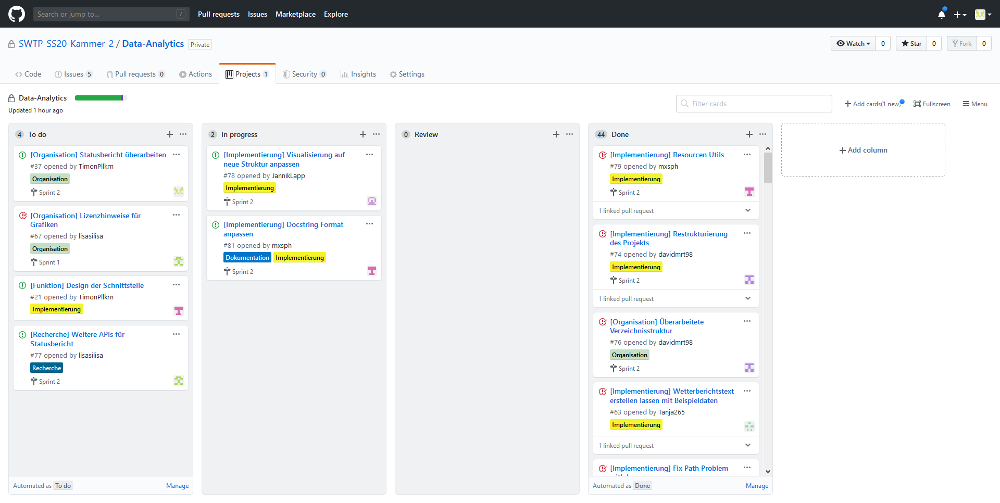
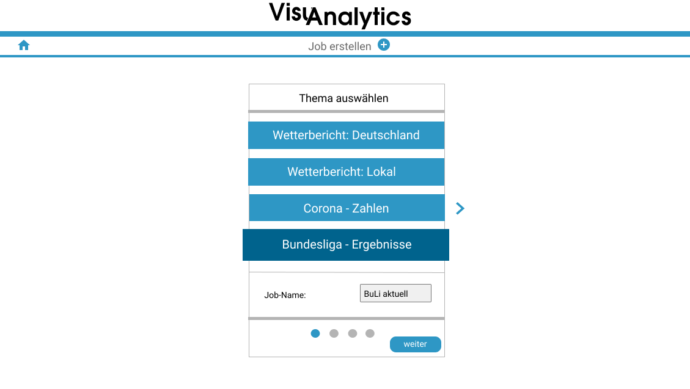
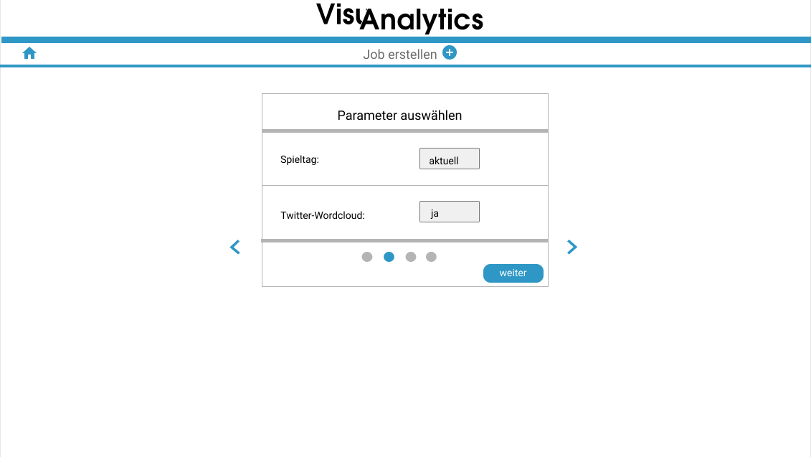
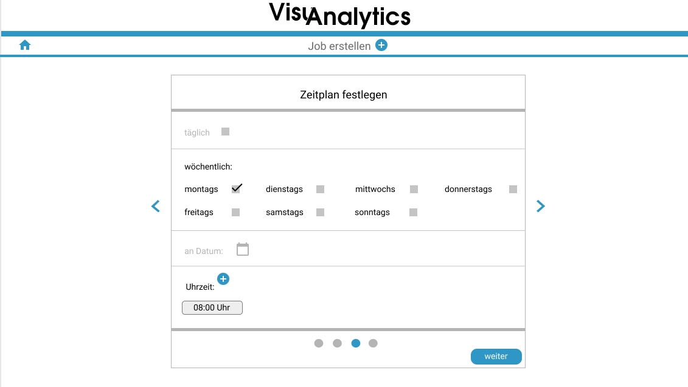
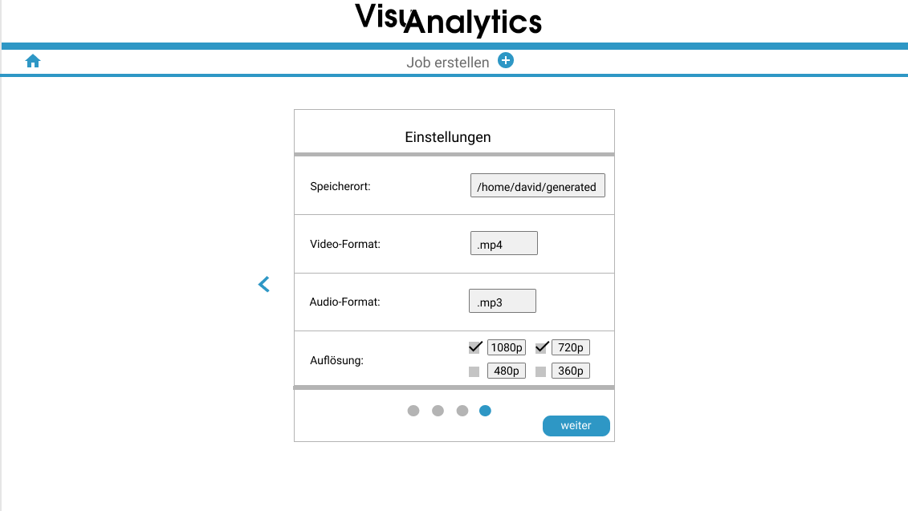
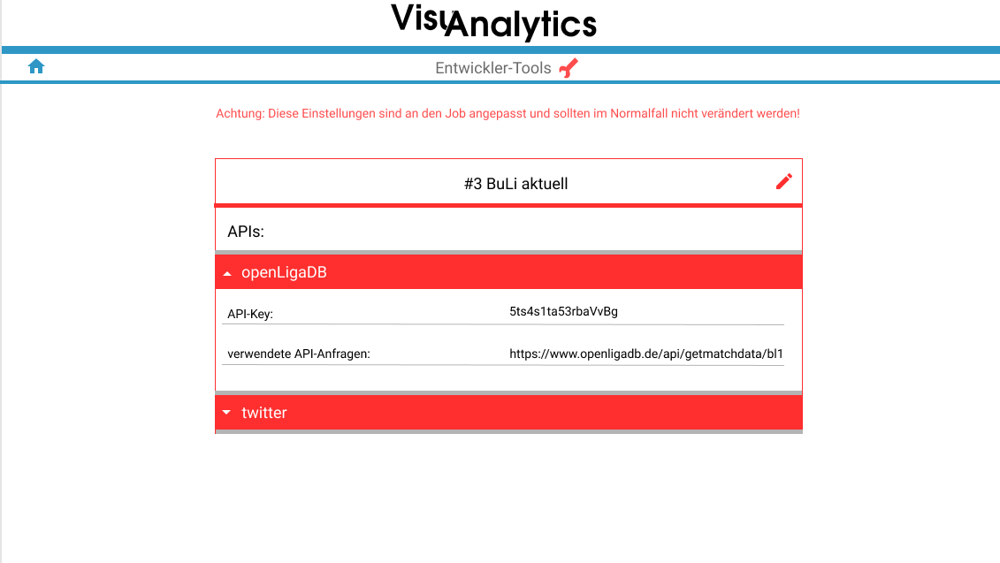
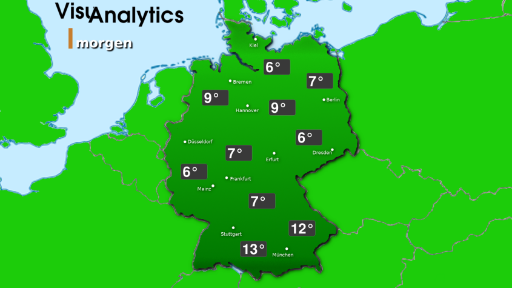
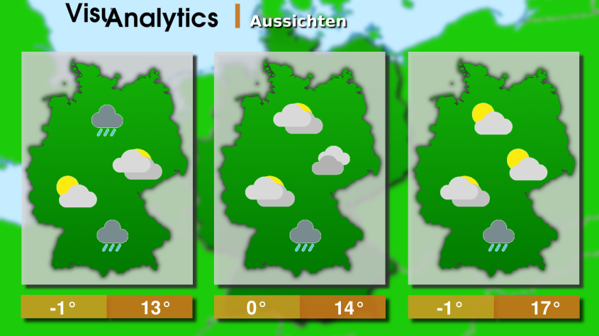
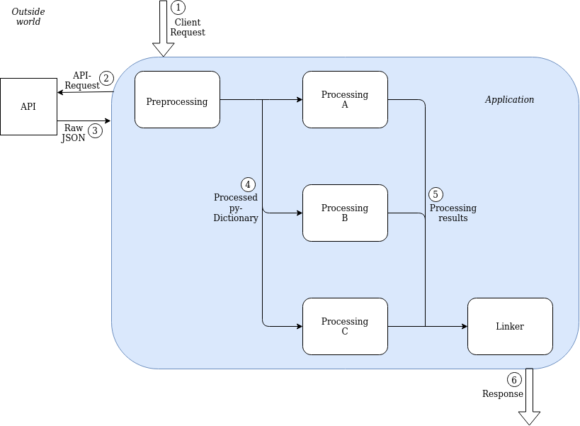

# Projektbericht <!-- omit in toc -->

## Team

### Timon Pellekoorne (Projektleiter)
**Aufgaben:**  
- Projekt strukturieren
- Berichte schreiben
- Lasten-/Pflichtenheft ausarbeiten
- Grafiken erstellen 
- Benutzeroberfläche erstellen

### Tanja Gutsche (Backend-Entwicklerin)
**Aufgaben:**  
- Konzepte erstellen für die Darstellung der verschiedenen APIs
- Strukturen für Dictionaries bzw. Listen erstellen	
- Daten visualisieren
    - Fließtexte generieren
    - Sprachausgabe generieren (gTTS)


### Jannik Lapp (Backend-Entwickler, Grafikprogrammierer)
**Aufgaben:**  
- Grafiken mit den Informationen der APIs füllen
    - Pillow
    - Wordcloud
    - Diagramme
- FFMPEG
- Linker implementieren
- Testen mit Nvidia Grafikkarte


### David Martschenko (Full-Stack-Web-Entwickler)
- Anfragen für API-Keys verschicken
- API Schnittstelle implementieren
- Enstcheiden welche API-Requests relevant sind
- Daten für die Weiterverwendung aufbereiten
- Implementierung der Benutzeroberfläche

### Max Stephan (Softwarearchitekt)
**Aufgaben:**  
- Github verwalten
    - Automatisation
    - Einstellungen
- Docker
- Scheduler
- Steps Config (Json datei)
- Projektstruktur verwalten
    - Flask-Server aufsetzen
    - ReactJS integrieren
    - Datenbank einrichten

---

## Zeitmanagement

<figure style="float: right;">
  
  <figcaption>Abbildung 1</figcaption>
</figure>

Das Projekt findet vom 23.04. – 23.08.2020 statt. 

Inspiriert von der Methode „Scrum“ wird dieser Zeitraum in einwöchige Sprints unterteilt, wobei die ersten eineinhalb Wochen die Planungsphase darstellen. 

Ab Montag dem 04.05.2020 beginnen die wöchentlichen Sprints. Dazu findet jeden Montag ein Sprint-Planning statt, in welchem alle Teammitglieder über ihre Arbeit in dem vergangenen Sprint berichten, neue Issues erstellt, und eventuelle neue Herausforderungen besprochen werden.

Hinzu kommen die wöchentlichen Meetings mit dem Auftraggeber. Da dieses Meeting mitten in einem Sprint liegt, kann der Projektleiter dem Auftraggeber eine gute Übersicht über den zuletzt abgeschlossenen Sprint, sowie eine Zwischenbilanz des aktuellen Sprints, geben.

In der „Abbildung 1“ wird die zeitliche Aufteilung des Projektzeitraums grafisch dargestellt. Die rot markierten Linien stellen besondere Termine dar:
1.	Lastenheft
2.	Pflichtenheft
3.	Zwischenpräsentation
4.	Abschlusspräsentation 

### Verwaltung der Arbeitszeiten
Um die Arbeitszeiten der Teammitglieder zu verwalten, wird eine Excel-Datei benutzt. Die Funktionen dieser werden im folgenden Text erläutert.

Die Excel-Datei besteht aus zehn Tabellenblätter. 
- Übersicht
- Sprintübersicht
- Issues
- Meeting
- Tabellenblatt für jedes Teammitglied (sechs Mitglieder)

#### Übersicht
In diesem Tabellenblatt hat man die Übersicht über das Zeitmanagement des Projektes (siehe Abbildung 1), sowie eine Übersicht über die Zeiten eines Teammitgliedes. 

Für jedes Teammitglied werden folgende Zeiten angezeigt:
- Gesamtstunden für diesen Sprint
    - Dieser Wert wird auf dem Tabellenblatt des zugehörigen Mitgliedes berechnet.
- Zielstunden für diesen Sprint
    - Für das Projekt sind 270 Stunden vorgesehen. Diese Stundenanzahl wird zu Beginn auf alle Sprints aufgeteilt. Wird nun ein Sprint angeschlossen und in der Übersicht abgehakt, so wird für die folgenden Sprints, anhand der übrigen Gesamtzeit, ein neuer Durchschnitt berechnet.

- Differenz beider Stunden
    - Diese Angabe zeigt, wie stark die Abweichung der tatsächlichen Arbeitszeit in einem Sprint, zu der Durchschnittszeit ist.

#### Sprintübersicht
Auf diesem Tabellenblatt werden die Gesamtzeiten jeder Kategorie pro Sprint angezeigt. So lässt sich gut überblicken, welchen Anteil eine Kategorie in einem Sprint hatte.
#### Issues
Auf diesem Tabellenblatt werden die Eingaben getätigt. Dazu stehen einem drei Funktionen zur Verfügung.
#### Hinzufügen
Drückt man diesen Button, so wird die Tabelle um den nächsten Sprint erweitert. Dieses geschieht auf dem Tabellenblatt „Issues“, sowie auf allen Blättern der Mitglieder. 

Die Tabelle besteht aus dem Namen eines Issues, der Dauer, sowie den Mitgliedern, welche diesen bearbeitet haben.
#### Entfernen
Wird dieser Button gedrückt so wird ein Sprint mit all seinen Issues entfernt.
#### Anwenden
Hat man einen neuen Sprint hinzugefügt, so füllt man die Tabelle nun mit den neuen Issues, deren Dauer und deren Assignee.

Sobald alle Issues übertragen sind, kann man den Button „Anwenden“ drücken, dieser kopiert die Issues in die Tabellenblätter der einzelnen Mitglieder, wenn diese als Assignee aufgeführt sind.
#### Meeting
In dieses Tabellenblatt werden alle Meetings des Teams eingetragen. Dazu wird das Datum, die Dauer und die Teilnehmer des Meetings eingetragen.
#### Mitglieder
Jedes Mitglied hat sein eigenes Tabellenblatt. Nachdem ein neuer Sprint hinzugefügt wurde und die passenden Issues kopiert wurden, werden diese Zeiten pro Kategorie und Sprint in eine Tabelle eingetragen. Da jeder Issue mit einem „tag“ ([Entwurf]) versehen ist, können die kumulierten Zeiten einer Kategorie einfach dort übernommen werden.

### Erweiterbarkeit Excel-Datei
Um die Excel-Datei für das Zeitmanagement auch für andere Projekte verwenden zu können, sollten die Mitglieder, sowie die Anzahl Sprints einstellbar sein. In der aktuellen Version der Excel-Datei ist dies noch nicht ohne Kenntnisse in VBA möglich.

Die Weiterentwicklung dieser Datei läuft parallel zu dem Projekt ab und ist unter folgendem Link zu erreichen:

https://github.com/TimonPllkrn/Project_Time_Management

---

## Versionsverwaltung: Git und Github

Um das Projekt ordentlich zu strukturieren, benutzen wir Github. Dies dient uns zum einen als Versionsverwaltung, da Git dort integriert ist, sowie auch zum managen unseres Projektes. 

Um unser Zeitmanagement in Github umzusetzen, wird in jedem Sprint-Planning ein neuer milestone mit dem Namen des Sprints (z.B. „Sprint 2“) und dem Ende des Sprints (darauffolgender Montag) angelegt. Danach werden ebenfalls im Sprint-Planning Issues gemeinsam mit allen Teammitgliedern erstellt und dem passenden milestone zugewiesen. Diese Issues werden den Teammitgliedern zugeordnet, welche sie bearbeiten sollen. 

Ist das Sprint-Planning abgeschlossen stehen alle erstellten Issues im Project Board in der Spalte „To-Do“. (siehe Abbildung 2)

<figure style="float: right;">
  
  <figcaption>Abbildung 2</figcaption>
</figure>

Wird nun ein Issue in die Spalte „In Progress“ gezogen, so wird automatisch ein Branch erstellt, welcher den Namen des zugehörigen Issues trägt. 

Hat ein Teammitglied den Issue erledigt, so zieht er diesen in die Spalte „Review“. Nun wird automatisch ein Pull Request erstellt. Ebenfalls werden alle Unit-Tests, die Github finden kann automatisch ausgeführt. Verlaufen diese fehlerfrei, so wird dieses dem Entwickler angezeigt. 

Die Pull Request wird dann einem anderen Teammitglied zum reviewen zugeteilt. Diese überprüft noch einmal manuell den Code. Wenn alles in Ordnung ist, wird der Code gemerged, also dem Hauptcode hinzugefügt.

Link zum Repository: https://github.com/SWTP-SS20-Kammer-2/Data-Analytics 

### Github Automatisation

#### Project Board
Um das Arbeiten mit dem Project Board einfacher zu gestalten, wurden in Github „Actions“ erstellt, welche die Funktionen des Boards erweitern.

_Issue Branch erstellen_

Wird ein Issue in die Spalte „In progress“ gezogen, wird automatisch ein neuer Branch erstellt.

Der Name des Branches ist wie folgt aufgebaut:  
`i[issueNummer]-[issueName] (z.B. i1-test)`

_Pull Request erstellen_

Wird ein Issue in die Spalte „Review“ gezogen, wird automatisch ein „Pull Request“ erstellt. Dieser beinhaltet die Nachricht resolves #[issueNummer], somit wird beim mergen der Issue automatisch geschlossen.
##### Einrichtung

_Projekt hinzufügen_

- Neues Projekt erstellen
    - Template „Basic kanban“
- Projekt einrichten
    - Neue Spalte mit dem Namen „Review“ erstellen und zwischen die Spalten „In Progress“ und „Done“ einordnen.
    - Die Column ID von „In Progress“ und „Review“ kopieren

Zusätzlich kann auch die Github interne Automatisation für „TODO“ und „Done“ verwendet werden.

- „TODO“ (manage automatisation)
    - Preset: „TODO“
    - „Move Issues here when…“
      - Newly added
      - Reopened
- „Done“ (manage automatisation)
    - Preset: „Done“
    - „Move Issues here when…“
      - Closed

_Github Action erstellen_

Im Repository auf den Reiter „Actions“ klicken:
1.	„new workflow“ -> „set up a workflow yourself“
2.	Inhalt durch eigenes Script ersetzen
3.	Namen festlegen
4.	den Wert von column_id durch die ID der TODO-Spalte ersetzen
5.	den Wert von column_id durch die ID der Review-Spalte ersetzen
6.	„Start commit“ klicken, um die Datei zu comitten

Die Datei muss im master(default) branch liegen.

_Github App erstellen_

Um mit dieser Action auch andere Actions auslösen zu können, muss eine Github App erstellt werden, die dann zur Authentifizierung verwendet wird. 
1.	Github App erstellen (siehe hier)
2.	App Berechtigungen einstellen:
    - Contents: read & write
    - Issues: read & write
    - Metadata: read-only
    - Pull request: read & write
    - Projects: read-only
3.	App zum Repository hinzufügen (siehe hier)
4.	Secrets anlegen  
Es müssen zwei Secrets für das Repository angelegt werden:
    1.	Name: APP_ID
Value: ID der App (zu finden in den App Einstellungen unter „General“)
    2.	Name: APP_DEM
Value: Private Key der App (wird in den Einstallungen unter „General“ erstellt)
##### Funktionsweise
Um, wie in der Einrichtung beschrieben, eine Github App für die Authentifikation verwenden zu können, wird die Action „tibdex/github-app-token@v1.0.2“ aus dem Github Marketplace verwendet. Diese generiert den Authentifizierungsschlüssel aus der App ID und dem Private Key der App.

Im nächsten Schritt werden mithilfe der Github Action „actions/github-script@0.9.0“ Github APi Anfragen gemacht. Dieser App wird ein Script (geschrieben in Java Script) übergeben, welches dann von der App ausgeführt wird. Die Github Abfragen sind in diesem Script ganz einfach möglich, man verwendet einfach die vordefinierte Variable github und context. z.B.:

~~~js
// Create branch

github.git.createRef({
  owner: context.repo.owner,
  repo: context.repo.repo,
  ref: `refs/heads/${branchName}`,
  sha: mSha.data.object.sha,
});
~~~

Eine Dokumentation aller möglichen API Abfragen finden Sie [hier](https://octokit.github.io/rest.js/v17).

Um den Namen des Repository, des Owners etc. herauszufinden, stellt die Action die Variable „context“ bereit. Mit dieser hat man auf verschiedene Informationen Zugriff.

##### Einschränkungen

- Benennt man ein Issue um deren Branch es schon gibt, so kann kein Pull request mehr erstellt werden, da der Branch nicht mehr gefunden wird.
- Durch einen Fehler von GitHub werden die verlinkten Issues bei einem Pull request erst nach dem Mergen, oder wenn jemand ein Kommentar schreibt, richtig angezeigt.
- Wenn der Branch keine Änderungen zum Master Branch enthält, kann kein Pull request erstellt werden.
- Im Projekt Board sollten keine Pull requests hinzugefügt werden, da diese in Github nur eine Unterkategorie von Issues sind, kann die Action nicht zwischen ihnen unterscheiden und würde für die Pull requests auch Branches usw. erstellen.

#### Automatisierte Tests
Bei einem Pull request werden automatisierte Tests durchgeführt.
##### Einrichtung
_Docker Dateien erstellen:_
- Dockerfile für Projekt erstellen (siehe hier)
- Docker Test Datei erstellen: docker-compose.test.yml (im gleichen Ordner wie das Dockerfile)
- Datei mit folgendem Inhalt ausfüllen:

```Docker
sut:
    build: .
    working_dir: dir // Workdir des Dockercontainers
    command: test // Command der die Tests auführt
```

_Github Action erstellen:_

Im Repository auf den Reiter „Actions“ klicken:
1.	„new workflow“ -> „set up a workflow yourself“
2.	Inhalt durch Script ersetzen
3.	Namen festlegen
4.	In zeile 18 & 19 pfad hinter --file anpassen
5.	Start commit klicken & Datei Commiten

##### Funktionsweiße

Nachdem die Action das Repository ausgecheckt hat, wird zuerst der Docker Container erstellt und danach wird die Datei „docker-compose.test.yml“ verwendet, um die Tests auszuführen.

---

## Entwicklungsumgebung	
Für die Entwicklung des Programmes nutzen wir zwei Entwicklungsumgebungen von „JetBrains“.  
- Entwicklung der Logik in Python: PyCharm.
- Entwicklung des User-Interfaces: WebStorm.

---

## Lastenheft
### Zielbestimmung
Das Programm soll verschiedene Informationen aus dem Internet erfassen und diese automatisiert zu einem Informationsvideo verarbeiten. Dieses Informationsvideo, soll anhand von Grafiken, Diagrammen, Wordclouds o.Ä. die Informationen dem Benutzer übersichtlich und verständlich präsentieren.

Dafür sollen dem Benutzer verschiedene Themen zur Verfügung stehen, aus denen ein Video generiert werden kann:

**Beispiele:**
- Wetter
    - Wettervorhersage für den aktuellen, den folgenden und die darauffolgenden Tage zusammengefasst in einem übersichtlichen Video.
- Corona-Daten
    - Zahl der Infizierten, Genesenen und Toten welt- und deutschlandweit
- Historische Ereignisse
    - Ereignisse zu dem aktuellen Tag vor beliebig vielen Jahren.
- Sport
	- Ergebnisse aus z.B. der Bundesliga zusammengetragen.
- Finanzen
	- Börsenkurse, sowie Gewinner und Verlierer einer Region darstellen
#### Must-Have/Nice-to-Have/If-Time-Allows
##### Must-Have
- Das Programm besitzt die Auswahl aus vier Themenbereichen:
	- Wetter, Corona, Historische Ereignisse, Fußball-Bundesliga
- Diese Themen sollen als Video, mithilfe von Grafiken, Diagrammen etc. dargestellt und mit einer Audiospur, welche die dargestellten Informationen erläutern, unterlegt werden.
- Das Programm soll in die Website https://biebertal.mach-mit.tv/ integriert werden.
- Das Programm soll dem Administrator der Website die Möglichkeit geben, die Videos in bestimmten Zyklen generieren und diese auf seiner Website ausgeben zu lassen. 
##### Nice-to-Have
- Die Einbindung des Programmes in die Website per Wordpress-Plugin realisieren.
- Es besteht die Möglichkeit, Videos zu generieren, welche die Daten aus mehreren Themenbereichen zusammenführt.
- Den Themenbereich Finanzen dem Programm hinzufügen
<figure style="float: right;">
  
  <figcaption>Abbildung 3</figcaption>
</figure> 

- Zu den Themenbereiche Sport und Corona sollen Wordclouds mithilfe von Twitter generiert werden, welche die Stimmung zum jeweiligen Thema einfängt.
(Beispiel: Abbildung 3)
- Docker Image bereitstellen
##### If-Time-Allows
- Die Videos auch auf Englisch bereitstellen.


### Produkteinsatz
Das Produkt soll dem Betreiber der Internetseite https://biebertal.mach-mit.tv/ zur Verfügung stehen. Auf die dort generierten Videos soll jeder öffentlich zugreifen können.

Eine genaue Zielgruppe wird bei der Herstellung nicht berücksichtigt, die Themengebiete werden nach Interesse der breiten Masse ausgesucht.
### Produktübersicht
#### Benutzeroberfläche/Funktion
##### Übersicht
Zu Beginn des Programms befindet sich der Benutzer auf der Übersichtsseite. Dort hat er eine Übersicht über seine angelegten Jobs. Durch das klicken auf den Job Namen, werden die dazugehörigen Informationen ausgeklappt. Ein Job besteht aus:
1.	Einer einzigartigen ID (z.B. #1)
2.	Einem zugeordneten Thema 
3.	Dem Zeitpunkt wann das Video neu generiert wird
4.	Der Zeit bis zum nächsten neu generierten Video
5.	Besonderen Einstellungen, je nach ausgewähltem Thema

Der Benutzer kann auf dieser Seite einen neuen Job anlegen (1), bearbeiten (2), oder die Einstellungen (3) zu einem Job aufrufen.

<figure>
  
  <figcaption>Abbildung 4</figcaption>
</figure> 

##### Job anlegen
Möchte der Benutzer einen Job anlegen, so gelangt er zuerst zu der Themenauswahl. Dort werden ihm alle Themen, die zur Auswahl stehen, angezeigt. Außerdem kann er ebenfalls auf dieser Seite den Namen des Jobs festlegen.

<figure>
  
  <figcaption>Abbildung 5</figcaption>
</figure> 

Hat sich der Benutzer für ein Thema entschieden (in diesem Beispiel „Bundesliga - Ergebnisse“), so kommt er als nächstes zu der Parameterauswahl. Die dort zur Auswahl stehenden Parameter sind an das vorher ausgewählte Thema angepasst. Diese Seite sieht je nach Thema unterschiedlich aus. (hier beispielhaft für das Thema „Bundesliga – Ergebnisse“).

<figure>
  
  <figcaption>Abbildung 6</figcaption>
</figure> 

Danach kann der Benutzer den Zeitplan des Jobs festlegen. Hier hat der Benutzer zunächst drei Möglichkeiten. 

_Täglich:_  
wählt er diesen Punkt, so wird das Video täglich generiert.   
_Wöchentlich:_  
hier kann der Benutzer aus allen sieben Wochentagen auswählen, an denen dann wöchentlich das Video generiert wird.  
_Datum:_  
hier kann der Benutzer ein genaues Datum auswählen, an welchem ein Video generiert wird  

Als letztes kann er noch zusätzlich zu einer der drei Auswahlmöglichkeiten Uhrzeiten festlegen, zu welchen das Video neu generiert werden soll.

<figure>
  
  <figcaption>Abbildung 7</figcaption>
</figure> 

Abschließend kann der Benutzer noch Einstellungen zu dem Video vornehmen.

Dort kann er den Speicherort und die Auflösung des Videos festlegen, sowie das Format des Videos und der Audiodatei. Diese Einstellungen kann der Benutzer auch im Nachhinein noch ändern

<figure>
  
  <figcaption>Abbildung 8</figcaption>
</figure> 

##### Entwicklertools
Zusätzlich zu den „normalen“ Einstellungen eines Jobs, soll es dem Benutzer auch noch möglich sein, Entwicklertools zu aktivieren. Dort kann dieser dann spezifischere Änderungen vornehmen.

<figure>
  
  <figcaption>Abbildung 9</figcaption>
</figure> 

#### Ausgabe (Beispiel Wetterbericht)
Aus dem Internet sollen die aktuellen Wetterdaten erfasst werden, diese zu Text und Grafiken verarbeitet werden. Aus diesen Ergebnissen soll ein Video erstellt werden, welches einen Wetterbericht für den nächsten Tag und die darauffolgenden drei Tage darstellt

<figure>
  
  
  
  <figcaption>Abbildung 10</figcaption>
</figure> 

### Qualitätsanforderungen
Das Produkt soll ohne großen Aufwand um weitere Funktion, vor allem aber um weitere Schnittstellen erweiterbar sein. 

Das aktuelle Video, welches auf der Website dargestellt wird, soll zu erst dann durch ein neues ersetzt werden, wenn dieses schon fertig generiert wurde. Somit soll sichergestellt werden, dass zu jeder Zeit ein Video dem Besucher zur Verfügung steht

Die Ausführung des Programms soll keine Auswirkung auf die Stabilität der Website haben.
 
### Quellen/Lizenzen
- https://de.wikipedia.org/wiki/Vorlage:Positionskarte_Europa
(GNU-Lizenz für freie Dokumentation)  
- https://commons.wikimedia.org/wiki/File:Karte_Deutschland.svg
(Attribution-Share Alike 2.0 Germany)  
- Wetter-Icons: https://www.weatherbit.io/api 
(Wetter-Icons werden durch die kostenlose API mitgeliefert)

---

## Pflichtenheft
### Zielbestimmung
- Das Programm soll mithilfe von APIs Informationen zu einem, vom Benutzer ausgewähltem Thema, bereitstellen. 
- Anhand dieser Informationen sollen Grafiken erstellt werden, welche diese Informationen veranschaulichen. Ebenfalls soll aus den gewonnenen Informationen ein Fließtext generiert werden, welcher die Informationen erläutert. Aus diesem Text soll dann eine Audio-Datei generiert werden.
- Abschließend sollen die Grafiken sowie die Audio-Datei zu einem Video zusammengefügt werden

Die technische Umsetzung der einzelnen Bestimmungen finden Sie unter hier.
### Benutzerschnittstellen
Das Produkt ist Betriebssystemunabhängig. Der Zugriff auf das Programm erfolgt über einen Browser. Dort kann das Programm als Plugin der gewünschten Website hinzugefügt und verwendet werden.

Die GUI über die der Benutzer seine Eingaben tätigen kann, wird Mithilfe von „React“ und „Material-UI“ erstellt.

Für die Kommunikation zwischen dem Client und dem Server, wird das Python basierte Web-Framework „Flask“ benutzt.
### Funktionale Anforderungen
Um die funktionalen Anforderungen des Programmes zu verdeutlichen, ist unser Programm folgedermaßen strukturiert:

<figure>
  
  <figcaption>Abbildung 11</figcaption>
</figure> 

1.	Der Client schickt eine Anfrage an das Programm.
2.	Das Programm schickt eine Anfrage über die Schnittstelle an die gewünschte API.
3.	Die Antwort der API landet im „Preprocessing“. Dort werten die Daten aufbereitet, so dass jeder Prozess einheitlich darauf zugreifen kann. In unserem Fall ist dies ein Python Dictionary.
4.	Die einzelnen „Processing“ Stationen entnehmen die Daten dem Dictionary und verarbeiten diese (z.B. Diagramme erstellen). 
5.	Die daraus resultierenden Daten werden im „Linker“ zu einem Endergebnis zusammengefügt (z.B. Video)

### Technische Umsetzung
#### API
##### Wetter
Anhand der Werte welche wir aus der https://www.weatherbit.io/api API beziehen, soll ein Wetterbericht als Video erstellt werden. Solch ein Bericht kann folgende Informationen beinhalten:
- Wetter heute
- Wettervorhersage für morgen und die darauffolgenden drei Tage
- aktuelle Luftqualität für vorausgewählte Städte in Deutschland

**Technische Details**

|                                        |        Free        |      Starter       |     Developer      |      Advanced      |
| -------------------------------------- | :----------------: | :----------------: | :----------------: | :----------------: |
| **Preis**                              |      $0/Monat      |     $35/Monat      |     $160/Monat     |     $470/Monat     |
| **Anfragen pro Tag**                   |        500         |       50.000       |      500.000       |    5 Millionen     |
| **Anfragen pro Tag (historische API)** |        :x:         |        :x:         |       25.000       |      250.000       |
| **Zugang historische API**             |        :x:         |        :x:         |       1 Jahr       |      10 Jahre      |
| **aktuelles Wetter**                   | :heavy_check_mark: | :heavy_check_mark: | :heavy_check_mark: | :heavy_check_mark: |
| **16-Tage Vorhersage**                 | :heavy_check_mark: | :heavy_check_mark: | :heavy_check_mark: | :heavy_check_mark: |
| **2 Tage (stündlich) Vorhersage**      |        :x:         | :heavy_check_mark: | :heavy_check_mark: | :heavy_check_mark: |
| **5 Tage (stündlich) Vorhersage**      |        :x:         |        :x:         |        :x:         | :heavy_check_mark: |
| **kommerzielle Nutzung**               |        :x:         | :heavy_check_mark: | :heavy_check_mark: | :heavy_check_mark: |

Quelle: https://www.weatherbit.io/pricing 

##### Corona 
Das Programm soll die aktuellen Daten zur Corona Pandemie ausgeben. Dazu wird die  https://covid19api.com/ API verwendet. Diese liefert die aktuelle Corona Statistiken weltweit und für Deutschland.

**Technische Details:**  
- Daten werden mehrfach täglich aktualisiert
- Die Verwendung der API ist komplett frei
- Antworten kommen im JSON-Format

##### Historische Ereignisse
Das Programm soll eine Wordcloud zu historischen Daten ausgeben, in der die wichtigsten Themen den größten Anteil haben.

Als Schnittstelle dafür verwenden wir die http://developer.zeit.de/index/ API. Diese enthält gesamtes Archiv der ZEIT bzw. ZEIT ONLINE.

**Technische Details:**
- Öffentliche BETA-Version
- Inhalte des ZEIT Archivs seit 1946
- Nur für nicht-kommerzielle Nutzung
- Keine Volltextübernahme der Artikel
##### Bundesliga
https://www.openligadb.de/ 

Es sollen die Ergebnisse der Bundesliga für einen Spieltag visuell dargestellt werden.

**Technische Details:**  
- Kostenloses Community-Projekt
- Antworten kommen im JSON-Format
##### Finanzen
https://rapidapi.com/apidojo/api/yahoo-finance1 

- Zusammenfassung zum angefragten Zeitpunkt
- Gewinner / Verlierer in einer bestimmten Region
z.B. Day Gainers - US, Day Losers - US, Most Actives - US
- Daten, um Diagramme zu bestimmten Akteuren zu erstellen
- Gewinne in einer bestimmten Region in einem eingegrenzten Zeitraum

**Technische Details:**
- Unterstützt 175 Länder

|                        |                        |                        |                        |                        |
| ---------------------- | :--------------------: | :--------------------: | :--------------------: | :--------------------: |
| **Preis**              |      €0.00/Monat       |      €9.00/Monat       |      €27.01/Monat      |     €270.11/Monat      |
| **Anfragen pro Monat** |          500           |         10.000         |         50.000         |       Unlimited        |
| **Rate Limit**         | 5 Anfragen pro Sekunde | 5 Anfragen pro Sekunde | 5 Anfragen pro Sekunde | 5 Anfragen pro Sekunde |

Quelle: https://rapidapi.com/apidojo/api/yahoo-finance1/pricing 

#### Preprocessing
Die durch die API gewonnenen Daten, werden zuerst nach den Informationen gefiltert, welche für das Programm wichtig sind. Diese werden dann, in evtl. vereinfachter Struktur, in ein Dictionary geschrieben, so dass im Programm intern, das Dictionary zur Datenverarbeitung genutzt wird.
#### Processing
Textgenerierung
Die Daten aus dem im Preprocessing angelegtem Dictionary, werde nun ebenfalls in ein Dictionary angelegt, wobei zu jeder einzelnen Information mehrere Satzbausteine gespeichert werden. So kann anhand der gewonnenen Informationen, ein zufällig generierter Text entstehen.

Um aus diesem generierten Text eine mp3-Datei zu erzeugen, benutzen wir die Python-Bibliothek „gTTS“.

Einen Vergleich zwischen „gTTS“ und „pico2wave“ finden Sie hier.

#### Datenvisualisierung
Um die Daten grafisch darzustellen, wird die Python-Bibliothek „Pillow“ zur Bildbearbeitung genutzt. Auf eine vorgefertigte Grafik (z.B. leere Deutschlandkarte), können mithilfe von Pillow, die aus der API gewonnenen Daten, eingetragen werden. 

Um die Daten als Diagramm zu visualisieren, wird NumPy und Matplotlib benutzt. Des Weiteren kann auch Basemap eingesetzt werden, um Verteilungen anhand einer Karte darzustellen.

Für die Erstellung der Wordcloud wird die Python-Bibliothek „wordcloud“ verwendet. Diese wird hauptsächlich verwendet, um die Daten der Twitter API zu visualisieren.
#### Linker
Um am Ende alle Grafiken, Diagramme etc. zu einem Video zusammenzufügen, benutzen wir das Tool „FFMPEG“. Dieses Tool bietet die Möglichkeit, Bilder aneinander zu schneiden und mit einer Audiodatei zu unterlegen. 

Dabei können folgende Einstellungen variabel gehalten werden:
- Länge der angezeigten Bilder (z.B. an die Länge der Audio-Datei anpassen)
- Videoauflösung
- Video- /Audioformat
- Speicherort des Videos

 
### Vergleich von gTTS mit pico2wave
#### Allgemeiner Vergleich:
- gTTS: Python-Library und Kommandozeilentool, wobei die API von Google Translate verwendet wird
- pico2wave: Kommandozeilentool für Linux/Unix-User, welches von dem Unternehmen SVOX bereitgestellt wird
#### Vergleich mögliche Sprachen:
- gTTS: 78 verschiedene Sprachen, darunter 14 Mal Englisch (z.B. Englisch (Australia) oder Englisch (Ghana)), 3 Mal Spanisch, Deutsch und Sprachen wie Tschechisch oder Japanisch
- pico2wave: Deutsch, Englisch/Amerikanisch, Italienisch, Französisch und Spanisch
#### Vergleich Audioformate:
- gTTS: wav-Datei, mp3-Datei
- pico2wave: wav-Datei
#### Vorteile gTTS:
- eine Python-Library, die man direkt einbinden kann, sodass man die Funktionen des Moduls verwenden kann
- einfaches Erstellen der Audiodateien (Dreizeiler)
- viele verschiedene Einstellungen möglich: unterschiedliche Sprachen (lang='de'); Sprechgeschwindigkeit (slow=False oder slow=True); Sprachüberprüfung (lang_check=True); Modul, um Text vorzuverarbeiten, um somit Aussprache zu optimieren (gtts.tokenizer mit den Funktionen pre_processor_func und tokenizer_func)
- verschiedene Fehlermeldungen, die abgefangen werden können (AssertionError, ValueError, RuntimeError)
- einzelne Wörter werden richtig und gut betont
- deutliche Aussprache
- gute Audioqualität
- intellektuelle (arrogante) Stimme, so wie unser Programm
#### Nachteile gTTS:
- teilweise unnatürlicher, stockender Redefluss
#### Vorteile pico2wave:
- sehr kompaktes, einfach zu bedienendes Kommandozeilenprogramm
- guter Redefluss
#### Nachteile pico2wave:
- keine direkte Python-Library, man müsste ein Skript schreiben, um es einzubinden
- bringt keine weiteren Einstellungsmöglichkeiten/ Funktionen mit sich
- Aussprache manchmal etwas monoton, kaum Betonungen
 
#### Begründung Entscheidung für gTTS:
Wir haben uns nach einem genaueren Vergleich der beiden TTS-Programme gTTS und pico2wave für das Programm gTTS entschieden. Dieses ließ sich einfach als Python-Library einbinden, sodass wir es direkt verwenden konnten. Ebenso fanden wir es gut, dass die Bibliothek eine umfangreiche Funktionalität aufweist. So lassen sich viele Kleinigkeiten optimal für unsere Zwecke anpassen. Außerdem haben uns im Großen und Ganzen die erzeugten Audiodateien von der Aussprache, der Betonung und der generellen Audioqualität besser gefallen.
### Besondere Herausforderungen
- Programm für Produktionsbetrieb absichern, und zuverlässig machen
- Kompatibilität mit verschiedenen Betriebssystemen
- Verständliche- und einfach zu bedienendes User Interface
- Speicherung von Secrets (z.B.: APi-keys)
- Umgang mit auftretenden Programmfehlern
- API-Daten sinnvoll zusammenbauen (individuell auf verschiedene Daten reagieren)
- Gute Sprachausgabe (Komische Aussprache durch verschiedene Formulierungen vermeiden)
### Nichtfunktionale Anforderungen
Das Programm soll um weitere Schnittstellen einfach erweiterbar sein, dazu muss die Schnittstelle so designt sein, dass das Hinzufügen einer weiteren ohne großen Aufwand von statten geht.
### Abnahmekriterien
Das Programm muss fehlerfreie Ausgaben zu den zur Auswahl stehenden Themen liefern. 
