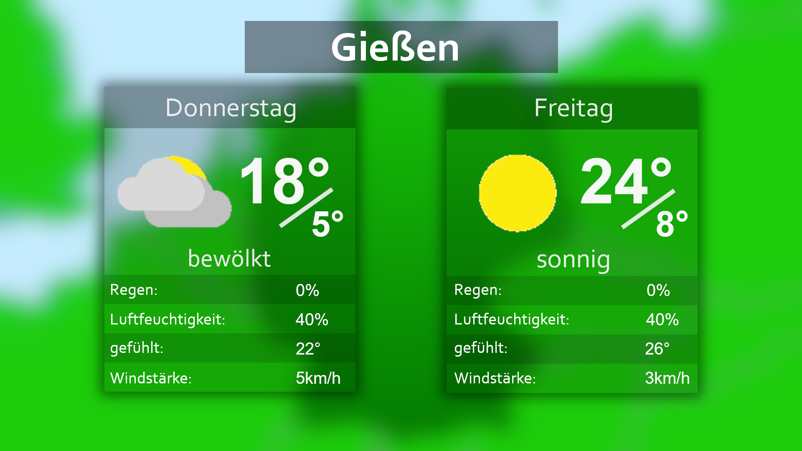
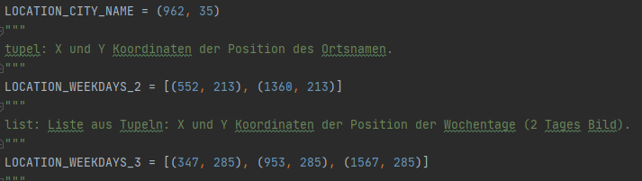
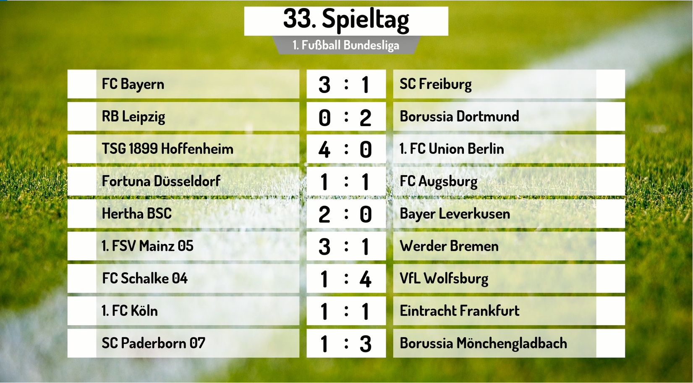
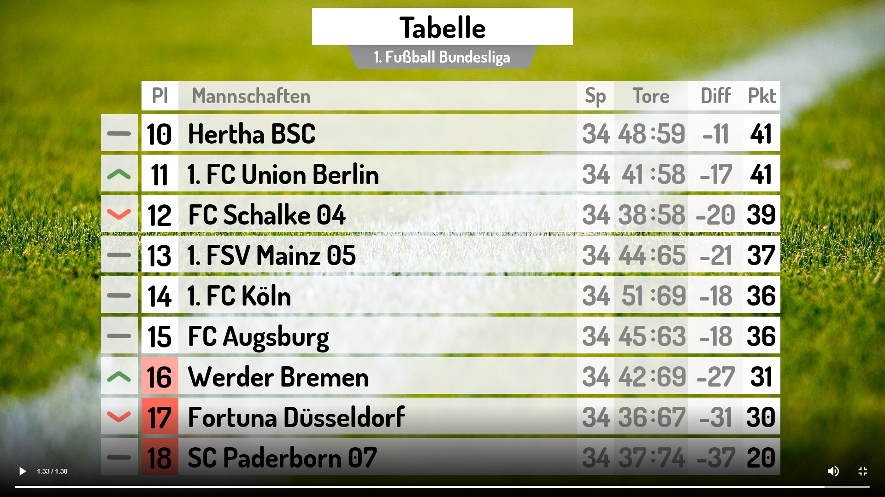

# Statusberichte <!-- omit in toc -->

## Statusbericht 05.05.2020 (Planung)
### Zusammenfassung
Das Ziel der Planungsphase war es, das Projekt zu strukturieren. Dies bedeutete konkret:
- **Zeitmanagement ausarbeiten**  
Dazu wurde der vorgegebene Zeitraum so aufgeteilt, dass ein möglichst effektives Arbeiten ermöglicht wird. Die genauere Erläuterung dieser Struktur finden sie hier.
- **Festlegen der einzusetzenden Technologien**  
Jedes Teammitglied hat recherchiert, welche Technologien für dieses Projekt zum Einsatz kommen könnten und wie diese zu Verwenden sind. Bei einem Meeting wurden diese dann dem restlichen Team vorgestellt und sich auf einige festgelegt. Welche Technologien sin diesem Projekt verwendet werden, finden sie in dem Pflichtenheft. 
- **Lastenheft erstellen**  
Das Lastenheft fasst die Anforderungen an das Programm zusammen. Dazu haben wir ein grobes Konzept erstellt, welches einen Überblick über die Funktionen des Programmes darstellen soll. (zum Lastenheft)
### Ziel für Sprint 1
Das Ziel für den Sprint 1 ist es, die Ergebnisse aus der Planungsphase so aufzubereiten, dass die Implementierung beginnen kann.
- Verzeichnisstruktur des Programmcodes erstellen
- Einen Style Code erstellen, um einheitlich zu arbeiten
- Vorgaben für Tests herausarbeiten

---

## Statusbericht 12.05.2020 (Sprint 1)
### Zusammenfassung
Die Ziele, die für diesen Sprint gesetzt wurden, wurden vom Team schon nach paar Tagen erreicht. So konnte schon in diesem Sprint mit der Implementierung begonnen werden. 

Um mit der Implementierung zu beginnen, wird zuerst die Wetter API benutzt, um anhand dieser, einen kompletten durchlauf des Programmes umzusetzen.

Außerdem wurde sich mit den Lizenzen beschäftigt, um Wetter Icons oder andere Grafiken legal nutzen zu können.

### Aktueller Stand der Implementierung
- Die Grundstruktur des Servers ist aufgesetzt.
- Die Wetterdaten der API werden ausgelesen und in einem „Dictionary“ abgelegt.
- „Lückentexte“ erstellt, um die Daten aus der API in diese einzufügen und einen Fließtext daraus zu bekommen. Mithilfe eines „Dictionary“ Mehrere Sätze pro Stadt oder ähnlichem angelegt, um variable Texte zu generieren.
- Wetterdaten sowie Icons der API über die erstellten Grafiken legen, um daraus ein Video zusammen zu schneiden.

---

## Statusbericht 19.05.2020 (Sprint 2)

### Zusammenfassung
Das übergeordnete Ziel für den zweiten Sprint war, einen korrekten Wetterbericht generieren zu lassen. Dieser sollte für den aktuellen Tag und den folgenden Tag einen detailreicheren Wetterbericht, sowie für die darauffolgenden drei Tage einen gröberen Wetterbericht visualisieren. 

Ebenfalls sollte in diesem Sprint das Mock-up konkretisiert werden, so dass der Auftraggeber eine genaue Vorstellung des Programms hat.

Die Vorgegebenen Ziele wurden vom Team erreicht.

**Ergebnis Wetterbericht:**  
**Heute/Morgen** 

**3-Tage**

### Aktueller Stand der Implementierung

- Kontroll-Modul erstellt, um die gewünschten Methoden auszuführen und das Video zu generieren.
- Sprachtexte so angepasst, dass diese besser zu den Angezeigten Grafiken passen.
- Für jedes Modul Unit-Tests implementiert.
- Wetterbericht vervollständigt.

---

## Statusbericht 26.05.2020 (Sprint 3)
### Zusammenfassung
In diesem Sprint war das Ziel den Wetterbericht weiter auszubauen und zu verbessern.

Dazu wurde zusätzlich zu dem deutschlandweiten Wetterbericht, auch ein ortsbezogener Wetterbericht implementiert.

Es wurden die Texte und Grafiken überarbeitet, sowie dem Output-Video Übergänge hinzugefügt.

Auch wurde sich mit der Zeit-API auseinandergesetzt (Wie kommt man an die relevanten Daten und wie wollen wir diese visualisieren), um im nächsten Sprint mir der Implementierung dieser zu beginnen.

### Aktueller Stand der Implementierung
- Es kann ein deutschlandweiter und ein ortsbezogener Wetterbericht als Video generiert werden.

### Ziel für den nächsten Sprint
- Wetterbericht abschließen
- Zeit-API implementieren
- Implementierung der Benutzeroberfläche mit „React“ und „Material-UI“ beginnen

---

## Statusbericht 02.06.2020 (Sprint 4)
### Zusammenfassung
In diesem Sprint wurde die Implementierung des Wetterberichtes abgeschlossen. Dazu wurden noch Verbesserungen an den Grafiken und Texten vorgenommen.

Des Weiteren wurde mit der Implementierung der „ZEIT“ API begonnen. Das Ziel dieser Implementierung soll es sein, Wordclouds zu jedem Monat in einem bestimmten Zeitraum zu generieren, um die Veränderung dieser Wordclous über diese Monate darzustellen.

Auch die Implementierung der Benutzeroberfläche wurde begonnen. Hierzu wurden die benötigten Komponenten in React implementiert.

### Aktueller Stand der Implementierung
- React Komponenten erstellt:
    - Header
    - Job-Liste
    - Themenauswahl und Parameterauswahl
- Wordclouds aus ZEIT Artikeln für einen bestimmten Zeitraum erstellen

### Ziel für den nächsten Sprint
- Docker File updaten
- Erstes Video aus der „ZEIT“ API generieren
- Benutzeroberfläche ausbauen

---

## Statusbericht 09.06.2020 (Sprint 5)
### Zusammenfassung
In diesem Sprint lag der Fokus auf der Fertigstellung des Dockercontainers und somit des ersten Release (Release 0.1.0). Dieser wurde erfolgreich fertiggestellt und steht in dem Repository:

https://github.com/SWTP-SS20-Kammer-2/Data-Analytics

zur Verfügung. Eine genaue Erläuterung, wie dieser zu verwenden ist, ist der Datei „Bericht_Data-Analytics“ zu entnehmen.

Des Weiteren wurde in diesem Sprint ein neuer interner Aufbau des Programmes besprochen und mit der Implementierung begonnen. Es werden nun alle variablen Daten, welche für jede API benötigt werden, in einer vordefinierten JSON-Datei angelegt. Das Programm liest diese Informationen aus und kann anhand dieser, die Texte, Grafiken und Videos erstellen.

**Beispiel (Bildbearbeitung):**

***Vorher:***  
Die Bilder und Icons wurden im Python-Code auf die richtigen Koordinaten im Video gelegt.

***Nachher:***  
Für jedes Bild wird in der JSON-Datei die nötigen Konfigurationen angegeben. Die dort einzugebenden Parameter gelten für jedes Bild, unabhängig davon, zu welcher API es generiert werden soll.

---

## Statusbericht 16.06.2020 (Sprint 6)
### Zusammenfassung
Ziel dieses Sprints war es, das Programm so umzuschreiben, dass die beiden Wetterberichte, welche mit der alten Struktur generiert werden konnten, nun auch mit der neuen funktionieren, damit diese Funktion präsentiert werden kann. Dazu war es einer genauen Planung des Aufbaus der JSON-Datei notwendig.

Ebenfalls würde die Oberfläche so weit fertiggestellt, dass eine Demo-Präsentation möglich ist.

Das Programm wurde in diesem Sprint, so weiterentwickelt, dass alle Funktionen und Strukturen, welche es benötigt, um einen Überblick über das Programm zu bekommen, präsentiert werden können.

### Aktueller Stand der Implementierung
- Anhand der JSON-Datei lässt sich der ortsbezogene Wetterbericht fehlerfrei erstellen
- Das Design der Benutzeroberfläche ist fertig implementiert

### Ziel für den nächsten Sprint
- Deutschlandweiten Wetterbericht mithilfe der JSON-Datei erstellen
- Neue APIs anhand der JSON-Datei einfügen
- Kommunikation zwischen Client und Server herstellen

---

## Statusbericht 23.06.2020 (Sprint 7)
### Zusammenfassung
In der ersten Hälfte des Sprints lag der Fokus auf der Vorbereitung der Präsentation des Projekts. In dem Meeting nach der Präsentation wurde festgelegt, dass der Themenbereich „Fußball Bundesliga“ und die dazugehörige API als nächstes implementiert werden soll. Mithilfe der JSON-Datei konnte eine erste Version erstellt werden.

Außerdem wurde ein Entwurf der Web-API erstellt, welche dann im nächsten Sprint implementiert werden soll.

### Aktueller Stand der Implementierung
- Ortsbezogener Wetterbericht
- Deutschlandweiter Wetterbericht
- Spieltag Fußball-Bundesliga
- Tabelle Fußball Bundesliga

### Ziel für den nächsten Sprint
- Texte für gTTS verbessern 
- Web-API implementieren

---

## Statusbericht 30.06.2020 (Sprint 8)
### Zusammenfassung
In diesem Sprint lag der Fokus unter anderem, auf der Verbesserung der Audioausgabe. Dazu wurden auf der einen Seite die Texte verbessert, aber auch nach Cloud-Lösungen von Google, Amazon und Microsoft geschaut, welche wir eventuell in das Projekt einbinden können.

Ebenfalls wurde zu dem Thema „Bundesliga“ eine neue Funktion implementiert. Diese zeigt die Veränderung der Tabelle zum letzten Spieltag an.

Auch wurde begonnen die Endpunkte der Web-API zu implementieren und die Benutzeroberfläche als Wordpress-Plugin bereitzustellen.

### Ziel für den nächsten Sprint
- Benutzeroberfläche als Wordpress-Plugin
- API-Anfrage für die Videoverarbeitung auf biebertal.mach-mit.tv implementieren
- API Endpunkte implementieren
- Verwendung verschiedener Audiotools

--- 

## Statusbericht 07.07.2020 (Sprint 9)
### Zusammenfassung
Die Benutzeroberfläche wurde nun als Wordpress-Plugin realisiert, so kann dieses einfach über die WordPress Oberfläche installiert werden. 

Auch wurde die Verwendung verschiedener Audiotools implementiert. Eine Anleitung wie man externe Audiotools verwenden kann, finden Sie hier: 

https://github.com/SWTP-SS20-Kammer-2/Data-Analytics/blob/master/Konzepte/StepsConfig/audio-apis.md

Eine weitere Funktion, welche dem Programm hinzugefügt wurde, ist das Löschen der generierten Videos. Es ist nun möglich anzugeben, ob ein Video direkt gelöscht werden soll, sobald ein neues erstellt wurde, oder aber erst nach einer bestimmten Zeit oder Anzahl an Videos.

Die Web-API wurde serverseitig implementiert. 

Ziel für den nächsten Sprint
- Anbindung des Frontends an den Server
- Konzept für die Nutzung der Twitter-API erstellen

---

## Statusbericht 14.07.2020 (Sprint 10)
### Zusammenfassung
In diesem Sprint haben wir das Frontend an den Server angebunden. Nun ist es möglich, über Eingaben auf der Benutzeroberfläche, neue Jobs anzulegen, diese zu bearbeiten und zu löschen.

Ebenfalls wurde anhand der Twitter-API eine Wordcloud zu einem bestimmten „Hashtag“ generiert. Dies soll als zusätzliche Option zu jedem Thema zur Verfügung stehen. Die Wordcloud soll dann, unter Angabe eines gewünschten „Hashtags“, an das Ende des zum Thema generierten Videos gehängt werden.

**Beispiel: Wordcloud zum „Hashtag“ Bundesliga.**

### Ziel für den nächsten Sprint
- Erste fertige Version als Wordpress-Plugin
- kleine Anpassungen der Oberfläche
- Funktion zum anbinden der Twitter Wordcloud implementieren

## Statusbericht 21.07.2020 (Sprint 11)

### Zusammenfassung
In diesem Sprint wurde das Wordpress-Plugin zusammen mit dem Backend auf dem Zielsystem installiert und getestet. 

Ebenso wurden weitere kleine Anpassungen auf der Oberfläche vorgenommen. So wurde den aus der Json-Datei generierten Eingabefeldern, ein Parameter `type` hinzugefügt, damit je nach benötigter Eingabe ein `select`, `checkbox` etc. verwendet werden kann.

Das Video zu der Twitter-Wordcloud wird nun dynamisch erstellt. Die Begriffe werden also je nach Häufigkeit nacheinander eingeblendet.

### Ziel für den nächsten Sprint
- weitere Anpassungen der Benutzeroberfläche
- Wordcloud Video an andere Videos anhängen