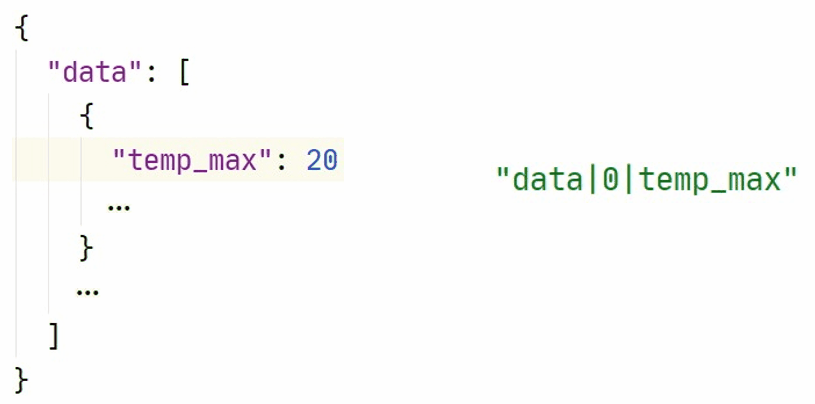
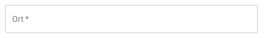
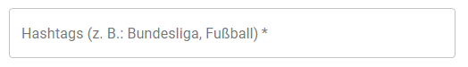
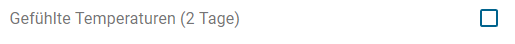
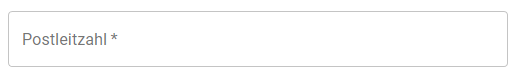
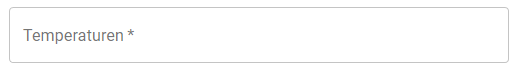
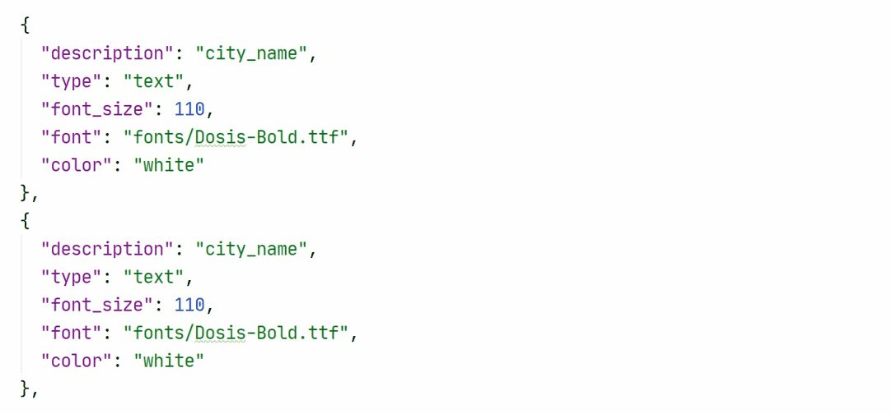

# Themenkonfiguration

Die Themenkonfiguration ist eine JSON-Datei mit verschiedenen Abschnitten. Diese Datei dient der Angabe aller Parameter, 
Einstellungen und Konfigurationen, die für die automatisierte Generierung eines Videos erforderlich sind.

In der JSON-Datei wird angegeben, welche API-Anfrage gesendet wird, wie die Daten aus der API-Antwort entnommen und
verarbeitet werden sollen. 
Um auf die Daten der API-Antwort zugreifen und diese modifizieren zu können, werden in der JSON-Datei `transform`-Typen verwendet..
Es werden Bilder (`images`) und Audiodateien (`audio`) erstellt, die am Ende in einer bestimmten Reihenfolge (`sequence`) 
aneinander gehängt werden.

Im Repository finden 4 dieser [JSON-Dateien](https://github.com/SWTP-SS20-Kammer-2/Data-Analytics/tree/master/src/visuanalytics/resources/steps) für die Generierung von Videos zu den Themen:

- [Deutschlandweiter Wetterbericht](https://github.com/SWTP-SS20-Kammer-2/Data-Analytics/blob/master/src/visuanalytics/resources/steps/weather_germany.json)
- [Ortsbezogener Wetterbericht](https://github.com/SWTP-SS20-Kammer-2/Data-Analytics/blob/master/src/visuanalytics/resources/steps/weather_single.json)
- [Fußballbericht zur 1. und 2. Bundesliga](https://github.com/SWTP-SS20-Kammer-2/Data-Analytics/blob/master/src/visuanalytics/resources/steps/football.json)
- [Twitter-Wordcloud-Verlauf](https://github.com/SWTP-SS20-Kammer-2/Data-Analytics/blob/master/src/visuanalytics/resources/steps/twitter.json)

Die JSON-Datei mit den Konfigurationen zu einem Thema (im folgenden JSON-Datei genannt) hat folgende Abschnitte:
```JSON
{
  "id": 1,
  "name": "name_des_videos",
  "info": "",
  "api": {},
  "transform": [],
  "storing": [],
  "images": {},
  "thumbnail": {},
  "audio": {},
  "sequence": {},
  "run_config": [],
  "presets": {}
}
```
Diese Abschnitte werden im folgenden näher beschrieben. Abgesehen von `id`, `name` und`info` gibt es mehrere Typen, aus denen bei 
den einzelnen Abschnitten ausgewählt werden kann - je nachdem wie das Video am Ende aussehen soll und wie die Daten 
verarbeitet und visualisiert werden sollen.

Doch zunächst werden grundlegende Funktionen dargestellt, die man bei der Zusammenstellung der JSON-Datei beachten muss.

## Datenzugriffe

### Pfade

Es gibt einen Ordner `resources`, in dem alle Bilder, Audiodateien, die JSON-Dateien und weitere Dateien 
abgelegt werden können. Dieser Ordner ist der default-Ordner. Man muss also nur den Pfad innerhalb dieses Ordners abgeben. 
Es genügt hier der relative Pfad, da im Hintergrund der Ordner festgelegt wurde. 

```note::
  Der `resources`-Ordner befindet sich unter `src/visuanalytics/` (bzw. innerhalb des Docker-Containers unter `/home/appuser/visuanalytics/`).
```

**Unterordner**:

- _Bilder_: `images` (dieser muss bei der Angabe des Pfads **nicht** angegeben werden)
- _Schriftarten_: `fonts` (dieser **muss** bei der Angabe des Pfads angegeben werden)
- _Themen_: `steps` (hier befinden sich alle JSON-Dateien)
- _Stopwords_:  `stopwords` (hier befindet sich die Datei für die globalen Stopwords)(siehe auch [hier](#wordcloud))

**Beispiele**

_Ordnerstruktur_:

~~~
resources
|   
+---fonts
|       Dosis-Bold.ttf
|       
+---images
|   \---football
|           Matchday.png
|           
+---steps
|       (...)
|
\---stopwords
        stopwords.txt
~~~

_Verwendung der Bilder in einer JSON-Datei_:

```JSON
{
"path": "football/Matchday.png"
}
```

_Verwendung der Schriftart in einer JSON-Datei_:

```JSON
{
  "font": "fonts/Dosis-Bold.ttf"
}
```

### Auf Daten zugreifen

Um auf Daten (z.B.: Daten aus der API) zuzugreifen, gibt man die `Keys` getrennt mit einem Pipe-Symbol (`|`) an. Hierbei 
wird nicht zwischen Arrays und Dictionaries (Objekte) unterschieden. Man verwendet für Arrays einen Zahlen-Wert als `Key` 
anstatt eines Strings.

**Beispiel**



### Key/New Key

Um Daten zu verändern, verwendet man die `key`/`new_key`-Syntax.
Diese dient dazu einen Text zu verändern und neu abzuspeichern. Dieser Text ist unter dem 
Key `text1` abgespeichert. Den modifizierten Text kann man nun wieder unter `text1` abspeichern, indem man keinen neuen Key mit `new_key` angibt. 
Dann ist der default-Speicherplatz an der Stelle `text1`. Der alte Wert (in diesem Fall ein Text) wird also überschrieben.
Um die Daten zu ergänzen anstatt sie zu überschreiben, wird der `new_key` verwendet, z.B. mit dem Namen `text_transformed`.

**Beispiel**
```JSON
{
    "type": "append",
    "key": "_loop|text1",
    "new_key": "_req|text_transformed"
}
```

Ist ein angegebener `new_key` nicht vorhanden, wird dieser - bzw. alle Keys, die fehlen - neu erstellt.

```warning::
  Aktuell ist es nicht möglich, dass durch die Angabe von `new_key` ein Array erstellt wird oder ein Array, was zu klein ist, vergrößert wird.
```

### Spezialvariablen

Es gibt einge vordefinierte Spezialvariablen mit folgenden Keys:

`_req`:

Hier werden alle Daten aus den Requests gespeichert (siehe [api](#api)).

`_conf`:

Hier werden alle Konfigurationsvariablen gespeichert (siehe [run_config](#run-config)).

`_audio`:

Hier werden alle Konfigurationen und Daten für eine benutzerdefinierte Audiogenerierung gespeichert (siehe [Audiokonfiguration](./audio-apis.md)).

`_key`:

Hier wird der Wert des Keys gespeichert. Diese Variable ist in den meisten [transform](#transform)-Typen gesetzt.

`_loop`:

Hier wird der aktuelle Wert des Schleifendurchlaufs gespeichert. Diese gibt es nur bei den [transform](#transform)-Typen: [loop](#loop), [transform_array](#transform-array) und [transform_dict](#transform-dict); bei den [api](#api)-Typen [request_multiple](#request-multiple) und [request_multiple_custom](#request-multiple-custom).

`_idx`:

Hier wird der aktuelle Index des Schleifendurchlaufs gespeichert. Diese gibt es nur in den [transform](#transform)-Typen: [loop](#loop), [transform_array](#transform-array) und [transform_dict](#transform-dict); bei den [api](#api)-Typen [request_multiple](#request-multiple) und [request_multiple_custom](#request-multiple-custom).

`_pipe_id`:

Die `id` der Pipeline, die den Job ausführt. (Diese ist ein zufallsgenerierter String und wird innerhalb der JSON-Datei normalerweise nicht benötigt.)

`_job_id`:

`id` des Jobs (wird normalerweise innerhalb der JSON-Datei nicht benötigt).

### Datentypen 

In der JSON-Datei gibt es Typen zu den folgenden Abschnitten - wie auch zu Anfang beschrieben:
`api`, `transform`, `images`, `thumbnail`, `audio` und `sequence`.

#### string
Um auf einen String zuzugreifen, verwendet man folgende Syntax: 

**Beispiel**
```JSON
{
  "text": "{_req|text} Test",
  "stopwords": "{_conf|stopwords}"
}
```

Um innerhalb eines Strings Daten einzufügen, kann man `{}` verwenden und dort einen Key hineinschreiben. 

```note::
  Wenn man in dem String die Zeichen `{}` schreiben möchte, ohne dass diese entfernt werden, muss man die Klammern doppelt schreiben (z.B.: `{{"_conf|test}}` -> `"{test}"`).
```

#### boolean
Um auf einen boolean-Wert zuzugreifen, verwendet man folgende Syntax: 

**Beispiel**
```JSON
{
  "collocations": "_conf|collocations",
  "color_func": true
}
```

Hierbei gibt man entweder direckt einen boolean-Wert an oder den `Key` zu einem boolean-Wert.

#### number
Um auf einen Zahlenwert (int, double, float) zuzugreifen, verwendet man folgende Syntax:

**Beispiel**
```JSON
{
  "width": "_conf|width_wordcloud",
  "height": 10
}
```

Hierbei gibt man entweder direkt einen Zahlenwert an oder den `Key` zu einem Zahlenwert.

#### dict
Um auf ein abgespeichertes Dictionary (dict) zuzugreifen, verwendet man folgende Syntax:

**Beispiel**
```JSON
{
  "dict": "_conf|value",
  "dict": {
      "test": "hallo"
    }
}
```

Hierbei gibt man entweder direkt ein Dictionary (Objekt) an oder den `Key` zu einem Dictionary (Objekt).

#### list
Um auf ein Array/eine Liste (list) zuzugreifen, verwendet man folgende Syntax:

**Beispiel**
```JSON
{
  "list": "_conf|value",
  "list2": [
    "test",
    "test"
  ]
}
```

Hierbei gibt man entweder direkt eine Liste an oder den `Key` zu einer Liste.

#### any
Um auf einen Wert mit nicht festgelegtem Datentyp zuzugreifen, verwendet man folgende Syntax:

**Beispiel**:
```JSON
{
  "any": "$_conf|value",
  "any2": {
    "test": 2,
    "test2": "hallo",
    "test3": [
      "hallo",
      "$_conf|value"
    ] 
  }
}
```

Dieser Datentyp ist dafür da, um Daten anzugeben, von denen der Datentyp vorher nicht bekannt ist. Man kann hier einen 
**String** (str), eine **Liste** (list) usw. angeben. Da so nicht zwischen einem **String** und einem **Key** unterschieden 
werden kann, muss man dies mit einem führenden Dollarzeichen (`$`) angeben. 

```note::
  Falls man ein Dollarzeichen (`$`) am Anfang eines Strings verwenden will, muss dieses mit einer Tilde (`~`) escapt werden. 
  (z. B.: `"~$test"`)
```

## API

Die im folgenden aufgeführten Typen dienen zur Anfrage von Daten, welche an API-Schnittstellen gesendet werden. Diese
werden Request genannt. Die Antwort der API wird Response genannt und besteht aus einer JSON-Datei mit den angeforderten
Daten der API. Die Responses können auch XML-Daten enthalten.

### request

Führt eine **https**-Request durch.

**Beispiel** 

```JSON
{
    "type": "request",
    "api_key_name": "apiKeyName",
    "url_pattern": "url",
    "params": {
      "key1": "value1",
      "key2": "value2"
    },
    "headers": {
      "Authorization": "Bearer {_api_key}"
    }
}
```

`url_pattern`:

[str](#string) - Die zu verwendende URL, um die API-Request zu senden.

`api_key_name` _(optional)_:

[str](#string) - Der Name des Api-Keys. Dieser **Name** muss mit einem **Key** in der Konfigurationsdatei übereinstimmen.

- _Fehler_:

  - `ApiKeyError` -> Name in Konfigurationsdatei nicht gefunden.

- _Spezialvariablen_:

  - `api_key` -> Beinhaltet den API-Key hinter `api_key_name`.

`headers` _(optional)_:

[any](#any) - Die [HTTP-Header](https://developer.mozilla.org/de/docs/Web/HTTP/Headers) für den Request.

`params` _(optional)_:

[any](#any) - Die URL-Parameter des Requests. Die Angaben erfolgen als Key/Value-Paare.

_Beispiel_

In der JSON-Datei:

~~~JSON
{
  "url_pattern": "https://test.de",
  "params": {
    "test": "test_value",
    "test1": "test_value_1"
  }
}
~~~

URL nach dem Zusammenbauen:

`https://test.de?test=test_value&test1=test_value_1`

`body` _(optional)_:

[any](#any) - Der zu verwendende Request-Body. Dieser kann entweder ein JSON-Objekt oder ein String sein (für Definition des Typen siehe `body_type`).

`body_type` _(optional)_:

[str](#string) - Der Datentyp des Bodys.

- _mögliche Werte_:
  - `json` (default)
  - `other`

`method` _(optional)_:

[str](#string) - Die zu verwendende [HTTP-Request-Methode](https://developer.mozilla.org/de/docs/Web/HTTP/Methods).

- _mögliche Werte`_:
  - `GET` (default)
  - `POST`
  - `PUT`
  - `DELETE`

`body_encoding` _(optional)_:

[str](#string) - Die Kodierung, mit welcher der Wert in `body_type` kodiert werden soll (z.B.: `utf-8`).

```note::
  Diese ist nur für den `body_type` `other` möglich.
```

`response_format` _(optional)_:

[str](#string) - Der Datentyp des Response-Bodys.

- _mögliche Werte`_:
  - `json` (default)
  - `xml`
  - `text`
  - `other`

```note::
  Der Wert `other` sollte nur bei der `Audiokonfiguration <./audio-apis.html>`_ verwendet werden.
```

`xml_config` _(optional)_:

[any](#any) - XML-Einstellungen (wird nur bei `response_format = xml` verwendet).

Um es möglich zu machen, auch XML Daten zu verarbeiten, wird das Python-Modul [xmltodict](https://pypi.org/project/xmltodict/) 
verwendet. Dieses wandelt die XML-Daten in ein Dictionary (bzw. in JSON) um. Unter `xml_config` können Konfigurationen 
angegeben werden, die an das Modul weitergegeben werden.

```warning::
  Da der Doppelpunkt (`:`) in Python auch eine Bedutung hat, ist es nicht möglich innerhalb eines Keys einen Doppelpunkt 
  (`:`) anzugeben. Damit man XML-Daten mit einem Doppelpunkt im Key verwenden kann, kann man die `NameSpace <https://github.com/martinblech/xmltodict#namespace-support>`_-Einstellung 
  des Moduls verwenden. z.B.:

    .. code-block:: JSON

      {
        "xml_config": {
          "process_namespaces": true,
          "namespaces": {
            "http://www.w3.org/2003/05/soap-envelope": null,
            "http://msiggi.de/Sportsdata/Webservices": null
          }
        }
      }

  Hierbei kann man alle, in den XML-Daten vorhandenen, Namespaces auf `null` setzen, damit die Keys etwas kürzer werden.
```

### request_multiple

Führt mehrere **https**-Requests durch. Der Request bleibt gleich bis auf einen Wert, der sich ändert.
Z.B. werden die Wetterdaten mehrerer einzelner Städte angefragt.

**Beispiel** 

```JSON
{
    "type": "request_multiple",
    "api_key_name": "weatherbit",
    "steps_value": [
      "value1",
      "value2"
    ],
    "url_pattern": "url",
    "use_loop_as_key": true,
    "params": {
      "values": "{_loop}",
      "key": "{_api_key}",
      "country": "DE"
    }
}
```

Alle Angaben, die auch bei dem [api](#api)-Typ [request](#request) möglich sind.

`steps_value`:

[list](#list) - Alle Werte für die ein Request gesendet werden soll. 

- _Spezialvariablen_:

  - `_loop` -> Beinhaltet den Wert aus `steps_value`.
  - `_idx` -> Beinhaltet den Index des Wertes aus `steps_value`.

`use_loop_as_key`

[bool](#boolean) - Gibt an, ob der Wert aus `steps_value` als Key zum Speichern des Requests verwendet werden soll.

- Bei `true`:
  - Die Daten der Requests werden als Dictionary (dict) mit den Werten aus `steps_value` als Keys gespeichert.
- Bei `false` (default):
  - Die Daten der Requests werden als Liste (list) gespeichert.

### request_multiple_custom

Führt mehrere **https**-Requests durch. Man kann jeden anderen Request-Typen verwenden, der oben beschrieben wurde.

**Beispiel** 

```JSON
{
"type": "request_multiple_custom",
    "use_loop_as_key": true,
    "steps_value": [
      "value1",
      "value2",
      "value3"
    ],
    "requests": [
      {
        "type": "request",
        "url_pattern": "url1"
      },
      {
        "type": "request",
        "url_pattern": "url2"
      },
      {
        "type": "request_memory",
        "name": "value3_name",
        "use_last": 1,
        "alternative": {
          "type": "request",
          "url_pattern": "url3"
        }
      }
    ]
}
```

`requests`:

Hier können mehrere Requests angegeben werden. Hierfür kann man alle [api](#api)-Typen angeben. Diese werden dann nacheinander ausgeführt.

`steps_value`:

[list](#list) - Alle Werte für die ein Request gesendet werden soll. 

- _Spezialvariablen_:

  - `_loop` -> Beinhaltet den Wert aus `steps_value`.
  - `_idx` -> Beinhaltet den Index des Wertes aus `steps_value`.

`use_loop_as_key`

[bool ](#boolean) - Gibt an, ob der Wert aus `steps_value` als Key zum Speichern des Requests verwendet werden soll.

- Bei `true`:
  - Die Daten der Requests werden als Dictionary (dict) mit den Werten aus `steps_value` als Keys gespeichert.
- Bei `false` (default):
  - Die Daten der Requests werden als Liste (list) gespeichert.

### input

Hier können Daten angegeben werden, die einfach hinzugefügt werden.

**Beispiel**

```JSON
{
  "type": "input",
  "data": "-1. Spieltag"
}
```

`data`

[any](#any) - Die einzufügenden Daten.

### request_memory

Hier können die Daten aus dem Abschnitt [storing](#storing) geladen werden.

```JSON
{
  "type": "request_memory",
  "name": "table",
  "use_last": 1,
  "alternative": {
    "type": "request",
    "url_pattern": "url"
  }
}
```

`name`:

[str](#string) - Name des gespeicherten [storing](#storing)-Eintrags.

`use_last`: 

[number](#number) - Nummer der [storing](#storing)-Version, die geladen werden soll.

`alternative`

Hier kann ein Requests angegeben werden. Hierfür kann man alle [api](#api)-Typen angeben.

## Transform

`transform`-Typen sind Funktionen zum Bearbeiten der Daten der API-Antwort. 
Die Daten können verändert oder entfernt werden, neue Daten können hinzugefügt werden.

### transform_array

Führt alle angegebenen `transform`-Typen für alle Werte eines Arrays aus. 

**Beispiel** 

```JSON
{
  "type": "transform_array",
  "array_key": "key",
  "transform": []
}
```

`array_key`:

[str](#string) - Keys zu einem Array, welches durchlaufen werden soll und auf dessen Werte die `transform`-Typen angewandt werden sollen.

`transform`:

`transform`-Typen, die für alle Werte des - unter `array_key` angegebenen - Arrays ausgeführt werden sollen.

- _Spezialvariablen_:
  - `_loop`: Hier wird der aktuelle Wert des Schleifendurchlaufs gespeichert.
  - `_idx`: Hier wird der aktuelle Index des Schleifendurchlaufs gespeichert.

```note::
  Für kompliziertere Anwendungen kann es sein, dass man einen Trick benötigt, um _Spezialvariablen_ aus der vorherigen
  Ebene (innerhalb der JSON-Datei) zu verwenden. Dieser ist unter `Key Trick <#key-trick>`_ beschrieben.
```
```

### transform_dict

Führt alle angegebenen `transform`-Typen für alle Werte eines Dictionaries aus. 

**Beispiel** 

```JSON
{
  "type": "transform_dict",
  "dict_key": "key",
  "transform": []
}
```

`dict_key`:

[str](#string) - Keys zu einem Dictionary, welches durchlaufen werden soll und auf dessen Werte die `transform`-Typen angewandt werden sollen.

`transform`:

`transform`-Typen, die für alle Werte des - unter `dict_key` angegebenen - Dictionaries ausgeführt werden sollen.

- _Spezialvariablen_:
  - `_loop`: Hier wird der aktuelle Wert des Schleifendurchlaufs gespeichert.
  - `_idx`: Hier wird der aktuelle Index des Schleifendurchlaufs gespeichert.

```note::
  Für kompliziertere Anwendungen kann es sein, dass man einen Trick benötigt, um _Spezialvariablen_ aus der vorherigen
  Ebene (innerhalb der JSON-Datei) zu verwenden. Dieser ist unter `Key Trick <#key-trick>`_ beschrieben.
```

### calculate

`calculate` beinhaltet Aktionen (actions), die Funktionen für mathematische Berechnungen zur Verfügung stellen.
Für alle `calculate`-Actions gilt:

`action`:

[str](#string) - Angabe des Namens der Aktion, die ausgeführt werden soll.

`keys`:

Die Werte, die durchlaufen und transformiert werden sollen. 

`new_keys`_(optional)_:

Die tranformierten Werte werden unter diesem Key neu gespeichert. 
Ist `new_keys` nicht vorhanden, werden die Werte in `keys` mit den transformierten Werten überschrieben.

#### mean

Berechnet den Mittelwert von Werten, die in einem Array stehen. 

**Beispiel** 

```JSON
{
    "type": "calculate",
    "action": "mean",
    "keys": [
       "_loop|max_temp"
    ],
    "new_keys": [
       "_loop|temp_avg"
    ],
    "decimal": 2
}
```

`decimal`_(optional)_: 

int - Nachkommastelle, auf die der Durchschnittswert gerundet werden soll.

_Default_: 0. (keine Nachkommastelle)

#### max

Findet den Maximalwert von Werten, die in einem Array stehen.

**Beispiel** 

```JSON
{
    "type": "calculate",
    "action": "max",
    "keys": [
       "_loop|max_temp"
    ],
    "new_keys": [
       "_loop|temp_max"
    ],
    "save_idx_to": [
       "_loop|temp_highest_max_city"
    ]
}
```

`save_idx_to`_(optional)_:

int - Der Index vom Durchlaufen der Schleife (_loop) wird als Zahlenwert unter dem genannten `save_idx_to`-Key gespeichert.
Dient z.B. dazu auf eine vorherige Ebene in der JSON-Struktur zugreifen zu können. 

#### min

Findet den Minimalwert von Werten, die in einem Array stehen.

**Beispiel** 

```JSON
{
    "type": "calculate",
    "action": "min",
    "keys": [
       "_loop|min_temp"
    ],
    "new_keys": [
       "_loop|temp_min"
    ],
    "save_idx_to": [
       "_loop|temp_min_city",
       "_loop|temp_lowest_max_city"
    ]
}
```

`save_idx_to`_(optional)_:

int - Der Index vom Durchlaufen der Schleife (`_loop`) wird als Zahlenwert unter dem genannten `save_idx_to`-Key gespeichert.
Dient z.B. dazu auf eine vorherige Ebene in der JSON-Struktur zugreifen zu können. 


#### round

Rundet gegebene Werte auf eine gewünschte Nachkommastelle.

**Beispiel** 

```JSON
{
    "type": "calculate",
    "action": "round",
    "keys": [
        "_loop|temp_avg",
        "_loop|max_temp",
        "_loop|min_temp"
     ],
     "decimal": 3
}
```

`decimal`_(optional)_: 

int - Nachkommastelle, auf die der Durchschnittswert gerundet werden soll.

_Default_: 0. (keine Nachkommastelle)


#### mode

Bestimmt den am häufigsten in einem Array vorkommenden Wert.

**Beispiel** 

```JSON
{
    "type": "calculate",
    "action": "mode",
    "keys": [
        "_loop|code"
    ],
     "new_keys": [
        "_loop|new_code"
    ]
}
```

#### Grundrechenarten

Die Aktionen `multiply`, `divide`, `subtract` und `add` sind gleich aufgebaut. Daher haben die Keys auch die gleiche Bedeutung.
Als default ist der Wert zu `keys` immer auf der linken Seite der Gleichung. Alternativ: `keys_right`.

`keys_right`: 

Datenzugriff auf Daten/Werte, die auf der rechten Seite der Gleichung stehen sollen. Wichtig: bei `divide` und `subtract`.

`value_right`: 

Wert, der immer auf der rechten Seite der Gleichung stehen soll. Wichtig: bei `divide` und `subtract`.

`value_left`: 

Wert, der immer auf der linken Seite der Gleichung stehen soll. Wichtig: bei `divide` und `subtract`.

`decimal`_(optional)_: 

int - Nachkommastelle, auf die das Ergebnis gerundet werden soll. 

_Default_: 0. (keine Nachkommastelle)

Folgende Möglichkeiten gibt es:

| Linke Seite der Gleichung | Rechte Seite der Gleichung |
| ------------------------- | -------------------------- |
| `keys`                    | `value_right`              |
| `keys`                    | `keys_right`               |
| `value_left`              | `value_right`              |
| `value_left`              | `keys_right`               |

Eine dieser Möglichkeiten muss vorhanden sein, die anderen Keys sind dann nicht erforderlich. 


##### multiply

Multipliziert gegebene Werte mit Werten, die in `multiply_by` stehen. Es kann optional auf die gewünschte Nachkommastelle,
die unter `decimal` angegeben wird, gerundet werden.

**Beispiel** 

```JSON
{
    "type": "calculate",
    "action": "multiply",
    "keys": [
        "_loop|number1"
    ],
    "value_right": 3.6,
    "decimal": 2
}
```

##### divide

Dividiert gegebene Werte durch Werte, die in `divide_by` stehen. Es kann optional auf die gewünschte Nachkommastelle,
die unter `decimal` angegeben wird, gerundet werden.

**Beispiel** 

```JSON
{
    "type": "calculate",
    "action": "divide",
     "keys": [
         "_loop|number1"
     ],
     "value_right": 3.6,
     "decimal": 2
}
```

##### subtract

Die jeweiligen Werte, die in `subtract` stehen, werden von den Werten, die in key stehen, subtrahiert. Es kann optional 
auf die gewünschte Nachkommastelle, die unter `decimal` angegeben wird, gerundet werden.

**Beispiel** 

```JSON
{
    "type": "calculate",
    "action": "subtract",
    "keys_right": [
        "_loop|number1"
    ],
    "value_left": 3.6,
    "decimal": 2
}
```

##### add

Die jeweiligen Werte, die in `add` stehen, werden zu den Werten, die in key stehen, hinzuaddiert. Es kann optional auf 
die gewünschte Nachkommastelle, die unter `decimal` angegeben wird, gerundet werden.

**Beispiel** 

```JSON
{
    "type": "calculate",
    "action": "add",
    "keys": [
        "_loop|number1"
    ],
    "value_right": 3.6,
    "decimal": 2
}
```

### select

`select` entfernt alle Keys, die nicht in `"relevant_keys"` stehen aus den Daten.

Mit `select` kann man sich also die Key/Value-Paare aus der API-Antwort herausziehen, die für das zu erstellende Video 
relevant sind. 

**Beispiel** 

```JSON
{
  "type": "select",
  "array_key": "data",
  "relevant_keys": [
      "key1",
      "key2"
  ],
  "ignore_errors": true
}
```

`array_key`:

[str](#string) - Angabe, in welcher Ebene der Daten, die `relevant_keys` zu finden sind.

`relevant_keys`: 

str-Array - Namen der Keys, dessen Key/Value-Paare aus der API-Antwort übernommen werden und abgespeichert werden sollen.

```warning::
  Die unter `relevant_keys` angegebenen `Keys` funktionieren etwas anders als alle anderen Keys. Diese gehen **nicht** vom 
  `root` des Objekts aus, sondern vom momentanen `root`. Ist also `_loop` gesetzt, werden alle Keys ausgehend von `_loop` 
  betrachtet (z.B. `normal`: `_loop|0` => `hier`: `0`). Dies ist notwendig, da man nur Keys in der aktuellen Ebene der JSON-Datei
  ersetzt (also z.B. im aktuellen `array`) und nicht alle anderen Keys aussortiert. (Ist `_loop` nicht gesetzt, ist die 
  Key-Angabe wie üblich).
```

`ignore_errors`:

[bool](#boolean)  - Wenn `ignore_errors` auf `true` gesetzt wird, werden fehlende Keys ignoriert. 
Beispiel: Steht in den `relevant_keys` `key1` und `key1` ist nicht vorhanden, wird kein Fehler geworfen. Sondern es 
wird einfach ignoriert, dass es diesen Key nicht gibt. 

### delete

Entfernt Key/Value-Paare aus den Daten.

**Beispiel** 

```JSON
{
  "type": "delete",
  "keys": [
      "key1",
      "key2"
  ]
}
```

`keys`: 

str-Array - Namen der Keys, dessen Key/Value-Paare entfernt werden sollen.


### select_range

Entfernt alle Werte aus `array_key`, die nicht innerhalb der von `range_start` und `range_end` liegen.

**Beispiel** 

```JSON
{
          "type": "select_range",
          "array_key": "_loop|data",
          "range_start": 0,
          "range_end": 5
}
```

`array_key`:

[str](#string) - Angabe, aus welcher Ebene die Daten ausgewählt werden sollen.

`range_start`_(optional)_:

int - Startwert für die Schleife durch die Daten.

_Default_: 0. 

`range_end`:

int - Endwert für die Schleife durch die Daten.


### append

Speichert den Wert, der unter `key` steht, in einem Array.

**Beispiel mit list** 

```JSON
{
  "type": "append",
  "key": "key",
  "new_key": "new_key",
  "append_type": "list"
}
```

**Beispiel mit string** 

```JSON
{
  "type": "append",
  "key": "key",
  "new_key": "new_key",
  "append_type": "string",
  "delimiter": "-"
}
```

`key`:

Name des Keys zum Wert, der in ein neues Array gespeichert werden soll. 

`new_key`_(optional)_:

Name des Arrays unter dem die neuen Werte (Wert unter `key`) gespeichert werden sollen.

`append_type`_(optional)_:

"list" oder "string" - Datentyp der Werte, die in einem Array gespeichert werden sollen.

_Default_: "list".

`delimiter`_(optional)_:

[str](#string) - Zeichen mit dem die Werte - im Falle des Datentyps [string](#string) - voneinander getrennt werden sollen.

_Default_: " " (Leerzeichen).

### add_symbol

`add_symbol` setzt ein Zeichen, ein Wort, einen Satzteil oder ganze Sätze hinter oder vor den Wert von dem Key, welcher
unter `keys` steht. Man kann damit auch einen Wert vom alten Key unter `keys` in einen neuen Key unter `new_keys` kopieren.
Unter `{_key}` wird dann der Wert zum Key aus `keys` eingefügt.

**Beispiel** 

```JSON
{
  "type": "add_symbol",
  "keys": [
    "key"
  ],
  "new_keys": [
    "new_key"
  ],
  "pattern": "{_key} test"
}
```

`pattern`:

[str](#string) - String mit `{_key}` und/oder auch nur einem Satz/Wort/Zeichen o.Ä. der/das eingefügt werden soll unter `new_keys`.

**Beispiel**

```JSON
{
  "type": "add_symbol",
  "keys": [
      "max_temp"
  ],
  "new_keys": [
      "max_temp_text"
  ],
  "pattern": "Heute werden Temperaturen von {_key}° Celsius erreicht."
}
```

`{_key}` wird durch eine Temperatur ersetzt, die unter dem Key `max_temp` in `keys` steht und der neue Satz wird unter 
dem Key `max_temp_text` in `new_keys` gespeichert. 


### replace
Ersetzt ein Zeichen, Symbol, Wort, einen Satz oder eine ganzen Text in einem String.

`replace` ersetzt einen String, der in `old_value` angegeben ist, mit einem String, der in `new_value` angegeben ist.
Der Wert, der unter `keys` gespeichert ist, wird verändert und in einem neuen Key (angegeben unter `new_keys`) gespeichert.
count gibt an, wie oft in dem Value der old_value gegen den new_value ersetzt werden soll.

**Beispiel** 

```JSON
{
  "type": "replace",
  "keys": [
      "key"
  ],
  "new_keys": [
      "new_key"
  ],
  "old_value": ".",
  "new_value": ",",
  "count": 1
}
```

`old_value`:

[str](#string) - Zeichen, Symbol, Wort, einen Satz oder eine ganzen Text, der ersetzt werden soll.

`new_value`:

[str](#string) - Zeichen, Symbol, Wort, einen Satz oder eine ganzen Text, der den `old_value` ersetzen soll.

`count`_(optional)_:

int - Gibt an, wie oft der `old_value` in dem Wert mit dem `new_value` ersetzt werden soll.

_Default_: -1. 


### translate_key

Setzt den Wert eines Keys zu einem neuen Key als Wert für die JSON. Dieser neue Wert steht in einem Dictionary. 

**Beispiel** 

```JSON
{
          "type": "translate_key",
          "keys": [
            "_loop|weather|code"
          ],
          "new_keys": [
            "_loop|weather|str_code_short"
          ],
          "dict": {
            "key1": "Gewitter",
            "key2": "Sonne",
            "key3": "Regen"
          }
}
```

`dict`:

[dict](#dict) - Ein Dictionary mit bekannten Keys, welche unter `keys` stehen und den Werten, die anstelle dieser Keys neu abgespeichert werden sollen.


### alias

Erstzt einen Key durch einen neuen Key (Änderung des Key-Namens).

**Beispiel** 

```JSON
{
  "type": "alias",
  "keys": [
      "key"
   ],
  "new_keys": [
      "new_key"
  ],
  "keep_old": true
}
```

`keep_old`:

[bool](#boolean) - Wenn `keep_old` auf `true` gesetzt ist, wird der alte Key nicht gelöscht. Es wird nur eine Kopie der 
Daten angefertigt. 

### regex

regex - regular expression (zu Deutsch: regulärer Ausdruck)
Führt re.sub für die angegebenen Werte aus.

**Beispiel** 

```JSON
{
  "type": "regex",
  "keys": [
      "keys"  
  ],
  "regex": "[.]+",
  "replace_by": ","
}
```
Dieses Beispiel sucht alle . und ersetzt diese mit einem ,
Durch das + soll mindestens ein . ersetzt werden.

```warning::
  Da ein Backslash (`\`) in JSON eine Bedeutung hat, kann es sein, dass man diesen escapen muss. 
  (Z.B. darf der Backslash (`\`) nicht vor dem Anführungszeichen stehen, da dieses sonst ignoriert wird.)
```

**Beispiel (mehrere Zeichen)** 

```JSON
{
  "type": "regex",
  "keys": [
      "keys"  
  ],
  "regex": "[al]",
  "replace_by": "XX"
}
```
In diesem Beispiel werden in einem String die Buchstaben a und l gesucht und jedes a und jedes l wird mit jeweils einem XX ersetzt.

**Beispiel (or)** 

```JSON
{
  "type": "regex",
  "keys": [
      "keys"  
  ],
  "regex": "ll|ss",
  "replace_by": "xx"
}
```

In diesem Beispiel werden in einem String ll oder ss gesucht und durch xx ersetzt.

**Beispiel (ends with a specific character)** 

```JSON
{
  "type": "regex",
  "keys": [
      "keys"  
  ],
  "regex": "o$",
  "replace_by": "END"
}
```

In diesem Beispiel wird das Ende eines Strings betrachtet. Endet das Wort mit einem o so wird das o durch END ersetzt.


**Beispiel (start with a specific character)** 

```JSON
{
  "type": "regex",
  "keys": [
      "keys"  
  ],
  "regex": "^H|T",
  "replace_by": "START"
}
```

In diesem Beispiel wird der Anfang eines Strings betrachtet. Beginnt das Wort mit dem Buchstaben H oder T, so wird 
dieser Buchstabe jeweils durch START ersetzt.

**Beispiel (character set)** 

```JSON
{
  "type": "regex",
  "keys": [
      "keys"  
  ],
  "regex": "[0-9]",
  "replace_by": " "
}
```

In diesem Beispiel wird jede Zahl in einem String durch ein Leerzeichen ersetzt.

`regex`

[str](#string) - Beinhaltet den regulären Ausdruck. Oben sind einige Beispiele genannt. 
Der String unter regex darf keine Backslashes (\) enthalten.

`replace_by`

[str](#string) - Zeichen mit denen der reguläre Ausdruck im String ersetzt werden soll.

### Uhrzeit und Datum

Im folgenden werden einige transform-Typen für Uhrzeit- und Datumsformate näher erläutert. 
Für alle diese Typen gilt:

`keys`:

str-Array - Keys unter denen die Uhrzeit bzw. die Daten als Werte stehen. 

`new_keys`:

str-Array - Keys unter denen die umgeformte Uhrzeit bzw. die Daten als Werte stehen sollen.

`format`:

[str](#string) - Das Format, in das die Uhrzeit bzw. das Datum umgewandelt werden soll.

`given_format`:

[str](#string) - Das Format, in dem die Uhrzeit bzw. das Datum angegeben sind.

`zeropaded_off`_(optional)_:

[bool ](#boolean) - `True`: Entfernt die 0 am Anfang einer Zahl. `False` (default): Die 0 am Anfang einer Zahl bleibt stehen. Könnte zu Fehlaussprache bei der Umwandlung von Text zu Sprache führen.
`zeropaded_off` ist True, wenn z.B. aus 05. Mai 2020 -> 5. Mai 2020 werden soll.

**Beispiele für Formate**:

Für die Implementierung der Typen wurde die Python-Bibliothek **datetime** verwendet. 
Beispiele für die Darstellung von Datum und Uhrzeit finden Sie unter: https://docs.python.org/3/library/datetime.html

Einige gängige Formate sind:

|        Format          |       Beispiel           |
|------------------------|--------------------------|
|%Y-%m-%dT%H:%M:%S       |2020-05-15T23:56:05       |
|%H:%M:%S                |23:56:05                  |
|%Y-%m-%d                |2020-05-15                |
|%d.%m.%Y                |15.05.2020                |
|On the %dth of %b %Y    |On the 15th of May 2020   |

#### date_format

`date_format` ändert das vorliegende Format des Datums und der Uhrzeit, welches unter `given_format` angegeben wird, in 
ein gewünschtes anderes Format, welches unter `format` angegeben wird.

**Beispiel** 

```JSON
{
  "type": "date_format",
  "keys": [
      "key"
  ],
  "new_keys": [
      "new_key"
  ],
  "given_format": "%Y-%m-%dT%H:%M:%S",
  "format": "%Y-%m-%d", 
  "zeropaded_off": false
}
```

#### timestamp

`timestamp` wandelt Datumsangaben, welche im UNIX-Timestamp-Format angegeben sind, in das unter `format` angegebene Format
um. Unter `keys` sind die Keys angegeben unter denen als Werte Datumsangaben im UNIX-Timestamp-Format stehen. Unter
`new_keys` werden die Keys angegeben zu denen das Datum mit dem gewünschten Format als Wert gespeichert werden soll.


**Beispiel** 

```JSON
{
  "type": "timestamp",
  "keys": [
      "key"
  ],
  "new_keys": [
      "new_key"
  ],
  "format": "%H Uhr %M",
  "zeropaded_off": true
}
```
```warning::
  Kein `given_format`-Key, da das `given_format` ein Zeitstempel ist.
```

#### date_weekday

`date_weekday` wandelt das angegebene Datum, im unter `"given_format"` angegebenen Format, in den jeweiligen Wochentag zum Datum um.

**Beispiel** 

```JSON
{
  "type": "date_weekday",
  "keys": [
      "key"
   ],
  "new_keys": [
      "new_key"
  ],
  "given_format": "%Y-%m-%d"
}
```

```warning::
  Kein `format`-Key, da das `format` ein String mit dem Wochentag ist.
```

#### date_now

`date_now` gibt das heutige (aktuelle) Datum in dem Format aus, welches als Wert unter dem Key `format` angegeben ist.

**Beispiel** 

```JSON
{
  "type": "date_now",
  "new_key": "new_key",
  "format": "%Y-%m-%d",
  "zeropaded_off": false
}
```
```warning::
  Kein `given_format`-Key und kein `keys`-Key, da der Typ sich die aktuelle Uhrzeit vom Betriebssystem holt. 
  Diese haben immer dasselbe Format.
```

### wind_direction

`wind_direction` ist eine Funktion, die ausschließlich zum Umwandeln der Windrichtung aus der Weatherbit-API verwendet wird.
Die englischen Wörter werden ins Deutsche übersetzt.

**Beispiel** 

```JSON
{
          "type": "wind_direction",
          "key": "_loop|wind_cdir_full",
          "new_key": "_loop|str_wind_cdir_full",
          "dict": {
            "west": {
              "0": "West",
              "1": "Westen"
            },
            "southwest": {
              "0": "Südwest",
              "1": "Südwesten"
            },
            "northwest": {
              "0": "Nordwest",
              "1": "Nordwesten"
            },
            "south": {
              "0": "Süd",
              "1": "Süden"
            },
            "east": {
              "0": "Ost",
              "1": "Osten"
            },
            "southeast": {
              "0": "Südost",
              "1": "Südosten"
            },
            "northeast": {
              "0": "Nordost",
              "1": "Nordosten"
            },
            "north": {
              "0": "Nord",
              "1": "Norden"
            }
          },
          "delimiter": "-"
        }
```

`dict`:

[dict ](#dict ) - Enthält die Übersetzungen der Wörter von Englisch zu Deutsch.

`delimiter`:

[str](#string) - Trennzeichen. Z.B. `south-southwest`, zuerst wird `south` übersetzt und dann `southwest`.


### loop

Durchläuft das angegebene Array und führt für jedes Element die angegebenen `transform`-Typen aus. Es muss nicht immer das
gesamte Array durchlaufen werden, will man nur bestimmte Werte verarbeiten, so kann man in `loop` festlegen, welche 
Werte des Arrays verarbeitet werden sollen und diese werden entweder direkt angegeben mit `values` oder man gibt einen 
Bereich an mit `range_start` und `range_stop` (siehe Beispiele).

**Beispiel (values)** 

```JSON
{
  "type": "loop",
  "values": [1, 2, 3],
  "transform": []
}
```

`values`:

int-Array - Bestimmte Werte, welche in der Schleife durchlaufen werden sollen. 

`transform`:

`transform`-Typen, die für alle Werte des Arrays ausgeführt werden sollen.

**Beispiel (range)** 

```JSON
{
  "type": "loop",
  "range_start": 0,
  "range_stop": 10,
  "transform": []
}
```

`range_start`:

int - Beginn des Bereichs, welcher in der Schleife durchlaufen werden soll. 

_Default_: 0.

`range_stop`:

int - Ende des Bereichs, welcher in der Schleife durchlaufen werden soll. 

`transform`:

`transform`-Typen, die für alle Werte des Arrays ausgeführt werden sollen.

- _Spezialvariablen_:
  - `_loop`: Hier wird der aktuelle Wert des Schleifendurchlaufs gespeichert.
  - `_idx`: Hier wird der aktuelle Index des Schleifendurchlaufs gespeichert.

```note::
  Für kompliziertere Anwendungen kann es sein, dass man einen Trick benötigt, um _Spezialvariablen_ aus der vorherigen
  Ebene (innerhalb der JSON-Datei) zu verwenden. Dieser ist unter `Key Trick <#key-trick>`_ beschrieben.
```

### add_data

`add_data` fügt den Daten ein neues Key/Value-Paar hinzu. Der gewünschte Wert wird unter `pattern` eingetragen und an die Stelle
`new_key` kommt der Key-Name, unter dem der neue Wert gespeichert werden soll.

**Beispiel** 

```JSON
{
  "type": "add_data",
  "new_key": "new_data",
  "data": "new values"
}
```

`new_key`:

[str](#string) - Name des Keys unter dem der neue Wert gespeichert werden soll. 

`data`:

[any](#any) - Neuer Wert, der abgespeichert werden soll. 


### copy

Der Wert aus einem Key wird kopiert und als ein Wert eines neuen Keys gesetzt.

**Beispiel** 

```JSON
{
          "type": "copy",
          "keys": [
            "_loop|TeamInfoId"
          ],
          "new_keys": [
            "_temp|TeamInfos"
          ]
        }
```

`new_keys` ist hier nicht optional. Der neue Key wird benötigt, da sonst der alte Key mit den Daten überschrieben wird, 
die er sowieso enthält. Zum Beispiel können Werte so an einem anderen Ort gespeichert oder der Key kann umbenannt werden.

Alternativ kann der Typ `replace` ohne `{_key}` im `pattern` verwendet werden.
Der Typ `alias` kann zum Umbenennen des Key-Names verwendet werden.


### option

Führt die aufgeführten `transform`-Typen aus, je nachdem ob ein bestimmter Wert `true` oder `false` ist.

Wenn der Wert, der in `check` steht `true` ist, werden die `transform`-Typen ausgeführt,
die unter `on_true` stehen.

Wenn der Wert, der in `check` steht `false` ist, werden die `transform`-Typen ausgeführt,
die unter `on_false` stehen.

```JSON
 {
          "type": "option",
          "check": "_loop|MatchIsFinished",
          "on_true": [],
          "on_false": []
        }
```

`check`:

[bool ](#boolean) - Der Wert, der auf true bzw. false getestet werden soll. 

`on_true`:

`transform`-Typen, die für alle Werte des Arrays/Dictionaries ausgeführt werden sollen, wenn der Wert unter `check` `true` ist.

`on_false`:

`transform`-Typen, die für alle Werte des Arrays/Dictionaries ausgeführt werden sollen, wenn der Wert unter `check` `false` ist.


### compare

Führt die aufgeführten `transform`-Typen aus, je nachdem ob zwei Werte gleich sind oder der eine größer oder kleiner als der andere ist.

Folgende Vergleiche werden durchgeführt:

`value_left` = `value_right` (für `on_equal` und `on_not_equal`) 
`value_left` > `value_right` (für `on_higher`)
`value_left` < `value_right` (für `on_lower`)

**Beispiel** 

```JSON
 {
    "type": "compare",
    "value_left": "_loop|MatchResults|PointsTeam1",
    "value_right": "_loop|MatchResults|PointsTeam2",
    "on_equal": [],
    "on_not_equal": [],
    "on_higher": [],
    "on_lower": []
}  
```

**Beispiel** 

```JSON
 {
    "type": "compare",
    "value_left": "_loop|MatchResults|PointsTeam1",
    "value_right": "_loop|MatchResults|PointsTeam2",
    "on_equal": [],
    "on_not_equal": []
}  
```

`value_left`:

Wert der auf der linken Seite beim Vergleich steht.

`value_right`:

Wert der auf der rechten Seite beim Vergleich steht.

**Vergleichsmöglichkeiten:**

Eine der folgenden Möglichkeiten sollte angegeben werden, sonst passiert generell keine Umwandlung der Daten.

`on_equal`_(optional)_:

`transform`-Typen, die für alle Werte des Arrays/Dictionaries ausgeführt werden sollen, wenn der Wert unter 
`value_left` gleich dem Wert unter `value_right` ist.

`on_not_equal`_(optional)_:

`transform`-Typen, die für alle Werte des Arrays/Dictionaries ausgeführt werden sollen, wenn der Wert unter 
`value_left` nicht gleich dem Wert unter `value_right` ist.

optional: Zum Beispiel, wenn es egal ist, ob `value_left` größer oder kleiner ist als `value_right`.

`on_higher`_(optional)_:

`transform`-Typen, die für alle Werte des Arrays/Dictionaries ausgeführt werden sollen, wenn der Wert unter 
`value_left` größer als der Wert unter `value_right` ist.

optional: Zum Beispiel, wenn es egal ist, ob `value_left` größer oder kleiner ist als `value_right`, dann kann `on_not_equal` verwendet werden.

`on_lower`_(optional)_:

`transform`-Typen, die für alle Werte des Arrays/Dictionaries ausgeführt werden sollen, wenn der Wert unter 
`value_left` kleiner als der Wert unter `value_right` ist.

optional: Zum Beispiel, wenn es egal ist, ob `value_left` größer oder kleiner ist als `value_right`, dann kann `on_not_equal` verwendet werden.

### random_value

Wählt zufällig einen Wert aus einem Array oder einem Dictionary mit verschiedenen Werten aus.

**Beispiel mit array** 
```JSON
{
     "type": "random_value",
     "keys": [
        "_req|Text"
     ],
     "array": [
        "Text 1 ",
        "Text 2 ",
        "Text 3 ",
        "Text 4 "
     ],
     "new_keys": [
        "_req|Text_finally"
     ]
}
```
`array`

array - Das Array enthält verschiedene Werte aus denen zufällig ein Wert ausgewählt werden soll.

**Beispiel mit Dictionary** 
```JSON
{
     "type": "random_value",
     "keys": [
         "_loop|Text|201"
     ],
     "dict": {
        "200": [
           "kommt es zu Gewittern mit leichtem Regen",
           "ist mit Gewitter und leichtem Regen zu rechnen"
        ],
        "201": [
           "kommt es zu Gewittern mit Regen",
           "ist mit Gewitter und Regen zu rechnen"
        ],
        "202": [
           "kommt es zu Gewittern mit starkem Regen",
           "ist mit Gewitter und starkem Regen zu rechnen"
        ]
     }
}
```

`dict`

[dict ](#dict ) - Das Dictionary enthält mögliche Keys mit verschiedenen Werten aus denen zufällig ein Wert ausgewählt werden soll. 
In diesem Beispiel erhält man einen Zahlencode und je nachdem welcher Zahlencode verwendet werden soll, wird aus dem dazugehörigen Werte-Array ein Wert ausgewählt.

In diesem Beispiel muss der gewünschten Key des Dictionaries angegeben werden, damit aus dessen Werte-Array ein Wert ausgewählt werden kann.


### convert

Konvertieren von einem Datentyp in einen anderen Datentyp.

**Beispiel** 

```JSON
{
  "type": "convert",
  "keys": [
      "key"
  ],
  "to": "datatype",
  "new_keys": [
      "new_key" 
  ]
}
```

`to`:

Beispiel: int - Datentyp in den der Wert konvertiert werden soll

### sort

`sort` sortiert die Einträge eines Arrays, Arrays bestehend aus Tupeln oder Dictionaries nach der Größe der jeweiligen Zahlen.
Es kann auch alphabetisch sortiert werden, wenn die Einträge keine Zahlen sind.

```JSON
{
  "type": "sort",
  "keys": [
     "key"
  ],
  "new_keys": [
     "new_key"  
  ],
  "reverse": true
}
```

`reverse`

[bool](#boolean) - True: Die Liste soll absteigend sortiert werden (größte Zahl als Erstes). False: Die Liste soll aufsteigend 
sortiert werden (kleinste Zahl als Erstes).

_Default_: False.

```warning::

 `USA` wird hier alphabetisch vor `United Kingdom` sortiert, da es andere Groß- und Kleinschreibung verwendet.

    .. code-block:: JSON

        {
        "test": 
            ["Canada", "Argentina", "Cyprus", "Schweden", "Norway", "USA", "Germany", "United Kingdom", "Z"],
        "sort_ascending": 
            ["Argentina", "Canada", "Cyprus", "Germany", "Norway", "Schweden", "USA", "United Kingdom", "Z"]
        }
```
### most_common

`most_common` betrachtet ein Array oder einen String und sortiert die Elemente der Häufigkeit nach.
Optional kann auch die Häufigkeit des Elements als Tupel angegeben werden.
Beispiel: "Der Hund sucht die Katze und die Katze sucht die Maus."

`[(die, 3), (sucht, 2), (Katze, 2), (der, 1), (Hund, 1), (und, 1), (Maus, 1)]`

**Beispiel** 

```JSON
{
  "type": "most_common",
  "keys": [
    "_req|text_all"
  ],
  "new_keys": [
    "_req|text_all_counter"
  ],
  "include_count": true
}
```

`include_count`_(optional)_:

[bool](#boolean) - Ob die Häufigkeit des Elements als Tupel angegeben werden soll. Ist `include_count` auf `false` gesetzt,
wird nur eine Liste mit der Häufigkeit nach sortierten Elementen hinzugefügt. z.B.:

`["die", "sucht", "Katze", "der", "Hund", "und", "Maus"]`

```note::
  Falls die Option `include_count` auf `true` gesetzt ist, erhält man folgende Daten zurück: 
  [(die, 3), (sucht, 2), (Katze, 2), (der, 1), (Hund, 1), (und, 1), (Maus, 1)]`
  Möchte man anstatt dieser Liste von Tupeln ein Dictionary, kann man dies mit dem Typen `to_dict <#to-dict>`_ umwandeln.
```

### sub_lists

`sub_lists` durchläuft eine Liste und sucht sich bestimmte Einträge dieser Liste heraus, um daraus kleinere Listen zu erstellen.

Beispiel: Hund, Katze, Maus, Garage, Hoftor, Tür, Fenster

Daraus wollen wir zwei Listen machen: Die ersten 3 Einträge sollen in die erste Liste und die anderen 4 Einträge in eine zweite Liste.

**Beispiel** 

```JSON
{
  "type": "sub_lists",
  "array_key": "_req|text_all_counter",
  "sub_lists": [
    {
      "new_key": "_req|Tiere",
      "range_start": 0,
      "range_end": 2
    },
    {
      "new_key": "_req|Haus",
      "range_start": 3,
      "range_end": 6
    }
  ]
}
```

`array_key`:

[str](#string) - Enthält den Key zum Array, von dem die Unterlisten erstellt werden sollen.

`sub_lists`:

Pro Unterliste wird eine new_key/range_start/range_end-Struktur hinzugefügt.

`range_start`_(optional)_:

int - Listeneintrag ab dem die Unterliste generiert werden soll.

_Default_: Anfang der Liste.

`range_end`_(optional)_:

int - Listeneintrag bis zu dem die Unterliste generiert werden soll.

_Default_: Ende der Liste. 

### to_dict

`to_dict` wandelt die gegebenen Werte in ein Dictionary um.

**Beispiel** 

```JSON
{
  "type": "to_dict",
  "keys": [
      "key"
  ],  
  "new_keys": [
      "new_key" 
  ]
}
```

### join

`join` nimmt alle Einträge eines Dictionaries, Arrays oder eines Tupels und verbindet sie mit einem Delimiter 
(Trennzeichen, z.B. Komma, Punkt oder Leereichen) zu einem String.

```json
{
  "type": "join",
  "keys": [
    "_conf|hashtags"
  ],
  "new_keys": [
    "_req|text_hashtags"
  ],
  "delimiter": ", "
}
```

`delimiter`:

[str](#string) - Trennzeichen zum Trennen der einzelnen Einträge in einem String. Z.B. . , ; : - + 

### length

`length` gibt die Anzahl der Elemente eines Arrays/einer Liste aus, falls der Wert ein Array ist.
Ist der Wert ein String, so wird die Anzahl der Zeichen des Strings ausgegeben.
Ist der Wert ein Dictionary, so wird die Anzahl der Key/Value-Paare ausgegeben.
Ist der Wert ein Tupel, so wird die Anzahl der Elemente des Tupels ausgegeben.
```json
{
  "type": "length",
  "keys": [
    "_conf|hashtags"
  ],
  "new_keys": [
    "_req|hashtags_len"
  ]
}
```


### remove_from_list

Es werden bestimmte Wörter von einer Liste bzw. aus einem Array entfernt.

Bei der Erstellung einer Wordcloud werden diese Wörter Stopwords genannt. Somit kann z.B. vom Ersteller der Videos 
gewährleistet werden, dass gewisse Beleidigungen oder "böse Wörter" nicht angezeigt werden können.
Die Funktion wurde für die Vermeidung von Wörtern in der Wordcloud eingebaut, da man keinen Einfluss darauf hat, was
manche Menschen auf Twitter posten.

Es ist egal, wie die Wörter vom Ersteller der Videos angegeben wurden, sie werden auch entfernt, wenn die Groß- und
Kleinschreibung anders verwendet wurde. Bei Vertippen und Rechtschreibfehlern werden die Wörter nicht als Stopwords
erkannt und sie können in der Wordcloud auftauchen.

Bei der Erstellung der JSON können zusätzlich im Resources-Ordner unter stopwords/stopwords.txt solche Wörter hinterlegt
werden, sodass sie nicht bei der Joberstellung im Frontend jedes Mal neu eingegeben werden müssten. Dort können zusätzlich
jede immer Wörter eingegeben werden, die neben den Wörtern in der Textdatei entfernt werden sollen.

**Beispiel**

```JSON
{
      "type": "remove_from_list",
      "keys": [
        "_req|text_all"
      ],
      "to_remove": "_conf|stopwords",
      "use_stopwords": true,
      "ignore_case": true
}
```

`to_remove`:

Array - Eine Liste mit Wörtern, die aus einem String oder einer anderen Liste entfernt werden sollen.

`use_stopwords`_(optional)_:

[bool](#boolean) - Sollen die Stopwords, die in der Datei stopwords/stopwords.txt stehen aus dem String oder der Liste entfernt werden?

`true`: Stopwords aus der Datei stopwords/stopwords.txt entfernen.

`false`: Stopword aus der Datei stopwords/stopwords.txt nicht entfernen.

_Default_: `false`.

`ignore_case`_(optional)_:

[bool](#boolean) - Sollen die Wörter die entfernt werden, auch dann entfernt werden, wenns sie eine andere Groß- bzw. Kleinschreibung besitzen?

`true`: Ja, auch entfernen, wenn sie eine andere Groß- bzw. Kleinschreibung besitzen.

`false`: Nein, die Wörter nur entfernen, wenn sie genau so geschrieben werden, wie sie in `to_remove` bzw. im Frontend und in der Textdatei geschrieben wurden.

_Default_: `false`.

### lower_case

Jedes Wort in dem Array wird komplett in Kleinbuchstaben geschrieben.

**Beispiel**

```JSON
{
  "type": "lower_case",
  "keys": [
    "_conf|array"
  ],
  "new_keys": [
    "_req|array_lower_case"
  ]
}
```

### upper_case

Jedes Wort in dem Array wird komplett in Großbuchstaben geschrieben.

**Beispiel**

```JSON
{
  "type": "upper_case",
  "keys": [
    "_conf|array"
  ],
  "new_keys": [
    "_req|array_upper_case"
  ]
}
```

### capitalize

Der erste Buchstabe jedes Worts in dem Array wird groß geschrieben.

**Beispiel**

```JSON
{
  "type": "capitalize",
  "keys": [
    "_conf|array"
  ],
  "new_keys": [
    "_req|array_capitalized"
  ]
}
```

### normalize_words

Wörter, welche mehrmals in einem Array vorkommen, jedoch unterschiedlich in ihrer Klein- bzw. Großschreibung sind, sollen
für die Zählung der Häufigkeit und zur Darstellung in der Wordcloud vereinheitlicht werden.

Ein Array wird durchlaufen und jedes Wort, welches beim zweiten Vorkommen anders geschrieben wurde als das Wort beim
ersten Vorkommen, wird dann so geschrieben wie als es das erste Mal im Array vorgekommen ist.

**Beispiel**

**Vorher**: Bundesliga, VfL, sport, bundesliga, BundesLIGA, BUNDESLIGA, Sport, vfl

**Nachher**: Bundesliga, VfL, sport, Bundesliga, Bundesliga, Bundesliga, sport, VfL


**Beispiel**
```JSON
{
  "type": "normalize_words",
  "keys": [
    "_conf|array"
  ],
  "new_keys": [
    "_req|array_normalized"
  ]
}
```
### split_string

Teilt einen String am angegebenen Trennzeichen.

**Beispiel**

```JSON
{
  "type": "split_string",
  "keys": [
    "_req|test"
  ],
  "new_keys": [
    "_req|check_test"
  ],
  "delimiter": "-",
  "ignore_case": true
}
```

`delimiter`_(optional)_:

[str](#string) - Trennzeichen bei dem ein String geteilt werden soll. (Dies können auch mehrere Zeichen sein.)

_Default_: `" "`


`ignore_case`_(optional)_:

[bool](#boolean) - Sollen die Wörter die entfernt werden, auch dann entfernt werden, wenns sie eine andere Groß- bzw. Kleinschreibung besitzen?

`true`: Ja, auch entfernen, wenn sie eine andere Groß- bzw. Kleinschreibung besitzen.

`false`: Nein, die Wörter nur entfernen, wenn sie genau so geschrieben werden, wie sie in `to_remove` bzw. im Frontend und in der Textdatei geschrieben wurden.

_Default_: `false`.


### check_key

Überprüft, ob ein Key vorhanden ist und setzt den dazugehörigen `keys` bzw. den `new_keys` auf `true`.

**Beispiel**

```JSON
{
  "type": "check_key",
  "keys": [
    "_req|test"
  ],
  "init_with": "test",
  "new_keys": [
    "_req|check_test"
  ]
}
```

`init_with` _(optional)_:

[any](#any) - Wenn der Key nicht vorhanden ist, wird dieser mit diesem Wert initialisiert.

`new_keys` _(optional)_:

Hier wird gespeichert, ob der Key vorhanden war oder nicht.

- `true`  -> Key war vorhanden:
- `false` -> Key war **nicht** vorhanden.

### Key Trick

Wenn man einen [transform](#transform)-Typen bei `transform` angibt (z. B. bei [transform_array](#transform_array)), der 
selbst die _Spezialvariablen_ `_loop` und/oder `_idx` verwendet, werden diese überschrieben und sind somit innerhalb der 
dortigen `transform`-Definition anders belegt. Falls man die Werte aus der vorherigen Ebene benötigt, kann man 
diese mit einem Trick bekommen. Man kann diese Keys in einem außberhalb liegenden Key speichern. z. B.:

```JSON
{
  "type": "transform_array",
  "array_key": "_req|data",
  "transform": [
    {
      "type": "add_data",
      "new_keys": [
        "tmp"
      ],
      "data": "$_loop"
    },
    {
      "type": "transform_array",
      "array_key": "_req|data2",
      "transform": [
        {
          "type": "add_data",
          "new_keys": ["_loop|test"],
          "pattern": "{tmp|test}"
        }
      ]
    }
  ]
}
```

## Storing

Der Abschnitt `storing` dient dazu, API-Antworten persistent zu speichern, um zu späteren Zeitpunkten wieder auf diese Daten zugreifen zu können.   
Der Abschnitt wurde hinzugefügt, weil die openligadb-API nur die Bundesliga-Tabelle des aktuellen Spieltags bereitstellt und nicht auch die der vorherigen Spieltage.
Um jedoch herauszufinden, ob sich eine Mannschaft im Vergleich zum vorherigen Spieltag verbessert oder verschlechtert hat oder auf dem gleichen Tabellenplatz ist wie zuvor, wurde auch die Tabelle vom vorherigen Spieltag benötigt. 

Zuerst wurden transform-Typen geschrieben, welche die vorherigen Tabelle anhand der Spielergebnisse des aktuellen Spieltags rekonstruiert haben (darunter gehörte u.A. `subtract`).
Dies war recht aufwändig, also kam die Idee mit dem Speichern von `Dictionaries` bzw. API-Antworten auf. Dies ist generell sehr sinnvoll und kann womöglich auch gut für weitere APIs bzw. weitere Video-Ideen verwendet werden.

```JSON
{
  "storing": [
    {
      "name": "table",
      "key": "_req|Tabelle",
      "exclude": [
        "Text",
        "Rank_diff"
      ]
    },
    {
      "name": "spieltag",
      "key": "_req|Spieltag"
    }
  ]
}

```

`name`:  
[str](#string) - Frei zu wählender Name des zu exportierenden Dictionaries oder Values (dieser Name wird später wieder zum importieren benötigt).

`key`:  
[str](#string) - Angabe des Keys, welcher exportiert werden soll.

`exclude` _(optional)_:  
[list](#list) - Angabe von Keys, welche beim exportieren nicht mit exportiert werden sollen.
(Macht logischerweise nur sein wenn man in `key` ein Dict angegeben hat und keinen einzelnen value)

## Images

Der Abschnitt `images` beinhaltet die Konfigurationen für die Erstellung der einzelnen Bilder, die am Ende im Abschnitt
`sequence` mit den generierten Audiodateien zu einem Video zusammengeschnitten werden.
Die verschiedenen Typen können mehrere Male hintereinander mit ihren Parametern angegeben werden, je nachdem wie viele
Bilder generiert werden sollen. Jedes Bild erhält noch einen Key als Bildnamen:

**Beispiel**
```JSON
{
    "images": {
        "name_des_bildes": {}
    }
}
```

### pillow

Pillow ist eine Image Library für Python. In unserem Projekt nutzen wir grundlegend 3 Funktionen:
- Ein Bild öffnen, um es zu bearbeiten.
- Ein Bild in ein Bild einfügen.
- Text in ein Bild einfügen.

Mithilfe des Image-Typen `pillow` können verschiedene `overlay`- oder `draw`-Typen aufgerufen werden, die aus den angegebenen
Parametern Bilddateien generieren.

In diesem Abschnitt der JSON-Datei werden Bilder spezifiziert, welche dann später in Sequence  
aneinandergeschnitten werden können. Bilder lassen sich in der JSON wie folgt darstellen:

```JSON
{
  "images": {
    "test1": {
      "type": "pillow"
    },
    "test2": {
      "type": "pillow"
    }
  }
}
```

`"test1"`, `"test2":`:
[str](#string) - Die internen Bildnamen der erstellten Bilder

```JSON

{
  "test1": {
    "type": "pillow",
    "path": "test.png",
    "overlay": []
  },
  "test2": {
    "type": "pillow",
    "already_created": true,
    "path": "test1",
    "overlay": []
  }
}
```

`path`:  
Der Pfad zum Bild, welches geöffnet werden soll. Hier kann auch ein Bild verwendet werden, welches vorher bereits erstellt wurde. 
Dazu muss der interne Bildname angegeben werden.

`already_created` _(optional)_:  
Sollte man ein zuvor erstelltes Bild wieder weiter bearbeiten wollen, so muss dieser Wert `true` sein.

`overlay`  
Eine Liste mit Overlays, welche alle auf das Bild angewendet werden sollen.

### Overlay

Es gibt 6 verschiedene Overlay-Typen:


#### option

Wertet den boolean-Wert aus, der in `check` angegeben wurde, und führt je nachdem dann die angegebenen Overlay-Typen in `on_true` oder `on_false` aus.

```JSON

{
     "description": "TeamErgebnisse",
     "type": "option",
     "check": "_req|Spiele|0|MatchIsFinished",
     "on_true": [
           
     ],
     "on_false": [

     ]
}
```

`description` _(optional)_:  
[str](#string) - Name des Overlays, wird im Programm nicht verwendet, dient nur zur Orientierung in der JSON.

`check`  
[str](#string) - Der Wert anhand dem entschieden wird, ob `on_true` oder `on_false` ausgeführt wird.

`on_true`  
Eine Liste aus Overlay-Typen, welche angewendet werden, wenn der Wert `true` ist.

`on_false`  
Eine Liste aus Overlay-Typen, welche angewendet werden, wenn der Wert `false` ist.

#### compare

Vergleicht die beiden Werte in `value_left` und `value_right` und führt je nachdem dann die angegebenen Overlays in `on_equals` oder `on_not_equals` aus.
Sofern `on_not_equals` nicht angegeben wurde, wird `on_higher` und `on_lower` verwendet.


- `value_left = value_right` -> `on_equal`
- `value_left != value_right` -> `on_not_equal`
- `value_left > value_right` -> `on_higher`
- `value_left < value_right` -> `on_lower`

```JSON

{
     "description": "TeamErgebnisse",
     "type": "compare",
     "value_left": "_req|Test1",
     "value_right": "_req|Test2",
     "on_equals": [
           
     ],
     "on_higher": [

     ],
     "on_lower": [

     ]
}
```

`description` _(optional)_:  
[str](#string) - Name des Overlays, wird im Programm nicht verwendet, dient nur zur Orientierung in der JSON.

`value_left`  
[str](#string) - Wert, der auf der linken Seite der Gleichung steht. 

`value_right`  
[str](#string) - Wert, der auf der rechten Seite der Gleichung steht. 

`on_equals`  
Eine Liste aus Overlay-Typen, welche angewendet werden, wenn die beiden Werte identisch sind.

`on_not_equals`  _(optional)_  
Eine Liste aus Overlay-Typen, welche angewendet werden, wenn die beiden Werte nicht identisch sind.

`on_higher`  _(optional)_  
Sollte `on_not_equals` nicht angegeben worden sein, so wird `on_lower` und `on_higher` verwendet.
Dies ist ebenso eine Liste aus Overlay-Typen, welche angewendet werden, wenn value_left größer ist als value_right.

`on_lower`  _(optional)_  
Sollte `on_not_equals` nicht angegeben worden sein, so wird `on_lower` und `on_higher` verwendet.
Dies ist ebenso eine Liste aus Overlay-Typen, welche angewendet werden, wenn value_left kleiner ist als value_right.

#### image

Der Typ `image` setzt ein Bild in das zuvor definierte `source_image`.

**Beispiel**
```JSON
 {
  "description": "icon",
  "type": "image",
  "pos_x": 246,
  "pos_y": 280,
  "size_x": 350,
  "size_y": 350,
  "color": "RGBA",
  "pattern": "123.png"
 }
```

`description` _(optional)_:  
[str](#string) - Name des Overlays, wird im Programm nicht verwendet, dient nur zur Orientierung in der JSON.

`pos_x` _(optional)_:  
int - X-Koordinate des zu setzenden Bildes (Ausgangspunkt: obere linke Ecke des Bildes)

`pos_y` _(optional)_:  
int - Y-Koordinate des zu setzenden Bildes (Ausgangspunkt: obere linke Ecke des Bildes)

`size_x` _(optional)_:  
int - Breite des zu setzende Bildes  
(wenn nichts angeben, wird das zu setzende Bild nicht skaliert)

`size_y` _(optional)_:  
int - Höhe des zu setzende Bildes  
(wenn nichts angeben, wird das zu setzende Bild nicht skaliert)

`color`:  
[str](#string) - Farbe in welche das Bild konvertiert werden soll  
(RGBA = bunt, L = schwarz-weiß)

`pattern`:  
[str](#string) - Pfad des zu setzenden Bildes (kann sich auch auf Daten aus der API beziehen)

###### Bild mittig vor Hintergrund platzieren

Um ein Bild mittig vor dem Hintergrund zu platzieren, sollten die Felder `pos_x` und `pos_y` nicht mit Werten 
versehen werden. Die Position wird automatisch berechnet unter Berücksichtigung der Größe des Hintergrundbildes und 
des einzufügenden Bildes. 

Um das Bild anders zu platzieren, müssen die Felder `pos_x` und `pos_y` mit Werten versehen werden.

#### image_array

Der Typ `image_array` setzt mehrere Bilder in das zuvor definierte `source_image`.

**Beispiel**
```JSON
{
  "description": "icon",
  "type": "image_array",
  "pos_x": [860, 1040],
  "pos_y": [865, 787],
  "size_x": 160,
   "size_y": 160,
   "color": "L",
   "pattern": [
      "{_req|test}.png",
      "{_req|test}.png"
   ]
}
```

`description` _(optional)_:  
[str](#string) - Name des Overlays, wird im Programm nicht verwendet, dient nur zur Orientierung in der JSON.

`pos_x`:  
X-Koordinaten der zu setzenden Bilder (muss eine Liste sein) (Ausgangspunkt: obere linke Ecke des Bildes)

`pos_y`:  
Y-Koordinaten der zu setzenden Bilder (muss eine Liste sein) (Ausgangspunkt: obere linke Ecke des Bildes)

`size_x` _(optional)_:  
Breite der jeweils zu setzenden Bilder (muss ein String sein)  
(wenn nichts angeben, werden die Bilder nicht skaliert)

`size_y` _(optional)_:  
Höhe der jeweils zu setzenden Bilder (muss ein String sein)  
(wenn nichts angeben, werden die Bilder nicht skaliert)

`color`:  
Farbe in welche die Bilder konvertiert werden sollen.
Kann ein String sein, dann wird die Farbe für alle verwendet oder eine Liste,
dann wird jeder Eintrag einer Koordinate zu geordnet (Liste muss dann genauso lang sein wie pos_x)  
(RGBA = bunt, L = schwarz-weiß)

`pattern`:  
[str](#string) - Pfad, der zu setzenden Bilder. Kann ebenfalls wieder Liste oder String sein (kann sich auch auf Daten aus der API beziehen)

#### text

Der Typ `text` setzt einen Text in das zuvor definierte `source_image`.

**Beispiel**
```JSON
{
   "description": "week_day",
   "type": "text",
   "anchor_point": "center",
   "pos_x": 305,
   "pos_y": 48,
   "preset": "weather_white_2",
   "pattern": "{_req|test_data}"
}
```

`description` _(optional)_:  
[str](#string) - Name des Overlays, wird im Programm nicht verwendet, dient nur zur Orientierung in der JSON.

`anchor_point`:  
Legt fest, ob der Text zentriert oder linksbündig dargestellt werden soll.

`pos_x`:  
int - X-Koordinate des zu setzenden Textes

`pos_y`:  
int - Y-Koordinate des zu setzenden Textes

`pattern`:  
[str](#string) - Text, der auf das Bild geschrieben werden soll (kann sich auch auf Daten aus der API beziehen)

`preset`:  
Preset, welches verwendet werden soll (z.B. Schriftart, -Größe und -Farbe)  
[Presets](#presets) sind weiter unten in der JSON spezifiziert

**Sollte man kein neues `preset` angeben wollen, so kann man anstelle des `preset` auch folgendes zusätzlich angeben:**

`color`:  
str/hex - Farbe des Textes. Kann ein Name sein, aber auch eine Hexadezimalzahl.

`font_size`:  
int - Größe des Textes

`font`:  
[str](#string) - Name des relativen Pfads vom `resource`-Ordner zu der Font-Datei.


#### text_array

Der Typ `text_array` setzt mehrere Texte in das zuvor definierte `source_image`.

**Beispiel**
```JSON
{
 "description": "min_temp",
 "type": "text_array",
 "anchor_point": "center",
 "pos_x": [794, 1608],
 "pos_y": [480, 480],
 "preset": [
    "weather_white_5",
    "weather_brown_5"
 ],
 "pattern": [
    "{_req|data|0|sym_min_temp}",
    "{_req|data|1|sym_min_temp}"
 ]
}
```

`description` _(optional)_:  
[str](#string) - Name des Overlays, wird im Programm nicht verwendet, dient nur zur Orientierung in der JSON.

`anchor_point`:  
Legt fest, ob der Text zentriert oder linksbündig dargestellt werden soll.

`pos_x`:  
X-Koordinaten der zu setzenden Texte (eine Liste)

`pos_y`:  
Y-Koordinaten der zu setzenden Texte (eine Liste)

`pattern`:  
Texte, die auf das Bild geschrieben werden sollen. Liste sowie String sind möglich (kann sich auch auf Daten aus der API beziehen)

`preset`:  
Preset, welches verwendet werden soll (z.B. Schriftart, -Größe und -Farbe)   Liste oder String möglich
[Presets](#presets) sind weiter unten in der JSON spezifiziert


**Sollte man kein neues `preset` angeben wollen ,so kann man anstelle des `preset` auch folgendes zusätzlich angeben:**

`color`:  
str/hex - Farbe des Textes, kann ein Name sein, aber auch eine Hexadezimalzahl.

`font_size`:  
int - Größe des Textes

`font`:  
[str](#string) - Name des relativen Pfads vom `resource`-Ordner zu der Font-Datei.

### wordcloud

Mithilfe des Image-Typen `wordcloud` wird eine Funktion aufgerufen, die aus den angegebenen Parametern
eine .png-Datei mit einer Wordcloud generiert. Alle default-Werte, die zur Erstellung einer Wordcloud benötigt werden sind:

**Default-Parameter für die Wordcloud**:
```PYTHON
WORDCLOUD_DEFAULT_PARAMETER = {
    "background_color": "white",
    "width": 400,
    "height": 200,
    "collocations": True,
    "max_font_size": None,
    "max_words": 200,
    "contour_width": 0,
    "contour_color": "white",
    "font_path": "fonts/Dosis-Regular.ttf",
    "prefer_horizontal": 0.90,
    "scale": 1,
    "min_font_size": 4,
    "font_step": 1,
    "mode": "RGB",
    "relative_scaling": 0.5,
    "color_func": False,
    "regexp": None,
    "colormap": "viridis",
    "normalize_plurals": True,
    "stopwords": None,
    "repeat": False,
    "mask": None
}
```

Diese Parameter können in der JSON-Datei optional angegeben werden, wird kein anderer Wert angegeben, wird
der jeweilige default-Wert verwendet. Die default-Parameter wurden mithilfe dieser [default-Parameter](https://www.datacamp.com/community/tutorials/wordcloud-python) festgelegt.
Die Erläuterungen der einzelnen Parameter stammen von der eben genannten Quelle.

`background_color`: 
color value - z.B. `white`, `black`, `red` etc. Wenn der Hintergrund transparent sein soll,
muss hier `None` angegeben werden und bei `mode` `RGBA`

`width`: 
int - Breite der Wordcloud in Pixeln

`height`: 
int - Höhe der Wordcloud in Pixeln

`collocations`: 
[bool ](#boolean) - Ob Kollokationen (Bigramme) von zwei Wörtern einbezogen werden sollen

`max_font_size`: 
int - Schriftgröße des Wortes, welches am häufigsten im angegebenen Text vorkommt

`max_words`: 
int - Maximale Anzahl an Wörtern, die in der Wordcloud dargestellt werden

`contour_width`: 
int - Breite der Kontur/Umrandung der Maske bzw. der Form der Wordcloud

`contour_color`: 
color value - Farbe der Kontur/Umrandung

`font_path`: 
[str](#string) - Relativer Pfad zur Schriftart (Default: Dosis-Medium.ttf)

`prefer_horizontal`: 
float - Verhältnis der Zeiten für den Versuch einer horizontalen Anpassung im Gegensatz zu einer vertikalen Anpassung.
<1: Der Algorithmus rotiert das Wort, wenn es nicht passt.

`scale`: 
float - Skalierung zwischen Berechnung und Darstellung. Für große Wordclouds sollte `scale` anstelle einer größeren `width`/`height` verwendet werden, da `scale` schneller ist, könnte jedoch zu einer gröberen Anpassung der Wörter führen.

`min_font_size`: 
int - Schriftgröße des Wortes, welches am seltensten im angegebenen Text vorkommt

`font_step`: 
int - Änderung der Schriftgröße bei den Wörtern, je häufiger ein Wort vorkommt, desto größer ist es dargestellt

`mode`: 
`RGB`. Wenn der Hintergrund transparent sein soll, muss `RGBA` angegeben werden und bei `background_color` `None`

`relative_scaling`: 
float - Bedeutung der relativen Worthäufigkeiten für die Schriftgröße.
0: es werden nur Wortfolgen berücksichtigt
1: ein Wort, das doppelt so häufig vorkommt, hat die doppelte Schriftgröße
.5: Berücksichtigung der Worthäufigkeiten und nicht nur des Rangs

`color_func`: 
callable - Interne Funktion zur Darstellung eines Farbverlaufs mittel hsl-Darstellung. Überschreibt `colormap`, wenn color_func nicht `None` ist.

`regexp`: 
None - Regulärer Ausdruck zum Aufteilen des Eingabetextes (None verwendet: `r"\w[\w']+"`). Bleibt None, da JSON nicht gut mit regulären Ausdrücken klarkommt. 

`colormap`: 
colormap (callable) von matplotlib - viridis, magma, inferno, plasma

`normalize_plurals`: 
[bool ](#boolean) - Wenn `true` wird bei Wörtern das hintere "s" entfernt, wenn das Wort mit und ohne "s" am Ende des Wortes vorkommt. Zählung der Häufigkeit zu der Version ohne "s" am Ende, es sei denn, das Wort hat am Ende "ss".

`stopwords`: 
set of [str](#string) - Wörter, die zwar im Text vorkommen, aber nicht in der Wordclud dargestellt werden sollen

`repeat`:
[bool ](#boolean) - Ob ein Wort wiederholt werden sollen. Wird benötigt bei einer Wordcloud mit nur einem einzigen Wort im Textstring.

**Beispiele** 
```JSON
{
    "type": "wordcloud",
    "text": "{_req|text}",
    "stopwords": "_conf|stopwords",
    "parameter": {
        "mask": {
            "x": 1000,
            "y": 1000,
            "figure": "_conf|shape"
        },
        "background_color": "white",
        "width": 1920,
        "height": 1080,
        "collocations": false,
        "max_font_size": 400,
        "max_words": 2000,
        "contour_width": 3,
        "contour_color": "white",
        "color_func": "_conf|color_func_words",
        "colormap": "_conf|colormap_words"
    }
}
```

<figure>
  
  <figcaption>Wordcloud zum Thema Bundesliga (mit "figure": "circle")</figcaption>
</figure>  
<br>

#### Wordcloud mit nur einem Wort
Zum Generieren einer Wordcloud, die nur ein Wort enthält, muss `repeat` auf `True` gesetzt werden. Der Textstring `text`
soll nur das Wort enthalten, welches wiederholt werden soll.

#### Wordcloud transparent
Möchte man eine Wordcloud mit transparentem Hintergrund, so hat man mehrere Möglichkeiten.
Will meine eine Wordcloud der Form `square` so kann man in der JSON folgendes angeben:
`"mode": "RGBA",
"background_color": None`

**Alternativ für `square` und `circle` möglich**:

Erstellen einer Wordcloud mit weißem Hintergrund.
`"mode": "RGB"` (default),
`"background_color": "white"` (default)

Im Image-Overlay:
`"color": "RGBA",
"color_transparency": "FFFFFF"`

```note::
  Da ersteres nur in der JSON und nicht bei der Job-Erstellung angegeben kann, wird die Alternative für `square` 
  und `circle`empfohlen.
```

<!--TODO-->

#### Text oder Dictionary hinterlegen
Um eine Wordcloud zu erstellen kann man zwei verschiedene Datenstrukturen angeben, mit denen diese erstellt werden kann.

**Option 1: `text`**

Der Key `text` wird angegeben und dahinter muss ein Verweis auf einen String stehen.

**Beispiel 1**
```JSON
{
"text": "{_req|text}"
}
```
**Beispiel 2**
```JSON
{
"text": "Dieser Text dient der Erstellung einer Wordcloud und enthält Wörter für die Wordcloud."
}
```

**Option 2: `dict`**

Der Key `dict` wird angegeben und dahinter muss ein Verweis auf ein Dictionary stehen.

**Beispiel 1**
```JSON
{
"dict": "_req|dict"
}
```

**Beispiel 2**
```JSON
{
"dict": {"Hund": 4, "Katze":  2, "Maus":  13, "Haus":  2, "Garten": 5, "Wiese":  1}
}
```


#### Stopwords

Stopwords sind Wörter, die in der Wordcloud nicht vorkommen sollen. Man kann sie bei der Joberstellung angeben. 
Des Weiteren können generelle verbotene Wörter zur Textdatei `stopwords.txt` im Ordner `resources/stopwords` hinzugefügt werden.

## Thumbnail

Für ein generiertes Video lässt sich bei Bedarf ein Thumbnail erstellen.
Für einen Thumbnail kann man ein bereits für das Video erstellte Bild wählen oder ein neues Bild erstellen. 

Nützlich ist dies zum Beispiel bei einer Übersichtsseite wie z.B. [hier](https://biebertal.mach-mit.tv/gemeinde/).
Das Thumbnail gibt eine Vorschau auf den Inhalt des Videos.

**Beispiel**


### created
Das gewünschte Thumbnail-Bild, wurde schon zuvor erstellt.
In diesem Fall nutzt man unter `name` einfach den Internen Bildnamen des Bildes was zuvor schon definiert wurde

**Beispiel**
```JSON
{
 "type": "created",
 "name": "wordcloud_all"   
}
```

`name`:  
[str](#string) - Angabe des internen Namens des bereits erstellten Bildes


### new
den Typ `new` verwendet man wenn mann kein bisher erstelltest Thumbnail verwenden möchte, dazu muss man dann unter `image` ein image angeben
Das Image wird mit dem selbem Style wie unter [image](####image) anegegeben

**Beispiel**
```JSON
{
  "type": "new",
  "image": {
     "type": "pillow",
     "path": "football/FootballThumbnail.png",
     "overlay": [
     ]
  } 
}
```

`image`:  
[dict ](#dict ) - Hier wird ein Bild spezifiziert wie unter [image](####image) erläutert.

## Audios

Der Abschnitt `audios` beinhaltet die Texte, die in eine Audio-Datei umgewandelt werden. Die Texte werden im gewünschten
`parts`-Typ generiert. Die Audiodateien werden am Ende im Abschnitt `sequence` mit den generierten Bilddateien zu einem
Video zusammengeschnitten. Die verschiedenen `parts`-Typen können mehrere Male hintereinander mit ihren Parametern
angegeben werden, je nachdem wie viele Audiodateien generiert werden soll. Jede Audiodatei erhält noch einen Key als Dateinamen:

**Beispiel**
```JSON
{
  "audio": {
      "audios": {
          "name_der_audio": {
            "parts":  []
          }
      }
  }
}
```

### text

Dieser `parts`-Typ wandelt den gegebenen String in eine Audiodatei um.

**Beispiel** 
```JSON
{
    "parts": [
        {
            "type": "text",
            "pattern": "Am heutigen {value1} {value2} in {value3}. "
        },
        {
           "type": "text",
           "pattern": "Das Wetter ist super. "
        }
    ]
}
```

`pattern`:  
[str](#string) - Der Text, der in Sprache umgewandelt werden soll. Einfacher String oder auch ein **formatted string** möglich.

### compare

Dieser `parts`-Typ wählt aus je nachdem, ob ein bestimmter Wert größer, kleiner oder gleich einem anderen Wert ist, einen
String mithilfe eines weiteren `parts`-Typen aus, der dann in eine Audiodatei umgewandelt wird.

**Beispiel** 
```JSON
{
    "parts": [
        {
            "type": "option",
            "check": "value",
            "on_equal": [
               {
                  "type": "text",
                  "pattern": "Die gefühlten Temperaturen liegen zwischen {value1} und {value2} Grad. "
               }
            ],
            "on_higher": [
                {
                    "type": "random_text",
                    "pattern": [
                        "Text 1 ",
                        "Text 2 ",
                        "Text 3 "
                    ]
                }
            ],
            "on_lower": [
               {
                  "type": "text",
                  "pattern": "Die Regenwahrscheinlichkeit ist gering. "
               }
            ]
        }
    ]
}
```

`value_left`:  
str, int - Der Wert, der beim Vergleich auf der linken Seite steht. 

`value_right`:   
str, int - Der Wert, der beim Vergleich auf der rechten Seite steht.

`on_equal`_(optional)_:   
callable - optional, wenn `on_not_equal` oder `on_higher` und `on_lower` angegeben ist. Wenn `value_left` und `value_right` gleich sind, wird der angegebene `parts`-Typ aufgerufen.

`on_not_equal`_(optional)_:   
callable - optional, wenn `on_equal` angegeben ist. Wenn `value_left` und `value_right` nicht gleich sind, wird der angegebene `parts`-Typ aufgerufen.

`on_higher`_(optional)_:   
callable - optional. Wenn `value_left` größer ist als `value_right`, wird der angegebene `parts`-Typ aufgerufen.

`on_lower`_(optional)_:   
callable - optional. Wenn `value_left` kleiner ist als `value_right`, wird der angegebene `parts`-Typ aufgerufen.

#### option

Dieser `parts`-Typ wählt aus je nachdem, ob ein bestimmter Wert `true` oder `false` ist, einen String mithilfe eines weiteren
`parts`-Typen aus, der dann in eine Audiodatei umgewandelt wird.

**Beispiel** 
```JSON
{
    "parts": [
        {
            "type": "option",
            "check": "value",
            "on_true": [
               {
                  "type": "text",
                  "pattern": "Die gefühlten Temperaturen liegen zwischen {value1} und {value2} Grad. "
               }
            ],
            "on_false": [
                {
                    "type": "random_text",
                    "pattern": [
                        "Text 1 ",
                        "Text 2 ",
                        "Text 3 "
                    ]
                }
            ]
        }
    ]
}
```

`check`:   
str, int - Der Wert, der auf true oder false geprüft werden soll.

`on_true`_(optional)_:   
callable - optional, wenn `on_false` angegeben ist. Wenn `check` true ist, wird der angegebene `parts`-Typ aufgerufen.

`on_false`_(optional)_:   
callable - optional, wenn `on_true` angegeben ist. Wenn `check` false ist, wird der angegebene `parts`-Typ aufgerufen.

### random_text

Dieser `parts`-Typ wählt aus mehreren gegebenen Strings einen aus, der dann in eine Audiodatei umgewandelt wird.

**Beispiel** 
```JSON
{
    "type": "random_text",
    "pattern": [
        "Text 1 ",
        "Text 2 ",
        "Text 3 "
    ]
}
```

`pattern`:   
array of [str](#string) - Mehrere Texte als Strings. Es wird zufällig einer dieser Texte ausgewählt und in
Sprache umgewandelt. Einfacher String oder auch ein formatted string möglich.

## Sequence

Im Sequence-Abschnitt wird definiert, wie das Video gerendert wird bzw. in welcher Reihenfolge und Länge die Audios/Bilder abgespielt/gezeigt werden sollen.   
Der einfachste Typ ist der `successively`-Typ, welcher alle Bilder und Audios 
aneinanderreiht und jedes Bild so lange zeigt wie die entsprechende Audio lang ist.

**Beispiel**
```JSON
{
 "sequence": {
    "type": "successively",
    "transitions": 0.1
  }
}
```

`transitions`:  
float - Länge des Bildübergangsintervalls 

### successively

`successively` ist der einfachste Typ der Videoerzeugung, es werden alle Bilder
und alle Audiodateien in derselben Reihenfolge aneinandergehängt wie sie vorher in der JSON 
definiert wurden. Jedes Bild wird so lange gezeigt wie die zugeordnete Audiodatei lang ist.
Dies setzt voraus, dass es eine identische Anzahl von Bildern und Audiodateien gibt.

**Beispiel**
```JSON
{
  "type": "successively"
}
```

### custom

`custom` ist ein etwas schwierigerer sequence-Typ, dieser setzt nicht voraus, dass es dieselbe
Anzahl an Bildern und Audiodateien gibt. Das heißt man kann bestimmte Bilder doppelt oder auch gar nicht verwenden.
`custom` funktioniert wie folgt:  
Die Audiodateien werden in der Reihenfolge aneinander gehängt wie in `audio_l` vorgegeben.  
Die Bilder werden ebenfalls in der Reihenfolge wie in `image` angeben aneinandergehängt.  
Jedes Bild wird solange gezeigt wie `time_diff` + Länge der Audiodaatei `audio_l`.
Sollte keine Audiodatei angegeben werden, wird dies als + 0 betrachtet.
Das heißt alle `time_diff`-Werte aufaddiert, müssen 0 ergeben,
ansonsten passt die gesamte Audiolänge nicht auf alle Bilder.

**Beispiel**
```JSON
{
   "type": "custom",
   "pattern": [
      {
        "image": "test2",
        "time_diff": 10
      },
      {
        "image": "test1",
        "time_diff": -3,
        "audio_l": "a1"
      },
      {
        "image": "test5",
        "time_diff": -7
      }
    ]
}
```

`image`:  
[str](#string) - Name des internen Bildes.

`time_diff`_(optional)_:  
int - Zeit (in Sekunden), welches dieses Bild länger oder kürzer, als die Audiodatei lang, ist angezeigt werden soll.

`audio_l`_(optional)_:  
[str](#string) - Name der internen Audiodatei.

## run_config

Der Abschnitt `run_config` beinhaltet die Konfigurationen, die der Nutzer bei der Job-Erstellung am Anfang und auch im Frontend auswählen kann.

Wie z.B. Optionen, was die Stimme vorlesen soll und was nicht oder Einstellungen wie z.B. die Farbe der Wörter 
bei der Wordcloud. Dies kann mithilfe der `transform`-Typen `option` und `compare` erreicht werden. Man gibt mögliche Werte an. 

Die Werte, die der Benutzer eingibt, werden unter dem Key `_conf|key` gespeichert (siehe [Spezialvariablen](#spezialvariablen)). Wobei `key` dem in der JSON-Datei angegebenen Key entspricht also z. B.: `name`.

### Übersicht

Hier einer übersicht aller möglichen Typen (Diese werden im folgenden genauer beschrieben).

| Name | Beschreibung | Frontend |
|----|----| ---- |
|`enum`| Anzahl an Werten|Dropdown-Menü|
|`string`|String|Textfeld|
|`multi_string`|Eine Liste von Strings|Textfeld (komma-separierte Eingabe)|
|`number`|Eine Zahl|Textfeld|
|`multi_number`|Liste von Zahlen|Textfeld (komma-separierte Eingabe)|
|`boolean`|`true` oder `false`|Checkbox|
|`sub_params`|Ein Parameter kann Unterparameter enthalten, welche logisch abhängig von diesem sind| Hängt von den Typen der Unterparameter ab.|

### Basis-Angaben

Die folgenden drei Keys müssen immer angegeben werden.

`type`:

[str](#string) - Hier steht der Typ der Konfiguration. Möglich sind: `enum`, `string`, `multi_string`, `sub_params`, `number`, `multi_number`

`display_name`:

[str](#string) - Name des Parameters wie er im Frontend stehen soll.

`optional`:

[bool](#boolean) - Dieser Parameter gibt an, ob das Feld im Frontend ausgefüllt werden muss oder nicht. Ist der Parameter `true`, so 
wird ein Sternchen nach dem Display-Namen im Frontend angezeigt. Dieses dient der Markierung dafür, dass dies ein Pflichtparameter ist, bei dem auf jeden Fall ein Parameter ausgewählt werden muss.

Je nachdem welcher Typ gewählt wurde, werden die Werte aus denen ausgewählt werden soll, angegeben.

`default_value`:

Wert mit dem nicht-optionale Paramter im Frontend initialisiert werden. (Wenn optional `true` ist, kann diese Angabe auch weggelassen werden.)

### enum

Um im Frontend eine Auswahl als Dropdown-Menü darzustellen, wird der Typ `enum` verwendet. 

**JSON-Beispiel**

```JSON
{
    "run_config": {
        "name": {
          "type": "enum",
          "display_name": "Liga",
          "optional": false,
          "enum_values": [
            {
              "value": "1",
              "display_value": "1. Bundesliga"
            },
            {
              "value": "2",
              "display_value": "2. Bundesliga"
            }
          ]
        }
    }
}
```

Alle [Basis-Angaben](#basis-angaben).

`enum_values`:
[{}] - Array mit Dictionaries. Ein Dictionary besteht aus `value` und `display_value`.

`value`
Wert, dem der Key (`name`) in der JSON zugewiesen ist.

`display_value`:
[str](#string) - Wert, wie er im Frontend dargestellt werden soll. 

```note::
  Der bei `value` angegebene Wert wird immer als `String` (str) interpretiert.
```

**Frontend-Beispiel**


### string 
Hier kann ein String eingegeben werden. Im Frontend wird dieser Parameter-Typ als Textfeld angezeigt.

**JSON-Beispiel**

```JSON
{
    "city_name": {
      "type": "string",
      "display_name": "Ort",
      "optional": false,
      "default_value": "Gießen"
    }
}
```

Alle [Basis-Angaben](#basis-angaben).

**Frontend-Beispiel**



### multi_string

Hier können komma-separierte Strings eingegeben werden. Im Frontend wird dieser Parameter-Typ als Textfeld angezeigt.

**JSON-Beispiel**

```JSON
{
    "hashtags": {
      "type": "multi_string",
      "display_name": "Hashtags (z. B.: Bundesliga, Fußball)",
      "optional": false,
      "default_value": []
    }
}
```

Alle [Basis-Angaben](#basis-angaben).

**Frontend-Beispiel**



### boolean
Mit dem Typ `boolean` kann ein Parameterauf `true` bzw. `false` gesetzt werden. Dieser Parameter wird im Frontend mit einer Checkbox angezeigt.

**JSON-Beispiel**

```JSON
{
     "read": {
        "type": "boolean",
        "display_name": "Gefühlte Temperaturen (2 Tage)",
        "optional": false,
        "default_value": true
     }
}
```

Alle [Basis-Angaben](#basis-angaben).

**Frontend-Beispiel**




### sub_params
Ist der obere Wert `true` so gibt es weitere Parameter, die ausgeklappt werden, wenn der Parameter auf `true` gesetzt wurde. 
Der Parameter, der auf `true` bzw. `false` gesetzt werden kann, wird im Frontend mit einer Checkbox angezeigt.

**JSON-Beispiel**
```JSON
{
    "color_func": {
      "type": "sub_params",
      "display_name": "Farbverlauf",
      "optional": true,
      "sub_params": {
        "color": {
          "type": "string",
          "display_name": "Farbe",
          "optional": false,
          "default_value": "black"
        }
      },
      "default_value": false
    }
}
```

Alle [Basis-Angaben](#basis-angaben).

`sub_params`
weitere [Parametertypen](#run-config), die ausgewählt werden können.

**Frontend-Beispiel**


```note::
  Wenn optional `true` ist, wird zusätzlich eine Checkbox angezeigt.
```

### number
Hier kann eine Zahl eingegeben werden. Im Frontend wird dieser Parameter-Typ als Textfeld angezeigt.

**JSON-Beispiel**

```JSON
{
    "city_name": {
      "type": "number",
      "display_name": "Postleitzahl",
      "optional": false,
      "default_value": 35390
    }
}
```

Alle [Basis-Angaben](#basis-angaben).

**Frontend-Beispiel**



### multi_number
Hier können komma-separierte Zahlen eingegeben werden. Im Frontend wird dieser Parameter-Typ als Textfeld angezeigt.
**JSON-Beispiel**
```JSON
{
    "temperatur": {
      "type": "multi_number",
      "display_name": "Temperaturen",
      "optional": false,
      "default_value": []
    }
}
```

Alle [Basis-Angaben](#basis-angaben).

**Frontend-Beispiel**



## Presets

Da es häufiger mal vorkommt, dass man Konfigurationen mehrfach benötigt, kann man sogenannte `presets` verwenden, 
um doppelte Einträge in der JSON-Datei zu vermeiden. Diese werden unter dem Abschnitt `"presets"` definiert. Innerhalb 
der restlichen JSON-Datei kann man diese dann mit `"preset": "key"` verwenden.

**Beispiele**



```JSON
{
 "images": {
   "beispiel": {
     "type": "pillow",
     "preset": "test_preset_1"
   },
 },
 "presets": {
    "test_preset_1": {
      "color": "black",
      "font_size": 74,
      "font": "fonts/Dosis-Bold.ttf"
    },
    "test_preset_2": {
      "color": "white",
      "font_size": 35,
      "font": "fonts/Dosis-Bold.ttf"
    }
  }
}
```

```warning::
  Hierbei ist zu beachten, dass man **Presets** nur auf einer Ebene angeben kann, die auch eine `type`-Definition enthält.
  (Die Verwendung einer `type`-Angabe innerhalb eines Presets ist also nicht möglich.) Des Weiteren werden beim Einfügen,
  der in `presets` angegebenen Keys, keine Arrays gemerged. Hat also ein Preset eine Key-Definition, und in der normalen 
  Definition ist dieser Key auch vorhanden, wird der Wert des Presets verwendet.
```

### Globale Presets

Um Presets bei mehreren Themen zu verwenden, gibt es `Globale Presets`. Diese können im [Themen-Ordner (`steps`)](#pfade) 
in der Datei `global_presets` definiert werden.