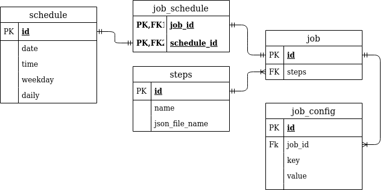

# Datenbank

## Diagramm

## Erklärung

Für die Datenbank wird eine **SQLite** Datenbank verwendet.

> Eine spätere anbindung an einen **SQL** Server ist aber einfach möglich.

Die Tabelle job beinhaltet einen job für eine viedeo reihe. Er hat die id für seine Schritte gespeichert. In der Tabelle schedule wird dann die zeit gespeichert wann der job ausgeführt werden soll. z.B.: Wenn der Job täglich um 12:00Uhr ausgeführt werden soll steht in der Datenbank, _date_ = null, _time_ = 12:00, _weekday_ = null, _daily_ = True. Es sind auch mehrere schedule einträge für einen job möglich. In der Tabelle job_config sethen die config werte die bei der ausführung des jobs verwendet werden. Diese bestehen aus key, value paaren.
