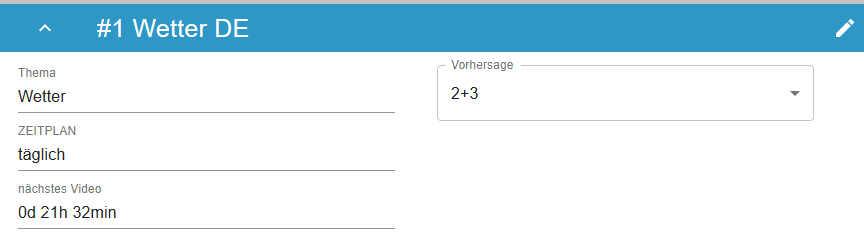

# Dokumentation
## Frontend
### Gui
Die grafische Benutzeroberfläche ist mit mithilfe des Web-Frameworks ReactJS in TypeScript geschrieben und mit der Erweiterung Material-UI designt.
### Struktur
Die Oberfläche besteht aus mehreren Components, welche je nach Bedarf geladen und angezeigt werden. So wird Beispielsweise bei einem Klick auf einen Button keine neue html-Datei geladen, sondern in die aktuelle, der neue `Component`.

<figure>
  
  <figcaption>Abbildung 1</figcaption>
</figure> 

#### index
Die index.html wird vom Browser geladen. Diese beinhaltet den div-Container „root“:
~~~HTML

~~~

In der index.tsx wird mit Hilfe der ID, der Component „App“ in den Container geladen

~~~tsx
ReactDOM.render(
  <React.StrictMode>
    <App />
  </React.StrictMode>,
  document.getElementById("root")
);
~~~

#### App
Der Component „App###“ besteht aus einem „Header“ und einem „Main“ Component. 

Der „Header“ steht immer am Oberen Bildschirmrand daher liegt dieser über „Main“. In „Main“ wird der Inhalt der Seite geladen.

~~~html
<ComponentProvider>
    <Header />
    <Main />
</ComponentProvider>
~~~

#### Header

<figure>
  
  <figcaption>Abbildung 2</figcaption>
</figure>

Der Component „Header“ stellt den Header der Oberfläche dar. Dieser soll durchgehend am oberen Bildschirmrand angezeigt werden. Er zeigt immer an auf welcher Seite des Programmes man sich befindet.

#### Main

~~~tsx
export const Main = () => {
  const component = React.useContext(ComponentContext);
  return <>{component ? <component.current.component /> : null}</>;
};
~~~

„Main“ zeigt immer den aktuellen Component an. Soll sich also die Seite beim Klicken auf einen Button verändern, so muss nur der aktuelle Component (current.component) gesetzt werden.

#### Home

~~~tsx
<Container maxWidth={"md"} className={classes.margin}>
    <Paper variant="outlined" className={classes.paper}>
        {..}
        <JobList/>
    </Paper>
</Container>

~~~

„Home“ stellt die Startseite dar. Auf dieser wird eine Liste aller angelegten Jobs angezeigt. Dazu gibt es den Component „JobList“.

#### JobList

~~~tsx
{jobInfo.map(j =>
    

        <JobItem/>
    
)
}
~~~

In dem Component „JobList“ wird pro angelegten Job ein Component von „JobItem“ generiert.

#### JobItem
<figure>
  
  <figcaption>Abbildung 3</figcaption>
</figure>

Ein JobItem besteht aus den genaueren Informationen zu einem Job. 

#### JobCreate
Möchte man einen neuen Job erstellen, so wird bei dem klicken auf den dazugehörigen Button der Component „JobCreate“ in den Main-Component geladen.

~~~tsx
onClick={() => components?.setCurrent("jobpage")}
~~~

Daraufhin wird ein Stepper geladen, welcher aus drei Seiten besteht.

<figure>
  
  <figcaption>Abbildung 4</figcaption>
</figure>

#### TopicSelection
Die erste Seite „TopicSelection“ dient zur Auswahl des Themas. Dort kann man sich für eines der vorgegebenen Themen entscheiden und einen Namen für den Job festlegen.

<figure>
  
  <figcaption>Abbildung 5</figcaption>
</figure>

#### ParamSelection
Die zweite Seite des Steppers gibt einem die Möglichkeit je nach Thema individuelle Angaben zu tätigen. So kann bei einem Wetterbericht z.B. der gewünschte Ort angegeben werden.

<figure>
  
  <figcaption>Abbildung 6</figcaption>
</figure>

ScheduleSelection
Auf der letzten Seite kann der Benutzer auswählen, wie häufig ein Video generiert werden soll.

**täglich:** Das Video wird täglich zu einer bestimmten Uhrzeit generiert  
**wöchentlich:** Das Video wird an bestimmten Wochentagen wöchentlich generiert  
**an festem Datum:** Das Video wird einmalig an einem Datum generiert.

<figure>
  
  <figcaption>Abbildung 7</figcaption>
</figure>

## Web-API
### Datenbank
Für die Datenbank wird eine SQLite Datenbank verwendet. 

_(Eine spätere Anbindung an einen SQL-Server ist aber einfach möglich.)_

Die Tabelle „job“ beinhaltet einen Job für eine Videoreihe. Diese hat die ID für seine Schritte gespeichert. In der Tabelle „schedule“ wird die Zeit gespeichert, an welcher der Job ausgeführt werden soll. z.B.: Wenn der Job täglich um 12:00 Uhr ausgeführt werden soll, steht in der Datenbank, 

date = null,  
time = 12:00,  
weekday = null,  
daily = True.  

Es sind auch mehrere Schedule-einträge für einen Job möglich. 

In der Tabelle job_config stehen die Configwerte, die bei der Ausführung des Jobs verwendet werden. Diese bestehen aus key, value paaren.

<figure>
  
  <figcaption>Abbildung 8</figcaption>
</figure>

## Scheduler

<figure>
  
  <figcaption>Abbildung 8</figcaption>
</figure>

Der Scheduler prüft minütlich, ob ein neuer Job ausgeführt werden soll. 

Es gibt zwei Varianten des Schedulers. Der JsonScheduler prüft anhand einer Json-Datei, ob ein Job ausgeführt werden soll. Der DbScheduler hingegen entnimmt die Informationen einer Datenbank und prüft anhand diesen, ob ein Job ausgeführt werden soll.

``start()``  
Diese Methode startet den Scheduler.

``_check_all()``  
Nachdem der Scheduler gestartet wurde, wird in dieser Methode jede Minute geprüft, ob ein Job auszuführen ist. Ist dies der Fall, so wird die Methode _start_job() aufgerufen.

``_start_job()``  
Diese Methode startet den Job in einem neuen Thread.

## StepData

Dokumentation: https://github.com/SWTP-SS20-Kammer-2/Data-Analytics/blob/i399-documentation-f%C3%BCr-steps-config/Konzepte/StepsConfig/README.md

## API
``api(values: dict, data: StepData)``

``_fetch(url, header, body, method)``

``request(values: dict, data: StepData, name)``

## Transform
Mit den transform-Funktionen werden Funktionen implementiert, mit denen man die aus den API-Request erhaltenen Daten transformieren kann.

**calculate**

_(Auswahl)_

**transform**

_(Auswahl)_

## Processing
### Audio
``part.py``

``audio.py``

``generate_audios()``

### Image
``pillow``

``draw.py``

``overlay.py``

## Sequence
``link(values: dict, step_data: StepData)``

``successively(values: dict, step_data: StepData)``

``custom(values: dict, step_data: StepData)``

``_link(images, audios, audio_l, step_data: StepData, values: dict)``
